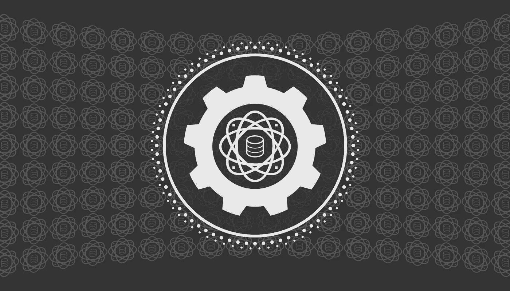

# 每个数据科学家应该学习的五项工程技能

> 原文：[`towardsdatascience.com/five-engineering-skills-every-data-scientist-should-learn-e7a347fada6f?source=collection_archive---------6-----------------------#2024-10-01`](https://towardsdatascience.com/five-engineering-skills-every-data-scientist-should-learn-e7a347fada6f?source=collection_archive---------6-----------------------#2024-10-01)

## 完善帮助你保持竞争力的策略，成为“全栈”数据科学家

 [David Hundley](https://dkhundley.medium.com/?source=post_page---byline--e7a347fada6f--------------------------------)

·发表于 [Towards Data Science](https://towardsdatascience.com/?source=post_page---byline--e7a347fada6f--------------------------------) ·5 分钟阅读·2024 年 10 月 1 日

--

由作者创建的标题卡片

作为一个喜欢引导人们发挥最大潜力的导师，我很高兴能指导许多主修数据科学的本科生。令我吃惊的是，在这些课程中几乎没有教授工程技术。从公立学校的学生到常春藤联盟的大学，我不断听到的都是课程重点放在纯粹的数据科学技能上。虽然这些技能绝对没有错，但它们却留下了一个巨大的空白，使得数据科学家无法成为一个“全栈”数据科学家。

所谓“全栈”，我并不一定指像学习网页开发这类的事情。我的具体意思是能够在生产环境中使用你的预测模型。这是一套技能，知道如何构建模型；而另一套技能是知道如何让其他人使用它！

幸运的是，我认为这比纯粹的数据科学工作本身更容易学习。你不一定需要在这些技能中成为专家，但拥有基础的知识仍然很重要。根据你最终进入的公司，作为一名数据科学家，可能会有这样的期望……
