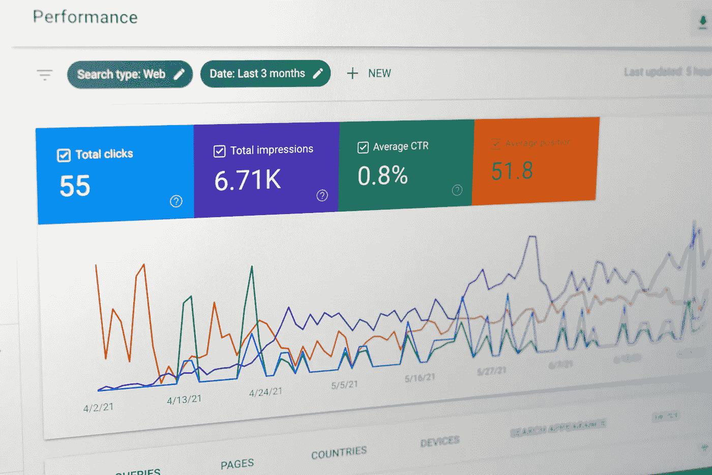

# 五个你无法忽视不懂按大小比例抽样（PPS）概率抽样的理由

> 原文：[`towardsdatascience.com/five-reasons-you-cannot-afford-not-knowing-probability-proportional-to-size-pps-sampling-773fee96af8b?source=collection_archive---------7-----------------------#2024-11-28`](https://towardsdatascience.com/five-reasons-you-cannot-afford-not-knowing-probability-proportional-to-size-pps-sampling-773fee96af8b?source=collection_archive---------7-----------------------#2024-11-28)

## 数据科学

## 简单随机抽样（SRS）有效，但如果你不了解按大小比例抽样（PPS），你就可能犯下一些严重的统计学错误。了解为什么、何时以及如何使用 PPS 抽样！

[](https://chaayushmalik.medium.com/?source=post_page---byline--773fee96af8b--------------------------------)[](https://towardsdatascience.com/?source=post_page---byline--773fee96af8b--------------------------------) [Aayush Malik](https://chaayushmalik.medium.com/?source=post_page---byline--773fee96af8b--------------------------------)

·发布于[Towards Data Science](https://towardsdatascience.com/?source=post_page---byline--773fee96af8b--------------------------------) ·阅读时间 6 分钟·2024 年 11 月 28 日

--



图片由[Justin Morgan](https://unsplash.com/@justin_morgan?utm_content=creditCopyText&utm_medium=referral&utm_source=unsplash)提供，来源于[Unsplash](https://unsplash.com/photos/a-computer-screen-with-a-bunch-of-data-on-it-VxLhYXuLQN8?utm_content=creditCopyText&utm_medium=referral&utm_source=unsplash)

Rahul 决定测量来自他在线商店的顾客的“脉搏”。他想知道他们的感受，哪些方面做得好，哪些地方可以改进以提升用户体验。由于他学习过数学，并且了解数字游戏，他决定对 2500 个顾客中的 200 个进行调查。Rahul 使用简单随机抽样（Simple Random Sampling），并得到 200 个独特的顾客 ID。他向他们发送了在线调查，并收到了结果。调查显示，顾客们最主要的问题是结账时缺乏支付选项。Rahul 联系了一些供应商，并投资推出了更多支付选项。不幸的是，六个月后的结果显示，收入并没有显著增加。他的分析失败了，开始怀疑资源是否投入到了正确的地方。

Rahul 忽略了一个最重要的事实：并非所有顾客都是相同的。有些顾客花费更多，有些顾客花费较少，也有些顾客花费很多。不要像 Rahul 一样。要像 Sheila 一样，学习如何使用 PPS 抽样——这是一种确保你最重要（最赚钱）顾客永远不会被忽视的方式——用以进行合理且稳健的统计分析。

## 什么是抽样？

在我讨论 PPS 抽样之前，我会简要介绍一下什么是抽样。抽样是一种统计技术，它允许我们从总体中抽取一部分样本，并利用这部分样本来衡量总体的某些特征。例如，抽取血液样本来检测我们是否患有传染病，抽取米布丁样本来检查糖是否足够，或抽取顾客样本来衡量顾客的整体脉搏。由于我们无法承担对整个总体中每一个单位进行测量的成本，因此最好的方法是抽取样本，然后推断总体特征。在此，给出这个定义就足够了。如果你需要更多关于抽样的信息，互联网上有很多资源。

## 什么是 PPS 抽样？

概率比例抽样（PPS 抽样）是一种抽样技术，其中样本中单位被选中的概率取决于一个定义变量或辅助变量的大小。

什么？？？

让我通过一个例子来解释。假设你有一个在线商店，且有 1000 个顾客。这些顾客中，有一些花费很多，给你的组织带来了大量的收入。这些顾客是非常重要的，你需要确保你的组织以最好的方式服务这些顾客的利益。

如果你想了解这些顾客的情绪，你会更倾向于让你的样本更能代表这些顾客的情况。这正是 PPS 能帮你做到的。如果你使用 PPS 抽样，那么选择那些产生最高收入的顾客的概率也会很高。这是有道理的。在这种情况下，收入是辅助或依赖变量。

## PPS 抽样 vs SRS 抽样

简单随机抽样（SRS）很棒，这一点毋庸置疑，但它并不是你手头唯一的工具。SRS 在顾客*群体同质*的情况下效果最好。不幸的是，对于许多实际的商业应用来说，受众或群体并非同质的。如果你在错误的假设下进行分析，你将得出错误的结论。SRS 抽样给每个单位相同的选取概率，而这与 PPS 抽样不同。

## 为什么我应该使用 PPS 抽样？

正如本文标题所说，你不能不懂 PPS 抽样。以下是五个原因：

1.  **更好的代表性** — 通过优先考虑对你关心的变量（收入）影响较大的单位，你确保了样本具有更好的代表性。这与简单随机抽样（SRS）不同，后者假设每月消费 100 美元的客户与每月消费 1000 美元的客户是平等的。不是的，不是这样的。

1.  **专注于高影响单位** — 根据帕累托法则，你 80%的收入来自 20%的客户。你需要确保不去弄乱这 20%的客户。通过确保样本中这些 20%客户的影响更大，你可以避免自己和他们遭遇任何意外的惊喜。

1.  **资源效率** — 统计学中有一个经验法则，通常情况下，如果你的样本大小为 30，那么你可以接近估算的总体参数。请注意，这只是一个经验法则。PPS 抽样使你能够合理使用你在设计、分发和分析干预措施中拥有的资源。

1.  **提高准确性** — 因为我们对那些对我们关心的变量影响较大的单位给予更大权重，我们的分析也更加准确。单纯使用 SRS 可能无法做到这一点。通过 PPS 抽样，你得到的样本估算会对那些影响较大的单位进行加权。简单来说，你是在为那些付费最多的人工作。

1.  **更好的决策制定** — 当你使用 PPS 抽样时，你是在基于真正重要的数据做决策。如果你仅仅随机抽样客户，可能得到的反馈或见解来自于那些对你收入影响不大的人的意见。而通过 PPS，你专注于重要的客户。这就像是向合适的人提出正确的问题，而不是随便问人群中的任何人。

## Python 中的 PPS 实现

稍微超过六年前，我在 Medium 上写了 [这篇文章](https://chaayushmalik.medium.com/pps-sampling-in-python-b5d5d4a8bdf7)，这是我阅读量最多的文章之一，当你搜索“按大小概率抽样（PPS 抽样）”时，它会出现在第一页。这篇文章展示了如何使用 Python 实现 PPS 抽样以进行代表性抽样。自那时以来，已经过去了很长时间，我在因果推断方面积累了更多经验，我的 Python 技能也有了显著提升。上面链接的代码使用的是系统化的 PPS 抽样，而新代码则使用了随机 PPS 抽样。

这里是新的代码，它可以更高效地完成相同的任务。

```py
import numpy as np
import pandas as pd

# Simulate customer data
np.random.seed(42)  # For reproducibility
num_customers = 1000
customers = [f"C{i}" for i in range(1, num_customers + 1)]

# Simulate revenue data (e.g., revenue between $100 and $10,000)
revenues = np.random.randint(100, 10001, size=num_customers)

customer_data = pd.DataFrame({
    "Customer": customers,
    "Revenue": revenues
})

# Calculate selection probabilities proportional to revenue
total_revenue = customer_data["Revenue"].sum()
customer_data["Selection_Prob"] = customer_data["Revenue"] / total_revenue

# Perform PPS Sampling
sample_size = 60 # decide for your analysis

# the actual PPS algorithm
sample_indices = np.random.choice(
    customer_data.index,
    size=sample_size,
    replace=False,  # No replacement, we are not replacing the units
    p=customer_data["Selection_Prob"]
)

# Extract sampled customers
sampled_customers = customer_data.iloc[sample_indices]

# Display results
print("Sampled Customers:")
print(sampled_customers)
```

## PPS 抽样的挑战

我相信如果你读到这里，你可能在想，PPS 抽样怎么可能没有缺点呢？嗯，它确实有一些缺点。以下是它们。

1.  PPS 抽样比较复杂，可能并不总能得到组织管理层的认同。在这种情况下，数据科学家的工作就是确保以正确的方式解释其好处。

1.  PPS 抽样要求存在一个依赖变量。例如，在我们的案例中，我们选择了收入作为选择单元的变量。如果您从事农业行业，这可以是用于衡量一个作物季节产量的土地面积。

1.  PPS 抽样被认为对影响较小的单元存在偏倚。实际上，它并不偏倚，较小的单元也有被选中的机会，但它们的概率较低。

## 结论

在本文中，我向您解释了什么是 PPS 抽样，为什么它比 SRS 抽样更好且资源更高效，以及如何使用 Python 实现它。我很想听听您在工作中的更多例子，看看您是如何在工作中实现 PPS 的。

**资源**：

1.  PPS 抽样维基百科 [`en.wikipedia.org/wiki/Probability-proportional-to-size_sampling`](https://en.wikipedia.org/wiki/Probability-proportional-to-size_sampling)

1.  Python 中的 PPS 抽样 [`chaayushmalik.medium.com/pps-sampling-in-python-b5d5d4a8bdf7`](https://chaayushmalik.medium.com/pps-sampling-in-python-b5d5d4a8bdf7)
