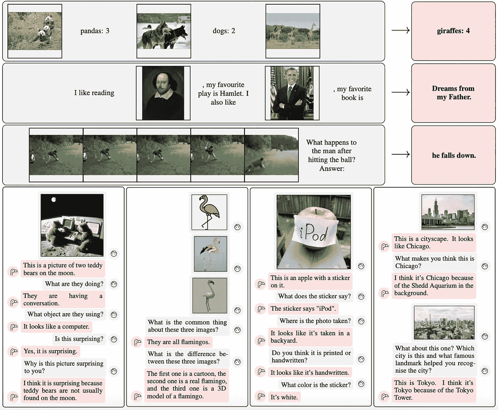

# Flamingo — 直观且全面的解释

> 原文：[`towardsdatascience.com/flamingo-intuitively-and-exhaustively-explained-bf745611238b?source=collection_archive---------5-----------------------#2024-02-16`](https://towardsdatascience.com/flamingo-intuitively-and-exhaustively-explained-bf745611238b?source=collection_archive---------5-----------------------#2024-02-16)

## 多模态建模 | 计算机视觉 | 自然语言处理

## 现代视觉语言建模的架构

 [Daniel Warfield](https://medium.com/@danielwarfield1?source=post_page---byline--bf745611238b--------------------------------)

·发表于[Towards Data Science](https://towardsdatascience.com/?source=post_page---byline--bf745611238b--------------------------------) ·阅读时间：25 分钟·2024 年 2 月 16 日

--

“Flamingo”由 Daniel Warfield 使用 MidJourney 制作，所有图像由作者提供，除非另有说明。

在本文中，我们将讨论 Flamingo，这是一篇在“多模态建模”领域具有里程碑意义的论文。

首先，我们将定义“多模态模型”这一类机器学习模型，这些模型能够理解多种类型的数据。接下来，我们将简要回顾图像分类和文本生成领域的里程碑论文，然后描述 Flamingo 如何将这些技术结合起来，在同时包含图像和文本的用例中实现最先进的性能。

在本文结束时，你将对 Flamingo 如何实现先进的性能有透彻的理解，为今天像 GPT-4 和 Google Gemini 这样的高级 AI 系统铺平道路。

Flamingo 进行文本与图像的对话。粉色框中的内容是由 Flamingo 模型生成的，来自 Flamingo 论文。[链接](https://arxiv.org/pdf/2204.14198.pdf)

**这对谁有用？** 任何对自然语言处理、计算机视觉或多模态建模感兴趣的人。

**这篇文章有多高级？** 这是一篇中级文章，假设读者具备一些机器学习的基础知识。
