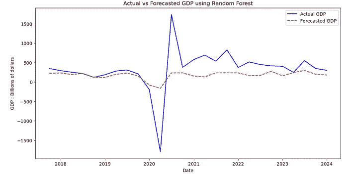

# 使用机器学习和数学预测美国 GDP

> 原文：[`towardsdatascience.com/forecasting-us-gdp-using-machine-learning-and-mathematics-62f3f794d690?source=collection_archive---------2-----------------------#2024-07-24`](https://towardsdatascience.com/forecasting-us-gdp-using-machine-learning-and-mathematics-62f3f794d690?source=collection_archive---------2-----------------------#2024-07-24)

## 我们能从这个现代问题中学到什么？

[](https://medium.com/@dmongia_35626?source=post_page---byline--62f3f794d690--------------------------------)[](https://towardsdatascience.com/?source=post_page---byline--62f3f794d690--------------------------------) [Dron Mongia](https://medium.com/@dmongia_35626?source=post_page---byline--62f3f794d690--------------------------------)

·发布于[Towards Data Science](https://towardsdatascience.com/?source=post_page---byline--62f3f794d690--------------------------------) ·14 分钟阅读·2024 年 7 月 24 日

--


图片来自[Igor Omilaev](https://unsplash.com/@omilaev?utm_source=medium&utm_medium=referral)于[Unsplash](https://unsplash.com/?utm_source=medium&utm_medium=referral)

# **动机：我们为什么要预测美国 GDP？**

GDP 是衡量一个国家经济福祉的一个非常重要的指标；因此，预测这一指标非常受关注。例如，政策制定者和立法者可能希望在通过新法案或法律之前对国家 GDP 的趋势做出粗略预测。研究人员和经济学家也会在各种学术和工业领域的工作中考虑这些预测。

# **过程：我们如何接近这个问题？**

与许多其他时间序列问题类似，GDP 预测遵循一个一般性的工作流程。

1.  通过使用集成的 FRED（联邦储备经济数据）库和 API，我们将通过构建一个包含美国 GDP 及其他密切相关指标的数据框来创建我们的特征（GDP = 消费 + 投资 + 政府支出 + 净出口）

1.  通过使用多种统计检验和分析方法，我们将探索数据的细微差别，以更好地理解特征之间潜在的关系。

1.  最后，我们将利用多种统计和机器学习模型来得出哪种方法能带给我们最准确和高效的预测结果。

在所有这些步骤中，我们将深入探讨支持我们检验和模型的基本数学框架的细微差别。

# **步骤 1：特征创建**

为了构建这个项目的数据集，我们将利用 FRED（联邦储备经济数据）API，这是收集经济数据的首选应用程序。请注意，要使用这些数据，必须在 FRED 网站上注册账户并申请一个自定义 API 密钥。

网站上的每个时间序列都与一个特定的字符串相连接（例如，GDP 连接到“GDP”，净出口连接到“NETEXP”等）。这一点非常重要，因为当我们调用每个特征时，我们需要确保指定正确的字符串来配合它。

记住这一点，现在让我们构建数据框：

```py
#used to label and construct each feature dataframe.
def gen_df(category, series):
    gen_ser = fred.get_series(series, frequency='q')
    return pd.DataFrame({'Date': gen_ser.index, category + ' : Billions of dollars': gen_ser.values})
#used to merge every constructed dataframe.
def merge_dataframes(dataframes, on_column):
    merged_df = dataframes[0]
    for df in dataframes[1:]:
        merged_df = pd.merge(merged_df, df, on=on_column)
    return merged_df
#list of features to be used 
dataframes_list = [
    gen_df('GDP', 'GDP'),
    gen_df('PCE', 'PCE'),
    gen_df('GPDI', 'GPDI'),
    gen_df('NETEXP', 'NETEXP'),
    gen_df('GovTotExp', 'W068RCQ027SBEA')
]
#defining and displaying dataset
data = merge_dataframes(dataframes_list,'Date')
data
```

注意，由于我们已经定义了函数，而不是静态代码块，因此我们可以自由地扩展我们的特征列表以进行进一步测试。运行这段代码后，我们得到的数据框如下：


（最终数据集）

我们注意到我们的数据集从 1960 年代开始，这为我们提供了一个相当广泛的历史背景。此外，从数据框的形状来看，我们有 1285 个实际经济数据实例，这个数量虽然不算小，但也不算大。这些观察将在我们建模阶段发挥作用。

# **步骤 2：探索性数据分析**

现在我们的数据集已经初始化，我们可以开始可视化并进行测试，从而获取一些关于数据行为及其特征之间关系的洞察。

**可视化（折线图）：**

我们分析这个数据集的第一个方法是将每个特征绘制在同一图表上，以便捕捉一些模式。我们可以编写以下代码：

```py
#separating date column from feature columns
date_column = 'Date'
feature_columns = data.columns.difference([date_column])
#set the plot 
fig, ax = plt.subplots(figsize=(10, 6))
fig.suptitle('Features vs Time', y=1.02)
#graphing features onto plot
for i, feature in enumerate(feature_columns):
    ax.plot(data[date_column], data[feature], label=feature, color=plt.cm.viridis(i / len(feature_columns)))
#label axis
ax.set_xlabel('Date')
ax.set_ylabel('Billions of Dollars')
ax.legend(loc='upper left', bbox_to_anchor=(1, 1))
#display the plot 
plt.show()
```

运行代码后，我们得到的结果是：


（特征之间的绘图）

看图时，我们注意到一些特征与 GDP 的相似度远高于其他特征。例如，GDP 和 PCE 几乎遵循完全相同的趋势，而 NETEXP 则没有明显的相似性。虽然可能会很诱人，但我们在进行更多探索性测试之前，还不能开始选择并去除某些特征。

**ADF（增强型迪基-富勒）检验：**

ADF（增强型迪基-富勒）检验通过检查单位根的存在来评估特定时间序列的平稳性，单位根是定义时间序列为非平稳性的特征。平稳性本质上意味着时间序列具有恒定的均值和方差。进行此测试非常重要，因为许多流行的预测方法（包括我们在建模阶段将使用的方法）需要平稳性才能正常运行。


单位根公式

尽管通过观察图表我们可以确定大多数时间序列的平稳性，但进行测试仍然是有益的，因为我们可能会在后续的预测阶段重用这些测试。使用 Statsmodel 库，我们编写如下代码：

```py
from statsmodels.tsa.stattools import adfuller
#iterating through each feature
for column in data.columns:
    if column != 'Date':
        result = adfuller(data[column])
        print(f"ADF Statistic for {column}: {result[0]}")
        print(f"P-value for {column}: {result[1]}")
        print("Critical Values:")
        for key, value in result[4].items():
            print(f"  {key}: {value}")
#creating separation line between each feature
        print("\n" + "=" * 40 + "\n")
```

得到的结果是：


（ADF 测试结果）

我们在这个测试中关注的数字是 P 值。接近零的 P 值（等于或小于 0.05）表示平稳性，而接近 1 的 P 值则表示非平稳性。我们可以看到，所有的时间序列特征由于其统计上不显著的 P 值，都是高度非平稳的，换句话说，我们无法拒绝关于单位根不存在的零假设。下面是我们其中一个特征的测试简单可视化表示。红色虚线表示我们能够确定时间序列特征是否平稳的 P 值，而蓝色框表示该特征当前的 P 值。


（NETEXP 的 ADF 可视化）

**VIF（方差膨胀因子）测试：**

查找每个特征的方差膨胀因子（VIF）的目的是检查多重共线性，或者预测变量之间的相关程度。高多重共线性不一定对我们的预测有害，但它会使我们更难确定每个特征时间序列对预测的单独影响，从而影响模型的可解释性。

在数学上，计算如下：


（预测变量的方差膨胀因子）

其中，*X*j 表示我们选择的预测变量，*R*²j 是我们特定预测变量的决定系数。将此计算应用于我们的数据，我们得出以下结果：


（每个特征的 VIF 评分）

显然，我们的预测变量之间有非常紧密的关联。VIF 得分大于 5 意味着多重共线性，而我们特征所获得的得分远远超过了这个值。可以预见，PCE 的得分最高，这也是可以理解的，因为其在线图上的形状与许多其他特征相似。

# 第 3 步：建模

现在，我们已经深入分析了数据，以更好地理解每个特征之间的关系和特征的性质，我们将开始对数据集进行修改，以便为建模做准备。

**通过差分实现平稳性**

为了开始建模，我们首先需要确保数据是平稳的。我们可以使用一种叫做差分的方法来实现，这本质上是通过类似上述测试的数学公式来转换原始数据。

该概念在数学上定义为：


（一阶差分方程）

这使得我们从特征中去除了非线性趋势，从而得到了一个常数序列。换句话说，我们从时间序列中提取出值，并计算与前一个点之间发生的变化。

我们可以将这个概念应用于我们的数据集，并使用以下代码检查之前使用的 ADF 测试结果：

```py
#differencing and storing original dataset 
data_diff = data.drop('Date', axis=1).diff().dropna()
#printing ADF test for new dataset
for column in data_diff.columns:
    result = adfuller(data_diff[column])
    print(f"ADF Statistic for {column}: {result[0]}")
    print(f"P-value for {column}: {result[1]}")
    print("Critical Values:")
    for key, value in result[4].items():
        print(f"  {key}: {value}")

    print("\n" + "=" * 40 + "\n") 
```

运行此代码后结果为：


（差分数据的 ADF 检验）

我们注意到新的 p 值小于 0.05，这意味着我们现在可以拒绝原假设，即我们的数据集是非平稳的。查看新数据集的图表证实了这一断言：


（差分数据的图表）

我们看到所有的时间序列现在都集中在 0 附近，均值和方差保持不变。换句话说，我们的数据现在明显展示了平稳系统的特征。

**VAR（向量自回归）模型**

VAR 模型的第一步是执行**Granger 因果关系检验**，它将告诉我们哪些特征对我们的预测具有统计学意义。该测试告诉我们，特定时间序列的滞后版本是否可以帮助我们预测目标时间序列，但并不一定意味着一个时间序列导致了另一个时间序列（请注意，统计学中的因果关系是一个更难证明的概念）。

使用 StatsModels 库，我们可以按如下方式应用测试：

```py
from statsmodels.tsa.stattools import grangercausalitytests
columns = ['PCE : Billions of dollars', 'GPDI : Billions of dollars', 'NETEXP : Billions of dollars', 'GovTotExp : Billions of dollars']
lags = [6, 9, 1, 1] #determined from individually testing each combination

for column, lag in zip(columns, lags):
    df_new = data_diff[['GDP : Billions of dollars', column]]
    print(f'For: {column}')
    gc_res = grangercausalitytests(df_new, lag)
    print("\n" + "=" * 40 + "\n")
```

运行代码后会生成以下表格：


（Granger 因果关系检验的示例，涉及两个特征）

在这里，我们只关心每个特征的单个滞后，其 p 值具有统计学意义（>0.05）。例如，由于在第一个滞后时，NETEXP 和 GovTotExp 都具有统计学意义，因此我们会将这两个特征考虑进 VAR 模型。个人消费支出可能没有达到这一标准（见笔记本），但是第六个滞后非常接近，因此我决定保留它。下一步是创建我们的 VAR 模型，因为我们已经决定所有特征在 Granger 因果关系检验中都是显著的。

VAR（向量自回归）模型可以利用不同的时间序列来衡量模式，并确定一个灵活的预测。数学上，该模型由以下公式定义：


（向量自回归模型）

其中 *Y*t 是某一时刻 t 的时间序列，*A*p 是已确定的系数矩阵。我们实际上是在利用时间序列的滞后值（在我们的案例中是其他时间序列）来预测 *Y*t。了解这一点后，我们现在可以将该算法应用于 data_diff 数据集，并评估结果：


（评估指标）


（VAR 模型的实际与预测 GDP 对比）

通过查看这个预测，我们可以清楚地看到，尽管在使用的两个评估指标（MAE 和 MAPE）上严重偏离，但我们的模型在视觉上并不太不准确，除了因疫情引起的异常值外。从 2018 到 2019 年，以及从 2022 到 2024 年，我们基本上维持在测试线附近，然而随后的全球事件显然带来了一些不可预测性，影响了模型准确判断趋势的能力。

**VECM（向量误差修正模型）**

VECM（向量误差修正模型）与 VAR 相似，尽管有一些关键的不同之处。与 VAR 不同，VECM 不依赖于平稳性，因此差分和归一化时间序列不再是必须的。VECM 还假设存在**协整**，即时间序列之间的长期均衡。在数学上，我们将模型定义为：


（VECM 模型方程）

这个方程类似于 VAR 方程，其中Π是一个系数矩阵，是另外两个矩阵的乘积，并且计算我们时间序列*Y*t 的滞后版本的和。记住要在我们的原始（非差分）数据集上拟合模型，得到以下结果：


（VECM 的实际 GDP 与预测 GDP）

尽管由于我们现在使用的是非平稳数据，与 VAR 模型相比很难进行直接比较，但我们仍然可以通过误差度量和可视化结果推断出该模型未能准确捕捉到此预测中的趋势。因此，可以公平地说，我们可以排除传统统计方法来解决这个问题。

**机器学习预测**

在决定使用哪种机器学习方法来建模这个问题时，我们需要牢记我们所处理的数据量。在创建滞后列之前，我们的数据集总共有 1275 个观测值跨越所有时间序列。这意味着使用更复杂的方法，如 LSTM 或梯度提升，可能是多余的，因为我们可以使用一个更简单的模型来获得相同的准确度，同时具有更高的可解释性。

**训练-测试集划分**

时间序列问题的训练-测试集划分与传统回归或分类任务中的划分略有不同（请注意，我们在 VAR 和 VECM 模型中也使用了训练-测试集划分，但在机器学习部分讨论更为合适）。我们可以在差分数据上执行训练-测试集划分，使用以下代码：

```py
#90-10 data split
split_index = int(len(data_diff) * 0.90)
train_data = data_diff.iloc[:split_index]
test_data = data_diff.iloc[split_index:]
#Assigning GDP column to target variable 
X_train = train_data.drop('GDP : Billions of dollars', axis=1)
y_train = train_data['GDP : Billions of dollars']
X_test = test_data.drop('GDP : Billions of dollars', axis=1)
y_test = test_data['GDP : Billions of dollars']
```

在这里，我们必须确保不打乱我们的数据，因为这意味着我们在使用未来的数据进行训练，从而可能会导致数据泄漏。


时间序列数据上训练-测试集划分的示例

同时进行比较时，请注意我们正在训练数据的很大一部分（90%），而在常见的回归任务中通常训练 75%的数据。这是因为从实际操作角度看，我们并不关心预测一个很长的时间范围。实际上，即使是预测几年的数据，对于这个任务来说也是不太可能的，因为现实世界的时间序列数据具有很强的不确定性。

**随机森林**

记得我们之前做的 VIF 测试，知道我们的特征之间高度相关。这在一定程度上促使我们选择随机森林作为机器学习模型之一。决策树在特征之间做出二元选择，这意味着理论上特征之间的高度相关性对模型不会造成不利影响。


传统二叉决策树的示例，用于构建随机森林模型

此外，随机森林通常是一个非常强大的模型，因为它能够抵抗由于树的计算方式中的随机性所带来的过拟合。每棵树使用的是整个特征空间的一个随机子集，这意味着某些特征不太可能主导模型。构建完单个树之后，结果会被平均化，从而使用每个个体学习器做出最终预测。

我们可以使用以下代码将模型应用到我们的数据集：

```py
from sklearn.ensemble import RandomForestRegressor
#fitting model 
rf_model = RandomForestRegressor(n_estimators=100, random_state=42)
rf_model.fit(X_train, y_train)

y_pred = rf_model.predict(X_test)
#plotting results
printevals(y_test,y_pred)
plotresults('Actual vs Forecasted GDP using Random Forest')
```

运行此代码会得到以下结果：


（随机森林的评估指标）



（随机森林的实际与预测 GDP 对比）

我们可以看到，随机森林能够提供我们迄今为止最佳的预测，获得了比 VAR 和 VECM 模型更好的误差指标。或许最令人印象深刻的是，从视觉上看，我们可以看到模型几乎完美地呈现了 2017–2019 年的数据，恰好是在遭遇异常值之前。

**K 最近邻**

KNN（K-最近邻）是我们尝试的最后一个方法。选择这个模型的部分原因是因为特征与观测的比例。KNN 是一种基于距离的算法，我们处理的数据特征空间相对较小，而观测数量较多。

要使用该模型，我们首先需要选择一个超参数*k*，它定义了数据映射到的邻居数。较高的*k*值意味着模型更偏向某些特征，而较低的*k*值则意味着模型可能会出现过拟合。我们可以使用以下代码选择最优的*k*值：

```py
from sklearn.neighbors import KNeighborsRegressor
#iterate over all k=1 to k=10
for i in range (1,10):
    knn_model = KNeighborsRegressor(n_neighbors=i)
    knn_model.fit(X_train, y_train)

    y_pred = knn_model.predict(X_test)
#print evaluation for each k
    print(f'for k = {i} ')
    printevals(y_test,y_pred)
    print("\n" + "=" * 40 + "\n")
```

运行此代码会得到：


（比较不同 k 值的准确度）

我们可以看到，当*k*=2 时，我们获得了最佳的准确度度量值。超过这个值后，模型会随着*k*值的增加而变得越来越偏向某些特征。了解这一点后，我们可以将模型应用到我们的数据集中：

```py
#applying model with optimal k value
knn_model = KNeighborsRegressor(n_neighbors=2)
knn_model.fit(X_train, y_train)

y_pred = knn_model.predict(X_test)

printevals(y_test,y_pred)

plotresults('Actual vs Forecasted GDP using KNN')
```

结果是：


（KNN 的评估指标）


（KNN 的实际与预测 GDP 对比）

我们可以看到，KNN 本身表现得非常好。尽管在误差度量上稍微被随机森林超越，但从视觉效果来看，模型的表现几乎相同，甚至可以说在 2018–2019 年疫情爆发前的那一段时间，KNN 的表现要比随机森林更好。

# **结论**

通过查看我们所有的模型，我们可以看到表现最好的模型是随机森林。这很可能是因为随机森林大多数情况下是一个非常强大的预测模型，能够适应多种数据集。总体来说，机器学习算法远远超过了传统的统计方法。或许可以解释的是，VAR 和 VECM 都需要大量的历史背景数据才能最优运行，而我们由于数据是按季度间隔获取的，历史数据并不充足。此外，也可以说，这两种机器学习模型都是非参数模型。这些模型通常假设较少，因此可能对像这里这样的独特问题集更具灵活性。下面是我们最终的最佳预测，去除了之前为拟合模型而使用的差分变换。


(随机森林的实际 GDP 与预测 GDP（未差分）)

# 挑战与改进方向

就这个预测问题而言，最大的挑战无疑是处理疫情引起的大量离群值，以及疫情之后的持续不稳定。显然，我们的预测方法无法预测这种情况的发生，最终导致每种方法的准确性下降。如果我们的目标是预测过去十年的数据，我们的模型可能会更容易发现和预测趋势。在改进和进一步研究方面，我认为一个可能的解决方案是对 2020-2024 年的时间区间进行某种归一化和离群值平滑技术处理，然后在新季度数据到来时评估我们的完全训练好的模型。此外，纳入对 GDP 有重大影响的新特征，例如季度通货膨胀率和个人资产评估，可能会是有益的。

# 参考文献

对于传统统计方法 — [`link.springer.com/book/10.1007/978-1-4842-7150-6`](https://link.springer.com/book/10.1007/978-1-4842-7150-6) , [`www.statsmodels.org/stable/generated/statsmodels.tsa.vector_ar.vecm.VECM.html`](https://www.statsmodels.org/stable/generated/statsmodels.tsa.vector_ar.vecm.VECM.html)

对于机器学习方法 — [`www.statlearning.com/`](https://www.statlearning.com/)

对于数据集 — [`fred.stlouisfed.org/docs/api/fred/`](https://fred.stlouisfed.org/docs/api/fred/)

FRED 为任何拥有 API 密钥的用户提供许可的、免费的数据集，详细信息请参阅此处 — [`fredhelp.stlouisfed.org/fred/about/about-fred/what-is-fred/`](https://fredhelp.stlouisfed.org/fred/about/about-fred/what-is-fred/)

所有未在图片说明中特别注明的图片归我所有。

# 笔记本

请注意，为了运行此笔记本，您必须在 FRED 网站上创建一个帐户，申请一个 API 密钥，并将该密钥粘贴到笔记本的第二个单元格中。

[`github.com/Dronmong/GDP-Forecast`](https://github.com/Dronmong/GDP-Forecast)
