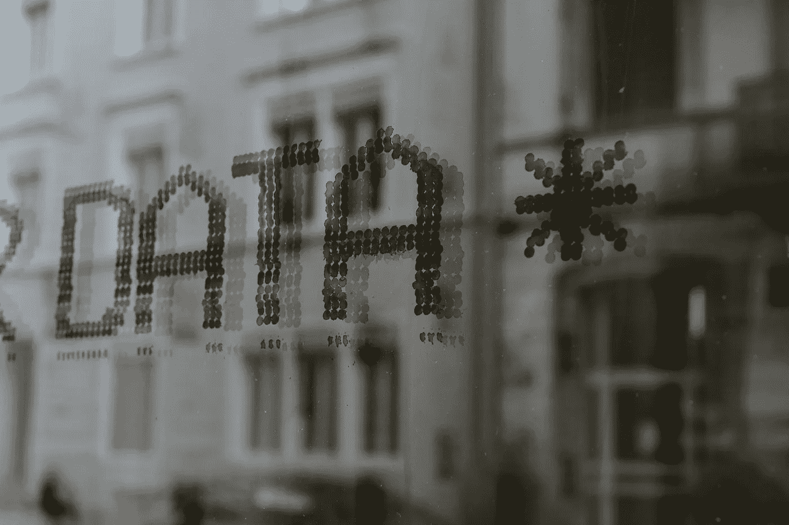
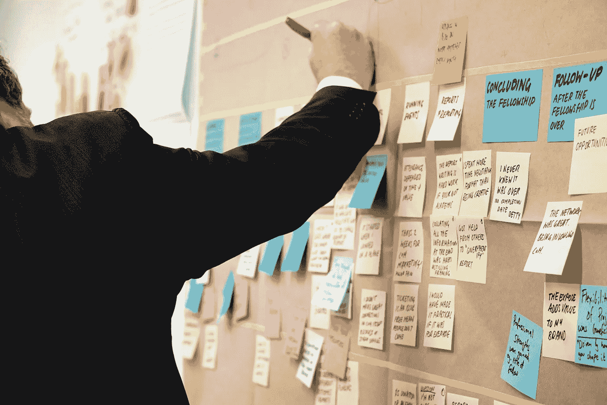
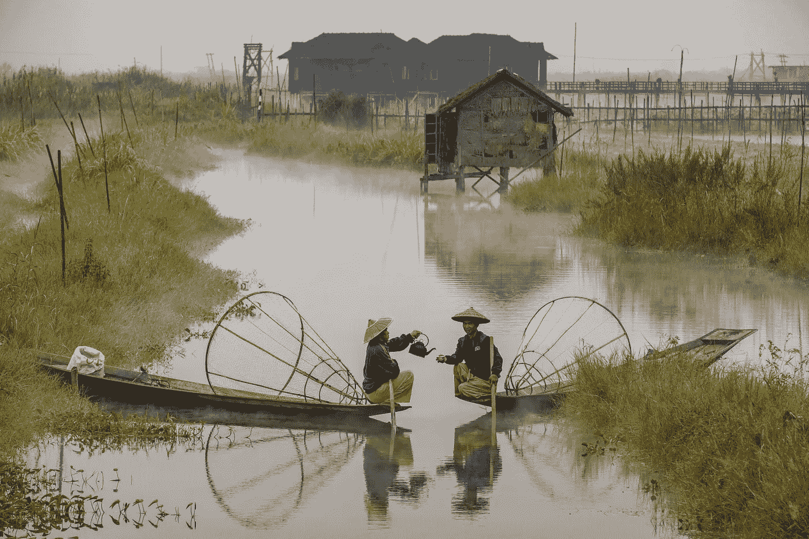

# 铸造新的职业身份：从数据、机器学习（ML）、人工智能（AI）、产品，到领导者、教练、单人创业者和作家

> 原文：[`towardsdatascience.com/forging-new-professional-identities-from-data-ml-ai-product-to-leader-coach-solopreneur-3715e6ee46ca?source=collection_archive---------10-----------------------#2024-04-25`](https://towardsdatascience.com/forging-new-professional-identities-from-data-ml-ai-product-to-leader-coach-solopreneur-3715e6ee46ca?source=collection_archive---------10-----------------------#2024-04-25)

## 我正在标志着职业生涯的转折点——重新定义“工作”对我而言的意义，巩固我的学习，并放下那些需要抛弃的东西，为我前方的新成长腾出空间。

 [Varsha Lalwani](https://lalwanivarsha.medium.com/?source=post_page---byline--3715e6ee46ca--------------------------------)

·发布于[Towards Data Science](https://towardsdatascience.com/?source=post_page---byline--3715e6ee46ca--------------------------------) ·9 分钟阅读·2024 年 4 月 25 日

--

2024 年对我来说是一个在许多方面都充满转变的年份——无论是职业上还是个人生活上。2 月，我决定暂时告别我的企业职业，探索作为一名执行与领导力教练的新事业，但在过去几个月里，我感觉缺少了什么。然后我意识到，在我转向下一阶段之前，我没有进行我的仪式性总结，记录下过去 4 年作为产品经理的旅程、成功与收获。

因此，本文是为了延续我每次经历重大变化时都会做的传统——将我从事数据、机器学习（ML）和人工智能（AI）工作以及在全球范围内构建产品九年中的所有收获和教训汇总在一起，探讨我为什么选择这些年所做的一切，并对身份认同和自我价值发表看法。

附注：你可以在以下链接中找到我关于之前转型的相关文章：数据科学在绩效营销中的应用经验、[大规模防欺诈的学习经验](https://medium.com/illumination/how-to-protect-your-incentive-based-marketing-strategy-from-fraud-ffbcee7af33f)、[机器学习优化个性化的观察](https://lalwanivarsha.medium.com/why-is-personalization-still-largely-an-unsolved-problem-ce062da997c2)、以及[数据产品管理的理解](https://bootcamp.uxdesign.cc/the-what-and-the-how-of-data-product-management-4de636db5fc3)。

## **我为何热爱数据科学和机器学习？**

我从 2015 年到 2020 年在不同规模和能力的公司中担任数据科学家，跨越了不同的大陆。2021 年到 2024 年，我继续构建更多的数据、机器学习和人工智能产品。我似乎永远都不够。为什么？因为我从未觉得自己对解决问题的多样性感到厌倦，**我总是有东西可以学习，而且这些概念可以跨行业应用，解决许多具有高影响力的问题——这种多样性和可能性真的很让人上瘾：**

作为一名大数据和 Hadoop 工程师，我通过用 C、Java、SQL、Scala 和 Pyspark 编程来构建机器学习库。我使用 SQL 查询编写了推荐系统，并为一家初创公司构建了文本分析工具和预测模型，作为团队中唯一的数据科学家。我有机会构建基于机器学习的防欺诈系统、预订预测、自动竞价、个性化推荐，甚至自然语言处理产品。我曾在 B2B SaaS、电商、旅游、广告技术、教育技术和数据公益等领域工作。

**这个列表是无穷无尽的。** 我依然有更多的领域希望去工作，利用数据和基于机器学习的优化来解决一些真正具有挑战性的问题：供应链、物流和气候是我最想探索的领域。某一天。

摄影师：[Claudio Schwarz](https://unsplash.com/@purzlbaum?utm_source=medium&utm_medium=referral) 通过 [Unsplash](https://unsplash.com/?utm_source=medium&utm_medium=referral)

我曾有机会构建、指导并领导团队——有时甚至在我还没有准备好承担这些责任的时候。我曾指导过人们硬技能的学习，如 SQL、机器学习基础、Python、自动化工作流和数据管道。我还辅导过人们软技能的提升，如沟通、利益相关者管理、组织能力和面试技巧。总是有很多东西可以交换和合作。

数据科学在我心中始终占有特殊的位置——它是我职业生涯的起点，也是最让我产生共鸣的领域——**赋予了我自由和灵活性，让我能在不需要做太多改变的情况下，探索无限的可能性。** ❤

## 是什么让我在数据科学热潮的巅峰时期转向产品管理的？

来自一个高度技术背景，我一直对学习非技术和商业方面的知识充满好奇——就好像是想补全自己缺失的那一半。我在初创公司工作时接触到了一些相关话题，然后作为数据科学家，我被安排在一个显然比产品更接近商业的市场职能中。回顾过去，我非常感激这一安排，因为我开始认识到，非技术职能在确保业务成功中的关键作用。

我决定寻找一个处于数据、技术、商业和领导力交汇点的角色，发现产品管理非常适合我，满足了我大部分的标准。当时我的一位经理投入了大量的心血和精力帮助我顺利过渡，没有他的支持，我认为我无法如此顺利和迅速地完成过渡！❤

因此，我对在更多商业领域和领导力方面成长的好奇心，促使我担任了产品管理角色。我对这个选择心怀感激——超越舒适区挑战自己是一个不错的挑战！

## 我从这两段经历中学到了什么？

我学到了很多，不仅仅是关于产品开发、人员、流程和商业战略，也包括关于我自己！我学到，我喜欢将事物从 1 发展到 10，而不是从 0 发展到 1。我发现，我喜欢与跨职能团队合作，我真的很擅长给混乱带来结构，协调跨职能的利益相关者，构建长期的产品愿景、战略和路线图，最有趣的是，挑选那些没有人关注的事情/项目！🤷‍♀

图片由[Jo Szczepanska](https://unsplash.com/@joszczepanska?utm_source=medium&utm_medium=referral)提供，来自[Unsplash](https://unsplash.com/?utm_source=medium&utm_medium=referral)

我还学到，来自数据背景的我，比起产品管理中的前端/用户体验方面，更喜欢数据和机器学习优化问题，软件工程开发与数据科学/机器学习开发是截然不同的，数据胜过政治，我更喜欢在协作型的环境中工作而非竞争型的环境中，并且，我们仍然才刚刚开始进入数据产品时代。

我接触了不同的社区，建立了更强的网络，结识了数据/机器学习/人工智能、产品领域以及二者结合的人们——其中一些人随着时间的推移我偶尔还会再次相遇！我找到了出色的导师和支持者，帮助我不断前进。作为回报，我也指导了许多有意探索类似职业轨迹的人。

我有机会通过小组讨论、会议演讲、技术博客和工作坊，先后以数据科学家和产品经理的身份展示自己。我见证了自己的产品发布，也经历了成功与失败。

我观察了许多来自不同组织、不同职位等级、不同职能的领导，观察他们在不同情况下的领导风格。最重要的是，我挑选出他们的最佳技能来复制——沟通、战略思维、处理冲突、变革管理、应对“黑天鹅”事件（即疫情）、流程效率、利益相关者管理、人才发展、向上管理、促进协作、以初学者心态解决问题、决策框架、承担责任、设定边界等等。

我还学会了在某些情况下如何**避免领导**，无论是通过观察还是通过别人对我的工作风格的反馈。总体来说，探索和实验，找到我自己真正的领导风格，是一次非常不错的经历！

回想起来，**这两个角色中最让我满足的部分是我与之共事的人**——正是他们让这段经历既有趣又充实——即使在困难时期，尤其是在挑战时期！那时我意识到，无论我做什么工作，都必须以人为中心——不是业务，不是产品，而是那些每天让它们变得真实的人。当然，产品和业务会带来需要协作解决的问题，但只要和优秀的人们有合作——我发现自己在工作中是快乐且充实的！

## 那是什么让我在 AI 产品经理成为热门职业时选择暂时放下我的 PM 生涯呢？

坦率地说，**我真的感到很疲惫**。自 2009 年起，我已经 15 年没有停歇地学习和工作了。与此同时，我换过国家，经历了两次职业转型，曾在 5 家公司工作，还尝试过创业并且关闭了公司——是时候从公司工作中暂时休息一下，拥有更多的灵活时间安排，给自己腾出一些空间，在个人和职业方面重新投资自己了。

在数据/机器学习/人工智能领域工作了近十年，我**知道它不会消失**——如果一年后我重新回归，这并不会让我很难赶上——事实上，在这个领域的局势尚未稳定之际，我远离这个行业反而可能对我更有利，因为我并不特别喜欢 0 到 1 的项目。这个思维让我比因错过参与构建下一代 AI 产品而感到的“错失恐惧症”更加安心。

与此同时，我决定学**一种与人际关系更相关而非技术的全新技能**。我喜欢它——它让我在我几乎没有关注的全新维度上拓展自己，使我变得更加有同理心、韧性和实验精神。它带给我很多快乐和满足感，让我重新体验到从零开始做一件事的兴奋感和挑战，也让我有机会将其提升到一个更为实质的层次。

摄影：由[Julien de Salaberry](https://unsplash.com/@desalaberry?utm_source=medium&utm_medium=referral)提供，来源于[Unsplash](https://unsplash.com/?utm_source=medium&utm_medium=referral)

我决定扩展我在这些年中非常享受的领导力和人际技能之一：**教练**！它为我打开了一个全新的世界，带我进入了一个志同道合的人群，所有人都致力于帮助他人成长，并且给了我直接而深刻地影响个体的机会。对我来说，这也是一个新挑战，要将我积累的产品、商业、沟通、营销和领导力技能整合在一起，来建立一个体面的事业。

我选择**指导新领导者找到他们自己真实的领导风格**，帮助他们更自信地担任角色，并用他们辛苦获得的智慧而非自我怀疑来应对不确定性和模糊性。我还选择了**支持像我一样的大职业转型者**，因为我知道这并不容易，需要勇气去跳跃——我不喜欢看着人们因恐惧和限制性信念而让自己错失他们能够做到的伟大事情——无论是换行业还是转向创业。

附言：如果这些内容引起了你的共鸣，且你有兴趣与教练合作，知道如何[找到](https://www.linkedin.com/in/varsha-lalwani/)我。😉

## 职业身份对我意味着什么？

这让我想到了这个价值百万美元的问题——身份和自我价值，以及**现代人如何把自己的身份与工作角色或雇主品牌紧密挂钩**。我曾经也是如此，直到有人指出这一点，我才意识到。

只要我仍然把自己视为数据科学家的身份，我就很难转型做产品管理。但在某个时刻，我不得不放下这个身份——然而，依然从事数据产品工作，我仍然有空间让曾经的“数据科学家”偶尔显现出来，直到我的团队礼貌地提醒我，这已经不再是我的工作了。

所以，只要我把自己当作一个技术工作者的身份，转型成一个完全非技术性的角色——教练——无论我多么热爱它，我都觉得更难。直到我开始接受多个身份并存的可能性，我才允许自己有意选择其中的某个身份——就像希腊神庙的柱子一样——每个身份以不同的方式支撑着我。越是思考，越多的身份浮现出来——有些已经成熟，有些则在争取注意。

摄影：由[Simon Maage](https://unsplash.com/@simonmaage?utm_source=medium&utm_medium=referral)提供，来源于[Unsplash](https://unsplash.com/?utm_source=medium&utm_medium=referral)

所以，在 2024 年，我决定从单一的职业身份中抽身，以便为我的进一步成长和学习提供空间，并且有可能将多重身份结合在一起，创造出未来全新的东西——就像乐高积木一样！在职业上，我选择专注于发展我的教练、作家、独立创业者、社区领袖和演讲者身份！在个人方面，我专注于我的健康和健身，发展舞蹈作为一项严肃的爱好，并更多地融入德语和德国文化。

我保持开放的心态，迎接未来几年可能出现的一切！

我写关于职业、生长、自我发展、领导力和教练的内容。如果你想一起跟随我的学习旅程，可以在[medium](https://lalwanivarsha.medium.com/)或[LinkedIn](https://www.linkedin.com/in/varsha-lalwani/)上关注我。我也在[substack](https://varshalalwani.substack.com/)上发布自我成长的文章。如果你有兴趣为自己的目标与教练合作，可以[点击这里](https://varshalalwani.com/)报名。
