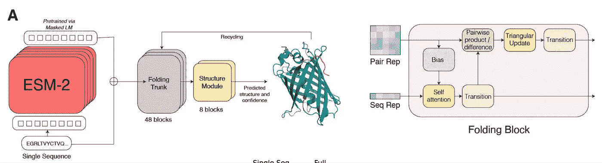

# 图结构与几何深度学习中的基础模型

> 原文：[`towardsdatascience.com/foundation-models-in-graph-geometric-deep-learning-f363e2576f58?source=collection_archive---------0-----------------------#2024-06-18`](https://towardsdatascience.com/foundation-models-in-graph-geometric-deep-learning-f363e2576f58?source=collection_archive---------0-----------------------#2024-06-18)

 [Michael Galkin](https://mgalkin.medium.com/?source=post_page---byline--f363e2576f58--------------------------------)

·发表于 [Towards Data Science](https://towardsdatascience.com/?source=post_page---byline--f363e2576f58--------------------------------) ·阅读时间 20 分钟·2024 年 6 月 18 日

--

语言、视觉和音频中的基础模型已成为 2024 年机器学习的主要研究课题，而图结构数据的基础模型则相对滞后。在这篇文章中，我们认为图基础模型的时代已经开始，并提供了一些如何今天就能使用它们的示例。

*本文由* [*Michael Galkin*](https://twitter.com/michael_galkin) *和* [*Michael Bronstein*](https://twitter.com/mmbronstein) *编写和编辑，并得到了* [*Jianan Zhao*](https://twitter.com/AndyJiananZhao) *、* [*Haitao Mao*](https://twitter.com/haitao_mao_) *、* [*Zhaocheng Zhu*](https://twitter.com/zhu_zhaocheng) *的重大贡献。*

图形和几何深度学习中基础模型的时间线。图像由作者提供。

# **目录**

1.  什么是图基础模型，如何构建它们？

1.  节点分类：GraphAny

1.  链接预测：尚未

1.  知识图推理：ULTRA 与 UltraQuery

1.  算法推理：通用算法学习者

1.  几何学与 AI4Science 基础模型 a. 机器学习潜力：JMP-1，DPA-2 用于分子，MACE-MP-0 和 MatterSim 用于无机晶体

    b. 蛋白质语言模型：ESM-2

    c. 二维分子：MiniMol 和 MolGPS

1.  表达性与扩展规律：图基础模型能扩展吗？

1.  数据问题：应该扩展什么？是否有足够的图数据来训练图基础模型？

1.  👉 关键要点 👈

# 什么是图基础模型，如何构建它们？

由于“基础”模型的定义存在一定的模糊性，最好从一个定义开始，以建立共识：

> “图基础模型是一个单一的（神经）模型，它学习可迁移的图表示，可以泛化到任何新的、以前未见过的图”

挑战之一是图的形式和形状各异，它们的连通性和特征结构可能大不相同。标准的图神经网络（GNNs）并不是“基础性”的，因为它们在最佳情况下只能在具有相同类型和维度特征的图上工作。像[标签传播](https://en.wikipedia.org/wiki/Label_propagation_algorithm)或[个性化 PageRank](https://en.wikipedia.org/wiki/PageRank)这样的图启发式方法可以在任何图上运行，但不能被视为图 FMs，因为它们不涉及任何学习。尽管我们对大型语言模型（LLMs）情有独钟，但仍不清楚将图解析为序列并将其传递给 LLM（例如在[GraphText](https://arxiv.org/abs/2310.01089)或[Talk Like A Graph](https://openreview.net/forum?id=IuXR1CCrSi)中那样）是否是保持图的对称性并扩展到大于玩具级数据集的合适方法（我们将 LLMs 与图的结合留待单独的文章讨论）。

也许设计图 FMs 时最重要的问题是可迁移的图表示。正如最近[ICML 2024 年由 Mao、Chen 等人提出的定位论文](https://arxiv.org/abs/2402.02216)中所建议的，LLMs 可以将任何语言的文本压缩为固定大小词汇表中的标记。视频-语言 FMs 依赖于可以从图像中提取的补丁（任何图像或视频中总是有 RGB 通道）。目前还不清楚图的普适特征化（类似于标记化）方案是什么，因为图可能具有非常多样的特征，例如：

+   一个大型图，带有节点特征和一些给定的节点标签（典型的节点分类任务）

+   一个大型图，没有节点特征和类别，但有有意义的边类型（典型的链接预测和知识图谱推理任务）

+   许多小图，带/不带节点/边特征，并且有图级标签（典型的图分类和回归任务）

🦄 一个理想的图基础模型，它能够处理任何带有任意节点/边/图特征的图，并执行任何节点/边/图级任务。这样的图 FMs 在 2024 年中期之前并不存在。图像来源：作者

到目前为止，在设计图 FMs 时，图学习社区有一些开放的研究问题：

**1️⃣ 如何在具有异构节点/边/图特征的图之间进行泛化？** 例如，用于节点分类的流行数据集[Cora](https://pytorch-geometric.readthedocs.io/en/latest/generated/torch_geometric.datasets.Planetoid.html#torch_geometric.datasets.Planetoid)是一个图，节点特征的维度为 1,433，而 Citeseer 数据集的特征维度为 3,703。如何为如此多样化的图定义一个单一的表示空间？

**2️⃣ 如何在预测任务中进行泛化？** 节点分类任务可能有不同数量的节点类别（例如，Cora 有 7 个类别，Citeseer 有 6 个类别）。更进一步，节点分类模型能否在链接预测任务中表现良好？

**3️⃣ 基础模型的表现力应该是多少？** 许多关于 GNN 表现力的研究已经完成，通常借用 Weisfeiler-Lehman 同构性测试的类比。由于图形基础模型理想情况下应该处理广泛的问题，因此合适的表现力仍然难以捉摸。例如，在节点分类任务中，节点特征与图形的同质性或异质性都很重要。在链接预测中，结构模式和打破自同构性更加重要（节点特征通常不会带来巨大的性能提升）。在图形级任务中，图形同构性开始发挥重要作用。在像分子生成这样的三维几何任务中，还需要考虑连续对称性带来的额外复杂性（参见[几何 GNN 的搭便车指南](https://arxiv.org/abs/2312.07511)）。

在接下来的部分，我们将展示，至少在某些任务和领域中，图形基础模型（Graph FMs）已经可用。我们将重点介绍它们在可迁移特征方面的设计选择，以及在新未见图形上的归纳推理时带来的实际好处。

**📚更多内容请参见参考文献[1][2]和** [**Github 仓库**](https://github.com/CurryTang/Awesome_Graph_Foundation_Models)

# 节点分类：GraphAny

多年来，基于 GNN 的节点分类器仅限于单一图形数据集。也就是说，例如给定一个具有 2.7K 个节点、1433 维特征和 7 个类别的 Cora 图形，必须专门在 Cora 图形上训练 GNN，并使用该图形的标签进行推理。如果将训练好的模型应用于另一个图形，例如具有 3703 维特征和 6 个类别的 Citeseer 图形，将遇到一个难以克服的难题：如何让一个模型在不同的输入特征维度和不同类别数量下进行泛化？通常，预测头部是硬编码为固定的类别数。

[**GraphAny**](https://arxiv.org/abs/2405.20445)是我们所知的第一个图形基础模型（Graph FM），该模型能够通过单一的预训练模型，在任何图形上执行节点分类，且支持任意特征维度和类别数量。一个在标准[威斯康辛](https://pytorch-geometric.readthedocs.io/en/latest/generated/torch_geometric.datasets.WebKB.html#torch_geometric.datasets.WebKB)数据集的 120 个节点上预训练的 GraphAny 模型，能够成功地推广到 30 多个不同大小和特征的图形，并且平均性能超越了从头开始在每个图形上训练的 GCN 和 GAT 图神经网络架构。

GraphAny 概述：LinearGNNs 用于执行非参数预测，并推导熵归一化的距离特征。最终预测通过融合每个节点上多个 LinearGNN 预测的结果，并根据距离特征学习的注意力生成。来源：[Zhao et al](https://arxiv.org/abs/2405.20445)。

**设置：** 半监督节点分类：给定一个图 G、节点特征 X 以及来自 C 个类的少量标记节点，预测目标节点的标签（二分类或多分类）。节点特征的维度和类别的数量不是固定的，取决于图。

**什么是可迁移的：** GraphAny 不是为所有可能的图建模一个通用的潜在空间（这相当繁琐，甚至可能在实际中不可行），而是绕过了这个问题，专注于*预测的谱滤波器之间的相互作用*。给定一组高通和低通滤波器，类似于[简化图卷积](https://arxiv.org/abs/1902.07153)（例如，形如 AX 和(I-A)X 的操作，在论文中被称为“LinearGNNs”）以及已知的节点标签：

0️⃣ GraphAny 将滤波器应用于所有节点；

1️⃣ GraphAny 通过求解一个最小二乘优化问题，获得来自具有已知标签节点的每个预测器的最佳权重（最佳权重表示为伪逆）；

2️⃣ 将最佳权重应用于未知节点，以获得初步预测对数值；

3️⃣ 计算这些对数值之间的成对距离，并应用熵正则化（使得不同的图和特征大小不会影响分布）。例如，对于 5 个 LinearGNNs，这将产生 5 x 4 = 20 种对数分数的组合；

4️⃣ 学习这些对数值的归纳注意力矩阵，以最有效地加权预测（例如，给异质图的高通滤波器更多的关注）。

最终，模型中唯一需要学习的部分是注意力的参数化（通过 MLP），它*不依赖于*目标类别的数量，而仅仅依赖于使用的 LinearGNNs 的数量。类似地，所有 LinearGNN 预测器都是非参数的，它们更新后的节点特征和最佳权重可以预先计算，以加速推理。

**📚详细信息见参考文献[3]**

# 链接预测：尚未实现

**设置**：给定一个图 G，是否有节点特征，预测一对节点（v1, v2）之间是否存在链接

😢 对于带有节点特征的图，我们尚未发现任何适用于链接预测的通用可迁移模型。

对于没有特征的图（或当你决定故意省略节点特征时），有更多要说的——基本上，所有带标签技巧的 GNN *有可能* 可以通过统一的节点特征化策略迁移到新图。

众所周知，在链接预测中，最大的障碍是自同构节点的存在（具有相同结构角色的节点）——普通的 GNN 会将它们分配相同的特征，从而使得下图中的两个链接(v1, v2)和(v1, v3)变得不可区分。[标签技巧](https://arxiv.org/abs/2010.16103)如[双半径节点标签化](https://proceedings.neurips.cc/paper/2018/hash/53f0d7c537d99b3824f0f99d62ea2428-Abstract.html)或[距离编码](https://proceedings.neurips.cc/paper_files/paper/2020/hash/2f73168bf3656f697507752ec592c437-Abstract.html)是打破自同构对称性的节点特征化策略。

V2 和 v3 是自同构节点，标准的 GNN 会对(v1,v2)和(v1,v3)打相同的分数。当我们预测(v1, v2)时，我们会将这两个节点与其他节点区分开来，使得 GNN 在学习 v1 和 v2 的表示时能识别出目标链接。类似地，当预测(v1, v3)时，节点 v1 和 v3 会被不同地标记。这样，左图中的 v2 的表示会与右图中 v3 的表示不同，从而使得 GNN 能够区分非同构的链接(v1, v2)和(v1, v3)。来源：[Zhang et al](https://arxiv.org/abs/2010.16103).

也许唯一在未见图上的链接预测中评估过的带标签技巧（适用于未特征化图）的方案是[UniLP](https://arxiv.org/abs/2402.07738)。UniLP 是一种上下文对比学习模型，需要为每个目标链接预测提供一组正样本和负样本。实际上，UniLP 使用[SEAL](https://proceedings.neurips.cc/paper/2018/hash/53f0d7c537d99b3824f0f99d62ea2428-Abstract.html)作为主干 GNN，并对固定数量的正负样本进行学习注意力。另一方面，SEAL 以其慢速著称，因此使 UniLP 能够扩展到大规模图的第一步是用更高效的方法替代子图挖掘，如[ELPH](https://arxiv.org/abs/2209.15486)和[BUDDY](https://arxiv.org/abs/2209.15486)。

通用链接预测框架概述。（a）为了预测查询链接𝑞，我们首先从目标图中采样正例（𝑠+）和负例（𝑠-）链接。这些查询链接和上下文链接都会通过共享的子图 GNN 编码器进行独立处理。接着，注意力机制会基于查询链接与上下文链接之间的相似性计算得分。（b）查询链接的最终表示，由目标图上下文化后，通过加权求和获得，该加权求和将上下文链接的表示与其相应的标签结合起来。来源：[Dong et al.](https://arxiv.org/abs/2402.07738)

**可转移的内容：** 通过标注技巧 GNN 学到的结构模式——已有研究证明，像 [Neural Bellman-Ford](https://arxiv.org/abs/2106.06935) 这样的算法可以捕捉节点对的度量，例如个性化的 PageRank 或 Katz 指数（通常用于链接预测）。

现在，既然我们知道如何处理自同构，朝着单一图 FM 进行链接预测的唯一步骤就是添加对异构节点特征的支持——或许类似 GraphAny 的方法可以作为启发？

**📚更多内容请参见参考文献 [4][5][6][7]**

# 知识图谱推理：ULTRA 和 UltraQuery

知识图谱具有特定于图的实体和关系集合，例如来自 Wikipedia / Wikidata 的常见百科事实，或来自 Hetionet 的生物医学事实，这些关系具有不同的语义，不能直接映射到彼此之间。多年来，KG 推理模型都是硬编码到给定的关系词汇中，无法迁移到具有全新实体和关系的全新知识图谱。

[ULTRA](https://openreview.net/forum?id=jVEoydFOl9) 是第一个用于知识图谱推理的基础模型，它可以在推理时以零样本方式迁移到任何知识图谱上。也就是说，一个预训练模型可以对任何多关系图进行推理，无论其大小和实体/关系词汇如何。在 57 个图上的平均表现表明，ULTRA 显著优于专门为每个图训练的基准模型。最近，ULTRA 被扩展为 [UltraQuery](https://arxiv.org/abs/2404.07198)，以支持图中涉及结合、析取和否定运算符的更复杂逻辑查询。UltraQuery 可以迁移到未见过的图，并且在这些未见过的图上，超过 10 种复杂查询模式的表现优于从头训练的更大基准模型。

给定查询（Michael Jackson，genre，?），ULTRA 构建了一个关系图（边类型），以捕捉在原始图中基于查询关系（genre）的交互，并从这个较小的图中推导出关系表示。这些特征随后作为边类型特征，在原始的大图中用于回答查询。来源：[Galkin 等人](https://openreview.net/forum?id=jVEoydFOl9)。

**设置：** 给定一个多关系图 G，其中有 |E| 个节点和 |R| 种边类型，且没有节点特征，回答简单的 KG 完成查询（*(head, relation, ?)*）或涉及逻辑运算符的复杂查询，通过返回给定图中所有节点的概率分布。节点和关系类型的集合取决于图，并且可能有所不同。

**什么是可转移的：** ULTRA 依赖于对关系互动的建模。暂时不考虑关系标识和目标图谱领域，如果我们看到“作者”和“合作”这两个关系可以共享相同的起始节点，且另一个图谱中的“学生”和“共同作者”也能共享一个起始节点，那么这两个关系对的相对结构表示可能是相似的。这适用于任何领域的多关系图谱，无论是百科全书还是生物医学知识图谱。ULTRA 进一步捕捉了 4 种这种“基础”关系互动。这些基础关系互动是可转移的，适用于任何知识图谱（连同学习到的 GNN 权重）——这样，一个经过预训练的模型就可以在任何未见过的图谱上进行推理，并处理简单或复杂的推理查询。

在专门的 Medium 帖子中阅读更多内容：

 ## ULTRA：知识图谱推理的基础模型

### 一个模型，统治一切

[towardsdatascience.com

**📚在参考文献[8][9]中阅读更多内容**

# 算法推理：通用算法学习器

一种通用神经算法学习器是一个单处理器 GNN P，具有一组权重，能够在共享潜在空间中解决多种算法任务（每个任务通过简单的编码器/解码器 f 和 g 附加到 P）。其中，该处理器网络能够进行排序（上）、最短路径查找（中）和凸包查找（下）。来源：[Ibarz et al.](https://proceedings.mlr.press/v198/ibarz22a/ibarz22a.pdf)

**设置：** [神经算法推理](https://arxiv.org/abs/2105.02761)（NAR）研究在潜在空间中执行标准算法（如排序、搜索、动态规划）并推广到任意大小输入的过程。许多此类算法可以通过图谱输入和指针来表示。给定一个包含节点和边特征的图 G，任务是模拟算法并产生正确的输出。可选地，您可以访问提示——算法的中间状态时间序列，这些可以作为中间监督信号。显然，不同的算法需要不同的步骤来执行，因此步骤数在这里不是固定的。

**可转移的内容**：同质的特征空间和相似的控制流用于相似的算法。例如，Prim 算法和 Dijkstra 算法共享相似的结构，仅在关键函数的选择和边缘松弛子程序上有所不同。此外，已有[几篇](https://arxiv.org/abs/1905.13211) [证明](https://arxiv.org/abs/2203.15544)表明消息传递与动态规划之间存在直接的对齐关系。这正是“处理器”神经网络的主要动机，它更新所有考虑中的算法的潜在状态（[CLRS 书中的 30 个经典算法](https://github.com/google-deepmind/clrs)）。

[Triplet-GMPNN](https://proceedings.mlr.press/v198/ibarz22a/ibarz22a.pdf) 是第一个此类通用处理器神经网络（到 2024 年，它在 NAR 文献中已经成为相当标准的做法）——它是一个操作节点三元组及其特征的图神经网络（类似于[边变换器](https://arxiv.org/abs/2112.00578)和 AlphaFold 中的三角注意力）。该模型在基准测试的所有算法任务上以多任务模式进行训练，并采用了一些优化和技巧。与单任务专用模型相比，单一模型使得 30 个任务的平均表现提高了 20%以上（绝对数值）。

尽管如此，编码器和解码器依然是针对每个任务特定参数化的——统一输入和输出格式的一种方式可能是使用文本与 LLM 处理器，如最近[CLRS 文本版](https://arxiv.org/abs/2406.04229)所做的那样。

**顶部**：插入排序一个列表 *[5, 2, 4, 3, 1]* 的图形算法过程。**底部**：相同算法过程，以文本方式表示，通过使用 CLRS-Text 生成器。模型接收的输入（以绿色表示）是输入数组（键）和排序过程的初始值（initial_trace），并以此为提示预测过程（以蓝色表示），即通过将每次一个元素插入到部分排序的列表中，逐步对列表进行排序，从左到右。最后，模型需要输出最终排序好的数组（以红色表示），并评估是否正确预测了该数组。来源：[Markeeva, McLeish, Ibarz 等](https://arxiv.org/abs/2406.04229)

2024 年和 2025 年 NAR 中或许最有趣的问题是：

> *算法推理思想能否成为 OOD 泛化中 LLM 推理的关键？*

LLM 在处理复杂推理问题时通常表现不佳，每个月 arxiv 上都会出现数十篇论文，尝试通过一种新的提示方法提高基准性能百分之一或两，但大多数方法在处理相似图结构的任务时并没有转移成功（见下例）。迫切需要更有原则性的方法，而 NAR 有可能填补这一空白！

LLM 在处理具有相似图结构的推理问题时失败。图片来源：作者。

**📚更多内容见参考文献[10][11]**

# 几何学和 AI4Science 基础模型

在几何深度学习和科学应用领域，基础模型正逐渐成为通用 ML 势能、蛋白质语言模型和通用分子性质预测器。虽然在大多数这种情况下，通用词汇已经存在（例如，小分子中的原子类型或蛋白质中的氨基酸），且我们不需要思考通用特征化，但主要的复杂性在于原子对象的真实物理特性——它们具有明显的三维结构和性质（如能量），这些性质有理论依据，根植于化学、物理学和量子力学。

# ML 势能：JMP-1、DPA-2 用于分子，MACE-MP-0 和 MatterSim 用于无机晶体

**设置**：给定一个三维结构，预测该结构的能量和每个原子的力；

**可转移的内容**：来自元素周期表的原子词汇。

ML 势能通过给定化学化合物的三维坐标和可选输入（例如晶体的周期性边界条件）来估算其潜在能量，化学化合物可以是分子或周期性晶体。对于任何原子模型，可能的原子种类的词汇总是受到[元素周期表](https://en.wikipedia.org/wiki/Periodic_table)的约束，目前该周期表包含 118 种元素。ML 势能的“基础性”方面是将其推广到任何原子结构（可能有组合形式多样的结构），并且足够稳定，以便在分子动力学（MD）、药物发现和材料发现流程中使用。

[JMP-1](https://arxiv.org/abs/2310.16802)和[DPA-2](https://arxiv.org/abs/2312.15492)大致同时发布，旨在成为这样的通用 ML 势能模型——它们在多种结构上进行训练——从有机分子到晶体，再到 MD 轨迹。例如，单个预训练的 JMP-1 在 QM9、rMD17（小分子）、MatBench 和 QMOF（晶体）、以及 MD22、SPICE（大分子）等任务上表现出色，且与专门针对特定数据集的模型相当或更优。类似地，[MACE-MP-0](https://arxiv.org/abs/2401.00096)和[MatterSim](https://arxiv.org/abs/2405.04967)是无机晶体领域最先进的基础模型（MACE-MP-0 已经有权重可用），在 20 多个晶体任务上进行了评估，任务涵盖了从多组分合金到燃烧和熔融盐的各类任务。等变图神经网络（GNNs）是这些系统的核心，帮助处理等变特征（如笛卡尔坐标）和不变特征（如原子类型）。

来源：（1）对**JMP-1**进行分子和晶体的预训练与微调，[Shoghi et al](https://arxiv.org/abs/2310.16802)（2）**MACE-MP-0**仅在材料项目数据上训练，并在固态、液态和气态下的多种化学体系中进行分子动力学模拟，[Batatia, Benner, Chiang, Elena, Kovács, Riebesell et al](https://arxiv.org/abs/2401.00096)。

下一个前沿似乎是机器学习加速的分子动力学模拟——传统的计算方法在飞秒尺度（10^-15 秒）下工作，并且需要数百万到数十亿步才能模拟一个分子、晶体或蛋白质。加速这些计算将对科学产生巨大的影响。

**📚更多内容请参考文献 [12][13][14][15]**

# 蛋白质语言模型：ESM-2

**设置**：给定一个蛋白质序列，预测被掩码的标记，类似于掩码语言建模；

**可转移的内容**：一个包含 20（22）种氨基酸的词汇表。

蛋白质序列类似于自然语言，其中氨基酸是标记，而 Transformer 在编码序列数据方面表现优异。尽管氨基酸的词汇表相对较小，但可能的蛋白质空间却极为广阔，因此在大量已知蛋白质上进行训练，可能会提示看不见的组合的特性。[ESM-2](https://www.biorxiv.org/content/10.1101/2022.07.20.500902v1)也许是最流行的蛋白质语言模型，这得益于预训练数据的规模、各种可用的检查点和信息丰富的特征。

ESM2 作为一个掩码语言模型和 ESMFold 用于蛋白质结构预测。来源：[Lin, Akin, Rao, Hie, et al.](https://www.biorxiv.org/content/10.1101/2022.07.20.500902v1)

ESM 特征被应用于无数领域，从预测 3D 结构（在[ESMFold](https://github.com/facebookresearch/esm)中）到蛋白质-配体结合（[DiffDock](https://arxiv.org/abs/2210.01776)及其后续模型），再到蛋白质结构生成模型（如最近的[FoldFlow 2](https://www.dreamfold.ai/blog/foldflow-2)）。更大的 Transformer 和更多的数据可能会进一步提高蛋白质语言模型的性能——然而，在这个规模下，数据问题变得更加突出（我们也在专门的部分讨论了架构与数据之间的相互作用），例如，[ESM 宏基因组图谱](https://esmatlas.com/)已经编码了超过 7 亿个结构，包括在人类之外的土壤、海洋或热泉中见到的结构。是否有办法像常见的 LLM 训练数据集那样，处理数万亿个标记？

**📚更多内容请参考文献 [16][17]**

# 2D 分子：MiniMol 和 MolGPS

**设置**：给定一个包含原子类型和键类型的 2D 图结构，预测分子特性

**可转移的内容**：周期表中的原子词汇和键类型

使用 2D 图形（没有 3D 原子坐标）时，通用编码和可转移性来自于一个固定的原子和键类型词汇表，你可以将其发送到任何 GNN 或 Transformer 编码器中。尽管分子指纹自 1960 年代以来就已被使用（[摩根指纹](https://pubs.acs.org/doi/abs/10.1021/c160017a018) [18]），它们的主要目标是评估相似性，而不是建模潜在空间。单个（大型）神经编码器的任务是学习有用的表示，这些表示可能暗示某些物理分子特性。

近期关于学习分子表示的通用模型示例包括[MiniMol](https://arxiv.org/pdf/2404.14986)和[MolGPS](https://arxiv.org/abs/2404.11568v1)，这些模型已经在大量分子图上进行了训练，并在数十个下游任务中进行了测试。也就是说，尽管如此，你仍然需要根据模型的表示来微调一个单独的任务特定解码器/预测器——从这个意义上讲，一个单一的预训练模型不能对所有可能的未见任务进行零-shot 推理，而只能针对已经训练了解码器的任务进行推理。不过，微调仍然是一个便宜且有效的选择，因为这些模型的规模比大语言模型（LLMs）小几个数量级。

来源：（1）[MiniMol](https://arxiv.org/pdf/2404.14986)的预训练和下游任务评估工作流概述。（2）[MolGPS](https://arxiv.org/abs/2404.11568v1)扩展性研究的标准。

**📚查看更多参考文献 [19][20]**

# 表达性与扩展性定律：图形 FM 是否具备扩展性？

在大语言模型（LLMs）和多模态前沿模型中，变换器是相对标准的，并且我们已经了解了它们的一些基本扩展原理。那么，变换器（作为一种架构，而不是 LLMs）在图上能否同样有效？在设计图形 FM 的主干时，通常面临哪些挑战？

如果你对前面几节中提到的模型进行分类，只有两个领域使用了变换器——蛋白质语言模型（ESM）具有自然的序列偏向，和小分子（MolGPS）。其余的都是图神经网络（GNNs）。之所以如此，有几个原因：

+   普通变换器无法扩展到任何大于标准上下文长度的合理大图（>4–10k 个节点）。超过这个范围就需要一些技巧，例如只输入子图（失去整个图的结构和长距离依赖）或线性注意力（可能没有良好的扩展性）。相反，GNNs 在边的数量上是线性的，并且在稀疏图（V ~ E）的情况下，节点的数量也是线性的。

+   没有位置编码的普通变换器[比 GNNs 更不具备表达性](https://arxiv.org/abs/2302.04181)。在包含 V 个节点的图上挖掘位置编码（如拉普拉斯位置编码）是 O(V³)。

+   在通过变换器编码图时，什么应当成为“token”？文献中并没有明确的结论，例如，[节点](https://arxiv.org/abs/2106.05234)、[节点 + 边](https://arxiv.org/abs/2406.03148)或[子图](https://arxiv.org/abs/2212.13350)都是可行的选择。

**➡️** 说到**表达性**，不同的图任务需要处理不同的对称性，例如，链接预测中的自同构节点会导致无法区分的表示，而在图分类/回归中，超越 1-WL 是区分分子所必需的，否则这些分子可能看起来与普通的图神经网络（GNNs）相同。

不同的任务需要处理不同的对称性。图像作者提供。图的来源：（1）[Zhang 等人](https://arxiv.org/abs/2010.16103)，（2）[Morris 等人](https://arxiv.org/abs/2112.09992)

这一事实引出了两个问题：

> *GFM 在表达上应该有多表达性？表达性和可扩展性之间的权衡在哪里？*

理想情况下，我们希望单一模型能够同样有效地解决所有这些对称性。然而，更具表现力的模型将导致在训练和推理中更昂贵的架构。我们同意最近的[ICML'24 图机器学习理论未来方向的立场论文](https://arxiv.org/abs/2402.02287)，即社区应该在表达性、泛化性和优化之间寻求平衡。

然而，值得注意的是，随着训练数据的日益增多，推迟直接从数据中学习复杂的对称性和不变性可能是一个计算上更便宜的想法（而不是将它们整合到模型中）。这个论点的一些最新良好例子是[AlphaFold 3](https://www.nature.com/articles/s41586-024-07487-w)和[Molecular Conformer Fields](https://arxiv.org/abs/2311.17932)，在许多生成应用中达到了 SOTA，*而无需*昂贵的等变几何编码器。

**📚 在参考文献 [21] 中阅读更多**

**➡️** 在涉及**扩展**时，模型和数据都应该扩展。然而：

❌ 非几何图：没有关于将 GNN 或变压器扩展到大图和常见任务（如节点分类和链接预测）的原则性研究。2 层 GraphSAGE 通常与庞大的 16 层图变换器相距不远。在 KG 推理领域中，一个单一的 ULTRA 模型（如上所述）以小于 20 万个参数优于 50 多个图上百万大小的浅嵌入模型。为什么会发生这种情况？我们推测关键在于 1️⃣任务性质 — 大多数非几何图是嘈杂的相似性图，并不局限于具体的物理现象如分子；2️⃣鉴于丰富的节点和边缘特征，模型必须学习*图结构的表示*（用于链接预测的常见特征）或仅*在给定特征上执行功能*（一个很好的例子是[OGB 中的节点分类](https://ogb.stanford.edu/docs/leader_nodeprop/)，大部分收益是通过添加 LLM 特征编码器实现的）。

✅ 几何图：有几篇近期的作品专注于分子图：

+   [Frey 等人](https://www.nature.com/articles/s42256-023-00740-3)（2023 年）研究了用于 ML 潜力的几何 GNN 的扩展；

+   [Sypetkowski, Wenkel 等人](https://arxiv.org/abs/2404.11568v1)（2024 年）介绍了 MolGPS，并研究了在包含 500 万分子的大数据集上将 MPNNs 和图变换器扩展到了 10 亿参数的问题。

+   [Liu 等人](https://arxiv.org/abs/2402.02054)（2024 年）探索了在包含 4 百万分子的分子数据集上将 GCN、GIN 和 GraphGPS 扩展到 1 亿参数的问题。

扩展分子 GNN 和 GT。来源：(1) [Sypetkowski, Wenkel 等人](https://arxiv.org/abs/2404.11568v1)，(2) [Liu 等人](https://arxiv.org/abs/2402.02054)

# 数据问题：应该扩展什么？是否有足够的图数据来训练图形 FM？

1️⃣ **图数据中应该扩展什么？** 节点？边？图的数量？还是其他东西？

文献中没有明确的赢家，我们更倾向于采用一个更广泛的术语***多样性***，即图数据中模式的多样性。例如，在大型产品图上的节点分类任务中，如果你在一个有 1 亿个节点的图上训练，还是在一个有 100 亿个节点的图上训练，可能没有太大区别，因为它们本质上都是用户-物品图。然而，展示在不同尺度和稀疏度下的同类性和异类性的例子可能会非常有益。在**GraphAny**中，展示这种图形的例子有助于构建一个能够泛化到不同图分布的稳健节点分类器。

在使用**ULTRA**进行知识图谱推理时，发现预训练中的***关系模式多样性***在归纳泛化中起到了最大作用，例如，一个大的密集图比一组较小但稀疏、密集、少关系和多关系的图差。

在分子图级别的任务中，例如在**MolGPS**中，增加具有不同物理属性的独特分子的数量有很大帮助（如上图所示 👆）。

此外，[UniAug](https://arxiv.org/abs/2406.01899)发现，在预训练数据中增加结构模式的覆盖率可以提高不同下游任务的性能，这些任务来自不同领域。

**2️⃣ 是否有足够的数据来训练图形 FM？**

开放可用的图数据的规模比自然语言标记、图像或视频小几个数量级，这完全没问题。本文就包含了成千上万的语言和图像标记，但没有明确的图形（除非你试图将这段文本解析成像[抽象意义表示](https://en.wikipedia.org/wiki/Abstract_Meaning_Representation)这样的图）。在 PDB 中，已知结构的“好”蛋白质数量很少，已知用于药物的“好”分子数量也很少。

> 图形 FM 是否注定因为数据稀缺而失败？

嗯，实际上并没有。两个开放的方向是：(1) 更具样本效率的架构；(2) 使用更多的黑箱数据和合成数据。

合成基准如[GraphWorld](https://arxiv.org/abs/2203.00112)可能对增加训练数据的多样性和提高对真实世界数据集的泛化有帮助。而从科学实验中获得的黑箱数据，反过来可能成为构建 AI 4 Science 基础模型的关键因素——掌握它的人将会在市场中占据主导地位。

 ## 通向生物学 2.0 的道路将通过黑箱数据

### 未来的生物 AI 突破将来自新型的高通量低成本 AI 特定的“黑箱”数据模态。

towardsdatascience.com

**📚在参考文献[20][22][23]中查看更多内容**

# 👉 关键要点 👈

**➡️ 如何在具有异质节点/边/图特征的图上进行泛化？**

+   非几何图：相对信息可以转移（如*GraphAny*中的预测差异或*Ultra*中的关系互动），但绝对信息无法转移。

+   几何图：由于固定的原子集合，迁移学习更容易，但模型必须学习一些物理概念才能可靠。

**➡️ 如何在不同的预测任务之间进行泛化？**

+   迄今为止，没有一个模型（在非几何图神经网络中）能够在零-shot 推理模式下执行节点分类、链接预测和图分类。

+   通过某一个视角框架所有任务可能会有所帮助，例如，节点分类可以框定为链接预测任务。

**➡️ 最优模型表达能力是什么？**

+   节点分类、链接预测和图分类利用了不同的对称性。

+   对最大表达能力模型的直接应用会迅速导致指数级的运行时复杂度或巨大的内存开销——需要保持*表达能力与效率*的平衡。

+   表达能力、样本复杂度（你需要多少训练数据）和归纳泛化之间的关系仍然未知。

**➡️ 数据**

+   开放可用的图数据的规模比文本/视觉数据小几个数量级，因此模型必须具备样本高效性。

+   扩展法则仍处于新兴阶段，尚不清楚应该扩展什么——节点数？边数？图案？图中的 token 概念是什么？

+   几何图神经网络：有大量实验数据，虽然这些数据对领域专家来说意义不大，但可能对神经网络有价值。

1.  Mao、Chen 等人[图基础模型已经到来](https://arxiv.org/abs/2402.02216)。ICML 2024

1.  Morris 等人[图机器学习基础的未来方向](https://arxiv.org/abs/2402.02287)。ICML 2024

1.  Zhao 等人[GraphAny：一个用于任何图上节点分类的基础模型](https://arxiv.org/abs/2405.20445)。Arxiv 2024。[Github 上的代码](https://github.com/DeepGraphLearning/GraphAny)

1.  Dong 等人[通过上下文学习进行图的通用链接预测](https://arxiv.org/abs/2402.07738)，arxiv 2024

1.  Zhang 等人[标签技巧：使用图神经网络进行多节点表示学习的理论](https://arxiv.org/abs/2010.16103)。NeurIPS 2021

1.  Chamberlain、Shirobokov 等人[通过子图草图进行链接预测的图神经网络](https://arxiv.org/abs/2209.15486)。ICLR 2023

1.  Zhu 等人[神经贝尔曼-福特网络：用于链接预测的通用图神经网络框架](https://arxiv.org/abs/2106.06935)。NeurIPS 2021

1.  Galkin 等人 [面向知识图谱推理的基础模型](https://openreview.net/forum?id=jVEoydFOl9)。ICLR 2024

1.  Galkin 等人 [在任何知识图谱上的零-shot 逻辑查询推理](https://arxiv.org/abs/2404.07198)。arxiv 2024\. [GitHub 上的代码](https://github.com/DeepGraphLearning/ULTRA)

1.  Ibarz 等人 [通用神经算法学习者](https://proceedings.mlr.press/v198/ibarz22a/ibarz22a.pdf) LoG 2022

1.  Markeeva, McLeish, Ibarz 等人 [CLRS-Text 算法推理语言基准](https://arxiv.org/abs/2406.04229)，arxiv 2024

1.  Shoghi 等人 [从分子到材料：预训练的大规模可泛化模型用于原子属性预测](https://arxiv.org/abs/2310.16802)。ICLR 2024

1.  Zhang, Liu 等人 [DPA-2：面向分子和材料模拟的通用大规模原子模型](https://arxiv.org/abs/2312.15492)，arxiv 2023

1.  Batatia 等人 [原子材料化学的基础模型](https://arxiv.org/abs/2401.00096)，arxiv 2024

1.  Yang 等人 [MatterSim：跨元素、温度和压力的深度学习原子模型](https://arxiv.org/abs/2405.04967)，arxiv 2024

1.  Rives 等人 [通过将无监督学习扩展到 2.5 亿个蛋白质序列，生物结构和功能得以显现](https://www.pnas.org/doi/full/10.1073/pnas.2016239118)。PNAS 2021

1.  Lin, Akin, Rao, Hie 等人 [在进化规模上，蛋白质序列的语言模型能够准确预测结构](https://www.biorxiv.org/content/10.1101/2022.07.20.500902v1)。Science 2023\. [代码](https://github.com/facebookresearch/esm)

1.  Morgan HL (1965) [化学结构的唯一机器描述生成——化学文摘服务开发的一项技术](https://pubs.acs.org/doi/abs/10.1021/c160017a018)。J Chem Doc 5:107–113.

1.  Kläser, Banaszewski 等人 [MiniMol：一种高效的分子学习基础模型](https://arxiv.org/pdf/2404.14986)，arxiv 2024

1.  Sypetkowski, Wenkel 等人 [GNNs 在分子图上的可扩展性](https://arxiv.org/abs/2404.11568v1)，arxiv 2024

1.  Morris 等人 [图形机器学习基础的未来方向](https://arxiv.org/abs/2402.02287)。ICML 2024

1.  Liu 等人 [图上的神经缩放法则](https://arxiv.org/abs/2402.02054)，arxiv 2024

1.  Frey 等人 [深度化学模型的神经缩放](https://www.nature.com/articles/s42256-023-00740-3)，Nature Machine Intelligence 2023
