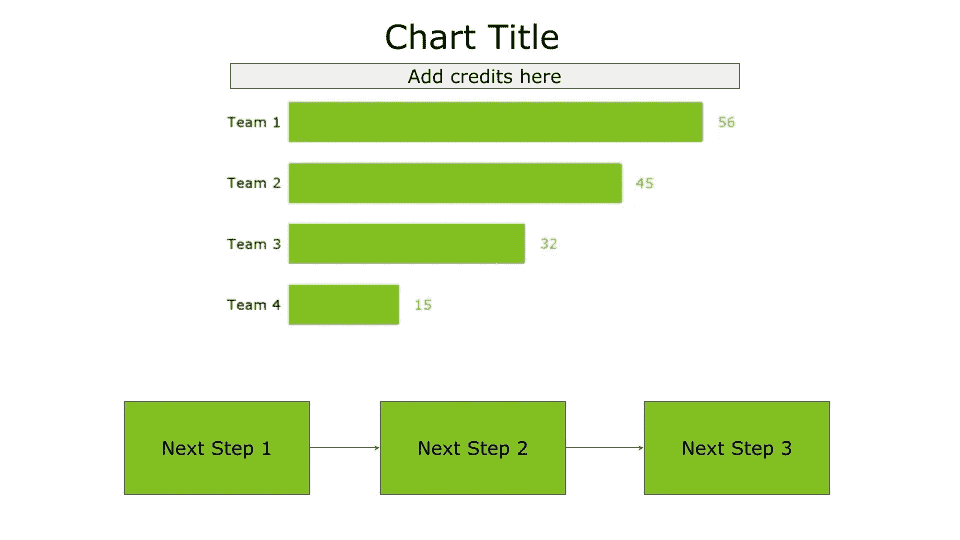
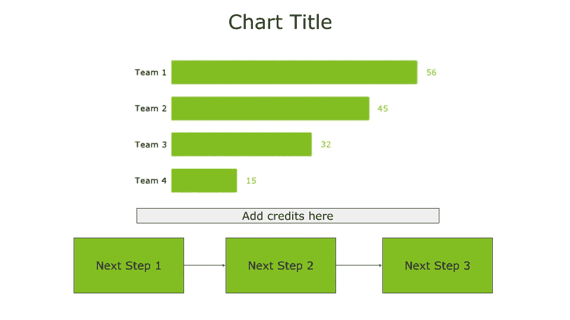
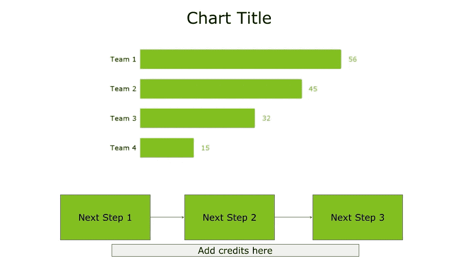
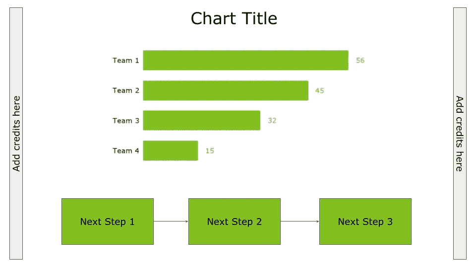

# 在图表中致谢的四种方式

> 原文：[`towardsdatascience.com/four-ways-to-credit-a-source-in-a-chart-2d01e25ebbe4?source=collection_archive---------8-----------------------#2024-09-23`](https://towardsdatascience.com/four-ways-to-credit-a-source-in-a-chart-2d01e25ebbe4?source=collection_archive---------8-----------------------#2024-09-23)

## 数据可视化，数据讲故事

## 关于在下一个数据可视化中应该如何放置致谢的实用教程

 [Angelica Lo Duca](https://alod83.medium.com/?source=post_page---byline--2d01e25ebbe4--------------------------------)

·发布于[Towards Data Science](https://towardsdatascience.com/?source=post_page---byline--2d01e25ebbe4--------------------------------) ·5 分钟阅读·2024 年 9 月 23 日

--

图片由[Lukas Blazek](https://unsplash.com/@goumbik?utm_source=medium&utm_medium=referral)提供，来源于[Unsplash](https://unsplash.com/?utm_source=medium&utm_medium=referral)

当你使用非自己数据构建图表时，必须引用你所获取数据的来源。这是对他人工作表示尊重，并能增加你在观众中的可信度。如果你引用了数据来源，你的图表肯定会更具权威性，因为它是基于可验证的数据。

在本文中，你将看到四种在图表中放置致谢的策略，尽管你可以发挥创意，将其放置在任何你想要的位置：

+   放置在标题/副标题下

+   放置在主图表下

+   放置在后续步骤下

+   横向放置

# 放置在标题/副标题下

将致谢放置在标题/副标题下，可以从故事一开始就为观众建立信任感。下图展示了将致谢放在标题/副标题下的示例。

图片由作者提供

如果你希望观众从故事一开始就知道数据来源，可以使用这种方式。虽然这种做法可能会增加信任感，但也可能会让观众分心，因为他们可能会离开你的故事去寻找数据来源。

# 放置在主图表下

将致谢放置在主图表下，涉及到为故事的重点内容添加细节，这有助于加强故事的核心要点。下图展示了将致谢放在主图表下的示例。

图片由作者提供

如果你想强化图表的主要信息，可以使用这种放置方式。

# 接下来的步骤下

在这种情况下，将数据来源作为故事的附录，放在故事的最后部分，与接下来的步骤一起呈现，如下图所示。

图片由作者提供

如果你想强化故事的下一步，可以使用这种放置方式。

# 横向

横向放置信用来源意味着将它们视为图表的外部部分。你可以将信用来源放在左侧或右侧，如下图所示。

图片由作者提供

如果你希望将信用来源放在图表的外部，避免干扰主数据故事的流程，同时保持观众集中于故事，可以使用这种放置方式。

# 讨论

你已经了解了如何在图表中放置信用来源。如果你仔细阅读了，当提到最后一种放置方式——横向时，我谈到了主数据故事的流程。但到底什么是主数据故事流程呢？任何一幅做得好的图表都能讲述一个故事，而一个故事通常从初始场景开始，按照一定的流程展开，最终以结尾场景收尾。

即使在一个简单的图表中，你也可以讲述一个故事，实际上，图表中的故事有三个主要部分：开始部分、主旨部分和结尾部分。

开始部分对应用于框定图表内容的背景。通常，你可以将背景放在标题下方，但也可以放在其他位置，例如图表的左侧。一般来说，将背景放在主图表之前，以便读者在查看图表之前先了解背景。

然后是与你的图表精确对应的主旨。

最后是故事的结尾部分，对应下一步。在底部（即图表下方或右侧）放置接下来的步骤，这样读者会在阅读完其他部分后再阅读它们。

# 总结

恭喜！你刚刚学会了四种在图表中放置信用来源的方法。你有以下几个选项：标题/副标题下、主图表下、接下来的步骤下或横向放置。

选择一个解决方案而不是另一个，取决于你的审美品味和图表中可用的空间。重要的是，信用来源不应妨碍故事的正常流动。

这是一个小小的提示。如果可以的话，始终在信用来源中添加数据来源链接，以便读者能够亲自验证你在图表中展示的数据的完整性。

今天就这些。感谢你一如既往地阅读这篇文章。

# 你可能还感兴趣……

 [## 数据故事讲述：与 Altair 和 AI 的结合

### 《数据故事讲述：与 Altair 和 AI 的结合》 [Lo Duca, Angelica]，可在 Amazon.com 购买。*免费*送货（符合条件的订单）。数据……

[www.amazon.com](https://www.amazon.com/Data-Storytelling-Altair-Angelica-Duca/dp/1633437922?source=post_page-----2d01e25ebbe4--------------------------------)  ## 四种解释从数据中提取的洞察力的方法

### 一个关于连接、巧合、好奇心和矛盾的教程，这些策略可以用来解释从数据中提取的洞察力。

towardsdatascience.com  ## 如何为专业观众定制图表

### 一个即刻可用的教程，展示如何为专业观众量身定制全球温度异常数据集……

towardsdatascience.com

# 额外奖励…

如果你想了解更多关于如何将原始图表转化为故事的方法，可以使用**DIKW（数据-信息-知识-智慧）金字塔**。

在过去的几年里，得益于我孩子们的创造力和工作，我培养了对**折纸**的热情。这份热情激发我创造了一个实用的金字塔，作为桌面小工具。

在 DIKW 折纸金字塔中，你会以简洁的方式找到：

+   从数据到智慧的步骤

+   如何使用它们将数据转化为故事

+   如何使用生成式 AI 来帮助你构建故事

在下面的视频中，我解释了如何创建一个 DIKW 金字塔小工具，并演示如何利用它将数据转化为故事。你可以在[这里](https://github.com/alod83/origami/blob/73fd37d280fce002cb99450bc7360f71a8f2750f/DIKW.pdf)下载 DIKW 金字塔折纸模板。
