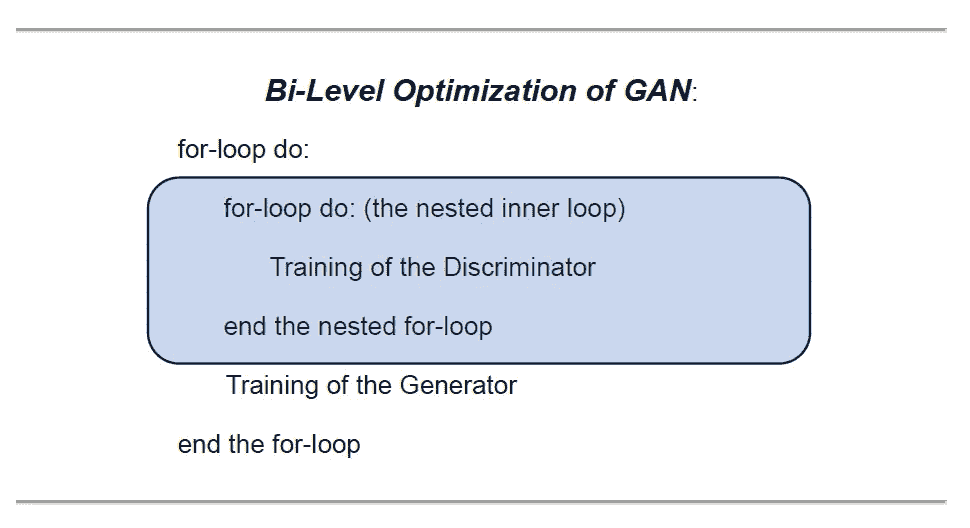
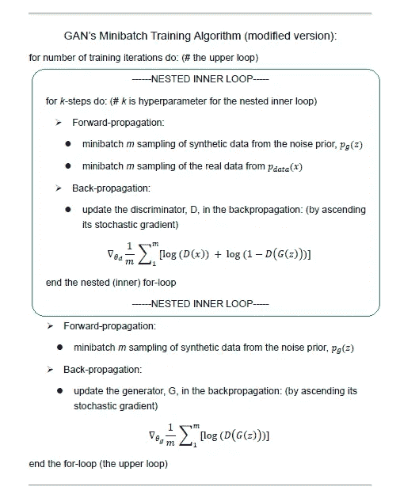

# 使用生成对抗网络（GANs）进行欺诈检测

> 原文：[`towardsdatascience.com/fraud-detection-with-generative-adversarial-nets-gans-26bea360870d?source=collection_archive---------5-----------------------#2024-01-29`](https://towardsdatascience.com/fraud-detection-with-generative-adversarial-nets-gans-26bea360870d?source=collection_archive---------5-----------------------#2024-01-29)

## 使用 GANs 进行数据增强以调整不平衡数据集

[](https://deeporigami.medium.com/?source=post_page---byline--26bea360870d--------------------------------)[](https://towardsdatascience.com/?source=post_page---byline--26bea360870d--------------------------------) [Michio Suginoo](https://deeporigami.medium.com/?source=post_page---byline--26bea360870d--------------------------------)

·发布于[Towards Data Science](https://towardsdatascience.com/?source=post_page---byline--26bea360870d--------------------------------) ·阅读时间：18 分钟·2024 年 1 月 29 日

--


图片来源：[Brett Jordan](https://unsplash.com/@brett_jordan?utm_source=medium&utm_medium=referral)于[Unsplash](https://unsplash.com/?utm_source=medium&utm_medium=referral)

[“生成对抗网络](https://arxiv.org/abs/1406.2661)”（GANs）在过去展示了生成逼真合成数据的出色表现，这些数据与真实数据几乎无法区分。不幸的是，GANs 因其不道德的应用，尤其是[深度伪造](https://www.technologyreview.com/2018/08/17/240305/fake-america-great-again/)（Knight，2018），而引起了公众的关注。

本文阐述了 GANs 在欺诈检测领域应用的一个有良好动机的案例。

欺诈检测是一个二分类预测应用。欺诈案件仅占交易总量的一小部分，构成了一个少数类别，使得数据集高度不平衡。通常，生成的模型往往偏向于多数类，并且容易对少数类欠拟合。因此，数据集不平衡的程度越高，分类预测器的表现就会越差。

我的动机是在尝试解决与不平衡数据集相关的经典欺诈检测问题时，将 GANs 作为数据增强工具来使用。更具体地说，GANs 可以生成少数欺诈类的逼真合成数据，并使不平衡的数据集达到完美平衡。

我希望这个复杂的算法能对欺诈检测的性能产生实质性贡献。换句话说，我最初的期望是：算法越复杂，性能越好。

一个相关的问题是，使用 GANs 是否能保证在欺诈检测性能上取得显著改善，并满足我的动机。让我们来看看。

# ***简介***

原则上，欺诈检测是一种二分类算法应用：将每一笔交易分类为是否为欺诈案件。

欺诈案件仅占交易总数的一小部分。通常，欺诈案件构成少数类，因此使得数据集高度不平衡。

欺诈案件越少，交易系统就越健全。

非常简单直观。

矛盾的是，这种良好的条件恰恰是过去使得欺诈检测变得具有挑战性的主要原因之一，甚至可以说是使其几乎不可能。原因很简单，因为分类算法难以学习到欺诈这个少数类的概率分布。

通常，数据集越平衡，分类预测器的性能就越好。换句话说，数据集越不平衡（或越不均衡），分类器的性能就越差。

这描绘了欺诈检测的经典问题：一个具有高度不平衡数据集的二分类应用。

在这种设置中，我们可以使用生成对抗网络（GANs）作为数据增强工具，生成少数欺诈类别的逼真合成数据，以便将整个数据集转化为更加平衡的状态，从而尝试提升欺诈检测分类器模型的性能。

本文分为以下几个部分：

+   第一部分：算法概述：GANs 的双层优化架构

+   第二部分：欺诈数据集

+   第三部分：GANs 用于数据增强的 Python 代码解析

+   第四部分：欺诈检测概述（基准场景与 GANs 场景对比）

+   第五部分：结论

总体而言，我将主要关注 GANs 的话题（包括算法和代码）。至于模型开发中的其他话题，如数据预处理和分类器算法，我将仅简要概述过程，并避免深入细节。在这个背景下，本文假设读者已经具备关于二分类算法（特别是我为欺诈检测选择的集成分类器）以及数据清洗和预处理的一般性知识。

对于详细代码，读者可以访问以下链接：[`github.com/deeporigami/Portfolio/blob/6538fcaad1bf58c5f63d6320ca477fa867edb1df/GAN_FraudDetection_Medium_2.ipynb`](https://github.com/deeporigami/Portfolio/blob/6538fcaad1bf58c5f63d6320ca477fa867edb1df/GAN_FraudDetection_Medium_2.ipynb)

# ***第一部分：算法概述：GANs 的双层优化架构***

GAN 是一种特殊类型的生成算法。正如其名称所示，生成对抗网络（GAN）由两个神经网络组成：生成网络（生成器）和对抗网络（判别器）。GAN 将这两个代理放在一起进行竞争，其中生成器试图生成逼真的合成数据，而判别器则试图区分合成数据和真实数据。

原始的 GAN 在一篇开创性的论文中提出：[“生成对抗网络”（Generative Adversarial Nets](https://arxiv.org/abs/1406.2661))（Goodfellow 等人，生成对抗网络，2014 年）。原始 GAN 的联合作者用伪造者-警察的类比来描述 GAN：这是一场迭代博弈，其中生成器扮演伪造者，判别器扮演警察的角色，检测生成器伪造的假货。

原始 GAN 具有创新性，因为它解决并克服了过去训练深度生成算法的常见困难。而且，作为其核心，它采用了二级优化框架，具有寻求平衡的目标设置（与最大似然目标设置相对）。

从那时起，已经探索了许多 GAN 的变体架构。作为一种预防措施，本文仅参考原始 GAN 的原型架构。

***生成器与判别器***

在 GAN 架构中，这两个神经网络——生成器和判别器——相互竞争。具体来说，这种竞争通过前向传播和反向传播的迭代进行（遵循神经网络的一般框架）。

一方面，显而易见，判别器本质上是一个二分类器：它将每个样本分类为真实（标签：1）或伪造/合成（标签：0）。判别器在前向传播过程中接收真实样本和合成样本。然后，在反向传播过程中，它学习从混合数据中检测合成数据。

另一方面，生成器在设计上是一个噪声分布。生成器在前向传播过程中接收真实样本。然后，在反向传播过程中，生成器学习真实数据的概率分布，以便更好地模拟其合成样本。

这两个代理通过“二级优化”框架交替训练。

***二级训练机制（二级优化方法）***

在原始的 GAN 论文中，为了训练这两个目标完全对立的代理，联合作者设计了一个“二级优化（训练）”架构，其中一个内部训练模块（判别器的训练）被嵌套在另一个高级训练模块（生成器的训练）中。

下图展示了“二级优化”在嵌套训练循环中的结构。判别器在嵌套的内部循环中进行训练，而生成器在更高层级的主循环中进行训练。



图片来源：作者

GAN 通过这种二级训练架构交替训练这两个代理（Goodfellow 等，生成对抗网络，2014 年，第 3 页）。换句话说，在交替训练一个代理的过程中，我们需要冻结另一个代理的学习过程（Goodfellow I.，2015 年，第 3 页）。

***极小极大优化目标***

除了使这两个代理可以交替训练的“二级优化”机制外，GAN 与传统神经网络原型的另一个独特特征是其极小极大优化目标。简单来说，与传统的最大化方法（例如最大似然）不同，GAN 追求的是一个寻求平衡的优化目标。

什么是寻求平衡的优化目标？

让我们逐步解析。

GAN 的两个代理有着截然相反的目标。判别器作为一个二分类器，旨在最大化正确分类真实样本和合成样本混合体的概率，而生成器的目标则是最小化判别器正确分类合成数据的概率：因为生成器需要欺骗判别器。

在这个背景下，原始 GAN 的合著者称整体目标为“***极小极大博弈***”。（Goodfellow 等，2014 年，第 3 页）

总体来说，GAN 的最终***极小极大优化目标***不是寻找这些目标函数的全局最大值/最小值。而是设定为寻求一个平衡点，可以理解为：

+   “一个鞍点，对于分类器来说是局部最大值，对于生成器来说是局部最小值”（Goodfellow I.，2015 年，第 2 页）

+   其中，任何一个代理都无法再提高其性能。

+   其中，生成器学会创造的合成数据已经足够真实，能够欺骗判别器。

平衡点可以在概念上通过判别器的随机猜测概率 0.5（50%）来表示：D(z) => 0.5。

让我们根据 GAN 的目标函数来转述其极小极大优化的概念框架。

判别器的目标是最大化下图中的目标函数：


图片来源：作者

为了解决可能的饱和问题，他们将生成器原始对数似然目标函数中的第二项转换如下，并建议将转换后的版本作为生成器的目标来最大化：


图片来源：作者

总的来说，GANs 的“二级优化”架构可以转化为以下算法。



图片来自作者

有关 GANs 算法设计的更多细节，请阅读我另一篇文章：生成对抗网络的极小极大优化设计。

现在，让我们开始使用数据集进行实际编码。

为了突出 GANs 算法，我将在这里主要聚焦于 GANs 的代码，并仅概述其余过程。

# 第二部分：欺诈数据集

为了进行欺诈检测，我从 Kaggle 选择了以下信用卡交易数据集：[`www.kaggle.com/datasets/mlg-ulb/creditcardfraud`](https://www.kaggle.com/datasets/mlg-ulb/creditcardfraud)

数据许可：[数据库内容许可（DbCL）v1.0](https://opendatacommons.org/licenses/dbcl/1-0/)

这是数据集的总结。

数据集包含 284,807 笔交易。在该数据集中，我们只有 492 个欺诈案例（其中包括 29 个重复案例）。

由于欺诈类别仅占所有交易的 0.172%，它构成了一个极其小的少数类。这个数据集非常适合用来说明与不平衡数据集相关的经典欺诈检测问题。

它包含以下 30 个特征：

+   V1, V2, … V28：通过 PCA 获得的 28 个主成分。数据来源未公开，以保护隐私。

+   ‘Time’：每笔交易与数据集第一笔交易之间经过的秒数。

+   ‘Amount’：交易金额。

标签设置为“Class”。

+   ‘Class’：如果是欺诈，则为 1；否则为 0。

## ***数据预处理：特征选择***

由于数据集已经相当干净（如果不是完全干净的话），我只需做一些数据清理工作：去除重复数据和剔除异常值。

之后，鉴于数据集中有 30 个特征，我决定进行特征选择，通过剔除不太重要的特征来减少特征数量，准备训练过程。我选择了 scikit-learn 随机森林分类器的内置[***特征重要性评分***](https://scikit-learn.org/stable/modules/generated/sklearn.feature_selection.SelectFromModel.html#sklearn.feature_selection.SelectFromModel)，用来估算所有 30 个特征的评分。

以下图表显示了结果的摘要。如果您对详细过程感兴趣，请访问我上面列出的代码。


图片来自作者

根据上面条形图中显示的结果，我做出了主观判断，选择了 6 个最重要的特征进行分析，并从模型构建过程中移除了其余不重要的特征。

这是选定的 6 个重要特征。


图片来自作者

在后续的模型构建中，我专注于这 6 个选择的特征。在数据预处理之后，我们得到了如下形状的工作数据框 df：

+   df.shape = (282513, 7)

希望特征选择能够减少最终模型的复杂性并稳定其性能，同时保留优化二分类器所需的关键信息。

# ***场景 3：*** GANs 数据增强代码解析

最后，是时候使用 GANs 进行数据增强了。

***那么我们需要创建多少合成数据呢？***

首先，我们对数据增强的兴趣仅限于模型训练。由于测试数据集是样本外数据，我们希望保留测试数据集的原始形式。其次，因为我们的目标是完美地转换不平衡数据集，我们不想增加非欺诈类别的多数类数据。

简单来说，我们只希望增加少数欺诈类的训练数据集，而不是其他任何数据。

现在，使用分层数据拆分方法，将工作数据框拆分为 80/20 比例的训练数据集和测试数据集。

```py
# Separate features and target variable
X = df.drop('Class', axis=1)
y = df['Class']

# Splitting data into train and test sets
X_train, X_test, y_train, y_test = train_test_split(X, y, test_size=0.2, random_state=42, stratify=y)

# Combine the features and the label for the train dataset 
train_df = pd.concat([X_train, y_train], axis=1)
```

结果，训练数据集的形状如下：

+   train_df.shape = (226010, 7)

让我们查看训练数据集的组成（欺诈案例和非欺诈案例）。

```py
# Load the dataset (fraud and non-fraud data)
fraud_data = train_df[train_df['Class'] == 1].drop('Class', axis=1).values
non_fraud_data = train_df[train_df['Class'] == 0].drop('Class', axis=1).values

# Calculate the number of synthetic fraud samples to generate
num_real_fraud = len(fraud_data)
num_synthetic_samples = len(non_fraud_data) - num_real_fraud
print("# of non-fraud: ", len(non_fraud_data))
print("# of Real Fraud:", num_real_fraud)
print("# of Synthetic Fraud required:", num_synthetic_samples)

# of non-fraud:  225632
# of Real Fraud: 378
# of Synthetic Fraud required: 225254
```

这告诉我们，训练数据集（226,010）由 225,632 个非欺诈数据和 378 个欺诈数据组成。换句话说，它们之间的差异是 225,254。这个数字是我们需要增加的合成欺诈数据（*num_synthetic_samples*）的数量，以便在训练数据集中完美地匹配这两个类别的数量：提醒一下，我们保留了原始的测试数据集。

***接下来，让我们编写 GANs 代码。***

首先，让我们创建自定义函数来确定两个代理：判别器和生成器。

对于生成器，我创建了一个噪声分布函数*build_generator()*，它需要两个参数：*latent_dim*（噪声的维度）作为输入的形状；以及输出的形状*output_dim*，即特征的数量。

```py
# Define the generator network
def build_generator(latent_dim, output_dim):
    model = Sequential()
    model.add(Dense(64, input_shape=(latent_dim,)))
    model.add(Dense(128, activation='sigmoid'))
    model.add(Dense(output_dim, activation='sigmoid'))
    return model
```

对于判别器，我创建了一个自定义函数*build_discriminator()*，它需要一个*input_dim*，即特征的数量。

```py
# Define the discriminator network
def build_discriminator(input_dim):
    model = Sequential()
    model.add(Input(input_dim))
    model.add(Dense(128, activation='sigmoid'))
    model.add(Dense(1, activation='sigmoid'))
    return model
```

然后，我们可以调用这些函数来创建生成器和判别器。在这里，对于生成器，我随意将*latent_dim*设置为 32：你可以尝试其他值。

```py
# Dimensionality of the input noise for the generator
latent_dim = 32

# Build generator and discriminator models
generator = build_generator(latent_dim, fraud_data.shape[1])
discriminator = build_discriminator(fraud_data.shape[1])
```

在这一阶段，我们需要编译判别器，稍后它将嵌套在主（更高层次的）优化循环中。我们可以通过以下参数设置来编译判别器。

+   判别器的损失函数：二分类器的通用交叉熵损失函数

+   评估指标：精确度和召回率。

```py
# Compile the discriminator model
from keras.metrics import Precision, Recall
discriminator.compile(optimizer=Adam(learning_rate=0.0002, beta_1=0.5), loss='binary_crossentropy',  metrics=[Precision(), Recall()])
```

对于生成器，我们将在构建主（上层）优化循环时进行编译。

在这个阶段，我们可以定义生成器的自定义目标函数如下。记住，推荐的目标是最大化以下公式：


图片来源：作者

```py
def generator_loss_log_d(y_true, y_pred):
    return - K.mean(K.log(y_pred + K.epsilon()))
```

上面提到的负号是必须的，因为默认情况下，损失函数是设计为最小化的。

然后，我们可以构建双层优化架构的主（上层）循环，*build_GANs(generator, discriminator)*。在这个主循环中，我们隐式地编译生成器。在这种情况下，我们在编译主循环时需要使用生成器的自定义目标函数 *generator_loss_log_d*。

如前所述，我们在训练生成器时需要冻结判别器。

```py
# Build and compile the GANs upper optimization loop combining generator and discriminator
def build_gan(generator, discriminator):
    discriminator.trainable = False
    model = Sequential()
    model.add(generator)
    model.add(discriminator)
    model.compile(optimizer=Adam(learning_rate=0.0002, beta_1=0.5), loss=generator_loss_log_d)

    return model

# Call the upper loop function
gan = build_gan(generator, discriminator)
```

在上面最后一行，*gan* 调用了 *build_gan()*，以便执行下面的批量训练，使用 [Keras 的 model.train_on_batch() 方法](https://keras.io/api/models/model_training_apis/)。

提醒一下，在训练判别器时，我们需要冻结生成器的训练；而在训练生成器时，我们需要冻结判别器的训练。

这里是结合了交替训练过程的批量训练代码，这两个代理在双层优化框架下进行训练。

```py
# Set hyperparameters
epochs = 10000
batch_size = 32

# Training loop for the GANs
for epoch in range(epochs):
    # Train discriminator (freeze generator)
    discriminator.trainable = True
    generator.trainable = False

    # Random sampling from the real fraud data
    real_fraud_samples = fraud_data[np.random.randint(0, num_real_fraud, batch_size)]

    # Generate fake fraud samples using the generator
    noise = np.random.normal(0, 1, size=(batch_size, latent_dim))
    fake_fraud_samples = generator.predict(noise)

    # Create labels for real and fake fraud samples
    real_labels = np.ones((batch_size, 1))
    fake_labels = np.zeros((batch_size, 1))

    # Train the discriminator on real and fake fraud samples
    d_loss_real = discriminator.train_on_batch(real_fraud_samples, real_labels)
    d_loss_fake = discriminator.train_on_batch(fake_fraud_samples, fake_labels)
    d_loss = 0.5 * np.add(d_loss_real, d_loss_fake)

    # Train generator (freeze discriminator)
    discriminator.trainable = False
    generator.trainable = True

    # Generate synthetic fraud samples and create labels for training the generator
    noise = np.random.normal(0, 1, size=(batch_size, latent_dim))
    valid_labels = np.ones((batch_size, 1))

    # Train the generator to generate samples that "fool" the discriminator
    g_loss = gan.train_on_batch(noise, valid_labels)

    # Print the progress
    if epoch % 100 == 0:
        print(f"Epoch: {epoch} - D Loss: {d_loss} - G Loss: {g_loss}")
```

这里，我有一个快速的问题要问你。

下面我们展示了与上述代码中的生成器训练相关的一个代码片段。

你能解释一下这段代码的作用吗？

```py
# Generate synthetic fraud samples and create labels for training the generator
    noise = np.random.normal(0, 1, size=(batch_size, latent_dim))
    valid_labels = np.ones((batch_size, 1))
```

在第一行，*noise* 生成了合成数据；在第二行，*valid_labels* 分配了合成数据的标签。

为什么我们需要用 1 来标注它，1 本应是实际数据的标签？难道你没有觉得这段代码让人有些困惑吗？

各位女士们，先生们，欢迎来到伪造者的世界。

这是标签化的魔法，它训练生成器生成能够欺骗判别器的样本。

现在，让我们使用训练好的生成器来创建少数欺诈类的合成数据。

```py
# After training, use the generator to create synthetic fraud data
noise = np.random.normal(0, 1, size=(num_synthetic_samples, latent_dim))
synthetic_fraud_data = generator.predict(noise)

# Convert the result to a Pandas DataFrame format
fake_df = pd.DataFrame(synthetic_fraud_data, columns=features.to_list())
```

最终，合成数据已经创建完成。

在下一节中，我们可以将这些合成的欺诈数据与原始训练数据集结合，确保整个训练数据集达到完美平衡。我希望这个完美平衡的训练数据集能提高欺诈检测分类模型的性能。

# 第四部分：欺诈检测概述（有无 GAN 数据增强）

一再强调，本项目中使用 GAN 的唯一目的是数据增强，而不是分类。

首先，我们需要基准模型作为比较的基础，以便我们评估基于 GAN 数据增强的欺诈检测模型性能的提升。

作为一个二分类算法，我选择了集成方法来构建欺诈检测模型。作为基准场景，我仅使用原始不平衡数据集来开发欺诈检测模型：也就是没有数据增强。然后，在第二个使用 GAN 进行数据增强的场景中，我可以使用包含 GAN 生成的合成欺诈数据的完美平衡训练数据集来训练相同的算法。

+   基准场景：没有数据增强的集成分类器

+   GAN 场景：使用 GAN 进行数据增强的集成分类器

***基准场景：没有数据增强的集成***

接下来，让我们定义基准场景（没有数据增强）。我决定选择集成分类器：投票法作为元学习器，使用以下 3 个基础学习器。

+   梯度提升

+   决策树

+   随机森林

由于原始数据集高度不平衡，除了准确率之外，我将从以下三个选项中选择评估指标：精确率、召回率和 F1-Score。

以下自定义函数，*ensemble_training(X_train, y_train)*，定义了训练和验证过程。

```py
def ensemble_training(X_train, y_train):
```

```py
 # Initialize base learners
  gradient_boosting = GradientBoostingClassifier(random_state=42)
  decision_tree = DecisionTreeClassifier(random_state=42)
  random_forest = RandomForestClassifier(random_state=42) # Define the base models
  base_models = {
    'RandomForest': random_forest,
    'DecisionTree': decision_tree,
    'GradientBoosting': gradient_boosting
  } # Initialize the meta learner
  meta_learner = VotingClassifier(estimators=[(name, model) for name, model in base_models.items()], voting='soft') # Lists to store training and validation metrics
  train_f1_scores = []
  val_f1_scores = [] # Splitting the train set further into training and validation sets
  X_train, X_val, y_train, y_val = train_test_split(X_train, y_train, test_size=0.25, random_state=42, stratify=y_train) # Training and validation
  for model_name, model in base_models.items():
    model.fit(X_train, y_train) # Training metrics
    train_predictions = model.predict(X_train)
    train_f1 = f1_score(y_train, train_predictions)
    train_f1_scores.append(train_f1) # Validation metrics using the validation set
    val_predictions = model.predict(X_val)
    val_f1 = f1_score(y_val, val_predictions)
    val_f1_scores.append(val_f1) # Training the meta learner on the entire training set
  meta_learner.fit(X_train, y_train) return meta_learner, train_f1_scores, val_f1_scores, base_models
```

下一个函数模块，*ensemble_evaluations(meta_learner, X_train, y_train, X_test, y_test)*，在元学习器层面计算性能评估指标。

```py
def ensemble_evaluations(meta_learner,X_train, y_train, X_test, y_test):
# Metrics for the ensemble model on both traininGANsd test datasets
  ensemble_train_predictions = meta_learner.predict(X_train)
  ensemble_test_predictions = meta_learner.predict(X_test)
```

```py
 # Calculating metrics for the ensemble model
  ensemble_train_f1 = f1_score(y_train, ensemble_train_predictions)
  ensemble_test_f1 = f1_score(y_test, ensemble_test_predictions) # Calculate precision and recall for both training and test datasets
  precision_train = precision_score(y_train, ensemble_train_predictions)
  recall_train = recall_score(y_train, ensemble_train_predictions) precision_test = precision_score(y_test, ensemble_test_predictions)
  recall_test = recall_score(y_test, ensemble_test_predictions) # Output precision, recall, and f1 score for both training and test datasets
  print("Ensemble Model Metrics:")
  print(f"Training Precision: {precision_train:.4f}, Recall: {recall_train:.4f}, F1-score: {ensemble_train_f1:.4f}")
  print(f"Test Precision: {precision_test:.4f}, Recall: {recall_test:.4f}, F1-score: {ensemble_test_f1:.4f}") return ensemble_train_predictions, ensemble_test_predictions, ensemble_train_f1, ensemble_test_f1, precision_train, recall_train, precision_test, recall_test
```

接下来，让我们看一下基准集成分类器的表现。

```py
Training Precision: 0.9811, Recall: 0.9603, F1-score: 0.9706
Test Precision: 0.9351, Recall: 0.7579, F1-score: 0.8372
```

在元学习器层面，基准模型生成的 F1-Score 在合理的水平 0.8372。

接下来，让我们进入使用 GAN 进行数据增强的场景。我们想看看使用 GAN 的场景是否能超越基准场景的表现。

***GAN 场景：使用 GAN 进行数据增强的欺诈检测***

最终，我们通过将原始不平衡训练数据集（包括非欺诈和欺诈案例）、*train_df* 和通过 GAN 生成的合成欺诈数据集 *fake_df* 结合起来，构建了一个完美平衡的数据集。在这里，我们将原始测试数据集保留不变，不参与这个过程。

```py
wdf = pd.concat([train_df, fake_df], axis=0)
```

我们将使用混合的平衡数据集训练相同的集成方法，以查看它是否能够超越基准模型。

现在，我们需要将混合平衡数据集分割成特征和标签。

```py
X_mixed = wdf[wdf.columns.drop("Class")]
y_mixed = wdf["Class"]
```

记住，当我之前运行基准场景时，我已经定义了必要的自定义函数模块来训练和评估集成分类器。我也可以在这里使用这些自定义函数来训练相同的集成算法，使用合成的平衡数据集。

我们可以将特征和标签（X_mixed, y_mixed）传入自定义的集成分类器函数 ensemble_training()。

```py
meta_learner_GANs, train_f1_scores_GANs, val_f1_scores_GANs, base_models_GANs=ensemble_training(X_mixed, y_mixed)
```

最后，我们可以使用测试数据集来评估模型。

```py
ensemble_evaluations(meta_learner_GANs, X_mixed, y_mixed, X_test, y_test)
```

这里是结果。

```py
Ensemble Model Metrics:
Training Precision: 1.0000, Recall: 0.9999, F1-score: 0.9999
Test Precision: 0.9714, Recall: 0.7158, F1-score: 0.8242
```

# ***结论***

最后，我们可以评估通过 GAN 进行数据增强是否提高了分类器的表现，正如我所预期的那样。

让我们比较基准场景和 GAN 场景的评估指标。

这是来自基准场景的结果。

```py
# The Benchmark Scenrio without data augmentation by GANs
Training Precision: 0.9811, Recall: 0.9603, F1-score: 0.9706
Test Precision: 0.9351, Recall: 0.7579, F1-score: 0.8372
```

这是来自 GANs 场景的结果。

```py
Training Precision: 1.0000, Recall: 0.9999, F1-score: 0.9999
Test Precision: 0.9714, Recall: 0.7158, F1-score: 0.8242
```

当我们回顾训练数据集上的评估结果时，显然 GANs 场景在所有三个评估指标上都超过了基准场景。

然而，当我们关注样本外测试数据的结果时，GANs 场景仅在精确度上超过了基准场景（基准：0.935 vs GANs 场景：0.9714）；在召回率和 F1 得分上（基准：0.7579；0.8372 vs GANs 场景：0.7158；0.8242）却未能超越。

+   更高的精确度意味着模型对欺诈案例的预测中，包含的非欺诈案例比例低于基准场景。

+   更低的召回率意味着模型未能检测到某些实际欺诈案例的变种。

这两项对比表明：尽管 GANs 通过数据增强成功地在训练数据集中模拟了真实的欺诈数据，但它未能捕捉到实际欺诈案例在样本外测试数据集中的多样性。

GANs 在模拟训练数据的特定概率分布方面表现得太好。具有讽刺意味的是，作为数据增强工具使用 GANs，由于过度拟合训练数据，导致欺诈检测（分类）模型的泛化能力较差。

具有讽刺意味的是，这个特定的例子提出了一个反直觉的观点，即一个更复杂的算法不一定能保证比简单的传统算法更好的表现。

此外，我们还可以考虑另一个无意的后果——浪费性的碳足迹：将能源需求较大的算法添加到模型开发中，可能会增加机器学习在日常生活中的碳足迹。这个案例可以说明一个不必要的浪费案例，它无故浪费了能源，而没有带来更好的性能。

这里我留给你一些关于机器学习能源消耗的链接。

+   [`spectrum.ieee.org/ai-energy-consumption`](https://spectrum.ieee.org/ai-energy-consumption)

+   [`www.cell.com/joule/fulltext/S2542-4351(23)00365-3?_returnURL=https%3A%2F%2Flinkinghub.elsevier.com%2Fretrieve%2Fpii%2FS2542435123003653%3Fshowall%3Dtrue`](https://www.cell.com/joule/fulltext/S2542-4351(23)00365-3?_returnURL=https%3A%2F%2Flinkinghub.elsevier.com%2Fretrieve%2Fpii%2FS2542435123003653%3Fshowall%3Dtrue)

今天，我们有许多 GAN 的变种。在未来的文章中，我想探索其他 GAN 的变种，看看是否有任何变种能够捕捉到原始样本的更广泛多样性，从而提高欺诈检测器的性能。

感谢阅读。

杉野道夫

# 参考文献

+   Borji, A.（2018 年 10 月 24 日）。*GAN 评估指标的利与弊*。取自 ArXiv：[`arxiv.org/abs/1802.03446`](https://arxiv.org/abs/1802.03446)

+   Goodfellow, I. (2015 年 5 月 21 日). *估计生成模型的可区分性标准.* 从 ArXiv 获取: [`arxiv.org/abs/1412.6515`](https://arxiv.org/abs/1412.6515)

+   Goodfellow, I. J., Pouget-Abadie, J., Mirza, M., Xu, B., Warde-Farley, D., Ozairy, S., . . . Bengioz, Y. (2014 年 6 月 10 日). *生成对抗网络.* 从 arXiv 获取: [`arxiv.org/abs/1406.2661`](https://arxiv.org/abs/1406.2661)

+   Goodfellow, I. J., Pouget-Abadie, J., Mirza, M., Xu, B., Warde-Farley, D., Ozairy, S., . . . Bengioz, Y. (2014 年 6 月 10 日). *生成对抗网络.* 从 arXiv 获取: [`arxiv.org/abs/1406.2661`](https://arxiv.org/abs/1406.2661)

+   Knight, W. (2018 年 8 月 17 日). *让美国再次变得伟大（假）.* 从 MIT Technology Review 获取: [`www.technologyreview.com/2018/08/17/240305/fake-america-great-again/`](https://www.technologyreview.com/2018/08/17/240305/fake-america-great-again/)

+   Suginoo, M. (2024 年 1 月 13 日). *生成对抗网络（GAN）的极小极大优化设计.* 从 Towards Data Science 获取: `towardsdatascience.com/mini-max-optimization-design-of-generative-adversarial-networks-gan-dc1b9ea44a02`
