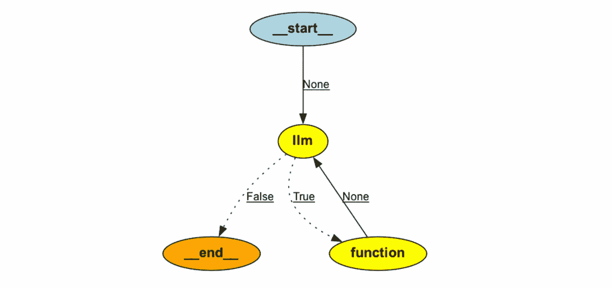

# 从基础到进阶：探索 LangGraph

> 原文：[`towardsdatascience.com/from-basics-to-advanced-exploring-langgraph-e8c1cf4db787?source=collection_archive---------0-----------------------#2024-08-15`](https://towardsdatascience.com/from-basics-to-advanced-exploring-langgraph-e8c1cf4db787?source=collection_archive---------0-----------------------#2024-08-15)

## 构建单智能体和多智能体工作流，包含人机协作交互

[](https://miptgirl.medium.com/?source=post_page---byline--e8c1cf4db787--------------------------------)[](https://towardsdatascience.com/?source=post_page---byline--e8c1cf4db787--------------------------------) [Mariya Mansurova](https://miptgirl.medium.com/?source=post_page---byline--e8c1cf4db787--------------------------------)

·发布于 [Towards Data Science](https://towardsdatascience.com/?source=post_page---byline--e8c1cf4db787--------------------------------) ·21 分钟阅读·2024 年 8 月 15 日

--


图片来源：DALL-E 3

[LangChain](https://www.langchain.com/) 是构建大型语言模型驱动应用程序的领先框架之一。借助 [LangChain 表达式语言](https://python.langchain.com/v0.1/docs/expression_language/)（LCEL），定义和执行逐步行动序列——也就是所谓的链——变得更加简便。从更技术性的角度来看，LangChain 允许我们创建 DAG（有向无环图）。

随着 LLM 应用，特别是 LLM 智能体的发展，我们开始不仅将 LLM 用于执行任务，还用作推理引擎。这一转变引入了频繁涉及重复（循环）和复杂条件的交互。在这种情况下，LCEL 不足以应对，因此 LangChain 实现了一个新模块——[LangGraph](https://langchain-ai.github.io/langgraph/)。

LangGraph（正如你从名字中可以猜到的）将所有交互建模为循环图。这些图使得开发具有多个循环和条件判断的高级工作流和交互成为可能，因此它成为了创建智能体和多智能体工作流的便捷工具。

在本文中，我将探索 LangGraph 的关键特性和功能，包括多智能体应用。我们将构建一个可以回答不同类型问题的系统，并深入了解如何实现人机协作的设置。

在[上一篇文章](https://medium.com/towards-data-science/multi-ai-agent-systems-101-bac58e3bcc47)中，我们尝试使用了 CrewAI，这是另一个流行的多代理系统框架。然而，LangGraph 采取了不同的方法。CrewAI 是一个高层框架，具有许多预定义的功能和现成的组件，而 LangGraph 在较低层次操作，提供广泛的定制和控制。

通过这个介绍，让我们深入了解 LangGraph 的基本概念。

# LangGraph 基础

LangGraph 是 LangChain 生态系统的一部分，因此我们将继续使用一些熟悉的概念，比如提示模板、工具等。然而，LangGraph 引入了一些[额外的概念](https://langchain-ai.github.io/langgraph/concepts/low_level/#compiling-your-graph)。让我们来讨论一下它们。

LangGraph 被创建用于定义循环图。图由以下元素组成：

+   节点代表实际的操作，可以是 LLM、代理或函数。同时，一个特殊的 END 节点标志着执行的结束。

+   边连接节点并确定图的执行流程。有基本边，它们仅仅连接一个节点到另一个节点，还有条件边，它们包含 if 语句和额外的逻辑。

另一个重要概念是图的状态。状态作为图组件协作的基础元素。它表示图的快照，任何部分——无论是节点还是边——都可以在执行过程中访问和修改，以检索或更新信息。

此外，状态在持久化中也起着至关重要的作用。每一步之后，它会自动保存，允许你在任何时刻暂停并恢复执行。这个功能支持更复杂应用的开发，比如那些需要错误修正或包含人工干预的应用。

# 单代理工作流

## 从零开始构建代理

让我们从简单的案例开始，尝试使用 LangGraph 创建一个基础用例——一个带有工具的代理。

我将尝试构建类似我们在[上一篇文章](https://medium.com/towards-data-science/multi-ai-agent-systems-101-bac58e3bcc47)中使用 CrewAI 时的应用程序。然后，我们可以比较这两个框架。对于这个示例，让我们创建一个应用程序，能够根据数据库中的表自动生成文档。这可以节省我们在创建数据源文档时的很多时间。

和往常一样，我们将首先定义我们代理的工具。由于在这个示例中我将使用 ClickHouse 数据库，因此我定义了一个函数来执行任何查询。如果你愿意，也可以使用其他数据库，因为我们不会依赖任何数据库特定的功能。

```py
CH_HOST = 'http://localhost:8123' # default address 
import requests

def get_clickhouse_data(query, host = CH_HOST, connection_timeout = 1500):
  r = requests.post(host, params = {'query': query}, 
    timeout = connection_timeout)
  if r.status_code == 200:
      return r.text
  else: 
      return 'Database returned the following error:\n' + r.text
```

使 LLM 工具可靠且减少错误至关重要。如果数据库返回错误，我会将反馈传递给 LLM，而不是抛出异常并停止执行。这样，LLM 代理就有机会修复错误并重新调用该函数。

我们定义了一个名为`execute_sql`的工具，它使得能够执行任何 SQL 查询。我们使用`pydantic`来指定工具的结构，确保 LLM 代理能够有效地使用该工具。

```py
from langchain_core.tools import tool
from pydantic.v1 import BaseModel, Field
from typing import Optional

class SQLQuery(BaseModel):
  query: str = Field(description="SQL query to execute")

@tool(args_schema = SQLQuery)
def execute_sql(query: str) -> str:
  """Returns the result of SQL query execution"""
  return get_clickhouse_data(query)
```

我们可以打印出创建的工具的参数，看看传递给 LLM 的信息是什么。

```py
print(f'''
name: {execute_sql.name}
description: {execute_sql.description}
arguments: {execute_sql.args}
''')

# name: execute_sql
# description: Returns the result of SQL query execution
# arguments: {'query': {'title': 'Query', 'description': 
#   'SQL query to execute', 'type': 'string'}}
```

一切看起来都很好。我们已经设置好了必要的工具，现在可以继续定义 LLM 代理。如上所述，LangGraph 中代理的基石是其状态，它使得我们图中不同部分之间可以共享信息。

我们当前的例子相对简单。因此，我们只需要存储消息的历史记录。让我们定义代理状态。

```py
# useful imports
from langgraph.graph import StateGraph, END
from typing import TypedDict, Annotated
import operator
from langchain_core.messages import AnyMessage, SystemMessage, HumanMessage, ToolMessage

# defining agent state
class AgentState(TypedDict):
   messages: Annotated[list[AnyMessage], operator.add]
```

我们在`AgentState`中定义了一个单一的参数——`messages`——它是`AnyMessage`类对象的列表。此外，我们用`operator.add`（累加器）对其进行了注解。这个注解确保每当一个节点返回一条消息时，它会被附加到状态中现有的消息列表里。如果没有这个操作符，每条新消息会替代掉之前的值，而不是被添加到列表中。

下一步是定义代理本身。我们从`__init__`函数开始。我们将为代理指定三个参数：模型、工具列表和系统提示。

```py
class SQLAgent:
  # initialising the object
  def __init__(self, model, tools, system_prompt = ""):
    self.system_prompt = system_prompt

    # initialising graph with a state 
    graph = StateGraph(AgentState)

    # adding nodes 
    graph.add_node("llm", self.call_llm)
    graph.add_node("function", self.execute_function)
    graph.add_conditional_edges(
        "llm",
        self.exists_function_calling,
        {True: "function", False: END}
    )
    graph.add_edge("function", "llm")

    # setting starting point
    graph.set_entry_point("llm")

    self.graph = graph.compile()
    self.tools = {t.name: t for t in tools}
    self.model = model.bind_tools(tools)
```

在初始化函数中，我们概述了图的结构，其中包括两个节点：`llm`和`action`。节点是实际的操作，因此我们有与之关联的函数。稍后我们将定义这些函数。

此外，我们还有一条条件边，决定是否需要执行函数或生成最终答案。对于这条边，我们需要指定前一个节点（在我们的例子中是`llm`）、一个决定下一步的函数，以及基于该函数输出的后续步骤映射（格式为字典）。如果`exists_function_calling`返回 True，我们会进入函数节点。否则，执行将在特殊的`END`节点处结束，标志着过程的结束。

我们在`function`和`llm`之间添加了一条边。这条边仅仅将这两个步骤连接起来，并且会在没有任何条件的情况下执行。

定义了主要结构后，接下来是创建上述列出的所有函数。第一个是`call_llm`。这个函数将执行 LLM 并返回结果。

代理状态将自动传递给函数，因此我们可以使用其中保存的系统提示和模型。

```py
class SQLAgent:
  <...>

  def call_llm(self, state: AgentState):
    messages = state['messages']
    # adding system prompt if it's defined
    if self.system_prompt:
        messages = [SystemMessage(content=self.system_prompt)] + messages

    # calling LLM
    message = self.model.invoke(messages)

    return {'messages': [message]}
```

结果是，我们的函数返回一个字典，这个字典将用于更新代理状态。由于我们使用了`operator.add`作为状态的累加器，返回的消息会被附加到存储在状态中的消息列表中。

我们需要的下一个函数是`execute_function`，它将运行我们的工具。如果 LLM 代理决定调用某个工具，我们将在`message.tool_calls`参数中看到它。

```py
class SQLAgent:
  <...>  

  def execute_function(self, state: AgentState):
    tool_calls = state['messages'][-1].tool_calls

    results = []
    for tool in tool_calls:
      # checking whether tool name is correct
      if not t['name'] in self.tools:
      # returning error to the agent 
      result = "Error: There's no such tool, please, try again" 
      else:
      # getting result from the tool
      result = self.tools[t['name']].invoke(t['args'])

      results.append(
        ToolMessage(
          tool_call_id=t['id'], 
          name=t['name'], 
          content=str(result)
        )
    )
    return {'messages': results}
```

在这个函数中，我们遍历 LLM 返回的工具调用，并且要么调用这些工具，要么返回错误信息。最终，我们的函数返回一个字典，字典中包含一个键`messages`，该键将用于更新图表状态。

只剩下一个函数——用于条件边的函数，它定义了我们是否需要执行工具还是提供最终结果。这非常简单。我们只需要检查最后一条消息是否包含任何工具调用。

```py
class SQLAgent:
  <...>  

  def exists_function_calling(self, state: AgentState):
    result = state['messages'][-1]
    return len(result.tool_calls) > 0
```

现在是时候为它创建一个代理和 LLM 模型了。我将使用新的 OpenAI GPT 4o mini 模型（[文档](https://openai.com/index/gpt-4o-mini-advancing-cost-efficient-intelligence/)），因为它比 GPT 3.5 更便宜且性能更好。

```py
import os

# setting up credentioals
os.environ["OPENAI_MODEL_NAME"]='gpt-4o-mini'  
os.environ["OPENAI_API_KEY"] = '<your_api_key>'

# system prompt
prompt = '''You are a senior expert in SQL and data analysis. 
So, you can help the team to gather needed data to power their decisions. 
You are very accurate and take into account all the nuances in data.
Your goal is to provide the detailed documentation for the table in database 
that will help users.'''

model = ChatOpenAI(model="gpt-4o-mini")
doc_agent = SQLAgent(model, [execute_sql], system=prompt)
```

LangGraph 提供了一个非常方便的功能来可视化图表。要使用它，你需要安装`pygraphviz`。

对于带有 M1/M2 芯片的 Mac 来说，这有点棘手，所以这里有个小窍门供你参考（[来源](https://github.com/pygraphviz/pygraphviz/issues/398)）：

```py
! brew install graphviz
! python3 -m pip install -U --no-cache-dir  \
    --config-settings="--global-option=build_ext" \
    --config-settings="--global-option=-I$(brew --prefix graphviz)/include/" \
    --config-settings="--global-option=-L$(brew --prefix graphviz)/lib/" \
    pygraphviz
```

在弄清楚安装过程后，这就是我们的图表。

```py
from IPython.display import Image
Image(doc_agent.graph.get_graph().draw_png())
```



如你所见，我们的图表有环。用 LCEL 实现类似的功能会相当具有挑战性。

最后，到了执行我们的代理的时候了。我们需要将包含问题的初始消息集作为`HumanMessage`传递。

```py
messages = [HumanMessage(content="What info do we have in ecommerce_db.users table?")]
result = doc_agent.graph.invoke({"messages": messages})
```

在`result`变量中，我们可以观察到执行过程中生成的所有消息。整个过程按预期进行：

+   代理决定调用带有查询`describe ecommerce.db_users`的函数。

+   然后，LLM 处理了工具提供的信息并给出了用户友好的回答。

```py
result['messages']

# [
#   HumanMessage(content='What info do we have in ecommerce_db.users table?'), 
#   AIMessage(content='', tool_calls=[{'name': 'execute_sql', 'args': {'query': 'DESCRIBE ecommerce_db.users;'}, 'id': 'call_qZbDU9Coa2tMjUARcX36h0ax', 'type': 'tool_call'}]), 
#   ToolMessage(content='user_id\tUInt64\t\t\t\t\t\ncountry\tString\t\t\t\t\t\nis_active\tUInt8\t\t\t\t\t\nage\tUInt64\t\t\t\t\t\n', name='execute_sql', tool_call_id='call_qZbDU9Coa2tMjUARcX36h0ax'), 
#   AIMessage(content='The `ecommerce_db.users` table contains the following columns: <...>')
# ]
```

这是最终结果，看起来相当不错。

```py
print(result['messages'][-1].content)

# The `ecommerce_db.users` table contains the following columns:
# 1\. **user_id**: `UInt64` - A unique identifier for each user.
# 2\. **country**: `String` - The country where the user is located.
# 3\. **is_active**: `UInt8` - Indicates whether the user is active (1) or inactive (0).
# 4\. **age**: `UInt64` - The age of the user.
```

## 使用预构建的代理

我们已经学会了如何从零开始构建代理。然而，对于像这样的简单任务，我们可以利用 LangGraph 的内置功能。

我们可以使用[预构建的 ReAct 代理](https://langchain-ai.github.io/langgraph/how-tos/create-react-agent/)来获得类似的结果：一个可以与工具协作的代理。

```py
from langgraph.prebuilt import create_react_agent
prebuilt_doc_agent = create_react_agent(model, [execute_sql],
  state_modifier = system_prompt)
```

这与我们之前构建的代理是一样的。我们稍后会试用它，但首先，我们需要理解两个其他重要的概念：持久性和流媒体。

## 持久性与流媒体

持久性指的是在不同的交互之间保持上下文的能力。这对于代理使用场景至关重要，当应用程序可以从用户那里获取额外的输入时。

LangGraph 会在每一步之后自动保存状态，允许你暂停或恢复执行。这一功能支持实现更复杂的业务逻辑，如错误恢复或人机交互。

添加持久性最简单的方法是使用内存中的 SQLite 数据库。

```py
from langgraph.checkpoint.sqlite import SqliteSaver
memory = SqliteSaver.from_conn_string(":memory:")
```

对于现成的代理，我们可以在创建代理时将内存作为参数传递。

```py
prebuilt_doc_agent = create_react_agent(model, [execute_sql], 
  checkpointer=memory)
```

如果你正在使用自定义代理，你需要在编译图表时将内存作为检查指针传递。

```py
class SQLAgent:
  def __init__(self, model, tools, system_prompt = ""):
    <...>
    self.graph = graph.compile(checkpointer=memory)
    <...>
```

让我们执行代理并探索 LangGraph 的另一个特性：流式处理。通过流式处理，我们可以将每个执行步骤的结果作为流中的独立事件接收。这个功能对于需要同时处理多个对话（或线程）的生产环境应用至关重要。

LangGraph 不仅支持事件流式处理，还支持基于令牌的流式处理。我想到的基于令牌流式处理的唯一用例是逐字显示实时回答（类似于 ChatGPT 实现）。

让我们尝试使用流式处理并结合我们的新预构建代理。我还将使用 `pretty_print` 函数来格式化消息，使结果更易读。

```py
 # defining thread
thread = {"configurable": {"thread_id": "1"}}
messages = [HumanMessage(content="What info do we have in ecommerce_db.users table?")]

for event in prebuilt_doc_agent.stream({"messages": messages}, thread):
    for v in event.values():
        v['messages'][-1].pretty_print()

# ================================== Ai Message ==================================
# Tool Calls:
#  execute_sql (call_YieWiChbFuOlxBg8G1jDJitR)
#  Call ID: call_YieWiChbFuOlxBg8G1jDJitR
#   Args:
#     query: SELECT * FROM ecommerce_db.users LIMIT 1;
# ================================= Tool Message =================================
# Name: execute_sql
# 1000001 United Kingdom 0 70
# 
# ================================== Ai Message ==================================
# 
# The `ecommerce_db.users` table contains at least the following information for users:
# 
# - **User ID** (e.g., `1000001`)
# - **Country** (e.g., `United Kingdom`)
# - **Some numerical value** (e.g., `0`)
# - **Another numerical value** (e.g., `70`)
# 
# The specific meaning of the numerical values and additional columns 
# is not clear from the single row retrieved. Would you like more details 
# or a broader query?
```

有趣的是，代理并未提供足够好的结果。由于代理没有查阅表格的 schema，它在猜测所有列的含义时遇到了困难。我们可以通过在同一线程中使用后续问题来改善结果。

```py
 followup_messages = [HumanMessage(content="I would like to know the column names and types. Maybe you could look it up in database using describe.")]

for event in prebuilt_doc_agent.stream({"messages": followup_messages}, thread):
    for v in event.values():
        v['messages'][-1].pretty_print()

# ================================== Ai Message ==================================
# Tool Calls:
#   execute_sql (call_sQKRWtG6aEB38rtOpZszxTVs)
#  Call ID: call_sQKRWtG6aEB38rtOpZszxTVs
#   Args:
#     query: DESCRIBE ecommerce_db.users;
# ================================= Tool Message =================================
# Name: execute_sql
# 
# user_id UInt64     
# country String     
# is_active UInt8     
# age UInt64     
# 
# ================================== Ai Message ==================================
# 
# The `ecommerce_db.users` table has the following columns along with their data types:
# 
# | Column Name | Data Type |
# |-------------|-----------|
# | user_id     | UInt64    |
# | country     | String    |
# | is_active   | UInt8     |
# | age         | UInt64    |
# 
# If you need further information or assistance, feel free to ask!
```

这次，我们从代理那里得到了完整的答案。由于我们提供了相同的线程，代理能够从之前的讨论中获取上下文。这就是持久性工作的方式。

让我们尝试更改线程并提出相同的后续问题。

```py
new_thread = {"configurable": {"thread_id": "42"}}
followup_messages = [HumanMessage(content="I would like to know the column names and types. Maybe you could look it up in database using describe.")]

for event in prebuilt_doc_agent.stream({"messages": followup_messages}, new_thread):
    for v in event.values():
        v['messages'][-1].pretty_print()

# ================================== Ai Message ==================================
# Tool Calls:
#   execute_sql (call_LrmsOGzzusaLEZLP9hGTBGgo)
#  Call ID: call_LrmsOGzzusaLEZLP9hGTBGgo
#   Args:
#     query: DESCRIBE your_table_name;
# ================================= Tool Message =================================
# Name: execute_sql
# 
# Database returned the following error:
# Code: 60\. DB::Exception: Table default.your_table_name does not exist. (UNKNOWN_TABLE) (version 23.12.1.414 (official build))
# 
# ================================== Ai Message ==================================
# 
# It seems that the table `your_table_name` does not exist in the database. 
# Could you please provide the actual name of the table you want to describe?
```

代理缺乏回答我们问题所需的上下文并不令人惊讶。线程的设计旨在隔离不同的对话，确保每个线程保持其独立的上下文。

在实际应用中，内存管理至关重要。对话可能会变得相当冗长，某些时候将整个历史记录每次都传递给 LLM 是不切实际的。因此，值得对消息进行修剪或过滤。我们不会在这里深入讨论细节，但你可以在[LangGraph 文档](https://langchain-ai.github.io/langgraph/how-tos/memory/manage-conversation-history/)中找到相关指南。压缩对话历史的另一种方法是使用摘要（[示例](https://langchain-ai.github.io/langgraph/how-tos/memory/add-summary-conversation-history/#how-to-add-summary-of-the-conversation-history)）。

我们已经学会了如何使用 LangGraph 构建单一代理的系统。下一步是将多个代理组合到一个应用中。

# 多代理系统

作为多代理工作流的示例，我想构建一个可以处理来自不同领域问题的应用。我们将有一组专家代理，每个专家专注于不同类型的问题，以及一个路由代理，负责找到最合适的专家来处理每个查询。这样的应用有许多潜在的使用场景：从自动化客户支持到在内部聊天中回答同事的问题。

首先，我们需要创建代理的状态——这些信息将帮助代理们共同解决问题。我将使用以下字段：

+   `question` — 初始的客户请求；

+   `question_type` — 定义哪个代理将处理请求的类别；

+   `answer` — 对问题的建议回答；

+   `反馈` — 一个供未来使用的字段，用于收集一些反馈。

```py
class MultiAgentState(TypedDict):
    question: str
    question_type: str
    answer: str
    feedback: str
```

我没有使用任何 reducer，因此我们的状态只会存储每个字段的最新版本。

接下来，我们创建一个路由节点。它将是一个简单的 LLM 模型，用于定义问题的类别（数据库、LangChain 或一般问题）。

```py
question_category_prompt = '''You are a senior specialist of analytical support. Your task is to classify the incoming questions. 
Depending on your answer, question will be routed to the right team, so your task is crucial for our team. 
There are 3 possible question types: 
- DATABASE - questions related to our database (tables or fields)
- LANGCHAIN- questions related to LangGraph or LangChain libraries
- GENERAL - general questions
Return in the output only one word (DATABASE, LANGCHAIN or  GENERAL).
'''

def router_node(state: MultiAgentState):
  messages = [
    SystemMessage(content=question_category_prompt), 
    HumanMessage(content=state['question'])
  ]
  model = ChatOpenAI(model="gpt-4o-mini")
  response = model.invoke(messages)
  return {"question_type": response.content}
```

现在我们已经有了第一个节点——路由节点——让我们构建一个简单的图表来测试工作流程。

```py
memory = SqliteSaver.from_conn_string(":memory:")

builder = StateGraph(MultiAgentState)
builder.add_node("router", router_node)

builder.set_entry_point("router")
builder.add_edge('router', END)

graph = builder.compile(checkpointer=memory)
```

让我们通过不同类型的问题来测试我们的工作流程，看看它在实际操作中的表现。这将帮助我们评估路由代理是否能将问题正确分配给相应的专家代理。

```py
thread = {"configurable": {"thread_id": "1"}}
for s in graph.stream({
    'question': "Does LangChain support Ollama?",
}, thread):
    print(s)

# {'router': {'question_type': 'LANGCHAIN'}}

thread = {"configurable": {"thread_id": "2"}}
for s in graph.stream({
    'question': "What info do we have in ecommerce_db.users table?",
}, thread):
    print(s)
# {'router': {'question_type': 'DATABASE'}}

thread = {"configurable": {"thread_id": "3"}}
for s in graph.stream({
    'question': "How are you?",
}, thread):
    print(s)

# {'router': {'question_type': 'GENERAL'}}
```

运行得很好。我建议你逐步构建复杂的图表，并独立测试每个步骤。采用这种方法，你可以确保每个迭代都按预期工作，并能节省大量的调试时间。

接下来，我们创建专家代理节点。我们将使用带有 SQL 工具的 ReAct 代理，将其作为数据库代理。

```py
# database expert
sql_expert_system_prompt = '''
You are an expert in SQL, so you can help the team 
to gather needed data to power their decisions. 
You are very accurate and take into account all the nuances in data. 
You use SQL to get the data before answering the question.
'''

def sql_expert_node(state: MultiAgentState):
    model = ChatOpenAI(model="gpt-4o-mini")
    sql_agent = create_react_agent(model, [execute_sql],
        state_modifier = sql_expert_system_prompt)
    messages = [HumanMessage(content=state['question'])]
    result = sql_agent.invoke({"messages": messages})
    return {'answer': result['messages'][-1].content} 
```

对于与 LangChain 相关的问题，我们将使用 ReAct 代理。为了使该代理能够回答关于库的问题，我们将为其配备一个搜索引擎工具。我选择了 [Tavily](https://tavily.com/) 作为此目的，因为它提供了针对 LLM 应用优化的搜索结果。

如果你没有账户，你可以注册并免费使用 Tavily（每月最多 1K 次请求）。要开始使用，你需要在环境变量中指定 Tavily API 密钥。

```py
# search expert 
from langchain_community.tools.tavily_search import TavilySearchResults
os.environ["TAVILY_API_KEY"] = 'tvly-...'
tavily_tool = TavilySearchResults(max_results=5)

search_expert_system_prompt = '''
You are an expert in LangChain and other technologies. 
Your goal is to answer questions based on results provided by search.
You don't add anything yourself and provide only information baked by other sources. 
'''

def search_expert_node(state: MultiAgentState):
    model = ChatOpenAI(model="gpt-4o-mini")
    sql_agent = create_react_agent(model, [tavily_tool],
        state_modifier = search_expert_system_prompt)
    messages = [HumanMessage(content=state['question'])]
    result = sql_agent.invoke({"messages": messages})
    return {'answer': result['messages'][-1].content}
```

对于一般问题，我们将利用一个简单的 LLM 模型，而不使用特定工具。

```py
# general model
general_prompt = '''You're a friendly assistant and your goal is to answer general questions.
Please, don't provide any unchecked information and just tell that you don't know if you don't have enough info.
'''

def general_assistant_node(state: MultiAgentState):
    messages = [
        SystemMessage(content=general_prompt), 
        HumanMessage(content=state['question'])
    ]
    model = ChatOpenAI(model="gpt-4o-mini")
    response = model.invoke(messages)
    return {"answer": response.content}
```

最后缺少的部分是一个条件函数，用于路由。这将非常简单——我们只需要从路由节点定义的状态中传递问题类型。

```py
def route_question(state: MultiAgentState):
    return state['question_type']
```

现在，是时候创建我们的图表了。

```py
builder = StateGraph(MultiAgentState)
builder.add_node("router", router_node)
builder.add_node('database_expert', sql_expert_node)
builder.add_node('langchain_expert', search_expert_node)
builder.add_node('general_assistant', general_assistant_node)
builder.add_conditional_edges(
    "router", 
    route_question,
    {'DATABASE': 'database_expert', 
     'LANGCHAIN': 'langchain_expert', 
     'GENERAL': 'general_assistant'}
)

builder.set_entry_point("router")
builder.add_edge('database_expert', END)
builder.add_edge('langchain_expert', END)
builder.add_edge('general_assistant', END)
graph = builder.compile(checkpointer=memory)
```


现在，我们可以通过几个问题来测试该设置，看看它的表现如何。

```py
thread = {"configurable": {"thread_id": "2"}}
results = []
for s in graph.stream({
  'question': "What info do we have in ecommerce_db.users table?",
}, thread):
  print(s)
  results.append(s)
print(results[-1]['database_expert']['answer'])

# The `ecommerce_db.users` table contains the following columns:
# 1\. **User ID**: A unique identifier for each user.
# 2\. **Country**: The country where the user is located.
# 3\. **Is Active**: A flag indicating whether the user is active (1 for active, 0 for inactive).
# 4\. **Age**: The age of the user.
# Here are some sample entries from the table:
# 
# | User ID | Country        | Is Active | Age |
# |---------|----------------|-----------|-----|
# | 1000001 | United Kingdom  | 0         | 70  |
# | 1000002 | France         | 1         | 87  |
# | 1000003 | France         | 1         | 88  |
# | 1000004 | Germany        | 1         | 25  |
# | 1000005 | Germany        | 1         | 48  |
# 
# This gives an overview of the user data available in the table.
```

做得好！它为与数据库相关的问题提供了相关结果。让我们试着问一些关于 LangChain 的问题。

```py
 thread = {"configurable": {"thread_id": "42"}}
results = []
for s in graph.stream({
    'question': "Does LangChain support Ollama?",
}, thread):
    print(s)
    results.append(s)

print(results[-1]['langchain_expert']['answer'])

# Yes, LangChain supports Ollama. Ollama allows you to run open-source 
# large language models, such as Llama 2, locally, and LangChain provides 
# a flexible framework for integrating these models into applications. 
# You can interact with models run by Ollama using LangChain, and there are 
# specific wrappers and tools available for this integration.
# 
# For more detailed information, you can visit the following resources:
# - [LangChain and Ollama Integration](https://js.langchain.com/v0.1/docs/integrations/llms/ollama/)
# - [ChatOllama Documentation](https://js.langchain.com/v0.2/docs/integrations/chat/ollama/)
# - [Medium Article on Ollama and LangChain](https://medium.com/@abonia/ollama-and-langchain-run-llms-locally-900931914a46)
```

太棒了！一切都运行良好，显然 Tavily 的搜索对 LLM 应用非常有效。

# 添加人类参与的交互

我们已经成功创建了一个能够回答问题的工具。然而，在许多情况下，让人类参与其中以批准提议的操作或提供额外的反馈是非常有益的。让我们添加一个步骤，在返回最终结果给用户之前收集人类的反馈。

最简单的方法是添加两个额外的节点：

+   一个 `人类` 节点，用于收集反馈，

+   一个 `编辑器` 节点，用于根据反馈重新审视答案。

让我们创建这些节点：

+   **人类节点：** 这将是一个虚拟节点，它不会执行任何操作。

+   **编辑器节点：** 这将是一个 LLM 模型，用于接收所有相关信息（客户问题、草拟答案和提供的反馈）并修订最终答案。

```py
def human_feedback_node(state: MultiAgentState):
    pass

editor_prompt = '''You're an editor and your goal is to provide the final answer to the customer, taking into account the feedback. 
You don't add any information on your own. You use friendly and professional tone.
In the output please provide the final answer to the customer without additional comments.
Here's all the information you need.

Question from customer: 
----
{question}
----
Draft answer:
----
{answer}
----
Feedback: 
----
{feedback}
----
'''

def editor_node(state: MultiAgentState):
  messages = [
    SystemMessage(content=editor_prompt.format(question = state['question'], answer = state['answer'], feedback = state['feedback']))
  ]
  model = ChatOpenAI(model="gpt-4o-mini")
  response = model.invoke(messages)
  return {"answer": response.content} 
```

让我们将这些节点添加到我们的图中。此外，我们需要在“人类”节点之前引入一个中断，以确保流程暂停以获取人类反馈。

```py
builder = StateGraph(MultiAgentState)
builder.add_node("router", router_node)
builder.add_node('database_expert', sql_expert_node)
builder.add_node('langchain_expert', search_expert_node)
builder.add_node('general_assistant', general_assistant_node)
builder.add_node('human', human_feedback_node)
builder.add_node('editor', editor_node)

builder.add_conditional_edges(
  "router", 
  route_question,
  {'DATABASE': 'database_expert', 
  'LANGCHAIN': 'langchain_expert', 
  'GENERAL': 'general_assistant'}
)

builder.set_entry_point("router")

builder.add_edge('database_expert', 'human')
builder.add_edge('langchain_expert', 'human')
builder.add_edge('general_assistant', 'human')
builder.add_edge('human', 'editor')
builder.add_edge('editor', END)
graph = builder.compile(checkpointer=memory, interrupt_before = ['human'])
```


现在，当我们运行图时，执行将在“人类”节点之前停止。

```py
thread = {"configurable": {"thread_id": "2"}}

for event in graph.stream({
    'question': "What are the types of fields in ecommerce_db.users table?",
}, thread):
    print(event)

# {'question_type': 'DATABASE', 'question': 'What are the types of fields in ecommerce_db.users table?'}
# {'router': {'question_type': 'DATABASE'}}
# {'database_expert': {'answer': 'The `ecommerce_db.users` table has the following fields:\n\n1\. **user_id**: UInt64\n2\. **country**: String\n3\. **is_active**: UInt8\n4\. **age**: UInt64'}}
```

让我们获取客户的反馈并更新状态。

```py
user_input = input("Do I need to change anything in the answer?")
# Do I need to change anything in the answer? 
# It looks wonderful. Could you only make it a bit friendlier please?

graph.update_state(thread, {"feedback": user_input}, as_node="human")
```

我们可以检查状态，以确认反馈已经被填充，并且序列中的下一个节点是`editor`。

```py
print(graph.get_state(thread).values['feedback'])
# It looks wonderful. Could you only make it a bit friendlier please?

print(graph.get_state(thread).next)
# ('editor',)
```

我们可以继续执行。传递`None`作为输入将从暂停的位置恢复流程。

```py
for event in graph.stream(None, thread, stream_mode="values"):
  print(event)

print(event['answer'])

# Hello! The `ecommerce_db.users` table has the following fields:
# 1\. **user_id**: UInt64
# 2\. **country**: String
# 3\. **is_active**: UInt8
# 4\. **age**: UInt64
# Have a nice day!
```

编辑器考虑了我们的反馈，并在最终信息中添加了一些礼貌的词语。这是一个非常棒的结果！

我们可以通过为编辑器配备[Human](https://python.langchain.com/v0.2/docs/integrations/tools/human_tools/)工具，以更具代理性的方式实现人类在环的互动。

让我们调整我们的编辑器。我稍微修改了提示，并向代理中添加了工具。

```py
from langchain_community.tools import HumanInputRun
human_tool = HumanInputRun()

editor_agent_prompt = '''You're an editor and your goal is to provide the final answer to the customer, taking into the initial question.
If you need any clarifications or need feedback, please, use human. Always reach out to human to get the feedback before final answer.
You don't add any information on your own. You use friendly and professional tone. 
In the output please provide the final answer to the customer without additional comments.
Here's all the information you need.

Question from customer: 
----
{question}
----
Draft answer:
----
{answer}
----
'''

model = ChatOpenAI(model="gpt-4o-mini")
editor_agent = create_react_agent(model, [human_tool])
messages = [SystemMessage(content=editor_agent_prompt.format(question = state['question'], answer = state['answer']))]
editor_result = editor_agent.invoke({"messages": messages})

# Is the draft answer complete and accurate for the customer's question about the types of fields in the ecommerce_db.users table?
# Yes, but could you please make it friendlier.

print(editor_result['messages'][-1].content)
# The `ecommerce_db.users` table has the following fields:
# 1\. **user_id**: UInt64
# 2\. **country**: String
# 3\. **is_active**: UInt8
# 4\. **age**: UInt64
# 
# If you have any more questions, feel free to ask!
```

所以，编辑向人类提问：“草稿中的回答是否完整且准确地回答了关于 ecommerce_db.users 表中字段类型的问题？”在收到反馈后，编辑修改了答案，使其更易于理解。

让我们更新我们的主图，合并新的代理，而不是使用两个独立的节点。采用这种方法后，我们不再需要中断。

```py
def editor_agent_node(state: MultiAgentState):
  model = ChatOpenAI(model="gpt-4o-mini")
  editor_agent = create_react_agent(model, [human_tool])
  messages = [SystemMessage(content=editor_agent_prompt.format(question = state['question'], answer = state['answer']))]
  result = editor_agent.invoke({"messages": messages})
  return {'answer': result['messages'][-1].content}

builder = StateGraph(MultiAgentState)
builder.add_node("router", router_node)
builder.add_node('database_expert', sql_expert_node)
builder.add_node('langchain_expert', search_expert_node)
builder.add_node('general_assistant', general_assistant_node)
builder.add_node('editor', editor_agent_node)

builder.add_conditional_edges(
  "router", 
  route_question,
  {'DATABASE': 'database_expert', 
   'LANGCHAIN': 'langchain_expert', 
    'GENERAL': 'general_assistant'}
)

builder.set_entry_point("router")

builder.add_edge('database_expert', 'editor')
builder.add_edge('langchain_expert', 'editor')
builder.add_edge('general_assistant', 'editor')
builder.add_edge('editor', END)

graph = builder.compile(checkpointer=memory)

thread = {"configurable": {"thread_id": "42"}}
results = []

for event in graph.stream({
  'question': "What are the types of fields in ecommerce_db.users table?",
}, thread):
  print(event)
  results.append(event)
```

这个图的工作方式与之前的类似。我个人更喜欢这种方法，因为它利用了工具，使得解决方案更加灵活。例如，代理可以多次联系到人类，并根据需要调整问题。

就是这样。我们已经构建了一个多代理系统，可以回答来自不同领域的问题，并考虑到人类反馈。

> 你可以在[GitHub](https://github.com/miptgirl/miptgirl_medium/blob/main/langgraph_answering_questions/langgraph.ipynb)上找到完整的代码。

# 总结

在本文中，我们探讨了 LangGraph 库及其在构建单一和多代理工作流中的应用。我们审视了其一系列功能，现在是总结其优缺点的时候了。同时，比较 LangGraph 和我在[上一篇文章](https://medium.com/towards-data-science/multi-ai-agent-systems-101-bac58e3bcc47)中讨论的 CrewAI 也会很有用。

总体而言，我认为 LangGraph 是一个相当强大的框架，用于构建复杂的 LLM 应用：

+   LangGraph 是一个低级框架，提供了广泛的自定义选项，使你能够构建出精确所需的内容。

+   由于 LangGraph 建立在 LangChain 之上，它与 LangChain 的生态系统无缝集成，使得利用现有工具和组件变得更加容易。

然而，LangGraph 还有一些可以改进的地方：

+   LangGraph 的灵活性带来了较高的入门门槛。虽然你可以在 15 至 30 分钟内理解 CrewAI 的概念，但要真正熟悉并跟上 LangGraph 的节奏则需要一些时间。

+   LangGraph 为你提供了更高的控制水平，但它缺少 CrewAI 一些很酷的预构建功能，比如[协作](https://docs.crewai.com/core-concepts/Collaboration/)或现成的[检索增强生成（RAG）](https://docs.crewai.com/core-concepts/Tools/#available-crewai-tools)工具。

+   LangGraph 并不像 CrewAI 那样强制执行最佳实践（例如，角色扮演或护栏）。因此，它可能导致较差的结果。

我认为 CrewAI 是一个更适合新手和常见用例的框架，因为它帮助你快速获得良好的结果，并提供指导以防止错误。

如果你想构建一个高级应用并需要更多的控制，LangGraph 是更好的选择。请记住，你需要投入时间来学习 LangGraph，并且要对最终解决方案负责，因为该框架不会提供指导帮助你避免常见的错误。

> 非常感谢你阅读本文。我希望本文对你有所启发。如果你有任何后续问题或评论，请在评论区留言。

# 参考资料

本文灵感来源于 DeepLearning.AI 的[“LangGraph 中的 AI 代理”](https://www.deeplearning.ai/short-courses/ai-agents-in-langgraph/)短期课程。
