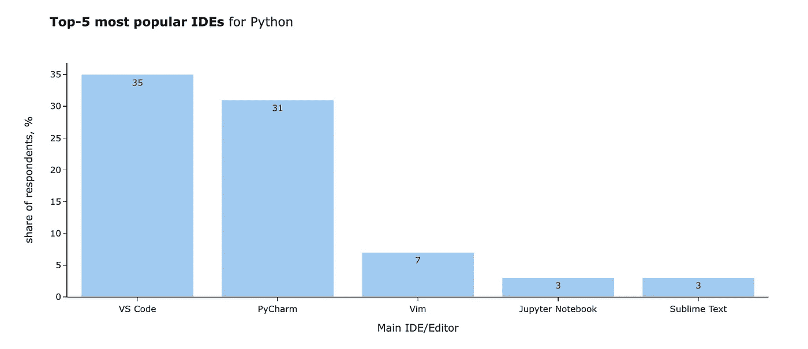
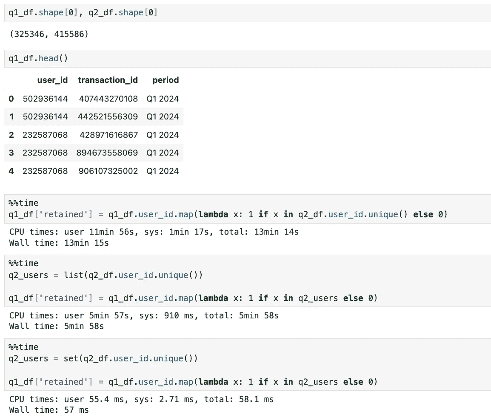
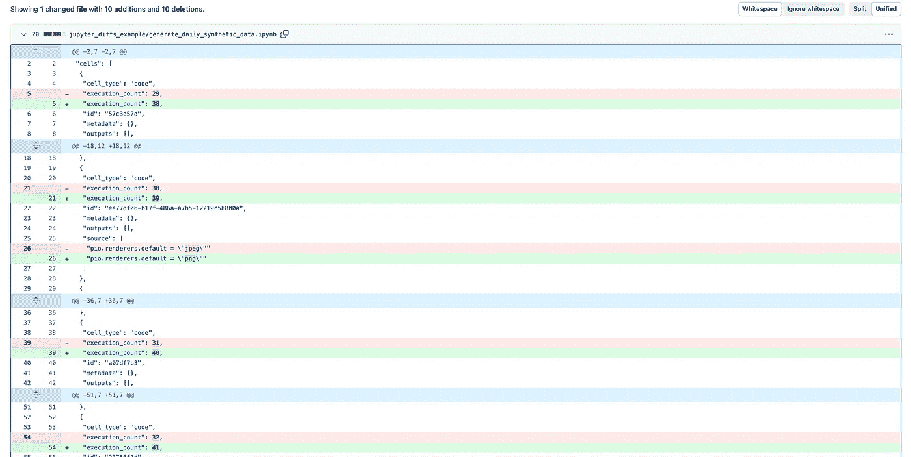
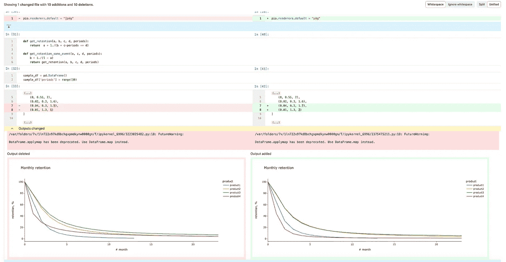

# 从代码到洞察：数据分析师的软件工程最佳实践

> 原文：[`towardsdatascience.com/from-code-to-insights-software-engineering-best-practices-for-data-analysts-0dd6a2aaadfc?source=collection_archive---------0-----------------------#2024-06-06`](https://towardsdatascience.com/from-code-to-insights-software-engineering-best-practices-for-data-analysts-0dd6a2aaadfc?source=collection_archive---------0-----------------------#2024-06-06)

## 每个数据分析师都应该知道的十大工程经验

[](https://miptgirl.medium.com/?source=post_page---byline--0dd6a2aaadfc--------------------------------)[](https://towardsdatascience.com/?source=post_page---byline--0dd6a2aaadfc--------------------------------) [Mariya Mansurova](https://miptgirl.medium.com/?source=post_page---byline--0dd6a2aaadfc--------------------------------)

·发表于 [Towards Data Science](https://towardsdatascience.com/?source=post_page---byline--0dd6a2aaadfc--------------------------------) ·16 分钟阅读·2024 年 6 月 6 日

--


图片由 DALL-E 3 生成

数据分析师的工作结合了不同领域的技能：

+   我们需要具备商业理解和领域知识，才能解决实际的商业问题，并考虑所有细节。

+   数学、统计学和基本的机器学习技能帮助我们进行严格的分析，并从数据中得出可靠的结论。

+   可视化技能和讲故事的能力使我们能够传达信息并影响产品。

+   最后但同样重要的是，计算机科学和软件工程的基础是提高效率的关键。

在大学时，我学到了很多关于计算机科学的知识。我尝试过至少十种编程语言（从低级汇编语言和 CUDA 到高级 Java 和 Scala）以及无数工具。我的第一个工作邀请是担任后端工程师。我决定不走这条路，但所有这些知识和原则对我的分析师职业生涯都非常有益。因此，我希望在这篇文章中与大家分享这些主要的原则。

# 代码不是为计算机而写的。它是为人类而写的

我从很多软件工程师那里听过这句口头禅。这在一本编程圣经《Clean Code》中得到了很好的解释。

> 确实，阅读与写作所花的时间比例远远超过 10 比 1。我们在编写新代码时，往往需要不断阅读旧代码。

在大多数情况下，工程师更倾向于选择容易理解的冗长代码，而不是简洁的惯用一行代码。

我必须坦白说，我有时会打破这个规则，写出超长的 pandas 一行代码。例如，让我们看看下面的代码。你知道这段代码在做什么吗？

```py
# ad-hoc only code
df.groupby(['month', 'feature'])[['user_id']].nunique()\
  .rename(columns = {'user_id': 'users'})\
  .join(df.groupby(['month'])[['user_id']].nunique()\
  .rename(columns = {'user_id': 'total_users'})).apply(
    lambda x: 100*x['users']/x['total_users'], axis = 1)\
  .reset_index().rename(columns = {0: 'users_share'})\
  .pivot(index = 'month', columns = 'feature', values = 'users_share')
```

坦白说，我可能需要一些时间才能在一个月内赶上这段代码的进度。为了让这段代码更具可读性，我们可以将其拆分成几个步骤。

```py
# maintainable code
monthly_features_df = df.groupby(['month', 'feature'])[['user_id']].nunique()\
    .rename(columns = {'user_id': 'users'})

monthly_total_df = df.groupby(['month'])[['user_id']].nunique()\
    .rename(columns = {'user_id': 'total_users'})

monthly_df = monthly_features_df.join(monthly_total_df).reset_index()
monthly_df['users_share'] = 100*monthly_df.users/monthly_df.total_users

monthly_df.pivot(index = 'month', columns = 'feature', values = 'users_share')
```

希望现在你能更容易地理解逻辑，并看到这段代码显示的是每个月使用各个功能的客户百分比。未来的我一定会非常高兴看到像这样的代码，并感激所有的努力。

# 自动化重复性任务

如果你有重复性很高的任务，我建议你考虑自动化。让我分享一些我自己经验中的例子，希望能对你有所帮助。

分析师自动化任务最常见的方式是创建仪表板，而不是每次手动计算数字。自助工具（*可配置的仪表板，利益相关者可以更改过滤器并查看数据*）可以节省大量时间，并让我们能够专注于更复杂且有影响力的研究。

如果仪表板不可用，还有其他自动化方式。我曾经每周制作报告，并通过电子邮件发送给利益相关者。过了一段时间，这变得非常繁琐，我开始考虑自动化。那时，我使用了一个基础工具——[cron](https://en.wikipedia.org/wiki/Cron) 在虚拟机上。我安排了一个 Python 脚本，计算最新的数字并发送电子邮件。

当你有一个脚本时，你只需要在 cron 文件中添加一行。例如，下面的这一行将在每周一上午 9:10 执行`analytical_script.py`。

```py
10 9 * * 1 python analytical_script.py
```

Cron 是一种基础但仍然可持续的解决方案。其他可以用来调度脚本的工具有 Airflow、DBT 和 Jenkins。你可能知道 Jenkins 是一种工程师常用的 CI/CD（持续集成和持续交付）工具。这可能会让你感到惊讶，它也足够可定制，可以执行分析脚本。

如果你需要更大的灵活性，是时候考虑 Web 应用程序了。在我的第一个团队中，我们没有 A/B 测试工具，因此很长一段时间，分析师必须手动分析每次更新。最终，我们编写了一个[Flask](https://flask.palletsprojects.com/en/3.0.x/) Web 应用程序，让工程师能够自助服务。现在，像[Gradio](https://www.gradio.app/)或[Streamlit](https://streamlit.io/)这样的轻量级 Web 应用程序解决方案，可以在几天内学会。

> 你可以在[我以前的一篇文章](https://medium.com/towards-data-science/understanding-retention-with-gradio-c288b48918af)中找到 Gradio 的详细指南。

# 精通你的工具

你每天在工作中使用的工具在效率和最终结果中扮演着重要角色。所以值得掌握它们。

当然，你可以使用默认的文本编辑器编写代码，但大多数人使用 IDE（集成开发环境）。你将花费大量时间在这个应用程序上，因此值得评估你的选择。

你可以从[JetBrains 2021 年调查](https://lp.jetbrains.com/python-developers-survey-2021/)中找到最流行的 Python IDE。



图表由作者制作，数据来自[JetBrains 调查](https://lp.jetbrains.com/python-developers-survey-2021/)

我通常使用 Python 和 Jupyter Notebooks 进行日常工作。在我看来，最适合这种任务的 IDE 是 JupyterLab。然而，我现在正在尝试其他选择，以便能够使用 AI 助手。自动补全的好处——它能消除大量的样板代码——对我来说是无价的，因此我愿意承担切换成本。我鼓励你去研究不同的选项，看看哪个最适合你的工作。

另一个有用的技巧是快捷键。你可以通过快捷键比使用鼠标更快地完成任务，而且看起来也很酷。我建议从谷歌搜索你的 IDE 快捷键开始，因为你通常使用这个工具最多。根据我的经验，最有价值的命令是：在 Notebook 中创建一个新单元格、运行该单元格、删除它以及将单元格转换为 markdown。

如果你有其他经常使用的工具（比如 Google Sheets 或 Slack），你也可以学习它们的命令。

学习快捷键的主要窍门是“练习，练习，再练习”——你需要重复一百次才能开始自动化操作。甚至有一些插件可以促使你更多地使用快捷键（例如，[这个插件](https://plugins.jetbrains.com/plugin/9792-key-promoter-x)来自 JetBrains）。

最后但同样重要的是 CLI（命令行界面）。刚开始它可能看起来令人生畏，但基本的 CLI 知识通常是值得的。我甚至用 CLI 来操作 GitHub，因为它让我清楚地了解发生了什么。

然而，有些情况下几乎无法避免使用 CLI，比如在远程服务器上工作。要自信地与服务器交互，你需要学习不到十个命令。这篇文章可以帮助你掌握 CLI 的基本知识。

# 管理你的环境

继续讨论工具，设置你的环境总是个好主意。我有一个[Python 虚拟环境](https://docs.python.org/3/library/venv.html)，用来日常工作并包含我通常使用的所有库。

创建一个新的虚拟环境就像在终端中输入几行代码一样简单（*这是开始使用 CLI 的绝佳机会*）。

```py
# creating venv
python -m venv routine_venv

# activating venv
source routine_venv/bin/activate

# installing ALL packages you need 
pip install pandas plotly 

# starting Juputer Notebooks
jupyter notebook
```

你可以从这个环境启动 Jupyter，或者在你的 IDE 中使用它。

对于大型项目，最好有一个独立的环境。我通常只有在需要使用不常见的技术栈（比如 PyTorch 或其他新的 LLM 框架）或遇到库兼容性问题时才会这么做。

另一种节省环境资源的方式是使用[Docker 容器](https://www.docker.com/)。我用它来处理一些更像生产环境的任务，比如在服务器上运行的 Web 应用。

# 思考程序性能

说实话，分析师通常不需要过多考虑性能。当我在数据分析领域获得第一份工作时，我的领导分享了有关性能优化的实际方法（从那时起我一直在使用它）。当你考虑性能时，要考虑总时间与努力的关系。假设我有一个运行 4 小时的 MapReduce 脚本。我需要优化它吗？这取决于情况。

+   如果我只需要运行一两次，那么花费 1 小时来优化这个脚本以便在 1 小时内计算结果是没有太大意义的。

+   如果我计划每天运行它，那么花时间让它更高效，避免浪费计算资源（和金钱）是值得的。

由于我的大多数任务是一次性研究工作，在大多数情况下，我不需要优化代码。然而，遵循一些基本规则以避免等待数小时是值得的。小技巧可以带来巨大的效果。我们来讨论一个这样的例子。

从基础开始，性能的基石是[大 O 表示法](https://en.wikipedia.org/wiki/Big_O_notation)。简而言之，大 O 表示法展示了执行时间与处理元素数量之间的关系。所以，如果我的程序是 O(n)，这意味着如果我将数据量增加 10 倍，执行时间大约会增加 10 倍。

在编写代码时，了解算法的复杂度和主要数据结构是值得的。例如，检查一个元素是否在列表中需要 O(n)的时间，但在集合中只需要 O(1)的时间。让我们看看这如何影响我们的代码。

我有两个数据框，分别包含 Q1 和 Q2 用户的交易记录，对于 Q1 数据框中的每一笔交易，我想了解该客户是否被保留。我们的数据框相对较小，大约有 30 万到 40 万行。



如你所见，性能差异非常大。

+   第一种方法是最差的，因为在每次迭代时（对于 Q1 数据集中的每一行），我们都要计算唯一的 user_ids 列表。然后，我们以 O(n)的复杂度在列表中查找元素。这个操作需要 13 分钟。

+   第二种方法，即先计算列表，稍微好一些，但仍然需要将近 6 分钟。

+   如果我们预先计算一个 user_ids 列表并将其转换为集合，我们将瞬间获得结果。

如你所见，凭借基本的知识，我们可以让代码的运行速度提高超过 10K 倍。这是一个游戏规则的改变者。

另一个普遍的建议是避免使用普通的 Python，而是优先使用性能更高的数据结构，如 `pandas` 或 `numpy`。这些库之所以更快，是因为它们对数组进行了向量化操作，而这些操作是用 C 实现的。通常，`numpy` 的性能会稍好一些，因为 `pandas` 是建立在 `numpy` 之上的，但由于一些附加功能，它的速度稍慢。

# 不要忘记 DRY 原则。

DRY 代表“不要重复自己”，这一原则不言自明。它推崇结构化的模块化代码，你可以轻松地重复使用。

如果你已经复制粘贴了一段代码三次，那是时候考虑代码结构，思考如何将这个逻辑封装起来。

标准的分析任务是数据整理，我们通常遵循过程化范式。因此，结构化代码最明显的方式是函数。然而，你也可以遵循面向对象编程并创建类。在 [我之前的文章](https://medium.com/towards-data-science/practical-computer-simulations-for-product-analysts-fe61e2b577f5) 中，我分享了面向对象方法在仿真中的应用示例。

模块化代码的好处在于更好的可读性、更快的开发和更容易的修改。例如，如果你想将可视化从折线图改为区域图，你可以在一个地方进行修改，然后重新运行代码。

如果你有一堆与某一特定领域相关的函数，你可以为其创建一个 Python 包，像使用其他 Python 库一样与这些函数进行交互。这里有 [一个详细的指南](https://packaging.python.org/en/latest/tutorials/packaging-projects/) 介绍如何做到这一点。

# 利用测试

在我看来，分析领域中另一个被低估的话题是测试。软件工程师通常会有关于测试覆盖率的关键绩效指标，这对分析师也可能有帮助。然而，在许多情况下，我们的测试更多是与数据相关，而非代码本身。

我从一位同事那里学到的技巧是添加数据新鲜度的测试。我们有多个季度和年度报告的脚本，这些报告我们运行得比较少。因此，他添加了一个检查，看看我们使用的表格中的最新行是否在报告期结束后（这显示了表格是否已更新）。在 Python 中，你可以使用 [assert](https://www.w3schools.com/python/ref_keyword_assert.asp) 语句来实现这一点。

```py
assert last_record_time >= datetime.date(2023, 5, 31) 
```

如果条件满足，那么什么也不会发生。否则，你将会得到一个 `AssertionError`。这是一个快速且简单的检查，能帮助你早期发现问题。

我更倾向于验证的另一项是总和统计。例如，如果你在切片、分割和转换数据，值得检查请求和指标的总数是否保持一致。一些常见的错误有：

+   因为连接操作而产生的重复项，

+   当你使用 `pandas.groupby` 函数时，过滤掉的 `None` 值，

+   因为内连接而过滤掉的维度。

此外，我总是检查数据中是否存在重复。如果你期望每一行代表一个用户，那么行数应该等于`df.user_id.nunique()`。如果不等，说明数据有问题，需要调查。

最棘手且最有帮助的测试是常识检查。让我们讨论一些可能的方法。

+   首先，我会检查结果是否在总体上合理。例如，如果一个月的留存率为 99%，或者我在欧洲获得了 10 亿客户，那代码很可能存在 BUG。

+   其次，我会寻找其他数据来源或该主题的先前研究，以验证我的结果是否可行。

+   如果你没有其他类似的研究（例如，你在估算在新市场推出产品后的潜在收入），我建议你将你的数字与其他现有细分市场的数据进行对比。例如，如果你在另一个市场推出产品后，对收入的增量效应为当前收入的 5 倍，我会说这有点过于乐观，值得重新审视假设。

我希望这种思维方式能够帮助你获得更可行的结果。

# 鼓励团队使用版本控制系统

工程师们即使是在独立工作的小项目中，也会使用版本控制系统。同时，我常常看到分析师使用 Google Sheets 来存储他们的查询。由于我是强烈支持并倡导将所有代码存储在仓库中的人，所以我不能错过与大家分享我的想法的机会。

为什么在我的数据职业生涯中使用了超过 10 年的仓库？以下是主要的好处：

+   **可重复性**。我们经常需要调整先前的研究（例如，增加一个维度或将研究范围缩小到特定的细分市场），或者仅仅重复早期的计算。如果你以结构化的方式存储所有代码，你可以快速再现你的先前工作。这通常可以节省大量时间。

+   **透明性**。将代码与研究结果关联，可以让你的同事深入了解方法论的每个细节，这带来更多的信任，自然也能帮助发现 BUG 或潜在的改进之处。

+   **知识共享**。如果你有一个易于浏览的目录（或者你将代码链接到任务跟踪器），那么你的同事能够轻松找到你的代码，而无需从头开始调查。

+   **回滚**。你是否曾经遇到过这样一种情况：你的代码昨天还能正常运行，但今天你更改了一些东西，现在完全崩溃了？在开始定期提交代码之前，我曾经遇到过很多次这种情况。版本控制系统允许你查看整个版本历史，并对比代码或回滚到之前的正常版本。

+   **协作**。如果你和他人一起合作编写代码，可以利用版本控制系统来跟踪和合并更改。

我希望你现在能看到它的潜在好处。让我简要分享一下我通常存储代码的设置：

+   我使用 `git` + `GitHub` 作为版本控制系统，我是那个仍然使用命令行界面的恐龙（它给我一种掌控感的安慰），但你也可以使用 GitHub 应用程序或 IDE 的功能。

+   我的工作大部分是研究（代码、数字、图表、评论等），所以我将 95% 的代码存储为 Jupyter Notebooks。

+   我会将我的代码与 Jira 工单关联起来。我通常在代码库中有一个 `tasks` 文件夹，并将子文件夹命名为工单键（例如 `ANALYTICS-42`）。然后，我会将与任务相关的所有文件放在这个子文件夹中。采用这种方式，我可以在几秒钟内找到与（几乎）任何任务相关的代码。

在 GitHub 中使用 Jupyter Notebooks 有许多细微差别，值得注意。

首先，考虑一下输出内容。当你将 Jupyter Notebook 提交到代码库时，你会保存输入单元格（你的代码或评论）和输出。因此，值得注意的是，你是否真的希望共享这些输出。它可能包含个人身份信息（PII）或其他敏感数据，我不建议将这些提交。另外，输出可能非常大且没有信息量，只会让你的代码库显得杂乱无章。当你保存一个超过 10 MB 的 Jupyter Notebook 并且包含一些随机数据输出时，所有同事在执行 `git pull` 命令时都会将这些数据下载到他们的电脑上。

输出中的图表可能特别有问题。我们都喜欢优秀的交互式 Plotly 图表。不幸的是，它们在 GitHub UI 上无法呈现，因此你的同事很可能无法看到它们。为了解决这个问题，你可以将 Plotly 的输出类型切换为 PNG 或 JPEG。

```py
import plotly.io as pio
pio.renderers.default = "jpeg"
```

你可以在[文档](https://plotly.com/python/renderers/)中找到关于 Plotly 渲染器的更多详细信息。

最后但同样重要的是，Jupyter Notebooks 的差异通常很棘手。你经常会想了解代码的两个版本之间的差异。然而，默认的 GitHub 视图不会提供太多有用的信息，因为由于 notebook 元数据的变化，杂乱无章的内容太多（如下例所示）。



实际上，GitHub 几乎已经解决了这个问题。一个[丰富的差异功能](https://github.blog/changelog/2023-03-01-feature-preview-rich-jupyter-notebook-diffs/)处于预览阶段，可以让你的生活变得更轻松——你只需要在设置中开启它。



有了这个功能，我们可以轻松看到只是做了几个小的改动。我更改了默认渲染器和保留曲线的参数（所以图表也进行了更新）。

# 请求代码审查

工程师会对（几乎）所有代码变更进行同行评审。这个过程能让我们及早发现 bug，防止不良行为者或有效地共享团队中的知识。

当然，这不是万能的：审查员可能会错过 bug，或者恶意行为者可能会在流行的开源项目中引入漏洞。例如，有一个[相当可怕的故事](https://arstechnica.com/security/2024/03/backdoor-found-in-widely-used-linux-utility-breaks-encrypted-ssh-connections/)讲述了一个如何在广泛使用于流行 Linux 发行版的压缩工具中植入后门的事件。

然而，有证据表明，代码审查确实有帮助。麦康奈尔在他的经典书籍[《代码大全》](https://www.amazon.co.uk/Code-Complete-Practical-Handbook-Construction/dp/0735619670)中分享了以下统计数据。

> … 软件测试单独进行时效果有限 —— 单元测试的平均缺陷检测率只有 25%，功能测试为 35%，集成测试为 45%。相比之下，设计和代码检查的平均有效性分别为 55%和 60%。

尽管有这些好处，分析师们通常根本不进行代码审查。我能理解为什么这可能是一个挑战：

+   分析团队通常较小，花费有限的资源进行反复检查可能听起来不太合理。

+   相当多时候，分析师工作于不同领域，而你可能是唯一一个了解这个领域足够好来进行代码审查的人。

然而，我真的鼓励你进行代码审查，至少对于关键的内容，以减轻风险。以下是我会要求同事仔细检查我的代码和假设的情况：

+   当我在一个新领域使用数据时，总是一个好主意请专家审核所用的假设；

+   所有与客户沟通或干预相关的任务，因为此类数据中的错误可能会导致重大影响（例如，我们可能会向客户传递错误信息或错误地停用某些人）；

+   高风险决策：如果你计划投入团队六个月的时间来进行项目开发，那么值得反复检查；

+   当结果出乎意料时：当我看到令人惊讶的结果时，第一个要测试的假设是检查代码中是否存在错误。

当然，这并不是一个详尽无遗的列表，但我希望你能理解我的推理，并用常识来判断何时需要寻求代码审查。

# 保持最新

这句著名的刘易斯·卡罗尔名言很好地代表了当前技术领域的状态。

> … 你必须尽全力奔跑，才能保持在原地。如果你想到达别的地方，你必须至少跑得比现在快两倍。

我们的领域在不断发展：每天都有新的论文发布，库被更新，新工具层出不穷，等等。软件工程师、数据分析师、数据科学家等也是如此。

现在有这么多的信息来源，根本不难找到：

+   每周来自 Towards Data Science 和其他一些订阅的电子邮件，

+   在 LinkedIn 和 X（前 Twitter）上关注专家，

+   订阅我使用的工具和库的电子邮件更新，

+   参加本地聚会。

更具挑战性的是避免被大量信息淹没。我尽量一次专注于一件事，以避免过多分心。

# 总结

以上就是对于分析师有帮助的软件工程实践。让我在这里快速总结一下：

+   代码不是为计算机写的，它是为人类写的。

+   自动化重复任务。

+   精通你的工具。

+   管理你的环境。

+   考虑程序性能。

+   不要忘记 DRY 原则。

+   利用测试。

+   鼓励团队使用版本控制系统。

+   请求代码审查。

+   保持最新状态。

数据分析结合了来自不同领域的技能，因此我相信我们可以从学习软件工程师、产品经理、设计师等的最佳实践中获益匪浅。通过采用我们同事的行之有效的技巧，我们可以提高我们的工作效率和效果。我强烈鼓励你们也去探索这些相邻领域。

> 非常感谢你阅读这篇文章。我希望这篇文章对你有启发。如果你有任何后续问题或评论，请在评论区留言。

# 参考文献

*除非另有说明，所有图片均由作者制作。*

# 致谢

我无法错过表达对我的伙伴的衷心感谢的机会，他一直与我分享他的工程智慧，并审阅了我所有的文章。
