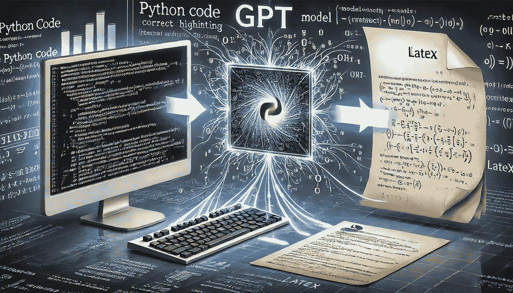

# 从代码到论文：使用 GPT 模型和 Python 生成科学 LaTeX 文档

> 原文：[`towardsdatascience.com/from-code-to-paper-using-gpt-models-and-python-to-generate-scientific-latex-documents-51922e33751a?source=collection_archive---------0-----------------------#2024-12-02`](https://towardsdatascience.com/from-code-to-paper-using-gpt-models-and-python-to-generate-scientific-latex-documents-51922e33751a?source=collection_archive---------0-----------------------#2024-12-02)

## 自动化科学代码文档化：一个基于 GPT 的概念验证（POC），用于简化工作流。

 [Peder Ward](https://medium.com/@pederw455?source=post_page---byline--51922e33751a--------------------------------)

·发布于[Towards Data Science](https://towardsdatascience.com/?source=post_page---byline--51922e33751a--------------------------------) ·阅读时间：11 分钟·2024 年 12 月 2 日

--

插图。由 ChatGPT 生成。

# **介绍**

在处理科学论文时，通常需要将算法转化为科学公式，这些公式通常以 LaTeX 格式呈现。这个过程可能非常繁琐且耗时，尤其是在大型项目中，因为它需要在代码库和 LaTeX 文档之间频繁地来回操作。

在处理一个大型算法库时，我开始探索如何简化这一工作流程。我的动机来源于手动将复杂算法转化为 LaTeX 兼容的公式时效率低下。特别的挑战是确保多个文档之间的一致性，尤其是在那些需要频繁更新公式的项目中。这促使我探索如何通过自动化来简化重复性任务，同时提高准确性。

在本文接下来的部分，我将同时使用“算法”和“科学代码”这两个术语。本文中所有的图像（封面图除外）均由作者创作。

# **目标**

我的目标是将科学代码转化为一个全面的文档，...
