# 从数据科学家到 AI 开发者：2023 年构建生成式 AI Web 应用的经验教训

> 原文：[`towardsdatascience.com/from-data-scientist-to-ai-developer-lessons-building-an-generative-ai-web-app-in-2023-95959a00a474?source=collection_archive---------0-----------------------#2024-01-21`](https://towardsdatascience.com/from-data-scientist-to-ai-developer-lessons-building-an-generative-ai-web-app-in-2023-95959a00a474?source=collection_archive---------0-----------------------#2024-01-21)

## 为任何希望构建能够服务成千上万用户的 AI Web 应用的数据科学爱好者提供的技术技巧指南

 [Isaac Tham](https://iztham.medium.com/?source=post_page---byline--95959a00a474--------------------------------)

·发布于[Towards Data Science](https://towardsdatascience.com/?source=post_page---byline--95959a00a474--------------------------------) ·阅读时间：12 分钟·2024 年 1 月 21 日

--

来源：DALLE-3

如果你像我一样，进入了数据科学的领域（无论是通过大学课程还是通过无数在线课程），你可能也曾梦想过创造一个人们可以使用的机器学习/人工智能软件产品。一个像我们计算机科学的朋友们似乎轻松编写出来的产品。

但是，如果你曾尝试过全栈网页开发，你很快就会面对配置、部署、终端命令、服务器等看似不可逾越的难题。

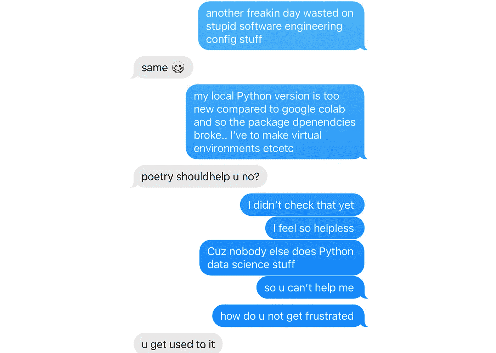

这是我在编写应用程序的初期，和我的大学室友之间无数次沮丧对话中的一幕。图片来自作者。

我对此深有体会，曾经在无数个小时里感到无助，这只让我更加深信自己永远无法制作出一个能正常运行的软件应用。

但是恰好一年前，1 月 21 日，一个因为护照问题和取消的旅行而意外空出的周末，我开始了一个制作 AI 应用程序的旅程。这是一次带我去到意想不到地方的旅程——我与一个位于世界另一端的联合创始人合作，加入了一个[旧金山初创公司加速器](https://buildspace.so/s3/demoday/Podsmart)，并最终发展到拥有数千用户并创造了可观年收入的规模（查看我的应用程序，[Podsmart](http://podsmartai.com)! 我们总结播客）。

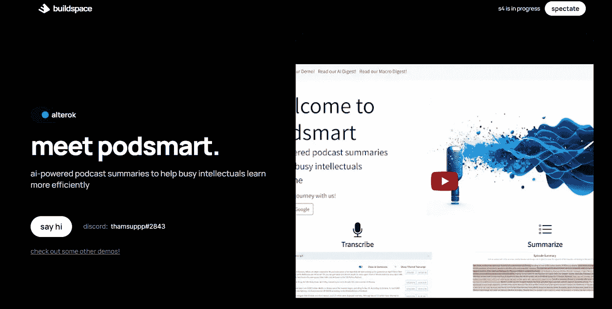

我的应用演示页面位于 Buildspace 启动加速器上。来源：[`buildspace.so/s3/demoday/Podsmart`](https://buildspace.so/s3/demoday/Podsmart)

但最重要的是，这是一段充满挫折、回溯、错误和返工的旅程。它是关于如何在没有正式计算机科学/软件工程背景的情况下，穿越困惑的开发世界。

所以，回顾过去一年来构建我的第一个软件产品，我整理了一些**技术建议**——这是为任何**数据科学爱好者**准备的，旨在帮助你构建一个**能够服务成千上万用户的功能性 Web 应用**。

本指南源于我一年的挣扎与学习，代表了我希望能告诉年轻一岁的自己的一些建议。

免责声明：这些建议来自我的个人经历，可能对其他人效果不同。我与这里推荐的任何工具没有任何关系或合作。

## **目录**

· 你想要构建的内容

· YouTube Web 开发教程的危险

∘ 提示 #1: 使用 Next.js 代替 React

∘ 提示 #2: 使用 Tailwind CSS 代替 Bootstrap 进行样式设计

· 数据科学思维模式的局限

∘ 提示 #3: 为后端选择 FastAPI 而非 Flask，并严格定义响应模型

∘ 提示 #4: 使用 TypeScript 代替 JavaScript

· 关于部署……

∘ 提示 #5: 为 GPU 后端使用 Modal

∘ 提示 #6: 使用 AWS Lambda 部署后端，使用 Vercel 部署前端

· 让生活更轻松

∘ 提示 #7: 不要用 React 自建着陆页

∘ 提示 #8: Firebase + Stripe 用于用户认证和支付

∘ 提示 #9: 实现 Sentry 进行错误监控

· 结论

# **你想要构建的内容**

要构建一个功能完整的 Web 应用，你需要一个**Web 界面**（**前端**或客户端）供用户交互，同时还需要一个**服务器**（**后端**）来进行数据处理、数据存储，并调用 ML/AI 模型。

（你可能听说过[Streamlit](https://streamlit.io/)，它非常适合做最简单的演示，但它确实缺乏自定义功能，无法做出一个可行的生产应用）

# **YouTube Web 开发教程的危险**

作为数据科学家，软件开发的许多方面让我充满忧虑，例如配置错误导致浪费数天时间。没有什么比看到某个东西坏掉，却不知道为什么坏掉以及如何修复它更令人沮丧的了。

结果是，我非常依赖**逐步教程**，尤其是在 YouTube 上，这些教程展示了从头到尾的整个过程，例如如何设置 React 项目、部署后端或网站等。

回顾过去，这里有两个主要的缺点：

首先，困惑于多个**冲突的**和**可能已过时的教程**（例如，随着 React 的新版本发布）。这常常让我在跟着教程做时，突然发现它已经不再适用了。

其次，大多数教程旨在构建酷炫的课堂演示，适合初学者。因此，它们使用框架并强化那些**性能上限低**的编码模式，这对**生产环境和扩展性**来说是**不够的**。回顾过去，我从 YouTube 教程中学到很多不好的编码习惯，现在这些习惯已经成为我将应用程序开发成一个可服务成千上万用户的在线产品的障碍。

由于你从失败中学得最多，这个过程尽管令人沮丧，却成为了我这一年中的一次巨大学习经历。希望你能从我的失败中节省大量时间。

## **技巧 #1：使用 Next.js，而不是 React**

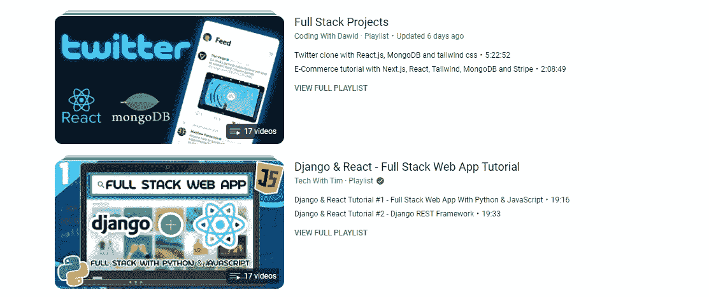

在 YouTube 上搜索“全栈应用教程”会找到很多 React 教程。来源：[`www.youtube.com/results?search_query=full+stack+app+tutorial`](https://www.youtube.com/results?search_query=full+stack+app+tutorial)

很多 YouTube 教程推荐使用 React，最初我也跟风使用了它。

然而，最终我希望提高网站的 SEO 性能——这对获取更多用户至关重要。React 的一些局限性，比如无法动态更改 meta 标签，缺乏服务器端渲染，令人沮丧，迫使我做出繁琐的切换，转向 Next.js。切换后，性能差异简直是天壤之别。

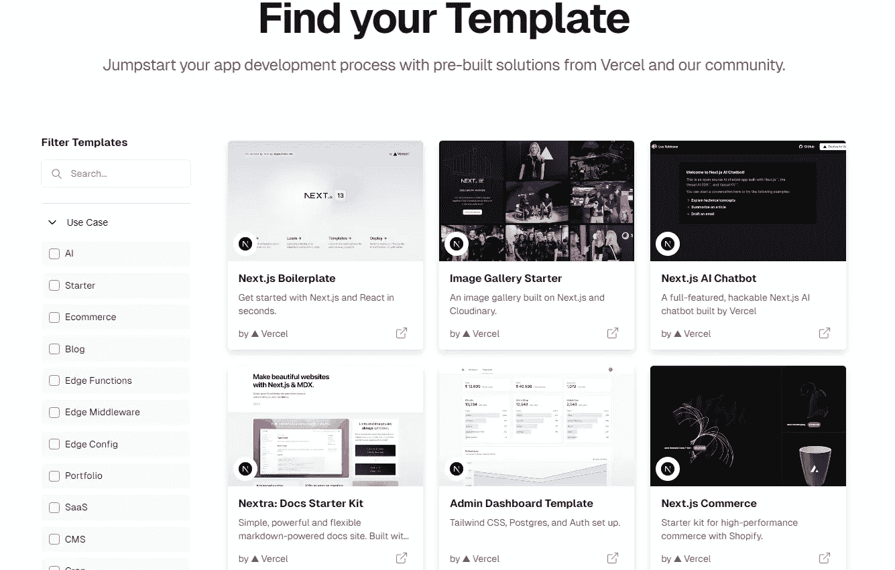

Vercel 提供了大量的 Next.js 模板，供你快速启动网站开发。来源：[`vercel.com/templates/next.js`](https://vercel.com/templates/next.js)

有些人说 React 更适合初学者，但网上有很多 Next.js 模板，比如 [Vercel（Next.js 的创造者）](https://vercel.com/templates/next.js)，尤其是 AI 应用。Next.js 真的是几乎所有 AI 应用中使用的现代 Web 框架。

## **技巧 #2：为样式选择 Tailwind CSS，而不是 Bootstrap**

在开始我的前端 UI 之旅时，我最初有些天真地跟随了一波前端教程，走向了 Bootstrap。它的吸引力？承诺通过现成的组件（如下拉菜单和手风琴组件）来简化开发。

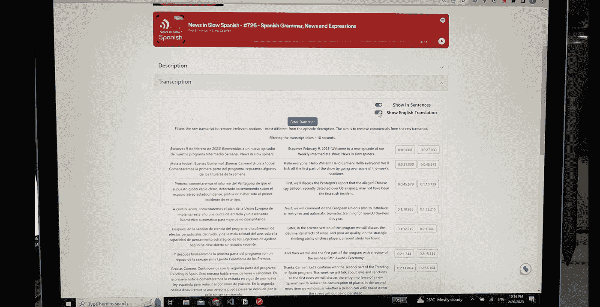

“Bootstrap 外观”——2023 年 2 月 20 日，我的网站看起来有多丑。图片来源：作者。

然而，过了一段时间，我意识到我的网站看起来……真的很丑，尤其是与那些流线型、现代的 AI 演示页面相比。那种明显的“Bootstrap 外观”——一种审美上的固执，抵制自定义，纠缠于一堆混乱命名的 CSS 类名中。所以，最终，我再次咬紧牙关，重新用 Tailwind CSS 完全重做了我的前端，花了整整三天时间。

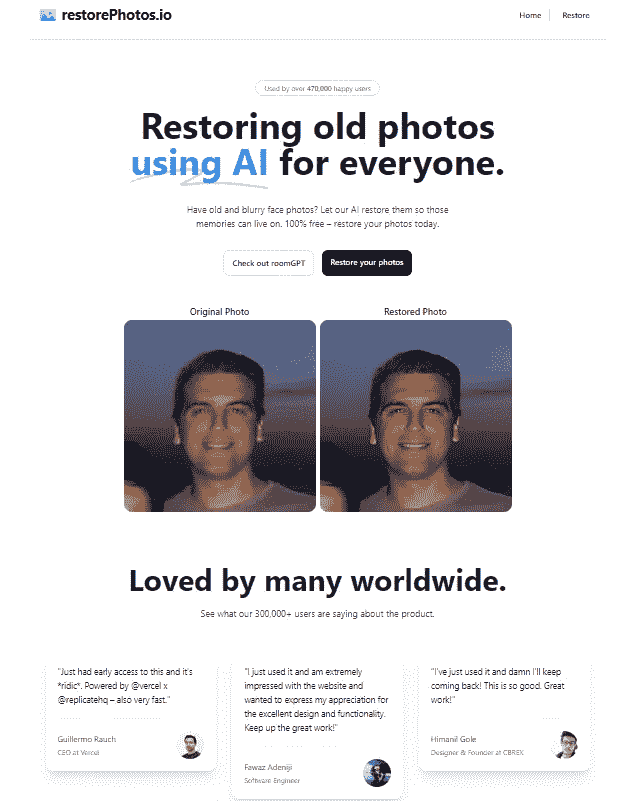

这个 AI 演示页面肯定不是用 Bootstrap 构建的。来源：restorephotos.io

如果你曾经见过一页现代且简洁的 AI 演示页面，那么它很有可能使用了 [Tailwind CSS](https://tailwindcss.com/)。

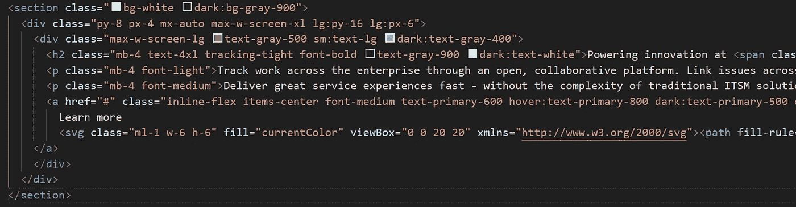

Tailwind CSS 及其实用类使得定制每个组件变得异常简单。图像来自作者。

起初，我对 Tailwind 感到害怕 — 它冗长的组件定义，充满了看起来像是难解的实用类，似乎一点也不适合初学者…我曾认为 Tailwind 缺少预构建的组件，并且记住这些实用类会很麻烦。然而，事实恰恰相反！有许多很棒的 UI 组件库是基于 Tailwind CSS 构建的 — 我使用了 [Flowbite React](https://www.flowbite-react.com/)（它包含我所需的所有组件！）

# **数据科学思维方式的陷阱**

作为一名数据科学学生，我逐渐喜欢上了 Python，它简洁且功能强大的代码语法让我受益匪浅。Python 的类型推断免去了我为每个变量定义类型的繁琐工作（这个任务我觉得很麻烦，尤其是在我在入门计算机科学课程中遇到的像 Java 这样的语言中）。

因此，我使用 JavaScript 作为前端，Python 作为后端，除非必要，否则避免定义 API 端点的类型。

然而，随着我的应用变得越来越复杂，前后端之间大量意外的类型错误大大降低了我的编码生产力。我终于理解了我的计算机科学朋友们坚持要求显式类型的重要性。事实证明，**类型定义**的细致入微不仅仅是“死板的学究式” — 它是**必不可少的**。

## **技巧 #3：为你的后端选择 FastAPI，并严格定义响应模型**

如果你在 YouTube 上搜索 Python 后端教程，大多数视频会指引你使用 Flask。就像坏掉的时钟一天会对两次一样，我不知怎么地选择了 FastAPI 作为我的 Python 后端，事后看来，确实是正确的决定。

（尽管好笑的是，我之前完全忽视了 FastAPI 的这一优势。直到最近，我才理解需要为 POST 请求定义 Pydantic 类，之前我觉得这比帮助还麻烦。）

FastAPI 具有几个改变游戏规则的优势：

+   **自动生成的 API 文档** — 这对于未来加入的工程师（或者你未来的自己）理解后端结构将非常有用！

+   **更容易编写代码** — 由于 FastAPI 基于 Json schema，定义路由比 Flask 更加简洁且易于实现 — 结果是，对于像我这样的新手，学习曲线更低。

+   **更好的性能** — FastAPI 显然比 Flask 快得多，并且消耗更少的内存 — 这对于我的应用发送大量负载非常有帮助。

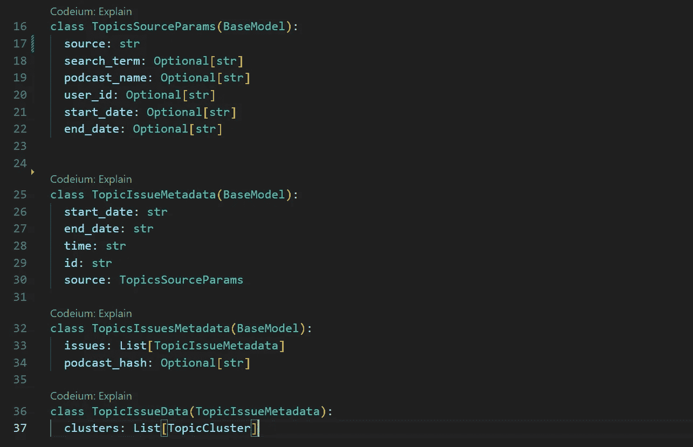

使用 Pydantic 构建数据模型，你可以用它来定义 FastAPI 路由的响应类型。图像来自作者。

但最重要的是 FastAPI 的**类型注解**。

+   FastAPI 基于 Pydantic，这是一款数据验证库，允许你将数据的“形状”定义为具有属性的类。

+   使用 FastAPI，您可以为每个 API 路由注解输入和输出类型，使用 Python 类型提示和 Pydantic 定义的类。

这确保了每个路由的输出都具有一致的数据结构。但要充分发挥这个功能，我们还需要……

## **提示 #4：使用 TypeScript 而非 JavaScript**

很长一段时间里，我手动编写前端的获取方法（再次学习来自全栈教程），因此将新路由添加到我的应用程序是一个冗长且容易出错的过程。

因此，当我的大科技公司软件工程师朋友告诉我，您可以**通过 API 规范自动生成 TypeScript 客户端代码**时，我感到非常震惊。（**更多 FastAPI 文档请见[这里](https://fastapi.tiangolo.com/advanced/generate-clients)，其中一个这样的包是 [openapi-typescript-codegen](https://github.com/ferdikoomen/openapi-typescript-codegen)）

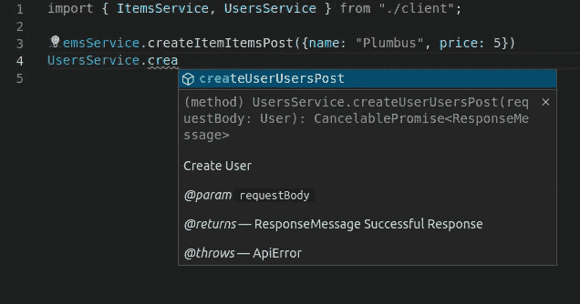

通过自动生成的 TypeScript 客户端代码，您的获取方法将根据 FastAPI 端点响应模型提供自动补全和文档。图片来自作者。

一瞬间，我意识到这将同时解决两个主要挑战：消除我手动且容易出错的客户端获取编写，并确保后端和前端之间的类型一致性。这显著减少了那些削弱我的应用程序可靠性的持续类型错误。

当然，为您的后端路由设置类型约束只有在您的前端也强制执行这些类型约束时才有意义——这自然需要**TypeScript**。

因此，我目前正在经历定义 FastAPI 后端响应模型的艰难过程，并将我的前端从 JavaScript 转换为 TypeScript。如果您从一开始就使用 FastAPI 和 TypeScript，这个过程是可以避免的！

# **关于部署……**

通过我的数据科学 / 机器学习课程，我已经习惯了进入 Google Colab，按下播放按钮，然后代码就运行了。所以，部署的想法让我感到恐惧也不足为奇。但正如 Buildspace 加速器的创始人所说，您需要“GTFOL”（Get The F Off Localhost）才能让您的软件应用对外开放。因此，我自然希望部署过程尽可能无痛。

## **提示 #5：为 GPU 后端使用 Modal**

如果您想部署自己的模型（例如机器学习模型、图像识别、Whisper 转录，或最近的开源大语言模型如 Llama），您需要一个 GPU 云服务提供商来托管您的模型。

我的建议是选择[Modal](https://modal.com/)，并永远不要回头。

Modal 以其卓越的文档和学习资源脱颖而出，提供了最新应用程序的示例代码——从微调开源大语言模型到为 LLM 聊天机器人提供服务等等。

实际上，我的整个播客转录应用是通过分叉 Modal 的示例[音频转录代码](https://modal.com/docs/examples/whisper-transcriber)开始的，所以可以毫不夸张地说，没有 Modal，我是无法构建我的应用的。

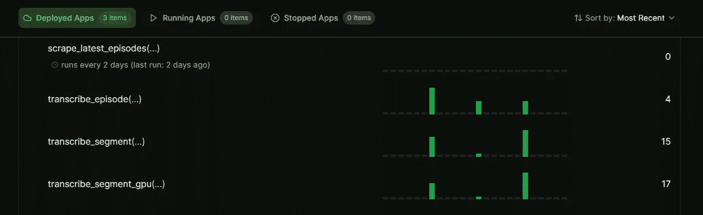

Modal 的仪表板在监控和错误追踪方面非常用户友好。图像来源：作者提供。来源：modal.com

Modal 在用户友好性方面表现突出（作为一个讨厌部署的人，这已经说明了很多问题）。只需在本地代码编辑器中编写云函数，通过一个终端命令将其部署。它的仪表板非常用户友好（特别是与 AWS 相比），让我可以轻松地追踪应用的使用情况、分析性能并追踪错误。

最后，Modal 作为我在 Lambda 没有或实现起来麻烦的功能（例如文件存储，这在下一点中会派上用场……）的逃生阀。

## **提示 #6: 使用 AWS Lambda 进行后端部署，使用 Vercel 进行前端部署**

在托管我的 Python 后端时，我对于是使用 Amazon EC2 还是 AWS Lambda 感到困惑。我的应用需要存储音频文件（这些文件可能很大），而 Lambda 的无服务器架构并不适合存储文件（它有 2 GB 的临时存储，但不持久），所以我曾认为必须使用 Amazon EC2。但是，EC2 的配置非常繁琐，而且作为一个始终在线的专用实例，它会更贵，并且更难以扩展。

这时，Modal 提供的免费文件存储成了救星，我能够将我的后端架构调整为兼容 Lambda，同时在需要时将文件下载并存储到 Modal 上。

幸运的是，[这个视频](https://www.youtube.com/watch?v=VYk3lwZbHBU)真的非常好，完全按照他们的指示操作，我成功地部署了我的后端。

对于我的前端，[Vercel](https://vercel.com/guides/deploying-react-with-vercel) 就是我所需要的一切。这个过程非常简单，除了域名费用，完全免费。

# **让生活更轻松**

最后的三个杂项提示，可以帮助你避免在开发中浪费大量时间……

## **提示 #7:** **不要使用 React 构建你自己的着陆页**

这是我又一次犯的错误，因为所有那些全栈教程让我误以为必须用 React 编写自己的着陆页。没错，你可以这么做（我也做了），但是在性能和美学上会有一个低限——而这正是成功的着陆页所需要的关键特点。

React 更适合用于像实际的 AI 应用界面这样的自定义功能。对于仅包含静态内容的着陆页，你应该使用像[Webflow](https://webflow.com/)或[Framer](https://www.framer.com/)这样的无代码网站构建工具来快速构建着陆页（并将着陆页的创建外包给你的设计师，这样你就可以专注于其他事情！）

## **提示 #8: 使用 Firebase + Stripe 进行用户认证和支付**

在用户身份验证方面，市面上的选项和教程多得让人眼花缭乱。我需要一个不仅处理身份验证，还能与支付系统集成的解决方案，以根据用户的订阅状态控制访问权限。

在尝试并失败于使用几种不同的身份验证解决方案（例如 auth0）之后，我发现 Stripe + Firebase 的组合非常有效。Firebase 有一个 Stripe 集成，能在支付成功后更新用户的订阅状态，Firebase 的 React 客户端处理客户端身份验证，而 Python 客户端则很好地管理服务器访问控制。参考这两段视频（[这里](https://www.youtube.com/watch?v=P0Udy2Gi7n8)和[这里](https://www.youtube.com/watch?v=UhrmPH3TLus)）让我成功地将这一方案实现到我的应用中。

## **技巧#9：实施 Sentry 进行错误监控**

几个月来，我完全不知道用户在我的应用上线后遇到了什么 bug。只有当我或用户发现 bug 时，我才会通过 AWS Cloudwatch 界面去排查后端的 bug。

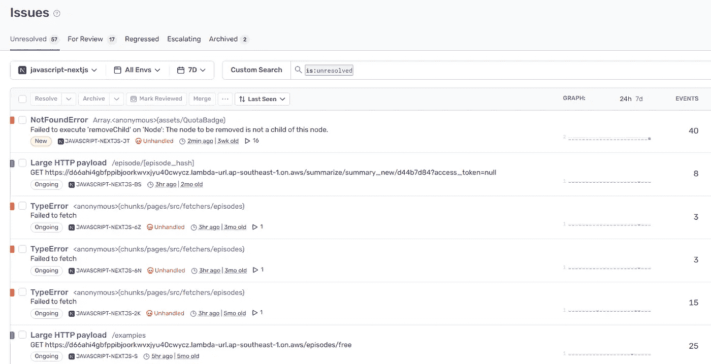

Sentry 在你的应用生产环境中追踪错误（包括前端和后端）。图像由作者提供。来源：sentry.io。

这一切持续了直到我的联合创始人向我介绍了[Sentry](https://sentry.io)，一个用于云应用性能监控和错误追踪的工具。它非常容易为前端和后端初始化，你甚至可以将其与 Slack 集成，实时接收错误通知。只是要小心不要把你免费计划的每月错误预算浪费在像身份验证超时这样的琐碎但频繁的错误上。这就是我当时遇到的情况——我不得不订阅付费计划才能找到我真正想解决的重要 bug 的日志。

**额外技巧#10：**不要尝试使用 Spotify 的 API 构建 Web 应用！我浪费了 2 个月的时间，假设我可以集成 Spotify 的 API，让用户加载他们保存的播客。但是要实现这一点，你需要申请配额扩展请求，而 Spotify 审核这个请求需要一个多月的时间。如果你的应用涉及任何 AI/ML 模型（尽管我的应用实际上并没有用 Spotify 数据训练任何模型），他们可能会拒绝你的申请（根据他们的开发者政策中禁止的措辞）。

# **结论**

我希望这篇技术指南能为其他数据科学爱好者解开一些 Web 应用开发的神秘面纱。

如果你觉得这篇文章有帮助：

1.  不妨看看我在 Medium 上的其他文章：如何使用 AI 总结长文本，[使用深度学习生成音乐](https://medium.com/towards-data-science/generating-music-using-deep-learning-cb5843a9d55e)

1.  尝试我的[应用](http://podsmartai.com) — [Podsmart](http://podsmartai.com)可以转录并总结播客和 YouTube 视频，帮助忙碌的知识工作者节省大量听力时间。

1.  在[LinkedIn](https://www.linkedin.com/in/isaacthamhy/)或[Twitter/X](https://twitter.com/thamsuppp)上关注我，或者通过消息或评论与我联系！我很乐意就所有与数据科学和人工智能相关的内容交流想法。

感谢阅读！
