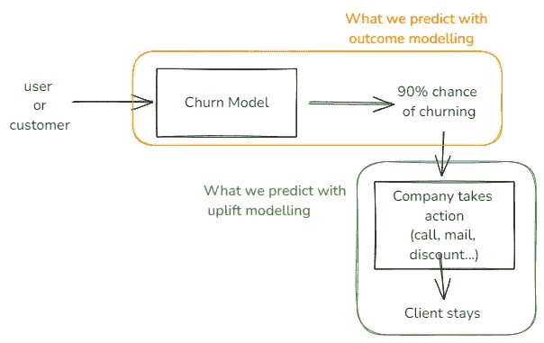
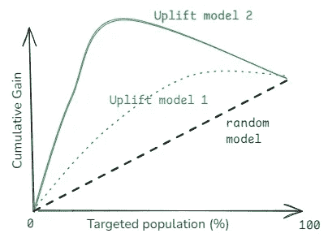
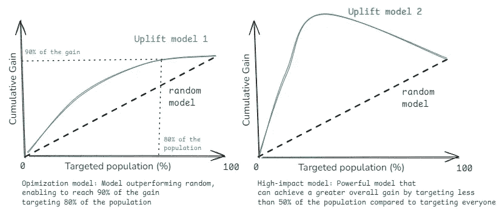

# 从洞察到影响：利用数据科学最大化客户价值

> 原文：[`towardsdatascience.com/from-insights-to-impact-leveraging-data-science-to-maximize-customer-value-9c9af354e192?source=collection_archive---------3-----------------------#2024-08-13`](https://towardsdatascience.com/from-insights-to-impact-leveraging-data-science-to-maximize-customer-value-9c9af354e192?source=collection_archive---------3-----------------------#2024-08-13)

图片由[Oleg Moroz](https://unsplash.com/@tengyart?utm_source=medium&utm_medium=referral)提供，来源于[Unsplash](https://unsplash.com/?utm_source=medium&utm_medium=referral)

## 提升建模：因果机器学习如何改变客户关系和收入

 [Arthur Cruiziat](https://medium.com/@arthur.cruiziat?source=post_page---byline--9c9af354e192--------------------------------)

·发表于[Towards Data Science](https://towardsdatascience.com/?source=post_page---byline--9c9af354e192--------------------------------) ·阅读时间：10 分钟·2024 年 8 月 13 日

--

# 本系列详细内容

本文是关于提升建模和因果机器学习系列的第一篇文章。这个系列的目的是从商业和技术角度深入探讨这些方法论。

# 介绍

想象一下：我们的科技公司每月都在获得成千上万的新客户。但在表面之下，一个令人担忧的趋势浮现：客户流失率在上升——*我们正在失去客户*——尽管财务报表显示了令人印象深刻的增长，但收入却未能跟上预期。这种脱节现在可能不是问题，但当投资者开始要求盈利时，它将成为一个问题：在科技行业，获得一个新客户的成本远远高于留住一个现有客户的成本。

我们应该做什么？许多想法浮现在脑海：在客户离开之前打电话、发送电子邮件、提供折扣。但我们应该选择哪个想法？我们应该尝试所有的方法吗？我们应该关注什么？

这就是提升建模派上用场的地方。提升建模是一种数据科学技术，能够帮助我们了解不仅是谁可能会流失，还能知道针对每个客户采取哪些行动来留住他们——当然，如果他们能被留住的话。它超越了传统的预测建模，通过关注特定行动对个别客户的增量影响。

在本文中，我们将围绕两个目标来探索这一强大技术：

+   首先，提高商业领袖对这种方法的敏感度，让他们理解它如何为他们带来益处。

+   其次，给数据科学家提供工具，让他们能够向经理推销这种方法，从而成为公司成功的助力。

# 我们将讨论以下内容：

+   什么是提升建模，它为什么如此强大？

+   提升建模的高影响力应用场景

+   投资回报率（ROI）：你可以期望从你的提升模型中获得多少影响？

+   提升建模的实践：如何实施它？

# 什么是提升建模，它为什么如此强大？

通常，公司会试图预测客户的行为，例如流失。为了做到这一点，他们会为每个用户建模流失的概率。这是“结果”建模，意味着估算用户采取特定行动的可能性。

例如，如果一个结果模型估算某个特定用户流失的概率为 90%。在这种情况下，公司可能会尝试联系该用户，以防止他们流失，对吧？这已经是一个很大的进步，并且可能有助于显著降低流失率或识别其根本原因。但这里有一个棘手的问题：如果我们识别出的一些用户实际上想离开，但他们只是懒得打电话或取消订阅呢？他们可能会利用这个电话实际上选择流失，而不是继续留在我们这里！

与结果建模不同，**提升建模是一种预测建模技术，直接衡量治疗—或行动—对个体行为的增量影响。** 这意味着我们将建模一个用户在被公司联系时，选择留存的概率。

提升模型专注于干预组和对照组之间结果的差异，使公司能够评估个体层面的实际“提升”，**识别出对每个客户最有效的行动。**

提升模型与结果模型的描述

更准确地说，提升建模使我们能够根据客户对干预/行动的反应概率，将客户分为四个组：

+   **可说服的用户**：这些是可能对行动作出积极反应的用户：他们是我们希望通过行动来吸引的目标群体。

+   **显而易见的事情**：这些是我们的客户，无论是否接受干预，都能实现预期的结果。针对这些用户进行干预通常是浪费资源。

+   **无药可救的个体**：这些人无论是否采取行动，都不太可能实现预期的结果。将资源投入到这些用户身上可能并不具备成本效益。

+   **沉睡的狗**：这些客户可能会对干预做出负面反应。针对这些客户进行干预可能会通过导致不希望发生的行为（例如，在被提醒时取消订阅）而对业务造成损害。

提升建模的目标是识别并针对那些容易说服的人，同时避免其他群体，尤其是“睡狗”群体。

回到我们的留存问题，提升建模不仅能帮助我们评估哪种行动最能提高留存率，还能帮助我们为每个用户挑选合适的行动：

+   一些用户——**可说服群体**——可能只需要一个电话或电子邮件，就能留住他们。

+   其他人——**可说服群体**——可能需要一个价值 10 美元的优惠券来被说服。

+   一些——**稳妥客户**——无需任何干预，因为他们可能会继续留存。

+   对于一些用户——**睡狗群体**——任何留存尝试可能实际上会导致他们流失，因此最好避免联系他们。

+   最后，**失去的原因**群体可能对任何留存努力都不会作出回应，因此通过不针对他们，可以节省资源。

总结来说，提升建模使我们能够**精准分配资源**，针对合适的可说服群体采取合适的行动，同时避免负面影响，从而最大化我们的投资回报率（ROI）。最终，我们能够制定一个高度个性化且有效的留存策略，优化我们的资源并提高整体客户生命周期价值。

现在我们了解了什么是提升建模及其潜在影响，让我们探索一些能够推动显著商业价值的应用场景。

# 提升建模的高影响力应用场景

在深入探讨如何设置之前，让我们研究一些提升建模对你的业务高度相关的具体应用场景。

**客户留存：** 提升建模帮助识别哪些客户最有可能对留存努力做出积极回应，从而使公司能够将资源集中在“可说服群体”上，避免打扰可能会流失的“睡狗群体”。

**追加销售与交叉销售：** 预测哪些客户最有可能对追加销售或交叉销售的优惠或促销做出积极回应，从而提高收入和客户生命周期价值（LTV），而不会打扰到那些不感兴趣的用户。提升建模确保额外的优惠针对的是那些会认为它们最有价值的用户。

**定价优化：** 提升模型可以帮助确定不同客户群体的最佳定价策略，在不排斥价格敏感型用户的情况下最大化收入。

**个性化营销活动：** 提升建模可以帮助确定哪些营销渠道（电子邮件、短信、应用内通知等）或哪种类型的广告对每个用户最有效。

这些是最常见的应用，但它可以超越以客户为中心的行动：通过足够的数据，我们可以用它来优化**客户支持优先级**，或通过对合适的员工采取合适的行动来**提高员工留存率**。

有了这些强大的应用场景，你可能会想知道如何在你的组织中实际实施提升建模。让我们深入了解将这种技术付诸实践的步骤。

# 投资回报率（ROI）：在实践中，你可以期待从提升模型中获得什么？

## 我们如何衡量提升模型的表现？

这是一个很好的问题，在探讨这种方法的潜在结果之前——说实话，这种方法确实令人印象深刻——解决这个问题是至关重要的。正如预期的那样，答案是多方面的，数据科学家有多种方法来评估模型预测一个行为增量影响的能力。

> 一种特别有趣的方法是 Qini 曲线。Qini 曲线将**累计增量收益**与目标人群的比例进行对比。

Qini 曲线示例

简单来说，它有助于回答这个问题：*通过使用你的模型针对 X%的人群进行目标定位，相较于随机目标定位，你可以实现多少额外的积极结果？* 我们通常会将提升模型的 Qini 曲线与随机目标定位策略的 Qini 曲线进行比较，以模拟如果我们没有提升模型而是随机地针对用户或客户进行目标定位时会发生什么。在构建提升模型时，最佳实践是比较所有模型的 Qini 曲线，以识别在未见数据上最有效的模型。然而，我们将在技术文章中深入探讨这一点。

现在，让我们探索这种方法的潜在影响。再次强调，可能会出现各种不同的场景。

## 我可以从我新构建的提升模型中预期到什么样的影响？

说实话，这真的取决于许多不同的变量，从你的使用场景开始：你为什么要首先构建一个提升模型？例如，你是否尝试通过只接触 80%的客户来优化资源，因为预算有限？还是你打算通过多重治疗模型来个性化你的方法？

另一个关键点是了解你的用户——你是专注于留住高度参与的客户，还是你有很多不活跃的用户和失去的机会？

即使不涉及这些具体细节，我们通常可以将潜在影响分为两大类——正如你在上面的精美图示中所看到的：

+   **优化模型：** 提升模型可以帮助你通过识别哪些用户最有可能对你的干预产生积极反应来优化资源分配。例如，你可能通过只接触 50%的用户就能实现 80%的总积极结果。虽然这种方法不一定总是优于接触所有人，但它可以显著降低成本，同时保持较高的影响力。其主要优势在于效率：用更少的资源实现几乎相同的结果。

+   **高影响力模型：** 这种类型的模型能够让你实现比接触所有人更大的总体影响。它通过识别哪些人会做出积极反应以及哪些人可能会对你的干预产生负面反应来实现这一点。这在用户群体多样化或个性化方法至关重要的场景中尤为有价值。

> 你的提升模型的有效性最终将取决于几个关键因素，包括客户的特点、数据的质量、实施策略和所选择的模型。

但是，在我们深入探讨细节之前，先简要了解如何实现你的第一个提升模型。

# 提升建模实践：如何实现？

你可能会问：如果提升建模如此强大，为什么我以前从未听说过它？答案很简单：它的设置非常复杂。它需要深入的数据科学知识、设计和运行实验的能力，以及因果机器学习的专业知识。虽然我们将在下一篇文章中更深入地探讨技术细节，但让我们概述一下创建、扩展和整合你的第一个提升模型的主要步骤：

**第一步：** **定义目标并设计实验**。首先，明确你的目标和目标受众。例如，你可能希望减少高端订阅用户的流失。然后，设计一个 A/B 测试（或随机对照试验）来测试你想尝试的所有操作。这可能包括：

+   发送个性化邮件

+   拨打客户电话

+   提供折扣

这一步可能需要一些时间，具体取决于客户数量，但它将成为你第一个模型的基础。

**第二步：构建提升模型。** 接下来，利用实验数据来构建提升模型。有趣的是，实验的实际结果在这里并不那么重要——关键是不同客户对不同行动的反应数据。这些数据帮助我们理解不同行动对客户的潜在影响。

**第三步：** **根据模型实施行动。** 有了提升模型，你现在可以为客户实施具体的行动。该模型将帮助你决定哪些行动最有可能对每个客户产生有效影响，从而进行个性化干预。

**第四步：监控并评估表现。** 为了检查你的模型是否有效，持续跟踪这些操作随时间的表现。你可以通过将模型应用于一组客户，并将其与随机选择的另一组客户进行对比，来在实际情况下测试模型的效果。这个持续的评估过程帮助你优化方法，并确保你能获得期望的结果。

**第五步：** **扩展并完善。** 为了使解决方案在更大规模上有效，最好定期更新模型。将一些客户保留下来，帮助训练下一版本的模型，并使用另一组客户来评估当前模型的效果。这种方法使你能够：

+   持续改进你的模型

+   适应客户行为的变化

+   随着时间的推移，识别新的有效行动

请记住，虽然概念简单，实施却需要专业知识。提升建模是一种迭代方法，随着时间的推移不断改进，因此耐心和持续改进是成功的关键。

# 结论

提升建模彻底改变了企业处理客户互动和营销的方式。这项技术使公司能够：

+   通过正确的行动锁定正确的客户

+   避免打扰那些可能不希望被打扰的客户

+   大规模个性化干预

+   通过优化与客户的互动最大化投资回报率！

我们已经探讨了提升建模的基本原理、关键应用和实施步骤。虽然设置过程复杂，但它在改善客户关系、增加收入和优化资源方面的好处使其对任何企业都至关重要。

在我们的下一篇文章中，我们将深入探讨技术方面的内容，帮助数据科学家有效地实施这一技术。请继续关注我们，一起探索前沿的数据科学思想。

# 来源

*除非另有说明，所有图片均由作者提供*

[1] [`en.wikipedia.org/wiki/Uplift_modelling`](https://en.wikipedia.org/wiki/Uplift_modelling)

[2] [`growthstage.marketing/improve-marketing-effectiveness-with-ml/`](https://growthstage.marketing/improve-marketing-effectiveness-with-ml/)

[3] [`forecast.global/insight/understanding-customer-behaviour-using-uplift-modelling/`](https://forecast.global/insight/understanding-customer-behaviour-using-uplift-modelling/)

[4] [`dxc.com/us/en/insights/perspectives/paper/to-tackle-data-science-challenges-think-like-an-entrepreneur`](https://dxc.com/us/en/insights/perspectives/paper/to-tackle-data-science-challenges-think-like-an-entrepreneur)

[5] [`arxiv.org/pdf/1908.05372`](https://arxiv.org/pdf/1908.05372)

[6] [`arxiv.org/abs/2308.09066`](https://arxiv.org/abs/2308.09066)
