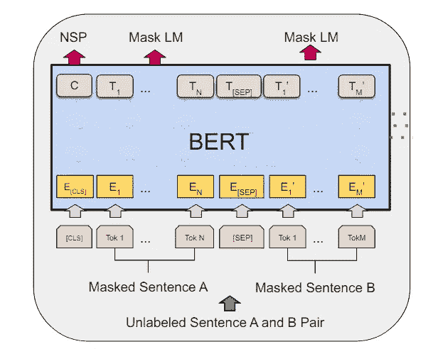
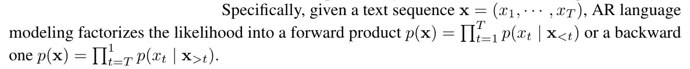
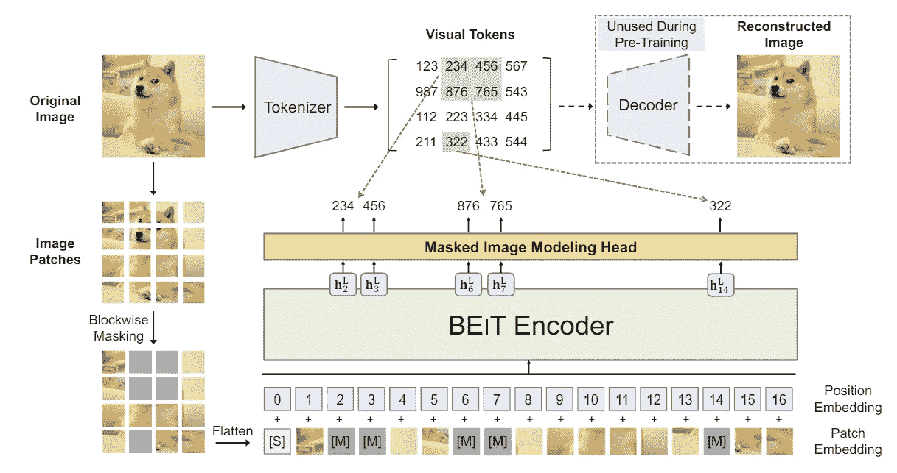
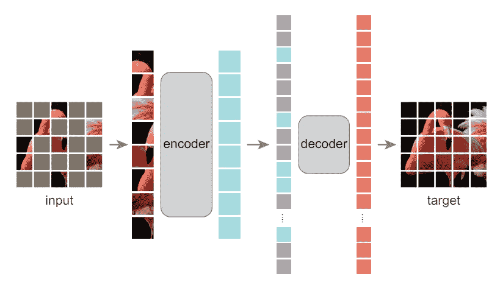
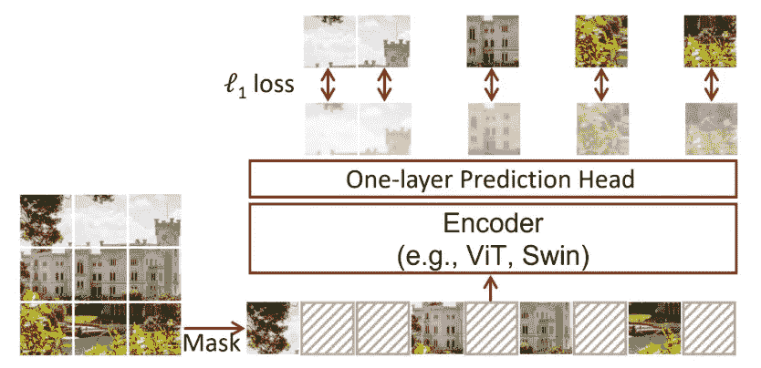
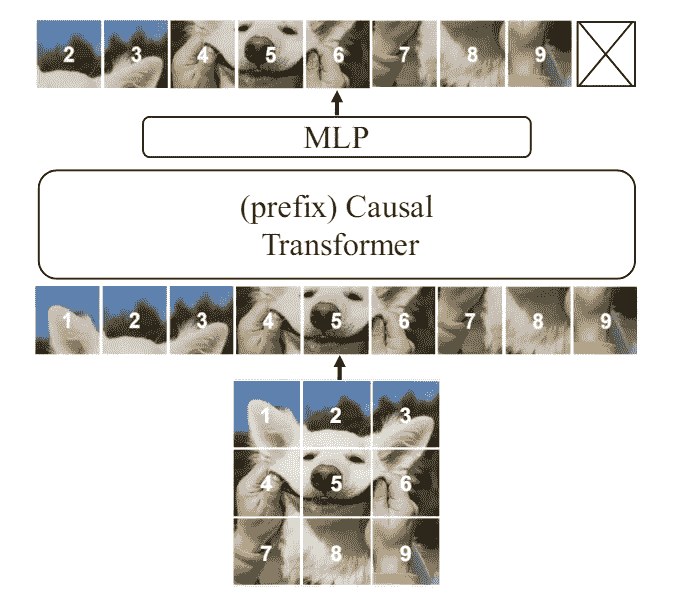
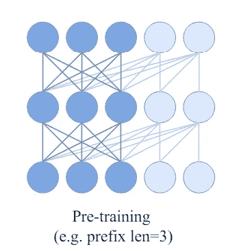
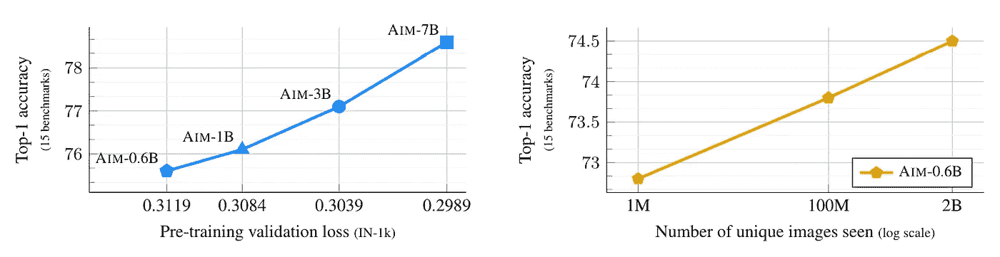
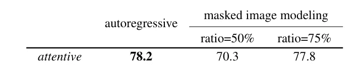

# 从遮蔽图像建模到自回归图像建模

> 原文：[`towardsdatascience.com/from-masked-image-modeling-to-autoregressive-image-modeling-d9a3cadf72a1?source=collection_archive---------6-----------------------#2024-06-10`](https://towardsdatascience.com/from-masked-image-modeling-to-autoregressive-image-modeling-d9a3cadf72a1?source=collection_archive---------6-----------------------#2024-06-10)

## 图像基础模型预训练目标的简要回顾

 [孟柳赵](https://mengliuz.medium.com/?source=post_page---byline--d9a3cadf72a1--------------------------------)

·发表于[Towards Data Science](https://towardsdatascience.com/?source=post_page---byline--d9a3cadf72a1--------------------------------) ·阅读时间 6 分钟·2024 年 6 月 10 日

--

我们渴望大型模型，不是吗？

GPT 系列已经证明了它在革命化自然语言处理（NLP）领域的能力，大家都期待着在计算机视觉领域看到同样的转变。近年来，最流行的图像基础模型包括[SegmentAnything](https://ai.meta.com/research/publications/segment-anything/)、[DINOv2](https://dinov2.metademolab.com/)等。*一个自然的问题是，这些基础模型的预训练阶段有何关键区别？*

本文将不会直接回答这个问题，而是通过回顾使用**遮蔽图像建模**的图像基础模型预训练目标来间接讨论。我们还将讨论一篇将在 ICML’24 上发表的论文，应用**自回归建模**到基础模型的预训练中。

图片来源：[`pxhere.com/en/photo/1025277`](https://pxhere.com/en/photo/1025277)

**LLM 中的模型预训练是什么？**

模型预训练是一个术语，用于描述在没有标签的情况下对模型进行训练的阶段，这一阶段模型完全通过自监督的方式进行训练，通常用于大模型（LLM、图像基础模型）。

常见的预训练技术大多起源于 LLM。例如，BERT 模型使用了遮蔽语言建模，启发了像 BEiT、MAE-ViT 和 SimMM 这样的遮蔽图像建模方法。GPT 系列使用了自回归语言建模，最近一篇被接受的 ICML 论文将这一思想扩展到自回归图像建模。

那么，什么是遮蔽语言建模和自回归语言建模呢？

**Masked Language Modeling**最早是在 2018 年 BERT 论文中提出的。该方法被描述为“简单地随机遮掩输入 token 的一部分，然后预测这些被遮掩的 token。”这是一种双向表示方法，因为模型会尝试在被遮掩的 token 上前后预测。

Masked LM 预训练。图像来源：[`arxiv.org/abs/1810.04805`](https://arxiv.org/abs/1810.04805)

自回归语言建模在 GPT3 论文中广为人知。它在 XLNet 论文中有更清晰的定义，我们可以看到该模型是单向的。GPT 系列使用单向语言模型的原因是其架构基于解码器，仅需要在提示和完成部分使用自注意力：

AR — 自回归。来源：[`arxiv.org/abs/1906.08237`](https://arxiv.org/abs/1906.08237)

**图像领域的预训练**

当进入图像领域时，第一个问题是我们如何形成图像“token 序列”。自然的想法是使用 ViT 架构，将图像分解成一个图像补丁（视觉 token）的网格。

**BEiT.** 该论文于 2022 年作为 arXiv 预印本发布，BEiT 的思路很简单。将图像切分成 14*14 的视觉 token 序列后，随机遮掩 40%的 token，用可学习的嵌入代替，并输入到 transformer 中。预训练的目标是最大化正确视觉 token 的对数似然，这一阶段无需解码器。流程如图所示。

BEiT 预训练流程。图像来源：[`arxiv.org/abs/2106.08254`](https://arxiv.org/abs/2106.08254)

在原始论文中，作者还提供了 BEiT 与变分自编码器之间的理论联系。所以自然的问题是，自编码器能否用于预训练目的？

**MAE-ViT.** 本文通过设计一个遮掩自编码器架构回答了上面的问题。采用相同的 ViT 公式和随机遮掩，作者提出在训练过程中“丢弃”被遮掩的补丁，并仅使用未遮掩的补丁作为输入传入编码器。遮掩的 token 将在预训练阶段的解码过程中用于重建。解码器可以是灵活的，范围从 1 到 12 个 transformer 块，维度在 128 到 1024 之间。更多详细的架构信息可在原始论文中找到。

Masked Autoencoder 架构。图像来源：[`arxiv.org/abs/2111.06377`](https://arxiv.org/abs/2111.06377)

**SimMIM**。与 BEiT 和 MAE-ViT 略有不同，论文提出使用灵活的主干网络，如 Swin 变换器，用于编码目的。所提出的预测头非常轻量——仅使用一个线性层的 2 层 MLP 回归掩蔽像素。

SimMIM 流程。图片来源：[`arxiv.org/abs/2111.09886`](https://arxiv.org/abs/2111.09886)

**AIM**。一篇最近被 ICML’24 接受的论文提出了使用自回归模型（或因果模型）进行预训练的方法。与使用掩蔽序列不同，该模型将完整序列输入到因果变换器中，使用带有因果掩蔽的前缀自注意力。

AIM 与因果变换器。图片来源：[`arxiv.org/abs/2401.08541`](https://arxiv.org/abs/2401.08541)

什么是前缀因果注意力？在[Kaggle](https://www.kaggle.com/code/aisuko/causal-self-attention)上有关于因果注意力掩蔽的详细教程，另外，[这里](https://magazine.sebastianraschka.com/p/understanding-and-coding-self-attention)也有相关内容，它是对自注意力中的“未来”标记进行掩蔽。然而，在这篇论文中，作者指出因果掩蔽和下游双向自注意力之间的差异可能会导致性能问题。解决方案是使用部分因果掩蔽或前缀因果注意力。在前缀序列中，使用双向自注意力，而对其余序列应用因果注意力。

预训练期间的因果注意力。图片来源：[`arxiv.org/abs/2401.08541`](https://arxiv.org/abs/2401.08541)

**自回归图像掩蔽的优势是什么**？答案在于模型和数据规模的扩展。论文声称，模型规模与预训练损失和下游任务性能直接相关（见左侧子图）。未经筛选的预训练数据规模也与下游任务性能直接相关（见右侧子图）。

AIM 的规模效应。图片来源：[`arxiv.org/abs/2401.08541`](https://arxiv.org/abs/2401.08541)

与 50%的掩蔽比率相比，AIM 在掩蔽图像建模上取得了惊人的 8%的性能提升。

表格来源：[`arxiv.org/abs/2401.08541`](https://arxiv.org/abs/2401.08541)

那么，最大的收获是什么？AIM 论文讨论了不同的预训练方法之间的权衡，我们在这里不会重复讨论。一个更浅显但更直观的教训是，**利用现有的 LLM 领域经验来改进视觉基础模型，尤其是在可扩展性方面，仍然可能有很多工作要做**。希望我们能在未来几年看到这些改进。

**参考文献**

+   El-Nouby 等人，大规模自回归图像模型的可扩展预训练。ICML 2024\. Github：[`github.com/apple/ml-aim`](https://github.com/apple/ml-aim)

+   Xie 等人，SimMIM：一种简单的 Masked 图像建模框架。CVPR 2022\. Github：[`github.com/microsoft/SimMIM`](https://github.com/microsoft/SimMIM)

+   Bao 等人，BEiT：BERT 预训练图像 Transformer。*arXiv 预印本 2022\.* Github：[`github.com/microsoft/unilm/tree/master/beit`](https://github.com/microsoft/unilm/tree/master/beit)

+   He 等人，Masked autoencoders 是可扩展的视觉学习器。CVPR 2022\. HuggingFace 官方：[`huggingface.co/docs/transformers/en/model_doc/vit_mae`](https://huggingface.co/docs/transformers/en/model_doc/vit_mae)

+   Caron 等人，自监督视觉 Transformer 中的涌现特性。ICCV 2021\. Github：[`github.com/facebookresearch/dino?tab=readme-ov-file`](https://github.com/facebookresearch/dino?tab=readme-ov-file)

+   Liu 等人，Swin Transformer：使用平移窗口的分层视觉 Transformer。ICCV 2021\. Github：[`github.com/microsoft/Swin-Transformer`](https://github.com/microsoft/Swin-Transformer)

+   Brown 等人，语言模型是少样本学习者。NeurIPS 2020\. Github：[`github.com/openai/gpt-3`](https://github.com/openai/gpt-3)

+   Yang 等人，Xlnet：用于语言理解的广义自回归预训练。NeurIPS 2019\. Github：[`github.com/zihangdai/xlnet`](https://github.com/zihangdai/xlnet)

+   Devlin 等人，BERT：用于语言理解的深度双向 Transformer 预训练。*arXiv 预印本 2018*。HuggingFace 官方：[`huggingface.co/docs/transformers/en/model_doc/bert`](https://huggingface.co/docs/transformers/en/model_doc/bert)
