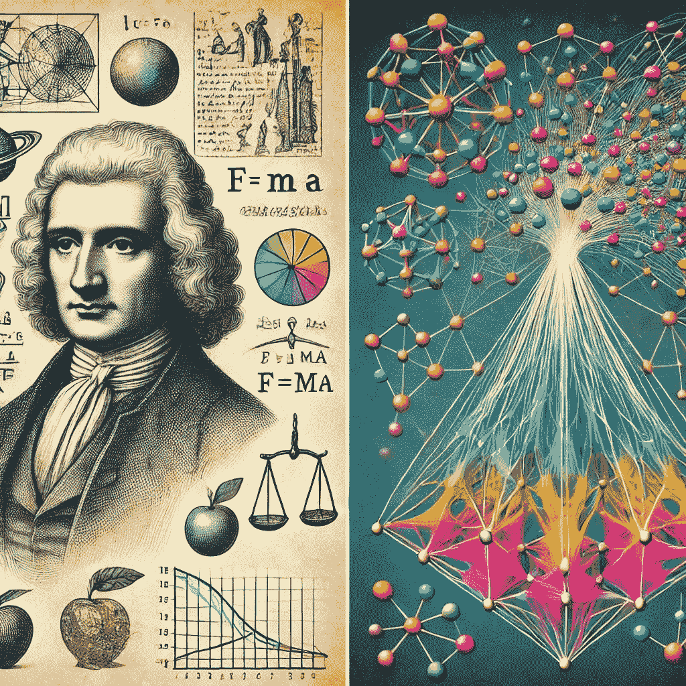

# 从牛顿到大型语言模型

> 原文：[`towardsdatascience.com/from-newton-to-neural-networks-cbbccc7e3ca0?source=collection_archive---------8-----------------------#2024-10-09`](https://towardsdatascience.com/from-newton-to-neural-networks-cbbccc7e3ca0?source=collection_archive---------8-----------------------#2024-10-09)

## 一种新的人工智能推理优化方法

 [Javier Marin](https://javier-marin.medium.com/?source=post_page---byline--cbbccc7e3ca0--------------------------------)

·发表于[Towards Data Science](https://towardsdatascience.com/?source=post_page---byline--cbbccc7e3ca0--------------------------------) ·14 分钟阅读·2024 年 10 月 9 日

--

图像由作者使用 DALL-E 生成

## 介绍

回答多跳[问答](https://en.wikipedia.org/wiki/Question_answering)（QA）问题需要多个事实，这对于大型语言模型（LLMs）中的复杂推理和解释至关重要。QA 量化并客观地测试智能系统的推理能力。由于它们具有明确的正确解决方案，QA 任务可以减少评估中的主观性和人为偏见。QA 功能能够评估演绎推理、归纳推理和溯因推理，后者涉及从部分知识中推导出最可能的答案。

我们在改善模型推理过程时面临几个挑战。最重要的需求之一是模型的可解释性和可解释性。大型人工智能模型，尤其是深度神经网络，难以理解，这使得准确评估它们并为它们的决策和结论提供易于理解的解释变得困难。另一个改善推理过程的重要目标是确保推理过程对于输入或上下文的细微变化具有鲁棒性，同时开发能够跨不同领域和问题类型泛化推理能力的模型。

## 人工智能中的物理类比的力量
