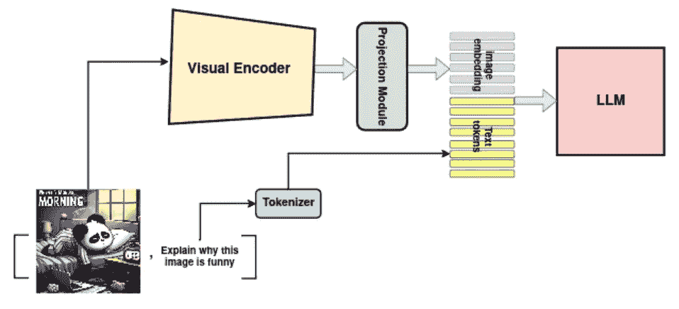

# 从单模态到多模态：构建基础模型的 DIY 技术

> 原文：[`towardsdatascience.com/from-open-source-unimodal-to-multimodal-diy-techniques-for-building-foundational-models-e1df92276379?source=collection_archive---------10-----------------------#2024-06-25`](https://towardsdatascience.com/from-open-source-unimodal-to-multimodal-diy-techniques-for-building-foundational-models-e1df92276379?source=collection_archive---------10-----------------------#2024-06-25)

## 一篇全面的教程：使用像提示适配和适配器这样的高级技术，将开源的单模态模型转化为多模态模型，包括所有 LLaMA-Adapters、LLaVa、MiniGPT-4 等变种。

 [Elahe Aghapour](https://medium.com/@InfiniteLearningLoop?source=post_page---byline--e1df92276379--------------------------------)

·发布于 [Towards Data Science](https://towardsdatascience.com/?source=post_page---byline--e1df92276379--------------------------------) ·15 分钟阅读·2024 年 6 月 25 日

--

**作者：** [Elahe Aghapour](https://medium.com/u/75214fb27311?source=post_page---user_mention--e1df92276379--------------------------------)，[Salar Rahili](https://medium.com/u/6dff1eb2cc9f?source=post_page---user_mention--e1df92276379--------------------------------)

***引言***

随着大型语言模型（LLMs）的最新进展，人工智能已成为技术的焦点。我们比以往任何时候都更渴望达到 AGI 级别的智能。然而，想要实现对周围环境的类人理解，涉及的远不止是掌握语言和文本理解。人类通过五感与世界互动，并基于这些互动采取行动以实现目标。这突显了我们的下一个步骤是开发能够融合多模态输入和输出的大型模型，从而使我们更接近类人能力。然而，我们面临着两个主要障碍。首先，我们需要一个多模态标注数据集，而这并不像文本数据那样易于获取。其次，我们已经在推升训练文本数据模型的计算能力上到达极限。将这一计算能力扩展到包括其他模态，尤其是高维度的图像和视频，是一个极具挑战性的任务。

这些限制一直是许多 AI 研究人员创建强大多模态模型的障碍。到目前为止，只有少数几家知名公司，如 Google、Meta 和 OpenAI，成功地训练了此类模型。然而，这些知名模型都不是开源的，仅提供少数 API 供公众使用。这迫使研究人员，尤其是学术界的研究人员，寻找在没有强大计算能力的情况下构建多模态模型的方法，而是依赖于开源的预训练模型，这些模型大多是单模态的。

在这篇博客中，我们重点讨论了成功且低成本的多模态模型创建方法。我们的标准集中在那些计算成本保持在几千美元以内的项目，假设这是一个典型实验室可以承担的预算。

***1- 参数高效微调（PEFT）***

在我们深入探讨整合和对齐两个预训练模型的方法之前，我们需要讨论如何在有限计算能力下微调大模型的机制。因此，我们将从探索参数高效微调（PEFT）开始，然后描述这些方法如何进一步用于对齐预训练模型并构建开源的多模态模型。

图 1\. 不同的 PEFT 方法（图片来自[论文](https://arxiv.org/pdf/2302.08106)）。

随着模型规模的持续增长，对于高效微调方法的需求变得更加关键。由于大规模预训练模型微调所有参数通常不切实际，所需的计算资源和时间非常庞大，参数高效微调（PEFT）通过冻结模型的参数，仅训练注入的具有少量参数的模块，解决了这一挑战。因此，只存储一个大规模 Transformer 副本，并搭载经过学习的特定任务轻量级 PEFT 模块，从而为每个附加任务带来非常小的开销。这种方法不仅减少了资源需求，还加速了模型向新任务的适应，使其成为在模型不断扩展的时代中一种切实可行且有效的策略。PEFT 方法在大语言模型（LLMs）和大型视觉模型中非常常见，主要可以分为三类，如图 1 所示：在已提出的几种方法中，有三种受到了社区的显著关注。

1- 适配器：适配器本质上是一个小模块，通常包括一个下采样层、非线性层和一个带有跳跃连接的上采样层，以保留原始输入。该模块被插入到预训练模型中，在微调过程中仅训练适配器。

2- LoRA 通过将可训练的低秩分解矩阵注入模型来近似权重更新，从而显著减少下游任务的可训练参数数量。对于一个维度为 d×k 的预训练权重矩阵 W，LoRA 通过低秩分解表示其更新：W+ΔW=W+DU

其中，D 的维度是 d×r，U 的维度是 r×k。这些矩阵 D 和 U 是可调参数。LoRA 可以应用于注意力矩阵和/或前馈模块，以实现高效的微调。

3- **P*-调优**（前缀调优，提示调优）通常将一组可学习的前缀向量或令牌附加到输入嵌入中，并且在下游任务的微调过程中，仅训练这些所谓的“软提示”。这种方法背后的理念是，通过一系列额外的“虚拟令牌”信息的指导，帮助预训练模型理解下游任务。软提示是与词汇表中的实际令牌无关的向量序列。相反，它们充当中介表示，指导模型的行为以完成特定任务，尽管它们与任务本身没有直接的语言学联系。

***评估 PEFT 技术：优点与局限：***

**适配器**增加少量参数（占总参数的 3-4%），使其比完全微调更高效，但低于提示调优或 LoRA。然而，由于额外的神经网络层，它们能够有效地捕捉复杂的任务特定信息，并通过学习详细的任务特征，通常能够在特定任务上取得高性能。缺点是，这种方法使模型更深，这可能会使优化过程变得复杂，并导致更长的训练时间。

**LoRA**仅添加少量参数（0.1%至 3%），使其在处理非常大的模型时具有高度的效率和可扩展性，适用于调整最先进的 LLM 和 VLM。然而，LoRA 的适应性受到低秩结构的限制。尽管 LoRA 高效，但与适配器相比，它在捕捉某些类型的任务特定信息时可能灵活性较差。

**P*-调优**在参数效率方面极为高效（通常只需要不到 0.1%），因为它仅需要学习额外的提示令牌，而保持原始模型参数不变，从而保留模型的泛化能力。然而，它可能无法像其他方法那样有效地捕捉复杂的任务特定信息。

到目前为止，我们已经回顾了用最少计算资源微调大模型的新方法。这种能力为我们提供了将两个拥有数十亿参数的大模型结合起来的机会，并且只需微调几百万个参数就能使它们协调工作。这种对齐使得一个或两个模型能够生成对另一个模型可理解的嵌入。接下来，我们将讨论三种主要方法，展示了成功实现这种训练模式的例子。

***2.1 提示适应：***

图 2\. 视觉提示的早期融合与适应提示的后期融合（图像来自[论文](https://arxiv.org/pdf/2304.15010)）

[**LLaMA-Adapter**](https://arxiv.org/pdf/2303.16199)提出了一种轻量级的适应性方法，可以有效地将[LLaMA](https://arxiv.org/pdf/2302.13971)模型微调为一个跟随指令的模型。这是通过冻结预训练的[LLaMA](https://arxiv.org/pdf/2302.13971) 7B 模型，并在最上层的变换器层中引入一组可学习的适应性提示（1.2M 参数）实现的。为了避免由于随机初始化提示而导致的初始不稳定性和效果问题，适应性提示被零初始化。此外，还引入了一个可学习的零初始化门控因子，用于自适应地控制适应性提示的重要性。

此外，[**LLaMA-Adapter**](https://arxiv.org/pdf/2303.16199)通过使用预训练的视觉编码器（如 CLIP）集成视觉信息，扩展到多模态任务。在给定图像作为视觉上下文的情况下，通过多尺度特征聚合获取全局视觉特征，然后通过一个可学习的投影网络将这些特征投影到 LLM 的适应性提示的维度。最终得到的整体图像标记会被重复 K 次，并在所有插入的 K 长度适应性提示的变换器层中逐元素相加。使用[**LLaMA-Adapter**](https://arxiv.org/pdf/2303.16199)进行微调时，在 8 个 A100 GPU 上耗时不到一小时。在[**RobustGER**](https://arxiv.org/pdf/2401.10446)中也使用了类似的方法，LLM 被微调用于执行自动语音识别中的生成错误修正（GER）去噪。这个过程在单个 NVIDIA A40 GPU 上训练需要 1.5 到 4.5 小时。

[**LLaMA-Adapter V2**](https://arxiv.org/pdf/2304.15010)专注于能够在开放式视觉指令上良好泛化的指令跟随视觉模型。为实现这一目标，相较于原始的[**LLaMA-Adapter**](https://arxiv.org/pdf/2303.16199)，提出了三项关键改进。首先，通过解冻[**LLaMA**](https://arxiv.org/pdf/2302.13971)中的所有归一化层，并为转换器中的所有线性层添加可学习的偏置和缩放因子，引入了更多可学习参数（14M），这将指令跟随能力分布到整个模型。其次，视觉标记被输入到语言模型的早期层，而适应性提示被添加到顶部层。这在不破坏模型指令跟随能力的情况下改善了视觉知识的整合（见图 2）。第三，采用了图像-文本标注数据和仅语言指令数据的联合训练范式。视觉投影层通过图像-文本标注数据进行训练，而晚期适应性提示和解冻的归一化层则通过指令跟随数据进行训练。此外，在推理过程中集成了专家模型，如标注和 OCR 系统，增强了图像理解而无需额外的训练成本。我们无法找到有关 GPU 要求和训练所需时间的具体细节。然而，根据 GitHub 上的信息，在单个 A100 GPU 上大约需要 100 小时。

***2.2 中间模块训练：***

图 3. 中间模块训练工作原理概览（图片来自作者）

为了创建一个多模态模型，可以通过一个可学习的投影模块将两个或更多单模态基础模型连接起来。该模块将一个模态的特征映射到另一个模态，从而实现不同数据类型的集成。例如，可以通过投影模块将视觉编码器连接到大型语言模型（LLM）。因此，如图 3 所示，LLM 的输入由一系列投影的图像特征和文本组成。训练过程通常包括两个阶段：

1.  **预训练**：投影模块在一大规模配对数据集上进行预训练，以实现跨模态对齐。

1.  **微调**：投影模块（具有一个或多个单模态模型）针对特定的下游任务进行微调，例如指令跟随任务。

[**MiniGPT-4**](https://arxiv.org/pdf/2304.10592)将冻结的视觉编码器[ViT-G/14](https://openaccess.thecvf.com/content/CVPR2023/papers/Fang_EVA_Exploring_the_Limits_of_Masked_Visual_Representation_Learning_at_CVPR_2023_paper.pdf)与冻结的 LLM [Vicuna](https://lmsys.org/blog/2023-03-30-vicuna/)对齐，使用一个投影层。对于视觉编码器，采用与[BLIP-2](https://arxiv.org/pdf/2301.12597)相同的预训练视觉感知组件，该组件包括[ViT-G/14](https://openaccess.thecvf.com/content/CVPR2023/papers/Fang_EVA_Exploring_the_Limits_of_Masked_Visual_Representation_Learning_at_CVPR_2023_paper.pdf)和 Q-former 网络。[**MiniGPT-4**](https://arxiv.org/pdf/2304.10592)添加了一个可学习的投影层，其输出被视为 LLM 的软提示，格式如下：

“###Human: <ImageFeatureFromProjectionLayer></Img> TextTokens. ###Assistant:”.

训练投影层涉及两个阶段。首先，在一个大型的图像-文本配对数据集上对投影层进行预训练，以获得视觉-语言知识。然后，使用一个较小且高质量的数据集对线性投影层进行微调。在这两个阶段中，所有其他参数保持冻结。因此，[**MiniGPT-4**](https://arxiv.org/pdf/2304.10592)能够生成更自然、更可靠的语言输出。[**MiniGPT-4**](https://arxiv.org/pdf/2304.10592)的训练需要大约在 4 个 A100 GPU 上训练 10 小时。

使用机器生成的指令跟随数据对 LLM 进行微调，已被证明能够提高其在新任务上的零-shot 能力。为了在多模态领域探索这一思路，[**LLaVA**](https://proceedings.neurips.cc/paper_files/paper/2023/file/6dcf277ea32ce3288914faf369fe6de0-Paper-Conference.pdf)将 LLM [Vicuna](https://lmsys.org/blog/2023-03-30-vicuna/)与视觉编码器[ViT-L/14](https://arxiv.org/pdf/2103.00020)连接，通过一个单独的线性层来处理视觉-语言指令跟随任务。在第一阶段，投影层在一个大型图像-文本配对数据集上进行训练，同时冻结视觉编码器和 LLM 的权重。此阶段创建了一个兼容冻结 LLM 的视觉标记器。在第二阶段，预训练的投影层和 LLM 权重使用一个高质量生成的数据集进行微调，这个数据集包含语言-图像指令跟随数据。此阶段增强了模型处理多模态指令并执行特定任务的能力。[**LLaVA**](https://proceedings.neurips.cc/paper_files/paper/2023/file/6dcf277ea32ce3288914faf369fe6de0-Paper-Conference.pdf)使用了 8× A100 GPU。预训练需要 4 小时，微调需要 4 到 8 小时，具体取决于任务数据集。它在视觉推理能力上展示了值得称赞的熟练度，尽管在需要简短答案的学术基准测试中表现不足。

为了提高 [**LLaVA**](https://proceedings.neurips.cc/paper_files/paper/2023/file/6dcf277ea32ce3288914faf369fe6de0-Paper-Conference.pdf) 的性能，在 [**LLaVa-1.5**](https://openaccess.thecvf.com/content/CVPR2024/papers/Liu_Improved_Baselines_with_Visual_Instruction_Tuning_CVPR_2024_paper.pdf) 中：

1.  添加了一个两层的 MLP 来将 LLM 与视觉编码器连接起来。

1.  输入图像分辨率通过使用 CLIP-ViT-L-336px 被放大，从而提高了细节感知能力。

1.  [Vicuna](https://lmsys.org/blog/2023-03-30-vicuna/) 模型已经扩展到 13B 参数。

1.  添加了面向学术任务的 VQA 数据，并包含了特定的响应格式提示，用于指示期望的输出格式。当提示简短的答案时，VQA 问题会附加上提示语：“用一个单词或短语回答问题。”

训练过程大约在 1 天内完成，使用单个 8-A100 GPU，并在多个基准测试中取得了最先进的结果。

图 4\. 视频-ChatGPT 的架构（图片来自 [论文](https://arxiv.org/pdf/2306.05424)）

[**Video-ChatGPT**](https://arxiv.org/pdf/2306.05424) 旨在创建基于视频的对话代理。鉴于视频-字幕对的稀缺性以及从零开始训练所需的巨大资源，它采用了预训练的基于图像的视觉编码器 CLIP [ViT-L/14](https://arxiv.org/pdf/2103.00020) 来处理视频任务，并通过可学习的线性投影模型将其与预训练的 LLM [Vicuna](https://lmsys.org/blog/2023-03-30-vicuna/) 连接。由于 [ViT-L/14](https://arxiv.org/pdf/2103.00020) 编码的是图像，因此对于一个包含 T 帧的视频样本，它会生成 T 个帧级别的嵌入，维度为 h*w*D。正如图 4 所示，获得视频级特征的过程包括两个关键步骤：

+   **空间视频特征**：通过在时间维度上进行平均池化帧级特征，获得 *h*w*D* 维度的特征。

+   **时间视频特征**：通过在空间维度上进行平均池化，获得 *T*D* 维度的特征。

这些时间和空间特征被连接在一起，形成视频级特征，然后通过一个可学习的线性层投影到文本嵌入空间。该模型在经过精心策划的高质量视频-文本对数据集上训练，线性投影层的训练大约需要 3 小时，使用 8 个 A100 40GB GPU。该方法使得 [**Video-ChatGPT**](https://arxiv.org/pdf/2306.05424) 能够生成关于视频内容的详细且连贯的对话。

图 5\. PandaGPT 的示意图（图片来自 [论文](https://arxiv.org/pdf/2305.16355)）

[**PandaGPT**](https://arxiv.org/pdf/2305.16355)虽然没有连接单模态模型，但通过将预训练的大型语言模型[Vicuna](https://lmsys.org/blog/2023-03-30-vicuna/)与多模态编码器[ImageBind](https://arxiv.org/pdf/2305.05665)通过线性投影层集成，首次推出了能够进行指令跟随的通用模型（见图 5）。线性投影层是经过训练的，[Vicuna](https://lmsys.org/blog/2023-03-30-vicuna/)的注意力模块使用 LoRA 在 8×A100 40G GPUs 上进行微调，训练时间为 7 小时，仅使用图像-语言（多轮对话）指令跟随数据。尽管只在图像-文本对上进行训练，[PandaGPT](https://arxiv.org/pdf/2305.16355)通过利用来自冻结的[ImageBind](https://arxiv.org/pdf/2305.05665)编码器的六种模态（图像/视频、文本、音频、深度、热图和 IMU）之间的绑定特性，表现出了新兴的零样本跨模态能力。这使得 PandaGPT 在图像/视频基础的问答、图像/视频启发的创意写作、视觉和听觉推理等任务中表现出色。

***2.3 适配器混合:***

图 6\. 多模态适配适应（MMA）概述（图片由作者提供）

[**Cheap&Quick**](https://proceedings.neurips.cc/paper_files/paper/2023/file/5e84e4413268b713f0d4a1b23a9dae57-Paper-Conference.pdf)采用轻量级适配器来集成大型语言模型（LLM）和视觉模型，处理视觉-语言任务。该论文提出了一种多模态适配器混合（MMA），旨在促进单模态和多模态指令之间的切换，同时不影响性能。提出了一种可学习的标记*t*作为模态选择器标记。这个标记指示输入特征的模态（即单模态或多模态输入），并向路由模块提供如何结合学习到的适配器输出的信息，如图 6 所示。适配器的公式为：

Z′=Z+s⋅router(f(Z),g(Z); t)

其中 Z 是输入特征，可以是单模态或连接的多模态（图像-文本）特征。模块*f*和*g*共享一个通用的[单模态适配器](https://arxiv.org/pdf/2302.08106)架构。s 是一个缩放因子，路由器(⋅)函数根据模态标记*t*确定路由路径。

为了验证 MMA 的有效性，作者通过一个线性层将[LLaMA](https://arxiv.org/pdf/2302.13971)和[CLIP-ViT](https://arxiv.org/pdf/2103.00020)连接，并将 MMA 插入到 ViT 和[LLaMA](https://arxiv.org/pdf/2302.13971)的多头注意力模块之前。适配器和投影层（仅 3.8M 参数）使用文本-图像数据和纯文本数据的混合，在 8 个 A100 GPUs 上训练了 1.4 小时。该方法显著降低了训练成本，同时在视觉-语言任务中保持了高性能。

***2.4 作为基础的模态，无需训练*** 到目前为止，我们讨论了将单一模态模型连接起来创建多模态模型的论文。然而，迈向通用人工智能（AGI）需要一个能够处理来自不同模态数据的多模态模型，以应对各种任务，从微积分到基于描述生成图像。

最近，许多论文探讨了通过语言提示将预训练的多模态模型集成到一个统一模型中的方法，该模型能够在不进行额外训练的情况下处理跨不同模态的各种任务。在这种方法中，语言作为模型之间交换信息的中介。通过提示工程（例如，[**Visual ChatGPT**](https://arxiv.org/pdf/2303.04671)，[**MM-REACT**](https://arxiv.org/pdf/2303.11381)）或微调（例如，[**Toolformer**](https://proceedings.neurips.cc/paper_files/paper/2023/file/d842425e4bf79ba039352da0f658a906-Paper-Conference.pdf)，[**GPT4Tools**](https://proceedings.neurips.cc/paper_files/paper/2023/file/e393677793767624f2821cec8bdd02f1-Paper-Conference.pdf)），大型语言模型（LLMs）可以调用专门的基础模型来处理各种模态特定的任务。虽然这个话题超出了我们当前博客文章的范围，但你可以参考这些论文以获取更详细的信息。

在另一项类似的工作中，[**MAGIC**](https://arxiv.org/pdf/2205.02655)提出了一种新颖的、无需训练的即插即用框架，并通过预训练的 CLIP 将图像嵌入作为基础来进行支撑。该框架将 GPT-2 与 CLIP 连接起来，以零样本方式执行基于图像的文本生成（例如，图像标题生成）。通过将 CLIP 图像嵌入与预训练的大型语言模型（LLM）在每个时间步生成的 top-k 词汇的相似度融入解码推理中，模型能够有效地利用视觉信息来引导文本生成。无需任何额外的训练，这种方法展示了在给定图像和文本提示的情况下生成视觉支撑故事的能力。

***3. 高质量策划数据：***

我们到目前为止讨论了对齐不同模态的各种方法；然而，重要的是要记住，在这种训练机制中拥有精心策划的高质量数据同样至关重要。例如，详细且准确的指令和回应能够显著提升大型语言模型在互动自然语言任务中的零样本表现。在互动视觉语言任务领域，高质量数据的可用性往往有限，这促使研究人员开发创新的方法来生成此类数据。

[**MiniGPT-4**](https://arxiv.org/pdf/2304.10592)提出了一种两阶段的方法，用于策划一个详细的、能够遵循指令的图像描述数据集：

1-**数据生成**：第一阶段训练中的预训练模型用于生成详细的描述。对于给定的图像，使用精心设计的提示词，使预训练模型能够分步生成详细且富有信息的图像描述。

2- **后处理与过滤**：生成的图像描述可能包含噪声或不连贯的描述。为了修正这些问题，采用 ChatGPT 根据特定的后处理要求和标准来优化生成的描述，并通过设计的提示词进行引导。然后，经过优化的数据集将手动验证，以确保图像-文本对的正确性和质量。

[**LLaVA**](https://proceedings.neurips.cc/paper_files/paper/2023/file/6dcf277ea32ce3288914faf369fe6de0-Paper-Conference.pdf)提出了一种通过基于广泛可用的图像-文本配对数据查询 ChatGPT/GPT-4 生成多模态指令跟随数据的方法。他们设计了一种提示词，包含图像字幕、定位场景中物体的边界框以及几个用于上下文学习的示例。这种方法利用了现有的丰富数据集和 ChatGPT/GPT-4 的能力，生成高度详细和准确的多模态数据。

[**Video-ChatGPT**](https://arxiv.org/pdf/2306.05424)采用了两种方法来生成高质量的视频指令数据。

1- **人工辅助注释**：专家注释员通过向字幕添加全面的细节来丰富给定的视频-字幕对。

2- **半自动注释**：这一过程涉及利用多个预训练模型的多步骤过程：

1.  预训练的[BLIP-2](https://arxiv.org/pdf/2301.12597)和[GRiT](https://arxiv.org/pdf/2212.00280)模型用于分析视频中的关键帧。[BLIP-2](https://arxiv.org/pdf/2301.12597)生成帧级别的字幕，而[GRiT](https://arxiv.org/pdf/2212.00280)提供场景对象的详细描述。此外，预训练的[Tag2Text](https://arxiv.org/pdf/2303.05657)模型为视频的每个关键帧生成标签。

1.  使用专门的过滤机制来移除任何来自[BLIP-2](https://arxiv.org/pdf/2301.12597)或[GRiT](https://arxiv.org/pdf/2212.00280)的、不符合[Tag2Text](https://arxiv.org/pdf/2303.05657)帧级标签的字幕。

1.  GPT-3.5 模型用于合并过滤后的字幕并生成一个统一且连贯的视频级字幕。

[**MIMIC-IT**](https://arxiv.org/pdf/2306.05425)生成了一个包含 280 万多模态指令-响应对的数据集，旨在增强视觉语言模型（VLMs）在感知、推理和规划方面的能力。为了展示高质量数据的重要性，他们使用 MIMIC-IT 数据集，在一天内使用 8 个 A100 GPU，经过 3 个周期的微调[OpenFlamingo](https://arxiv.org/pdf/2308.01390)。最终模型优于[OpenFlamingo](https://arxiv.org/pdf/2308.01390)，展现了更强的上下文学习和零-shot 学习能力。

> 本文所表达的观点仅代表我们个人意见，并不反映我们雇主的立场。

***参考文献:***

[1] [**LLaMA-Adapter**](https://arxiv.org/pdf/2303.16199): Zhang, Renrui, 等. “Llama-adapter: Efficient fine-tuning of language models with zero-init attention.” (2023).

[2] [**LLaMA-Adapter V2**](https://arxiv.org/pdf/2304.15010): Gao, Peng, 等. “Llama-adapter v2: Parameter-efficient visual instruction model.” (2023).

[3] [**MiniGPT-4**](https://arxiv.org/pdf/2304.10592): Zhu, Deyao, 等. “Minigpt-4: Enhancing vision-language understanding with advanced large language models.” (2023).

[4] [**LLaVA**](https://proceedings.neurips.cc/paper_files/paper/2023/file/6dcf277ea32ce3288914faf369fe6de0-Paper-Conference.pdf): Liu, Haotian, 等. “Visual instruction tuning.” (2024).

[5] [**LLaVa-1.5**](https://openaccess.thecvf.com/content/CVPR2024/papers/Liu_Improved_Baselines_with_Visual_Instruction_Tuning_CVPR_2024_paper.pdf): Liu, Haotian, 等. “Improved baselines with visual instruction tuning.” (2024).

[6] [**Video-ChatGPT**](https://arxiv.org/pdf/2306.05424): Maaz, Muhammad, 等. “Video-chatgpt: Towards detailed video understanding via large vision and language models.” (2023).

[7] [**PandaGPT**](https://arxiv.org/pdf/2305.16355): Su, Yixuan, 等. “Pandagpt: One model to instruction-follow them all.” (2023).

[8] [**Cheap&Quick**](https://proceedings.neurips.cc/paper_files/paper/2023/file/5e84e4413268b713f0d4a1b23a9dae57-Paper-Conference.pdf): Luo, Gen, 等. “Cheap and quick: Efficient vision-language instruction tuning for large language models.” (2024).

[9] [**RobustGER**](https://arxiv.org/pdf/2401.10446): Hu, Yuchen, 等. “Large Language Models are Efficient Learners of Noise-Robust Speech Recognition.” (2024).

[10] [**MAGIC**](https://arxiv.org/pdf/2205.02655): Su, Yixuan, 等. “Language models can see: Plugging visual controls in text generation.” (2022).

[11] [**Visual ChatGPT**](https://arxiv.org/pdf/2303.04671): Wu, Chenfei, 等. “Visual chatgpt: Talking, drawing and editing with visual foundation models.” (2023).

[12] [**MM-REACT**](https://arxiv.org/pdf/2303.11381): Yang, Zhengyuan, 等. “Mm-react: Prompting chatgpt for multimodal reasoning and action.” (2023).

[13] [**Toolformer**](https://proceedings.neurips.cc/paper_files/paper/2023/file/d842425e4bf79ba039352da0f658a906-Paper-Conference.pdf): Schick, Timo, 等. “Toolformer: Language models can teach themselves to use tools.” (2024).

[14] [**GPT4Tools**](https://proceedings.neurips.cc/paper_files/paper/2023/file/e393677793767624f2821cec8bdd02f1-Paper-Conference.pdf): Yang, Rui, 等. “Gpt4tools: Teaching large language model to use tools via self-instruction.” (2024).

[15] [**MIMIC-IT**](https://arxiv.org/pdf/2306.05425): Li, Bo, 等. “Mimic-it: Multi-modal in-context instruction tuning.” (2023).

[16] He, Junxian, 等. “Towards a unified view of parameter-efficient transfer learning.” (2021).
