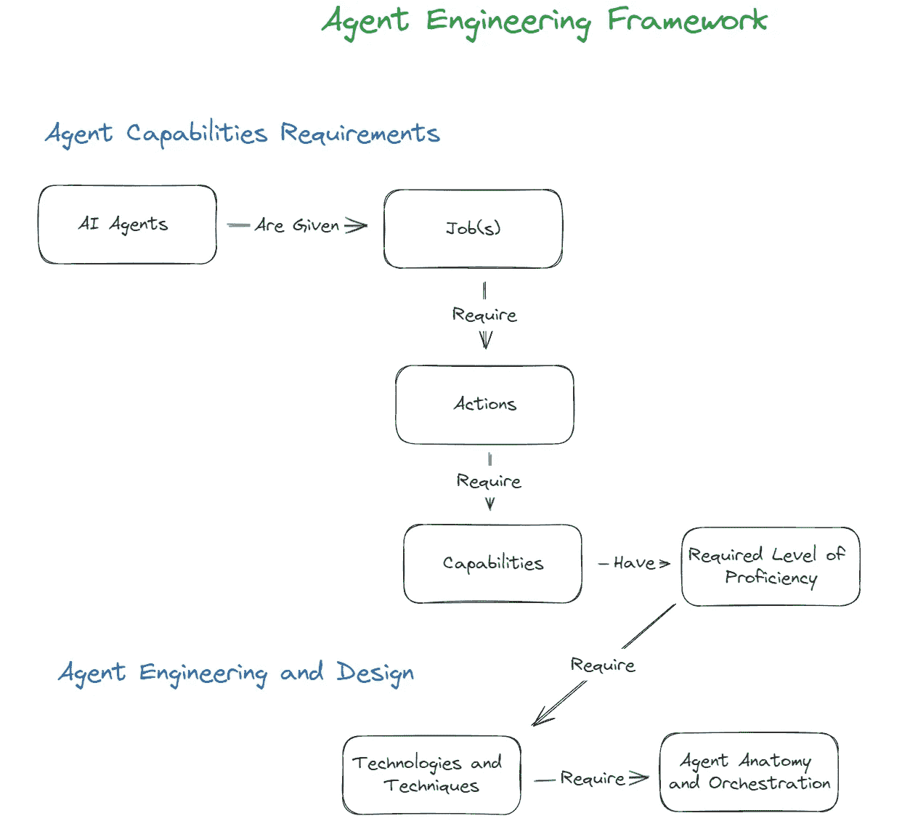

# 从提示工程到代理工程

> 原文：[`towardsdatascience.com/from-prompt-engineering-to-agent-engineering-f314fdf52a25?source=collection_archive---------0-----------------------#2024-05-29`](https://towardsdatascience.com/from-prompt-engineering-to-agent-engineering-f314fdf52a25?source=collection_archive---------0-----------------------#2024-05-29)

## 引入一个实用的代理工程框架

 [Giuseppe Scalamogna](https://medium.com/@hominum_universalis?source=post_page---byline--f314fdf52a25--------------------------------)

·发表于[数据科学前沿](https://towardsdatascience.com/?source=post_page---byline--f314fdf52a25--------------------------------) ·9 分钟阅读·2024 年 5 月 29 日

--

来源：图片由作者提供，并使用 MidJourney 生成

# **简介**

自从 ChatGPT 发布以来已经过去一年多，可以明显看出公众对“AI”的看法发生了巨大变化。这部分是由于公众认知的提升，但更大程度上是因为人们意识到，基于 AI 的系统可能（已经能够？）达到与人类相当的能力和表现。在许多方面，ChatGPT 已经成为整个 AI 领域的概念验证展示。这个展示的工作始于半个多世纪前，现在已经提供了令人信服的证据，表明我们离创造“能够执行人类所需智能的机器”的现实越来越近，借用雷·库兹韦尔的定义。因此，AI 代理的讨论和发展在最近几个月爆炸性增长也就不足为奇了。它们是 AI 一直以来追求的目标的体现。

需要明确的是，AI 代理的概念并不是一个新概念。我们的想象力已经多次进入过这个领域——《星际大战》中的 C-3PO 是最典型的体现 AI，能够理解自然语言、进行对话，并具备自主行动能力。在学术界的更正式领域，诺尔维格和拉塞尔的 AI 教科书《人工智能：现代方法》指出，智能代理是主要的统一主题。无论是源自科学还是科幻的 AI 代理理念，随着像 ChatGPT、Claude 和 Gemini 等模型的出现，它们似乎变得更加可实现，这些模型在多个知识领域表现出广泛的能力，并具备强大的理解力和人类级别的对话能力。再加上像“视觉”和功能调用等新能力，AI 代理开发的舞台已然搭建完成。

随着我们朝着 AI 代理开发的方向快速前进，似乎有必要从提示工程转向更广泛的领域，即代理工程，并建立适当的框架、方法论和思维模型，以有效地设计它们。在本文中，我旨在探讨一些在 LLM 环境中与代理工程相关的关键思想和原则。

让我们从高层次上探讨代理工程框架的关键部分。我们从“代理能力要求”开始，在这里我们旨在清晰地定义代理需要做什么以及它需要具备多高的熟练度。在“代理工程与设计”部分，我们评估可用的技术，并开始思考我们的代理的构造和协调。

这个框架的早期阐述旨在成为一个实用的思维模型，诚然在各方面并不全面。但我相信从某个地方开始并逐步改进和增强是有价值的。

# **代理工程框架**

**简介**

构建 AI 代理的目的是什么？它有工作或角色吗？是支持目标的行动？还是支持行动的目标？在某些工作中，一个多功能代理比多代理群体更合适吗？人类语言的美在于它的灵活性，并允许我们以多种方式比喻性地扩展概念。其缺点是，这可能导致歧义。在阐述框架时，我故意避免在关键术语之间解析语义区别，因为它们中的许多可以互换使用。我们努力提出一些概念，这些概念在 AI 代理工程的广泛应用中具有普遍性。因此，在这一阶段，框架更像是一个思维模型，旨在指导围绕代理工程的思维过程。正如您在下面的图形中看到的那样，核心思想相对简单：

+   AI 代理被赋予工作

+   工作需要动作来完成

+   执行动作需要能力

+   能力具有所需的熟练程度

+   所需的熟练程度需要技术和技巧

+   技术和技术需要协调

**代理能力要求**

***待完成的任务***

设计 AI 代理的初步步骤是明确列出代理需要做什么。代理需要完成的主要工作、任务或目标是什么？这可以以高层次的目标来框定，或分解为具体的工作和任务。你可以决定使用多代理群体的方法，并为每个代理分配一个任务。语言和细节的层次可以有所不同。例如：

+   一个电子商务聊天机器人的工作可能包括处理一般查询、分析客户行为并进行产品推荐。

+   内容创作代理的工作可能包括头脑风暴内容创意，以及起草文章或博客帖子。

请注意，在这两种情况下，诸如工作、任务、目标等标签可以在代理需要完成的任务的上下文中互换使用。

***执行任务所需采取的行动***

一旦待完成的任务被定义，下一步是确定代理需要执行的具体行动。这时的重点不再仅仅是定义代理需要达成的目标，而是要指定代理如何通过具体的行动来完成这些目标。在这个阶段，考虑代理的适当自主性水平也变得十分重要。例如：

对于内容创作代理，行动可能包括：

+   调用另一个代理获取内容趋势洞察。

+   根据这些趋势和目标受众的偏好生成内容创意列表。

+   起草文章或博客帖子。

+   根据人类用户的编辑和调整指令进行操作。

内容创作代理可能会自主生成和起草内容，人工编辑提供最终审核。或者，可能会雇佣一个单独的代理编辑来进行首次审核，然后再由人工编辑介入。

***所需能力***

现在我们已经概述了代理需要采取的行动来执行任务，我们接下来将阐明实现这些行动所需的能力。这些能力可以包括从自然语言对话、信息检索、内容生成、数据分析、持续学习等方面的内容。它们还可以以更技术化的层面来表达，如 API 调用、函数调用等。例如，对于我们的内容创作代理，所需的能力可能是：

+   动态调用内容趋势代理的 API。

+   头脑风暴和总结能力。

+   针对当前话题和趋势生成合适的内容。

+   能够根据人类提供的编辑指令进行操作。

+   内存

最终，重要的是以一种不会限制选择和最终技术选择的方式来表达这些能力。例如，虽然我们都非常看重大语言模型，但大行动模型（LAMs）正在迅速发展，可能对于实现所需能力非常相关。

***所需能力的熟练度水平***

确定代理执行其任务所需的能力是一个至关重要的步骤，但同样重要的是评估和定义每项能力所需的熟练度水平。这包括设定具体的基准和绩效指标，只有在这些指标得到满足时，代理及其能力才会被认为是熟练的。这些基准可以包括准确性、效率和可靠性。

例如，对于我们的内容创作代理，期望的熟练度水平可能包括：

+   75% 的函数调用可靠性。

+   99.99% 的失败函数调用可解释性。

+   内容趋势代理的函数调用能够在第一次尝试时至少 75% 的概率生成相关主题。

+   内容创意的生成能够在 75% 的时间内产生期望的主题。

+   精确率达到 99.99% 的信息检索。

+   用户反馈满意度达到 90% 或更高的编辑生成。

+   用户反馈满意度达到 90% 或更高的最终草稿生成。

**代理工程与设计**

***将所需能力与技术和技巧对应***

一旦明确了所需的能力和所需的熟练度水平，下一步就是确定我们如何满足这些要求。这涉及评估快速增长的可用技术和技巧库，包括大语言模型（LLMs）、RAG、Guardrails、专用 API 以及其他机器学习/人工智能模型，以评估它们是否能达到指定的熟练度水平。在所有情况下，考虑任何给定技术或技巧的最佳应用场景以及其成本/收益影响是很有帮助的。我将在这里简要讨论一些内容，但由于有无数的可能性，这个讨论将会在范围和深度上有所限制。

广泛的知识熟练度

广泛的知识指的是对多个领域和主题的广泛理解和信息掌握。这种类型的知识对于创建能够有效进行对话、理解上下文，并在各种主题上提供相关响应的人工智能代理至关重要。

+   *大语言模型（LLMs）——* 如果您的代理需要广泛的知识熟练度，值得庆幸的是，大语言模型的开发仍在不断推进。从像 LlaMA3 这样的开源模型，到 OpenAI、Anthropic 和 Google 的最新专有模型，提供高度一致性的技术选择应有尽有，能够覆盖广泛的人类语言和知识领域。

+   *提示工程 —* 这个动态且非常活跃的发展领域，主要关注如何激活由大语言模型（LLMs）建模的上下文相关知识领域。由于语言的万花筒特性，掌握这项技能可以对我们代理人的能力熟练度产生巨大影响。

特定知识熟练度

特定知识涉及对某些领域或主题的深入理解。这类知识对于那些需要详细专业知识和熟悉特定内容的任务是必要的。在我们追求熟练度目标时，可能需要考虑哪些技术/方法？

+   *检索增强生成（RAG）—* RAG 将 LLMs 的生成能力与信息检索系统结合起来，整合外部来源的信息。这些信息可能是精确的数据，或是 LLM 能够在上下文中“理解”的特定知识（例如描述一种独特方法的内容），因为 LLM 具备广泛的知识熟练度。

+   *模型微调 —* 在特定上下文数据集上对 LLMs 进行微调，可以使模型在特定场景中生成更符合上下文的相关回应。尽管这种方法不像 RAG 那样流行，但随着代理人工程的逐步发展，我们可能会发现，能力要求会促使我们更频繁地使用这种技术。

精确的信息

精确的信息指的是高度准确和具体的数据点，这些数据对于需要精确答案的任务至关重要。

+   *函数调用（也叫工具使用）* — 我们都警惕那些在特定事实上产生幻觉的 AI 代理人，这些事实是无可争议的。如果所需的熟练度要求如此，我们可能会转向函数调用来检索特定信息。例如，一个电子商务代理人可能使用定价 API 来提供最新的产品价格，或使用股票市场 API 来实时更新股票价值。

+   *防护措施* — 防护措施有助于确保代理人在其回应中提供精确和准确的信息。这可能涉及基于规则的约束、引导式对话设计和意图预处理。

***代理人结构与协调***

现在我们已经清楚代理人的工作内容、所需的能力和熟练度，以及实现这些的技术，我们将重点转向代理人的结构和协调，不论是在单独配置下，还是在某种类型的群体或生态系统中。能力是应该注册到一个代理人上，还是每个能力都分配给一个独特的代理人在群体中运行？我们如何开发可以最小化努力进行重新利用的能力和代理人？这个话题本身涉及多个文章，因此我们在这里不再深入探讨。从某种意义上说，这就是“纸面上的理论转化为实际操作”的地方，我们需要将多种技术和技巧编织在一起，为我们的代理人注入生命。

# 结论

从提示工程（Prompt Engineering）到智能体工程（Agent Engineering）的旅程才刚刚开始，在这个过程中还有许多内容需要学习和完善。这篇关于智能体工程框架的初步尝试，提出了一种实际的方法来设计 AI 智能体，通过概述一个高级的思维模型，作为这一演变过程中的一个有用起点。构建智能体的模型和技术将继续不断增加，迫切需要一种框架，能够脱离任何特定技术或技术类别的限制。通过清晰地定义智能体需要完成的任务，概述执行这些任务所需的动作，并指定所需的能力和熟练度水平，我们为设计和工程工作奠定了一个强大且灵活的基础。它还为智能体及其能力的改进和进化提供了一个结构。

感谢阅读，希望你在智能体相关的工作中，能从这个智能体工程框架中获得帮助。请关注未来框架的进一步完善以及对文中提到的各种话题的详细阐述。如果你想进一步讨论这个框架或我写过的其他话题，欢迎通过[LinkedIn](https://www.linkedin.com/in/giuseppe-scalamogna-8b389145/)与我联系。

除非另有说明，本文中的所有图片均为作者所有。
