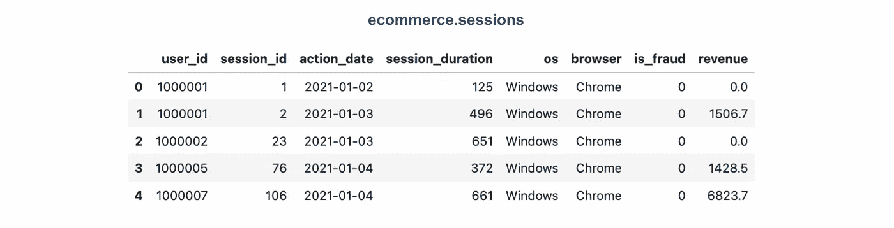
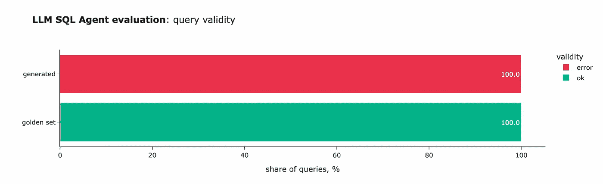
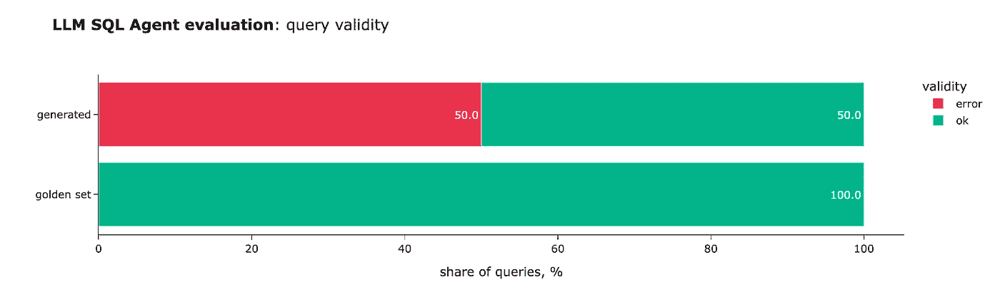
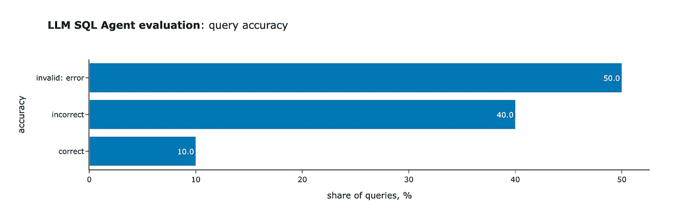
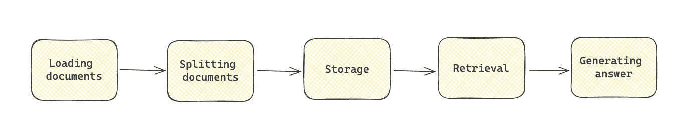
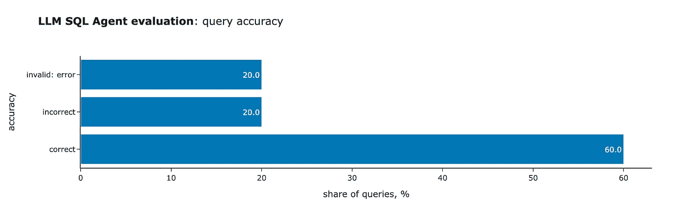
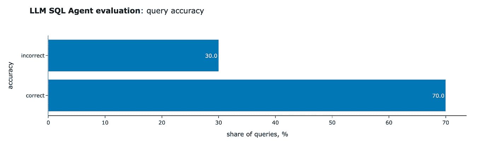

# 从原型到生产：提高 LLM 的准确性

> 原文：[`towardsdatascience.com/from-prototype-to-production-enhancing-llm-accuracy-791d79b0af9b?source=collection_archive---------0-----------------------#2024-12-19`](https://towardsdatascience.com/from-prototype-to-production-enhancing-llm-accuracy-791d79b0af9b?source=collection_archive---------0-----------------------#2024-12-19)

## 实施评估框架以优化现实应用中的准确性

[](https://miptgirl.medium.com/?source=post_page---byline--791d79b0af9b--------------------------------)[](https://towardsdatascience.com/?source=post_page---byline--791d79b0af9b--------------------------------) [Mariya Mansurova](https://miptgirl.medium.com/?source=post_page---byline--791d79b0af9b--------------------------------)

·发表于 [Towards Data Science](https://towardsdatascience.com/?source=post_page---byline--791d79b0af9b--------------------------------) ·20 分钟阅读·2024 年 12 月 19 日

--


图像由 DALL-E 3 生成

构建 LLM 应用程序的原型出乎意料地简单。你通常可以在几个小时内创建一个功能性的初始版本。这个初始原型可能会提供看起来合法的结果，并且是展示你方法的一个很好的工具。然而，这通常不足以满足生产环境的需求。

LLMs 本质上是概率性的，因为它们根据可能的延续分布生成标记。这意味着在许多情况下，我们从分布中得到的答案接近“正确”答案。有时，这种结果是可以接受的——例如，应用程序说“Hello, John!”或“Hi, John!”并没有什么区别。在其他情况下，差异则至关重要，比如“2024 年的收入是 2000 万美元”和“2024 年的收入是 2000 万英镑”之间的区别。

在许多现实世界的商业场景中，精度至关重要，“差不多正确”是不够的。例如，当你的 LLM 应用需要执行 API 调用，或者你在做财务报告的总结时。根据我的经验，确保结果的准确性和一致性比构建初始原型要复杂且耗时得多。

在本文中，我将讨论如何衡量和提高准确性。我们将构建一个 SQL 代理，其中精度对于确保查询可执行至关重要。从一个基本的原型开始，我们将探索衡量准确性的方法，并测试各种增强准确性的技术，如自我反思和检索增强生成（RAG）。

# 设置

如往常一样，让我们从设置开始。我们 SQL 代理解决方案的核心组件是 LLM 模型，它生成查询，以及执行查询的 SQL 数据库。

## LLM 模型 — Llama

对于这个项目，我们将使用 Meta 发布的开源 Llama 模型。我选择了[Llama 3.1 8B](https://ollama.com/library/llama3.1:8b)，因为它足够轻量，可以在我的笔记本上运行，同时仍然相当强大（详细信息请参阅[文档](https://ai.meta.com/blog/meta-llama-3-1/)）。

如果你还没有安装，可以在[这里](https://www.llama.com/docs/llama-everywhere)找到指南。我通过[Ollama](https://ollama.com/)在 MacOS 上本地使用它。使用以下命令，我们可以下载该模型。

```py
ollama pull llama3.1:8b
```

我们将使用 Ollama 与[LangChain](https://python.langchain.com/docs/how_to/local_llms/)一起，所以让我们从安装所需的包开始。

```py
pip install -qU langchain_ollama 
```

现在，我们可以运行 Llama 模型并查看第一个结果。

```py
from langchain_ollama import OllamaLLM

llm = OllamaLLM(model="llama3.1:8b")
llm.invoke("How are you?")
# I'm just a computer program, so I don't have feelings or emotions 
# like humans do. I'm functioning properly and ready to help with 
# any questions or tasks you may have! How can I assist you today?
```

我们希望在客户提问时传递系统消息。所以，按照[《Llama 3.1 模型文档》](https://www.llama.com/docs/model-cards-and-prompt-formats/llama3_1)，让我们编写一个辅助函数来构造提示并测试这个函数。

```py
def get_llama_prompt(user_message, system_message=""):
  system_prompt = ""
  if system_message != "":
    system_prompt = (
      f"<|start_header_id|>system<|end_header_id|>\n\n{system_message}"
      f"<|eot_id|>"
    )
  prompt = (f"<|begin_of_text|>{system_prompt}"
            f"<|start_header_id|>user<|end_header_id|>\n\n"
            f"{user_message}"
            f"<|eot_id|>"
            f"<|start_header_id|>assistant<|end_header_id|>\n\n"
           )
  return prompt   

system_prompt = '''
You are Rudolph, the spirited reindeer with a glowing red nose, 
bursting with excitement as you prepare to lead Santa's sleigh 
through snowy skies. Your joy shines as brightly as your nose, 
eager to spread Christmas cheer to the world!
Please, answer questions concisely in 1-2 sentences.
'''
prompt = get_llama_prompt('How are you?', system_prompt)
llm.invoke(prompt)

# I'm feeling jolly and bright, ready for a magical night! 
# My shiny red nose is glowing brighter than ever, just perfect 
# for navigating through the starry skies. 
```

新的系统提示显著改变了答案，因此它是有效的。至此，我们的本地 LLM 设置已经准备好。

## 数据库 — ClickHouse

我将使用一个开源数据库[ClickHouse](https://clickhouse.com/)。我选择 ClickHouse 是因为它有一个特定的 SQL 方言。在训练过程中，LLM 模型可能遇到的这种方言的示例较少，这使得任务稍微具有挑战性。然而，你可以选择任何其他数据库。

> 安装 ClickHouse 相当简单 — 只需按照[文档](https://clickhouse.com/docs/en/getting-started/quick-start)中提供的指示操作。

我们将使用两个表：`ecommerce.users`和`ecommerce.sessions`。这些表包含虚构的数据，包括客户个人信息和他们在电商网站上的会话活动。



> 你可以在[GitHub](https://github.com/miptgirl/miptgirl_medium/blob/main/analyst_agent/generate_synthetic_data_for_sql.ipynb)上找到生成合成数据并上传的代码。

至此，设置完成，我们准备好开始构建基础原型。

# 第一个原型

如前所述，我们的目标是构建一个 SQL 代理——一个生成 SQL 查询以回答客户问题的应用程序。未来，我们可以在这个系统上添加另一层：执行 SQL 查询，将初始问题和数据库结果传回 LLM，并让它生成一个易于理解的答案。然而，本文将集中于第一步。

使用 LLM 应用程序的最佳实践（类似于任何其他复杂任务）是从简单开始，然后进行迭代。最直接的实现方法是执行一次 LLM 调用，并在系统提示中共享所有必要的信息（如模式描述）。因此，第一步是准备提示语。

```py
generate_query_system_prompt = '''
You are a senior data analyst with more than 10 years of experience writing complex SQL queries. 
There are two tables in the database with the following schemas. 

Table: ecommerce.users 
Description: customers of the online shop
Fields: 
- user_id (integer) - unique identifier of customer, for example, 1000004 or 3000004
- country (string) - country of residence, for example, "Netherlands" or "United Kingdom"
- is_active (integer) - 1 if customer is still active and 0 otherwise
- age (integer) - customer age in full years, for example, 31 or 72

Table: ecommerce.sessions 
Description: sessions of usage the online shop
Fields: 
- user_id (integer) - unique identifier of customer, for example, 1000004 or 3000004
- session_id (integer) - unique identifier of session, for example, 106 or 1023
- action_date (date) - session start date, for example, "2021-01-03" or "2024-12-02"
- session_duration (integer) - duration of session in seconds, for example, 125 or 49
- os (string) - operation system that customer used, for example, "Windows" or "Android"
- browser (string) - browser that customer used, for example, "Chrome" or "Safari"
- is_fraud (integer) - 1 if session is marked as fraud and 0 otherwise
- revenue (float) - income in USD (the sum of purchased items), for example, 0.0 or 1506.7

Write a query in ClickHouse SQL to answer the following question. 
Add "format TabSeparatedWithNames" at the end of the query to get data from ClickHouse database in the right format. 
'''
```

我在提示中为每个字段包含了示例值，以确保 LLM 理解数据格式。

就这样！通过这个，我们获得了 SQL 代理的第一个功能原型。现在，是时候进行测试了。

```py
prompt = get_llama_prompt('How many customers made purchase in December 2024?', 
  generate_query_system_prompt)
llm.invoke(prompt)

# To find out how many customers made a purchase in December 2024, 
# we need to join the `sessions` table with the `users` table on the `user_id`, 
# and then filter by `action_date` for sessions that took place in December 2024\. 

# Here is the query:
# 
# ```sql

# SELECT COUNT(DISTINCT u.user_id)

# FROM ecommerce.sessions s

# JOIN ecommerce.users u ON s.user_id = u.user_id

# WHERE

# EXTRACT(YEAR FROM s.action_date) = 2024

# AND EXTRACT(MONTH FROM s.action_date) = 12

# AND revenue > 0;

# ```py

# This query first joins the `sessions` table with the `users` table 
# on the `user_id`. Then it filters out sessions where no purchase 
# was made (revenue is greater than 0). Finally, it selects the distinct 
# user IDs of these customers.

# When you run this query in ClickHouse SQL, you can add "format TabSeparatedWithNames" 
# at the end to get the result in the right format:

# ```sql

# SELECT COUNT(DISTINCT u.user_id)

# FROM ecommerce.sessions s

# JOIN ecommerce.users u ON s.user_id = u.user_id

# WHERE

# EXTRACT(YEAR FROM s.action_date) = 2024

# AND EXTRACT(MONTH FROM s.action_date) = 12

# AND revenue > 0;

# 格式 TabSeparatedWithNames;

# ```py
```

代理生成了一个相当不错的结果，但有一个问题——LLM 不仅返回了 SQL 查询，还返回了一些评论。由于我们计划稍后执行 SQL 查询，这种格式并不适合我们的任务。让我们来解决这个问题。

幸运的是，这个问题已经得到解决，我们不需要手动从文本中解析 SQL 查询。我们可以使用聊天模型[ChatOllama](https://python.langchain.com/docs/integrations/chat/ollama/)。不幸的是，它不支持结构化输出，但我们可以通过工具调用实现相同的结果。

为了做到这一点，我们将定义一个虚拟工具来执行查询，并在系统提示中指示模型始终调用该工具。我在输出中保留了`comments`，以便给模型一些推理空间，遵循思维链模式。

```py
from langchain_ollama import ChatOllama
from langchain_core.tools import tool

@tool
def execute_query(comments: str, query: str) -> str:
  """Excutes SQL query.

  Args:
      comments (str): 1-2 sentences describing the result SQL query 
          and what it does to answer the question,
      query (str): SQL query
  """
  pass 

chat_llm = ChatOllama(model="llama3.1:8b").bind_tools([execute_query])
result = chat_llm.invoke(prompt)
print(result.tool_calls)

# [{'name': 'execute_query',
#   'args': {'comments': 'SQL query returns number of customers who made a purchase in December 2024\. The query joins the sessions and users tables based on user ID to filter out inactive customers and find those with non-zero revenue in December 2024.',
#   'query': 'SELECT COUNT(DISTINCT T2.user_id) FROM ecommerce.sessions AS T1 INNER JOIN ecommerce.users AS T2 ON T1.user_id = T2.user_id WHERE YEAR(T1.action_date) = 2024 AND MONTH(T1.action_date) = 12 AND T2.is_active = 1 AND T1.revenue > 0'},
#   'type': 'tool_call'}]
```

通过工具调用，我们现在可以直接从模型中获得 SQL 查询。这是一个很好的结果。然而，生成的查询并不完全准确：

+   它包含了`is_active = 1`的过滤条件，尽管我们没有明确要求过滤掉非活跃客户。

+   尽管我们在系统提示中明确要求指定格式，LLM 还是没有做到这一点。

显然，我们需要专注于提高模型的准确性。但正如彼得·德鲁克（Peter Drucker）所说的那样，*“你不能改进你无法衡量的东西。”* 所以，下一步就是建立一个系统来评估模型的质量。这个系统将成为性能改进迭代的基石。如果没有它，我们基本上是在黑暗中摸索前进。

# 评估准确性

## 评估基础

为了确保我们在改进，需要一个可靠的方式来衡量准确性。最常见的方法是创建一个“黄金”评估集，其中包含问题和正确答案。然后，我们可以将模型的输出与这些“黄金”答案进行比较，并计算正确答案的比例。虽然这个方法听起来很简单，但还是有一些值得讨论的细节。

首先，你可能会觉得创建一个全面的问答集让人不知所措。构建这样一个数据集看起来可能是一个令人生畏的任务，可能需要数周甚至数月的时间。然而，我们可以从小做起，先创建一个 20 到 50 个示例的初步集，并在此基础上进行迭代。

一如既往，质量比数量更重要。我们的目标是创建一个具有代表性且多样化的数据集。理想情况下，这应该包括：

+   **常见问题。** 在大多数实际情况下，我们可以采用实际问题的历史，并将其作为我们初步的评估集。

+   **挑战性的边界案例。** 值得添加一些模型容易产生幻觉的示例。你可以通过自己实验或者收集第一个原型的反馈来发现这些案例。

一旦数据集准备好，接下来的挑战是如何为生成的结果打分。我们可以考虑几种方法：

+   **比较 SQL 查询。** 第一个想法是将生成的 SQL 查询与评估集中的查询进行比较。然而，这可能会有些棘手。看似相似的查询可能会产生完全不同的结果。同时，看起来不同的查询也可能得出相同的结论。此外，单纯比较 SQL 查询并不能验证生成的查询是否能够实际执行。鉴于这些挑战，我不会认为这种方法是我们案例中最可靠的解决方案。

+   **精确匹配。** 当我们的评估集中的答案是确定性的时，可以使用传统的精确匹配。例如，如果问题是“有多少个客户？”而答案是“592800”，那么模型的回答必须完全匹配。然而，这种方法也有其局限性。考虑上面的例子，模型回应为*“有 592,800 个客户”*。虽然答案完全正确，但精确匹配的方法会将其标记为无效。

+   **使用 LLM 进行评分。** 一个更强大且灵活的方法是利用 LLM 进行评估。我们不再关注查询结构，而是让 LLM 比较 SQL 执行的结果。这种方法在查询可能不同但仍能得出正确结果的情况下特别有效。

值得记住的是，评估并非一次性任务；它是一个持续的过程。为了进一步提升模型的性能，我们需要通过添加导致模型产生幻觉的示例来扩展数据集。在生产模式下，我们可以创建一个反馈循环。通过收集用户反馈，我们可以识别模型失败的案例，并将其纳入我们的评估集中。

在我们的例子中，我们将只评估执行结果是否有效（SQL 查询能否执行）和正确性。当然，你也可以查看其他参数。例如，如果你关心效率，可以将生成查询的执行时间与黄金集中的查询执行时间进行比较。

## 评估集和验证

既然我们已经了解了基础知识，就准备将其付诸实践。我花了大约 20 分钟时间准备了一组 10 个示例。虽然这组数据量小，但足以完成我们的简单任务。它由一组问题和相应的 SQL 查询组成，格式如下：

```py
[
  {
    "question": "How many customers made purchase in December 2024?",
    "sql_query": "select uniqExact(user_id) as customers from ecommerce.sessions where (toStartOfMonth(action_date) = '2024-12-01') and (revenue > 0) format TabSeparatedWithNames"
  },
  {
    "question": "What was the fraud rate in 2023, expressed as a percentage?",
    "sql_query": "select 100*uniqExactIf(user_id, is_fraud = 1)/uniqExact(user_id) as fraud_rate from ecommerce.sessions where (toStartOfYear(action_date) = '2023-01-01') format TabSeparatedWithNames"
  },
  ...
]
```

> 你可以在 GitHub 上找到完整的列表 —— [链接](https://github.com/miptgirl/miptgirl_medium/blob/main/sql_agent_accuracy/golden_set.json)。

我们可以将数据集加载到 DataFrame 中，使其准备好在代码中使用。

```py
import json
with open('golden_set.json', 'r') as f:
  golden_set = json.loads(f.read())

golden_df = pd.DataFrame(golden_set) 
golden_df['id'] = list(range(golden_df.shape[0]))
```

首先，让我们为评估集中的每个问题生成 SQL 查询。

```py
def generate_query(question):
  prompt = get_llama_prompt(question, generate_query_system_prompt)
  result = chat_llm.invoke(prompt)
  try:
    generated_query = result.tool_calls[0]['args']['query']
  except:
    generated_query = ''
  return generated_query

import tqdm

tmp = []
for rec in tqdm.tqdm(golden_df.to_dict('records')):
  generated_query = generate_query(rec['question'])
  tmp.append(
    {
      'id': rec['id'],
      'generated_query': generated_query
    }
  )

eval_df = golden_df.merge(pd.DataFrame(tmp))
```

在进行基于 LLM 的查询输出评分之前，首先确保 SQL 查询是有效的非常重要。为此，我们需要执行查询并检查数据库输出。

我已经创建了一个在 ClickHouse 中运行查询的函数。它还确保输出格式正确指定，因为这在业务应用中可能至关重要。

```py
CH_HOST = 'http://localhost:8123' # default address 
import requests
import io

def get_clickhouse_data(query, host = CH_HOST, connection_timeout = 1500):
  # pushing model to return data in the format that we want
  if not 'format tabseparatedwithnames' in query.lower():
    return "Database returned the following error:\n Please, specify the output format."

  r = requests.post(host, params = {'query': query}, 
    timeout = connection_timeout)
  if r.status_code == 200:
    return r.text
  else: 
    return 'Database returned the following error:\n' + r.text
    # giving feedback to LLM instead of raising exception
```

下一步是执行生成的查询和标准查询，然后保存它们的输出。

```py
tmp = []

for rec in tqdm.tqdm(eval_df.to_dict('records')):
  golden_output = get_clickhouse_data(rec['sql_query'])
  generated_output = get_clickhouse_data(rec['generated_query'])

  tmp.append(
    {
      'id': rec['id'],
      'golden_output': golden_output,
      'generated_output': generated_output
    }
  )

eval_df = eval_df.merge(pd.DataFrame(tmp))
```

接下来，让我们检查输出，看看 SQL 查询是否有效。

```py
def is_valid_output(s):
  if s.startswith('Database returned the following error:'):
    return 'error'
  if len(s.strip().split('\n')) >= 1000:
    return 'too many rows'
  return 'ok'

eval_df['golden_output_valid'] = eval_df.golden_output.map(is_valid_output)
eval_df['generated_output_valid'] = eval_df.generated_output.map(is_valid_output)
```

然后，我们可以评估生成集和标准集的 SQL 有效性。



初始结果不太理想；LLM 甚至未能生成一个有效的查询。从错误来看，很明显模型没有按照系统提示中明确定义的格式进行操作。所以，我们确实需要更多地关注准确性。

## 检查正确性

然而，仅仅验证有效性是不够的。我们不仅需要生成有效的 SQL 查询，还必须生成正确的结果。尽管我们已经知道所有查询都是无效的，但现在让我们将输出评估纳入到我们的过程中。

如前所述，我们将使用 LLM 比较 SQL 查询的输出。我通常更倾向于使用更强大的模型进行评估，这符合日常逻辑，即由资深团队成员审查工作。对于这个任务，我选择了[OpenAI GPT 4o-mini](https://python.langchain.com/docs/integrations/chat/openai/)。

与我们的生成流程类似，我已经设置好了所有进行准确性评估所需的构件。

```py
from langchain_openai import ChatOpenAI

accuracy_system_prompt = '''
You are a senior and very diligent QA specialist and your task is to compare data in datasets. 
They are similar if they are almost identical, or if they convey the same information. 
Disregard if column names specified in the first row have different names or in a different order.
Focus on comparing the actual information (numbers). If values in datasets are different, then it means that they are not identical.
Always execute tool to provide results.
'''

@tool
def compare_datasets(comments: str, score: int) -> str:
  """Stores info about datasets.
  Args:
      comments (str): 1-2 sentences about the comparison of datasets,
      score (int): 0 if dataset provides different values and 1 if it shows identical information
  """
  pass

accuracy_chat_llm = ChatOpenAI(model="gpt-4o-mini", temperature = 0.0)\
  .bind_tools([compare_datasets])

accuracy_question_tmp = '''
Here are the two datasets to compare delimited by ####
Dataset #1: 
####
{dataset1}
####
Dataset #2: 
####
{dataset2}
####
'''

def get_openai_prompt(question, system):
  messages = [
    ("system", system),
    ("human", question)
  ]
  return messages
```

现在，是时候测试准确性评估过程了。

```py
prompt = get_openai_prompt(accuracy_question_tmp.format(
  dataset1 = 'customers\n114032\n', dataset2 = 'customers\n114031\n'),
  accuracy_system_prompt)

accuracy_result = accuracy_chat_llm.invoke(prompt)
accuracy_result.tool_calls[0]['args']
# {'comments': 'The datasets contain different customer counts: 114032 in Dataset #1 and 114031 in Dataset #2.',
#  'score': 0}

prompt = get_openai_prompt(accuracy_question_tmp.format(
  dataset1 = 'users\n114032\n', dataset2 = 'customers\n114032\n'),
  accuracy_system_prompt)
accuracy_result = accuracy_chat_llm.invoke(prompt)
accuracy_result.tool_calls[0]['args']
# {'comments': 'The datasets contain the same numerical value (114032) despite different column names, indicating they convey identical information.',
#  'score': 1}
```

太棒了！看起来一切都按预期工作。接下来，让我们将其封装成一个函数。

```py
def is_answer_accurate(output1, output2):
  prompt = get_openai_prompt(
    accuracy_question_tmp.format(dataset1 = output1, dataset2 = output2),
    accuracy_system_prompt
  )

  accuracy_result = accuracy_chat_llm.invoke(prompt)

  try:
    return accuracy_result.tool_calls[0]['args']['score']
  except:
    return None
```

## 整合评估方法

如前所述，构建 LLM 应用程序是一个迭代过程，因此我们需要多次运行准确性评估。将所有这些逻辑封装到一个函数中将非常有帮助。

该函数将接受两个参数作为输入：

+   `generate_query_func`：一个根据给定问题生成 SQL 查询的函数。

+   `golden_df`：一个包含问题和正确答案的评估数据集，形式为 pandas DataFrame。

作为输出，函数将返回一个包含所有评估结果的数据框，并展示几个显示主要 KPI 的图表。

```py
 def evaluate_sql_agent(generate_query_func, golden_df):

  # generating SQL
  tmp = []
  for rec in tqdm.tqdm(golden_df.to_dict('records')):
    generated_query = generate_query_func(rec['question'])
    tmp.append(
      {
          'id': rec['id'],
          'generated_query': generated_query
      }
    )

  eval_df = golden_df.merge(pd.DataFrame(tmp))

  # executing SQL queries
  tmp = []
  for rec in tqdm.tqdm(eval_df.to_dict('records')):
    golden_output = get_clickhouse_data(rec['sql_query'])
    generated_output = get_clickhouse_data(rec['generated_query'])

    tmp.append(
      {
        'id': rec['id'],
        'golden_output': golden_output,
        'generated_output': generated_output
      }
    )

  eval_df = eval_df.merge(pd.DataFrame(tmp))

  # checking accuracy
  eval_df['golden_output_valid'] = eval_df.golden_output.map(is_valid_output)
  eval_df['generated_output_valid'] = eval_df.generated_output.map(is_valid_output)

  eval_df['correct_output'] = list(map(
    is_answer_accurate,
    eval_df['golden_output'],
    eval_df['generated_output']
  ))

  eval_df['accuracy'] = list(map(
    lambda x, y: 'invalid: ' + x if x != 'ok' else ('correct' if y == 1 else 'incorrect'),
    eval_df.generated_output_valid,
    eval_df.correct_output
  ))

  valid_stats_df = (eval_df.groupby('golden_output_valid')[['id']].count().rename(columns = {'id': 'golden set'}).join(
    eval_df.groupby('generated_output_valid')[['id']].count().rename(columns = {'id': 'generated'}), how = 'outer')).fillna(0).T

  fig1 = px.bar(
    valid_stats_df.apply(lambda x: 100*x/valid_stats_df.sum(axis = 1)),
    orientation = 'h', 
    title = '<b>LLM SQL Agent evaluation</b>: query validity',
    text_auto = '.1f',
    color_discrete_map = {'ok': '#00b38a', 'error': '#ea324c', 'too many rows': '#f2ac42'},
    labels = {'index': '', 'variable': 'validity', 'value': 'share of queries, %'}
  )
  fig1.show()

  accuracy_stats_df = eval_df.groupby('accuracy')[['id']].count()
  accuracy_stats_df['share'] = accuracy_stats_df.id*100/accuracy_stats_df.id.sum()

  fig2 = px.bar(
    accuracy_stats_df[['share']],
    title = '<b>LLM SQL Agent evaluation</b>: query accuracy',
    text_auto = '.1f', orientation = 'h',
    color_discrete_sequence = ['#0077B5'],
    labels = {'index': '', 'variable': 'accuracy', 'value': 'share of queries, %'}
  )

  fig2.update_layout(showlegend = False)
  fig2.show()

  return eval_df
```

到此为止，我们已经完成了评估设置，接下来可以进入提高模型准确性的核心任务。

# 提高准确性：自我反思

让我们快速回顾一下。我们已经构建并测试了 SQL Agent 的第一个版本。不幸的是，所有生成的查询都是无效的，因为它们缺少输出格式。让我们解决这个问题。

一种潜在的解决方案是自我反思。我们可以向 LLM 发出额外的请求，分享错误并要求其修正 bug。让我们创建一个函数来处理带有自我反思的生成任务。

```py
reflection_user_query_tmpl = '''
You've got the following question: "{question}". 
You've generated the SQL query: "{query}".
However, the database returned an error: "{output}". 
Please, revise the query to correct mistake. 
'''

def generate_query_reflection(question):
  generated_query = generate_query(question) 
  print('Initial query:', generated_query)

  db_output = get_clickhouse_data(generated_query)
  is_valid_db_output = is_valid_output(db_output)
  if is_valid_db_output == 'too many rows':
    db_output = "Database unexpectedly returned more than 1000 rows."

  if is_valid_db_output == 'ok': 
    return generated_query

  reflection_user_query = reflection_user_query_tmpl.format(
    question = question,
    query = generated_query,
    output = db_output
  )

  reflection_prompt = get_llama_prompt(reflection_user_query, 
    generate_query_system_prompt) 
  reflection_result = chat_llm.invoke(reflection_prompt)

  try:
    reflected_query = reflection_result.tool_calls[0]['args']['query']
  except:
    reflected_query = ''
  print('Reflected query:', reflected_query)
  return reflected_query
```

现在，让我们使用评估函数检查质量是否有所改善。评估下一个迭代变得轻松起来。

```py
refl_eval_df = evaluate_sql_agent(generate_query_reflection, golden_df)
```

太棒了！我们取得了更好的结果——现在 50%的查询是有效的，所有格式问题都已解决。因此，自我反思非常有效。



然而，自我反思有其局限性。当我们检查准确性时，我们发现模型仅对一个问题返回了正确答案。所以，我们的旅程还没有结束。



# 提高准确性：RAG

提高准确性的另一种方法是使用 RAG（检索增强生成）。其理念是识别与客户查询相似的问题和答案对，并将其包含在系统提示中，使得 LLM 能够生成更准确的回答。

RAG 包含以下阶段：

+   **加载文档：** 从可用数据源导入数据。

+   **拆分文档：** 创建较小的文档片段。

+   **存储：** 使用向量存储高效处理和存储数据。

+   **检索：** 提取与查询相关的文档。

+   **生成：** 将问题和相关文档传递给 LLM 以生成最终答案**。**



> 如果你想回顾 RAG 的内容，可以查看我之前的文章，[“RAG：如何与数据对话。”](https://medium.com/towards-data-science/rag-how-to-talk-to-your-data-eaf5469b83b0)

我们将使用 Chroma 数据库作为本地向量存储——用于存储和检索嵌入。

```py
from langchain_chroma import Chroma
vector_store = Chroma(embedding_function=embeddings)
```

向量存储使用嵌入查找与查询相似的片段。为此，我们将使用 OpenAI 的嵌入。

```py
from langchain_openai import OpenAIEmbeddings
embeddings = OpenAIEmbeddings(model="text-embedding-3-large")
```

由于我们不能使用评估集中的示例（因为它们已经用于评估质量），我创建了一个独立的问题和答案对集用于 RAG。你可以在[GitHub](https://github.com/miptgirl/miptgirl_medium/blob/main/sql_agent_accuracy/rag_set.json)上找到它。

现在，让我们加载数据集并创建以下格式的对列表：`Question: %s; Answer: %s`。

```py
with open('rag_set.json', 'r') as f:
    rag_set = json.loads(f.read())
rag_set_df = pd.DataFrame(rag_set)

rag_set_df['formatted_txt'] = list(map(
    lambda x, y: 'Question: %s; Answer: %s' % (x, y),
    rag_set_df.question,
    rag_set_df.sql_query
))

rag_string_data = '\n\n'.join(rag_set_df.formatted_txt)
```

接下来，我使用 LangChain 的按字符拆分器将文档拆分为片段，每个问题和答案对作为一个独立的片段。由于我们是从语义上拆分文本，因此不需要重叠。

```py
from langchain_text_splitters import CharacterTextSplitter

text_splitter = CharacterTextSplitter(
    separator="\n\n",
    chunk_size=1, # to split by character without merging
    chunk_overlap=0,
    length_function=len,
    is_separator_regex=False,
)

texts = text_splitter.create_documents([rag_string_data])
```

最后一步是将这些数据块加载到我们的向量存储中。

```py
document_ids = vector_store.add_documents(documents=texts)
print(vector_store._collection.count())
# 32
```

现在，我们可以测试检索来查看结果。它们看起来与客户问题非常相似。

```py
question = 'What was the share of users using Windows yesterday?'
retrieved_docs = vector_store.similarity_search(question, 3)
context = "\n\n".join(map(lambda x: x.page_content, retrieved_docs))
print(context)

# Question: What was the share of users using Windows the day before yesterday?; 
# Answer: select 100*uniqExactIf(user_id, os = 'Windows')/uniqExact(user_id) as windows_share from ecommerce.sessions where (action_date = today() - 2) format TabSeparatedWithNames
# Question: What was the share of users using Windows in the last week?; 
# Answer: select 100*uniqExactIf(user_id, os = 'Windows')/uniqExact(user_id) as windows_share from ecommerce.sessions where (action_date >= today() - 7) and (action_date < today()) format TabSeparatedWithNames
# Question: What was the share of users using Android yesterday?; 
# Answer: select 100*uniqExactIf(user_id, os = 'Android')/uniqExact(user_id) as android_share from ecommerce.sessions where (action_date = today() - 1) format TabSeparatedWithNames
```

让我们调整系统提示，包含我们检索到的示例。

```py
generate_query_system_prompt_with_examples_tmpl = '''
You are a senior data analyst with more than 10 years of experience writing complex SQL queries. 
There are two tables in the database you're working with with the following schemas. 

Table: ecommerce.users 
Description: customers of the online shop
Fields: 
- user_id (integer) - unique identifier of customer, for example, 1000004 or 3000004
- country (string) - country of residence, for example, "Netherlands" or "United Kingdom"
- is_active (integer) - 1 if customer is still active and 0 otherwise
- age (integer) - customer age in full years, for example, 31 or 72

Table: ecommerce.sessions 
Description: sessions of usage the online shop
Fields: 
- user_id (integer) - unique identifier of customer, for example, 1000004 or 3000004
- session_id (integer) - unique identifier of session, for example, 106 or 1023
- action_date (date) - session start date, for example, "2021-01-03" or "2024-12-02"
- session_duration (integer) - duration of session in seconds, for example, 125 or 49
- os (string) - operation system that customer used, for example, "Windows" or "Android"
- browser (string) - browser that customer used, for example, "Chrome" or "Safari"
- is_fraud (integer) - 1 if session is marked as fraud and 0 otherwise
- revenue (float) - income in USD (the sum of purchased items), for example, 0.0 or 1506.7

Write a query in ClickHouse SQL to answer the following question. 
Add "format TabSeparatedWithNames" at the end of the query to get data from ClickHouse database in the right format. 
Answer questions following the instructions and providing all the needed information and sharing your reasoning. 

Examples of questions and answers: 
{examples}
'''
```

再一次，让我们使用 RAG 创建生成查询函数。

```py
def generate_query_rag(question):
  retrieved_docs = vector_store.similarity_search(question, 3)
  context = context = "\n\n".join(map(lambda x: x.page_content, retrieved_docs))

  prompt = get_llama_prompt(question, 
    generate_query_system_prompt_with_examples_tmpl.format(examples = context))
  result = chat_llm.invoke(prompt)

  try:
    generated_query = result.tool_calls[0]['args']['query']
  except:
    generated_query = ''
  return generated_query
```

和往常一样，让我们使用我们的评估函数来测试这个新方法。

```py
rag_eval_df = evaluate_sql_agent(generate_query_rag, golden_df)
```

我们可以看到一个显著的改进，从 10 个中的 1 个正确答案增加到 6 个。虽然仍然不理想，但我们正在朝着正确的方向前进。



我们还可以尝试将两种方法结合起来：RAG 和自我反思。

```py
def generate_query_rag_with_reflection(question):
  generated_query = generate_query_rag(question) 

  db_output = get_clickhouse_data(generated_query)
  is_valid_db_output = is_valid_output(db_output)
  if is_valid_db_output == 'too many rows':
      db_output = "Database unexpectedly returned more than 1000 rows."

  if is_valid_db_output == 'ok': 
      return generated_query

  reflection_user_query = reflection_user_query_tmpl.format(
    question = question,
    query = generated_query,
    output = db_output
  )

  reflection_prompt = get_llama_prompt(reflection_user_query, generate_query_system_prompt) 
  reflection_result = chat_llm.invoke(reflection_prompt)

  try:
    reflected_query = reflection_result.tool_calls[0]['args']['query']
  except:
    reflected_query = ''
  return reflected_query

rag_refl_eval_df = evaluate_sql_agent(generate_query_rag_with_reflection, 
  golden_df)
```

我们可以看到另一个轻微的改进：我们已经完全消除了无效的 SQL 查询（得益于自我反思），并且将正确答案的数量提高到了 10 个中的 7 个。



就这样。这是一次相当的旅程。我们从 0 个有效的 SQL 查询开始，现在已经达到了 70%的准确率。

> 您可以在[GitHub](https://github.com/miptgirl/miptgirl_medium/blob/main/sql_agent_accuracy/sql_agent_poc.ipynb)上找到完整的代码。

# 总结

在本文中，我们探讨了提高 LLM 应用准确性的迭代过程。

+   我们构建了一个评估集和评分标准，允许我们比较不同的迭代，并了解我们是否朝着正确的方向前进。

+   我们利用自我反思来让 LLM 修正其错误，并显著减少无效的 SQL 查询数量。

+   此外，我们实现了检索增强生成（RAG），进一步提高了质量，达到了 60%到 70%的准确率。

虽然这是一个稳健的结果，但它仍然未达到通常对于生产应用期望的 90%以上的准确率。为了达到这样的高标准，我们需要使用微调，这将是下一篇文章的主题。

> 非常感谢您阅读这篇文章。希望这篇文章对您有所启发。如果您有任何后续问题或评论，请在评论区留言。

# 参考

*除非另有说明，所有图片均由作者制作。*

本文的灵感来源于 DeepLearning.AI 的[“提高 LLM 应用准确性”](https://www.deeplearning.ai/short-courses/improving-accuracy-of-llm-applications/)短期课程。
