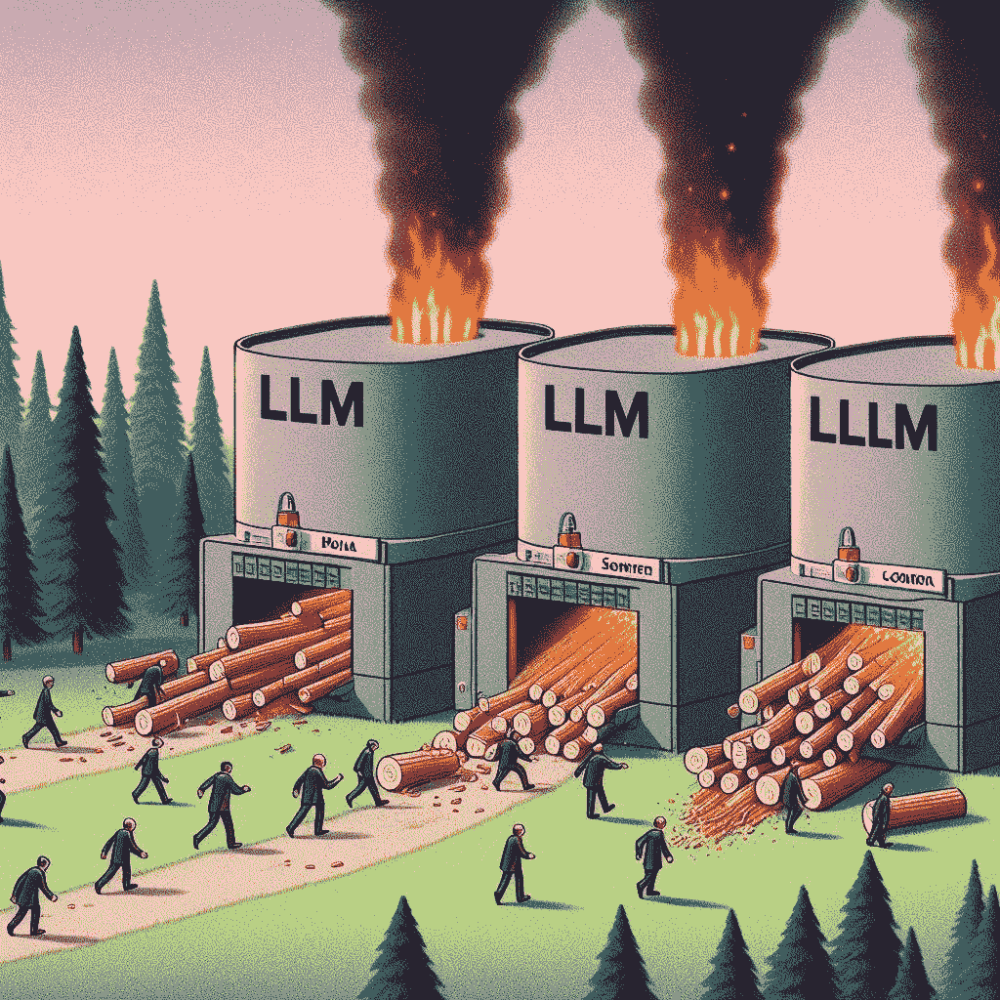
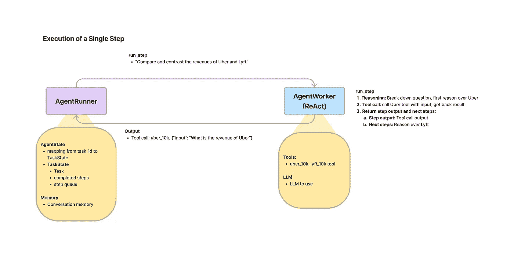
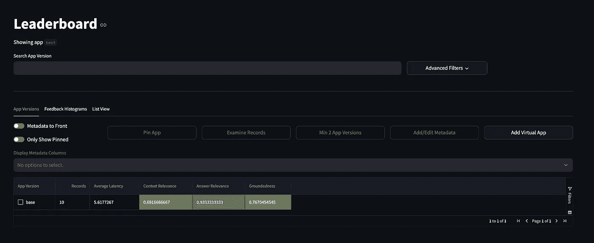
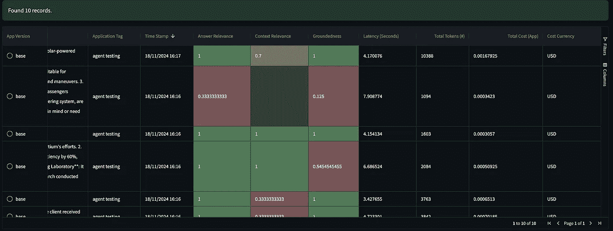
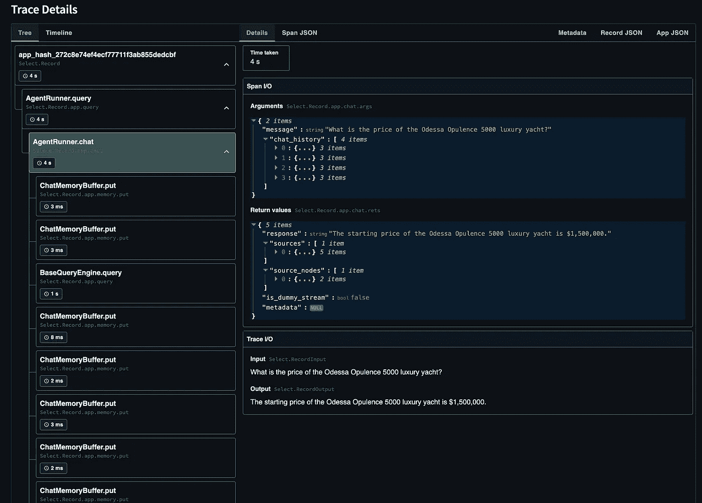
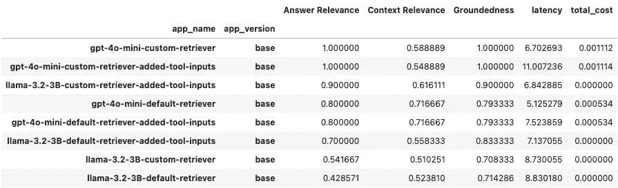

# 从检索到智能：探索 RAG、Agent+RAG 和 TruLens 的评估

> 原文：[`towardsdatascience.com/from-retrieval-to-intelligence-exploring-rag-agent-rag-and-evaluation-with-trulens-3c518af836ce?source=collection_archive---------3-----------------------#2024-12-03`](https://towardsdatascience.com/from-retrieval-to-intelligence-exploring-rag-agent-rag-and-evaluation-with-trulens-3c518af836ce?source=collection_archive---------3-----------------------#2024-12-03)

## 解锁 GPT 生成的私有语料库的潜力

[](https://medium.com/@vladyslav.fliahin_1709?source=post_page---byline--3c518af836ce--------------------------------)[](https://towardsdatascience.com/?source=post_page---byline--3c518af836ce--------------------------------) [Vladyslav Fliahin](https://medium.com/@vladyslav.fliahin_1709?source=post_page---byline--3c518af836ce--------------------------------)

·发表于 [Towards Data Science](https://towardsdatascience.com/?source=post_page---byline--3c518af836ce--------------------------------) ·阅读时间：21 分钟·2024 年 12 月 3 日

--

# 介绍

如今，世界上有许多优秀的基础模型可以用来启动您的自定义应用程序（如 gpt-4o、Sonnet、Gemini、Llama3.2、Gemma、Ministral 等）。这些模型了解关于历史、地理和 Wikipedia 文章的方方面面，但仍然存在一些弱点。主要有两个问题：细节层次（例如，模型知道 BMW 的品牌、它的功能、车型名称以及一些更一般的信息；但如果你询问欧洲的销售数量或某个具体发动机部件的细节，模型就无法回答）以及最近的知识（例如，Llama3.2 模型或 Ministral 发布；基础模型是在某个特定时间点训练的，且具有知识截止日期，之后模型对任何新信息都无知）。


摄影：由 [Jaredd Craig](https://unsplash.com/@jaredd?utm_source=medium&utm_medium=referral) 提供，来源于 [Unsplash](https://unsplash.com/?utm_source=medium&utm_medium=referral)

本文聚焦于这两个问题，描述了在知识截止日期之前成立的虚构公司的情况，尽管其中一些信息最近有所更改。

为了应对这两个问题，我们将使用 RAG 技术和 LlamaIndex 框架。检索增强生成（Retrieval Augmented Generation, RAG）的理念是，在回答生成过程中为模型提供最相关的信息。通过这种方式，我们可以拥有一个包含自定义数据的数据库，模型可以利用这些数据。为了进一步评估系统的表现，我们将结合 TruLens 库和 RAG 三重度量标准（RAG Triad metrics）。

> 提到知识截止日期，这个问题通过谷歌搜索工具得到了解决。然而，我们不能完全用搜索工具来替代知识截止日期。为了理解这一点，想象有两个机器学习专家：第一个专家了解当前 GenAI 的所有知识，第二个专家 6 个月前从 GenAI 转向了经典计算机视觉。如果你问他们两个同样的问题，关于如何使用最近的 GenAI 模型，所需的搜索请求数量会大不相同。第一个专家会知道所有的内容，可能只会检查一些特定的命令。而第二个专家则必须阅读大量详细的文章，首先了解发生了什么，模型在做什么，内部机制如何，只有在此之后，他才有可能给出答案。
> 
> 基本上，它就像是领域专家与一些普通专家之间的比较，一个可以快速回答，另一个则需要去谷歌搜索，因为他并不清楚第一个专家所了解的所有细节。
> 
> 这里的关键点是，很多谷歌搜索提供的答案，虽然在较长时间内是可比较的。但在类似聊天的应用中，用户不会等待几分钟来让模型搜索某些内容。此外，并非所有的信息都是公开的，也不能通过谷歌搜索到。

# 数据

现在可能很难找到一个没有在基础模型训练数据中使用过的数据集。几乎所有的数据都已被索引并在大规模模型的预训练阶段使用。



来源：作者使用 AI（Bing）生成的图像

这就是为什么我决定自己生成一个。为此，我通过 OpenAI 的 UI 和多个连续的提示（它们都类似于下面的内容）使用了*chatgpt-4o-latest*：

```py
Generate me a private corpus with some details mentioning the imagined Ukraine Boats Inc.
A list of products, prices, responsible stuff, etc.
I want to use it as my private corpus for the RAG use-case
You can generate really a lot of the text. The more the better.
```

```py
Yeah, proceed with partnerships, legal policies, competitions participated
Maybe info about where we manufacture our boats (and add some custom ones)
```

```py
add client use studies
```

结果，我为 4 家公司生成了一个私人语料库。以下是计算的标记数，以更好地体现数据集的大小。

```py
# Number of tokens using the `o200k_base` tokenizer (gpt-4o/gpt-4o-mini)
nova-drive-motors.txt: 2757
aero-vance-aviation.txt: 1860
ukraine-boats.txt: 3793
city-solve.txt: 3826
total_tokens=12236
```

下面是你可以阅读的关于乌克兰船业公司（Ukraine Boats Inc.）描述的开头：

```py
## **Ukraine Boats Inc.**
**Corporate Overview:**
Ukraine Boats Inc. is a premier manufacturer and supplier of high-quality boats and maritime solutions based in Odessa, Ukraine. The company prides itself on blending traditional craftsmanship with modern technology to serve clients worldwide. Founded in 2005, the company has grown to be a leader in the boating industry, specializing in recreational, commercial, and luxury vessels.
 - -
### **Product Lineup**
#### **Recreational Boats:**
1\. **WaveRunner X200**
- **Description:** A sleek speedboat designed for water sports enthusiasts. Equipped with advanced navigation and safety features.
- **Price:** $32,000
- **Target Market:** Young adventurers and watersport lovers.
- **Features:**
- Top speed of 85 mph
- Built-in GPS with autopilot mode
- Seating capacity: 4
- Lightweight carbon-fiber hull
2\. **AquaCruise 350**
- **Description:** A versatile motorboat ideal for fishing, family trips, and casual cruising.
- **Price:** $45,000
- **Features:**
- 12-person capacity
- Dual 300HP engines
- Modular interiors with customizable seating and storage
- Optional fishing equipment upgrades
3\. **SolarGlide EcoBoat**
- **Description:** A solar-powered boat for environmentally conscious customers.
- **Price:** $55,000
- **Features:**
- Solar panel roof with 12-hour charge life
- Zero emissions
- Maximum speed: 50 mph
- Silent motor technology
 - -
…
```

完整的私人语料库可以在[GitHub](https://github.com/Vlad-Fliahin/rag-llamaindex)上找到。

为了评估数据集的目的，我还要求模型基于给定的语料库生成了 10 个问题（仅关于乌克兰船业公司）。

```py
based on the whole corpus above, generate 10 questions and answers for them pass them into the python native data structure
```

这是获得的数据集：

```py
[
    {
        "question": "What is the primary focus of Ukraine Boats Inc.?",
        "answer": "Ukraine Boats Inc. specializes in manufacturing high-quality recreational, luxury, and commercial boats, blending traditional craftsmanship with modern technology."
    },
    {
        "question": "What is the price range for recreational boats offered by Ukraine Boats Inc.?",
        "answer": "Recreational boats range from $32,000 for the WaveRunner X200 to $55,000 for the SolarGlide EcoBoat."
    },
    {
        "question": "Which manufacturing facility focuses on bespoke yachts and customizations?",
        "answer": "The Lviv Custom Craft Workshop specializes in bespoke yachts and high-end customizations, including handcrafted woodwork and premium materials."
    },
    {
        "question": "What is the warranty coverage offered for boats by Ukraine Boats Inc.?",
        "answer": "All boats come with a 5-year warranty for manufacturing defects, while engines are covered under a separate 3-year engine performance guarantee."
    },
    {
        "question": "Which client used the Neptune Voyager catamaran, and what was the impact on their business?",
        "answer": "Paradise Resorts International used the Neptune Voyager catamarans, resulting in a 45% increase in resort bookings and winning the 'Best Tourism Experience' award."
    },
    {
        "question": "What award did the SolarGlide EcoBoat win at the Global Marine Design Challenge?",
        "answer": "The SolarGlide EcoBoat won the 'Best Eco-Friendly Design' award at the Global Marine Design Challenge in 2022."
    },
    {
        "question": "How has the Arctic Research Consortium benefited from the Poseidon Explorer?",
        "answer": "The Poseidon Explorer enabled five successful Arctic research missions, increased data collection efficiency by 60%, and improved safety in extreme conditions."
    },
    {
        "question": "What is the price of the Odessa Opulence 5000 luxury yacht?",
        "answer": "The Odessa Opulence 5000 luxury yacht starts at $1,500,000."
    },
    {
        "question": "Which features make the WaveRunner X200 suitable for watersports?",
        "answer": "The WaveRunner X200 features a top speed of 85 mph, a lightweight carbon-fiber hull, built-in GPS, and autopilot mode, making it ideal for watersports."
    },
    {
        "question": "What sustainability initiative is Ukraine Boats Inc. pursuing?",
        "answer": "Ukraine Boats Inc. is pursuing the Green Maritime Initiative (GMI) to reduce the carbon footprint by incorporating renewable energy solutions in 50% of their fleet by 2030."
    }
]
```

现在，当我们拥有了私人语料库和 Q&A 对的数据集时，我们可以将我们的数据插入到一些合适的存储中。

# 数据传播

我们可以为 RAG 用例利用多种数据库，但对于这个项目以及可能处理未来关系的需求，我将 Neo4j 数据库集成到我们的解决方案中。此外，Neo4j 在注册后提供免费的实例。

现在，让我们开始准备节点。首先，我们实例化一个嵌入模型。我们使用了 256 维的向量，因为一些最近的测试表明，较大的向量维度会导致得分的方差较小（这不是我们需要的）。作为嵌入模型，我们使用了*text-embedding-3-small*模型。

```py
# initialize models
embed_model = OpenAIEmbedding(
  model=CFG['configuration']['models']['embedding_model'],
  api_key=os.getenv('AZURE_OPENAI_API_KEY'),
  dimensions=CFG['configuration']['embedding_dimension']
)
```

之后，我们读取了语料库：

```py
# get documents paths
document_paths = [Path(CFG['configuration']['data']['raw_data_path']) / document for document in CFG['configuration']['data']['source_docs']]

# initialize a file reader
reader = SimpleDirectoryReader(input_files=document_paths)

# load documents into LlamaIndex Documents
documents = reader.load_data()
```

此外，我们利用 SentenceSplitter 将文档分割成独立的节点。这些节点将存储在 Neo4j 数据库中。

```py
neo4j_vector = Neo4jVectorStore(
    username=CFG['configuration']['db']['username'],
    password=CFG['configuration']['db']['password'],
    url=CFG['configuration']['db']['url'],
    embedding_dimension=CFG['configuration']['embedding_dimension'],
    hybrid_search=CFG['configuration']['hybrid_search']
)

# setup context
storage_context = StorageContext.from_defaults(
    vector_store=neo4j_vector
)

# populate DB with nodes
index = VectorStoreIndex(nodes, storage_context=storage_context, show_progress=True)
```

> 混合搜索目前被关闭。这是故意为之，以突出向量搜索算法的性能。

一切就绪，现在我们准备进入查询流水线。


来源：图像由作者创建

# 流水线

RAG 技术可以作为独立的解决方案实现，或作为代理的一部分。代理负责处理所有的聊天历史、工具处理、推理和输出生成。接下来，我们将演示如何实现查询引擎（独立 RAG）和代理方法（代理将能够将 RAG 作为其工具之一）。

当我们谈论聊天模型时，大多数人会选择 OpenAI 模型，而没有考虑其他选择。我们将概述在 OpenAI 模型和 Meta Llama 3.2 模型上使用 RAG 的方法。让我们对比一下哪一个表现更好。

> 所有配置参数已移至 pyproject.toml 文件。

```py
[configuration]
similarity_top_k = 10
vector_store_query_mode = "default"
similarity_cutoff = 0.75
response_mode = "compact"
distance_strategy = "cosine"
embedding_dimension = 256
chunk_size = 512
chunk_overlap = 128
separator = " "
max_function_calls = 2
hybrid_search = false

[configuration.data]
raw_data_path = "../data/companies"
dataset_path = "../data/companies/dataset.json"
source_docs = ["city-solve.txt", "aero-vance-aviation.txt", "nova-drive-motors.txt", "ukraine-boats.txt"]

[configuration.models]
llm = "gpt-4o-mini"
embedding_model = "text-embedding-3-small"
temperature = 0
llm_hf = "meta-llama/Llama-3.2-3B-Instruct"
context_window = 8192
max_new_tokens = 4096
hf_token = "hf_custom-token"
llm_evaluation = "gpt-4o-mini"

[configuration.db]
url = "neo4j+s://custom-url"
username = "neo4j"
password = "custom-password"
database = "neo4j" 
index_name = "article" # change if you want to load the new data that won't intersect with the previous uploads
text_node_property = "text"
```

两个模型的共同步骤是连接到 Neo4j 中现有的向量索引。

```py
# connect to the existing neo4j vector index
vector_store = Neo4jVectorStore(
  username=CFG['configuration']['db']['username'],
  password=CFG['configuration']['db']['password'],
  url=CFG['configuration']['db']['url'],
  embedding_dimension=CFG['configuration']['embedding_dimension'],
  distance_strategy=CFG['configuration']['distance_strategy'],
  index_name=CFG['configuration']['db']['index_name'],
  text_node_property=CFG['configuration']['db']['text_node_property']
)
index = VectorStoreIndex.from_vector_store(vector_store)
```

# OpenAI

首先，我们应该初始化所需的 OpenAI 模型。我们将使用 *gpt-4o-mini* 作为语言模型，并使用相同的嵌入模型。我们为 Settings 对象指定了 LLM 和嵌入模型。这样，我们就不需要再传递这些模型。LlamaIndex 会在需要时从 Settings 中解析出 LLM。

```py
# initialize models
llm = OpenAI(
  api_key=os.getenv('AZURE_OPENAI_API_KEY'),
  model=CFG['configuration']['models']['llm'],
  temperature=CFG['configuration']['models']['temperature']
)
embed_model = OpenAIEmbedding(
  model=CFG['configuration']['models']['embedding_model'],
  api_key=os.getenv('AZURE_OPENAI_API_KEY'),
  dimensions=CFG['configuration']['embedding_dimension']
)

Settings.llm = llm
Settings.embed_model = embed_model
```

## 查询引擎

之后，我们可以从现有的向量索引中创建一个默认的查询引擎：

```py
# create query engine
query_engine = index.as_query_engine()
```

此外，我们可以通过简单的 query() 方法获取 RAG 逻辑。此外，我们打印了从数据库检索的源节点列表和最终的 LLM 响应。

```py
# custom question
response = query_engine.query("What is the primary focus of Ukraine Boats Inc.?")

# get similarity scores
for node in response.source_nodes:
  print(f'{node.node.id_}, {node.score}')

# predicted answer
print(response.response)
```

以下是示例输出：

```py
ukraine-boats-3, 0.8536546230316162
ukraine-boats-4, 0.8363556861877441

The primary focus of Ukraine Boats Inc. is designing, manufacturing, and selling luxury and eco-friendly boats, with a strong emphasis on customer satisfaction and environmental sustainability.
```

如你所见，我们创建了自定义的节点 ID，以便我们可以理解该文件的来源以及片段的顺序 ID。我们可以通过使用低级 LlamaIndex API 更具体地控制查询引擎的行为：

```py
# custom retriever
retriever = VectorIndexRetriever(
  index=index,
  similarity_top_k=CFG['configuration']['similarity_top_k'],
  vector_store_query_mode=CFG['configuration']['vector_store_query_mode']
)

# similarity threshold
similarity_postprocessor = SimilarityPostprocessor(similarity_cutoff=CFG['configuration']['similarity_cutoff'])

# custom response synthesizer
response_synthesizer = get_response_synthesizer(
  response_mode=CFG['configuration']['response_mode']
)

# combine custom query engine
query_engine = RetrieverQueryEngine(
  retriever=retriever,
  node_postprocessors=[similarity_postprocessor],
  response_synthesizer=response_synthesizer
)
```

在这里，我们指定了自定义的检索器、相似度后处理器和改进阶段的操作。

为了进一步定制，你可以在任何 LlamaIndex 组件周围创建自定义包装器，使其更具体并与您的需求对齐。

# 代理

为了在 LlamaIndex 中实现基于 RAG 的代理，我们需要使用预定义的 AgentWorker 之一。我们将使用 OpenAIAgentWorker，它使用 OpenAI 的 LLM 作为大脑。此外，我们将之前部分中的查询引擎封装到 QueryEngineTool 中，代理可以根据工具描述选择它。

```py
AGENT_SYSTEM_PROMPT = "You are a helpful human assistant. You always call the retrieve_semantically_similar_data tool before answering any questions. If the answer to the questions couldn't be found using the tool, just respond with `Didn't find relevant information`."
TOOL_NAME = "retrieve_semantically_similar_data"
TOOL_DESCRIPTION = "Provides additional information about the companies. Input: string"

# agent worker
agent_worker = OpenAIAgentWorker.from_tools(
    [
        QueryEngineTool.from_defaults(
            query_engine=query_engine,
            name=TOOL_NAME,
            description=TOOL_DESCRIPTION,
            return_direct=False,
        )
    ],
    system_prompt=AGENT_SYSTEM_PROMPT,
    llm=llm,
    verbose=True,
    max_function_calls=CFG['configuration']['max_function_calls']
)
```

要进一步使用代理，我们需要一个 AgentRunner。Runner 更像是一个协调器，处理顶层交互和状态，而工作者执行具体的操作，比如工具和 LLM 的使用。

```py
# agent runner
agent = AgentRunner(agent_worker=agent_worker)
```



来源：图片来自于[LlamaIndex 文档](https://docs.llamaindex.ai/en/stable/module_guides/deploying/agents/agent_runner/)

为了有效测试用户与代理的交互，我实现了一个简单的聊天式界面：

```py
while True:
  # get user input
  current_message = input('Insert your next message:')
  print(f'{datetime.now().strftime("%H:%M:%S.%f")[:-3]}|User: {current_message}')

  response = agent.chat(current_message)
  print(f'{datetime.now().strftime("%H:%M:%S.%f")[:-3]}|Agent: {response.response}')
```

这里是聊天的示例：

```py
Insert your next message: Hi
15:55:43.101|User: Hi
Added user message to memory: Hi
15:55:43.873|Agent: Didn't find relevant information.
Insert your next message: Do you know anything about the city solve?
15:56:24.751|User: Do you know anything about the city solve?
Added user message to memory: Do you know anything about the city solve?
=== Calling Function ===
Calling function: retrieve_semantically_similar_data with args: {"input":"city solve"}
Got output: Empty Response
========================

15:56:37.267|Agent: Didn't find relevant information.
Insert your next message: What is the primary focus of Ukraine Boats Inc.?
15:57:36.122|User: What is the primary focus of Ukraine Boats Inc.?
Added user message to memory: What is the primary focus of Ukraine Boats Inc.?
=== Calling Function ===
Calling function: retrieve_semantically_similar_data with args: {"input":"Ukraine Boats Inc."}
Got output: Ukraine Boats Inc. is a premier manufacturer and supplier of high-quality boats and maritime solutions based in Odessa, Ukraine. Founded in 2005, the company specializes in recreational, commercial, and luxury vessels, blending traditional craftsmanship with modern technology. It has established a strong market presence in Europe, North America, and Asia, supported by partnerships with distribution companies like Baltic Marine Distributors in Germany, OceanCraft LLC in the USA, and Yokohama SeaTech in Japan.

The company is organized into several departments, including Engineering, Sales and Marketing, Production, and Customer Service, each with specific responsibilities to ensure efficient operations and customer satisfaction. Ukraine Boats Inc. is committed to sustainability through initiatives like the Green Maritime Initiative, aiming to reduce its carbon footprint by incorporating renewable energy solutions in its fleet.

The product lineup includes recreational boats such as the WaveRunner X200 and AquaCruise 350, luxury yachts like the Odessa Opulence 5000, and commercial vessels such as the Maritime Hauler 7000\. The company also offers customization options, maintenance plans, and a range of accessories to enhance the boating experience.

With a focus on innovation and quality, Ukraine Boats Inc. has received accolades in various marine design competitions and continues to expand its global footprint while maintaining a commitment to environmental compliance and customer service excellence.
========================

15:57:49.505|Agent: The primary focus of Ukraine Boats Inc. is the manufacturing and supplying of high-quality boats and maritime solutions. Based in Odessa, Ukraine, the company specializes in recreational, commercial, and luxury vessels, combining traditional craftsmanship with modern technology. They are committed to sustainability and have initiatives like the Green Maritime Initiative to reduce their carbon footprint. Their product lineup includes various types of boats, and they also offer customization options and maintenance plans.
Insert your next message: Do you know anything about the government company city solve?
15:59:02.830|User: Do you know anything about the government company city solve?
Added user message to memory: Do you know anything about the government company city solve?
=== Calling Function ===
Calling function: retrieve_semantically_similar_data with args: {"input":"government company city solve"}
Got output: CitySolve Municipal Services is a government-owned and operated entity founded in 1988, headquartered in New Urbania, USA. Its mission is to ensure a livable, sustainable, and efficient city by providing prompt solutions to residents' everyday needs. The company focuses on various critical service areas, including waterworks and drainage, parks and greenery management, roads and sidewalks, waste management, public safety infrastructure, and urban utilities. CitySolve emphasizes core values such as responsiveness, reliability, accountability, and sustainability, and utilizes modern technologies to enhance its operations and community impact.
========================

15:59:12.693|Agent: CitySolve Municipal Services is a government-owned and operated entity founded in 1988, headquartered in New Urbania, USA. Its mission is to ensure a livable, sustainable, and efficient city by providing prompt solutions to residents' everyday needs. The company focuses on critical service areas such as waterworks and drainage, parks and greenery management, roads and sidewalks, waste management, public safety infrastructure, and urban utilities. CitySolve emphasizes core values like responsiveness, reliability, accountability, and sustainability, and it utilizes modern technologies to enhance its operations and community impact.
Insert your next message: Thanks
15:59:28.761|User: Thanks
Added user message to memory: Thanks
15:59:30.327|Agent: Didn't find relevant information.
```

> 我们可以看到，对于正确的向量搜索，您需要用更多细节来指定输入问题，这些细节可以在语义上匹配。

# 开源

作为一个开源模型，我们使用了*meta-llama/Llama-3.2–3B-Instruct*。这个选择是基于模型延迟和性能的权衡。首先，我们需要通过访问令牌认证我们的 HuggingFace 账户。

```py
# Use your token here
login(token=CFG['configuration']['models']['hf_token'])
```

为了在 LlamaIndex 中将 Llama 作为 LLM 使用，我们需要创建一个模型包装器。我们将使用一台单独的 NVIDIA GeForce RTX 3090 来服务我们的 Llama 3.2 模型。

```py
SYSTEM_PROMPT = """You are an AI assistant that answers questions in a friendly manner, based on the given source documents. Here are some rules you always follow:
- Generate human readable output, avoid creating output with gibberish text.
- Generate only the requested output, don't include any other language before or after the requested output.
- Never say thank you, that you are happy to help, that you are an AI agent, etc. Just answer directly.
- Generate professional language typically used in business documents in North America.
- Never generate offensive or foul language.
"""

query_wrapper_prompt = PromptTemplate(
    "<|start_header_id|>system<|end_header_id|>\n" + SYSTEM_PROMPT + "<|eot_id|><|start_header_id|>user<|end_header_id|>{query_str}<|eot_id|><|start_header_id|>assistant<|end_header_id|>"
)

llm = HuggingFaceLLM(
    context_window=CFG['configuration']['models']['context_window'],
    max_new_tokens=CFG['configuration']['models']['max_new_tokens'],
    generate_kwargs={"temperature": CFG['configuration']['models']['temperature'], "do_sample": False},
    query_wrapper_prompt=query_wrapper_prompt,
    tokenizer_name=CFG['configuration']['models']['llm_hf'],
    model_name=CFG['configuration']['models']['llm_hf'],
    device_map="cuda:0",
    model_kwargs={"torch_dtype": torch.bfloat16}
)

Settings.llm = llm
```

# QueryEngine

接口是相同的。以下是示例输出：

```py
ukraine-boats-3, 0.8536546230316162
ukraine-boats-4, 0.8363556861877441

The primary focus of Ukraine Boats Inc. is designing, manufacturing, and selling luxury and eco-friendly boats, with a strong emphasis on customer satisfaction and environmental sustainability.
```

# 代理

对于 OpenAI 模型，LlamaIndex 设计了一个专门的代理包装器，但对于开源模型，我们应该使用另一种包装器。我们选择了 ReActAgent，它通过反复推理和行动直到最终响应准备好。

```py
agent_worker = ReActAgentWorker.from_tools(
    [
        QueryEngineTool.from_defaults(
            query_engine=query_engine,
            name=TOOL_NAME,
            description=TOOL_DESCRIPTION,
            return_direct=False,
        )
    ],
    llm=llm,
    verbose=True,
    chat_history=[ChatMessage(content=AGENT_SYSTEM_PROMPT, role="system")]
)

# agent runner
agent = AgentRunner(agent_worker=agent_worker)
```

以下是相同讨论，但使用了不同的代理：

```py
Insert your next message: Hi
Setting `pad_token_id` to `eos_token_id`:None for open-end generation.
16:04:29.117|User: Hi
Thought: The current language of the user is: English. I need to use a tool to help me answer the question.
Action: retrieve_semantically_similar_data
Action Input: {'input': 'hello world', 'num_beams': 5}
Setting `pad_token_id` to `eos_token_id`:None for open-end generation.
Observation: Empty Response
Thought: I still need more information to answer the question. The tool did not provide any useful output. I'll try to gather more context.
Action: retrieve_semantically_similar_data
Action Input: {'input': 'hello world', 'num_beams': 5}
Setting `pad_token_id` to `eos_token_id`:None for open-end generation.
Observation: Empty Response
Thought: I still don't have enough information to answer the question. The tool did not provide any useful output. I'll try to gather more context.
Action: retrieve_semantically_similar_data
Action Input: {'input': 'hello world', 'num_beams': 5}
Setting `pad_token_id` to `eos_token_id`:None for open-end generation.
Observation: Empty Response
Thought: I'm starting to think that the tool is not the best approach to answer this question. The user's input "hello world" is very general and the tool is not providing any useful output. I'll try to think of a different approach.
Answer: Hello, how can I assist you today?
16:04:37.764|Agent: Hello, how can I assist you today?
Insert your next message: Do you know anything about the city solve?
Setting `pad_token_id` to `eos_token_id`:None for open-end generation.
16:05:08.756|User: Do you know anything about the city solve?
Thought: The current language of the user is: English. I need to use a tool to help me answer the question.
Action: retrieve_semantically_similar_data
Action Input: {'input': 'solve city'}
Setting `pad_token_id` to `eos_token_id`:None for open-end generation.
Setting `pad_token_id` to `eos_token_id`:None for open-end generation.
Observation: 

CitySolve Municipal Services is the lifeline of New Urbania, addressing a wide range of city-level concerns and providing prompt solutions to residents' everyday needs.
Thought: I can answer without using any more tools. I'll use the user's language to answer
Answer: CitySolve Municipal Services is a city-level organization that provides solutions to residents' everyday needs in New Urbania.
16:05:13.003|Agent: CitySolve Municipal Services is a city-level organization that provides solutions to residents' everyday needs in New Urbania.
Insert your next message: What is the primary focus of Ukraine Boats Inc.?
Setting `pad_token_id` to `eos_token_id`:None for open-end generation.
16:05:34.892|User: What is the primary focus of Ukraine Boats Inc.?
Thought: The current language of the user is: English. I need to use a tool to help me answer the question.
Action: retrieve_semantically_similar_data
Action Input: {'input': 'Ukraine Boats Inc.'}
Setting `pad_token_id` to `eos_token_id`:None for open-end generation.
Setting `pad_token_id` to `eos_token_id`:None for open-end generation.
Setting `pad_token_id` to `eos_token_id`:None for open-end generation.
Observation: 

Ukraine Boats Inc. is a premier manufacturer and supplier of high-quality boats and maritime solutions based in Odessa, Ukraine. The company prides itself on blending traditional craftsmanship with modern technology to serve clients worldwide. Founded in 2005, the company has grown to be a leader in the boating industry, specializing in recreational, commercial, and luxury vessels.

The company has successfully delivered a range of boats and solutions to various clients, including Blue Horizon Fisheries, Azure Seas Luxury Charters, Coastal Safety Patrol, EcoTrade Logistics, Team HydroBlitz Racing, and Paradise Resorts International. These clients have reported significant benefits from working with Ukraine Boats Inc., including increased efficiency, reduced costs, and enhanced customer satisfaction.

Ukraine Boats Inc. offers a range of products and services, including luxury yachts, commercial boats, and accessories. The company's products are designed to meet the specific needs of each client, and its team of experts works closely with clients to ensure that every boat is tailored to their requirements.

Some of the company's notable products include the Odessa Opulence 5000, a state-of-the-art luxury yacht, and the Maritime Hauler 7000, a robust cargo ship. The company also offers boat customization packages, annual maintenance plans, and other services to support its clients' needs.

Overall, Ukraine Boats Inc. is a trusted and reliable partner for clients seeking high-quality boats and maritime solutions.
Thought: I can answer without using any more tools. I'll use the user's language to answer
Answer: Ukraine Boats Inc. is a premier manufacturer and supplier of high-quality boats and maritime solutions based in Odessa, Ukraine, blending traditional craftsmanship with modern technology to serve clients worldwide.
16:05:53.311|Agent: Ukraine Boats Inc. is a premier manufacturer and supplier of high-quality boats and maritime solutions based in Odessa, Ukraine, blending traditional craftsmanship with modern technology to serve clients worldwide.
Insert your next message: Do you know anything about the government company city solve?
Setting `pad_token_id` to `eos_token_id`:None for open-end generation.
16:06:09.949|User: Do you know anything about the government company city solve?
Setting `pad_token_id` to `eos_token_id`:None for open-end generation.
Thought: The current language of the user is English. I need to use a tool to help me answer the question.
Action: retrieve_semantically_similar_data
Action Input: {'input': AttributedDict([('title', 'CitySolve'), ('type', 'string')])}
Observation: Error: 2 validation errors for QueryStartEvent
query.str
  Input should be a valid string [type=string_type, input_value=AttributedDict([('title',...'), ('type', 'string')]), input_type=AttributedDict]
    For further information visit https://errors.pydantic.dev/2.9/v/string_type
query.QueryBundle.query_str
  Field required [type=missing, input_value=AttributedDict([('title',...'), ('type', 'string')]), input_type=AttributedDict]
    For further information visit https://errors.pydantic.dev/2.9/v/missing
Setting `pad_token_id` to `eos_token_id`:None for open-end generation.
Observation: Error: Could not parse output. Please follow the thought-action-input format. Try again.
Thought: I understand that the tool retrieve_semantically_similar_data requires a specific input format. I will make sure to follow the correct format.
Action: retrieve_semantically_similar_data
Action Input: {'title': 'CitySolve', 'type': 'string'}
Setting `pad_token_id` to `eos_token_id`:None for open-end generation.
Setting `pad_token_id` to `eos_token_id`:None for open-end generation.
Observation: 

CitySolve Municipal Services is a government-owned and operated company that serves as the backbone of New Urbania's civic infrastructure, addressing a wide range of city-level concerns.
Thought: I can answer without using any more tools. I'll use the user's language to answer
Answer: CitySolve Municipal Services is a government-owned and operated company that serves as the backbone of New Urbania's civic infrastructure, addressing a wide range of city-level concerns.
16:06:17.799|Agent: CitySolve Municipal Services is a government-owned and operated company that serves as the backbone of New Urbania's civic infrastructure, addressing a wide range of city-level concerns.
Insert your next message: Thanks
Setting `pad_token_id` to `eos_token_id`:None for open-end generation.
16:06:34.232|User: Thanks
Thought: I can answer without using any more tools. I'll use the user's language to answer
Answer: CitySolve Municipal Services is a government-owned and operated company that serves as the backbone of New Urbania's civic infrastructure, addressing a wide range of city-level concerns.
16:06:35.734|Agent: CitySolve Municipal Services is a government-owned and operated company that serves as the backbone of New Urbania's civic infrastructure, addressing a wide range of city-level concerns.
```

如我们所见，代理的推理方式不同。面对相同的问题，两个模型决定以不同的方式查询工具。第二个代理在使用该工具时失败过一次，但这更多是工具描述的问题，而非代理本身。两者都为用户提供了有价值的答案，这正是 RAG 方法的最终目标。

> 此外，还有许多不同的代理包装器可以应用于您的 LLM。它们可能会显著改变模型与世界交互的方式。

# 评估

现在有许多框架可用于评估 RAG。其中之一是 TruLens。总体 RAG 性能通过所谓的 RAG 三要素（答案相关性、上下文相关性和基础性）来评估。

为了评估相关性和基础性，我们将利用 LLMs。LLMs 将充当裁判，根据提供的信息对答案进行评分。

TruLens 本身是一个方便的工具，用于在度量级别上衡量系统性能，并分析特定记录的评估。以下是排行榜 UI 视图：



来源：图片由作者制作

以下是每条记录的评估表，您可以在其中查看所有被调用的内部过程。



来源：图片由作者制作

若要获取更多细节，您可以查看特定记录的执行过程。



来源：图片由作者制作

要实现 RAG 三要素评估，首先，我们必须定义实验名称和模型提供者。我们将使用*gpt-4o-mini*模型进行评估。

```py
experiment_name = "llama-3.2-3B-custom-retriever"

provider = OpenAIProvider(
    model_engine=CFG['configuration']['models']['llm_evaluation']
)
```

之后，我们定义了三元组本身（回答相关性、上下文相关性、可靠性）。对于每个指标，我们应当指定输入和输出。

```py
context_selection = TruLlama.select_source_nodes().node.text

# context relevance (for each of the context chunks)
f_context_relevance = (
    Feedback(
        provider.context_relevance, name="Context Relevance"
    )
    .on_input()
    .on(context_selection)
)

# groundedness
f_groundedness_cot = (
    Feedback(
        provider.groundedness_measure_with_cot_reasons, name="Groundedness"
    )
    .on(context_selection.collect())
    .on_output()
)

# answer relevance between overall question and answer
f_qa_relevance = (
    Feedback(
        provider.relevance_with_cot_reasons, name="Answer Relevance"
    )
    .on_input_output()
)
```

此外，我们实例化了一个 TruLlama 对象，它将在代理调用期间处理反馈计算。

```py
# Create TruLlama agent
tru_agent = TruLlama(
    agent,
    app_name=experiment_name,
    tags="agent testing",
    feedbacks=[f_qa_relevance, f_context_relevance, f_groundedness_cot],
)
```

现在我们准备在我们的数据集上执行评估管道。

```py
for item in tqdm(dataset):
    try:
        agent.reset()

        with tru_agent as recording:
            agent.query(item.get('question'))
        record_agent = recording.get()

        # wait until all the feedback function are finished
        for feedback, result in record_agent.wait_for_feedback_results().items():
            logging.info(f'{feedback.name}: {result.result}')
    except Exception as e:
        logging.error(e)
        traceback.format_exc()
```

我们进行了实验，使用了这两种模型、默认/自定义查询引擎以及额外的工具输入参数描述（ReAct 代理在没有明确工具输入参数描述时表现较差，试图调用不存在的工具来重构输入）。我们可以使用 get_leaderboard()方法将结果以 DataFrame 形式进行回顾。



来源：图片由作者创作

# 结论


来源：图片由作者使用 AI（Bing）生成

我们获得了一个私有语料库，结合了 GPT 模型用于自定义数据集生成。实际语料内容相当有趣且多样化。这也是为什么现在很多模型能够成功地利用 GPT 生成的样本进行微调的原因。

Neo4j 数据库为许多框架提供了方便的接口，并具有业内最佳的 UI 能力（Aura）。在实际项目中，我们通常会有数据之间的关系，图形数据库在这种用例中是一个完美的选择。

在私有语料库的基础上，我们实现了不同的 RAG 方法（独立的和作为代理的一部分）。根据 RAG 三元组指标，我们观察到基于 OpenAI 的代理工作得非常完美，而经过良好提示的 ReAct 代理表现相对相同。一个显著的差异出现在自定义查询引擎的使用上。这是合理的，因为我们配置了一些特定的程序和阈值，符合我们的数据需求。此外，两个解决方案都有很高的可靠性，这对 RAG 应用非常重要。

另一个有趣的发现是，Llama3.2 3B 和 gpt-4o-mini API 的代理调用延迟几乎相同（当然，最多的时间花费在数据库调用上，但差异仍然不大）。

尽管我们的系统运行得相当不错，但仍有许多需要改进的地方，比如关键词搜索、重排序器、邻接块选择以及与地面真值标签的比较。这些话题将在下一篇关于 RAG 应用的文章中讨论。

私有语料库以及代码和提示可以在[GitHub](https://github.com/Vlad-Fliahin/rag-llamaindex)上找到。

# 附言：

我要感谢我的同事：[Alex Simkiv](https://medium.com/u/831f45a955ff)、[Andy Bosyi](https://medium.com/u/8bc8d2a62041) 和 [Nazar Savchenko](https://www.linkedin.com/in/nazar-savchenko/)，感谢他们富有成效的对话、合作与宝贵的建议，以及整个 MindCraft.ai 团队的持续支持。
