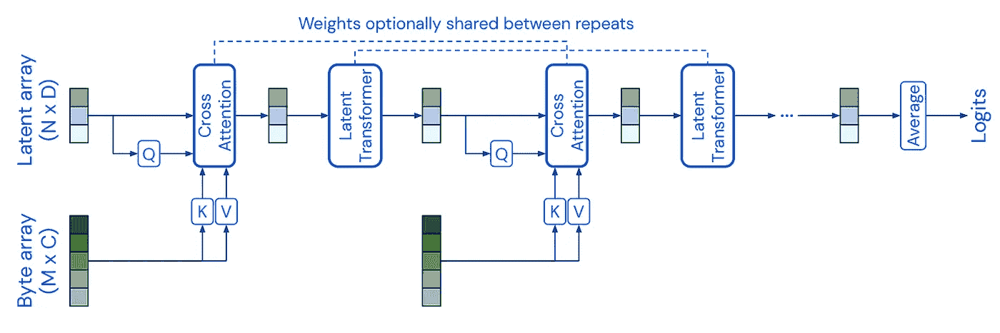
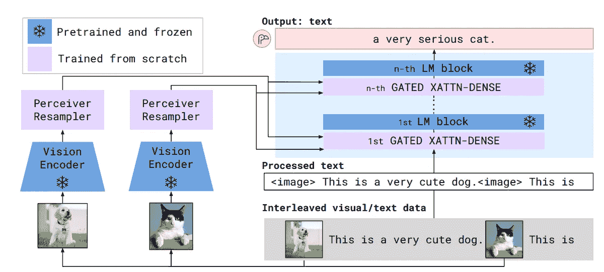

# 从 Set Transformer 到 Perceiver Sampler

> 原文：[`towardsdatascience.com/from-set-transformer-to-perceiver-sampler-2f18e741d242?source=collection_archive---------9-----------------------#2024-10-08`](https://towardsdatascience.com/from-set-transformer-to-perceiver-sampler-2f18e741d242?source=collection_archive---------9-----------------------#2024-10-08)

## 关于多模态 LLM Flamingo 的视觉编码器

 [赵梦刘](https://mengliuz.medium.com/?source=post_page---byline--2f18e741d242--------------------------------)

·发表于 [Towards Data Science](https://towardsdatascience.com/?source=post_page---byline--2f18e741d242--------------------------------) ·阅读时间 5 分钟·2024 年 10 月 8 日

--

设计多模态 LLM 很难。

目前最先进的多模态 LLMs 主要基于现有的 LLM 架构，通过特定的修改来处理不同来源的输入，这也是问题的来源。最新的 [Nvidia 论文](https://arxiv.org/abs/2409.11402)将常用的多模态架构分为两类：

+   基于解码器的；

+   基于交叉注意力。

我之前的 [一篇文章](https://medium.com/towards-data-science/transformer-diffusion-transfusion-d18d219f2a12)讨论了 [Meta 的最新论文](https://www.arxiv.org/pdf/2408.11039)，使用 **基于解码器的架构**，通过 VAE 编码器将输入图像转换为潜在向量，解决了图像空间是连续的，且与离散的文本空间不同的问题。

然而，**基于交叉注意力的架构**问题则不同。例如，在多模态 LLM 模型 [Flamingo](https://arxiv.org/abs/2204.14198) 中，关键问题是如何将来自通用视觉模型的视觉嵌入（其时空维度各异）转换到交叉注意力层，以匹配语言输入的维度。

在这篇文章中，我将深入探讨 Flamingo 在视觉编码器基础上独特的设计——Perceiver Resampler，解释这个问题是如何解决的。此外，我还将探索 Perceiver Resampler 的起源——来自 [Set Transformer](https://arxiv.org/abs/1810.00825) 的 Induced Set Attention Block，后者进一步启发了 [DeepMind 的 Perceiver 模型](https://arxiv.org/abs/2103.03206)，用于从通用输入数据中学习固定长度的潜在嵌入。

图片来源：[`pxhere.com/en/photo/1399240`](https://pxhere.com/en/photo/1399240)

## Set Transformer

Set Transformer 工作于 2019 年发布，扩展了[原始 Transformer 模型](https://arxiv.org/abs/1706.03762.)，用于处理集合问题，解决了置换不变问题，如集合异常检测、点云分类等。受稀疏高斯过程启发，其中[一小部分诱导变量足以近似输入的后验分布](https://krasserm.github.io/2020/12/12/gaussian-processes-sparse/)，Set Transformer 使用如下定义的诱导集合注意力块（ISAB）：

诱导集合注意力块（ISAB）。方程来源：[`arxiv.org/pdf/1810.00825`](https://arxiv.org/pdf/1810.00825)

MAB(X, Y)是 Transformer 的原始多头注意力块，其中查询= X，键/值= Y。ISAB 块几乎与两个堆叠的多头注意力块相同，唯一的区别是输入的键/值被诱导矩阵 I 替代。原始集合 X 的维度为 N*D，I 的维度为 M*D，表示 M 个 1*D 的诱导点。下面是一个可视化示意图。

多头注意力块和诱导集合注意力块的可视化。图片来源：[`arxiv.org/pdf/1810.00825`](https://arxiv.org/pdf/1810.00825)

请注意，ISAB 的设计目的是节省计算成本。原因是 M 可能远小于原始的 N 维度，这使得 ISAB 的时间复杂度 O(N*d)比原始自注意力复杂度 O(N**2*d)小得多。

## Perceiver

受 Set Transformer 中使用诱导点作为查询矩阵的启发，DeepMind 提出的 Perceiver 模型将查询矩阵分离为一个可学习的潜在嵌入短序列（例如，N=512），而键和值对则是一个字节数组，作为超长序列输入（例如，M=224*224 像素）。

Perceiver 模型架构。图片来源：[`arxiv.org/abs/2103.03206`](https://arxiv.org/abs/2103.03206)

**交叉注意力**借鉴了原始 Transformer 解码器部分，其中查询（query）和键/值（key/value）来自不同的来源，在这种情况下，来自不可学习的表示：

多头注意力和交叉注意力。图片来自作者。

由于 K 和 V 是输入的“常量”，Perceiver Transformer 层的计算复杂度仅与潜在空间相关，即 O(N**2)，也被称为**潜在 Transformer**。与输入大小解耦后，潜在 Transformer 可以快速扩展到 48 层，这相比传统的 Transformer 设计具有巨大的优势。

## Flamingo 的视觉编码器和感知重采样器

Flamingo 并没有直接应用 Perceiver，而是首先使用预训练的基于 CNN 的权重冻结的 [Normalizer-Free ResNet](https://arxiv.org/abs/2102.06171)（NFNet）来提取图像/视频特征，然后添加一个可学习的时间位置嵌入，并将其展平为 1D 序列。Perceiver Resampler 附加在视觉编码器上，以学习一个固定大小的潜在嵌入，然后将其传递到主架构的跨注意力层。

Flamingo 架构。图像来源：[`arxiv.org/pdf/2204.14198`](https://arxiv.org/pdf/2204.14198)

类似于 DeepMind 的 Preceiver 模型，Percerver Resampler 使用恒定的输入嵌入作为键/值，学习的潜在向量作为查询。注意，这里没有使用空间编码，理由是之前的视觉编码器 NFNet 是一个基于卷积的模型，空间信息已经嵌入在通道信息中。为了提高性能，学习向量被连接到跨注意力计算中的键/值向量。

Preceiver Resampler 架构。图像来源：[`arxiv.org/abs/2204.14198`](https://arxiv.org/abs/2204.14198)

下面给出了详细的算法：

Perceiver Resampler 算法。算法来源：[`arxiv.org/abs/2204.14198`](https://arxiv.org/abs/2204.14198)

## 摘要

本文详细介绍了 Flamingo 架构中的视觉编码器部分。视觉编码器有一个独特的设计——Perceiver Resampler，它起源于 Set Transformer 和 Perceiver 模型，能够在利用空间和时间域信息的同时，最小化跨注意力计算的成本。

## 参考文献

+   Dai 等人，《NVLM: Open Frontier-Class Multimodal LLMs》。arXiv 2024。

+   Zhou 等人，《Transfusion: Predict the Next Token and Diffuse Images with One Multi-Modal Model》。arXiv 2024。

+   Alayrac 等人，《Flamingo: a Visual Language Model for Few-Shot Learning》。NeurIPS 2022。

+   Jaegle 等人，《Perceiver: General Perception with Iterative Attention》。ICML 2021。

+   Brock 等人，《高性能大规模图像识别无归一化》。arXiv 2021。

+   Lee 等人，《Set Transformer: A Framework for Attention-based Permutation-Invariant Neural Networks》。ICML 2019。[幻灯片](https://icml.cc/media/icml-2019/Slides/4842.pdf)

+   Vaswani 等人，《Attention Is All You Need》。NeurIPS 2017。

+   斯坦福 CS25: V1 I DeepMind 的 Perceiver 和 Perceiver IO: 新的数据家族架构，[`www.youtube.com/watch?v=wTZ3o36lXoQ`](https://www.youtube.com/watch?v=wTZ3o36lXoQ)

+   HuggingFace，Perceiver 模型文档。[`huggingface.co/docs/transformers/v4.34.0/en/model_doc/perceiver`](https://huggingface.co/docs/transformers/v4.34.0/en/model_doc/perceiver)
