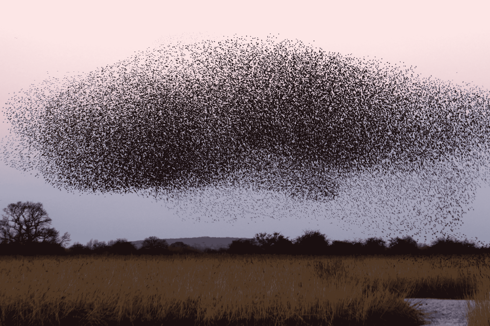

# 从理论到实践：使用 Python 进行粒子群优化

> 原文：[`towardsdatascience.com/from-theory-to-practice-with-particle-swarm-optimization-using-python-5414bbe8feb6?source=collection_archive---------1-----------------------#2024-09-07`](https://towardsdatascience.com/from-theory-to-practice-with-particle-swarm-optimization-using-python-5414bbe8feb6?source=collection_archive---------1-----------------------#2024-09-07)

## 这里有一个关于什么是 PSO 以及如何使用它的教程

 [Piero Paialunga](https://piero-paialunga.medium.com/?source=post_page---byline--5414bbe8feb6--------------------------------)

·发表于 [Towards Data Science](https://towardsdatascience.com/?source=post_page---byline--5414bbe8feb6--------------------------------) ·阅读时间 9 分钟 ·2024 年 9 月 7 日

--

照片来自 [James Wainscoat](https://unsplash.com/@tumbao1949?utm_content=creditCopyText&utm_medium=referral&utm_source=unsplash) 于 [Unsplash](https://unsplash.com/photos/a-large-flock-of-birds-flying-over-a-field-b7MZ6iGIoSI?utm_content=creditCopyText&utm_medium=referral&utm_source=unsplash)

有一个笑话让我忍俊不禁：

> “你知道吗，在时钟发明之前，人们不得不四处走动，向别人打听时间？”

显然没有必要解释这个笑话，但如果我们稍微深思一下（就像优秀的数学家那样），我们可以说这个笑话其实是在讲**一个群体中粒子的相关信息**可以被用来通知所有其他粒子。这个概念实际上比我刚刚提到的笑话要深刻得多，且可以进一步被利用。

让我们考虑一个自组织系统，比如鸟群飞行或鱼群游动。我们可以将这个系统定义为由**粒子**（例如，一个粒子就是一只鸟）构成。我们还可以假设这些粒子在空间中移动，根据两个因素来调整它们的位置：

+   **特定粒子知道的最佳位置**：鸟儿认为对自己最有利的地方。

+   所有粒子“相互沟通”后得出的**全局**最佳位置：鸟儿根据“主鸟”指示的位置进行调整
