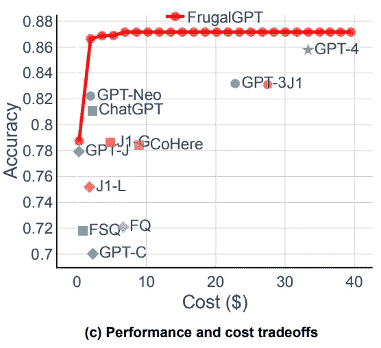

# FrugalGPT 和降低 LLM 运营成本

> 原文：[`towardsdatascience.com/frugalgpt-and-reducing-llm-operating-costs-ff1a6428bf96?source=collection_archive---------10-----------------------#2024-03-27`](https://towardsdatascience.com/frugalgpt-and-reducing-llm-operating-costs-ff1a6428bf96?source=collection_archive---------10-----------------------#2024-03-27)

## 本博客将详细介绍“FrugalGPT”论文中所见的针对 LLM 驱动应用的节省成本架构。

 [Matthew Gunton](https://medium.com/@mgunton7?source=post_page---byline--ff1a6428bf96--------------------------------)

·发布于 [Towards Data Science](https://towardsdatascience.com/?source=post_page---byline--ff1a6428bf96--------------------------------) ·阅读时间 5 分钟·2024 年 3 月 27 日

--

图片由作者生成，使用 DALL-E

大型语言模型为计算机科学开辟了一个新的前沿，然而，到了 2024 年，它们的运行成本显著高于计算机科学中几乎所有其他项目。对于寻求降低运营成本的公司来说，这构成了一个严重的问题。论文“[FrugalGPT：如何在减少成本并提高性能的同时使用大型语言模型](https://arxiv.org/abs/2305.05176)”提出了一个框架，可以在保持质量的同时显著降低运营成本。

# 如何衡量 LLM 的成本

有多种方法可以确定运行大型语言模型（LLM）的成本（例如电力消耗、计算成本等），然而，如果使用第三方 LLM（即 LLM 即服务），他们通常会根据你使用的 tokens 数量收费。不同的供应商（如 OpenAI、Anthropic、Cohere 等）有不同的 tokens 计数方式，但为了简化起见，我们将成本视为基于 LLM 处理的 tokens 数量。

这个框架最重要的部分是不同模型的成本是不同的。论文的作者巧妙地整理了以下表格，突出了成本的差异，它们之间的差距非常显著。例如，在此表中，AI21 的输出 tokens 成本比 GPT-4 高出一个数量级！

表 1 [来自论文](https://arxiv.org/pdf/2305.05176.pdf)

作为成本优化的一部分，我们始终需要找到在最小化成本的同时优化答案质量的方法。通常情况下，较高成本的模型往往性能较好，能够提供比低成本模型更高质量的答案。下图展示了这一普遍关系，FrugalGPT 的表现以红色覆盖在上面。

图 1c [来自论文](https://arxiv.org/pdf/2305.05176.pdf) 对比了各种 LLM 基于 HEADLINES 数据集准确回答问题的频率

# 利用级联 LLM 最大化质量

通过利用不同模型之间巨大的成本差异，研究人员的 FrugalGPT 系统依赖于 LLM 的级联来为用户提供答案。简单来说，用户查询从最便宜的 LLM 开始，如果答案足够好，就返回该答案。如果答案不够好，则查询会传递给下一个最便宜的 LLM。

研究人员使用了以下逻辑：如果一个较便宜的模型回答问题错误，那么较昂贵的模型很可能会给出正确的答案。因此，为了最小化成本，链条按从最便宜到最昂贵的顺序排列，假设随着价格的上涨，质量也会提高。

图 2e [来自论文](https://arxiv.org/pdf/2305.05176.pdf) 展示了 LLM 级联的示意图

这种设置依赖于可靠地判断一个答案是否足够好。为了解决这个问题，作者创建了一个 DistilBERT 模型，它会对问题和答案进行评分。由于 DistilBERT 模型的体积比序列中的其他模型要小得多，因此与其他模型相比，运行它的成本几乎可以忽略不计。

# 比仅仅查询最好的 LLM 获得更好的平均质量

人们自然会问，如果质量最重要，为什么不直接查询最好的 LLM，并寻求降低运行最佳 LLM 的成本的方法？

当这篇论文发布时，GPT-4 是他们找到的最好的 LLM，然而，GPT-4 并不总是给出比 FrugalGPT 系统更好的答案！(*细心的读者会注意到，这是之前成本与性能图表的一部分*) 作者推测，就像最有能力的人不总是给出正确的答案一样，最复杂的模型也未必如此。因此，通过让答案经过 DistilBERT 的过滤过程，你可以去除任何不合格的答案，从而提高获得好答案的几率。

图 5a [来自论文](https://arxiv.org/pdf/2305.05176.pdf) 显示了 FrugalGPT 超越 GPT-4 的实例

因此，这个系统不仅能降低成本，还能提高质量，比单纯使用最好的 LLM 更有效！

# 向前迈进，节约成本

本文的结果令人深思。对我来说，它引发了关于如何在不进一步投资于模型优化的情况下，继续实现成本节约的问题。

其中一种可能性是将所有模型的答案缓存到向量数据库中，然后进行相似性搜索，确定缓存中的答案是否适用，再开始 LLM 链的操作。通过用相对较便宜的查询和相似性操作替代昂贵的 LLM 操作，这将显著降低成本。

此外，这也让人思考是否过时的模型依然值得进行成本优化，因为如果你能降低每个 token 的成本，它们仍然可以在 LLM 链中创造价值。类似地，关键问题在于，何时通过将新的 LLM 加入链条中会出现收益递减的现象。

# 后续研究问题

随着世界上大语言模型的增加，我们越来越多地构建使用这些模型的系统，我们将希望找到更具成本效益的运行方式。本文为未来的开发者提供了一个强有力的框架，这让我思考这个框架能够走多远。

在我看来，这个框架非常适用于那些没有基于不同用户提供不同答案的一般性查询，例如辅导型大语言模型（LLM）。然而，对于那些答案根据用户不同而有所不同的应用场景，比如作为客服代理的大语言模型，评分系统必须能够识别 LLM 与谁进行对话。

为用户特定交互节省成本的框架将是未来的重要课题。

[1] Chen, L., et al., [FrugalGPT: 如何在降低成本并提高性能的同时使用大语言模型](https://arxiv.org/abs/2305.05176) (2023), arXiv
