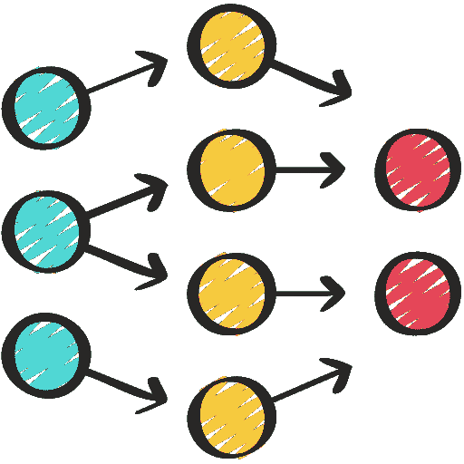

# 门控循环单元（GRU）—— 改进的 RNN

> 原文：[`towardsdatascience.com/gated-recurrent-units-gru-improving-rnns-4467b66c5150?source=collection_archive---------7-----------------------#2024-06-15`](https://towardsdatascience.com/gated-recurrent-units-gru-improving-rnns-4467b66c5150?source=collection_archive---------7-----------------------#2024-06-15)

## 解释门控循环神经网络（GRU）是如何工作的

 [Egor Howell](https://medium.com/@egorhowell?source=post_page---byline--4467b66c5150--------------------------------)

·发表于[Towards Data Science](https://towardsdatascience.com/?source=post_page---byline--4467b66c5150--------------------------------) ·10 分钟阅读·2024 年 6 月 15 日

--

"[`www.flaticon.com/free-icons/neural-network`](https://www.flaticon.com/free-icons/neural-network)" title="神经网络图标">神经网络图标由 juicy_fish 创建 — Flaticon。

在本文中，我将探讨循环神经网络（RNNs）的标准实现方式：门控循环单元（GRUs）。

GRU 于 2014 年由[Kyunghyun Cho 等人](https://arxiv.org/abs/1406.1078)提出，是对传统 RNN 的改进，因为它们较少受到梯度消失问题的影响，从而拥有更长的记忆能力。

它们与长短期记忆（LSTM）网络类似，但操作较少，使它们在内存使用上更加高效。

我们将涵盖的内容：

+   RNN 概述

+   梯度消失与梯度爆炸问题

+   LSTM 概述

+   GRU 是如何工作的

# 循环神经网络

循环神经网络是一种特别擅长处理基于序列的数据类型的神经网络，例如自然语言和时间序列数据。

它们通过添加一个“循环”神经元来实现这一点，允许信息从过去的输入和输出传递到下一步。
