# 高斯朴素贝叶斯解释：为初学者提供的带有代码示例的可视化指南

> 原文：[`towardsdatascience.com/gaussian-naive-bayes-explained-a-visual-guide-with-code-examples-for-beginners-04949cef383c?source=collection_archive---------2-----------------------#2024-10-12`](https://towardsdatascience.com/gaussian-naive-bayes-explained-a-visual-guide-with-code-examples-for-beginners-04949cef383c?source=collection_archive---------2-----------------------#2024-10-12)

## 分类算法

## **钟形曲线假设带来更好的预测**

[](https://medium.com/@samybaladram?source=post_page---byline--04949cef383c--------------------------------)[](https://towardsdatascience.com/?source=post_page---byline--04949cef383c--------------------------------) [Samy Baladram](https://medium.com/@samybaladram?source=post_page---byline--04949cef383c--------------------------------)

·发表于[Towards Data Science](https://towardsdatascience.com/?source=post_page---byline--04949cef383c--------------------------------) ·阅读时间：9 分钟·2024 年 10 月 12 日

--

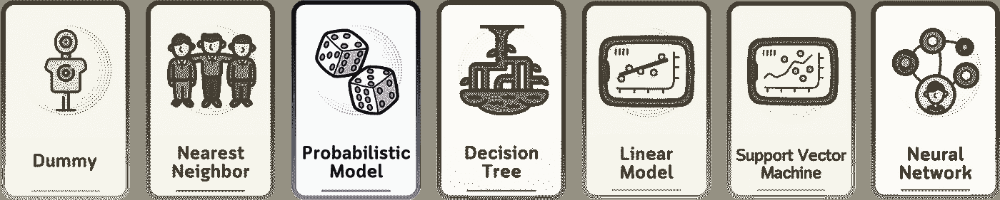

`⛳️ 更多[分类算法](https://medium.com/@samybaladram/list/classification-algorithms-b3586f0a772c)讲解：· 虚拟分类器 · K 最近邻分类器 · 伯努利朴素贝叶斯 ▶ 高斯朴素贝叶斯 · 决策树分类器 · 逻辑回归 · 支持向量机分类器 · 多层感知机`

在我们之前关于伯努利朴素贝叶斯的文章基础上，这一方法处理的是二元数据，我们现在探讨的是用于连续数据的高斯朴素贝叶斯。与二元方法不同，该算法假设每个特征遵循正态（高斯）分布。

在这里，我们将看到高斯朴素贝叶斯如何处理连续的钟形数据——为准确预测打下基础——**而无需深入探讨贝叶斯定理的复杂数学**。


所有视觉内容：作者使用 Canva Pro 创作。优化了移动端显示，可能在桌面端显示过大。

# 定义

与其他朴素贝叶斯变种一样，高斯朴素贝叶斯做出了“朴素”的特征独立性假设。它假设在给定类标签的条件下，特征是相互独立的。

然而，虽然伯努利朴素贝叶斯适用于具有二元特征的数据集，但高斯朴素贝叶斯假设特征服从**连续的正态（高斯）**分布。尽管这一假设在现实中并不总是成立，但它简化了计算，并且常常能够得到出人意料的准确结果。

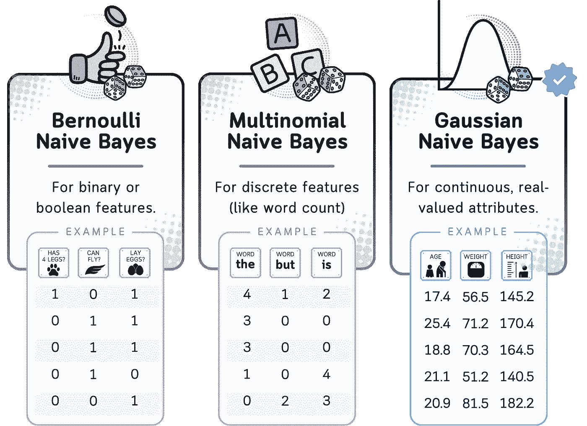

伯努利朴素贝叶斯假设数据是二元的， multinomial 朴素贝叶斯适用于离散计数数据，而高斯朴素贝叶斯处理连续数据，假设数据服从正态分布。

# 使用的数据集

在本文中，我们将使用这个人工高尔夫数据集（由作者制作）作为示例。该数据集预测一个人是否会根据天气条件去打高尔夫。

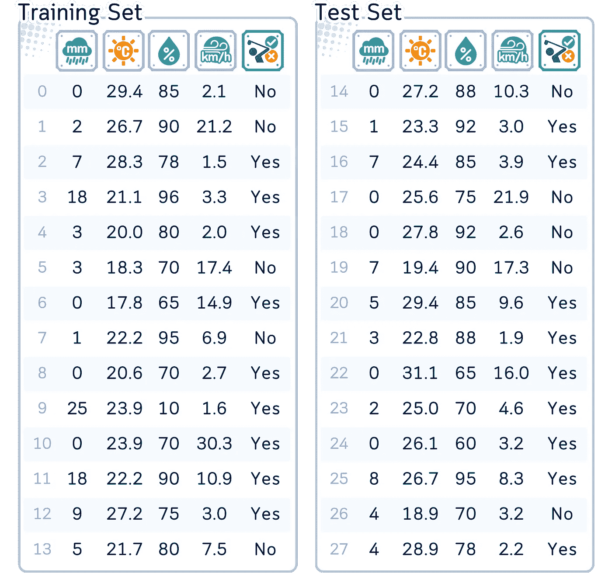

列：‘降水量’（单位：毫米）、‘温度’（单位：摄氏度）、‘湿度’（单位：百分比）、‘风速’（单位：千米/小时）和‘是否下棋’（是/否，目标特征）

```py
# IMPORTING DATASET #
from sklearn.model_selection import train_test_split
from sklearn.metrics import accuracy_score
import pandas as pd
import numpy as np

dataset_dict = {
    'Rainfall': [0.0, 2.0, 7.0, 18.0, 3.0, 3.0, 0.0, 1.0, 0.0, 25.0, 0.0, 18.0, 9.0, 5.0, 0.0, 1.0, 7.0, 0.0, 0.0, 7.0, 5.0, 3.0, 0.0, 2.0, 0.0, 8.0, 4.0, 4.0],
    'Temperature': [29.4, 26.7, 28.3, 21.1, 20.0, 18.3, 17.8, 22.2, 20.6, 23.9, 23.9, 22.2, 27.2, 21.7, 27.2, 23.3, 24.4, 25.6, 27.8, 19.4, 29.4, 22.8, 31.1, 25.0, 26.1, 26.7, 18.9, 28.9],
    'Humidity': [85.0, 90.0, 78.0, 96.0, 80.0, 70.0, 65.0, 95.0, 70.0, 80.0, 70.0, 90.0, 75.0, 80.0, 88.0, 92.0, 85.0, 75.0, 92.0, 90.0, 85.0, 88.0, 65.0, 70.0, 60.0, 95.0, 70.0, 78.0],
    'WindSpeed': [2.1, 21.2, 1.5, 3.3, 2.0, 17.4, 14.9, 6.9, 2.7, 1.6, 30.3, 10.9, 3.0, 7.5, 10.3, 3.0, 3.9, 21.9, 2.6, 17.3, 9.6, 1.9, 16.0, 4.6, 3.2, 8.3, 3.2, 2.2],
    'Play': ['No', 'No', 'Yes', 'Yes', 'Yes', 'No', 'Yes', 'No', 'Yes', 'Yes', 'Yes', 'Yes', 'Yes', 'No', 'No', 'Yes', 'Yes', 'No', 'No', 'No', 'Yes', 'Yes', 'Yes', 'Yes', 'Yes', 'Yes', 'No', 'Yes']
}
df = pd.DataFrame(dataset_dict)

# Set feature matrix X and target vector y
X, y = df.drop(columns='Play'), df['Play']

# Split the data into training and testing sets
X_train, X_test, y_train, y_test = train_test_split(X, y, train_size=0.5, shuffle=False)
print(pd.concat([X_train, y_train], axis=1), end='\n\n')
print(pd.concat([X_test, y_test], axis=1))
```

# 主要机制

高斯朴素贝叶斯适用于连续数据，假设每个特征都服从高斯（正态）分布。

1.  计算训练数据中每个类别的概率。

1.  对于每个特征和类别，估计该类别中该特征值的均值和方差。

1.  对于新实例：

    a. 对于每个类别，计算该类别下每个特征值在该特征高斯分布下的概率密度函数（PDF）。

    b. 将类别概率与所有特征的 PDF 值的乘积相乘。

1.  预测具有最高概率的类别。

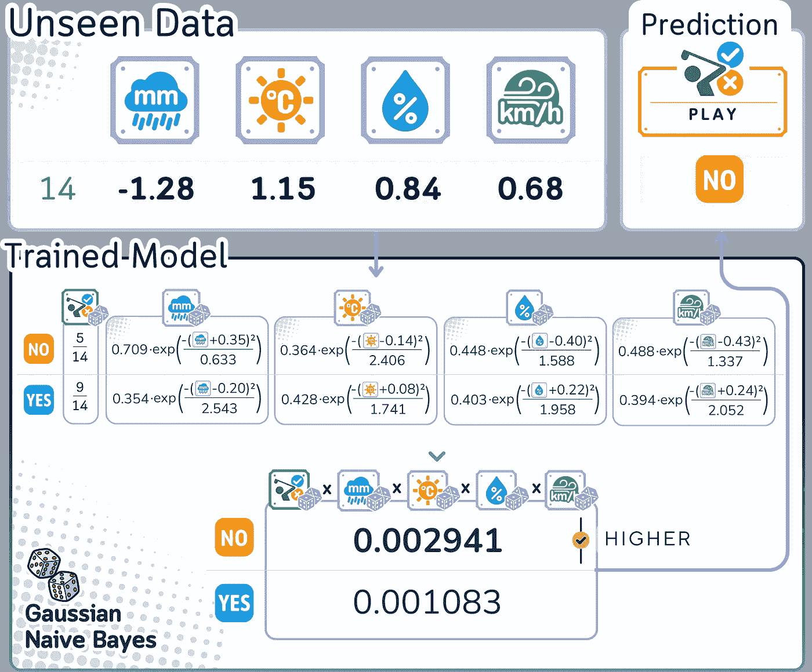

高斯朴素贝叶斯使用正态分布来建模每个类别中不同特征值的可能性。然后，它将这些可能性结合起来进行预测。

## 转换非高斯分布数据

记住这个算法天真地假设所有输入特征都服从高斯/正态分布吗？

由于我们不确定数据的分布，尤其是对于那些明显不遵循高斯分布的特征，在使用高斯朴素贝叶斯之前应用幂变换（如 Box-Cox 变换）可能会有帮助。这种方法可以帮助数据更接近高斯分布，从而更符合算法的假设。

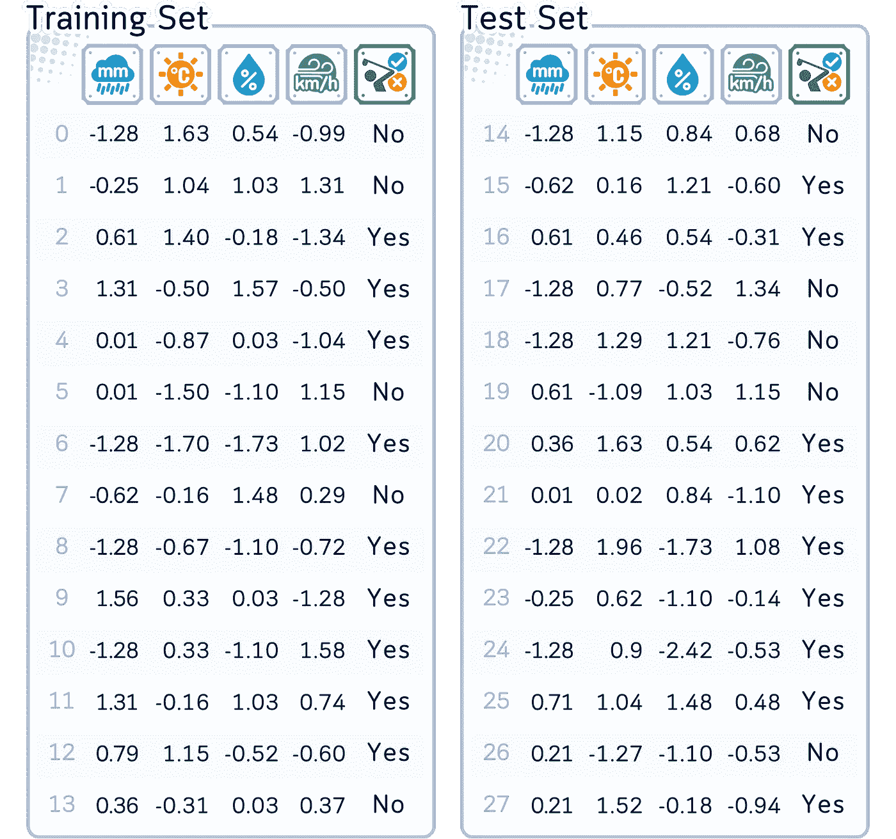

所有列都使用幂变换（Box-Cox 变换）进行缩放，然后标准化。

```py
from sklearn.preprocessing import PowerTransformer

# Initialize and fit the PowerTransformer
pt = PowerTransformer(standardize=True) # Standard Scaling already included
X_train_transformed = pt.fit_transform(X_train)
X_test_transformed = pt.transform(X_test)
```

现在我们准备开始训练。

# 训练步骤

1. **类别概率计算**：对于每个类别，计算其概率：（该类别中的实例数量）/（实例总数）

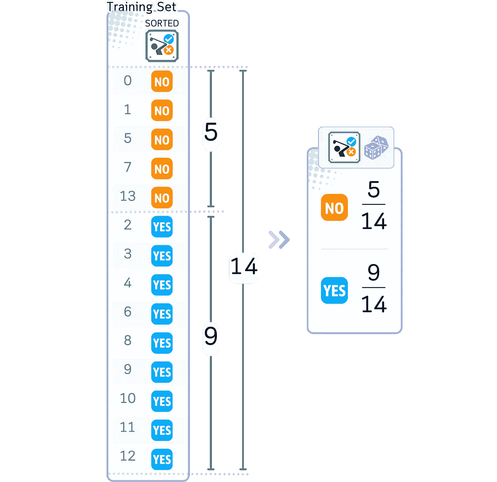

```py
from fractions import Fraction

def calc_target_prob(attr):
    total_counts = attr.value_counts().sum()
    prob_series = attr.value_counts().apply(lambda x: Fraction(x, total_counts).limit_denominator())
    return prob_series

print(calc_target_prob(y_train))
```

2\. **特征概率计算**：对于每个特征和每个类别，使用训练数据计算该类别中特征值的均值（μ）和标准差（σ）。然后，使用高斯概率密度函数（PDF）公式计算概率。

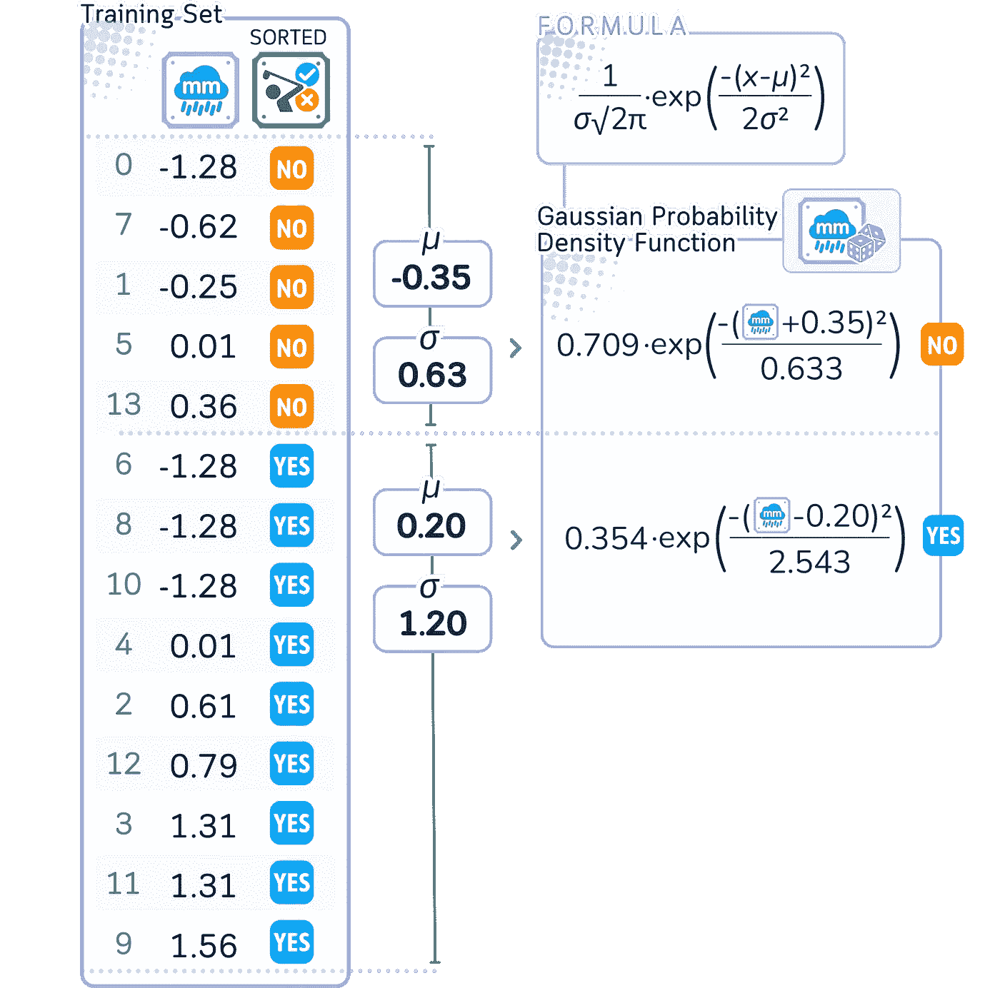

对于每个天气条件，确定“YES”和“NO”实例的均值和标准差。然后使用正态/高斯分布的 PDF 公式计算它们的 PDF。

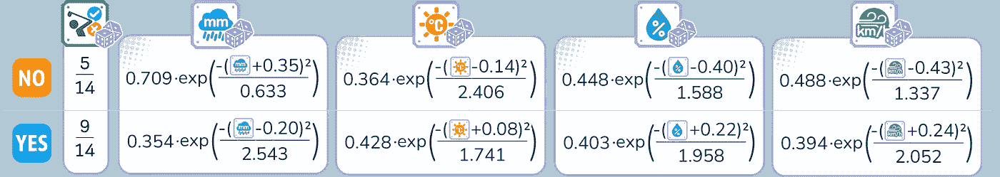

相同的过程应用于其他所有特征。

```py
def calculate_class_probabilities(X_train_transformed, y_train, feature_names):
    classes = y_train.unique()
    equations = pd.DataFrame(index=classes, columns=feature_names)

    for cls in classes:
        X_class = X_train_transformed[y_train == cls]
        mean = X_class.mean(axis=0)
        std = X_class.std(axis=0)
        k1 = 1 / (std * np.sqrt(2 * np.pi))
        k2 = 2 * (std ** 2)

        for i, column in enumerate(feature_names):
            equation = f"{k1[i]:.3f}·exp(-(x-({mean[i]:.2f}))²/{k2[i]:.3f})"
            equations.loc[cls, column] = equation

    return equations

# Use the function with the transformed training data
equation_table = calculate_class_probabilities(X_train_transformed, y_train, X.columns)

# Display the equation table
print(equation_table)
```

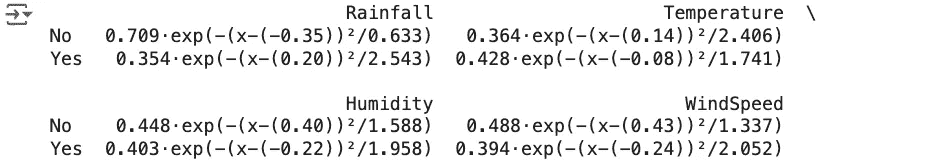

3\. **平滑**：高斯朴素贝叶斯使用一种独特的平滑方法。与其他变种中的拉普拉斯平滑不同，它将一个微小的值（0.000000001 倍的最大方差）添加到所有方差中。这可以防止由于除以零或非常小的数字导致的数值不稳定。

# 预测/分类步骤

给定一个具有连续特征的新实例：

1\. **概率收集**：

对于每个可能的类别：

· 从该类别发生的概率（类别概率）开始。

· 对于新实例中的每个特征，计算该特征在该类别中的概率密度函数。

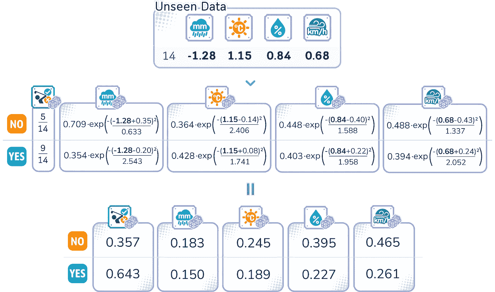

对于 ID 14，我们计算每个特征在“YES”和“NO”实例中的 PDF。

2\. **分数计算与预测**：

对于每个类别：

· 将所有收集到的 PDF 值相乘。

· 结果是该类别的分数。

· 得分最高的类别就是预测结果。


```py
from scipy.stats import norm

def calculate_class_probability_products(X_train_transformed, y_train, X_new, feature_names, target_name):
    classes = y_train.unique()
    n_features = X_train_transformed.shape[1]

    # Create column names using actual feature names
    column_names = [target_name] + list(feature_names) + ['Product']

    probability_products = pd.DataFrame(index=classes, columns=column_names)

    for cls in classes:
        X_class = X_train_transformed[y_train == cls]
        mean = X_class.mean(axis=0)
        std = X_class.std(axis=0)

        prior_prob = np.mean(y_train == cls)
        probability_products.loc[cls, target_name] = prior_prob

        feature_probs = []
        for i, feature in enumerate(feature_names):
            prob = norm.pdf(X_new[0, i], mean[i], std[i])
            probability_products.loc[cls, feature] = prob
            feature_probs.append(prob)

        product = prior_prob * np.prod(feature_probs)
        probability_products.loc[cls, 'Product'] = product

    return probability_products

# Assuming X_new is your new sample reshaped to (1, n_features)
X_new = np.array([-1.28, 1.115, 0.84, 0.68]).reshape(1, -1)

# Calculate probability products
prob_products = calculate_class_probability_products(X_train_transformed, y_train, X_new, X.columns, y.name)

# Display the probability product table
print(prob_products)
```


# 评估步骤

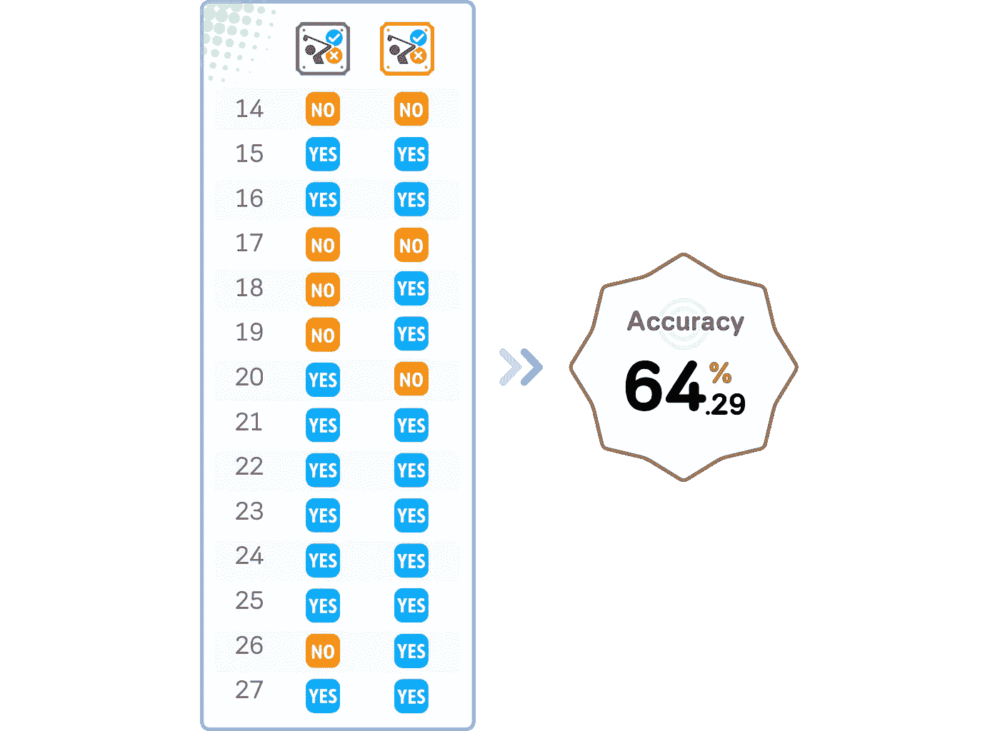

对于这个特定的数据集，这个准确度被认为是相当好的。

```py
from sklearn.naive_bayes import GaussianNB
from sklearn.metrics import accuracy_score

# Initialize and train the Gaussian Naive Bayes model
gnb = GaussianNB()
gnb.fit(X_train_transformed, y_train)

# Make predictions on the test set
y_pred = gnb.predict(X_test_transformed)

# Calculate the accuracy
accuracy = accuracy_score(y_test, y_pred)

# Print the accuracy
print(f"Accuracy: {accuracy:.4f}")
```

# 关键参数

GaussianNB 因其简洁性和有效性而闻名。关于其参数，主要需要记住的是：

1.  **priors**：这是最显著的参数，类似于伯努利朴素贝叶斯。在大多数情况下，你不需要手动设置它。默认情况下，它是从你的训练数据中计算出来的，通常效果很好。

1.  **var_smoothing**：这是一个稳定性参数，通常不需要调整。（默认值为 0.000000001）

关键结论是，这个算法设计得非常易用，通常在大多数情况下你可以直接使用，而不必担心参数调整。

# 优缺点

## 优点：

1.  **简洁性**：保持了易于实现和理解的特点。

1.  **效率**：在训练和预测时保持快速，使其适用于具有连续特征的大规模应用。

1.  **数据的灵活性**：能够很好地处理小型和大型数据集，根据手头问题的规模进行调整。

1.  **连续特征处理**：擅长处理连续和实值特征，非常适合预测实值输出或处理特征在连续性上变化的数据。

## 缺点：

1.  **独立性假设**：仍然假设特征在给定类别的条件下是独立的，但在所有实际场景中，这一假设可能并不成立。

1.  **高斯分布假设**：当特征值真正符合正态分布时效果最好。非正态分布可能导致性能不理想（但可以通过我们讨论的幂变换来修正）

1.  **对异常值的敏感性**：训练数据中的异常值可能会显著影响其表现，因为异常值会扭曲均值和方差的计算。

# 最后的备注

高斯朴素贝叶斯是一个高效的分类器，适用于处理涉及连续数据的广泛应用。它处理实值特征的能力使其在二分类任务之外有更广泛的应用，因此成为许多应用中的首选。

虽然它对数据（特征独立性和正态分布）做出了一些假设，但当这些条件满足时，它能提供稳健的表现，因此在初学者和经验丰富的数据科学家中都很受欢迎，因为它在简洁性和强大功能之间取得了良好的平衡。

# 🌟 高斯朴素贝叶斯简化版

```py
import pandas as pd
from sklearn.naive_bayes import GaussianNB
from sklearn.preprocessing import PowerTransformer
from sklearn.metrics import accuracy_score
from sklearn.model_selection import train_test_split

# Load the dataset
dataset_dict = {
    'Rainfall': [0.0, 2.0, 7.0, 18.0, 3.0, 3.0, 0.0, 1.0, 0.0, 25.0, 0.0, 18.0, 9.0, 5.0, 0.0, 1.0, 7.0, 0.0, 0.0, 7.0, 5.0, 3.0, 0.0, 2.0, 0.0, 8.0, 4.0, 4.0],
    'Temperature': [29.4, 26.7, 28.3, 21.1, 20.0, 18.3, 17.8, 22.2, 20.6, 23.9, 23.9, 22.2, 27.2, 21.7, 27.2, 23.3, 24.4, 25.6, 27.8, 19.4, 29.4, 22.8, 31.1, 25.0, 26.1, 26.7, 18.9, 28.9],
    'Humidity': [85.0, 90.0, 78.0, 96.0, 80.0, 70.0, 65.0, 95.0, 70.0, 80.0, 70.0, 90.0, 75.0, 80.0, 88.0, 92.0, 85.0, 75.0, 92.0, 90.0, 85.0, 88.0, 65.0, 70.0, 60.0, 95.0, 70.0, 78.0],
    'WindSpeed': [2.1, 21.2, 1.5, 3.3, 2.0, 17.4, 14.9, 6.9, 2.7, 1.6, 30.3, 10.9, 3.0, 7.5, 10.3, 3.0, 3.9, 21.9, 2.6, 17.3, 9.6, 1.9, 16.0, 4.6, 3.2, 8.3, 3.2, 2.2],
    'Play': ['No', 'No', 'Yes', 'Yes', 'Yes', 'No', 'Yes', 'No', 'Yes', 'Yes', 'Yes', 'Yes', 'Yes', 'No', 'No', 'Yes', 'Yes', 'No', 'No', 'No', 'Yes', 'Yes', 'Yes', 'Yes', 'Yes', 'Yes', 'No', 'Yes']
}

df = pd.DataFrame(dataset_dict)

# Prepare data for model
X, y = df.drop('Play', axis=1), (df['Play'] == 'Yes').astype(int)

# Split data into training and testing sets
X_train, X_test, y_train, y_test = train_test_split(X, y, test_size=0.5, shuffle=False)

# Apply PowerTransformer
pt = PowerTransformer(standardize=True)
X_train_transformed = pt.fit_transform(X_train)
X_test_transformed = pt.transform(X_test)

# Train the model
nb_clf = GaussianNB()
nb_clf.fit(X_train_transformed, y_train)

# Make predictions
y_pred = nb_clf.predict(X_test_transformed)

# Check accuracy
accuracy = accuracy_score(y_test, y_pred)
print(f"Accuracy: {accuracy:.4f}")
```

## 进一步阅读

对于[GaussianNB](https://scikit-learn.org/stable/modules/generated/sklearn.naive_bayes.GaussianNB.html)及其在 scikit-learn 中的实现的详细解释，读者可以参考官方文档，该文档提供了关于其使用和参数的全面信息。

## 技术环境

本文使用的是 Python 3.7 和 scikit-learn 1.5。虽然讨论的概念通常适用，但不同版本的具体代码实现可能会有所不同。

## 关于插图

除非另有注明，所有图片均由作者创作，包含来自 Canva Pro 的授权设计元素。

𝙎𝙚𝙚 𝙢𝙤𝙧𝙚 𝘾𝙡𝙖𝙨𝙨𝙞𝙛𝙞𝙘𝙖𝙩𝙞𝙤𝙣 𝘼𝙡𝙜𝙤𝙧𝙞𝙩𝙝𝙢𝙨 𝙝𝙚𝙧𝙚:


[Samy Baladram](https://medium.com/@samybaladram?source=post_page-----04949cef383c--------------------------------)

## 分类算法

[查看列表](https://medium.com/@samybaladram/list/classification-algorithms-b3586f0a772c?source=post_page-----04949cef383c--------------------------------)8 个故事

𝙔𝙤𝙪 𝙢𝙞𝙜𝙝𝙩 𝙖𝙡𝙨𝙤 𝙡𝙞𝙠𝙚:


[Samy Baladram](https://medium.com/@samybaladram?source=post_page-----04949cef383c--------------------------------)

## 回归算法

[查看列表](https://medium.com/@samybaladram/list/regression-algorithms-b0b6959f1b39?source=post_page-----04949cef383c--------------------------------)5 个故事

[Samy Baladram](https://medium.com/@samybaladram?source=post_page-----04949cef383c--------------------------------)

## 集成学习

[查看列表](https://medium.com/@samybaladram/list/ensemble-learning-673fc83cd7db?source=post_page-----04949cef383c--------------------------------)4 个故事
