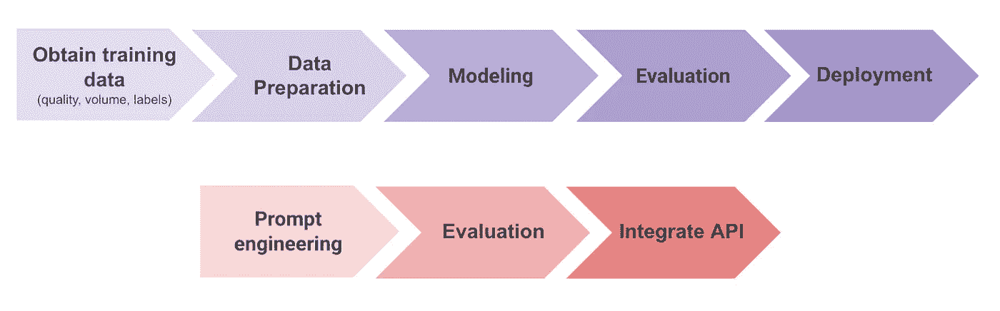
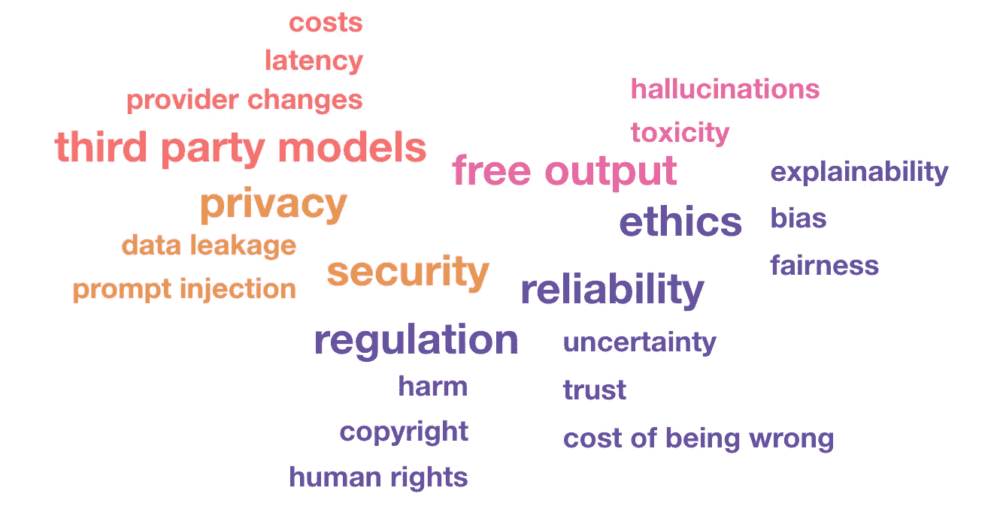

# 生成式 AI 正在重塑数据科学团队

> 原文：[`towardsdatascience.com/genai-is-reshaping-data-science-teams-b4d5a419e0f6?source=collection_archive---------1-----------------------#2024-11-29`](https://towardsdatascience.com/genai-is-reshaping-data-science-teams-b4d5a419e0f6?source=collection_archive---------1-----------------------#2024-11-29)

## 挑战、机会以及数据科学家角色的演变

 [Anna Via](https://annaviaba.medium.com/?source=post_page---byline--b4d5a419e0f6--------------------------------)

·发布于[Towards Data Science](https://towardsdatascience.com/?source=post_page---byline--b4d5a419e0f6--------------------------------) ·9 分钟阅读·2024 年 11 月 29 日

--

图片来自[articstudios](https://unsplash.com/es/@artic_studios)于[Unsplash](https://unsplash.com/)

生成式 AI（GenAI）开启了更快开发周期的可能，最小化了技术和维护工作量，并提供了以前看似遥不可及的创新使用案例。同时，它也带来了新的风险——如幻觉问题和对第三方 API 的依赖。

对于数据科学家和机器学习团队来说，这一发展直接影响到他们的角色。出现了一种新的 AI 项目类型，其中一部分 AI 已经由外部模型提供商（如 OpenAI、Anthropic、Meta 等）实现。非 AI 专家的团队现在也能相对轻松地整合 AI 解决方案。在这篇博文中，我们将讨论这对数据科学和机器学习团队意味着什么：

+   现在可以解决更广泛的各种问题，但并不是所有问题都是 AI 问题

+   传统机器学习并没有消失，而是通过生成式 AI 得到了增强

+   一些问题最适合通过生成式 AI 来解决，但仍需要机器学习专家进行评估并减轻伦理风险

+   AI 素养在公司中变得越来越重要，数据科学家在实现这一目标中扮演着关键角色。

# **现在可以解决更广泛的各种问题——但并不是所有问题都是 AI 问题**

生成式 AI（GenAI）已解锁了解决更**广泛问题**的潜力，但这并不意味着每个问题都是 AI 问题。数据科学家和 AI 专家仍然是关键，他们能够识别出什么时候使用 AI 是合理的，选择合适的 AI 技术，并设计和实施可靠的解决方案来解决特定问题（无论解决方案是生成式 AI、传统机器学习还是混合方法）。

 ## 是否使用机器学习

### 如何判断使用机器学习是否是一个好主意，以及这在生成性 AI 出现后是如何变化的

towardsdatascience.com

然而，尽管 AI 解决方案的广度不断增加，在选择正确的应用场景并确保解决方案能够适应未来时，仍需要考虑两点：

+   在任何给定时刻，**生成性 AI 模型将会有一定的局限性**，这可能会对解决方案产生负面影响。这始终是事实，因为我们处理的是预测和概率，必然会有一定的误差和不确定性。

+   与此同时，事情正在**快速进展**，并将在不久的将来继续发展，减少和修改生成性 AI 模型的局限性和弱点，增加新的能力和功能。

如果当前的 LLM 版本无法解决某些特定问题，但未来的版本可能能解决，那么现在等待或开发一个不完美的解决方案可能更具战略意义，而不是投资于复杂的内部开发来过度工作并修复当前 LLM 的局限性。同样，数据科学家和 AI 专家可以帮助**引导所有这些进展的方向**，并区分哪些问题可能由模型提供方解决，哪些应该在内部解决。例如，加入让用户编辑或监督 LLM 输出的功能，可能比追求通过复杂的逻辑或微调实现完全自动化更为有效。

市场上的差异化不会仅仅来自于使用大型语言模型（LLMs），因为这些模型现在对每个人都可用，而是来自于通过它们提供的独特体验、功能和产品价值（[如果我们都在使用相同的基础模型，是什么让我们与众不同？](https://www.mosaicventures.com/patterns/challenges-of-investing-in-ai)，[通过 AI 打造你的竞争优势](https://medium.com/towards-data-science/carving-out-your-competitive-advantage-with-ai-a4babb931076)）。

> 对于生成性 AI 解决方案，数据科学团队可能需要**减少对模型开发部分的关注，更多关注整个 AI 系统**。

# **传统机器学习并未消失——而是通过生成性 AI 得到增强**

尽管生成性 AI 已经彻底改变了 AI 领域和许多行业，但传统的机器学习仍然是不可或缺的。**许多应用场景仍然需要传统的机器学习解决方案**（例如大多数不涉及文本或图像的应用场景），而其他问题可能仍然通过机器学习而非生成性 AI 更高效地得到解决。

远非取代传统的机器学习（ML），**生成性 AI 通常是对其的补充**：它使得原型设计和实验变得更快，并可以通过混合型的机器学习+生成性 AI 解决方案增强某些应用场景。

在**传统机器学习工作流程**中，开发解决方案（如自然语言处理（NLP）分类器）包括：获取训练数据（可能包括手动标注），准备数据，训练和微调模型，评估性能，部署，监控和维护系统。这个过程通常需要**几个月，并且需要大量资源**来进行开发和持续维护。

相比之下，**使用 GenAI 后，工作流程大大简化：**选择合适的大型语言模型（LLM），进行提示工程或提示迭代，离线评估，然后使用 API 将模型集成到生产中。这大大缩短了从构想到部署的时间，通常只需**几周而不是几个月**。此外，大部分的维护工作由 LLM 提供商管理，进一步降低了运营成本和复杂性。

机器学习与 GenAI 项目阶段，图像由作者提供

因此，GenAI 使得**快速测试想法并证明价值成为可能**，无需收集标注数据或投资于训练和部署内部模型。一旦价值被证明，机器学习团队可能会决定转向传统的机器学习解决方案，以降低成本或延迟，同时可能利用最初 GenAI 系统中的标注数据。类似地，许多公司在价值被证明后，正在转向小型语言模型（SMLs），因为它们可以进行微调并更容易部署，同时在性能上与 LLM 相当或更具优势（[小即是大：小型语言模型的崛起](https://www.capgemini.com/insights/expert-perspectives/small-is-the-new-big-the-rise-of-small-language-models/)）。

在其他情况下，最佳解决方案**将 GenAI 和传统机器学习结合成混合系统**，充分利用两者的优势。一个好的例子是“[*使用大型语言模型构建 DoorDash 的产品知识图谱*](https://careersatdoordash.com/blog/building-doordashs-product-knowledge-graph-with-large-language-models/)”，他们解释了如何将传统机器学习模型与 LLM 一起使用，以改进分类任务，例如标记产品品牌。当传统机器学习模型无法自信地进行分类时，LLM 会被使用，如果 LLM 能够完成此任务，则传统机器学习模型会使用新的标注进行再训练（这形成了一个良好的反馈循环！）。

> 无论如何，**机器学习团队将继续处理传统机器学习解决方案**，进行预测模型的微调和部署，同时意识到 GenAI 如何帮助提高解决方案的速度和质量。

# **某些问题将通过 GenAI 得到更好的解决**

人工智能领域正从使用大量内部专用模型转向使用由外部公司拥有的少数大型多任务模型。机器学习团队需要接受这一变化，并且**准备将生成型 AI 解决方案**纳入其可能采用的方法清单，以保持竞争力。尽管模型训练阶段已经完成，但仍然需要**保持对机器学习和人工智能的思维方式与敏感性**，因为解决方案仍将是概率性的，这与传统软件开发的确定性大相径庭。

尽管生成型 AI 带来了许多好处，机器学习团队仍然需要应对它自身的一系列挑战和风险。考虑使用基于生成型 AI 的解决方案而非内部传统机器学习解决方案时，主要的额外风险包括：

新的生成型 AI 风险会加到传统机器学习风险（紫色部分）上，图像由作者提供

+   **依赖第三方模型**：这带来了每次调用的新成本、更高的延迟，可能影响实时系统的性能，并且缺乏控制（因为我们现在对其训练数据或设计决策的了解有限，而且提供商的更新可能会在生产中引入意外问题）。

+   **生成型 AI 特定风险**：我们十分清楚生成型 AI 的自由输入/自由输出关系。自由输入带来了新的隐私和安全风险（例如数据泄露或提示注入），而自由输出则带来了幻觉、毒性或偏见与歧视增加的风险。

 ## 人工智能看起来比以往任何时候都更容易，但它真的是这样吗？

### 构建 AI 产品的四大挑战

towardsdatascience.com

# **但仍然需要机器学习专业知识来进行评估并缓解伦理风险**

虽然生成型 AI 解决方案通常比传统机器学习模型更容易实现，但它们的部署仍然需要机器学习专业知识，特别是在评估、监控和伦理风险管理方面。

就像传统的机器学习一样，**GenAI 的成功依赖于强有力的评估**。由于其普遍的“自由输出”关系（答案相关性、正确性、语气、幻觉、伤害风险等），这些解决方案需要从多个角度进行评估。在部署之前进行这一步骤非常重要（参见上图 ML 与 GenAI 项目阶段），通常称为“离线评估”，因为它能够在系统部署之前提供其行为和性能的预期。务必查看这个[**LLM 评估指标的精彩概述**](https://confident-ai.com/blog/llm-evaluation-metrics-everything-you-need-for-llm-evaluation)，它区分了统计评分器（如 BLEU 或 ROUGE 等文本相关性的定量指标）和基于模型的评分器（例如基于嵌入的相似性度量）。**数据科学团队擅长设计和评估指标，**即使这些指标可能有些抽象（例如，如何衡量有用性或相关性？）。

一旦 GenAI 解决方案部署后，**监控变得至关重要，以确保其按预期运行并保持预期效果**。可以检查与评估中提到的类似指标，以确保离线评估的结论在解决方案部署并处理实际数据后得以保持。像 Datadog 这样的监控工具已经提供了[LLM 特定的可观察性指标](https://www.datadoghq.com/product/llm-observability/)。在这种情况下，通过与用户研究团队密切合作，直接向用户征求反馈（例如“*你觉得这些建议有用吗？如果没有，为什么？*”），可以将定量的见解与定性的反馈相结合，进一步丰富信息。

**GenAI 模型的复杂性和黑箱设计放大了它们可能带来的伦理风险**。机器学习团队在将有关可信 AI 的知识带入决策中扮演着至关重要的角色，他们具备对潜在问题的敏感性，能够识别并减轻这些风险。这项工作可以包括进行风险评估、选择偏见较小的基础模型（[ComplAI](https://compl-ai.org/)是一个有趣的框架，用于在伦理维度上评估和基准测试大型语言模型）、定义和评估公平性及无歧视指标，并应用技术和防护措施以确保输出符合社会和组织的价值观。

# **AI 素养在公司内部变得越来越重要**

一家公司的竞争优势不仅取决于其内部 AI 项目，还取决于其**员工对 AI 的理解和使用能力**。数据科学家在推动团队 AI 素养方面发挥着关键作用，使员工能够在理解 AI 的局限性和风险的同时有效地利用 AI。在他们的帮助下，AI 不仅应作为技术团队的工具，还应作为整个组织的核心能力。

为了提升 AI 素养，组织可以实施各种由数据科学家和 AI 专家主导的举措，例如内部培训、研讨会、聚会和黑客马拉松。这样的认知可以在以后帮助：

+   **增强内部团队并提高其生产力，** 鼓励在团队已经使用的工具中使用通用 AI 或特定 AI 功能。

+   **识别团队内潜力巨大的机会，** 利用他们的专业知识。业务和产品专家可以提出之前被认为过于复杂或不可能的项目创意（而现在可能通过生成型 AI 的帮助变得可行）。

# **总结：数据科学家角色的持续演变**

毫无争议，数据科学和人工智能领域正迅速变化，随之而来的是数据科学家和机器学习团队的角色变化。尽管生成型 AI API 使得缺乏机器学习知识的团队也能实现 AI 解决方案，但数据科学和机器学习团队的专业知识仍然对构建稳健、可靠和符合伦理的解决方案具有重要价值。在这个新背景下，数据科学家角色的重新定义包括：

+   **跟进 AI 的最新进展，** 以便选择最佳技术来解决问题，设计并实施出色的解决方案，同时承认技术的局限性，使解决方案具备面向未来的能力。

+   **采取系统性视角，** 不仅仅专注于预测模型，而是更加注重端到端的流程，并与其他角色协作，影响用户如何与系统互动（并监督系统）。

+   **继续致力于传统的机器学习解决方案，** 同时承认生成型 AI 如何帮助提高解决方案的速度和质量。

+   **深入理解生成型 AI 的局限性和风险，** 以构建可靠和值得信赖的 AI 系统（包括评估、监控和风险管理）。

+   **在整个组织中担任 AI 冠军**：推广 AI 素养，帮助非技术团队利用 AI 并识别合适的机会。

数据科学家的角色并非被取代，而是被重新定义。通过拥抱这一演变，数据科学家将继续不可或缺，引导组织有效且负责任地利用 AI。

> 期待生成型 AI 带来的所有机会，以及数据科学家角色的重新定义！
