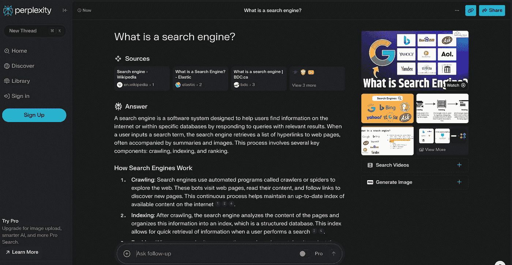

# 生成式人工智能正在革新搜索

> 原文：[`towardsdatascience.com/genai-is-revolutionizing-search-451fdc2f1e57?source=collection_archive---------8-----------------------#2024-07-30`](https://towardsdatascience.com/genai-is-revolutionizing-search-451fdc2f1e57?source=collection_archive---------8-----------------------#2024-07-30)

## 以及为什么你和你的公司应该关注这一变化

 [安娜·维亚](https://annaviaba.medium.com/?source=post_page---byline--451fdc2f1e57--------------------------------)

·发表于 [Towards Data Science](https://towardsdatascience.com/?source=post_page---byline--451fdc2f1e57--------------------------------) ·阅读时间：7 分钟·2024 年 7 月 30 日

--

图片由 [Agnieszka Boeske](https://unsplash.com/es/@kundeleknabiegunie) 提供，发布在 [Unsplash](https://unsplash.com/)

人工智能的进步正在将传统的搜索引擎转变为回答机器。这一变化由新兴和传统的网页搜索公司共同推动，并且正在影响全球用户获取信息的方式。

生成式人工智能搜索的主要参与者是谁，他们是如何接近解决方案的？对用户来说意味着什么？公司如何确保在这一新的搜索范式中，其内容仍然对用户可见？这对产品经理、数据科学家和所有技术从业者意味着什么？这些问题将是本文的讨论重点！

# 参与者

多年来，谷歌在搜索引擎市场的主导地位首次面临可信的竞争。一些新公司已经崭露头角，推出了核心的生成式人工智能（GenAI）搜索产品，例如：

+   [**Perplexity**](https://www.perplexity.ai/) **—** “*知识的起点*”：基于生成式人工智能的搜索工具，具备如链接到来源、相关问题、图片展示和图像生成等附加功能。

Perplexity 的用户界面，展示了“什么是搜索引擎”的问题示例

+   [**You.com**](http://you.com) — “*使用智能助手提问/搜索网络/提供帮助*…”
