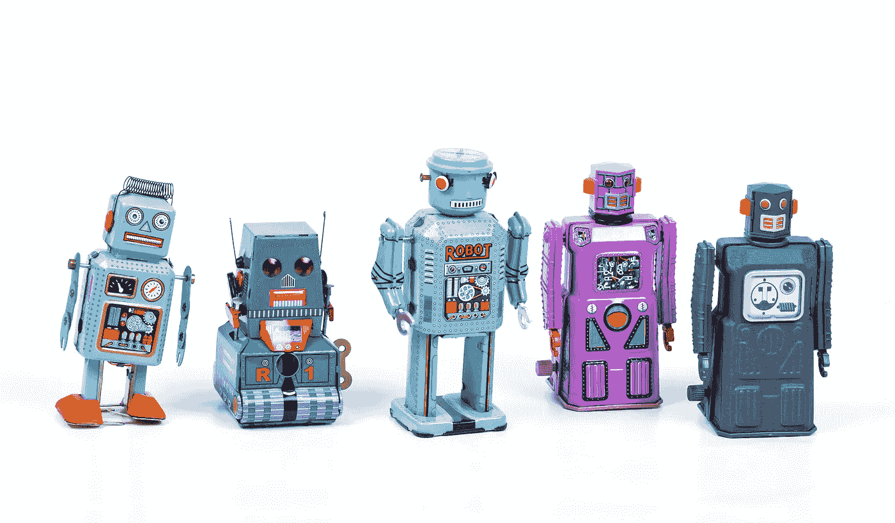

# GenAI 与 Python：使用 LLM 的 RAG（完整教程）

> 原文：[`towardsdatascience.com/genai-with-python-rag-with-llm-complete-tutorial-c276dda6707b?source=collection_archive---------0-----------------------#2024-06-28`](https://towardsdatascience.com/genai-with-python-rag-with-llm-complete-tutorial-c276dda6707b?source=collection_archive---------0-----------------------#2024-06-28)

## 在没有 GPU 的情况下，使用多模态数据构建并运行自己的 ChatGPT

 [Mauro Di Pietro](https://maurodp.medium.com/?source=post_page---byline--c276dda6707b--------------------------------)

·发表于 [Towards Data Science](https://towardsdatascience.com/?source=post_page---byline--c276dda6707b--------------------------------) ·12 分钟阅读·2024 年 6 月 28 日

--

在本文中，我将展示如何构建一个简单的 AI，它能够有效地从个人文档中学习知识并回答问题。

图片由 [Eric Krull](https://unsplash.com/@ekrull?utm_source=medium&utm_medium=referral) 提供，来自 [Unsplash](https://unsplash.com/?utm_source=medium&utm_medium=referral)

## 介绍

**自然语言处理**（NLP）是人工智能领域，研究机器与人类语言之间相互作用的学科。到目前为止，NLP 的巅峰成就就是**大语言模型**（LLM）的出现，这些模型在海量文本数据上进行训练，能够学习语言模式和变体。随着深度学习和神经网络的兴起，“语言模型”这一术语变得普及。特别是在 2018 年，谷歌推出了基于[Transformer 架构](https://arxiv.org/abs/1706.03762)，显著提升了 NLP 模型的性能（谷歌的[*BERT*](https://en.wikipedia.org/wiki/BERT_(language_model))和 OpenAI 的[*GPT*](https://en.wikipedia.org/wiki/Generative_pre-trained_transformer)）。

如今，LLMs 通常用于**文本到文本**任务或“文本生成”（例如翻译、总结、聊天机器人和虚拟助手，甚至编写整本书）。正因如此，我们见证了生成性人工智能（GenAI）的崛起，这是一个专注于创造新内容（如文本、图像、音频、视频）的行业领域。
