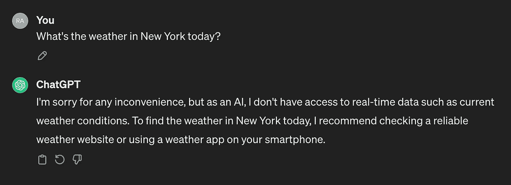

# 利用 LangChain 代理生成音乐推荐

> 原文：[`towardsdatascience.com/generate-music-recommendations-utilizing-langchain-agents-d0e531de95df?source=collection_archive---------7-----------------------#2024-03-05`](https://towardsdatascience.com/generate-music-recommendations-utilizing-langchain-agents-d0e531de95df?source=collection_archive---------7-----------------------#2024-03-05)

## 由 Bedrock Claude 和 Spotify API 提供支持

 [Ram Vegiraju](https://ram-vegiraju.medium.com/?source=post_page---byline--d0e531de95df--------------------------------)

·发表于[Towards Data Science](https://towardsdatascience.com/?source=post_page---byline--d0e531de95df--------------------------------)·阅读时长 10 分钟·2024 年 3 月 5 日

--

图片来自[Unsplash](https://unsplash.com/photos/selective-focus-silhouette-photography-of-man-playing-red-lighted-dj-terminal-YrtFlrLo2DQ)，由[**Marcela Laskoski**](https://unsplash.com/@marcelalaskoski)提供

正如我们在之前的文章中探讨过的那样，大型语言模型（LLMs）包含了大量的知识，能够基于它们已经经过微调的数据回答跨多个领域的问题。过去我们分析了如何利用检索增强生成（RAG）等技术，通过提供额外的数据源来增强回答，从而帮助模型生成更准确的输出。虽然 RAG 和微调可以用来让模型熟悉特定的数据/知识库，但有时模型需要访问那些可能会发生变化的数据源。

一个例子是实时数据源。例如，如果我们问模型今天的天气，它将无法生成正确的回应。

ChatGPT 响应（作者截图）

LLMs（大型语言模型）的一大问题是它们无法访问外部数据源。模型的训练有一个特定的时间框架，因此可能无法访问我们需要提供正确答案的最新信息。
