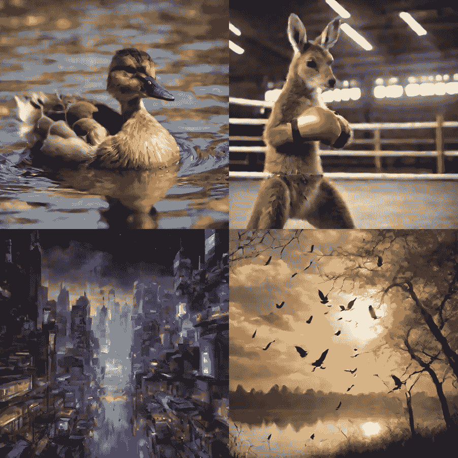
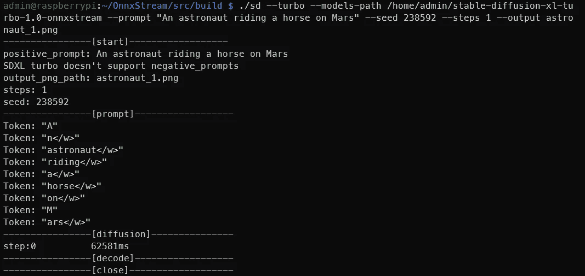
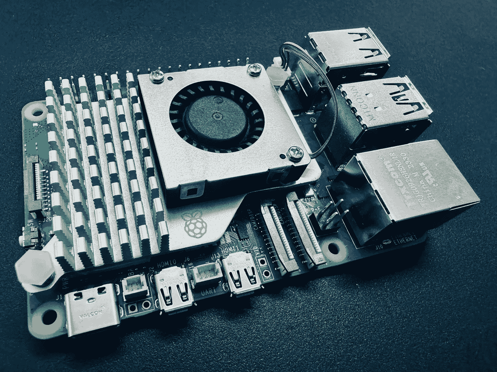

# 在树莓派上使用 Stable Diffusion 和 OnnxStream 生成图像

> 原文：[`towardsdatascience.com/generating-images-with-stable-diffusion-and-onnxstream-on-the-raspberry-pi-f126636b6c0c?source=collection_archive---------4-----------------------#2024-01-20`](https://towardsdatascience.com/generating-images-with-stable-diffusion-and-onnxstream-on-the-raspberry-pi-f126636b6c0c?source=collection_archive---------4-----------------------#2024-01-20)

## **学习如何使用 OnnxStream 在树莓派上生成图像，利用 Stable Diffusion XL Turbo！**

[](https://medium.com/@pyesonekyaw?source=post_page---byline--f126636b6c0c--------------------------------)[](https://towardsdatascience.com/?source=post_page---byline--f126636b6c0c--------------------------------) [Pye Sone Kyaw](https://medium.com/@pyesonekyaw?source=post_page---byline--f126636b6c0c--------------------------------)

·发表于 [Towards Data Science](https://towardsdatascience.com/?source=post_page---byline--f126636b6c0c--------------------------------) ·5 分钟阅读·2024 年 1 月 20 日

--


使用 SDXL Turbo 在树莓派上生成的图像，每张大约需要 3 分钟 | 来源：作者

在我上一篇文章中，我分享了如何在树莓派上运行大型语言模型和视觉语言模型。这一次，我们不使用 LLMs 和 VLMs，而是运行一个图像生成模型 —— [Stable Diffusion XL (SDXL) Turbo](https://stability.ai/news/stability-ai-sdxl-turbo) —— 在树莓派 5 上。这听起来像是一个不可能完成的壮举，但开源的奇迹确实存在，在资源极为有限的环境中运行 SDXL Turbo 模型就是其中之一。

# **OnnxStream**

[OnnxStream](https://github.com/vitoplantamura/OnnxStream#stable-diffusion-xl-10-base) 是一个由 Vito Plantamura 创建的开源项目，最初的目的是通过尽可能减少内存消耗，在树莓派 Zero 2 上运行 Stable Diffusion 1.5（SD1.5），尽管这样会以增加推理延迟/吞吐量为代价。

在写作时，它已经扩展到不仅支持 Stable Diffusion 1.5，还支持 Stable Diffusion XL 1.0 Base（SDXL）和 Stable Diffusion XL Turbo 1.0。我不会详细讲解这个惊人壮举是如何实现的，因为 [GitHub 仓库](https://github.com/vitoplantamura/OnnxStream) 已经解释得非常清楚了。

相反，我们直接进入实际操作。

# **技术要求**

你只需要以下内容：

+   树莓派 5 — 或树莓派 4 或任何其他树莓派，只有预期速度会较慢

+   SD 卡 — 至少 16GB，已经设置了 Raspbian 或其他 Linux 发行版。SDXL Turbo 的权重大约为 8GB。

+   需要互联网连接



在树莓派上通过单步扩散生成的图像 | 来源：作者

# **设置 OnnxStream**

这里的指令来自 GitHub 仓库，但我会将其拆解并稍作解释。

## **1\. 构建 XNNPack**

首先，我们需要安装[XNNPack](https://github.com/google/XNNPACK)，这是 Google 提供的一个库，提供“高效的浮点神经网络推理运算符”。但我们不能直接获取最新版本，以防出现不兼容的更改。相反，我们将获取 OnnxStream 创建者在编写时验证过的版本。在终端中运行：

```py
git clone https://github.com/google/XNNPACK.git
cd XNNPACK
git checkout 579de32260742a24166ecd13213d2e60af862675
mkdir build
cd build
cmake -DXNNPACK_BUILD_TESTS=OFF -DXNNPACK_BUILD_BENCHMARKS=OFF ..
cmake --build . --config Release
```

构建 XNNPack 需要几分钟时间。去喝杯咖啡或做点别的吧。

## **2\. 构建 OnnxStream**

接下来，我们需要构建 OnnxStream。在终端中运行：

```py
git clone https://github.com/vitoplantamura/OnnxStream.git
cd OnnxStream
cd src
mkdir build
cd build
cmake -DMAX_SPEED=ON -DXNNPACK_DIR=<DIRECTORY_WHERE_XNNPACK_WAS_CLONED> ..
cmake --build . --config Release
```

确保将<DIRECTORY_WHERE_XNNPACK_WAS_CLONED>替换为 XNNPack 克隆路径（不是构建文件夹）。在我的例子中，它位于 /home/admin/XNNPACK/。

## **3\. 下载模型权重**

现在，我们需要下载 SDXL Turbo 的模型权重。在终端中运行：

```py
git lfs install
git clone --depth=1 https://huggingface.co/AeroX2/stable-diffusion-xl-turbo-1.0-onnxstream
```

如果你还没有安装 git-lfs，先安装它。由于模型权重非常大，这一步比前一步还要耗时。去吃个午饭吧！

你还可以运行其他两个支持的模型——Stable Diffusion 1.5 和 Stable Diffusion XL 1.0 Base，通过从[OnnxStream 的 GitHub 仓库](https://github.com/vitoplantamura/OnnxStream#how-to-build-the-stable-diffusion-example-on-linuxmacwindowstermux)提供的链接下载它们的权重。如果你要下载所有这些模型，请确保你的 SD 卡有足够的空间！

一旦完成，就可以开始了！我们准备好在树莓派上生成图像了！

# **生成图像**

要生成图像，请运行以下代码块：

```py
cd ~/OnnxStream/src/build/
./sd --turbo --models-path /home/admin/stable-diffusion-xl-turbo-1.0-onnxstream --prompt "An astronaut riding a horse on Mars" --steps 1 --output astronaut.png
```

将提示词替换为你想要生成的内容。我这里只是使用了经典的宇航员提示词。由于 SDXL Turbo 不需要太多步数就能生成好看的图像，所以我将 steps 设置为 1。

你还可以传递其他参数，如 — neg-prompt 用于负向提示（SDXL Turbo 不支持负向提示，但你可以在其他两个模型中使用），— steps 设置生成步数，— seed 设置随机种子。

所需的参数将根据使用的模型类型而变化，因此请查看[OnnxStream 的 GitHub 仓库](https://github.com/vitoplantamura/OnnxStream#how-to-build-the-stable-diffusion-example-on-linuxmacwindowstermux)，了解如果你使用的是非 SDXL Turbo 的模型所需传递的完整参数列表。



你应该会得到类似这样的输出 | 来源：作者

如上图所示，在树莓派 5 上，每个扩散步骤大约需要 1 分钟，总体加上预处理和解码，生成一张图像大约需要 3 分钟。


使用相同种子和提示，分别经过 1、2、5 和 10 步生成的图像 | 来源：作者

这是从第 1 步到第 10 步，相同种子和提示下生成的图像对比和进展。你可以看到，即使只是经过一步的优化，生成的图像已经非常精美。这与 SDXL 或 SD1.5 不同，后者需要更多的步骤才能达到这样的质量。

# **结论**

由于生成一张图像大约需要几分钟时间，因此关于它的使用场景问题不容忽视。



必不可少的我的树莓派 5 照片 | 来源：作者

对我来说，最明显和有趣的使用场景是一个不断变化的照片框架，每隔几分钟生成一张新图像。实际上，有一个[类似的项目](https://github.com/rvdveen/epaper-slow-generative-art)，由 GitHub 上的 rvdveen 开发，使用 OnnxStream，通过树莓派 Zero 2 W 生成新闻文章的图像，并通过电子墨水显示器显示在照片框架上。使用 SD1.5 生成图像大约需要 5 小时，但嘿，你不需要照片框架实时更换显示的内容。

或许你只是想要一个本地托管的图像生成器，它可以在不占用网络上主要计算设备的情况下生成高质量的图像。

在树莓派上玩 SDXL Turbo，玩得开心！

**免责声明**：我与 OnnxStream 或 StabilityAI 没有任何关联。所有观点和意见均为我个人的，并不代表任何组织。
