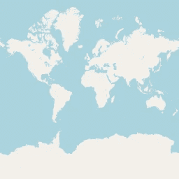
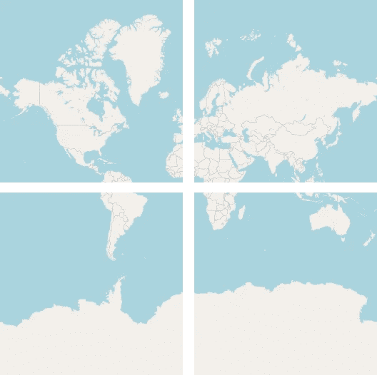
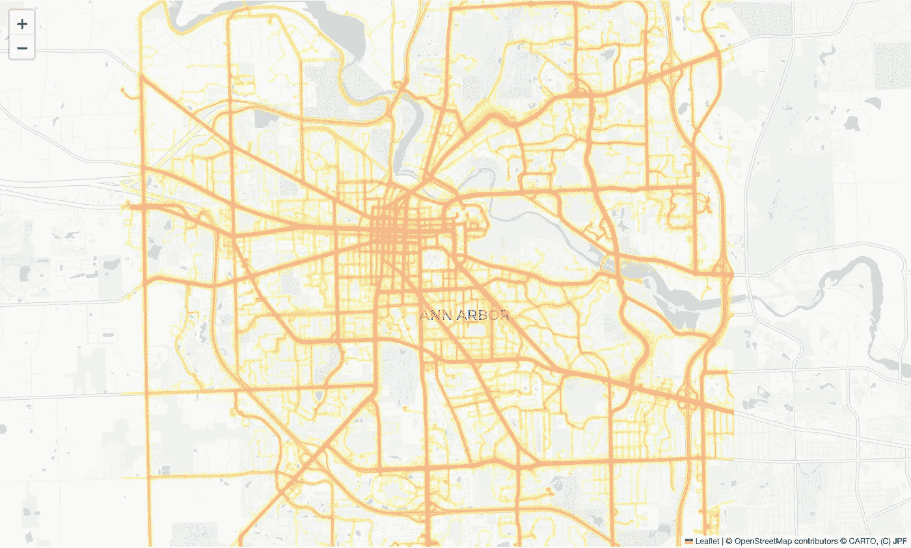

# 使用 Rust 生成地图瓦片

> 原文：[`towardsdatascience.com/generating-map-tiles-with-rust-dbdb0eb09b6b?source=collection_archive---------3-----------------------#2024-05-19`](https://towardsdatascience.com/generating-map-tiles-with-rust-dbdb0eb09b6b?source=collection_archive---------3-----------------------#2024-05-19)

## 从 Python 转向 Rust 有多容易？

[](https://medium.com/@joao.figueira?source=post_page---byline--dbdb0eb09b6b--------------------------------)[](https://towardsdatascience.com/?source=post_page---byline--dbdb0eb09b6b--------------------------------) [João Paulo Figueira](https://medium.com/@joao.figueira?source=post_page---byline--dbdb0eb09b6b--------------------------------)

·发布于 [Towards Data Science](https://towardsdatascience.com/?source=post_page---byline--dbdb0eb09b6b--------------------------------) ·阅读时间：6 分钟 ·2024 年 5 月 19 日

--


图片来自 [Diego García](https://unsplash.com/@diegogarcia?utm_source=medium&utm_medium=referral) 于 [Unsplash](https://unsplash.com/?utm_source=medium&utm_medium=referral)

有时，你需要在互动地图上显示大量数据，同时保持其可用性和响应性。互动在线地图是用 HTML 实现的，在地图显示中添加许多视觉元素通常会降低性能和可用性。一个可能的替代方案是离线绘制所有元素，并通过瓦片将它们作为透明层显示在地图上。每个方形瓦片整齐地覆盖在地图的瓦片之上，而互动地图控制只需处理较少的视觉元素。

几年前，我通过使用 Python 和 [车辆能源数据集](https://github.com/gsoh/VED) 编写了一个自定义地图瓦片生成器来解决这个问题。这个项目展示了如何通过在地图上使用自定义瓦片层来显示大量信息。这个过程包括使用一个 Web 应用程序来生成、缓存并提供瓦片。

[](/displaying-geographic-information-using-custom-map-tiles-c0e3344909a4?source=post_page-----dbdb0eb09b6b--------------------------------) ## 使用自定义地图瓦片显示地理信息

### 了解如何为你的互动地图创建自定义瓦片。

towardsdatascience.com

如你所知，Python 运行速度较慢，因此在生成每个瓷砖时，Web 应用程序的性能会受到显著影响。当瓷砖被缓存后，服务过程很快，在与地图交互时不会有明显的延迟。

尽管如此，我仍然对性能不满意，因此我想通过显著提高代码执行速度来再次解决这个问题。最初，我考虑将代码库转换为[Cython](https://cython.org/)，但后来我的注意力转向了另一个候选者。

# 进入 Rust

Rust 编程语言已经在我的视野中有一段时间了。由于我有 C、C++ 和 C# 的背景，我对该语言在内存安全性和 C 类性能方面的承诺产生了兴趣。我最终决定尝试一下，它看起来是学习和练习这门语言的一个完美起点。

在观看了许多 YouTube 视频和阅读了各种资料之后，我开始使用 Rust 来解决这个问题。我有三个主要问题：创建一个 Web 应用程序有多难？如何访问[SQLite](https://www.sqlite.org/)数据？如何通过编程创建透明的 PNG 图像？幸运的是，回答这些问题比预期的要简单得多。

## Rocket

为了解决 Web 应用程序的问题，我转向了[Rocket](https://rocket.rs/)。Rocket 在线文档中的[快速入门](https://rocket.rs/guide/v0.5/getting-started/#getting-started)页面展示了如何轻松地设置一个基础的 Web 应用程序。我们肯定需要更多复杂的功能来构建我们的瓷砖服务器，但它的基础模板看起来非常简洁明了。事实证明，Rocket 非常容易使用和适应，对我来说它是一个值得保留的工具。

## sqlx

经过几分钟的在线搜索，我很快意识到，访问 SQLite 数据库最流行的答案是通过[sqlx](https://docs.rs/sqlx/latest/sqlx/)包。它呈现了一个与我在 Python 中使用的范式不同的方式，但与我之前在 C# 开发时使用的方式非常相似。在这里，你必须使用强类型数据结构，而不是通用的数据结构或[熊猫](https://pandas.pydata.org/)的[数据框](https://pandas.pydata.org/docs/user_guide/dsintro.html#dataframe)。虽然这些类型的数据结构稍显繁琐，但它们会为你的生活带来额外的理智。

下方的**图 1**展示了我用来从等级范围表中检索数据的第一个完整代码示例。

**图 1** — 检索等级范围表的示例代码。（图片来源：作者）

## PNG

使用[**image**](https://docs.rs/image/0.25.1/image/) crate 创建、绘制和保存 PNG 文件非常简单。创建透明瓷砖的代码相当简单：

**图 2** — **image** crate 简化了图像的操作。上面的代码展示了如何创建一个纯色的 256x256 地图瓷砖。（图片来源：作者）

我还使用了[**colorgrad**](https://docs.rs/colorgrad/0.6.2/colorgrad/)包来处理瓷砖的颜色渐变。

在我详细讨论代码之前，让我们回顾一下绘制交通密度瓦片背后的原理。

# 一直是瓦片

地图瓦片通常由 256x256 的方形位图组成。我们可以通过结合 *x* 和 *y* 坐标、一个“缩放”级别或一个[四分键](https://learn.microsoft.com/en-us/bingmaps/articles/bing-maps-tile-system)代码来表示每个瓦片。每个缩放级别对应于不同维度瓦片的方形拼贴。整个地球在最上层的一个瓦片上进行描绘。通过缩放，原始瓦片被拆分为四个瓦片。以下**图 2**和**图 3**说明了缩放的过程。



**图 3** — 在缩放级别 0 上，整个世界呈现在单个瓦片中。（图片来源：OpenStreetMap）



**图 4** — 对之前的瓦片进行缩放，我们得到了四个具有相同单独维度的瓦片。（图片来源：OpenStreetMap）

如果我们继续缩放，在八次迭代后，每个生成的瓦片将对应第一个瓦片上的一个像素。这一观察结果提供了我们计算并在瓦片上显示交通密度信息的洞见。

如上一篇文章所述，瓦片信息已经准备好并存储在数据库中。有关如何从[车辆能量数据集](https://github.com/gsoh/VED)生成密度数据库的说明，请参见该文章。

# 使用 Rust 提供瓦片

现在我们可以讨论生成、缓存和提供瓦片的 Rust 服务器代码。当前的解决方案紧密地遵循了之前的瓦片服务器设计。下面的**图 5**显示了主要入口点，它决定在解析并接受查询参数后，是否提供绘制过的瓦片或默认的透明瓦片。

**图 5** — 主要入口点。（图片来源：作者）

如你所见，服务器只会对从一到十八的缩放级别做出响应。这个限制是嵌入在密度数据库的生成过程中。

网络应用程序使用下方**图 6**中列出的函数绘制每个瓦片。

**图 6** — 上述函数生成瓦片（如果未缓存到磁盘），并返回瓦片文件名。（图片来源：作者）

如上面的列表所示，瓦片绘制过程有三个步骤。首先，在第 12 行，我们收集瓦片的每像素密度信息。接下来，我们检索瓦片的级别范围，即瓦片“缩放”级别的最小和最大密度值。最后，在第 14 行，我们绘制瓦片的位图。该函数通过将瓦片位图保存到文件缓存来完成。

**图 7** — 上述函数在位图上绘制单个瓦片。注意，密度信息是如何通过基于对数的转换转化为颜色渐变中的条目的。（图片来源：作者）

# 使用代码

在正确配置数据库文件路径后，你可以通过打开终端窗口，切换到 Rust 项目目录，并运行以下命令来启动瓦片服务器：

```py
cargo run --release
```

接下来，你可以打开地图客户端并配置密度瓦片层的 URI。下面的**图 8**展示了加载交互式地图的 Jupyter Notebook 代码单元：

**图 8** — 使用上面的代码显示安阿伯地图，并叠加密度瓦片。（图片来源：作者）

就是这样！下面的**图 9**展示了结果。



**图 9** — 上面的图片展示了叠加了交通密度瓦片的基础地图。（图片来源：OpenStreetMap 和作者生成的瓦片）

# 结论

我第一次接触 Rust 并不像我预期的那样困难。我首先通过阅读现有文献和观看 YouTube 视频来进行准备，然后才开始尝试。接着，我确保使用一个很棒的 IDE 来辅助开发，[JetBrains](https://www.jetbrains.com/) 提供的 [RustRover](https://www.jetbrains.com/rust/) 就是其中之一。虽然该 IDE 仍处于预览模式，但我发现它在使用 Rust 时非常有帮助和指导性。如果你更喜欢使用 [Visual Studio Code](https://code.visualstudio.com/)，那也完全没问题，只要确保安装官方支持的插件。

# 致谢

我使用了[Grammarly](https://app.grammarly.com/)来检查写作，并采纳了其中一些改写建议。

[JetBrains 的 AI](https://www.jetbrains.com/ai/) 助手编写了部分代码，我还用它来学习 Rust。它已成为我日常使用 Rust 和 Python 的得力助手。

# 许可证信息

扩展车辆能源数据集采用 Apache 2.0 许可证，与其发源地 [车辆能源数据集](https://github.com/gsoh/VED) 相同。

# 参考文献

[车辆能源数据集](https://github.com/gsoh/VED)（GitHub）

[GitHub 仓库](https://github.com/joaofig/tilers)

João Paulo Figueira 是葡萄牙里斯本的[tb.lx by Daimler Truck](https://tblx.io/)的数据显示科学家。
