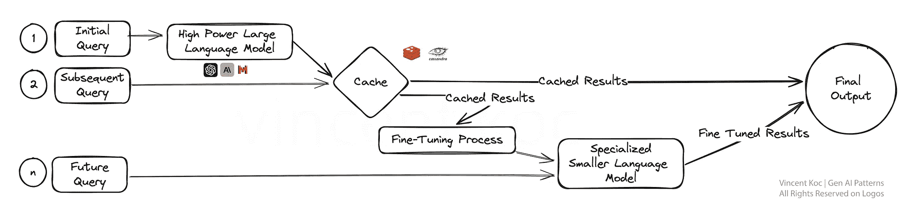
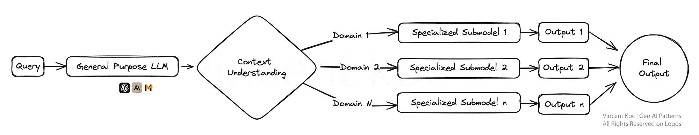
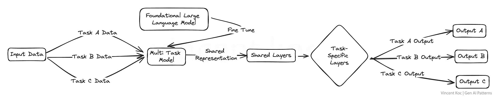
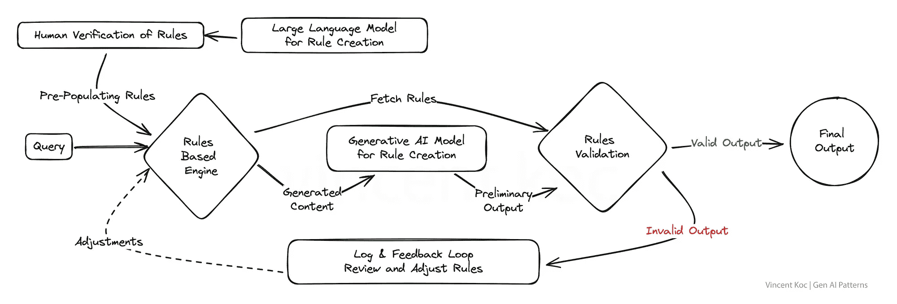
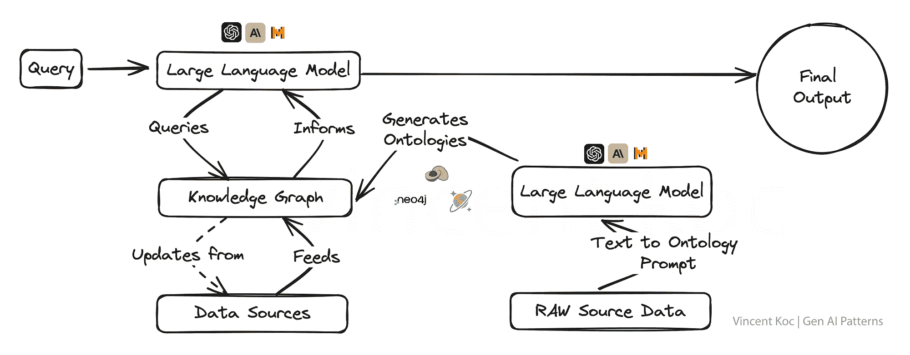
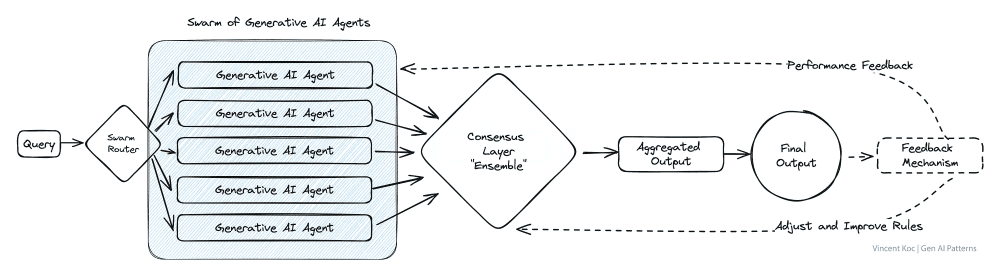
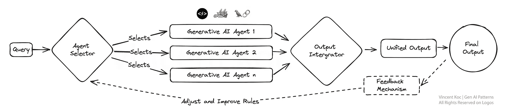
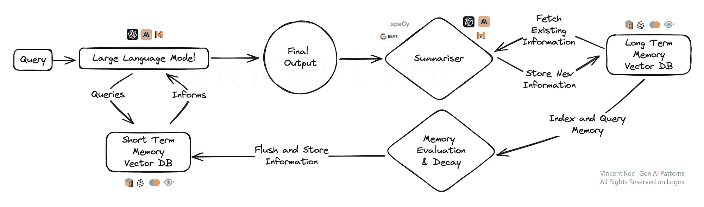
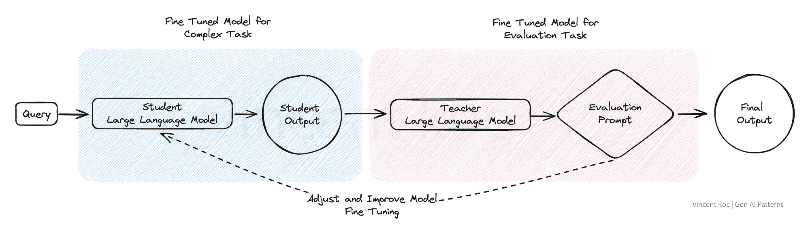

# 生成式 AI 设计模式：全面指南

> 原文：[`towardsdatascience.com/generative-ai-design-patterns-a-comprehensive-guide-41425a40d7d0?source=collection_archive---------1-----------------------#2024-02-13`](https://towardsdatascience.com/generative-ai-design-patterns-a-comprehensive-guide-41425a40d7d0?source=collection_archive---------1-----------------------#2024-02-13)

## 大型语言模型（LLM）工作中的参考架构模式和思维模型

 [Vincent Koc](https://medium.com/@vincentkoc?source=post_page---byline--41425a40d7d0--------------------------------)

·发布于 [Towards Data Science](https://towardsdatascience.com/?source=post_page---byline--41425a40d7d0--------------------------------) ·阅读时间 8 分钟 ·2024 年 2 月 13 日

--

*注意：当我在二月最初发布这篇文章时，它只是一个初步的思维实验。从那时起，我开始与一家大型出版社合作编写《生成式 AI 设计模式》一书。请关注我，及时了解我在这个领域的模式和想法更新。*

## 对 AI 模式的需求

当我们在构建新事物时，总会依赖一些经过验证的方法、途径和模式。对于软件工程师来说，这一点尤其成立。然而，对于生成式 AI 和人工智能本身来说，情况可能并非如此。随着生成式 AI 等新兴技术的出现，我们缺乏足够文档化的模式来支撑我们的解决方案。

在这里，我分享了一些生成式 AI 的方法和模式，基于我对无数生产环境中 LLM 实现的评估。这些模式的目标是帮助缓解和克服生成式 AI 实现中的一些挑战，如成本、延迟和幻觉问题。

## 模式列表

1.  分层缓存策略导致微调

1.  多路复用 AI 代理以形成专家小组

1.  针对多任务微调 LLM

1.  融合基于规则与生成式方法

1.  利用知识图谱与 LLM 的结合

1.  生成式 AI 代理的群体效应

1.  模块化单体 LLM 方法与组合性

1.  LLM 的记忆认知方法

1.  红蓝队双模型评估

## 1) 分层缓存策略导致微调

在这里，我们需要解决成本、冗余和训练数据等多个因素，当我们为大语言模型引入缓存策略和服务时。

通过缓存这些初步结果，系统可以在后续查询中更快速地提供答案，从而提高效率。关键在于一旦我们收集到足够的数据，通过微调层，利用这些早期互动的反馈来优化一个更专业化的模型。

专门化的模型不仅简化了流程，还将 AI 的专业能力针对具体任务进行了定制，使其在精确度和适应性至关重要的环境中（如客户服务或个性化内容创作）变得非常有效。

要开始使用，可以选择现成的服务，如 [GPTCache](https://github.com/zilliztech/GPTCache)，或者使用常见的缓存数据库如 [Redis](https://redis.io/)，[Apache Cassandra](https://cassandra.apache.org/_/index.html)，[Memcache](https://memcached.org/) 来自己搭建。确保在加入额外服务时，监控并测量延迟。

## 2) 多路复用 AI 代理以构建专家小组

想象一个生态系统，其中多个面向特定任务的生成式 AI 模型（“代理”），每个模型都是其领域内的专家，平行工作以解决查询。这个*多路复用*策略能够提供多样化的响应，随后将这些响应整合成一个全面的答案。

这种设置非常适合处理复杂问题的场景，在这些场景中，问题的不同方面需要不同的专业知识，就像一个专家小组每个处理一个更大问题的方面一样。

更大的模型，如 GPT-4，用于理解上下文并将其分解为具体任务或信息请求，这些请求随后会传递给较小的代理。代理可以是像 [Phi-2](https://www.microsoft.com/en-us/research/blog/phi-2-the-surprising-power-of-small-language-models/) 或 [TinyLlama](https://huggingface.co/TinyLlama/TinyLlama-1.1B-Chat-v0.1) 这样的较小语言模型，这些模型经过特定任务训练，访问特定工具，或者是像 GPT、Llama 这样的通用模型，具备特定的个性、上下文提示和功能调用。

## 3) 对大语言模型进行多任务微调

在这里，我们对一个大语言模型同时进行多个任务的微调，而不是仅针对单一任务进行微调。这是一种促进跨领域知识和技能稳健迁移的方法，增强了模型的多样性。

这种多任务学习对需要处理各种任务且要求高水平能力的平台特别有用，比如虚拟助手或 AI 驱动的研究工具。这有可能简化复杂领域中的训练和测试工作流。

用于训练大语言模型（LLM）的资源和软件包包括 [DeepSpeed](https://github.com/microsoft/DeepSpeed)，以及 [Hugging Face 的 Transformer 库](https://huggingface.co/docs/transformers/training)上的训练功能。

## 4) 融合基于规则与生成式方法

许多现有的商业系统和组织应用仍然在某种程度上是基于规则的。通过将生成式方法与基于规则的逻辑的结构化精确性结合，这种模式旨在产生既富有创意又符合要求的解决方案。

这是一个强有力的策略，适用于那些要求输出必须符合严格标准或法规的行业，确保 AI 在创新和参与的同时，仍然保持在预定参数的范围内。一个很好的例子是为电话 IVR 系统或传统的（*非 LLM 基础*）基于规则的聊天机器人生成意图和消息流程。

## 5) 利用知识图谱与大语言模型（LLM）

将知识图谱与生成式 AI 模型结合，赋予它们以事实为导向的超能力，使得输出不仅在语境上具有意识，而且更为准确。

这种方法对于那些对真理和准确性要求严格的应用至关重要，如教育内容创作、医疗建议或任何可能导致严重后果的误信息领域。

知识图谱和图谱本体论（*图谱的概念集合*）允许将复杂的主题或组织问题分解为结构化的格式，以帮助为大语言模型提供深层背景。你还可以使用语言模型生成本体论，格式如 JSON 或 RDF， [我为你创建的示例提示可以使用](https://gist.github.com/koconder/c37806ecc2e0a6d1ed3cdfbe4951b199)。

你可以使用的一些知识图谱服务包括图数据库服务，如 [ArangoDB](https://arangodb.com/)、[Amazon Neptune](https://aws.amazon.com/neptune/)、[Azure Cosmos DB](https://azure.microsoft.com/en-us/products/cosmos-db) 和 [Neo4j](https://neo4j.com/)。还有更广泛的数据集和服务可用于访问更广泛的知识图谱，包括 [Google 企业知识图谱 API](https://cloud.google.com/enterprise-knowledge-graph/docs/search-api)、[PyKEEN 数据集](https://github.com/pykeen/pykeen?tab=readme-ov-file#datasets) 和 [Wikidata](https://cloud.google.com/enterprise-knowledge-graph/docs/search-api)。

## 6) AI 代理群体

这一模型汲取了自然界群体和群兽的灵感，采用了多个 AI 代理共同处理问题，每个代理提供独特的视角。

由此产生的聚合输出体现了一种集体智慧，超越了任何单一代理所能实现的成果。这个模式在需要广泛创意解决方案或在处理复杂数据集时尤为有利。

其中一个例子是 [从多个“专家”视角审阅研究论文](https://www.fieldstudy.ai/)，或者从多个使用场景同时评估客户互动，从欺诈到优惠。我们将这些集体“代理”结合起来，整合他们的输入。对于高频次的集群，你可以考虑部署消息服务，如 [Apache Kafka](https://kafka.apache.org/)，来处理代理和服务之间的消息。

## 7) 模块化单体 LLM 方法与可组合性

该设计倡导适应性，采用模块化的 AI 系统，能够动态地重新配置自身，以实现最佳任务性能。它类似于一把瑞士军刀，每个模块可以根据需要选择并激活，使其在需要量身定制解决方案的企业中，针对不同的客户互动或产品需求时尤为高效。

你可以部署各种自主代理框架和架构来开发每个代理及其工具。示例框架包括 [CrewAI](https://github.com/joaomdmoura/crewAI)、[Langchain](https://www.langchain.com/)、[Microsoft Autogen](https://www.microsoft.com/en-us/research/project/autogen/) 和 [SuperAGI](https://superagi.com/)。

对于销售模块化单体系统，这可能是专注于潜在客户开发的代理，一个负责预订，一个专注于生成消息，另一个更新数据库。未来，随着特定服务的推出，来自专业 AI 公司的服务，你可以将模块替换为外部或第三方服务，来处理特定任务或领域问题。

## 8) LLM 的记忆认知方法

这种方法引入了类似人类记忆的元素，使得模型能够回忆并在之前的互动基础上构建，以提供更为细致的回应。

它特别适用于持续的对话或学习场景，因为 AI 随着时间的推移逐渐发展出更深刻的理解，就像一位专注的私人助手或自适应学习平台一样。通过汇总并将关键事件和讨论存储到向量数据库中，可以发展记忆认知方法。

为了保持摘要的计算成本较低，您可以利用较小的 NLP 库，如 [spaCy](https://spacy.io/) 或 [BART 语言模型](https://huggingface.co/docs/transformers/model_doc/bart)，尤其是在处理大量数据时。所使用的数据库是基于向量的，并且在提示阶段通过相似性搜索来检索短期记忆，定位关键“事实”。对于有兴趣了解工作解决方案的人，可以参考一个开源解决方案，遵循类似模式，名为 [MemGPT](https://memgpt.readme.io/docs/index)。

## 9) 红队与蓝队双模型评估

在红队与蓝队评估模型中，一个 AI 生成内容，而另一个则对其进行批判性评估，类似于严格的同行评审过程。这种双模型设置非常适合质量控制，因此在内容生成平台中非常适用，特别是在新闻聚合或教育资料制作等需要信誉和准确性的场景中。

这种方法可以用来替代复杂任务中的部分人工反馈，通过一个经过精调的模型模仿人类审阅过程，精炼结果，从而评估复杂的语言场景和输出。

## **要点**

这些生成性 AI 的设计模式不仅仅是模板；它们是未来智能系统发展的框架。在我们不断探索和创新的过程中，显然我们所选择的架构将不仅定义 AI 的能力，还将定义我们所创造的 AI 的本质。

这个列表绝非最终版本，随着生成性 AI 的模式和应用场景不断扩展，我们将看到这一领域的发展。*这篇文章的灵感来自于 Tomasz Tunguz 发布的* [*AI 设计模式*](https://tomtunguz.com/ai-design-patterns/) *。*

## 喜欢这个故事吗？

Vincent Koc 是一位成就卓越、以商业为导向的技术专家和未来学家，拥有丰富的经验，专注于数据驱动和数字化领域。

[免费订阅](https://medium.com/subscribe/@vkoc) 以便在 Vincent 发布新文章时接收通知。或者在 [LinkedIn](https://www.linkedin.com/in/koconder/) 和 [X](https://twitter.com/koconder) 上关注他。

 [## 当 Vincent Koc 发布新文章时，您可以通过电子邮件收到通知。

### 当 Vincent Koc 发布新文章时，您可以通过电子邮件收到通知。通过注册，您将创建一个 Medium 账户（如果您还没有的话）…

medium.com](https://medium.com/subscribe/@vkoc?source=post_page-----41425a40d7d0--------------------------------)

*除非另有说明，所有图片均由作者提供*
