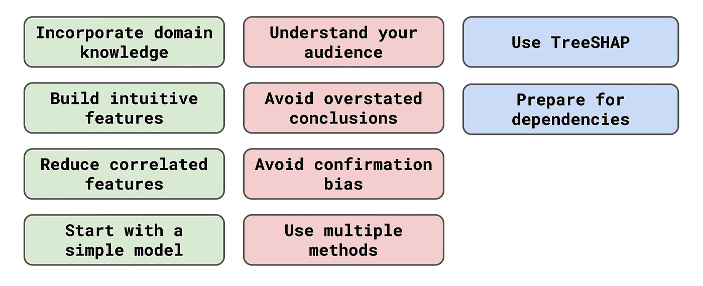

# 从 XAI 中获得更多：10 个技巧

> 原文：[`towardsdatascience.com/get-more-out-of-xai-10-tips-e1cf0a1060a3?source=collection_archive---------11-----------------------#2024-02-27`](https://towardsdatascience.com/get-more-out-of-xai-10-tips-e1cf0a1060a3?source=collection_archive---------11-----------------------#2024-02-27)

## 可解释的人工智能不仅仅是应用算法

 [Conor O'Sullivan](https://conorosullyds.medium.com/?source=post_page---byline--e1cf0a1060a3--------------------------------)

·发表于 [Towards Data Science](https://towardsdatascience.com/?source=post_page---byline--e1cf0a1060a3--------------------------------) ·阅读时间：9 分钟·2024 年 2 月 27 日

--

图片来源：[Marten Newhall](https://unsplash.com/@laughayette?utm_source=medium&utm_medium=referral) 发表在 [Unsplash](https://unsplash.com/?utm_source=medium&utm_medium=referral)

我记得第一次使用[SHAP](https://medium.com/towards-data-science/introduction-to-shap-with-python-d27edc23c454)时，嗯，应该说是尝试使用它。我想了解一个用超过 40 个特征训练的 XGBoost 模型，而这些特征中的许多高度相关。图表看起来很酷！但是，差不多就是这样。

当时完全不清楚模型是如何进行预测的。而且，这并不是[XAI](https://www.youtube.com/watch?v=YuDijSIR9iM)方法的错……底层数据一团糟。这是我第一次意识到：

**XAI 方法不是万能的解决方案。**

你不能简单地将它们应用到复杂模型上，然后期待能够得到合理的内部工作原理解释。然而，如果正确使用，它们能提供极为深刻的洞察。

自从第一次尝试理解黑箱模型以来，我学到了很多东西。我将这些经验总结成了 10 个技巧。如下所示，它们大致分为 3 组。前四个技巧侧重于用于训练模型的底层数据。接下来的四个技巧关注*你*，作为 XAI 方法的用户。最后两个技巧则深入探讨更多技术性考量。

（来源：作者）

你可能还会喜欢关于这个主题的视频。如果你想了解更多，可以查看…
