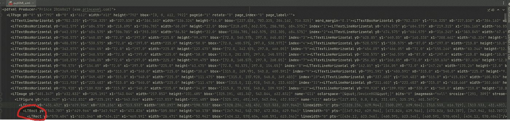
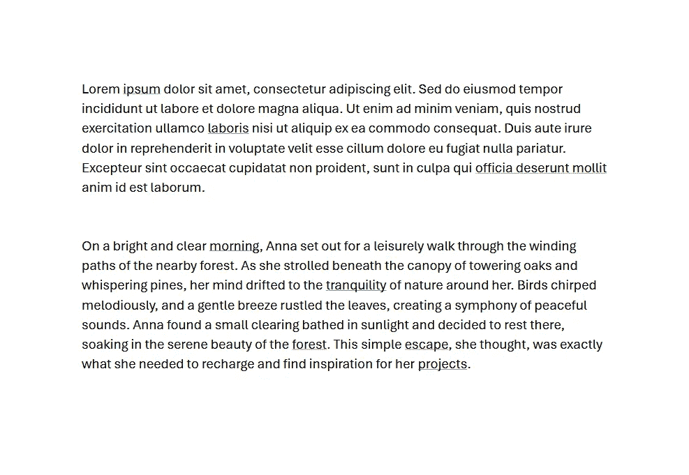
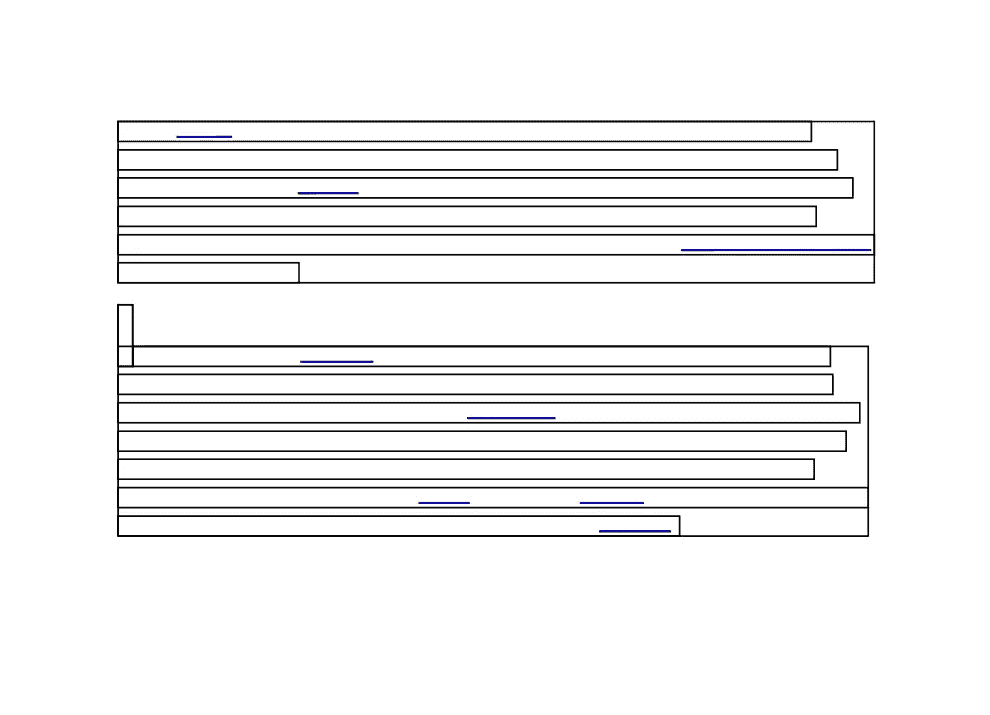
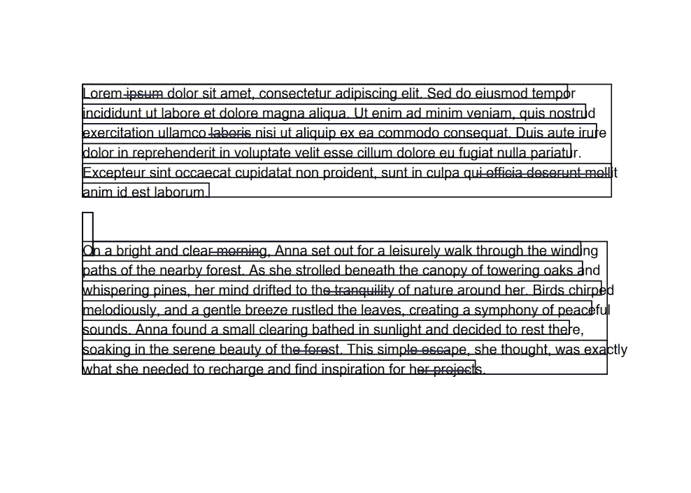
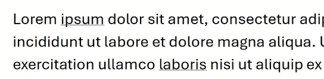
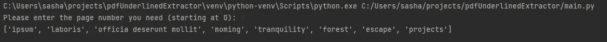

# 使用 Python 从任何 PDF 中提取带下划线的文本

> 原文：[`towardsdatascience.com/get-underlined-text-from-any-pdf-b7b068ca3d64?source=collection_archive---------8-----------------------#2024-05-03`](https://towardsdatascience.com/get-underlined-text-from-any-pdf-b7b068ca3d64?source=collection_archive---------8-----------------------#2024-05-03)

## 一步步指南，教你如何从 PDF 文件中提取带下划线的文本并将其作为数组处理。

[](https://medium.com/@sasha.korovkina2003?source=post_page---byline--b7b068ca3d64--------------------------------)[](https://towardsdatascience.com/?source=post_page---byline--b7b068ca3d64--------------------------------) [Sasha Korovkina](https://medium.com/@sasha.korovkina2003?source=post_page---byline--b7b068ca3d64--------------------------------)

·发布于 [Towards Data Science](https://towardsdatascience.com/?source=post_page---byline--b7b068ca3d64--------------------------------) ·阅读时间：5 分钟·2024 年 5 月 3 日

--

> *💡 如果你想查看这个项目的代码，可以访问我的仓库：* [***https://github.com/sasha-korovkina/pdfUnderlinedExtractor***](https://github.com/sasha-korovkina/pdfUnderlinedExtractor)

PDF 数据提取可能是一个真正的难题，尤其是在你尝试提取带下划线的文本时——信不信由你，目前没有现成的解决方案或库可以直接处理这个问题。不过别担心，我会教你如何解决这个问题。


图片来源：[dlxmedia.hu](https://unsplash.com/@dlxmedia?utm_source=medium&utm_medium=referral) 于 [Unsplash](https://unsplash.com/?utm_source=medium&utm_medium=referral)

## 理论

从 PDF 中提取带下划线的文本有几种不同的方法。你可以考虑使用 OCR 来检测带底线的文本组件，或者深入研究 PyMuPDF 的标记功能。然而，我发现 OCR 往往会出现问题，表现为不一致和低精度。PyMuPDF 我也不太喜欢——它需要细致的参数调优，非常耗时。而且，如果设置错误，你可能会丢失大量数据。

需要记住的是，PDF 文件是：

+   **非结构化数据：** PDF 元素通常缺乏分组或分类，这使得系统地搜索内容变得更加复杂。

+   **文本格式识别：** 在 PDF 中检测特定的文本格式，如粗体或下划线，通常非常困难，因为大多数 Python 库并未有效支持这一功能。

但别怕，我们有一个策略来解决这个问题。

## 策略

+   将 PDF 转换为结构化 XML：首先将 PDF 文档转换为结构化 XML 格式，以便于数据处理。

+   提取所需组件：从 XML 中识别并隔离出与我们需求相关的特定组件。

+   使用 OCR（光学字符识别）技术处理提取的坐标，获取下划线文本数据作为数组。

+   提取并输出下划线文本：最后，从文档中提取下划线文本并显示或打印结果。

## 代码

1.  **PDF 转 XML**

我们将使用**pdfquery**库，这是我遇到的最全面的 PDF 转 XML 转换器。

2\. **研究 XML**

XML 中有几个关键组件是我们感兴趣的：

+   *LTRect —* 有时，库会将下划线文本解析为文本下方的一个最小宽度矩形

+   *LTLine —* 有时，它会将轮廓识别为一个独立的线条组件。



这就是您的输出 XML 的样子。图像由作者创建。

LTRect 组件示例：

```py
<LTRect y0="563.787" y1="629.964" x0="367.942" x1="473.826" width="105.884" height="66.178" bbox="[367.942, 563.787, 473.826, 629.964]" linewidth="0" pts="[[367.942, 629.964], [473.826, 629.964], [473.826, 563.787], [367.942, 563.787]]">
```

因此，通过将整个文档转换为 XML 格式，我们可以将其结构作为 XML 组件进行复制，接下来我们就这么做！

## 结构复制

现在，我们将重新创建文档的结构作为边界框坐标。为此，我们将解析 XML，定义页面、组件框、线条和矩形，然后用三种不同的颜色将它们全部绘制在我们的画布上。

PDF 对象可视化。

这是我们的初始 PDF，它是通过在 Microsoft Word 中生成的，通过导出包含一些下划线的文档为 PDF 文件格式：



初始文档，包含示例文本。图像由作者创建。

应用上述算法后，这就是我们得到的视觉表示：



文档的框架轮廓：黑色—所有文档组件，蓝色—下划线文本。图像由作者创建。

这张图片展示了我们文档的结构，其中黑色框用于描述页面上的所有组件，蓝色框用于描述 LTRect 元素，因此出现了下划线文本。

## 文本叠加

现在，让我们通过以下代码行将 PDF 中的所有文本可视化，显示在各自的位置上：

```py
can.drawString(text_x, text_y, text)
```

这是输出结果：



基于文本位置和下划线的 PDF 重新创建。图像由作者创建。

> 请注意，由于 pdfquery 库中标记语言的大小和字体差异，文本的位置与原始文档中的位置不完全一致。

## 坐标提取

作为 XML 结果，我们将得到一组下划线区域的坐标数组，在我的案例中，我将其命名为 underline_text。

一段形成 PDF 文件中下划线文本坐标数组的代码。

## 文本提取

过程如下：

1.  我们识别出先前确定的坐标矩形。

1.  我们从 PDF 中提取这些部分。

1.  我们应用 Tesseract OCR 从每个提取的部分中提取文本。

使用坐标矩形和 Tesseract OCR 从 PDF 中提取文本的方法之所以有效，有几个原因：

1.  **文本提取的精度**：通过识别特定的坐标矩形，处理过程仅针对 PDF 中的相关区域。这种聚焦的方法避免了对整个文档的无谓处理，并减少了提取不需要的文本时出现的错误。

1.  **效率**：直接从 PDF 中提取预定义部分比处理整个文档要快得多。这种方法节省了计算资源和时间，尤其在处理大型文档时特别有用。

1.  **OCR 精度**：Tesseract OCR 是一个强大的光学字符识别工具，能够将文本图像转换为机器可读的文本。通过向其提供精确的文本部分，它可以更准确地执行任务，因为它处理的文本背景噪声和格式问题较少，这能避免在较大、未分割的文档中混淆 OCR 过程。

这就是代码：

从 PDF 部分提取下划线文本的代码。

在运行此功能之前，请确保你的系统上已安装 tesseract。有关详细说明，请查看他们的官方安装指南：[`github.com/tesseract-ocr/tessdoc/blob/main/Installation.md`](https://github.com/tesseract-ocr/tessdoc/blob/main/Installation.md) 或者在我的 GitHub 仓库中查看：[`github.com/sasha-korovkina/pdfUnderlinedExtractor`](https://github.com/sasha-korovkina/pdfUnderlinedExtractor)。

## 整合所有内容…

现在，如果我们取任何 PDF 文件，例如这个示例文件：


测试文件的完整文本。图片由作者创建。

我们在这个文件中有一些下划线的词语：



这里下划线的内容是“ipsum”和“laboris”。图片由作者创建。

在运行上述代码后，得到的结果是：



文档中所有下划线词语的数组。图片由作者创建。

得到这个数组后，你可以将这些词语用于进一步处理！

> 享受使用这个脚本的过程吧！我很乐意听听你想到的任何创造性应用，或者如果你想贡献一些内容，请告诉我！❤️
