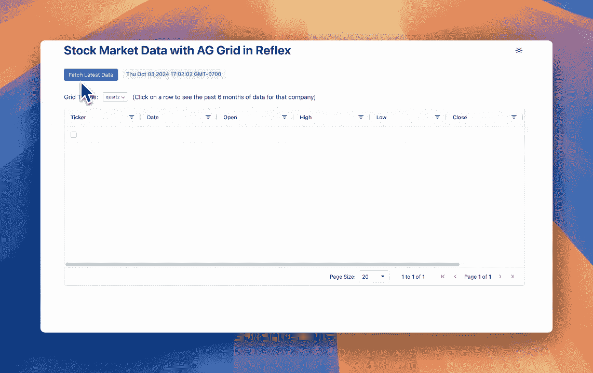
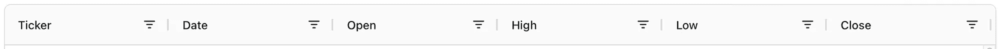
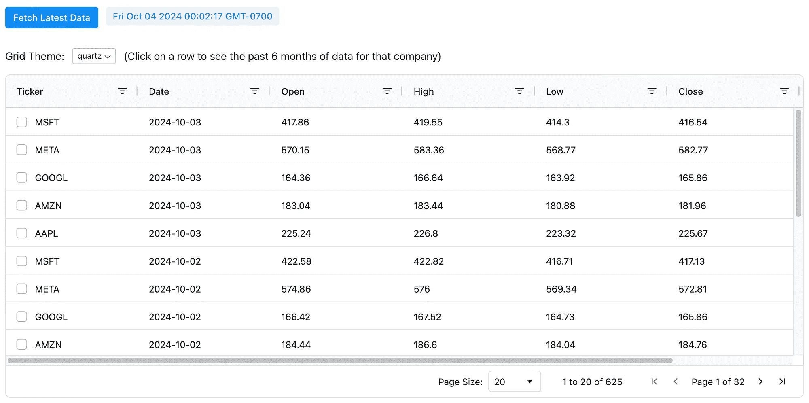
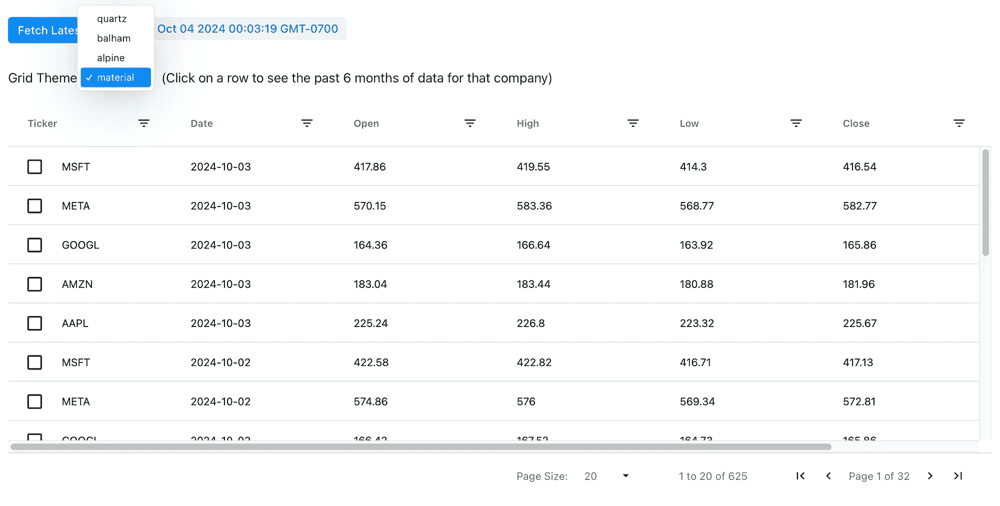
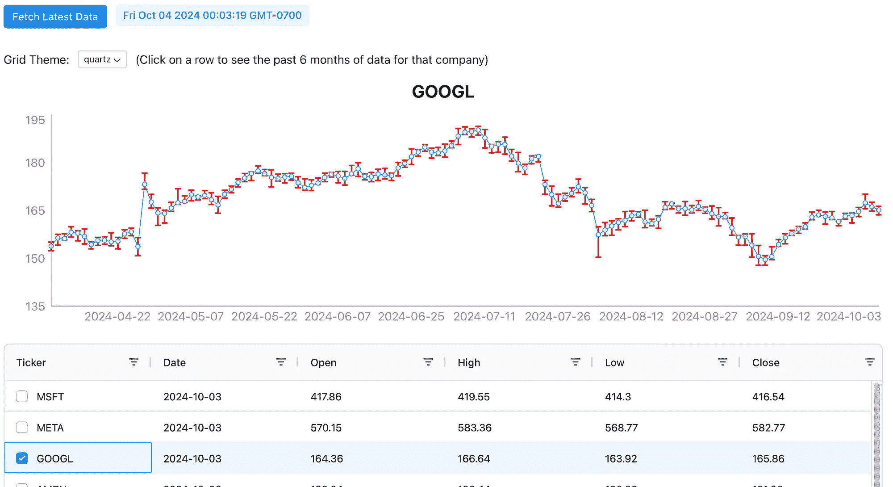

# 在你的 Python Web 应用中入门强大的数据表格

> 原文：[`towardsdatascience.com/getting-started-with-powerful-data-tables-in-your-python-web-apps-1e48dc44caf2?source=collection_archive---------1-----------------------#2024-10-06`](https://towardsdatascience.com/getting-started-with-powerful-data-tables-in-your-python-web-apps-1e48dc44caf2?source=collection_archive---------1-----------------------#2024-10-06)

## 使用 AG Grid 在纯 Python 中与 Reflex 构建金融应用

[](https://medium.com/@tgotsman12?source=post_page---byline--1e48dc44caf2--------------------------------)[](https://towardsdatascience.com/?source=post_page---byline--1e48dc44caf2--------------------------------) [Tom Gotsman](https://medium.com/@tgotsman12?source=post_page---byline--1e48dc44caf2--------------------------------)

·发布于 [Towards Data Science](https://towardsdatascience.com/?source=post_page---byline--1e48dc44caf2--------------------------------) ·6 分钟阅读·2024 年 10 月 6 日

--



在过去几个月里，我一直在探索用于 Web 应用的各种数据可视化和操作工具。作为一名 Python 开发者，我经常需要处理大规模数据集并将其显示在交互式、可定制的表格中。一直困扰我的一个问题是：如何构建一个强大的数据网格 UI，与我的 Python 后端无缝集成？

有许多选项可以构建复杂的数据网格，但作为一名 Python 工程师，我对 JavaScript 或任何前端框架的经验有限。我在寻找一种方法，利用我最熟悉的语言——Python，来创建一个功能丰富的数据网格！

我决定使用 Reflex，一个开源框架，允许我完全使用 Python 构建 Web 应用。更重要的是，Reflex 现在提供与 [AG Grid](https://www.ag-grid.com) 的集成，AG Grid 是一个功能丰富的数据网格库，旨在 Web 应用中显示和操作表格数据，提供一系列功能，包括：

- 原地单元格编辑

- 实时数据更新

- 分页和无限滚动

- 列过滤、重新排序、调整大小和隐藏

- 行分组与聚合

- 内建主题

***免责声明：*** *我在 Reflex 担任创始工程师，负责贡献开源框架。*

在本教程中，我们将介绍如何从头开始构建一个完整的金融应用程序，使用纯 Python 显示股票数据，并通过交互式网格和图表提供排序、筛选和分页等高级功能——查看完整的实时 [应用程序](https://ag-grid-app.reflex.run) 和 [代码](https://github.com/reflex-dev/reflex-examples/tree/main/ag_grid_finance)。

**设置**

首先，我们导入必要的库，包括用于获取股票数据的 yfinance。

```py
import reflex as rx
from reflex_ag_grid import ag_grid
import yfinance as yf
from datetime import datetime, timedelta
import pandas as pd
```

**获取并转换数据**

接下来，我们定义了 `State` 类，它包含应用程序的状态和逻辑。`fetch_stock_data` 函数获取指定公司的股票数据，并将其转换为适合在 AG Grid 中显示的格式。我们通过将按钮的 `on_click` 触发器与该状态函数连接，来调用此函数。

我们定义了状态变量，它们表示应用程序中可能随时间变化的字段（状态变量会直接渲染到应用程序的前端）。

`data` 状态变量存储了从 Yahoo Finance 获取的原始股票数据。我们将这些数据转换为四舍五入的值，并将其存储为字典列表，这是 AG Grid 所期望的格式。转换后的数据按日期和股票代码降序排列，并存储在 `dict_data` 状态变量中。

`datetime_now` 状态变量存储了数据获取时的当前日期和时间。

```py
# The list of companies to fetch data for
companies = ["AAPL", "MSFT", "GOOGL", "AMZN", "META"]

class State(rx.State):
    # The data fetched from Yahoo Finance
    data: pd.DataFrame
    # The data to be displayed in the AG Grid
    dict_data: list[dict] = [\{}]
    # The datetime of the current fetched data
    datetime_now: datetime = datetime.now()

    def fetch_stock_data(self):
        self.datetime_now = datetime.now()
        start_date = self.datetime_now - timedelta(days=180)

        # Fetch data for all tickers in a single download
        self.data = yf.download(companies, start=start_date, end=self.datetime_now, group_by='ticker')
        rows = []
        for ticker in companies:
            # Check if the DataFrame has a multi-level column index (for multiple tickers)
            if isinstance(self.data.columns, pd.MultiIndex):
                ticker_data = self.data[ticker]  # Select the data for the current ticker
            else:
                ticker_data = self.data  # If only one ticker, no multi-level index exists

            for date, row in ticker_data.iterrows():
                rows.append({
                    "ticker": ticker,
                    "date": date.strftime("%Y-%m-%d"),
                    "open": round(row["Open"], 2),
                    "high": round(row["High"], 2),
                    "mid": round((row["High"] + row["Low"]) / 2, 2),
                    "low": round(row["Low"], 2),
                    "close": round(row["Close"], 2),
                    "volume": int(row["Volume"]),
                })

        self.dict_data = sorted(rows, key=lambda x: (x["date"], x["ticker"]), reverse=True)
```

```py
rx.button(
    "Fetch Latest Data", 
    on_click=State.fetch_stock_data, 
)
```

**定义 AG Grid 列**



按作者显示的 AG Grid 列

`column_defs` 列表定义了要在 AG Grid 中显示的列。`header_name` 用于设置每一列的标题。`field` 键表示每一列的 id。`filter` 键用于插入筛选功能。

```py
column_defs = [
    ag_grid.column_def(field="ticker", header_name="Ticker", filter=ag_grid.filters.text, checkbox_selection=True),
    ag_grid.column_def(field="date", header_name="Date", filter=ag_grid.filters.date),
    ag_grid.column_def(field="open", header_name="Open", filter=ag_grid.filters.number),
    ag_grid.column_def(field="high", header_name="High", filter=ag_grid.filters.number),
    ag_grid.column_def(field="low", header_name="Low", filter=ag_grid.filters.number),
    ag_grid.column_def(field="close", header_name="Close", filter=ag_grid.filters.number),
    ag_grid.column_def(field="volume", header_name="Volume", filter=ag_grid.filters.number),
]
```

**显示 AG Grid**



按作者展示 AG Grid

现在是我们应用程序中最重要的部分，AG Grid 本身！

• `id` 是必需的，因为它唯一标识页面上的 Ag-Grid 实例

• `column_defs` 是我们之前定义的列定义列表

• `row_data` 是要在网格中显示的数据，存储在 `dict_data` 状态变量中。

• `pagination`、`pagination_page_size` 和 `pagination_page_size_selector` 参数启用具有特定变量的分页功能

• `theme` 允许你设置网格的主题

```py
ag_grid(
    id="myAgGrid",
    column_defs=column_defs,
    row_data=State.dict_data,
    pagination=True,
    pagination_page_size=20,
    pagination_page_size_selector=[10, 20, 50, 100],
    theme=State.grid_theme,
    on_selection_changed=State.handle_selection,
    width="100%",
    height="60vh",
)
```

**更改 AG Grid 主题**



按作者更改 AG Grid 主题

我们通过在 `rx.select` 组件中使用 `grid_theme` 状态变量来设置 `theme`。

每个状态变量都有一个内置函数来设置它的值，方便使用，函数名称为 `set_VARNAME`，在此情况下是 `set_grid_theme`。

```py
class State(rx.State):
    ...
    # The theme of the AG Grid
    grid_theme: str = "quartz"
    # The list of themes for the AG Grid
    themes: list[str] = ["quartz", "balham", "alpine", "material"]

rx.select(
    State.themes,
    value=State.grid_theme,
    on_change=State.set_grid_theme,
    size="1",
)
```

**以图表显示公司数据**



按作者显示所选公司过去 6 个月的数据

上面 AG Grid 代码中显示的 `on_selection_changed` 事件触发器，在用户选择网格中的一行时调用。这会调用 `State` 类中的 `handle_selection` 方法，将 `selected_rows` 状态变量设置为新选择的行，并调用 `update_line_graph` 方法。

`update_line_graph` 函数获取相关的股票代码，并使用它来设置 `company` 状态变量。然后，该公司的过去 6 个月的日期、平均值和 DateDifference 数据被设置到状态变量 `dff_ticker_hist` 中。

最终它呈现在一个 `rx.recharts.line_chart` 中，使用 `rx.recharts.error_bar` 显示 DateDifference 数据，即当天的最高值和最低值。

```py
class State(rx.State):
    ...
    # The selected rows in the AG Grid
    selected_rows: list[dict] = None
    # The currently selected company in AG Grid
    company: str
    # The data fetched from Yahoo Finance
    data: pd.DataFrame
    # The data to be displayed in the line graph
    dff_ticker_hist: list[dict] = None

    def handle_selection(self, selected_rows, _, __):
        self.selected_rows = selected_rows
        self.update_line_graph()

    def update_line_graph(self):
        if self.selected_rows:
            ticker = self.selected_rows[0]["ticker"]
        else:
            self.dff_ticker_hist = None
            return
        self.company = ticker

        dff_ticker_hist = self.data[ticker].reset_index()
        dff_ticker_hist["Date"] = pd.to_datetime(dff_ticker_hist["Date"]).dt.strftime("%Y-%m-%d")

        dff_ticker_hist["Mid"] = (dff_ticker_hist["Open"] + dff_ticker_hist["Close"]) / 2
        dff_ticker_hist["DayDifference"] = dff_ticker_hist.apply(
            lambda row: [row["High"] - row["Mid"], row["Mid"] - row["Low"]], axis=1
        )

        self.dff_ticker_hist = dff_ticker_hist.to_dict(orient="records")

rx.recharts.line_chart(
    rx.recharts.line(
        rx.recharts.error_bar(
            data_key="DayDifference",
            direction="y",
            width=4,
            stroke_width=2,
            stroke="red",
        ),
        data_key="Mid",
    ),
    rx.recharts.x_axis(data_key="Date"),
    rx.recharts.y_axis(domain=["auto", "auto"]),
    data=State.dff_ticker_hist,
    width="100%",
    height=300,
)
```

## 结论

在 Reflex 生态系统中使用 AG Grid 让我作为一个 Python 开发者能够轻松创建复杂、数据丰富的 Web 应用程序。无论你是在构建复杂的仪表盘、数据分析工具，还是需要强大数据网格功能的应用程序，Reflex AG Grid 都能满足你的需求。

我很高兴看到你将使用 Reflex AG Grid 创建的项目！分享你的项目，提问，加入我们[社区论坛](https://forum.reflex.dev)的讨论。让我们一起推动 Python Web 开发的边界！

如果你有问题，请在下方评论或通过 Twitter 联系我[@tgotsman12](https://twitter.com/tgotsman12)或通过[LinkedIn](https://www.linkedin.com/in/tom-gotsman/)。在社交媒体上分享你的应用创作并标记我，我很乐意提供反馈或帮助转发！
