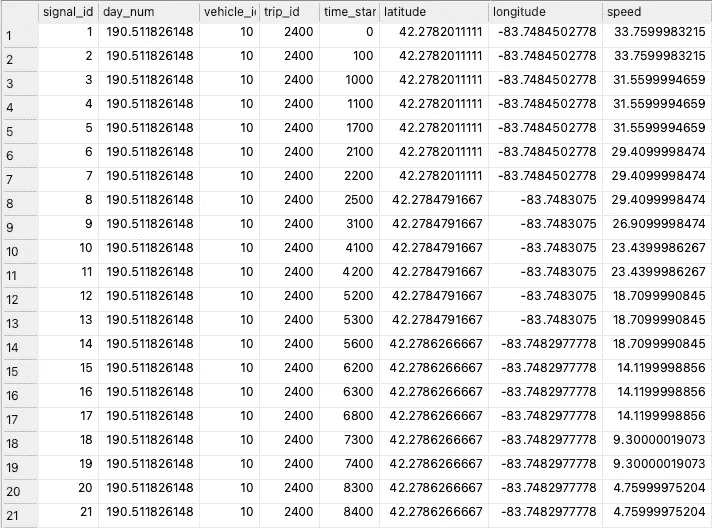

# 使用地图和运动学进行 GPS 插值

> 原文：[`towardsdatascience.com/gps-interpolation-using-maps-and-kinematics-6a56fdf29179?source=collection_archive---------8-----------------------#2024-12-03`](https://towardsdatascience.com/gps-interpolation-using-maps-and-kinematics-6a56fdf29179?source=collection_archive---------8-----------------------#2024-12-03)

## 如何将航位推算应用于你的地理空间数据集？

[](https://medium.com/@joao.figueira?source=post_page---byline--6a56fdf29179--------------------------------)[](https://towardsdatascience.com/?source=post_page---byline--6a56fdf29179--------------------------------) [João Paulo Figueira](https://medium.com/@joao.figueira?source=post_page---byline--6a56fdf29179--------------------------------)

·发布于[数据科学前沿](https://towardsdatascience.com/?source=post_page---byline--6a56fdf29179--------------------------------) ·10 分钟阅读·2024 年 12 月 3 日

--


上面的图片展示了 GPS 插值过程。红点表示已知且重复的 GPS 位置，每个点上有多个位置，而蓝点表示使用车辆的速度沿道路推测的重复点位置。（图片由作者使用 OpenStreetMap 数据和影像创建。）

现代的汽车、面包车和卡车是[远程信息处理](https://en.wikipedia.org/wiki/Telematics)数据的流动生成器。车辆的远程信息处理数据流通常携带各种信号，其中 GPS 位置是最常见的信号之一。你还可以找到诸如瞬时速度、加速度、油箱或电池电量以及其他一些特殊信号，如挡风玻璃雨刷状态和外部温度等。

GPS 接收器通常每秒采样一次数据（1 Hz），这适用于大多数应用，但其他车辆传感器可能具有不同的信号生成频率。信号生成频率是可编程的，通常需要平衡电信成本和信息内容的实用性。一些信号会在变化时发送，而其他信号可能只有在变化达到一定百分比后才发送，以避免不必要的费用。

遥测数据流在通过无线连接发送信号值时采用不同的信号包装方法。最基本的信号包装方法是在每次信号生成或显著变化时独立发送每个信号。每个数据包包含源标识、信号标识和信号值。另一种方法是将所有信号值作为标准记录进行打包，每当每个值发生变化时。没有预设的发射频率，未改变的值会在连续消息中重复。当接收端使用这种信号包装方法时，我们通常会发现这种方式，尤其是在发送方使用前一种方法时。

最后的方法与前一种方法类似，固定了发射频率，通常与 GPS 同步，突出了此信号在过程中的重要性。

本文讨论的第二种方法有一些副作用，即在 GPS 信号变化的过程中，所有中间数据包都会重复 GPS 坐标。下图展示了这种效果在[扩展车辆能源数据集](https://ar5iv.labs.arxiv.org/html/2203.08630)（EVED）上的体现。



**图 1** — 来自 EVED 的数据展示了车辆移动时 GPS 位置重复的频率。（图像来源：作者）

通常，在处理数据时，如**图 1**所示，当去除重复行时，会使用纬度和经度作为键。此技巧保留了所有其他列的聚合值，通常是第一行的值。然而，这可能会大幅减少数据集中的行数，从而使数据的价值降低，这类似于第三种包装方法。

在 GPS 信号变化之间（第 1、8 和 14 行），即使车辆在移动，如**图 1**所示的速度信号所示，所有其他记录仍然携带原始 GPS 坐标。我们可以对这些中间记录进行地理位置插值，从而提高 GPS 传感器的分辨率，改善数据集的质量。

本文演示了如何使用地图信息和速度信号执行上述 GPS 位置插值。

# 插值

GPS 插值是指使用辅助数据推断输入数据集中缺失的地理位置。如果你喜欢，这类似于[航迹推算](https://en.wikipedia.org/wiki/Dead_reckoning)，即 GPS 接收器在你通过隧道时推断当前位置的过程。在这里，我们将类似的概念应用于一个数据集，其中车辆信号的采样率高于 GPS 接收器。

死 reckoning（惯性导航）使用地图来确定前方的道路，并假设在隧道（或 GPS 盲区）内速度保持不变。在这里，我们将使用类似的方法。知道两个连续且不同的 GPS 样本之间的地图几何信息，可以提供准确的距离信息。如果有速度信号，我们可以通过简单的运动学计算来确定临时信号的近似 GPS 位置。否则，我们可以假设两个连续位置之间的平均速度是恒定的。幸运的是，EVED 报告了瞬时速度。

我们必须解决的第一个问题是如何测量两个连续且不同的 GPS 位置之间的距离。我们通过使用地图信息来完成这一点。我们必须利用地图来避免测量位置之间的[地理距离](https://en.wikipedia.org/wiki/Geographical_distance)（[顺风而行的距离](https://en.wikipedia.org/wiki/As_the_crow_flies)），正如下面的**图 2**所示。


**图 2** — 蓝点是地图顶点，红点是地图匹配的 GPS 位置。插值位置将出现在蓝色线条上，而我们必须使用沿红色线条几何形状的连续样本之间的距离。绿色线条代表不考虑地图几何的连续 GPS 位置之间的距离，而红色线条则使用地图几何。在这种情况下，红线比绿线长。（图片来源：作者）

GPS 插值过程需要辅助技术来实施，例如地图匹配、地图对齐、速度集成和地图投影。让我们逐一查看这些技术。

## 地图匹配

地图匹配将采样的 GPS 位置序列投影到数字地图上最可能的轨迹。我在另外两篇文章中已经讨论了这一过程，探讨了它在[轨迹](https://medium.com/towards-data-science/map-matching-for-trajectory-prediction-be307a1547f0)和[速度](https://medium.com/towards-data-science/map-matching-for-speed-prediction-f1a534626368)预测中的应用。请查阅这两篇文章及其支持的代码，它们支持本材料的内容。

在运行地图匹配过程后，我们收集原始 GPS 样本在地图边缘上的投影以及与行驶路线对应的地图顶点序列。上面的**图 2**展示了这一过程，其中地图顶点以蓝色表示，GPS 投影以红色表示。在继续之前，我们必须计算合并的顶点序列和 GPS 投影，这一过程我称之为“地图对齐”。

## 地图对齐

如前所述，地图匹配过程会产生两个不相交的点集，即边缘投影的 GPS 位置和地图顶点，这些点按照路线方向排列。在进一步处理之前，我们必须合并这些位置集，以确保它们之间的正确排序。不幸的是，边缘投影的 GPS 位置没有携带边缘信息，因此我们必须通过端点顶点来找到对应的边缘。这个过程会生成一个包含匹配 GPS 位置投影的地图边缘列表。

完成后，我们通过将地图边缘列表转换为互补格式：GPS 段列表，来结束地图对齐过程。我们通过起始和结束位置以及它们之间的任何地图顶点来标识每个 GPS 段。**图 3** 下方展示了这些概念，蓝色条表示地图边缘，红色条表示 GPS 段。


**图 3** — 地图对齐过程正确地对地图顶点和投影的 GPS 位置进行排序，并将结果列表拆分成 GPS 段，显示为红色。请注意，每个 GPS 段包含投影的 GPS 端点和其中的所有地图顶点。（图片来源：作者）

现在，我们可以分别检查和处理每个 GPS 段。为了更好地说明这一概念，**图 1** 上的第一个 GPS 段将包括*第一*到*第八*行，这些行之间包含的任何地图顶点。

**图 3** 上所示的典型 GPS 段包含一组与每个端点对应的信号记录。**图 1** 显示，前两个 GPS 位置分别有七个和六个记录。我们的目标是利用收集到的关于车辆运动的信息，将这些记录投影到段的地理位置上。幸运的是，EVED 具有时间戳和记录的车辆速度。我们可以利用一些运动学重建段上的位移，并放置插值后的 GPS 位置。

如果你曾经学习过运动学，你会知道：

> [在速度-时间图中，曲线下的面积表示位置变化。](https://physics.info/motion-graphs/)

为了恢复连续投影的 GPS 位置之间的估计距离，我们需要计算时间与速度的积分。

## 速度集成

**图 1** 上显示，对于每条记录，我们都有时间戳值（从行程开始以来的毫秒数）和车辆速度值（以千米每小时为单位）。为了重建所有中间距离，我们为每一步计算一个简单的[梯形积分](https://en.wikipedia.org/wiki/Trapezoidal_rule)，然后根据地图上计算的实际 GPS 段长度进行调整。

由于速度信号可能会有噪声，因此需要进行最终调整，因为假设这些噪声在整个过程中分布一致。因此，从积分计算出的距离通常会与地图上的距离有所不同。

为了弥补这个差异，我们计算两个距离之间的修正因子，这使我们能够计算投影 GPS 位置之间的调整距离。有了这些最终信息，我们现在可以沿着分段对重复的 GPS 位置进行插值。

## 地图投影

插值过程的最后一步是将额外和重复的 GPS 位置转移到地图几何形状中。我们通过使用前一个位置并根据先前计算的距离沿分段的方向移动来计算每个位置。**图 4**下方展示了这一过程。


**图 4** — 地图投影过程使用集成的距离和 GPS 分段方向来计算投影位置的放置位置。从左到右，我们使用原始 GPS 位置（红色）或地图顶点（蓝色）的位置信息，以及相应的方向和距离，来计算投影的绿色 GPS 位置。（图片来源：作者）

为了尊重地图几何形状，算法在计算过程中必须考虑连续 GPS 位置之间的地图顶点。在上述**图 4**中，红色的初始 GPS 位置有四个重复点，我们可以利用信号时间戳和记录的速度将其投影到新的绿色点上。即使在跨越地图顶点时，算法也必须正确地分配距离，如图所示。

在投影插值后的 GPS 位置时，算法使用分段方向、前一个位置和临时距离，通过一个[著名公式](https://www.movable-type.co.uk/scripts/latlong.html)来计算下一个点的位置。

最终的 GPS 位置集，包括采样和插值后的位置，将被存储以供以后使用。接下来我们来看看如何做到这一点。

# 实现

在尝试运行本文的代码之前，请先阅读前提文章并运行其代码。本文的代码要求你下载并生成一个包含 EVED 数据的数据库，该数据库已经进行地图匹配，并包含投影的链路时长。请参阅下面的参考资料。

实现本文所述概念的 Python 代码可以在随附的[GitHub 仓库](https://github.com/joaofig/gps-oversample)中找到。你需要从命令行执行主脚本，以便对所有行程进行插值。

```py
uv run interpolate-gps.py
```

该脚本遍历所有行程，并逐一处理。第一步是加载地图匹配的行程折线，其中每个点都是地图顶点（前面图中的蓝点）。这些折线是在之前的文章中生成的，并应作为编码字符串存储在数据库中。

## 折线解码

解码折线需要一个专门的函数，该函数改编自公开的[Valhalla 仓库](https://valhalla.github.io/valhalla/decoding/)。

**图 5** — 上面的代码修改了原始的 Valhalla 折线解码函数。改进之一是可以选择重新排列坐标对为（纬度，经度），而不是默认的（经度，纬度）。原始代码由其作者根据 [MIT 许可证](https://github.com/valhalla/valhalla)授权。（图片来源：作者）

## GPS 段生成

接下来，脚本收集并对齐与地图匹配的旅行数据（红点）和地图顶点。此处理结果生成一个 GPS 段列表，结构中包含顺序配对的与地图匹配的 GPS 位置以及其中的任何地图顶点。

**图 6** — 一个 GPS 段是一个点的列表，其中第一个和最后一个点保证是与地图匹配的 GPS 位置。中间的任何点将是地图顶点。（图片来源：作者）

我们使用一个函数，它接受一个包含原始轨迹的 Pandas DataFrame，该轨迹包含唯一的位置以及与地图匹配的轨迹折线，用于计算 GPS 段的列表。

**图 7** — 上面的函数将与地图匹配的轨迹与独特的位置以及与地图匹配的折线转换为 GPS 段的列表。（图片来源：作者）

代码接着计算沿段几何线的重复位置投影，适用于每个 GPS 段。请注意，这仅适用于与起始 GPS 点对应的重复位置。结束的 GPS 点作为下一个段的起始点被重复。

我们使用一个专门的轨迹类来帮助我们计算 GPS 段。正如上面**图 7**所示，函数使用一系列独特的 GPS 位置、相应的时间戳和每个点的数据库标识符来初始化轨迹对象。然后，该对象将自己与解码后的折线合并，以返回一个……

死 reckoning 函数使用 GPS 段、计算出的距离和已知的持续时间来投影重复位置。

**图 8** — 上面的函数使用可用的距离和持续时间信息生成初始 GPS 位置的 GPS 投影。（图片来源：作者）

上面的函数生成一个包含所有从第一个 GPS 位置投影的点的列表，并为每个点添加行标识符，以便后续插入数据库。通过这种方式，使用这些投影位置的代码可以回溯到原始数据行。

**图 9** — 算法将通过地图投影生成的每个位置存储在上面的结构中。除了地理坐标，对象还存储时间偏移和原始行标识符。（图片来源：作者）

我们使用下面的函数来根据源位置、方位角和距离计算位置。方位角是从真北开始顺时针测量的角度，东为 90 度，南为 180 度。

**图 10** — 上述函数将一个点沿给定的距离和航向移动，是 GPS 位置插值的基础。（图片来源：作者）

我们现在可以看到主函数循环如何集成所有这些组件。值得注意的是，代码保留了原始地图匹配轨迹的两个副本，一个包含所有数据，另一个仅包含唯一位置（参见下面第 11–14 行）。

**图 11** — GPS 插值应用程序的主循环。（图片来源：作者）

代码的最后一步是将插值后的位置信息插入到数据库中的专用表中，该表与原始信号表有 1:1 的关系。

**图 12** — 上述函数计算时间与位移函数的导数，并将所有信号存储在数据库中。有关这些计算的解释见下文。（图片来源：作者）

现在，经过精细处理的数据可以用于一个有趣的案例研究，识别出哪些路段受到了最剧烈的制动和加速。

# 案例研究：剧烈制动

通过增加插值后的 GPS 位置信息的精度，我们可以更好地洞察车辆行为并进行更精确的计算。为了说明如何使用改进的位置信息精度，我们研究了车辆在哪些地方制动最剧烈，通过计算一个有趣的运动特征：**[jerk](https://en.wikipedia.org/wiki/Jerk_%28physics%29)**（或突变）。我们可以通过较短的时间间隔和相应的速度来可靠地计算这个运动学量。


**图 13** — jerk 或 jolt 是瞬时加速度的导数。较大的正值表示剧烈加速，而显著的负值则表示剧烈制动。（图片来源：作者，使用了 [Wikipedia 的符号](https://en.wikipedia.org/wiki/Jerk_(physics))）

可以使用推导出的插值 GPS 位置信息在地图上突出显示最剧烈的制动区域，通过 ***r(t)*** 函数的三阶导数计算瞬时 jerk，其中 ***r*** 是位移，***t*** 是时间。

下图 **图 14** 显示了将计算出的最剧烈制动绘制成图，制动值低于 jerk 分布的 𝜇-3𝜎。你可以通过专门的 [Jupyter notebook](https://github.com/joaofig/gps-oversample/blob/main/02-jerk.ipynb) 与此地图进行交互。


**图 14** — 上图显示了安娜堡地图的一部分，每个红点表示数据库中记录的一个异常剧烈的制动点。（图像由作者使用 OpenStreetMap 数据和影像创建。）

# 结论

在本文中，我们探讨了使用地图和中间信号（如时间和速度）插值 GPS 位置的问题。在进行地图匹配之后，我们检索了对应的生成树，该树包含了推断出的轨迹路径，并使用这些几何形状通过已知速度和中间时长，将缺失的 GPS 位置投影到“正确”的位置。通过插值所有 EVED 数据，我们利用这些数据检测安娜港（Ann Harbor）中预期发生最剧烈刹车的区域，作为可能存在危险点的代理。

# 致谢

我使用了 [Grammarly](https://app.grammarly.com/) 来审查写作，并接受了其中一些重写建议。

[JetBrains' AI](https://www.jetbrains.com/ai/) 助手编写了部分代码，并且它已经成为我日常使用 Python 编程工作的基础工具。

# 参考文献

[](/map-matching-for-trajectory-prediction-be307a1547f0?source=post_page-----6a56fdf29179--------------------------------) ## 轨迹预测中的地图匹配

### 你要去哪里？你应该走那条路吗？

towardsdatascience.com [](/map-matching-for-speed-prediction-f1a534626368?source=post_page-----6a56fdf29179--------------------------------) ## 速度预测中的地图匹配

### 你会开多快？

towardsdatascience.com

[运动图表 — 物理超文本书](https://physics.info/motion-graphs/)

[Movable Type Scripts — 计算纬度/经度点之间的距离、方位角等](https://www.movable-type.co.uk/scripts/latlong.html)

João Paulo Figueira 是 [tb.lx by Daimler Truck](https://tblx.io/) 的数据科学家，位于葡萄牙里斯本。
