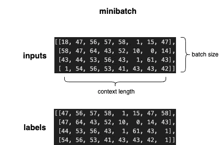
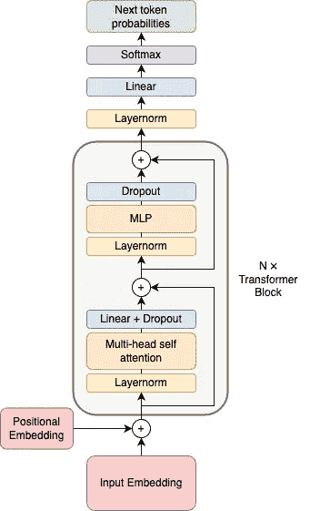
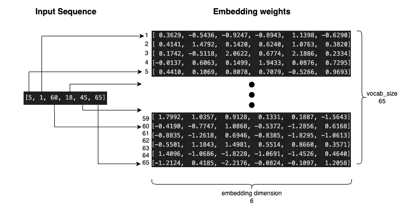
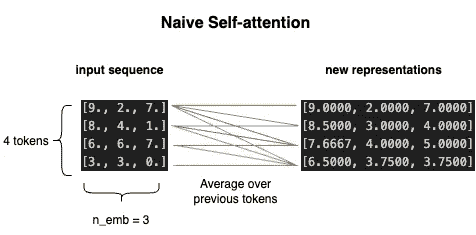
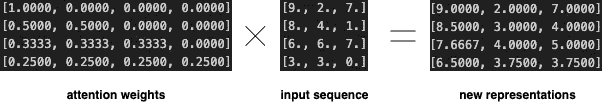
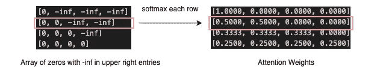
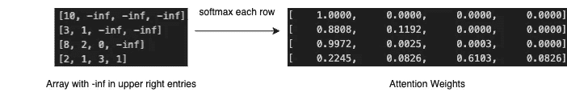
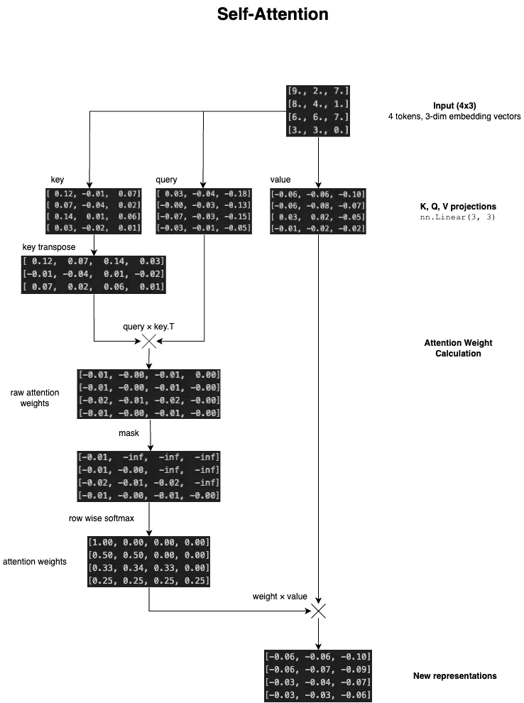
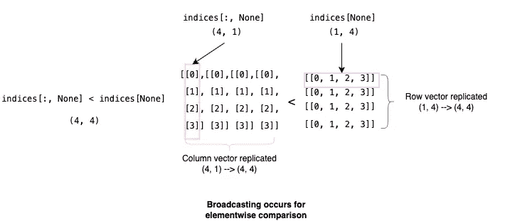
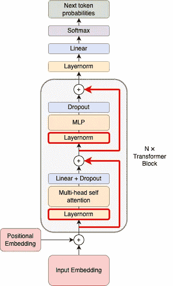

# 从零开始使用 MLX 构建 GPT

> 原文：[`towardsdatascience.com/gpt-from-scratch-with-mlx-acf2defda30e?source=collection_archive---------0-----------------------#2024-06-15`](https://towardsdatascience.com/gpt-from-scratch-with-mlx-acf2defda30e?source=collection_archive---------0-----------------------#2024-06-15)

## 在你的 MacBook 上定义并训练 GPT-2

[](https://medium.com/@pranavj1?source=post_page---byline--acf2defda30e--------------------------------)[](https://towardsdatascience.com/?source=post_page---byline--acf2defda30e--------------------------------) [Pranav Jadhav](https://medium.com/@pranavj1?source=post_page---byline--acf2defda30e--------------------------------)

·发布于 [Towards Data Science](https://towardsdatascience.com/?source=post_page---byline--acf2defda30e--------------------------------) ·31 分钟阅读·2024 年 6 月 15 日

--


图片由 [Sergey Zolkin](https://unsplash.com/@szolkin?utm_source=medium&utm_medium=referral) 提供，来源于 [Unsplash](https://unsplash.com/?utm_source=medium&utm_medium=referral)

本文的目标是带领你一步步从头开始定义并训练 GPT-2，使用 [MLX](https://github.com/ml-explore/mlx)，苹果为 Apple Silicon 提供的机器学习库。我希望在从分词器到采样的过程中，毫无遗漏地讲解每一步。沿袭 [Karpathy 的精彩 GPT 从零开始教程](https://www.youtube.com/watch?v=kCc8FmEb1nY&t=5978s)的精神，我们将训练一个基于莎士比亚作品的模型 [1]。我们将从一个空白的 Python 文件开始，最终构建出一个能够写出莎士比亚风格文本的软件。所有这些都将在 MLX 中构建，这使得在 Apple Silicon 上的训练和推理速度更快。

本文最好通过跟随操作来体验。代码包含在以下仓库中，我建议打开并参考它。

[](https://github.com/pranavjad/mlx-gpt2?source=post_page-----acf2defda30e--------------------------------) [## GitHub - pranavjad/mlx-gpt2

### 通过在 GitHub 上创建帐户，贡献于 pranavjad/mlx-gpt2 的开发。

github.com](https://github.com/pranavjad/mlx-gpt2?source=post_page-----acf2defda30e--------------------------------)

# 目录

+   准备数据

+   编码 GPT-2

+   输入嵌入

+   位置嵌入

+   自注意力

+   键、查询和数值

+   多头注意力

+   多层感知机（MLP）

+   模块

+   层归一化和跳跃连接

+   前向传播

+   采样

+   初始化

+   训练循环

+   参考文献

# 准备数据

安装 mlx 并运行以下导入语句。

```py
import mlx.core as mx
import mlx.nn as nn
import mlx.optimizers as optim
import mlx.utils as utils
import numpy as np
import math
```

训练 LLM 的第一步是收集大量的文本数据，然后对其进行分词。分词是将文本映射到整数的过程，这些整数可以输入到 LLM 中。我们这个模型的训练语料库将是莎士比亚的作品，这些作品会被拼接成一个文件。大约有 100 万个字符，格式如下：

```py
First Citizen:
Before we proceed any further, hear me speak.

All:
Speak, speak.

First Citizen:
You are all resolved rather to die than to famish?

All:
Resolved. resolved.

First Citizen:
First, you know Caius Marcius is chief enemy to the people.
...
```

首先，我们将文件作为一个长字符串读取到`text`变量中。然后我们使用`set()`函数获取文本中的所有唯一字符，这些字符将构成我们的词汇表。通过打印`vocab`，你可以看到我们词汇表中的所有字符作为一个字符串，我们一共有 65 个字符，这些将作为我们的 token。

```py
# Creating the vocabulary
with open('input.txt', 'r', encoding='utf-8') as f:
    text = f.read()
vocab = sorted(list(set(text)))
vocab_size = len(vocab)

print(''.join(vocab))
# !$&',-.3:;?ABCDEFGHIJKLMNOPQRSTUVWXYZabcdefghijklmnopqrstuvwxyz
print(vocab_size)
# 65
```

生产模型将使用像字节对编码（byte-pair encoding）这样的分词算法来生成更大的子词词汇表。由于我们今天的重点是架构，因此我们将继续使用字符级别的分词。接下来，我们将把我们的词汇映射到称为 token ID 的整数。然后我们可以将文本编码为 token 并解码回字符串。

```py
# Create mapping from vocab to integers
itos = {i:c for i,c in enumerate(vocab)} # int to string
stoi = {c:i for i,c in enumerate(vocab)} # string to int
encode = lambda x: [stoi[c] for c in x]
decode = lambda x: ''.join([itos[i] for i in x])

print(encode("hello world"))
# [46, 43, 50, 50, 53, 1, 61, 53, 56, 50, 42]
print(decode(encode("hello world")))
# hello world
```

我们使用`enumerate()`函数遍历词汇表中的所有字符及其索引，并创建一个字典`itos`，它将整数映射到字符，另一个字典`stoi`，它将字符串映射到整数。然后我们使用这些映射来创建我们的编码和解码函数。现在我们可以编码整个文本，并拆分训练数据和验证数据。

```py
data = encode(text)
split = int(0.9 * len(data))
train_data = data[:split]
val_data = data[split:]
```

当前，我们的训练数据只是一个非常长的 token 字符串。然而，我们正在训练模型以预测给定一些前置 token 后的下一个 token。因此，我们的数据集应该包含输入是某个 token 字符串、标签是正确下一个 token 的示例。我们需要定义一个模型参数，称为*上下文长度*，即用于预测下一个 token 的最大 token 数量。我们的训练示例将是我们上下文长度的长度。

让我们来看一下前`ctx_len+1`个 token。

```py
ctx_len = 8
print(train_data[:ctx_len + 1])
# [18, 47, 56, 57, 58,  1, 15, 47, 58]
# x: [18, 47, 56, 57, 58,  1, 15, 47] | y: 58
```

这是一个训练示例，其中输入是“18, 47, 56, 57, 58, 1, 15, 47”，期望输出是“58”。这是 8 个 token 的上下文。然而，我们还希望训练模型在只给定 7、6、5 … 0 个 token 作为上下文时预测下一个 token，这在生成过程中是必要的。因此，我们还考虑了这个示例中包含的 8 个子示例：

```py
ctx_len = 8
print(train_data[:ctx_len + 1])
# [18, 47, 56, 57, 58,  1, 15, 47, 58]
# 8 sub examples
# [18] --> 47
# [18, 47] --> 56
# [18, 47, 56] --> 57
# [18, 47, 56, 57] --> 58
# [18, 47, 56, 57, 58] --> 1
# [18, 47, 56, 57, 58, 1] --> 15
# [18, 47, 56, 57, 58, 1, 15] --> 47
# [18, 47, 56, 57, 58, 1, 15, 47] --> 58
```

请注意，标签只是输入左移后的结果。

```py
print("inputs: ", train_data[:ctx_len])
print("labels: ", train_data[1:ctx_len+1]) # labels = inputs indexed 1 higher
# inputs: [18, 47, 56, 57, 58,  1, 15, 47]
# labels: [47, 56, 57, 58,  1, 15, 47, 58]
```

在索引 0 处，输入是 18，标签是 47。 在索引 1 处，输入是包括索引 1 之前的所有内容，即[18, 47]，标签是 56，依此类推。现在我们明白标签仅仅是将输入序列的索引增加 1 后得到的结果，我们可以构建我们的数据集。

```py
# Creating training and validation datasets
ctx_len = 8
X_train = mx.array([train_data[i:i+ctx_len] for i in range(0, len(train_data) - ctx_len, ctx_len)])
y_train = mx.array([train_data[i+1:i+ctx_len+1] for i in range(0, len(train_data) - ctx_len, ctx_len)])
X_val = mx.array([val_data[i:i+ctx_len] for i in range(0, len(val_data) - ctx_len, ctx_len)])
y_val = mx.array([val_data[i+1:i+ctx_len+1] for i in range(0, len(val_data) - ctx_len, ctx_len)])
```

我们遍历数据，将大小为`ctx_len`的块作为输入（X），然后将相同大小的块，但索引加 1 后的部分作为标签（y）。然后我们将这些 Python 列表转化为 mlx 数组对象。模型的内部会使用 mlx 编写，因此我们希望我们的输入是 mlx 数组。

还有一件事。在训练过程中，我们不希望一次只输入一个样本，而是希望一次输入多个样本，以提高效率。这组样本被称为我们的批次，而每个批次中的样本数量就是我们的批量大小。因此，我们定义一个函数来生成训练用的批次。

```py
def get_batches(X, y, b_size, shuffle=True):
    if shuffle:
        ix = np.arange(X.shape[0])
        np.random.shuffle(ix)
        ix = mx.array(ix)
        X = X[ix]
        y = y[ix]
    for i in range(0, X.shape[0], b_size):
        input = X[i:i+b_size]
        label = y[i:i+b_size]
        yield input, label
```

如果`shuffle=True`，我们通过随机打乱的索引对数据进行打乱。然后我们遍历数据集，并从输入数据和标签数据集中返回批量大小的块。这些块被称为小批次，它们只是我们并行处理的堆叠样本。这些小批次将在训练过程中作为输入提供给模型。

这是一个上下文长度为 8 的小批次示例，包含 4 个样本。



一个小批次（图由作者提供）

这个小批次包含了 32 个下一个标记预测问题。模型将为输入中的每个标记预测下一个标记，标签将用于计算损失。注意，标签包含了输入中每个索引对应的下一个标记。

你会希望将这个图像牢记在心，因为这些张量的形状会变得非常复杂。现在，只需要记住，我们将向模型输入一个形状为（batch_size, ctx_len）的张量。

# 编写 GPT-2 代码

让我们看看 GPT-2 架构，以便了解我们要实现的整体结构。



GPT-2 架构（图由作者提供）

如果这看起来有点困惑，不用担心。我们将从下到上一步步实现它。让我们从实现输入嵌入开始。

## 输入嵌入

输入嵌入层的目的是将标记 ID 映射到向量。每个标记将映射到一个向量，该向量将在模型中被传递并作为其表示。每个标记的向量将在模型中相互积累并交换信息，最终被用来预测下一个标记。这些向量被称为嵌入。

将标记 ID 映射到向量的最简单方法是通过查找表。我们创建一个大小为（vocab_size, n_emb）的矩阵，其中每一行是对应标记的嵌入向量。这个矩阵被称为嵌入权重。



嵌入层（图由作者提供）

图示展示了一个大小为（65, 6）的嵌入层示例。这意味着词汇表中有 65 个标记，每个标记将通过长度为 6 的嵌入向量表示。输入的序列将用于通过嵌入权重索引，以获取与每个标记对应的向量。记住我们输入到模型中的小批次吗？最初，小批次的大小是（batch_size, ctx_len）。经过嵌入层处理后，大小变为（batch_size, ctx_len, n_emb）。每个标记不再是一个单一的整数，而是一个长度为`n_emb`的向量。

现在让我们在代码中定义嵌入层。

```py
n_emb = 6 # You can add these hyperparams at the top of your file
class GPT(nn.Module):
    def __init__(self):
        super().__init__()
        self.wte = nn.Embedding(vocab_size, n_emb)
```

我们将定义一个类来组织我们的实现。我们继承 nn.Module，以便利用 mlx 的特性。然后在 init 函数中，我们调用父类构造函数并初始化我们的 token 嵌入层，命名为`wte`。

## 位置嵌入

接下来是位置嵌入。位置嵌入的目的是编码序列中每个 token 的位置相关信息。这些信息可以与我们的输入嵌入相加，从而获得一个完整的 token 表示，该表示包含了 token 在序列中的位置信息。

```py
class GPT(nn.Module):
    def __init__(self):
        super().__init__()
        self.wte = nn.Embedding(vocab_size, n_emb) # token embeddings
        self.wpe = nn.Embedding(ctx_len, n_emb) # position embeddings
```

位置嵌入的工作方式与 token 嵌入相同，不同之处在于我们不是为每个 token 提供一行，而是为每个可能的位置索引提供一行。这意味着我们的嵌入权重的形状将是(ctx_len, n_emb)。现在我们在我们的 GPT 类中实现 __call__ 函数。这个函数将包含模型的前向传播过程。

```py
# Tensor shapes commented
def __call__(self, x):
    B, T = x.shape # (B = batch_size, T = ctx_len)
    tok_emb = self.wte(x) # (B, T, n_emb)
    pos_emb = self.wpe(mx.arange(T)) # (T, n_emb)
    x = tok_emb + pos_emb # (B, T, n_emb)
```

首先，我们将输入的维度拆解为变量 B 和 T，方便处理。在序列建模的上下文中，B 和 T 通常是“batch”（批次）和“time”（时间）维度的简写。在这种情况下，序列的“时间”维度即为上下文长度。

接下来，我们计算 token 和位置的嵌入。注意，对于位置嵌入，我们的输入是`mx.arange(T)`。这个操作将输出一个从 0 到 T-1 的连续整数数组，正好符合我们的需求，因为这些正是我们要嵌入的位置。将其通过嵌入层后，我们将得到一个形状为(T, n_emb)的张量，因为嵌入层会为每个位置提取一个长度为 n_emb 的向量。注意，尽管 pos_emb 与 tok_emb 的形状不同，但我们仍然可以将它们相加，因为 mlx 会进行广播操作，即在批次维度上复制 pos_emb，以便实现逐元素相加。最后，我们进行相加操作，得到包含位置信息的 token 新表示。

## 自注意力

到目前为止，每个 token 的表示向量是独立计算的。它们没有交换任何信息的机会。从语言建模的角度来看，这显然是有问题的，因为单词的含义和用法依赖于周围的上下文。自注意力机制是我们将前面 token 的信息融入到当前 token 的一种方式。

首先，让我们考虑一种简单的方法。如果我们仅仅将每个 token 表示为其表示向量和所有前面 token 的表示向量的平均值呢？这样就能达到将前面 token 的信息打包到当前 token 表示中的目标。下面是它的样子。



作者提供的图片

但是自注意力并不涉及编写 for 循环。关键的见解是，我们可以通过矩阵乘法来实现之前 token 的平均化！



作者提供的图片

通过将我们的输入序列左乘一个特殊矩阵，我们得到了期望的结果。这个矩阵被称为注意力权重。请注意，注意力权重矩阵的每一行都指定了“多少”每个其他 token 进入给定 token 的表示。例如，在第二行中，我们有 [0.5, 0.5, 0, 0]。这意味着结果的第二行将是 `0.5*token1 + 0.5*token2 + 0*token3 + 0*token4`，即 token1 和 token2 的平均值。请注意，注意力权重是一个下三角矩阵（右上角为零）。这确保了未来的 token 不会被包含在某个给定 token 的表示中。这保证了 token 只能与之前的 token 进行通信，因为在生成过程中，模型只能访问到之前的 tokens。

让我们来看一下如何构建注意力权重矩阵。



图片由作者提供

请注意，如果我们创建一个包含 -inf 的零数组，并将其放置在右上角位置，然后对每一行进行 softmax 操作，我们就能得到期望的注意力权重。一个好的练习是逐步进行某一行的 softmax 计算，看看它是如何工作的。结论是，我们可以取一个大小为 (ctx_len, ctx_len) 的数组，并对每一行进行 softmax 操作，从而得到加和为一的注意力权重。

现在我们可以离开朴素自注意力的领域了。我们不仅仅是对之前的 tokens 取平均值，而是对之前的 tokens 进行任意加权求和。注意，当我们对任意矩阵进行逐行 softmax 时会发生什么。



图片由作者提供

我们仍然得到每行加和为一的权重。在训练过程中，我们可以学习左侧矩阵中的数值，这些数值将指定每个 token 如何影响其他 token 的表示。这就是 token 如何彼此“关注”的方式。但我们仍然没有理解这个左侧矩阵是如何产生的。这些预 softmax 注意力权重是从 token 本身计算出来的，但通过三次线性投影间接获得的。

## **键、查询和值**



图片由作者提供

我们序列中的每个令牌都会生成三个新的向量。这些向量被称为键（keys）、查询（queries）和值（values）。我们使用一个令牌的查询向量与另一个令牌的键向量的点积来量化这两个令牌之间的“亲和力”。我们希望计算每个令牌与其他每个令牌的成对亲和力，因此我们将查询向量（4x3）与转置后的键向量（3x4）相乘，以得到原始的注意力权重（4x4）。由于矩阵乘法的方式，原始注意力权重中（i,j）位置的值将是令牌 i 的查询向量与令牌 j 的键向量的点积，或者说是它们之间的“亲和力”。这样，我们就计算了每个令牌之间的相互作用。然而，我们不希望过去的令牌与未来的令牌发生交互，因此我们对右上部分的条目应用-∞的掩码，以确保它们在软最大化（softmax）之后会被归零。然后，我们执行按行的软最大化操作，以得到最终的注意力权重。我们并不直接将这些权重与输入相乘，而是将它们与值的投影相乘，这样就得到了新的表示。

现在我们在概念上已经理解了注意力机制，让我们来实现它。

```py
class Attention(nn.Module):
    def __init__(self, head_size):
        super().__init__()
        self.head_size = head_size
        self.k_proj = nn.Linear(n_emb, head_size, bias=False)
        self.q_proj = nn.Linear(n_emb, head_size, bias=False)
        self.v_proj = nn.Linear(n_emb, head_size, bias=False) 
```

我们首先定义键、查询和值的投影层。请注意，我们并不是从 n_emb 映射到 n_emb，而是从 n_emb 映射到 head_size。这并不改变任何东西，只是意味着通过注意力计算得到的新表示将具有 head_size 维度。

```py
class Attention(nn.Module):
    def __init__(self, head_size):
        super().__init__()
        self.head_size = head_size
        self.k_proj = nn.Linear(n_emb, head_size, bias=False)
        self.q_proj = nn.Linear(n_emb, head_size, bias=False)
        self.v_proj = nn.Linear(n_emb, head_size, bias=False)
    def __call__(self, x): # shapes commented
        B, T, C = x.shape # (batch_size, ctx_len, n_emb)
        K = self.k_proj(x) # (B, T, head_size)
        Q = self.q_proj(x) # (B, T, head_size)
        V = self.v_proj(x) # (B, T, head_size)
```

前向传播开始时计算键、查询和值的投影。为了便于以后使用，我们还将输入的形状拆解为变量 B、T 和 C。

```py
class Attention(nn.Module):
    def __init__(self, head_size):
        super().__init__()
        self.head_size = head_size
        self.k_proj = nn.Linear(n_emb, head_size, bias=False)
        self.q_proj = nn.Linear(n_emb, head_size, bias=False)
        self.v_proj = nn.Linear(n_emb, head_size, bias=False)
    def __call__(self, x):
        B, T, C = x.shape # (batch_size, ctx_len, n_emb)
        K = self.k_proj(x) # (B, T, head_size)
        Q = self.q_proj(x) # (B, T, head_size)
        V = self.v_proj(x) # (B, T, head_size)
        attn_weights = (Q @ K.transpose([0, 2, 1])) / math.sqrt(self.head_size)
        # attn_weights.shape = (B, T, T)
```

接下来，我们计算注意力权重。我们只需要转置键张量的最后两个维度，因为批量维度只是为了让我们可以并行处理多个训练示例。mlx 转置函数期望输入的新维度顺序，因此我们传递[0, 2, 1]来转置最后两个维度。还有一件事：我们通过 head_size 的平方根的倒数来缩放注意力权重。这被称为缩放注意力，其目的是确保当 Q 和 K 的方差为单位方差时，attn_weights 的方差也是单位方差。如果 attn_weights 的方差很大，那么 softmax 将把这些小值和大值映射为 0 或 1，从而导致表示变得不那么复杂。

下一步是应用掩码，以确保我们进行的是因果语言建模，即确保令牌无法关注未来的令牌。

```py
class Attention(nn.Module):
    def __init__(self, head_size):
        super().__init__()
        self.head_size = head_size
        self.k_proj = nn.Linear(n_emb, head_size, bias=False)
        self.q_proj = nn.Linear(n_emb, head_size, bias=False)
        self.v_proj = nn.Linear(n_emb, head_size, bias=False)
        indices = mx.arange(ctx_len)
        mask = indices[:, None] < indices[None] # broadcasting trick
        self._causal_mask = mask * -1e9
    def __call__(self, x):
        B, T, C = x.shape # (batch_size, ctx_len, n_emb)
        K = self.k_proj(x) # (B, T, head_size)
        Q = self.q_proj(x) # (B, T, head_size)
        V = self.v_proj(x) # (B, T, head_size)
        attn_weights = (Q @ K.transpose([0, 2, 1])) / math.sqrt(self.head_size)
        # attn_weights.shape = (B, T, T)
```

我们通过巧妙的广播技巧创建掩码。假设我们的 ctx_len=4，如上面的图示所示。首先，我们使用 mx.arange(4)将索引变量设置为[0, 1, 2, 3]。



图片来源：作者

然后我们可以像这样索引 `indices[:, None]` 来生成一个包含 `indices` 值的列向量。类似地，我们可以使用 `indices[None]` 来获取一个行向量。然后，当我们进行 `<` 比较时，mlx 会广播这两个向量，因为它们的形状不匹配，无法进行元素级比较。广播意味着 mlx 会沿缺失的维度复制这些向量，从而实现两个 (4, 4) 矩阵的逐元素比较，这就合理了。顺便说一下，我建议通过阅读 [这个](https://pytorch.org/docs/stable/notes/broadcasting.html) 来熟悉广播的细节，它在处理张量时经常出现。

元素级比较后，我们得到如下张量：

```py
[[False,  True,  True,  True],
 [False, False,  True,  True],
 [False, False, False,  True],
 [False, False, False, False]]
```

将这个张量乘以 -1e9，我们得到：

```py
[[-0e+00, -1e+09, -1e+09, -1e+09],
 [-0e+00, -0e+00, -1e+09, -1e+09],
 [-0e+00, -0e+00, -0e+00, -1e+09],
 [-0e+00, -0e+00, -0e+00, -0e+00]]
```

现在我们有了一个加性掩码。我们可以将这个矩阵加到我们的注意力权重上，使得所有右上角的条目变得非常大的负数。这将导致它们在 softmax 操作后被置为零。此外，请注意，我们将“_”作为前缀添加到属性名 `_causal_mask`，这将其标记为私有变量。这向 mlx 发出信号，表示它不是一个参数，训练过程中不应更新。

```py
class Attention(nn.Module):
    def __init__(self, head_size):
        super().__init__()
        self.head_size = head_size
        self.k_proj = nn.Linear(n_emb, head_size, bias=False)
        self.q_proj = nn.Linear(n_emb, head_size, bias=False)
        self.v_proj = nn.Linear(n_emb, head_size, bias=False)
        indices = mx.arange(ctx_len)
        mask = indices[:, None] < indices[None] # broadcasting trick
        self._causal_mask = mask * -1e9
    def __call__(self, x):
        B, T, C = x.shape # (batch_size, ctx_len, n_emb)
        K = self.k_proj(x) # (B, T, head_size)
        Q = self.q_proj(x) # (B, T, head_size)
        V = self.v_proj(x) # (B, T, head_size)
        attn_weights = (Q @ K.transpose([0, 2, 1])) / math.sqrt(self.head_size)
        # attn_weights.shape = (B, T, T)
        attn_weights = attn_weights + self._causal_mask
        attn_weights = mx.softmax(attn_weights, axis=-1)
        o = (attn_weights @ V) # (B, T, head_size)
```

现在我们可以按行应用 softmax，得到最终的注意力权重，并将这些权重与值相乘，得到我们的输出。注意，我们将 `axis=-1` 传递给 softmax，表示我们要在最后一个维度（即行）上进行 softmax 操作。

最后一步是输出的线性投影和丢弃层。

```py
dropout = 0.1 # add this with hyperparams at top of file
class Attention(nn.Module):
    def __init__(self, head_size):
        super().__init__()
        self.head_size = head_size
        self.k_proj = nn.Linear(n_emb, head_size, bias=False)
        self.q_proj = nn.Linear(n_emb, head_size, bias=False)
        self.v_proj = nn.Linear(n_emb, head_size, bias=False)
        indices = mx.arange(ctx_len)
        mask = indices[:, None] < indices[None] # broadcasting trick
        self._causal_mask = mask * -1e9
        self.c_proj = nn.Linear(head_size, n_emb) # output projection
        self.resid_dropout = nn.Dropout(dropout)
    def __call__(self, x):
        B, T, C = x.shape # (batch_size, ctx_len, n_emb)
        K = self.k_proj(x) # (B, T, head_size)
        Q = self.q_proj(x) # (B, T, head_size)
        V = self.v_proj(x) # (B, T, head_size)
        attn_weights = (Q @ K.transpose([0, 2, 1])) / math.sqrt(self.head_size)
        # attn_weights.shape = (B, T, T)
        attn_weights = attn_weights + self._causal_mask
        attn_weights = mx.softmax(attn_weights, axis=-1)
        o = (attn_weights @ V) # (B, T, head_size)
        o = self.c_proj(self.resid_dropout(o))
        return o
```

我们添加了两个新层，`c_proj` 和 `resid_dropout`，分别是输出投影和残差丢弃层。输出投影用于将向量恢复到原始维度 `n_emb`。丢弃层用于正则化和训练稳定性，尤其在我们开始堆叠 Transformer 块以构建深度网络时，这非常重要。这就是实现一个注意力头的全部内容！

## 多头注意力

LLMs 通常使用多个并行的注意力头，而不仅仅是一个注意力头，并将它们的输出拼接起来生成最终表示。例如，假设我们有一个注意力头，其 `head_size=64`，那么它为每个标记生成的向量是 64 维的。我们也可以通过使用 4 个并行的注意力头，每个头的 `head_size=16`，并将它们的输出拼接起来，得到一个 16x4=64 维的输出，来实现相同的效果。多头注意力使得模型能够学习更复杂的表示，因为每个头学习不同的投影和注意力权重。

```py
n_heads = 4
class MultiHeadAttention(nn.Module): # naive implementation
    def __init__(self):
        super().__init__()
        self.heads = [Attention(head_size // n_heads) for _ in range(n_heads)]
    def __call__(self, x):
        return mx.concatenate([head(x) for head in self.heads], axis=-1)
```

直接的实现方式是创建一个 `n_heads` 的注意力头列表，其中每个头的大小等于最终头大小除以 `n_heads`。然后我们将每个头的输出沿最后一个维度进行拼接。然而，这种实现效率低下，并没有充分利用张量的计算速度。让我们利用张量的强大功能来实现多头注意力。

```py
head_size = 64 # put at top of file
class MultiHeadAttention(nn.Module):
    def __init__(self):
        super().__init__()
        self.k_proj = nn.Linear(n_emb, head_size, bias=False)
        self.q_proj = nn.Linear(n_emb, head_size, bias=False)
        self.v_proj = nn.Linear(n_emb, head_size, bias=False)
        indices = mx.arange(ctx_len)
        mask = indices[:, None] < indices[None] # broadcasting trick
        self._causal_mask = mask * -1e9
        self.c_proj = nn.Linear(head_size, n_emb) # output projection
        self.resid_dropout = nn.Dropout(dropout)
    def __call__(self, x):
        B, T, C = x.shape # (batch_size, ctx_len, n_emb)
        K = self.k_proj(x) # (B, T, head_size)
        Q = self.q_proj(x) # (B, T, head_size)
        V = self.v_proj(x) # (B, T, head_size)
```

我们从单头注意力的实现开始。`__init__()`函数没有改变。前向传播像往常一样开始，首先是创建键、查询和值的投影。

```py
head_size = 64 # put at top of file
n_heads = 8 # put at top of file
class MultiHeadAttention(nn.Module):
    def __init__(self):
        super().__init__()
        self.k_proj = nn.Linear(n_emb, head_size, bias=False)
        self.q_proj = nn.Linear(n_emb, head_size, bias=False)
        self.v_proj = nn.Linear(n_emb, head_size, bias=False)
        indices = mx.arange(ctx_len)
        mask = indices[:, None] < indices[None] # broadcasting trick
        self._causal_mask = mask * -1e9
        self.c_proj = nn.Linear(head_size, n_emb) # output projection
        self.resid_dropout = nn.Dropout(dropout)
    def __call__(self, x):
        B, T, C = x.shape # (batch_size, ctx_len, n_emb)
        K = self.k_proj(x) # (B, T, head_size)
        Q = self.q_proj(x) # (B, T, head_size)
        V = self.v_proj(x) # (B, T, head_size)
        mha_shape = (B, T, n_heads, head_size//n_heads)
        K = mx.as_strided(K, (mha_shape)) # (B, T, n_heads, head_size//n_heads)
        Q = mx.as_strided(Q, (mha_shape)) # (B, T, n_heads, head_size//n_heads)
        V = mx.as_strided(V, (mha_shape)) # (B, T, n_heads, head_size//n_heads)
```

接下来我们需要做的是引入一个新的维度来表示头部的数量`n_heads`。在朴素实现中，我们有独立的注意力对象，每个都有自己的键、查询和值张量，但现在我们将它们放在一个张量中，因此我们需要一个用于头部的维度。我们在`mha_shape`中定义我们想要的新形状。然后，我们使用`mx.as_strided()`来重新塑形每个张量，使其包含头部维度。这个函数相当于 pytorch 中的`view`，它告诉 mlx 将该数组视为不同的形状。但我们仍然存在一个问题。注意，如果我们尝试像之前一样将`Q @ K_t`（其中 K_t 是 K 的最后两个维度转置）相乘来计算注意力权重，我们将会乘上以下形状：

```py
(B, T, n_heads, head_size//n_heads) @ (B, T, head_size//n_heads, n_heads)
Result shape: (B, T, n_heads, n_heads)
```

这将导致一个形状为`(B, T, n_heads, n_heads)`的张量，这是不正确的。在单头情况下，我们的注意力权重的形状为`(B, T, T)`，这是合理的，因为它展示了每对 token 之间的交互。因此，现在我们的形状应该是相同的，只不过多了一个头部维度：`(B, n_heads, T, T)`。我们通过在重新塑形后转置键、查询和值的维度来实现这一点，从而使`n_heads`维度变为 1 而不是 2。

```py
head_size = 64 # put at top of file
n_heads = 8 # put at top of file
class MultiHeadAttention(nn.Module):
    def __init__(self):
        super().__init__()
        self.k_proj = nn.Linear(n_emb, head_size, bias=False)
        self.q_proj = nn.Linear(n_emb, head_size, bias=False)
        self.v_proj = nn.Linear(n_emb, head_size, bias=False)
        indices = mx.arange(ctx_len)
        mask = indices[:, None] < indices[None] # broadcasting trick
        self._causal_mask = mask * -1e9
        self.c_proj = nn.Linear(head_size, n_emb) # output projection
        self.attn_dropout = nn.Dropout(dropout)
        self.resid_dropout = nn.Dropout(dropout)
    def __call__(self, x):
        B, T, C = x.shape # (batch_size, ctx_len, n_emb)
        K = self.k_proj(x) # (B, T, head_size)
        Q = self.q_proj(x) # (B, T, head_size)
        V = self.v_proj(x) # (B, T, head_size)
        mha_shape = (B, T, n_heads, head_size//n_heads)
        K = mx.as_strided(K, (mha_shape)).transpose([0, 2, 1, 3]) # (B, n_heads, T, head_size//n_heads)
        Q = mx.as_strided(Q, (mha_shape)).transpose([0, 2, 1, 3]) # (B, n_heads, T, head_size//n_heads)
        V = mx.as_strided(V, (mha_shape)).transpose([0, 2, 1, 3]) # (B, n_heads, T, head_size//n_heads)
        attn_weights = (Q @ K.transpose([0, 1, 3, 2])) / math.sqrt(Q.shape[-1]) # (B, n_heads, T, T)
        attn_weights = attn_weights + self._causal_mask[:T, :T]
        attn_weights = mx.softmax(attn_weights, axis=-1)
        attn_weights = self.attn_dropout(attn_weights)
        o = (attn_weights @ V) # (B, n_heads, T, head_size//n_heads) 
```

现在我们可以计算修正后的注意力权重。注意，我们通过单个注意力头的大小来缩放注意力权重，而不是使用拼接后大小的`head_size`。我们还对注意力权重应用了 dropout。

最后，我们执行拼接，并应用输出投影和 dropout。

```py
head_size = 64 # put at top of file
n_heads = 8 # put at top of file
class MultiHeadAttention(nn.Module):
    def __init__(self):
        super().__init__()
        self.k_proj = nn.Linear(n_emb, head_size, bias=False)
        self.q_proj = nn.Linear(n_emb, head_size, bias=False)
        self.v_proj = nn.Linear(n_emb, head_size, bias=False)
        indices = mx.arange(ctx_len)
        mask = indices[:, None] < indices[None] # broadcasting trick
        self._causal_mask = mask * -1e9
        self.c_proj = nn.Linear(head_size, n_emb) # output projection
        self.attn_dropout = nn.Dropout(dropout)
        self.resid_dropout = nn.Dropout(dropout)
    def __call__(self, x):
        B, T, C = x.shape # (batch_size, ctx_len, n_emb)
        K = self.k_proj(x) # (B, T, head_size)
        Q = self.q_proj(x) # (B, T, head_size)
        V = self.v_proj(x) # (B, T, head_size)
        mha_shape = (B, T, n_heads, head_size//n_heads)
        K = mx.as_strided(K, (mha_shape)).transpose([0, 2, 1, 3]) # (B, n_heads, T, head_size//n_heads)
        Q = mx.as_strided(Q, (mha_shape)).transpose([0, 2, 1, 3]) # (B, n_heads, T, head_size//n_heads)
        V = mx.as_strided(V, (mha_shape)).transpose([0, 2, 1, 3]) # (B, n_heads, T, head_size//n_heads)
        attn_weights = (Q @ K.transpose([0, 1, 3, 2])) / math.sqrt(Q.shape[-1]) # (B, n_heads, T, T)
        attn_weights = attn_weights + self._causal_mask[:T, :T]
        attn_weights = mx.softmax(attn_weights, axis=-1)
        attn_weights = self.attn_dropout(attn_weights)
        o = (attn_weights @ V) # (B, n_heads, T, head_size//n_heads)
        o = o.transpose([0, 2, 1, 3]).reshape((B, T, head_size)) # concat heads
        o = self.c_proj(self.resid_dropout(o))
        return o
```

因为我们将所有内容都放在一个张量中，所以我们可以进行一些形状操作来实现拼接。首先，我们使用转置函数将`n_heads`移回到倒数第二个维度。然后，我们将其重新塑形为原始大小，以撤销我们之前对头部的拆分。这就相当于将每个头部的最终向量进行拼接。这就是多头注意力的全部内容！我们已经完成了实现中最复杂的部分。

# MLP

架构的下一部分是多层感知机（MLP）。这实际上是指堆叠的 2 个线性层。这里没什么好说的，它是一个标准的神经网络。

```py
class MLP(nn.Module):
    def __init__(self):
        super().__init__()
        self.c_fc = nn.Linear(n_emb, 4 * n_emb)
        self.gelu = nn.GELU()
        self.c_proj = nn.Linear(4 * n_emb, n_emb)
        self.dropout = nn.Dropout(dropout)
    def __call__(self, x):
        x = self.gelu(self.c_fc(x))
        x = self.c_proj(x)
        x = self.dropout(x)
        return x
```

我们将输入通过`c_fc`投影到更高的维度。然后，我们应用 gelu 非线性函数，并通过`c_proj`将其投影回嵌入维度。最后，我们应用 dropout 并返回。MLP 的目的是在注意力层的向量交换之后，进行一些额外的计算。我们将这些通信层（注意力）和计算层（mlp）堆叠成一个块。

# 块

一个 GPT 块由注意力和 MLP 组成。这些块会被重复使用，从而使架构变得深度。

```py
class Block(nn.Module):
    def __init__(self):
        super().__init__()
        self.mlp = MLP()
        self.mha = MultiHeadAttention()
    def __call__(self, x):
        x = self.mha(x)
        x = self.mlp(x)
        return x
```

现在，我们需要添加两个额外的功能来提高训练稳定性。让我们再次查看架构图。

## 层归一化与跳跃连接



图像来源：作者

我们仍然需要实现那些以红色高亮显示的组件。箭头表示跳跃连接。输入不会直接被转换，而是注意力和 MLP 层的效果是加性的。它们的结果会被加到输入中，而不是直接替换输入。这对深度网络的训练稳定性有好处，因为在反向传播中，加法操作的操作数会接收到与其和相同的梯度。因此，梯度可以自由地向后流动，从而防止了像梯度消失/爆炸这类困扰深度网络的问题。层归一化也有助于训练稳定性，确保激活值服从正态分布。下面是最终的实现。

```py
class Block(nn.Module):
    def __init__(self):
        super().__init__()
        self.mlp = MLP()
        self.mha = MultiHeadAttention()
        self.ln_1 = nn.LayerNorm(dims=n_emb)
        self.ln_2 = nn.LayerNorm(dims=n_emb)
    def __call__(self, x):
        x = x + self.mha(self.ln_1(x))
        x = x + self.mlp(self.ln_2(x))
        return x
```

层归一化应用于多头注意力和 MLP 之前。跳跃连接通过`x = x + ...`的方式加入，使得操作变为加性。

# 前向传播

定义完 Block 之后，我们可以完成完整的 GPT-2 前向传播。

```py
n_layers = 3 # put at top of file
class GPT(nn.Module):
    def __init__(self):
        super().__init__()
        self.wte = nn.Embedding(vocab_size, n_emb) # token embeddings
        self.wpe = nn.Embedding(ctx_len, n_emb) # position embeddings
        self.blocks = nn.Sequential(
            *[Block() for _ in range(n_layers)],
        ) # transformer blocks
        self.ln_f = nn.LayerNorm(dims=n_emb) # final layernorm
        self.lm_head = nn.Linear(n_emb, vocab_size) # output projection
    # Tensor shapes commented
    def __call__(self, x):
        B, T = x.shape # (B = batch_size, T = ctx_len)
        tok_emb = self.wte(x) # (B, T, n_emb)
        pos_emb = self.wpe(mx.arange(T)) # (T, n_emb)
        x = tok_emb + pos_emb # (B, T, n_emb)
        x = self.blocks(x) # (B, T, n_emb)
        x = self.ln_f(x) # (B, T, b_emb)
        logits = self.lm_head(x) # (B, T, vocab_size)
        return logits
```

我们使用`nn.Sequential`创建一个容器来包含这些模块，该容器接受任何输入并将其按顺序传递通过各个层。然后我们可以通过`self.blocks(x)`应用所有模块。最后，我们应用层归一化，然后是 lm_head。lm_head 或语言模型头只是一个线性层，它将嵌入维度映射到词汇表大小。模型将输出一个包含每个词汇表中单词的某些值的向量，或称为 logits。我们可以对 logits 进行 softmax 操作，以获得词汇表上的概率分布，然后从中采样得到下一个标记。我们还会使用 logits 在训练过程中计算损失。在开始训练之前，我们只需要实现两个组件。

# 采样

我们需要编写一个生成函数，以便在训练完成后从模型中进行采样。其思路是：我们从选择的某个序列开始，然后预测下一个标记并将其添加到序列中。接着我们将新的序列输入模型，再次预测下一个标记。这个过程会一直持续，直到我们决定停止。

```py
# method of GPT class
def generate(self, max_new_tokens):
  ctx = mx.zeros((1, 1), dtype=mx.int32)
```

我们用一个单独的标记零来提示模型。零是换行符，因此它是生成的自然起点，因为我们只是想看看我们的模型能生成多像莎士比亚的风格。请注意，我们将形状初始化为(1, 1)，以模拟一个长度为 1 的单个批次。

```py
# method of GPT class
def generate(self, max_new_tokens):
  ctx = mx.zeros((1, 1), dtype=mx.int32)
  for _ in range(max_new_tokens):
    logits = self(ctx[:, -ctx_len:]) # pass in last ctx_len characters
    logits = logits[:, -1, :] # get logits for the next token
    next_tok = mx.random.categorical(logits, num_samples=1)
    ctx = mx.concatenate((ctx, next_tok), axis=1)
return ctx
```

然后，我们通过将最后的 ctx_len 个字符传递给模型来获得下一个 token 的 logits。然而，我们的模型输出形状为`(B, T, vocab_size)`，因为它预测输入中每个 token 的下一个 token 的 logits。在训练过程中我们会使用全部信息，但现在我们只想获取最后一个 token 的 logits，因为我们可以利用这个信息来采样一个新的 token。因此，我们索引 logits，获取第一个维度中最后一个元素，即序列维度。接着，我们使用`mx.random.categorical()`函数来采样下一个 token，该函数接受 logits 和我们希望的采样数量作为输入。这个函数会对 logits 进行 softmax，将其转化为概率分布，然后根据概率随机采样一个 token。最后，我们将新的 token 拼接到上下文中，并重复这个过程`max_new_tokens`次。

# 初始化

最后需要做的是处理权重初始化，这对训练动态非常重要。

```py
# method of GPT
def _init_parameters(self):
    normal_init = nn.init.normal(mean=0.0, std=0.02)
    residual_init = nn.init.normal(mean=0.0, std=(0.02 / math.sqrt(2 * n_layers)))
```

首先，我们定义了两个不同的`nn.init.normal`函数。第一个用于初始化所有线性层和嵌入层。第二个用于初始化专门的残差投影线性层，即多头注意力和 MLP 中的最后一个线性层。进行这种特殊初始化的原因是，它会根据 GPT-2 论文[2]检查随着模型深度增加，残差路径上的累积。

在 mlx 中，我们可以使用`[mx.update()](https://ml-explore.github.io/mlx/build/html/python/nn/_autosummary/mlx.nn.Module.update.html#mlx.nn.Module.update)`函数更改模型的参数。查看文档，它期望一个完整或部分的字典，包含新的模型参数。我们可以通过在 GPT 类中打印`self.parameters()`来查看这个字典的样子。

```py
{'wte': {'weight': array([[-0.025084, -0.0197523, -0.0341617, ..., -0.0979123, -0.0830218, -0.0784692],
       [-0.00777913, -0.117002, -0.0310708, ..., 0.0128591, 0.122941, 0.000414443],
       [0.0240044, -0.0859084, 0.0253116, ..., 0.108967, 0.0767123, 0.0221565],
       ...,
       [0.050729, -0.04578, 0.0685943, ..., -0.0496998, -0.00350879, -0.00631825],
       [0.00518804, 0.0499818, 0.0330045, ..., 0.0300661, 0.0431054, 0.000958906],
       [-0.0323007, 0.0132046, 0.0208218, ..., -0.0785159, 0.00436121, -0.00726994]], dtype=float32)}, 'wpe': {'weight': array([[0.000797923, -0.0396898, -0.029047, ..., -0.0132273, 0.00684483, -0.0067624],
       [-0.0247021, -0.0274349, 0.0310587, ..., -0.100099, 0.0301566, -0.0178732],
       [0.0929172, -0.0468649, 0.0101506, ..., -0.0341086, -0.0516283, 0.0447596],
       ...,
       [-0.0508172, 0.0892201, -0.00183612, ..., -0.00341944, 0.023437, 0.0296461],
       [0.0105829, 0.0688093, 0.146744, ..., -0.0836337, 0.0206679, 0.0184166],
       [-0.00578717, -0.0606196, -0.0917056, ..., -0.0641549, -0.0490424, 0.0998114]], dtype=float32)}, 'blocks': {'layers': [{'mlp': {'c_fc': {'weight': array([[0.0169199, 0.00264431, 0.0316978, ..., -0.0596867, -0.0153549, 0.0176386],
       ...
```

它是一个嵌套的字典，包含每个模型的权重，类型为 mx.array。因此，为了初始化我们模型的参数，我们需要像这样构建一个包含新参数的字典，并将其传递给`self.update()`。我们可以通过以下方式实现：

```py
# method of GPT
def _init_parameters(self):
    normal_init = nn.init.normal(mean=0.0, std=0.02)
    residual_init = nn.init.normal(mean=0.0, std=(0.02 / math.sqrt(2 * n_layers)))
    new_params = []
    for name, module in self.named_modules():
        if isinstance(module, nn.layers.linear.Linear):
            new_params.append((name + '.weight', normal_init(module.weight)))
        elif isinstance(module, nn.layers.embedding.Embedding):
            new_params.append((name + '.weight', normal_init(module.weight)
```

我们维护一个名为`new_params`的元组列表，其中包含(参数名, 新值)的元组。接下来，我们通过`self.named_modules()`循环遍历模型中的每个 nn.Module 对象，它返回(name, module)的元组。如果我们在循环中打印出模块名称，我们会看到它们像这样：

```py
lm_head
blocks
blocks.layers.4
blocks.layers.3
blocks.layers.3.ln_2
blocks.layers.3.ln_1
blocks.layers.3.mha
blocks.layers.3.mha.resid_dropout
blocks.layers.3.mha.c_proj
blocks.layers.3.mha.attn_dropout
blocks.layers.3.mha.c_attn
...
blocks.layers.0.mlp.dropout
blocks.layers.0.mlp.c_proj
blocks.layers.0.mlp.gelu
blocks.layers.0.mlp.c_fc
wpe
wte
```

我们使用`isinstance()`函数来查找线性层和嵌入层，然后将它们添加到我们的列表中。例如，假设我们正在循环并到达“blocks.layers.0.mlp.c_fc”，这是 MLP 中的第一个线性层。这将触发第一个 if 语句，并将元组`("block.layers.0.mlp.c_fc.weight", [<normally initialized weight here>])`添加到我们的列表中。我们必须在名称中添加“.weight”，因为我们特别想以这种方式初始化权重，而不是偏置。现在，我们需要处理残差投影的初始化。

```py
# method of GPT
def _init_parameters(self):
    normal_init = nn.init.normal(mean=0.0, std=0.02)
    residual_init = nn.init.normal(mean=0.0, std=(0.02 / math.sqrt(2 * n_layers)))
    new_params = []
    for name, module in self.named_modules():
        if isinstance(module, nn.layers.linear.Linear):
            if 'c_proj' in name: # residual projection
                new_params.append((name + '.weight', residual_init(module.weight)))
            else:
                new_params.append((name + '.weight', normal_init(module.weight)))
        elif isinstance(module, nn.layers.embedding.Embedding):
            new_params.append((name + '.weight', normal_init(module.weight)))
```

在检查模块是否为线性层后，我们检查名称中是否包含“c_proj”，因为我们将残差投影命名为此。然后我们可以应用特殊的初始化方法。最后，我们需要将偏置初始化为零。

```py
# method of GPT
def _init_parameters(self):
    normal_init = nn.init.normal(mean=0.0, std=0.02)
    residual_init = nn.init.normal(mean=0.0, std=(0.02 / math.sqrt(2 * n_layers)))
    new_params = []
    for name, module in self.named_modules():
        if isinstance(module, nn.layers.linear.Linear):
            if 'c_proj' in name:
                new_params.append((name + '.weight', residual_init(module.weight)))
            else:
                new_params.append((name + '.weight', normal_init(module.weight)))
            if 'bias' in module:
                new_params.append((name + '.bias', mx.zeros(module.bias.shape)))
        elif isinstance(module, nn.layers.embedding.Embedding):
            new_params.append((name + '.weight', normal_init(module.weight)))
    self = self.update(utils.tree_unflatten(new_params))
```

我们在线性分支下再添加一个 if 语句来检查`nn.Module`对象是否具有偏置属性。如果有，我们将其添加到初始化为零的列表中。最后，我们需要将元组列表转换为嵌套字典。幸运的是，mlx 已经实现了一些函数来处理参数字典，我们可以使用`util.tree_unflatten()`将这个元组列表转换为嵌套的参数字典。这个字典会传递到更新方法中以初始化参数。现在我们可以在构造函数中调用`_init_parameters()`。

```py
class GPT(nn.Module):
    def __init__(self):
        super().__init__()
        self.wte = nn.Embedding(vocab_size, n_emb) # token embeddings
        self.wpe = nn.Embedding(ctx_len, n_emb) # position embeddings
        self.blocks = nn.Sequential(
            *[Block() for _ in range(n_layers)],
        ) # transformer blocks
        self.ln_f = nn.LayerNorm(dims=n_emb) # final layernorm
        self.lm_head = nn.Linear(n_emb, vocab_size) # output projection
        self._init_parameters() # <-- initialize params
        # print total number of params on initialization
        total_params = sum([p.size for n,p in utils.tree_flatten(self.parameters())])
        print(f"Total params: {(total_params / 1e6):.3f}M")
    # Tensor shapes commented
    def __call__(self, x):
        B, T = x.shape # (B = batch_size, T = ctx_len)
        tok_emb = self.wte(x) # (B, T, n_emb)
        pos_emb = self.wpe(mx.arange(T)) # (T, n_emb)
        x = tok_emb + pos_emb # (B, T, n_emb)
        x = self.blocks(x) # (B, T, n_emb)
        x = self.ln_f(x) # (B, T, b_emb)
        logits = self.lm_head(x) # (B, T, vocab_size)
        return logits
    def generate(self, max_new_tokens):
        ctx = mx.zeros((1, 1), dtype=mx.int32)
        for _ in range(max_new_tokens):
          logits = self(ctx[:, -ctx_len:]) # pass in last ctx_len characters
          logits = logits[:, -1, :] # get logits for the next token
          next_tok = mx.random.categorical(logits, num_samples=1)
          ctx = mx.concatenate((ctx, next_tok), axis=1)
        return ctx
    def _init_parameters(self):
        normal_init = nn.init.normal(mean=0.0, std=0.02)
        residual_init = nn.init.normal(mean=0.0, std=(0.02 / math.sqrt(2 * n_layers)))
        new_params = []
        for name, module in self.named_modules():
            if isinstance(module, nn.layers.linear.Linear):
                if 'c_proj' in name:
                    new_params.append((name + '.weight', residual_init(module.weight)))
                else:
                    new_params.append((name + '.weight', normal_init(module.weight)))
                if 'bias' in module:
                    new_params.append((name + '.bias', mx.zeros(module.bias.shape)))
            elif isinstance(module, nn.layers.embedding.Embedding):
                new_params.append((name + '.weight', normal_init(module.weight)))
        self = self.update(utils.tree_unflatten(new_params)) 
```

我们还在构造函数中添加了两行代码来打印总的参数数量。最后，我们准备构建训练循环。

# 训练循环

为了训练模型，我们需要一个损失函数。由于我们预测的是类别（下一个令牌），所以我们使用交叉熵损失函数。

```py
def loss_fn(model, x, y):
    logits = model(x)
    B, T, C = logits.shape # (batch_size, seq_len, vocab_size)
    logits = logits.reshape(B*T, C)
    y = y.reshape(B*T)
    loss = nn.losses.cross_entropy(logits, y, reduction='mean')
    return loss
```

首先，我们从模型中获取 logits。然后，我们重新调整 logits 的形状，形成一个词汇表大小长度的数组列表。我们还将正确的令牌 ID（y）重新调整形状，以使其具有相同的长度。接着，我们使用内建的交叉熵损失函数来计算每个示例的损失，并将它们平均得到一个单一的值。

```py
model = GPT()
mx.eval(model.parameters()) # Create the model params (mlx is lazy evaluation)
loss_and_grad = nn.value_and_grad(model, loss_fn)
lr = 0.1
optimizer = optim.AdamW(learning_rate=lr)
```

接下来，我们实例化模型，但由于 mlx 是惰性求值，它不会分配和创建参数。我们需要在参数上调用 mx.eval 以确保它们被创建。然后我们可以使用`[nn.value_and_grad()](https://ml-explore.github.io/mlx/build/html/python/_autosummary/mlx.nn.value_and_grad.html)`来获得一个函数，该函数返回模型参数相对于损失的损失值和梯度。这是我们优化所需的一切。最后，我们初始化一个 AdamW 优化器。

关于`nn.value_and_grad()`的简短说明。如果你习惯了 PyTorch，可能会期望我们使用`loss.backward()`，这会遍历计算图并更新模型中每个张量的`.grad`属性。然而，mlx 的自动微分是基于函数而非计算图的[3]。因此，mlx 提供了内建函数，接受一个函数并返回该函数的梯度函数，例如`nn.value_and_grad()`。

现在我们定义训练循环。

```py
num_epochs=20
batch_size=32
for epoch in range(num_epochs):
    model.train(True)
    running_loss = 0
    batch_cnt = 0
    for input, label in get_batches(X_train, y_train, batch_size):
        batch_cnt += 1
        loss, grads = loss_and_grad(model, input, label)
        optimizer.update(model, grads)
        running_loss += loss.item()
        # compute new parameters and optimizer state
        mx.eval(model.parameters(), optimizer.state)
    avg_train_loss = running_loss / batch_cnt
    model.train(False) # set eval mode
    running_loss = 0
    batch_cnt = 0
    for input, label in get_batches(X_val, y_val, batch_size):
        batch_cnt += 1
        loss = loss_fn(model, input, label)
        running_loss += loss.item()
    avg_val_loss = running_loss / batch_cnt
    print(f"Epoch {epoch:2} | train = {avg_train_loss:.4f} | val = {avg_val_loss:.4f}")
```

外循环遍历各个训练轮次。我们首先将模型设置为训练模式，因为某些模块在训练和测试阶段的行为有所不同，例如 dropout。然后，我们使用之前的`get_batches`函数来遍历训练数据的批次。我们通过`loss_and_grad`获得批次的损失和梯度。接着，我们将模型和梯度传递给优化器，以更新模型的参数。最后，我们调用 mx.eval（记住，mlx 是懒惰求值）来确保参数和优化器的状态得到更新。然后，我们计算数据集的平均训练损失，以便稍后打印。这就是一次完整的训练数据遍历。类似地，我们计算验证损失，然后打印每个训练轮次的平均训练损失和验证损失。

```py
completion = decode(model.generate(1000)[0].tolist())
print(completion)
with open('completions.txt', 'w') as f:
    f.write(completion)
```

最后，我们添加一些代码来从我们的模型生成数据。由于生成的输出仍然是（B，T）形状，我们需要在第 0 个索引位置进行切片，使其变为 1D 数组，然后将其从 mlx 数组转换为 Python 列表。接着，我们可以将其传递给之前的解码函数，并将结果写入文件。

这些是我们将在训练中使用的参数（你可以自行尝试调整这些参数）：

```py
ctx_len = 128
n_emb = 128
dropout = 0.1
head_size = 128
n_heads = 4 
n_layers = 3 
num_epochs = 20
batch_size = 64
lr = 1e-3
```

现在我们可以运行文件来开始训练。根据上述设置，训练大约花了 10 分钟，在我的 M2 MacBook 上训练完成。上一个训练轮次的损失如下：

```py
Epoch 19 | train = 1.6961 | val = 1.8143
```

让我们来看一下输出结果。

```py
GLOUCESTER:
But accomes mo move it.

KING EDWARD:
Where our that proclaim that I curse, or I sprithe.

CORIOLANUS:
Not want:
His bops to thy father
At with hath folk; by son and fproathead:
The good nor may prosperson like it not,
What, the beggares
More hath, when that made a,
Your vainst Citizen:
Let here are go in queen me and knife
To my deserved me you promise: not a fettimes,
That one the will not.

CORIOLANUS:
And been of queens,
Thou to do we best!

JULIET:
Not, brother recourable this doth our accuse
Into fight!
```

经过短短 10 分钟的训练，这个小模型竟然能够预测字符！虽然输出内容是无意义的，但它显然具备了莎士比亚作品的风格。现在我们模型与真正的 GPT-2 之间唯一的区别就是规模！我现在鼓励你进行实验——尝试不同的设置，可能调整一下架构，看看你能达到多低的损失。

# 参考文献

[1] Karpathy A (2015).*Tiny Shakespeare* [数据集]。[`github.com/karpathy/char-rnn`](https://github.com/karpathy/char-rnn)（MIT 许可证）

[2] A. Radford, J. Wu, R. Child, D. Luan, D. Amodei, I. Sutskever，[语言模型是无监督的多任务学习者](https://d4mucfpksywv.cloudfront.net/better-language-models/language_models_are_unsupervised_multitask_learners.pdf)（2019），OpenAI

[3] [自动微分 — mlx 文档](https://ml-explore.github.io/mlx/build/html/usage/function_transforms.html#auto-diff)
