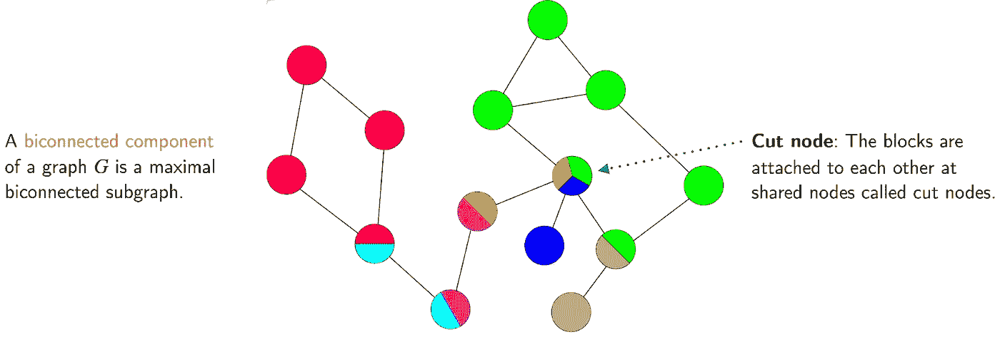
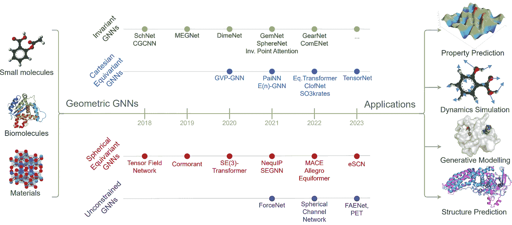

# 2024 年图形与几何机器学习：我们目前的状况与未来展望（第一部分 — 理论与架构）

> 原文：[`towardsdatascience.com/graph-geometric-ml-in-2024-where-we-are-and-whats-next-part-i-theory-architectures-3af5d38376e1?source=collection_archive---------1-----------------------#2024-01-16`](https://towardsdatascience.com/graph-geometric-ml-in-2024-where-we-are-and-whats-next-part-i-theory-architectures-3af5d38376e1?source=collection_archive---------1-----------------------#2024-01-16)

## 最前沿技术摘要

## 根据往年传统，我们采访了一批杰出且高产的学术界和工业界专家，旨在总结过去一年的亮点并预测 2024 年的发展趋势。2023 年成果丰富，我们不得不将这篇文章分为两部分。这是第一部分，重点讨论理论与新架构，另请参阅关于应用的[第二部分](https://medium.com/towards-data-science/graph-geometric-ml-in-2024-where-we-are-and-whats-next-part-ii-applications-1ed786f7bf63)。

 [Michael Galkin](https://mgalkin.medium.com/?source=post_page---byline--3af5d38376e1--------------------------------)

·发表于[Towards Data Science](https://towardsdatascience.com/?source=post_page---byline--3af5d38376e1--------------------------------) ·阅读时间：30 分钟·2024 年 1 月 16 日

--

作者提供的图片，部分来自 DALL-E 3。

*本文由* [*Michael Galkin*](https://twitter.com/michael_galkin) *和* [*Michael Bronstein*](https://twitter.com/mmbronstein) *撰写和编辑，并由* [*Johannes Brandstetter*](https://twitter.com/jo_brandstetter)*,* [*İsmail İlkan Ceylan*](https://twitter.com/ismaililkanc/)*,* [*Francesco Di Giovanni*](https://twitter.com/Francesco_dgv)*,* [*Ben Finkelshtein*](https://twitter.com/benfinkelshtein)*,* [*Kexin Huang*](https://twitter.com/KexinHuang5)*,* [*Chaitanya Joshi*](https://twitter.com/chaitjo)*,* [*Chen Lin*](https://twitter.com/WillLin1028)*,* [*Christopher Morris*](https://twitter.com/chrsmrrs)*,* [*Mathilde Papillon*](https://twitter.com/mathildepapillo)*,* [*Liudmila Prokhorenkova*](https://twitter.com/LProkhorenkova)*,* [*Bastian Rieck*](https://twitter.com/Pseudomanifold)*,* [*David Ruhe*](https://twitter.com/djjruhe)*,* [*Hannes Stärk*](https://twitter.com/HannesStaerk)* 和* [*Petar Veličković*](https://twitter.com/PetarV_93)*.*  

1.  图神经网络的理论

    1. 信息传递神经网络与图 Transformer

    2. 图组件、二连通性与平面性

    3. 聚合函数与统一表达能力

    4. GNN 的收敛性与零一法则

    5. GNN 的描述复杂度

    6. GNN 的精细化表达能力

    7. 子图 GNN 的表达能力结果

    8. 链路预测与知识图谱的表达能力

    9. 过度压缩与表达能力

    10. GNN 的泛化与外推能力

    11. 预测时间！

1.  新型与异域信息传递

1.  超越图形

    1. 拓扑

    2. 几何代数

    3. 偏微分方程

1.  鲁棒性与可解释性

1.  图 Transformer

1.  新数据集与基准测试

1.  会议、课程与社区

1.  2023 年的迷因

我们将在整个文本中使用的图例：

💡 - 本年度亮点

🏋️ - 挑战

➡️ - 当前/下一步发展

🔮- 预测/猜测

# 图神经网络的理论

*迈克尔·布朗斯坦（牛津大学）、弗朗切斯科·迪·乔瓦尼（牛津大学）、伊斯梅尔·伊尔坎·杰兰（牛津大学）、克里斯·莫里斯（亚琛工业大学）*

## **信息传递神经网络与图 Transformer**

图 Transformer 是图机器学习中一个相对较新的趋势，试图将 Transformer 在序列上的成功扩展到图形上。就传统的表达能力结果而言，这些架构并没有提供任何特别的优势。事实上，可以说，它们在表达能力方面的大多数优势（例如，见[Kreuzer 等人](https://arxiv.org/abs/2106.03893)）来自于强大的结构编码，而非架构本身，而这些编码原则上也可以与 MPNN 一起使用。

在最近的一篇论文中，[蔡等人](https://arxiv.org/abs/2301.11956)探讨了 MPNN 与（图形）Transformer 之间的联系，表明一个带有虚拟节点的 MPNN——一个以特定方式与所有其他节点连接的辅助节点——可以模拟一个（图形）Transformer。这种架构是*非统一*的，即神经网络的大小和结构可能依赖于输入图形的大小。有趣的是，一旦我们将注意力限制到线性 Transformer（例如，Performer），就会有一个*统一*的结果：存在一个使用虚拟节点的单一 MPNN，可以在任何大小的输入上逼近线性 Transformer，如 Performer。

[蔡等人](https://arxiv.org/abs/2301.11956)的图： (a) 带虚拟节点的 MPNN，(b) 一个 Transformer。

这与关于图变换器架构是否相较于 MPNN 在捕捉长程依赖方面具有优势的讨论相关。图变换器与 MPNN 进行比较，后者通过使用虚拟节点包含了一个全局计算组件，这是常见的做法。[Cai et al.](https://arxiv.org/abs/2301.11956) 实证表明，带有虚拟节点的 MPNN 能够在长程图基准（LRGB，[Dwivedi et al.](https://arxiv.org/abs/2206.08164)）上超越图变换器的表现。此外，[Tönshoff et al.](https://arxiv.org/abs/2309.00367) 在 LRGB 基准上重新评估了 MPNN 的基准，发现先前报告的图变换器性能差距被高估了，这是由于亚优的超参数选择，实质上缩小了 MPNN 和图变换器之间的差距。

[Lim et al.](https://arxiv.org/abs/2202.13013)中的图：SignNet 管道。

还广为人知，常见的拉普拉斯位置编码（例如，LapPE）对特征向量的符号和基变换不具有不变性。缺乏不变性使得获得（非均匀）普适性结果变得更容易，但这些模型因此不会计算图的不变性。这激发了今年一系列的研究，包括符号和基不变网络的研究（[Lim et al., 2023a](https://arxiv.org/abs/2202.13013)）以及符号等变网络的研究（[Lim et al., 2023b](https://arxiv.org/abs/2312.02339)）。这些发现表明，关于 MPNN 和图变换器比较的文献中常见的主张，仍需进行更多的理论研究。

## **图组件、双连通性和平面性**

最初由 Zyqqh 在[Wikipedia](https://commons.wikimedia.org/w/index.php?curid=19053091)上发布的图。

[Zhang et al. (2023a)](https://arxiv.org/abs/2301.09505)将图的双连通性研究带入了图机器学习领域。由[Zhang et al. (2023a)](https://arxiv.org/abs/2301.09505)提出的许多结果与不同的双连通性度量相关。研究表明，标准的 MPNN 无法检测图的双连通性，而许多现有的高阶模型（即能够匹配 2-FWL 能力的模型）则可以。另一方面，具有某些距离编码和子图 GNN（如 ESAN）的 Graphormers 能够检测图的双连通性。

[Dimitrov et al. (2023)](https://arxiv.org/abs/2307.01180)中的图：左侧显示了图的分解（A-C），右侧显示了相关的编码器（D-F）和更新方程（G）。

[Dimitrov 等人 (2023)](https://arxiv.org/abs/2307.01180)依赖图分解来开发专门的架构，以便在平面图上进行学习。其思路是与经典的[Hopcroft & Tarjan](https://www.sciencedirect.com/science/article/pii/0020019071900196)平面同构测试算法的变种对齐。[Dimitrov 等人 (2023)](https://arxiv.org/abs/2307.01180)首先将图分解为其双连通和三连通分量，然后学习节点、割节点、双连通分量和三连通分量的表示。这个过程通过使用可以在线性时间内计算的经典结构——块割树（Block-Cut Trees）和 SPQR 树（SPQR Trees）来实现。最终的框架被称为[PlanE](https://arxiv.org/abs/2307.01180)，包含如[BasePlanE](https://arxiv.org/abs/2307.01180)等架构。BasePlanE 计算*同构完全图不变量*，因此它能够区分任意一对平面图。该工作的主要贡献是设计了一种架构，能够高效地学习平面图的完整不变量，同时保持在实际应用中的可扩展性。值得注意的是，3-FWL 已知在平面图上是完全的（[Kiefer 等人, 2019](https://dl.acm.org/doi/10.1145/3333003)），但该算法并不可扩展。

## **聚合函数：统一表达性研究**

人们广泛认为不同的聚合函数各有其适用之处，但这并没有被严格证明。事实上，在非统一设置下，使用 MLP 的求和聚合会产生一个单射映射，因此可以涵盖其他聚合函数（[Xu 等人, 2020](https://arxiv.org/abs/1810.00826)），这一结果建立在早期的研究基础上（[Zaheer 等人, 2017](https://arxiv.org/abs/1703.06114)）。而在统一设置下，情况则不同，这要求一个固定的模型能够在*所有*图上有效工作。[Rosenbluth 等人 (2023)](https://arxiv.org/abs/2302.11603)表明，在统一设置中，求和聚合并不总是能够涵盖其他聚合方法。例如，如果我们考虑一个无限的特征域，求和聚合网络甚至无法近似均值聚合网络。有趣的是，即使是在一些正面的结果中，其中求和聚合被证明可以近似其他聚合方法，所呈现的构造通常也需要大量的层（随着近似误差的倒数增长）。

## **GNN 在随机图上的收敛性和零一法则**

GNN（图神经网络）理论上可以在训练后应用于任意大小的图。这使得对输入图的大小进行渐进分析变得非常有吸引力。此前对 GNN 渐进行为的研究，集中在它们对理论极限网络的收敛性（[Keriven 等人, 2020](https://arxiv.org/abs/2006.01868)）以及在大图扰动下的稳定性（[Levie 等人, 2021](https://arxiv.org/abs/1907.12972)）上。

在最近的一项研究中，[Adam-Day 等人 (2023)](https://arxiv.org/abs/2301.13060) 证明了二进制 GNN 分类器的*零一法则*。要解决的问题是：当我们绘制具有随机节点特征的 Erdos-Rényi 图，且图的大小逐渐增大时，二进制 GNN 分类器的表现如何？主要发现是，这些图通过一类 GNN 分类器映射到特定输出的概率最终趋向于零或一。也就是说，模型最终将*所有*图映射到零或*所有*图映射到一。这个结果适用于 GCN 以及具有求和和均值聚合的 GNN。

这一结果的主要意义在于它为 GNNs 的表达能力建立了一个新的*统一*上界：任何可以由这些 GNN 架构统一表达的图的性质必须遵守零一法则。一个简单的性质示例是拥有偶数个节点，这个性质在渐近意义上既不趋向零也不趋向一。

## **GNNs 的描述性复杂度**

[Grohe (2023)](https://arxiv.org/abs/2303.04613) 最近分析了 GNNs 在布尔电路复杂度方面的描述性复杂度。具体的电路复杂度类别是 TC0。该类别包含所有通过具有恒定深度和多项式大小的布尔电路决定的语言，这些电路仅使用 AND、OR、NOT 和阈值 （或多数）门。[Grohe (2023)](https://arxiv.org/abs/2303.04613) 证明了可以由一类多项式大小有界深度的 GNN 家族计算的图函数属于电路复杂度类别 TC0。此外，如果允许 GNN 类使用随机节点初始化和全局读取，如 [Abboud el al. (2020)](https://arxiv.org/abs/2010.01179) 中所述，则存在一个匹配的下界，即它们可以计算出恰好可以用 TC0 表达的相同函数。这为具有随机节点特征的 GNN 的能力建立了上界，要求模型类别具有有界深度（固定层数）且大小为多项式。虽然这一结果仍然是非统一的，但它改善了 [Abboud el al. (2020)](https://arxiv.org/abs/2010.01179) 的结果，在该结果中，构造可能是最坏情况下的指数级。

## **GNNs 的细粒度表达性研究**

最近的许多研究分析了 MPNNs 的表达力，主要利用组合技术，如用于图同构问题的 1-WL。然而，图同构目标本质上是二元的，无法深入了解两个给定图之间的相似度程度。[Böker et al. (2023)](https://arxiv.org/abs/2306.03698)通过推导 1-WL 和 MPNNs 的连续扩展到图论函数，解决了这个问题。具体而言，他们展示了 1-WL 的连续变体能够准确地对 MPNNs 在图论函数上的表达力进行拓扑特征化，揭示了这些网络能够区分哪些图，以及分离它们的难度级别。他们提供了一个图和图论函数相似度的理论框架，结合了 1-WL 经典特征化的各种拓扑变体。特别是，他们通过树距离来表征 MPNNs 的表达力，树距离是一种基于分数同构概念的图距离，以及通过树同态的子结构计数，表明这些概念与 1-WL 和 MPNNs 在图论函数上的表达力相同。有趣的是，他们还通过展示随机初始化的 MPNNs（未经过训练）在与经过训练的对应模型相比时具有竞争力的性能，从而验证了他们的理论发现。

## **子图 GNNs 的表达性结果**

基于子图的图神经网络（GNNs）在 2022 年已经成为一个大趋势 ([Bevilacqua et al., 2022](https://arxiv.org/abs/2110.02910), [Qian et al., 2022](https://arxiv.org/abs/2206.11168))。今年，[Zhang et al. (2023b)](https://arxiv.org/abs/2302.07090)为这种架构建立了更精细的表达力结果。论文通过所谓的子图 Weisfeiler-Leman 测试（SWL）研究了子图 GNNs。通过这一方法，他们展示了 SWL 的完整层次结构，并且表达力严格增长。具体而言，他们为 SWL 类型的算法定义了等价类，并表明几乎所有现有的子图 GNNs 都属于其中之一。此外，所谓的 SSWL 达到了最大的表达力。令人感兴趣的是，他们还将 SWL 与几个现有的表达性 GNN 架构联系了起来。例如，他们展示了 SWL 具有与 2-WL 的局部版本相同的表达力 ([Morris et al., 2020](https://arxiv.org/abs/1904.01543))。除了理论之外，他们还表明 SWL 类型的架构在实际应用中取得了良好的实证结果。

## **用于知识图谱链接预测的架构表达力**

用于知识图谱链接预测的架构，如 RGCN 和 CompGCN 的表达力已被[Barceló et al. (2022)](https://arxiv.org/abs/2211.17113)研究。今年，[Huang et al. (2023)](https://arxiv.org/abs/2302.02209)将这些结果推广到表征各种其他模型架构的表达力。

来自 [Huang et al. (2023)](https://arxiv.org/abs/2302.02209) 的图：该图比较了 R-MPNNs 和 C-MPNNs 在操作模式上的不同。

[Huang et al. (2023)](https://arxiv.org/abs/2302.02209) 提出了条件消息传递网络（[C-MPNNs](https://arxiv.org/abs/2302.02209)）的框架，其中包括如 [NBFNets](https://arxiv.org/abs/2106.06935) 这样的架构。经典的关系消息传递网络（R-MPNNs）是单一编码器（即，编码图节点），并依赖于二元解码器进行链路预测任务（[Zhang, 2021](https://arxiv.org/abs/2010.16103)）。另一方面，C-MPNNs 作为二元编码器（即，编码图节点对），因此更适合于链路预测的二元任务。C-MPNNs 被证明与关系 Weisfeiler-Leman 算法对齐，可以看作是 2WL 的局部近似。这些发现解释了 NBFNets 等在性能上优于，例如，RGCNs。[Huang et al. (2023)](https://arxiv.org/abs/2302.02209) 还展示了 C-MPNNs 捕捉的二元函数类的精确逻辑特征，从而得出了统一的表达能力结果。

## **过度压缩与表达能力**

Over-squashing 是 [Alon & Yahav](https://arxiv.org/abs/2006.05205) 在 2021 年首次描述的一种现象，指的是指数增长的感受野被压缩为固定大小的向量。后续研究（[Topping et al., 2022](https://arxiv.org/abs/2111.14522), [Di Giovanni et al., 2023](https://arxiv.org/abs/2302.02941), [Black et al., 2023](https://arxiv.org/abs/2302.06835), [Nguyen et al., 2023](https://arxiv.org/abs/2211.15779)）通过灵敏度分析对过度压缩进行了表征，证明了输出特征对早期层的隐藏表示的依赖性会因拓扑性质（如负曲率或长时间通勤）而受到影响。由于图的拓扑在瓶颈形成中起着关键作用，*图重连线*（graph rewiring）作为一种范式转变，提升了图连接性在 GNN 设计中的作用，被提出作为缓解过度压缩的关键策略（如果你感兴趣，参见下面关于**异构消息传递**的部分）。

对于给定的图，MPNN 为节点（v，u）和（u，w）学习到更强的混合（紧弹簧），因为它们的通勤时间较短，而节点（u，q）和（u，z）由于较长的通勤时间，具有较弱的混合（松弛弹簧）。来源：[Di Giovanni et al., 2023](https://arxiv.org/abs/2306.03589)

过度挤压是限制表达能力的障碍，因为它导致 GNNs 在处理具有长程交互的任务时表现不佳。为了正式研究这一问题，[Di Giovanni 等人，2023](https://arxiv.org/abs/2306.03589)提出了一种新的表达能力度量，称为“混合”，它编码了图函数对节点特征对的联合和非线性依赖关系：为了使 GNN 能够近似具有较大混合的函数，必要的条件是允许相关节点之间进行“强”的信息交换。因此，他们假设通过 GNN 预测的混合来衡量过度挤压，并证明了 GNN 需要的深度来引入足够的混合，*如任务所需*，随着通勤时间的增长——通常比最短路径距离要差得多。结果显示，过度挤压如何妨碍具有“实际”大小的 GNN 的表达能力，并验证了它源于任务（要求节点 i 和 j 之间的强混合）与拓扑（导致 i 和 j 之间的长通勤时间）之间的不匹配。

函数的“混合”涉及节点之间信息的交换，无论这些信息是什么，而不是其分离节点表示的能力。事实上，这些结果  同样适用于比 1-WL 测试更强大的 GNNs。[Di Giovanni 等人（2023）](https://arxiv.org/abs/2306.03589)的分析提供了一种替代方法来研究 GNNs 的表达能力，该方法可以轻松扩展到 3D 空间中的等变 GNNs 以及它们建模节点之间交互的能力。

## **GNN 的泛化和外推能力**

近年来，MPNNs（消息传递神经网络）的表达能力因其与 WL 测试的关联而引起了广泛关注。尽管这种关联促成了在理解和提升 MPNNs 表达能力方面的显著进展（[Morris 等，2023a](https://arxiv.org/abs/2301.11039)），但它并未提供关于其泛化性能的见解，即它们在训练集之外进行有意义预测的能力。令人惊讶的是，只有少数几项重要的研究探讨了 MPNNs 的泛化行为，例如，[Garg 等（2020）](https://arxiv.org/abs/2002.06157)，[Kriege 等（2018）](https://www.ijcai.org/proceedings/2018/0325.pdf)，[Liao 等（2021）](https://arxiv.org/abs/2012.07690)，[Maskey 等（2022）](https://arxiv.org/abs/2202.00645)，[Scarselli 等（2018）](https://pubmed.ncbi.nlm.nih.gov/30219742/)。然而，这些方法仅使用经典的图参数来表示 MPNNs 的泛化能力，例如最大度数、顶点数或边数，这些方法无法完全捕捉现实世界图的复杂结构。此外，大多数方法在非均匀区域研究泛化，即假设 MPNNs 在预定阶数的图上进行操作。

来自[Morris 等人(2023b)](https://arxiv.org/abs/2301.11039)的图：MPNNs 的泛化能力概览及其与 1-WL 的联系。

因此，[莫里斯等人 (2023b)](https://arxiv.org/abs/2301.11039)展示了 1-WL 的表达能力与泛化性能之间的紧密联系。他们通过紧密连接 1-WL 的表达能力和 MPNNs 的 Vapnik–Chervonenkis (VC)维度，研究了图结构和参数编码长度对 MPNNs 泛化能力的影响。为此，他们展示了几个结果。

1️⃣ 首先，在非均匀状态下，他们展示了 MPNNs 的 VC 维度与 1-WL 在一组图上计算出的等价类数量紧密相关。此外，他们的结果可以轻松推广到 k-WL 和许多最近的表达性 MPNN 扩展。

2️⃣ 在均匀状态下，即当图可以具有任意顺序时，他们展示了 MPNNs 的 VC 维度受其权重的最大比特长度的上下界限制。在均匀和非均匀状态下，MPNNs 的 VC 维度对 1-WL 计算的颜色数呈对数关系，并且对参数的数量呈多项式关系。此外，他们还通过实证研究表明，他们的理论发现一定程度上在实践中成立。

## 🔮 预测时间！

***克里斯托弗·莫里斯 (亚琛工业大学)***

> “我相信，GNNs 泛化理论亟需更好且更实用的理论。” — **克里斯托弗·莫里斯** (亚琛工业大学)

➡️ 例如，我们需要理解图结构和各种架构参数如何影响泛化。此外，当前对于训练 GNNs 的 SGD 动态研究较少，理解也不够透彻，更多的研究将会探讨这一问题。

***伊斯梅尔·伊尔坎·杰兰 (牛津大学)***

> “我希望在均匀设置下看到更多的表达能力研究，在这种情况下我们固定神经网络的参数并检查其能力。” — **伊斯梅尔·伊尔坎·杰兰** (牛津大学)

➡️ 在这种情况下，我们可以识别出更好的泛化联系，因为如果某个属性无法均匀表达，那么模型就无法对更大的图大小进行泛化。

➡️ 今年，我们也可能会看到针对图回归或图生成的表达能力研究，这些领域仍然未被充分探索。人们有充分的理由期望出现在更大的图类别上具有同构完备性的学习算法，从而严格地推广平面图的结果。

➡️ 现在也是时候为学习完全关联数据（即知识超图）发展一套理论了，这将解锁关系数据库中的应用！

***弗朗切斯科·迪·乔瓦尼 (牛津大学)***

在 GNNs 的未来理论发展方面，我看到两个值得关注的方向。

> “我们对 GNN 在梯度流（或 SGD）下的权重动态几乎没有理解；评估图拓扑对权重演变的影响是解决泛化和任务难度问题的关键。” — 弗朗切斯科·迪·乔瓦尼（牛津大学）

➡️ 其次，我认为发展表现力的替代范式会很有价值，这些范式更直接地关注近似能力（图函数及其导数的近似能力），并精确地识别出哪些任务难以学习。后一方向在表征三维空间中等变 GNN 的能力时可能特别有意义，在这种情况下，表现力的度量可能需要与二维情况解耦，以便更好地与来自科学领域的任务对接。

结尾：关于 WL 在 2023 年去向的一个有趣事实

人物肖像：伊戈尔·戈尔斯基

## **2023 年预测**

(1) 在创建时间和内存高效的子图 GNN 方面投入更多努力

❌ 并不完全是

(2) 更好地理解 GNN 的泛化能力

✅ 是的，见关于过度压缩和泛化的子章节

(3) 费斯费尔和利曼访问了 10 个新地方！

❌（到目前为止，4 篇）[语法问题](https://openreview.net/forum?id=eZneJ55mRO)，[无所谓](https://arxiv.org/abs/2311.01205)，[测量建模](https://arxiv.org/abs/2307.05775)，[路径](https://arxiv.org/abs/2308.06838)

# 新颖且独特的消息传递

*本·芬克尔施坦（牛津大学），弗朗切斯科·迪·乔瓦尼（牛津大学），佩塔尔·维利奇科维奇（谷歌 DeepMind）*

***佩塔尔·维利奇科维奇（谷歌 DeepMind）***

多年来，关于消息传递算子的开发已经饱和，这已经成为一种常见的民间传说。我认为 2023 年取得的进展特别令人兴奋，因为来自几个独立研究小组（包括我们自己）的成果表明，一个统一的全新方向已经出现：让我们开始考虑***时间***在 GNN 中的影响 ⏳。

> “我预测，在 2024 年，时间将在新型 GNN 架构的发展中扮演核心角色。” — 佩塔尔·维利奇科维奇（谷歌 DeepMind）

💡 在 GNN 设计中，时间已经在显式提供的输入中得到了利用（如时空图或完全动态图）。今年，它开始出现在关于*静态*图输入的 GNN 操作符研究中。一些研究开始不再假设一个统一的、同步的时钟 ⏱️，该时钟迫使所有信息在同一层中同时发送和接收。

1️⃣ 第一篇此类工作，[GwAC](https://openreview.net/forum?id=zffXH0sEJP) 🥑，仅仅玩弄了基础的随机化消息调度，但提供了**证明**，说明为什么这种处理方式可能在表达能力上带来显著提升。[Co-GNNs](https://arxiv.org/abs/2310.01267) 🤝 进一步推动了这一进程，展示了一种更加精细调整的消息调度机制，它以节点为中心，允许每个节点选择何时发送 📨 或接收 📬 消息。Co-GNNs 还提供了一种通过梯度下降训练这种调度器的实用方法。虽然开发这种异步 GNN 模型是非常期望的，但我们也必须承认与之相关的可扩展性问题——我们当前的前沿硬件并不设计为能够高效扩展此类顺序系统。

2️⃣ 在我们关于[异步算法对齐](https://openreview.net/forum?id=ba4bbZ4KoF)的研究中，我们选择设计一个*同步* GNN，但**限制**其消息传递、聚合和更新函数，使得即使其数据流的部分变为异步，GNN 也能产生相同的嵌入。这带领我们进入了一个激动人心的旅程，涉及到单群、1-余切和范畴理论，最终得出了一个可扩展的 GNN 模型，在许多 CLRS-30 任务上表现出色。

一个异步 GNN 的可能执行轨迹。传统的 GNN 同步发送和接收所有消息，而在我们的框架下，在任何步骤，GNN 可以选择执行任意数量的可能操作（这里通过图的右侧集合来表示）。来源：[Dudzik et al.](https://openreview.net/forum?id=ba4bbZ4KoF)

➡️ 最后，值得注意的是，对于某些特定的消息调度选择，我们不需要修改同步 GNN 的架构——而可以转而使用动态图重连接。[DREW](https://arxiv.org/abs/2305.08018) 和[Half-Hop](https://openreview.net/forum?id=lXczFIwQkv)是两篇在 ICML'23 上同时发表的论文，它们体现了使用图重连接来*减缓*消息传递🐌的原理。在 DREW 中，每个节点的消息实际上会发送到每一个其他节点，但需要*k*层才能到达一个与其相隔*k*跳的邻居！而 Half-Hop 则采取更宽松的方式，随机决定是否引入一个“慢节点”，从而延长任何通过边连接的两个节点之间的路径。两种方法都能自然缓解过平滑问题，因为消息传递的距离越远，过平滑的程度越小。

无论是用于消息传递设计、GNN 数据流还是图重连接，到了 2023 年，我们才刚刚开始理解*时间*的重要性——即便时间变化在我们的数据集中并未显式存在。

***Ben Finkelshtein (牛津大学)***

在[Co-GNNs](https://arxiv.org/abs/2310.01267)中提出的基于时间的消息传递范式是一种可学习的消息传递泛化方式，它允许每个节点决定如何从其邻居传递信息或向其邻居传播信息，从而实现信息流动的更大灵活性。这些节点被视为可以进行以下操作的参与者：向监听的邻居广播*并且*监听广播的邻居（类似于经典的消息传递），仅向监听的邻居广播，或者隔离（既不监听也不广播）。

这些操作之间的相互作用以及局部和动态地改变它们的能力使 CoGNN 能够确定一个**任务特定**的计算图（可以视为一种**动态**和**定向重连接**的形式），为具有不同节点特征的两个节点学习不同的操作分布（包括**特征**和**结构**基础的）。CoGNN 还允许节点之间进行**异步**更新，并且以较高的概率生成唯一的节点标识符，从而使它们能够区分任何一对图（**比 1-WL 更具表现力**，但仅在期望下保持等变性）。

从左到右：经典的 MPNN（所有节点都广播和监听）、DeepSets（所有节点都隔离）以及通用的 CoGNN。图源自博客文章。

查看 Medium 文章了解更多详情：

 ## 协作图神经网络

### 一种新的消息传递范式，其中每个节点可以选择“监听”、“广播”、“监听并广播”或...

[towardsdatascience.com

***Francesco Di Giovanni（牛津大学）***

> “过度压缩（over-squashing）的理解，尤其是当任务依赖于节点间长时间交互时，成为了图重连接作为一种有效方法的催化剂，用以设计新的 GNN。” — **Francesco Di Giovanni**（牛津大学）

️💡 *图结构重连接*广义上指的是改变输入图的连接方式，以促进下游任务的解决。最近，这通常聚焦于图中的瓶颈，从而添加（或移除）边缘，以改善信息流动。虽然重点通常放在**信息交换的地点**，但最近的研究（如上所述）也揭示了**何时**进行信息交换的重要性。这些方法背后的一个逻辑，尽管通常是隐含的，就是 GNN 各层构建的隐藏表示为图提供了一个（人为的）*动态*组件，即便图和输入特征是静态的。这个视角可以通过多种方式进行利用。

在经典的 MPNN 设置中，在每一层，信息仅在节点及其直接邻居之间传播。在 DRew 中，图会随着层数的变化而变化，新添加的边从第 *r* 层起连接距离 *r* 的节点。最后，在νDRew 中，我们还引入了一个延迟机制，相当于基于节点之间的相互距离的跳跃连接。来源：[Gutteridge 等人](https://arxiv.org/abs/2305.08018)

➡️ 一个特别采纳这一角度的框架是[**DRew**](https://arxiv.org/abs/2305.08018)，它通过两种方式扩展了任何消息传递模型：（i）它直接连接距离 *r* 的节点，但仅从第 *r* 层开始；（ii）当节点连接时，基于它们之间的相互距离，应用延迟到它们的消息交换。如上图所示，（i）使网络更好地保留归纳偏差，因为较近的节点会*更早*互动；（ii）则充当*距离感知的* *跳跃连接*，从而有助于损失函数的梯度传播。很可能正是由于这个原因，而不是防止过度平滑（对图级任务几乎没有影响），该框架显著增强了标准 GNN 在更大深度下的表现（更多细节可以参考这篇博客文章）。

**🔮 预测：** 我相信，扩展消息传递到“时间”维度的深远影响将在来年开始显现。像 DRew 这样的工作仅仅触及了时间上重连（超越空间）的原因，它可能有助于 GNN 训练，显著影响它们在不同深度层次下的准确性响应。

➡️ 更广泛地说，我希望图重连的理论和实践发展能够被应用到科学领域，其中等变图神经网络（GNNs）通常应用于三维问题，这些问题要么没有自然的图结构（使得“在哪里”交换消息变得更加相关），要么（且）展现出自然的时间（多尺度）特性（使得“何时”交换消息可能是减少内存限制并保持正确归纳偏差的关键）。

# 几何学、拓扑学、几何代数与偏微分方程

*Johannes Brandstetter（JKU Linz），Michael Galkin（Intel），Mathilde Papillon（UC Santa Barbara），Bastian Rieck（Helmholtz & TUM），David Ruhe（U Amsterdam）*

2023 年带来了最全面的几何图神经网络（Geometric GNNs）介绍（及综述），涵盖了最基础和必要的概念，并提供了一些示例：《**三维原子系统的几何图神经网络指南**》([Duval, Mathis, Joshi, Schmidt 等](https://arxiv.org/abs/2312.07511))。如果你曾经想从零开始学习驱动最近蛋白质设计、材料发现、分子模拟等突破的图机器学习核心架构——这正是你需要的！

3D 原子系统的关键几何 GNN 时间线，按层内中间表示的类型进行分类。来源：[Duval, Mathis, Joshi, Schmidt 等人](https://arxiv.org/abs/2312.07511)

## **拓扑**

💡 得益于[PyT 团队](https://github.com/pyt-team)的卓越努力和他们的一系列资源，2023 年研究人员和实践者在处理拓扑结构时变得更加容易：**TopoNetX**、**TopoModelX** 和 **TopoEmbedX**。[TopoNetX](https://github.com/pyt-team/TopoNetX)基本上是拓扑数据的 networkx。TopoNetX 支持标准结构，如细胞复形、单纯形复形和组合复形。[TopoModelX](https://github.com/pyt-team/TopoModelX)是一个类似 PyG 的库，用于拓扑数据上的深度学习，并实现了著名的模型如[MPSN](https://arxiv.org/abs/2103.03212)和[CIN](https://arxiv.org/abs/2106.12575)，并提供了一个简洁统一的接口（原始的 PyG 实现比较复杂）。[TopoEmbedX](https://github.com/pyt-team/TopoEmbedX)有助于在拓扑数据上训练嵌入模型，并支持像[Cell2Vec](https://arxiv.org/abs/2010.00743)这样的核心算法。

领域：蓝色节点，粉色（超）边，深红色面。来源：[TopoNetX](https://github.com/pyt-team/TopoNetX)，[Papillon 等人](https://arxiv.org/abs/2304.10031)

💡 该领域的一个重要起步和基本构建块是[Hajij 等人](https://arxiv.org/abs/2206.00606)和[Papillon 等人](https://arxiv.org/abs/2304.10031)的论文。一个显著的模型部分是由[数据科学中的拓扑、代数与几何](https://www.tagds.com/home)（TAG）社区的成员实现的，该社区定期在机器学习会议上组织拓扑学研讨会。

***Mathilde Papillon (UCSB)***

> “直到 2023 年，拓扑深度学习领域仍然呈现出一个支离破碎的关系数据增强表示的格局。” —— Mathilde Papillon（加州大学圣塔芭芭拉分校）

➡️ 消息传递模型仅基于相同领域的其他模型进行构建和基准测试，例如，单纯形复形社区与超图社区之间一直是封闭的。更糟糕的是，大多数模型采用了独特的数学符号。这使得选择最适合特定应用的模型变得像一项艰巨的任务。[Hajij 等人](https://arxiv.org/abs/2206.00606)提出的统一理论提供了一个通用框架，在这个框架下，所有模型都可以被系统地描述和分类。我们将该理论应用于文献中，制作了一份全面而简明的[拓扑深度学习中消息传递的调查](https://arxiv.org/abs/2304.10031)，这也是该领域的易于理解的入门介绍。此外，我们还提供了一个[字典，列出了所有模型架构](https://github.com/awesome-tnns/awesome-tnns)，并采用统一的符号表示。

➡️ 为了进一步统一这一领域，我们组织了第一次[拓扑深度学习挑战赛](https://pyt-team.github.io/topomodelx/challenge/index.html)，该活动在[2023 ICML TAG 研讨会](https://www.tagds.com/events/conference-workshops/tag-ml23)上举办，并通过[Papillon 等人](https://proceedings.mlr.press/v221/papillon23a.html)的白皮书进行了记录。我们的目标是通过众包的方式促进可重复研究，尤其是推动基于拓扑领域的神经网络开源实现。作为挑战的一部分，来自世界各地的参与者贡献了在[TopoModelX](https://github.com/pyt-team/TopoModelX)中实现的现有拓扑深度学习模型。每个提交都经过严格的单元测试，并包括在[TopoNetX](https://github.com/pyt-team/TopoNetX)加载的数据集上的基准训练。我们希望，这一套始终如一地实现的模型能够帮助从业者在 2024 年测试拓扑方法在新应用和开发中的表现。

***Bastian Rieck（赫尔姆霍兹研究所 & 慕尼黑工业大学）***

2023 年对于拓扑驱动的机器学习方法来说是激动人心的一年。一方面，我们看到了更多与几何概念（如曲率）相结合的应用，展示了几何-拓扑混合模型的多样性。例如，在[《用于图生成模型评估的曲率过滤》](https://arxiv.org/abs/2301.12906)中，我们展示了如何使用曲率来选择合适的图生成模型。在这里，曲率作为一种“透镜”，用来提取图结构信息，而我们则使用持续同调（一种拓扑方法）以一致的方式比较这些信息。

通过离散曲率评估图生成模型的管道概述。边的排序会产生一个曲率过滤，接着是相应的持久性图和地形图。对于图生成模型，我们选择一个曲率，逐元素应用这个框架，并通过比较生成分布和参考分布的平均地形图来评估它们的相似性。来源：[Southern, Wayland, Bronstein, 和 Rieck.](https://arxiv.org/abs/2301.12906)

➡️ 另一个方向强调拓扑驱动方法正成为图学习研究的主流，利用拓扑来评估图神经网络模型的表达能力。有时，正如 2023 年 NeurIPS 上[Immonen 等人](https://openreview.net/pdf?id=27TdrEvqLD)的一个非常有趣的工作所展示的那样，这甚至会导致新的模型，它们同时利用图的几何和拓扑特性！我的研究也旨在通过专门分析[持久同调在图学习中的表达能力](https://arxiv.org/abs/2302.09826)为这一领域做出贡献。

> “2023 年也正是一个转折点，标志着我们即将摆脱——或者说超越——持久同调。尽管持久同调被公认为拓扑驱动的机器学习范式算法，但代数拓扑和微分拓扑提供了更为丰富的结构，可以用来分析数据。”——巴斯蒂安·里克（Helmholtz & TUM）

➡️ 与我的优秀合作伙伴们，我们最近开始探索一些替代方法，并提出了[神经微分形式](https://arxiv.org/abs/2312.08515)的概念。微分形式允许我们通过[德拉姆同调](https://en.wikipedia.org/wiki/De_Rham_cohomology)优雅地建立几何和拓扑之间的桥梁——德拉姆同调是将某些对象（微分形式）的积分——即一种本质上*几何*的操作——与输入数据的拓扑特征联系起来的方法。通过一些额外的构造，德拉姆同调使我们能够学习图（或更高阶的组合复形）的几何描述，并在不依赖信息传递的情况下解决学习任务。其结果是参数更少的模型，可能在解决这些任务时更加高效。这里还有更多内容，毕竟我们才刚刚开始探索！

🔮 我对 2024 年的希望预测是，我们将：

1️⃣ 看到更多来自代数和微分拓扑的多样化工具应用于图和组合复形，

2️⃣ 更好地理解高阶输入数据上的信息传递，并且

3️⃣ 最终获得更好的并行算法，用于持久同调，真正释放其在深度学习中的潜力。[Torras-Casas 最近关于谱序列的论文](https://link.springer.com/article/10.1007/s00454-023-00549-2)报告了一些非常令人兴奋的结果，展示了该技术的巨大前景。

## **几何代数**

*约翰内斯·布兰德斯特特（JKU Linz）和大卫·鲁赫（U Amsterdam）*

> “在 2023 年，我们见证了几何代数（也叫**Clifford 代数**）深度学习子领域的蓬勃发展。之前，神经网络层通过 Clifford 代数*多向量*的运算形式被提出，由[Brandstetter et al.](https://arxiv.org/abs/2209.04934)介绍。今年，‘几何’这一概念在‘几何代数’中得到了明确的应用。”——Johannes Brandstetter（JKU Linz）和 David Ruhe（U Amsterdam）

➡️ 首先，[Ruhe et al.](https://arxiv.org/abs/2302.06594)通过引入**几何 Clifford 代数网络（GCAN）**，应用了现代（基于平面的）几何代数的精髓，这些神经网络模板模拟由各种几何代数描述的对称变换。我们看到由[Pepe et al.](https://openaccess.thecvf.com/content/WACV2024/papers/Pepe_CGAPoseNetGCAN_A_Geometric_Clifford_Algebra_Network_for_Geometry-Aware_Camera_Pose_WACV_2024_paper.pdf)在**CGAPoseNet**中应用这一方法，构建了一个几何感知的相机姿态回归管道。接下来，[Ruhe et al.](https://arxiv.org/abs/2305.11141)引入了**Clifford 群等变神经网络（CGENN）**，通过 Clifford 群构建可调的 O(n)-和 E(n)-等变（图）神经网络，适用于任意维度。[Pepe et al.](https://openreview.net/forum?id=JNfpsiGS5E)将 CGENNs 应用于蛋白质结构预测（PSP）管道，将预测精度提高了最多 2.1%。

CGENNs（用ϕ表示）能够以 O(n)-或 E(n)-等变方式作用于多向量（Clifford 代数的元素）。具体来说，当 Clifford 群的作用ρ(w)，代表像旋转这样的正交变换，作用于数据时，模型的表示会进行共同旋转。多向量可以分解为标量、向量、双向量、三向量甚至更高阶的分量。这些元素可以表示几何量，如（定向的）面积或体积。作用ρ(w)的设计是为了在作用于这些结构时保持这些结构的完整性。来源：[Ruhe et al.](https://arxiv.org/abs/2305.11141)

➡️ 恰巧，[Brehmer et al.](https://arxiv.org/abs/2305.18415)提出了**几何代数变换器（GATr）**，一种可扩展的 Transformer 架构，利用投影几何代数提供的表示优势和 Transformer 的可扩展性，构建 E(3)-等变架构。GATr 架构由[Haan et al.](https://arxiv.org/abs/2311.04744)扩展到其他代数，并且还探讨了哪种几何代数最适合您的 E(3)-等变机器学习问题。

GATr 架构概述。带实线的框表示可学习组件，带虚线的框表示固定组件。来源：[Brehmer et al.](https://arxiv.org/abs/2305.18415)

🔮 在 2024 年，我们可以期待这些进展带来令人兴奋的新应用。一些例子包括以下内容。

1️⃣ 我们可以期待探索其在分子数据、药物设计、神经物理仿真、晶体等领域的应用。其他几何感知的应用包括 3D 渲染、姿态估计，以及例如机器人手臂的规划。

2️⃣ 我们可以期待将基于几何代数的网络扩展到其他神经网络架构中，如卷积神经网络。

3️⃣ 接下来，CGENN 的通用性使得可以在其他维度中进行探索，例如 2D，但也可以在需要处理多维数据的环境中进行探索。此外，它们还支持非欧几里得几何，这在相对论物理学中有多个应用场景。

4️⃣ 最后，GATr 和 CGENN 可以扩展并应用于投影几何、保角几何、双曲几何或椭圆几何。

## **偏微分方程（PDEs）**

*Johannes Brandstetter（JKU Linz）*

关于神经偏微分方程建模的现状，哪些话题在 2023 年有所浮现或获得了更多关注？

1️⃣ 首先，有一个明显的趋势是，开始在复杂几何上以及几何内部建模 PDEs，这需要基于网格的空间离散化。这与解决越来越逼真的现实世界问题的总体目标相一致。例如，[Li et al](https://arxiv.org/abs/2309.00583)提出了用于大规模 3D PDE 的**几何感知神经算子（GINO）**。

2️⃣ 其次，基于拉格朗日模拟的神经网络代理的发展变得越来越引人注目。拉格朗日空间离散化使用有限的物质点，这些物质点作为流体团块在时空中进行追踪。最著名的拉格朗日离散化方案是平滑粒子流体动力学（SPH），这是由[Toshev et al.](https://arxiv.org/abs/2309.16342)提供的**LagrangeBench**基准数据集中使用的数值基线。

我们数据集的时间快照，在初始时刻（顶部）、40%（中部）和 95%（底部）的轨迹上。颜色温度表示速度大小。 (a) 泰勒-格林涡旋（2D 和 3D），(b) 反向泊松流（2D 和 3D），(c) 驱动腔体（2D 和 3D），(d) 水坝溃坝（2D）。来源：LagrangeBench，由[Toshev et al.](https://arxiv.org/abs/2309.16342)提供

3️⃣ 其次，基于扩散的建模在偏微分方程（PDE）领域也没有停下脚步。我们大致看到两个方向。第一个方向将扩散过程的迭代性质转化为对从噪声初始化并根据前一步骤进行条件化的候选状态的精炼。这种迭代精炼在**PDE-Refiner**（[Lippe 等人](https://arxiv.org/abs/2308.05732)）中有所介绍，而其变体已经在**GenCast**（[Price 等人](https://arxiv.org/abs/2312.15796)）中得到应用。第二个方向利用扩散模型的概率性质来模拟诸如三维湍流等混沌现象。关于这一点的例子可以在**湍流流动仿真**（[Kohl 等人](https://arxiv.org/abs/2309.01745)）和**从零到湍流**（[Lienen 等人](https://arxiv.org/abs/2306.01776)）中找到。特别是对于三维湍流，未来有很多有趣的事情将会发生。

> “天气建模在过去几个月取得了巨大成功。未来可能会有更多令人激动的进展，特别是在直接从观测数据进行天气预报或构建天气基础模型方面。” — Johannes Brandstetter（JKU Linz）

🔮 **2024 年的预测**：

1️⃣ 更多关于三维湍流建模的研究。

2️⃣ 偏微分方程的多模态方面可能会出现。这可能包括结合不同的偏微分方程、不同的分辨率或不同的离散化方案。我们已经在例如[多物理预训练物理代理模型](https://arxiv.org/abs/2310.02994)中看到了一些相关的迹象，这是 McCabe 等人的研究。

**2023 年预测**

(1) 神经网络偏微分方程及其应用可能会扩展到更多与物理相关的 AI4Science 子领域；计算流体力学（CFD）可能会受到图神经网络（GNN）的影响。

✅ 我们已经看到了三维湍流建模、几何感知神经算子、基于粒子的神经代理模型，并且在例如天气预报等领域产生了巨大影响。

(2) 基于图神经网络的代理模型可能会增强或取代传统的成熟技术。

✅ 天气预报已经成为一个巨大的成功案例。基于神经网络的天气预报超过了传统的预报（中期+局部预报），例如，[GraphCast](https://www.science.org/doi/full/10.1126/science.adi2336)（Lam 等人）和[MetNet-3](https://arxiv.org/abs/2306.06079)（Andrychowicz 等人）。

# 稳健性和可解释性

*黄克欣（斯坦福大学）*

> “随着图神经网络（GNN）在各个领域的部署，其可靠性和稳健性变得越来越重要，尤其是在安全关键的应用中（例如科学发现），因为错误的代价可能非常高。” — 黄克欣（斯坦福大学）

1️⃣ 在讨论图神经网络（GNN）的可靠性时，一个关键标准是**不确定性量化**——量化模型对预测的了解程度。关于估计和校准不确定性的研究很多，其中也有专门针对 GNN 的工作（例如，[GATS](https://proceedings.neurips.cc/paper_files/paper/2022/hash/5975754c7650dfee0682e06e1fec0522-Abstract-Conference.html)）。然而，这些方法在理论和实证上都未能达到预定义的目标覆盖率（即预测集内的点数百分比）。我想强调的是，拥有覆盖保证这一概念**至关重要**，尤其是在科学发现的机器学习部署中，因为实践者通常信任具有统计保证的模型。

**2️⃣ 符合性预测**是统计学中的一个令人兴奋的方向，它具有有限样本覆盖保证，且已应用于许多领域，如[视觉和自然语言处理](https://arxiv.org/abs/2107.07511)。但尚不清楚它是否可以在图中理论上应用，因为在图的设置下，可交换性假设是否成立并不显而易见。2023 年，我们看到符合性预测已扩展到图结构数据。特别是，[CF-GNN](https://arxiv.org/abs/2305.14535)和[DAPS](https://proceedings.mlr.press/v202/h-zargarbashi23a/h-zargarbashi23a.pdf)已推导出传导节点级预测设置中符合性有效性的理论条件，并且还开发了减少预测集大小的方法，以便高效地进行下游使用。最近，我们还看到符合性预测扩展到[链接预测](https://arxiv.org/pdf/2306.14693v1.pdf)、[非均匀划分](https://arxiv.org/abs/2306.07252)、[边可交换性](https://openreview.net/forum?id=homn1jOKI5)，以及针对不满足可交换性的设置（如[归纳设置](https://arxiv.org/abs/2211.14555)）的适应。

针对图结构数据的符合性预测。 (1) 一个基础的 GNN 模型（GNN），它为节点 i 生成预测得分µ。 (2) 符合性校正。由于训练步骤并不考虑符合性校正步骤，因此预测集/区间的大小/长度（即效率）没有得到优化。我们使用一个拓扑感知的校正模型，将µ作为输入节点特征，并汇聚其局部子图的信息，以生成更新后的预测µ˜。 (3) 符合性预测。我们证明，在一个传导随机划分的设置下，给定置换不变性，图的可交换性是成立的。因此，标准的符合性预测（CP）可以基于µ˜生成预测集/区间，且该预测集包含具有预设覆盖率 1-α的真实标签。来源：[黄等](https://arxiv.org/abs/2305.14535)

🔮 展望未来，我们预计会有更多扩展，覆盖更广泛的 GNN 部署用例。总体而言，我认为为 GNN 提供统计保证非常好，因为它使得实践者能够信任 GNN 的预测结果。

# 图神经网络变换器（Graph Transformers）

*陈琳（牛津大学）*

💡 2023 年，我们见证了图神经网络变换器的持续崛起。它已经成为**常见的 GNN 设计**，例如在[GATr](https://arxiv.org/abs/2305.18415)中，作者将其流行归因于其*“良好的扩展性、表达能力、可训练性和多功能性”*。

1️⃣ **GT 的表达能力。**正如在 GNN 理论部分提到的，最近[Cai 等人（2023）](https://arxiv.org/abs/2301.11956)的工作显示，带有虚拟节点的 MPNN 和 GT 在*非均匀设置*下是等价的。这提出了一个问题：GT 到底有多强大，它们的表达能力来源于哪里？[Zhang 等人（2023）](https://arxiv.org/abs/2301.09505)成功地将一种新的强大位置嵌入（PE）结合起来，以提高 GT 的表达能力，在双连通性问题上取得了更好的表现。这为 PE 对 GT 表达能力的重要性提供了证据。最近的提交[GPNN](https://openreview.net/pdf?id=JfjduOxrTY)更清楚地展示了位置编码在其中的核心作用。已经证明，人们可以推广[Zhang 等人（2023）](https://arxiv.org/abs/2301.09505)中的证明，展示 GT 的表达能力是如何由各种位置编码决定的。

**2️⃣** **位置（结构）编码。**鉴于 PE/SE 对图神经网络（GTs）的重要性，接下来我们将讨论那些通常来源于现有图不变量的富有表现力的特征的设计。2022 年，[GraphGPS](https://arxiv.org/abs/2205.12454)通过将 GT 与各种（甚至多个）PE/SE 结合，取得了巨大的实证成功。到 2023 年，出现了更强大的 PE/SE。

**相对随机游走结构编码（RRWP）**由[Ma 等人](https://arxiv.org/abs/2305.17589)提出，通过引入关系部分扩展了随机游走结构编码。结合一种新的注意力机制变体，**GRIT**在属性预测基准测试中相比现有的 PE/SE 表现出了强大的实证性能（在 ZINC 上达到了 SOTA）。理论上，RRWP 可以通过特定的参数选择来逼近最短路径距离、个性化的 PageRank 和热核。使用 RRWP 后，GRIT 比 SPD-WL 具有更强的表达能力。

fluorescein 分子的 RRWP 可视化，最高到 4 次方。较粗且较深的边表示更高的边权重。较长的随机游走的概率揭示了高阶结构（例如，在 3-RW 中显现的团和在 4-RW 中出现的星型图案）。来源：[Ma 等人](https://arxiv.org/abs/2305.17589)。

[Puny 等人](https://arxiv.org/abs/2302.11556)提出了一种基于**等变多项式**的新表达力理论框架，通过在等变基上计算张量收缩得到的多项式特征作为位置编码，可以提高常见 GNN 的表达力。实验结果令人惊讶：GatedGCNs 的测试 MAE 从 0.265 提高到 0.106，采用了 d-表达多项式。未来有人将这一方法与 GT 结合将会非常有趣。

**3️⃣ 高效的 GTs。** 由于 GT 的 O(N²)复杂度，GT 在大图上的应用依然充满挑战。在 2023 年，我们看到了更多尝试通过降低 GT 计算复杂度来解决这一问题的研究。[Deac 等人](https://arxiv.org/abs/2210.02997)使用了[扩展图](https://en.wikipedia.org/wiki/Expander_graph)进行传播，该图通常用较少的边进行连接。[Exphormer](https://arxiv.org/abs/2303.06147)将这一思想扩展到 GT，通过将扩展图与局部邻域聚合和虚拟节点结合起来。Exphormer 使图转换器能够扩展到更大的图（例如，具有 169K 节点的*ogbn-arxiv*）。它还取得了强大的实验结果，并在多个[长距离图基准测试](https://github.com/vijaydwivedi75/lrgb)任务中排名靠前。

🔮 **迈向 2024 年：**

1.  更好地理解自注意力在抽象层面上对表现力之外的好处。

1.  2024 年，开源大规模预训练的等变 GT！

1.  更强大的位置编码。

# 新的数据集与基准测试

**结构生物学：** 来自 VantAI 的 Pinder，来自牛津的[PoseBusters](https://arxiv.org/abs/2308.05777)，来自 The Other Place 的[PoseCheck](https://arxiv.org/abs/2308.07413)，[DockGen](https://openreview.net/forum?id=UfBIxpTK10)，以及来自[Valence Labs](https://arxiv.org/abs/2310.04292)的 LargeMix 和 UltraLarge 数据集

[**时序图基准测试**](http://tgb.mila.quebec/)（TGB）：到目前为止，时序图学习的进展一直受到缺乏大型高质量数据集以及缺乏适当评估的限制，这导致了过于乐观的性能评估。TGB 通过引入七个现实的大规模且多样化的基准测试，解决了这一问题，这些基准包括节点级和链接级任务。受到 OGB 成功的启发，TGB 自动化了数据集下载和处理，以及评估协议，并允许用户使用[排行榜](https://tgb-website.pages.dev/docs/leader_linkprop/)比较模型性能。更多详情请查看相关博客文章。

来自 Google Research 的[**TpuGraphs**](https://github.com/google-research-datasets/tpu_graphs)：TPU 计算图的图属性预测数据集。该数据集提供的图数量是现有最大图属性预测数据集的 25 倍（图大小相当），且与现有机器学习程序性能预测数据集相比，图的平均规模大约大 770 倍。Google 基于 TpuGraphs 举办了[Kaggle 比赛](https://www.kaggle.com/competitions/predict-ai-model-runtime)！

[**LagrangeBench**](https://github.com/tumaer/lagrangebench)：拉格朗日流体力学基准测试套件——在一个基于 JAX 的环境中评估你喜爱的基于 GNN 的模拟器（适合 JAX 爱好者）

[**RelBench**](https://relbench.stanford.edu/)：来自斯坦福和 Kumo.AI 的关系深度学习基准：对关系数据库进行基于时间的预测（你可以将其建模为图或超图）

[**GNoMe 数据集**](https://github.com/google-deepmind/materials_discovery?tab=readme-ov-file#dataset)来自 Google DeepMind：381k 种新型稳定材料，用于材料发现和机器学习潜力模型！

# 会议、课程与社区

图形和几何学习领域的主要事件（除了大型 ML 会议）不断壮大和成熟：[图学习会议（LoG）](https://logconference.org/)、[分子机器学习](https://www.moml.mit.edu/)（MoML）和[斯坦福图学习工作坊](https://snap.stanford.edu/graphlearning-workshop-2023/)。LoG 会议采用远程优先的独特形式，全球范围内的社区成员组织了数十场本地聚会，从中国到英国、欧洲，再到美国西海岸 🌏🌍🌎。

LoG 在阿姆斯特丹、巴黎、特罗姆瑟和上海的聚会。来源：LoG 社区的 Slack

## 课程、书籍和教育资源

+   [几何 GNN 道场](https://github.com/chaitjo/geometric-gnn-dojo)——一个面向初学者和专家的教学资源，帮助探索几何图形的 GNN 设计空间（与最近的《几何 GNN 的便捷指南》最佳搭配）

+   [TorchCFM](https://github.com/atong01/conditional-flow-matching)——流匹配领域的主要入口

+   [PyT 团队](https://github.com/pyt-team)维护着 TopoNetX、TopoModelX 和 TopoEmbedX——最实用的拓扑深度学习库

+   由 Maurice Weiler、Patrick Forré、Erik Verlinde 和 Max Welling 编写的[《等变和坐标独立卷积网络：神经网络的规范场理论》](https://maurice-weiler.gitlab.io/#cnn_book)一书——汇集了关于等变卷积神经网络（CNN）的表示理论和微分几何的研究成果

## 调查

+   **量子、原子系统和连续介质中的科学机器学习**，由来自 23 个机构的 60 多位作者（[张、王、Helwig、罗、傅、谢等](https://arxiv.org/abs/2307.08423)）撰写

+   **人工智能时代的科学发现**，由[王等人](https://www.nature.com/articles/s41586-023-06221-2)发表于《自然》杂志。

## 知名研讨会系列

+   [图形与几何学习](https://portal.valencelabs.com/logg)

+   [分子建模与药物发现（M2D2）](https://portal.valencelabs.com/m2d2)

+   [VantAI 阅读小组](https://www.youtube.com/@Vant_AI)

+   [牛津 LoG2 研讨会系列](https://log-2.github.io/)

## Slack 社群

+   [LoGaG](https://join.slack.com/t/logag/shared_invite/zt-22y7n3k7a-FHwX31gc85yZCa0uF8BU7w)

+   [LOG 会议](https://join.slack.com/t/logconference/shared_invite/zt-27nv8ba1y-pXspnAzgLOMdDzfKgpOafg)

+   [PyG](https://data.pyg.org/slack.html)

# 2023 年的迷因

在 2023 年，纪念流匹配的成功，带到了 NeurIPS’23 的迷因和独特 T 恤。右图：Hannes Stärk 和 Michael Galkin 在 NeurIPS’23 发表声明。图片由 Michael Galkin 提供。

GNN 聚合函数实际上是范畴理论的门户（由 Petar Veličković创建）

Michael Bronstein 继续通过要求他的[DeepMind 主席职位](https://www.cs.ox.ac.uk/news/1996-full.html)来骚扰谷歌，但到目前为止，他只被提供了凳子（照片来源：Jelani Nelson 和 Thomas Kipf）。

本博客的作者祝贺你完成了这篇长文。Michael Galkin 和 Michael Bronstein 在夏威夷 ICML 2023 上的 2022 年迷因（照片来源：Ben Finkelshtein）

*欲了解更多几何学和图深度学习的文章，请参阅* [*Michael Galkin*](https://medium.com/@mgalkin)*和* [*Michael Bronstein*](https://medium.com/@michael-bronstein)*的 Medium 文章，并在 Twitter 上关注这两位 Michael（*[*Galkin*](https://twitter.com/michael_galkin) *和* [*Bronstein*](https://twitter.com/mmbronstein)）。*
