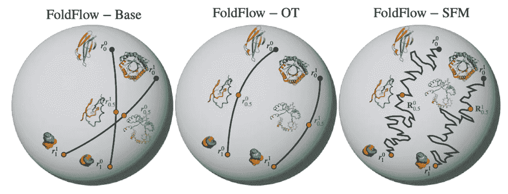

# 2024 年图形与几何机器学习：我们处于何种阶段，未来如何发展（第二部分——应用）

> 原文：[`towardsdatascience.com/graph-geometric-ml-in-2024-where-we-are-and-whats-next-part-ii-applications-1ed786f7bf63?source=collection_archive---------3-----------------------#2024-01-16`](https://towardsdatascience.com/graph-geometric-ml-in-2024-where-we-are-and-whats-next-part-ii-applications-1ed786f7bf63?source=collection_archive---------3-----------------------#2024-01-16)

## 最前沿摘要

## 延续往年的传统，我们采访了一批杰出且高产的学术和工业专家，旨在总结过去一年的亮点，并预测 2024 年的发展趋势。2023 年成果丰硕，以至于我们不得不将这篇文章分为两部分。这是第二部分，重点介绍应用，欲了解理论与新架构，请参见第一部分。

 [Michael Galkin](https://mgalkin.medium.com/?source=post_page---byline--1ed786f7bf63--------------------------------)

·发表于 [Towards Data Science](https://towardsdatascience.com/?source=post_page---byline--1ed786f7bf63--------------------------------) ·42 分钟阅读·2024 年 1 月 16 日

--

图片由作者提供，并得到 DALL-E 3 的帮助。

*本文由* [*Michael Galkin*](https://twitter.com/michael_galkin) *和* [*Michael Bronstein*](https://twitter.com/mmbronstein) *编写和编辑，且有来自* [*Dominique Beaini*](https://twitter.com/dom_beaini) *、* [*Nathan Benaich*](https://twitter.com/nathanbenaich) *、* [*Joey Bose*](https://twitter.com/bose_joey) *、* [*Johannes Brandstetter*](https://twitter.com/jo_brandstetter) *、* [*Bruno Correia*](https://twitter.com/befcorreia) *、* [*Ahmed Elhag*](https://twitter.com/Ahmed_AI035) *、* [*Kexin Huang*](https://twitter.com/KexinHuang5) *、* [*Chaitanya Joshi*](https://twitter.com/chaitjo) *、* [*Leon Klein*](https://twitter.com/leonklein26) *、* [*N M Anoop Krishnan*](https://twitter.com/anoopnm007) *、* [*Chen Lin*](https://twitter.com/WillLin1028) *、* [*Andreas Loukas*](https://twitter.com/loukasa_tweet) *、* [*Santiago Miret*](https://www.linkedin.com/in/santiago-miret) *、* [*Luca Naef*](https://twitter.com/NaefLuca) *、* [*Liudmila Prokhorenkova*](https://twitter.com/LProkhorenkova) *、* [*Emanuele Rossi*](https://twitter.com/emaros96) *、* [*Hannes Stärk*](https://twitter.com/HannesStaerk) *、* [*Alex Tong*](https://twitter.com/AlexanderTong7) *、* [*Anton Tsitsulin*](https://twitter.com/tsitsulin_) *、* [*Petar Veličković*](https://twitter.com/PetarV_93) *、* [*Minkai Xu*](https://twitter.com/MinkaiX) *和* [*Zhaocheng Zhu*](https://twitter.com/zhu_zhaocheng) *的重要贡献。*

几何机器学习方法和应用填满了 2023 年高端期刊的封面（图源：来自[Wang 等](https://www.nature.com/articles/s42256-023-00609-5)、[Viñas 等](https://www.nature.com/articles/s42256-023-00684-8)、[Deng 等](https://www.nature.com/articles/s42256-023-00716-3)、[Weiss 等](https://www.nature.com/articles/s43588-023-00532-0)、[Lagemann 等](https://www.nature.com/articles/s42256-023-00744-z)、[Duan 等](https://www.nature.com/articles/s43588-023-00563-7) 和[Lam 等](https://www.science.org/doi/10.1126/science.adi2336)的论文）

1.  结构生物学（分子与蛋白质）

    a. 结构生物学家的视角

    b. 工业视角

    c. 系统生物学

1.  材料科学（晶体）

1.  分子动力学与机器学习势能

1.  几何生成模型（流形）

1.  大型图谱、可扩展性：当 GNN 太昂贵时

1.  算法推理与对齐

1.  知识图谱：归纳推理解决了吗？

1.  时序图学习

1.  LLMs + 图谱用于科学发现

1.  酷炫的 GNN 应用

1.  几何华尔街公告 💸

我们在全文中将使用的符号：

🔥 热点话题

💡 今年的亮点

🏋️ 挑战

➡️ 当前/下一步发展

🔮 预测/推测

💰 财务交易

# 结构生物学（分子与蛋白质）

*Dominique Beaini（Valence）、Joey Bose（Mila & Dreamfold）、Michael Bronstein（Oxford）、Bruno Correia（EPFL）、Michael Galkin（Intel）、Kexin Huang（Stanford）、Chaitanya Joshi（Cambridge）、Andreas Loukas（Genentech）、Luca Naef（VantAI）、Hannes Stärk（MIT）、Minkai Xu（Stanford）*

> 结构生物学无疑是 2023 年几何深度学习领域的前沿。

继 2020 年 [halicin](https://pubmed.ncbi.nlm.nih.gov/32084340/) 被发现作为一种潜在的新型抗生素之后，2023 年通过 GNNs（图神经网络）的帮助，发现了两种新的抗生素！首先是 [abaucin](https://www.nature.com/articles/s41589-023-01349-8)（由麦克马斯特大学和麻省理工学院研究人员发现），它能够靶向一种对多种药物有抗药性的顽固病原体。其次，麻省理工学院和哈佛大学的研究人员 [发现了一种新的抗生素结构类别](https://www.nature.com/articles/s41586-023-06887-8)，其中筛选过程得到了 [ChemProp](https://github.com/chemprop/chemprop) 的支持，这是一套用于分子性质预测的 GNN 工具。此外，我们还观察到在最近的[自主分子发现](https://www.science.org/doi/10.1126/science.adi1407)工作中，机器学习和实验技术的融合（“实验室环节”）正在趋于一致（这是我们在后续材料设计部分也将看到的趋势）。

**流匹配**已经成为 2023 年最大的生成型机器学习趋势之一，相比扩散模型，它能够实现更快的采样和确定性的采样轨迹。在生物学应用中，我们看到的流匹配模型最突出的例子有：**FoldFlow**（[Bose、Akhound-Sadegh 等人](https://arxiv.org/abs/2310.02391)）用于蛋白质骨架生成，**FlowSite**（[Stärk 等人](https://arxiv.org/abs/2310.05764)）用于蛋白质结合位点设计，以及 **EquiFM**（[Song、Gong 等人](https://openreview.net/forum?id=hHUZ5V9XFu)）用于分子生成。

*FoldFlow 不同版本学习到的条件概率路径，展示了 SO(3) 在其齐次空间上作用下单一残基的旋转轨迹* 𝕊²*。图源：* [*Bose、Akhound-Sadegh 等人*](https://arxiv.org/abs/2310.02391)*。*

高效流匹配在复杂几何体上的应用，结合必要的等变性，得以实现，这得益于几篇理论论文的贡献，包括《黎曼流匹配》（[Chen 和 Lipman](https://arxiv.org/abs/2302.03660)）、《小批量最优传输》（[Tong 等人](https://arxiv.org/abs/2302.00482)）、以及《无仿真薛定谔桥》（[Tong、Malkin、Fatras 等人](https://arxiv.org/abs/2307.03672)）。一个很好的学习流匹配的资源是 GitHub 上的 [TorchCFM](https://github.com/atong01/conditional-flow-matching) 仓库，其中包含代码示例和笔记本，以及 [Yaron Lipman](https://www.youtube.com/watch?v=5ZSwYogAxYg)、[Joey Bose](https://www.youtube.com/watch?v=EPxDI0ytfQU)、[Hannes Stärk](https://www.youtube.com/watch?v=Xl7YNR1-CN8) 和 [Alex Tong](https://www.youtube.com/watch?v=UhDtH7Ia9Ag) 的讲座。

**扩散模型**仍然是结构生物学中生成建模的主要驱动力。2023 年，我们见证了几项具有里程碑意义的工作：**FrameDiff**（[Yim, Trippe, De Bortoli, Mathieu 等](https://arxiv.org/abs/2302.02277)）用于蛋白质骨架生成，**EvoDiff**（[Alamdari 等](https://www.biorxiv.org/content/10.1101/2023.09.11.556673v1)）用于生成具有离散扩散的蛋白质序列，**AbDiffuser**（[Martinkus 等](https://arxiv.org/abs/2308.05027)）用于全原子抗体设计，结合框架平均和离散扩散（并通过成功的实验验证），**DiffMaSIF**（[Sverrison, Akdel 等](https://www.mlsb.io/papers_2023/DiffMaSIF_Surface-based_Protein-Protein_Docking_with_Diffusion_Models.pdf)）和**DiffDock-PP**（[Ketata, Laue, Mammadov, Stärk 等](https://arxiv.org/abs/2304.03889)）用于蛋白质-蛋白质对接，**DiffPack**（[Zhang, Zhang 等](https://arxiv.org/abs/2306.01794)）用于侧链包装，贝克实验室发布了**RFDiffusion** **全原子**版本（[Krishna, Wang, Ahern 等](https://www.biorxiv.org/content/10.1101/2023.10.09.561603v1.full)）。在潜在扩散模型（如图像生成应用中的 Stable Diffusion）中，**GeoLDM**（[Xu 等](https://arxiv.org/abs/2305.01140)）是第一个用于 3D 分子构象的模型，随后是[OmniProt](https://openreview.net/forum?id=DP4NkPZOpD)用于蛋白质序列-结构生成。

FrameDiff：通过旋转、平移和扭转角度对氧原子的骨架框架进行参数化。图源：[Yim, Trippe, De Bortoli, Mathieu 等](https://arxiv.org/abs/2302.02277)

最后，谷歌 DeepMind 和 Isomorphic Labs [宣布](https://www.isomorphiclabs.com/articles/a-glimpse-of-the-next-generation-of-alphafold) **AlphaFold 2.3**——最新版本在三个任务上显著改进了基准：对接基准（比 DiffDock 在新的[PoseBusters](https://arxiv.org/abs/2308.05777)基准上好近 2 倍），蛋白质-核酸相互作用，以及抗体-抗原预测。

***Chaitanya Joshi (剑桥)***

💡2023 年，我非常兴奋地看到生物分子建模和设计领域出现了两个新兴趋势：

1️⃣ 从蛋白质结构预测到构象集生成的过渡。针对这个问题有几种有趣的方法，包括 [AlphaFold 与 MSA 聚类](https://www.nature.com/articles/s41586-023-06832-9)，[idpGAN](https://www.nature.com/articles/s41467-023-36443-x)，[Distributional Graphormer](https://arxiv.org/abs/2306.05445)（一种扩散模型），以及 [AlphaFold 与流匹配结合生成蛋白质集](https://www.mlsb.io/papers_2023/AlphaFold_Meets_Flow_Matching_for_Generating_Protein_Ensembles.pdf)。

2️⃣ 生物分子复合物建模与蛋白质 + X 的生物分子相互作用设计：[RFdiffusion 全原子模型](https://www.biorxiv.org/content/10.1101/2023.10.09.561603v1.full) 和 [Ligand MPNN](https://www.biorxiv.org/content/10.1101/2023.12.22.573103v1.full)，这两者均来自 Baker 实验室，是朝着设计相互作用趋势的代表性示例。正在开发中的新[AlphaFold 报告](https://www.isomorphiclabs.com/articles/a-glimpse-of-the-next-generation-of-alphafold)称，统一的结构预测模型可以在单一蛋白质和蛋白质复合物结构预测以及蛋白质-配体和蛋白质-核酸协同折叠方面，超越或匹配专业化模型的表现。

> “然而，对于生物分子建模和设计中所有令人兴奋的方法学发展而言，也许今年机器学习社区最大的一课应该是，更加关注有意义的**计算机模拟评估**，如果可能的话，进行**实验验证**。” — **Chaitanya Joshi**（剑桥）

1️⃣ 在 2023 年初，Guolin Ke 团队在 DP Technology 发布了两篇出色的再评估论文，突显了我们可能在分子[构象生成](https://arxiv.org/abs/2302.07061)和[对接](https://arxiv.org/abs/2302.07134)方面，相较于传统基准方法，过高估计了以几何深度学习为基础的主流方法的性能。

2️⃣ [PoseCheck](https://arxiv.org/abs/2308.07413) 和 [PoseBusters](https://arxiv.org/abs/2308.05777) 进一步揭示了当前分子生成和对接方法的失败模式。关键是，生成的分子及其 3D 姿态往往是“非物理的”，并且包含立体冲突、氢原子位置问题和高应变能。

3️⃣ 很少有论文尝试对新的机器学习思想进行实验验证。也许对于那些专注于新方法开发的人来说，与湿实验室的合作比较具有挑战性，但我希望作为一个机器学习社区，我们至少能在不断推动新模型的过程中，更加谨慎地对待我们常用的计算机模拟评估指标。

***Hannes Stärk (MIT)***

💡我看到关于流匹配、随机插值和整流流（我将其称为“桥接匹配”，或“BM”）的讨论颇为火热。我不认为仅仅在所有现有应用中用 BM 替换扩散模型有什么太大价值。对于纯生成建模，BM 的主要优势是简洁性。

我认为我们应该更加兴奋的是 BM 所解锁的新能力。例如，无需仿真即可在任意分布之间训练桥接（这个方法最适合哪些应用呢？到目前为止，我只看到了[逆合成](https://arxiv.org/abs/2308.16212)）。或者解决像[DSBM](https://arxiv.org/abs/2303.16852)这样针对流体流动下采样的 OT 问题。也许 2023 年出现了许多工具（我们还可以提到[具有多个边际的 BM](https://arxiv.org/abs/2310.03695)），而到 2024 年，社区将更好地利用它们？

***乔伊·博斯 (Mila & Dreamfold)***

💡 今年我们确实看到了几何生成模型从理论到实践的崛起。几项突出的工作包括[黎曼流匹配](https://arxiv.org/abs/2302.03660)——一般来说，任何由 Ricky Chen 和 Yaron Lipman 撰写的关于这些主题的论文都值得一读——以及[Yim 等人](https://arxiv.org/abs/2302.02277)的 FrameDiff，它引入了很多蛋白质骨架生成的重要机制。当然，在 RFM 和 FrameDiff 的基础上，我们构建了[FoldFlow](https://arxiv.org/abs/2310.02391)，这是一种更酷的流匹配方法，用于蛋白质生成模型。

> “展望未来，我预见到更多基于**流匹配**的方法将会投入使用。它们对于蛋白质和较长的序列更有效，并且可以从任何源分布开始。” — 乔伊·博斯 (Mila & Dreamfold)

🔮 此外，我怀疑我们很快将在这个领域看到**多模态生成模型**，例如离散+连续模型，以及类似于图像的文本条件扩散模型的条件模型。也许，考虑到它们的扩展性，我们甚至可能会在这里看到**潜在生成模型**！

***敏凯·徐 (斯坦福大学)***

> “今年，社区在多个方面进一步推动了几何生成模型在 3D 分子生成中的应用。” — 敏凯·徐 (斯坦福大学)

**流匹配**：Ricky 和 Yaron 提出了流匹配方法，作为广泛使用的扩散模型的替代方案，EquiFM（[Song 等人](https://openreview.net/forum?id=hHUZ5V9XFu) 和 [Klein 等人](https://arxiv.org/abs/2306.15030)）通过使用等变 GNN 来参数化流动动力学，从而实现了 3D 分子生成的变种。与此同时，[FrameFlow](https://arxiv.org/pdf/2310.05297.pdf)和[FoldFlow](https://arxiv.org/abs/2310.02391)构建了用于蛋白质生成的 FM 模型。

🔮 展望未来，类似于视觉和文本领域，人们开始探索在低维潜在空间中进行生成，而不是在复杂的原始数据空间中进行生成（**潜在生成模型**）。GeoLDM（[Xu 等人](https://arxiv.org/abs/2305.01140)）提出了第一个潜在扩散模型（类似于 CV 中的稳定扩散），用于 3D 分子生成，而[Fu 等人](https://arxiv.org/abs/2305.04120)则在大型蛋白质生成中使用了类似的建模方法。

# 结构生物学家的视角

*布鲁诺·科雷亚 (EPFL)*

> “目前的生成模型仍然会产生‘垃圾’输出，这些输出违反了分子已知的许多物理和化学属性。当然，当前生成模型的优势在于它们的速度，这使得它们能够生成大量样本，从而使得筛选最佳生成样本的能力变得尤为重要，在蛋白质设计的领域，AlphaFold2 的变革性发展对此带来了巨大的帮助。” — 布鲁诺·科雷亚（EPFL）

➡️ 对社区的下一个挑战或许是如何将**有意义的物理和化学先验**注入生成模型，以提高采样性能和泛化能力。有趣的是，在小分子设计应用中，我们尚未看到同样显著的进展（经实验验证），但我们希望在 2024 年能看到这一突破。

➡️ **多模态模型的崛起。** 通常在生物学相关任务中，数据稀缺性是一个普遍问题，因此，从数据中提取最大信号的策略至关重要。克服这种局限性的一种方式是提高数据表示的表现力，也许通过这种方式可以获得更高效的神经网络。短期内，我们可能能够探索涵盖多种对象表示的架构，并利用最优预测来解决我们面临的越来越复杂的任务，随着越来越多基础问题的解决，这一点变得尤为重要。多模态性的概念当然与拥有更强先验的模型的总体目标密切相关，在生成任务中，这些模型尊重对象的基本约束。

➡️ **全知模型。** 随着机器学习模型能力的提升，我们显然倾向于请求更多的多目标优化，以解决现实生活中的问题。以小分子生成为例，从生物化学的角度来看，药物设计问题首先是确定一个靶点，药物分子需要与该靶点结合，因此，生成过程的首要约束条件之一是它应当以蛋白质口袋为条件。然而，这样的约束可能不足以生成真实的小分子，因为许多这样的化学物质根本无法合成或极其难以合成，因此，具备化学合成可行性概念并能将这些约束集成到搜索空间中的模型将更加有用。

➡️ **从化学型到表型**。在数据表示方面，原子图结构和向量嵌入技术取得了显著成果，尤其是在寻找新抗生素方面。广义上来说，准确预测哪些化学结构具有抗菌活性，是从化学结构到表型预测的一个重要练习。由于所采用方法的简便性和取得的令人印象深刻的成果，可以预期，若能在分子端采用更复杂的数据表示，并且可能结合更丰富的表型分配，这将对药物开发中的这一重要问题作出关键贡献。

# 工业视角

***Luca Naef (VantAI)***

🔥*2023 年你注意到的领域里最大的进展是什么？*

1️⃣ **多模态性和模块化的增加** —— 如蛋白质和小分子的初步共折叠方法的出现所示，包括扩展 AF2 成功的扩散和非扩散基础方法：[DiffusionProteinLigand](https://www.biorxiv.org/content/10.1101/2022.12.20.521309v1.full.pdf)在 2022 年最后几天发布，和[RFDiffusion](https://www.biorxiv.org/content/10.1101/2023.10.09.561603v1)，[AlphaFold2](https://www.isomorphiclabs.com/articles/a-glimpse-of-the-next-generation-of-alphafold)以及[Umol](https://www.biorxiv.org/content/10.1101/2023.11.03.565471v1)预计在 2023 年底发布。我们也看到了一些模型在序列与结构共同训练的基础上进行训练：[SAProt](https://www.biorxiv.org/content/10.1101/2023.10.01.560349v2)，[ProstT5](https://www.biorxiv.org/content/10.1101/2023.07.23.550085v1)，以及在[ProteinINR](https://www.mlsb.io/papers_2023/Pre-training_Sequence_Structure_and_Surface_Features_for_Comprehensive_Protein_Representation_Learning.pdf)模型下，序列、结构与表面共同训练。经过 2021 年和 2022 年相对平静的时期，基于表面的方法重新获得了关注：[DiffMasif](https://www.mlsb.io/papers_2023/DiffMaSIF_Surface-based_Protein-Protein_Docking_with_Diffusion_Models.pdf)，[SurfDock](https://arxiv.org/abs/2311.17050)，和[ShapeProt](https://www.biorxiv.org/content/10.1101/2023.12.03.567710v1)。

2️⃣ **数据集和基准测试**。数据集，尤其是合成的/计算生成的数据集：[ATLAS](https://academic.oup.com/nar/article/52/D1/D384/7438909) 和 [MDDB](https://mddbr.eu/) 用于蛋白质动态学。[MISATO](https://www.biorxiv.org/content/10.1101/2023.05.24.542082v1)，[SPICE](https://www.nature.com/articles/s41597-022-01882-6)，[Splinter](https://www.nature.com/articles/s41597-023-02443-1) 用于蛋白质-配体复合物，[QM1B](https://arxiv.org/abs/2311.01135) 用于分子属性。PINDER：一个大型蛋白质-蛋白质对接数据集，包含匹配的空载/预测对和基准套件，附带重新训练的对接模型。[CryoET 数据门户](https://chanzuckerberg.github.io/cryoet-data-portal/index.html#) 用于冷冻电子断层扫描（CryoET）。以及一系列受欢迎的基准测试：PINDER、[PoseBusters](https://arxiv.org/abs/2308.05777) 和 [PoseCheck](https://arxiv.org/abs/2308.07413)，重点关注更加严格和实际相关的设置。

3️⃣ **创造性的预训练策略**，以克服蛋白质-配体复合物的稀缺性。范德梅尔训练（[DockGen](https://openreview.net/forum?id=UfBIxpTK10)）和[RF-AA](https://www.biorxiv.org/content/10.1101/2023.10.09.561603v1)中的侧链训练策略，以及在[RF-AA](https://www.biorxiv.org/content/10.1101/2023.10.09.561603v1)中的配体单独复合物预训练。多任务预训练，如[Unimol](https://openreview.net/forum?id=6K2RM6wVqKu)及其他。

🏋️ *研究人员可能忽视的开放性挑战是什么？*

1️⃣ **泛化能力**。[DockGen](https://openreview.net/forum?id=UfBIxpTK10)展示了当前最先进的蛋白质-配体对接模型在试图泛化到新蛋白质领域时完全失去了预测能力。在[AlphaFold 最新报告](https://storage.googleapis.com/deepmind-media/DeepMind.com/Blog/a-glimpse-of-the-next-generation-of-alphafold/alphafold_latest_oct2023.pdf)中，我们看到了类似的现象，新蛋白质和配体的表现显著下降，甚至低于基于生物物理学的基线（这些基线可以访问完整结构），尽管对新蛋白质和配体的定义非常宽泛。这表明现有的方法仍然很大程度上依赖于记忆，这一观察已在[多年](https://pubs.acs.org/doi/10.1021/acs.jmedchem.2c00487)的讨论中得到了广泛论证。

2️⃣ **（简单）基线的诅咒**。这是一个多年来反复出现的话题，2023 年再次证明了业界从业者早已知道的一点：在许多实际问题中，如分子生成、属性预测、对接和构象预测，简单的基线或经典方法往往在实践中仍优于基于机器学习的方法。2023 年，[Tripp 等人](https://arxiv.org/abs/2310.09267)**，** [Yu 等人](https://arxiv.org/abs/2302.07134)，[Zhou 等人](https://arxiv.org/abs/2302.07061)对此有越来越多的文献记录。

🔮 *2024 年的预测！*

> “在 2024 年，数据稀缺问题仍将是我们关注的重点，我们将看到很多智能方法来使用模型生成合成训练数据。AlphaFold2 中的自蒸馏为我们提供了重要的启示，[DockGen](https://openreview.net/forum?id=UfBIxpTK10)中的置信引导方法，利用了我们现在已经拥有足够强大的模型，这些模型能够评分姿势，但并不总是能够生成姿势，这一发现最早在[2022 年](https://www.biorxiv.org/content/10.1101/2022.03.11.484043v1)中提出。” — Luca Naef (VantAI)

2️⃣ 我们将看到更多为机器学习专门设计的生物/化学实验，或仅在机器学习的背景下才有意义（即，这些实验可能本身不会带来生物学上的新见解，但主要用于训练模型）。2023 年的一个例子是[Tsuboyama 等人](https://www.nature.com/articles/s41586-023-06328-6)的大规模蛋白质折叠实验。这个举措可能受到科技生物初创公司的推动，我们已经看到基于这些专门为结构生物学设计的机器学习实验构建的首个基础模型，例如[ATOM-1](https://www.biorxiv.org/content/10.1101/2023.12.13.571579v1)。

***Andreas Loukas (Prescient Design, 属于基因泰克的一部分)***

🔥 *你在 2023 年注意到的该领域最大进展是什么？*

> “在 2023 年，我们开始看到一些关于蛋白质等变生成和表示的挑战通过扩散模型得以解决。” — Andreas Loukas (Prescient Design)

1️⃣ 我们还注意到了一种**向更高保真度的分子系统建模与生成方法转变**。例如，最新的模型采用完全端到端的方法，通过联合生成主链、序列和侧链（[AbDiffuser](https://openreview.net/pdf?id=7GyYpomkEa), [dyMEAN](https://arxiv.org/pdf/2302.00203.pdf)），或者至少通过一个部分联合的模型在两步中解决问题（[Chroma](https://www.nature.com/articles/s41586-023-06728-8)）；相比之下，主链生成后再进行反向折叠，如在[RF Diffusion](https://www.nature.com/articles/s41586-023-06415-8)和[FrameDiff](https://openreview.net/pdf?id=m8OUBymxwv)中所述。其他改善建模保真度的尝试可以在最新的共折叠工具更新中找到，如[AlphaFold2](https://www.isomorphiclabs.com/articles/a-glimpse-of-the-next-generation-of-alphafold)和[RF Diffusion](https://www.biorxiv.org/content/10.1101/2023.10.09.561603v1)，它们使模型对非蛋白质成分（配体、辅基、辅因子）更为敏感；同时也可以在一些试图考虑构象动力学的论文中找到（见上文讨论）。在我看来，这一研究方向至关重要，因为分子系统的结合行为对原子如何放置、移动和相互作用非常敏感。

2️⃣ 在 2023 年，许多研究也尝试通过学习预测已知晶体突变的效应来掌握**结合亲和力**，通过在大型语料库上进行预训练，如计算预测的突变（[graphinity](https://github.com/oxpig/Graphinity)），以及侧任务，如[旋转体密度估计](https://openreview.net/pdf?id=_X9Yl1K2mD)。所获得的结果令人鼓舞，因为它们可以显著超越如 Rosetta 和 FoldX 等半经验基线。然而，仍然有大量工作需要完成，以使这些模型在结合亲和力预测中更加可靠。

3️⃣ 我进一步观察到，**蛋白质语言模型（pLMs）**，特别是[ESM](https://www.science.org/doi/10.1126/science.ade2574)，作为有价值的工具，得到了越来越多的认可，即使在那些主要偏好几何深度学习的人群中。这些嵌入被用来帮助对接模型，允许构建简单但具有竞争力的结合亲和力预测模型（[Li et al 2023](https://www.nature.com/articles/s41467-023-39022-2)），并且通常能提供一种高效的方式，利用广泛的蛋白质组数据为 GNNs 创建残基表示，而无需大量的预训练（[Jamasb et al 2023](https://www.mlsb.io/papers_2023/Evaluating_Representation_Learning_on_the_Protein_Structure_Universe.pdf)）。然而，我确实对使用 pLMs 存在担忧：目前尚不清楚它们的有效性是由于数据泄漏还是由真正的泛化能力所致。在评估如逆折叠中的氨基酸恢复和条件 CDR 设计等任务时，这一点尤其重要，因为区分这两者的因素至关重要。

🏋️ *研究人员可能忽视了哪些开放性挑战？*

1️⃣ 与**能量放松的晶体结构**（甚至更糟，折叠结构）一起工作可能会显著影响下游预测模型的性能。对于蛋白质-蛋白质相互作用（PPI）的预测尤为如此。根据我的经验，当预测模型给定的是放松后的结构而非结合（全）晶体结构时，PPI 预测器的性能会严重下降。

2️⃣ 尽管成功的*计算机辅助*抗体设计有潜力彻底改变药物设计，但**通用蛋白质模型（还？）不如专门针对抗体的模型在折叠、对接或生成抗体方面表现得那么好**。这可能是由于抗体折叠的低构象变异性和抗体与抗原之间不同的结合方式（涉及环介导的相互作用，并可能包含不可忽视的熵项）。也许由于同样的原因，抗体结合物的*de novo*设计（我定义为零样本生成能与之前未见的表位结合的抗体）仍然是一个未解的难题。目前，经过实验验证的*de novo*结合物案例大多涉及稳定的蛋白质，如[α-螺旋束](https://www.nature.com/articles/s41586-023-06415-8)，它们在 PDB 中较为常见，且包含的界面与表位-抗表位相互作用有显著不同。

3️⃣ **我们仍然缺乏一种通用的结合自由能代理模型***。问题在于缺乏足够大且多样化的高质量数据（特别是共晶结构）。因此，我们应该意识到，任何此类学习代理模型在评估模型时的局限性：尽管预测的结合评分超出已知结合物分布范围是明显的信号，表明某些地方可能出了问题，但我们应避免陷入典型的误区，即通过展示模型如何导致更高的评分来证明我们模型的优越性。

***多米尼克·贝阿尼（Valence Labs，Recursion 的一部分）***

> “我很高兴看到围绕药物发现问题建立起了一个庞大的社区，并且我感到我们正处于药物发现速度和效率新革命的边缘。” — 多米尼克·贝阿尼（Valence Labs）

*2023 年有哪些工作让我感到兴奋？*

我相信机器学习将使我们能够快速应对罕见病，阻止下一场 COVID-X 大流行在蔓延之前爆发，并使我们活得更久、更健康。但仍有大量工作要做，前方有许多挑战，有一些障碍和一些峡谷。说到社区，您可以访问[Valence Portal](https://portal.valencelabs.com/)以跟上药物发现领域机器学习中的🔥新进展。

*2024 年有哪些难题？*

⚛️ **新一代量子力学。** 基于等变和不变图神经网络（GNNs）的机器学习力场，一直向我们承诺着一笔宝藏。那就是密度泛函理论的精度，但速度要快上千倍，并且适用于整个蛋白质的尺度。虽然[Allegro](https://link.springer.com/chapter/10.1007/978-3-031-32041-5_12)和[MACE-MP](https://arxiv.org/pdf/2401.00096.pdf)等方向上已取得了一些进展，但目前的模型在未见过的情境和超大分子上泛化性较差，而且它们的计算速度仍然太慢，无法满足所需的时间尺度🐢。对于泛化问题，我相信更大且更多样化的数据集是最重要的突破点。对于计算时间，我认为我们将看到一些不那么强求等变性的模型，例如[FAENet](https://arxiv.org/pdf/2305.05577.pdf)。但高效的采样方法将发挥更大的作用：空间采样，比如使用[DiffDock](https://arxiv.org/abs/2210.01776)来获得更有趣的起始点，以及时间采样，如[TimeWarp](https://www.microsoft.com/en-us/research/publication/timewarp-transferable-acceleration-of-molecular-dynamics-by-learning-time-coarsened-dynamics/)来避免模拟每一帧。我对 2024 年即将到来的重大突破充满期待：时空等变的 Boltzmann 采样器（STEBS）👣。

🕸️ **一切都是相互联系的。生物学本质上是多模态的🙋🐁 🧫🧬🧪。** 无法简单地将分子与其他生物系统解耦。当然，这就是过去药物发现中的机器学习方法：仅仅构建分子图模型并将其拟合到实验数据中。但我们已经达到了一个关键点🛑，无论图神经网络（GNN）模型中有多少万亿个参数，使用了多少数据进行训练，或者汇聚了多少专家团队，它都无法解决问题。是时候将生物学融入其中，最直接的方式就是采用多模态模型。一种方法是用目标蛋白质序列来调节 GNN 的输出，例如[MocFormer](https://www.biorxiv.org/content/10.1101/2023.09.13.557595v4.abstract)。另一种方法是使用显微镜图像或转录组学来更好地为模型提供分子的生物学特征信息，例如[TranSiGen](https://www.biorxiv.org/content/10.1101/2023.11.12.566777v1.full)。还有一种方法是使用大语言模型（LLMs）来嵌入关于任务的上下文信息，例如[TwinBooster](https://arxiv.org/pdf/2401.04478.pdf)。甚至更好的是，将这些方法结合起来🤯，但这可能需要几年时间。对于更广泛的社区而言，主要问题似乎是缺乏大量高质量和标准化的数据，但幸运的是，这对 Valence 来说并不是问题。

**🔬 关联生物学知识和可观察现象。** 人类一直在努力绘制生物学的图谱，构建基因🧬、蛋白质-蛋白质相互作用🔄、代谢通路🔀等的关系图。我邀请你阅读这篇关于[药物发现中的知识图谱综述](https://academic.oup.com/bib/article/23/6/bbac404/6712301)。然而，这些知识常常被机器学习（ML）社区忽视，未被充分利用。我认为这是一个知识图谱领域，特别是在 2024 年，图神经网络（GNNs）可以发挥巨大作用的地方，它也可能为上述🕸️点提供另一种方式。考虑到人类知识的不完整性，我们可以通过基础模型恢复关系图谱。这也是[Phenom1](https://arxiv.org/abs/2309.16064)在尝试回溯已知遗传关系时所采取的路径。然而，处理各种知识数据库是一项极其复杂的任务，我们不能指望大多数机器学习科学家能够单独应对。但是借助人工助手，如[LOWE](https://www.valencelabs.com/lowe)，这一任务可以在几秒钟内完成。

**🏆 基准测试，基准测试，基准测试。** 我无法重复***基准测试***这个词足够多。唉，基准测试依然会是机器学习领域不受宠的存在🫥。但如果“基准测试”这个词不酷，它的表亲***竞赛***就要酷得多了😎！正如[OGB-LSC](https://ogb.stanford.edu/docs/lsc/)竞赛和[Open Catalyst](https://opencatalystproject.org/challenge.html)挑战对 GNN 社区的重大作用一样，现在是时候迎来一系列新的竞赛🥇。我们甚至最近迎来了[TGB（时序图基准测试）](https://tgb.complexdatalab.com/)。如果你参加了 NeurIPS'23，可能就听说了 Polaris 将在 2024 年初登场✨。Polaris 是一个由多个制药公司和学术团体组成的联盟，旨在提高现有分子基准测试的质量，以更好地代表真实的药物发现过程。也许我们会看到适用于分子图生成的基准测试，而不是优化 QED 和 cLogP，但我不会抱太大希望，毕竟我已经等了多年。是什么样的新奇竞赛将点亮今年的 GDL 社区呢🤔？

# 系统生物学

***黄克鑫（斯坦福大学）***

生物学是一个相互连接、多尺度和多模态的系统。有效的建模不仅可以揭示基础的生物学问题，还可以对治疗发现产生重大影响。最自然的封装这种系统的数据格式是关系型数据库或异构图。这种图存储了几十年来在各种生物学领域进行的湿实验数据，数据量可达数十亿条。

> “在 2023 年，我们见证了许多使用 GNNs 的创新应用，应用于这些生物系统图谱。这些应用解锁了新的生物医学能力，并回答了关键的生物学问题。” — 黄克鑫（斯坦福大学）

1️⃣ 一个特别令人兴奋的领域是**微扰生物学**。理解微扰的结果可以推动细胞重编程、靶点发现和合成致死等方面的进展。在 2023 年，[GEARS](https://www.nature.com/articles/s41587-023-01905-6)将图神经网络（GNN）应用于基因扰动关系图，能够预测之前未曾观察到的基因扰动结果。

2️⃣ 另一个酷炫的应用涉及**蛋白质表示**。当前的蛋白质表示是固定且静态的，但我们认识到同一蛋白质在不同的细胞环境中可能表现出不同的功能。[PINNACLE](https://www.biorxiv.org/content/10.1101/2023.07.18.549602v1)在蛋白质相互作用网络上使用 GNN 来对蛋白质嵌入进行情境化处理。该方法已被证明能够增强基于 3D 结构的蛋白质表示，并在识别治疗靶点方面优于现有的无上下文模型。

PINNACLE 拥有蛋白质、细胞类型和组织层次的注意力机制，使得该算法能够在一个统一的嵌入空间中生成蛋白质、细胞类型和组织的情境化表示。来源：[Li et al](https://www.biorxiv.org/content/10.1101/2023.07.18.549602v1)

3️⃣ GNN 在**诊断罕见疾病**方面也发挥了重要作用。[SHEPHERD](https://www.medrxiv.org/content/10.1101/2022.12.07.22283238v1)利用 GNN 在庞大的知识图谱上对生物学知识进行编码，并已被证明有助于因果基因发现、识别具有相似基因或疾病的‘类似患者’，并为新型疾病表现提供可解释的见解。

➡️ 超越预测，理解生物现象背后的机制至关重要。**图神经网络解释性 AI（Graph XAI）**应用于系统图是识别机制路径的自然选择。例如，[TxGNN](https://www.medrxiv.org/content/10.1101/2023.03.19.23287458v2)将药物-疾病关系预测与生物系统图结合，生成多跳的可解释路径。这些路径阐明了药物治疗特定疾病的潜力。TxGNN 为这些解释设计了[可视化工具](http://txgnn.org/)，并进行用户研究，证明其在临床医生和生物医学科学家决策中的有效性。

一个基于网络的图形用户界面，用于支持临床医生和科学家探索和分析由 TxGNN 生成的预测和解释。‘控制面板’允许用户选择感兴趣的疾病，并查看该疾病的顶级 TXGNN 预测结果。‘边缘阈值’模块使用户能够调整解释的稀疏性，从而控制显示的多跳路径的密度。‘药物嵌入’面板允许用户比较所选药物相对于整个药物重定位候选库的位置。‘路径解释’面板展示了被认为对 TXGNN 预测疗效至关重要的生物学关系。来源：[黄、Chandar 等](https://www.medrxiv.org/content/10.1101/2023.03.19.23287458v2)

➡️ 生物学中的基础模型主要是单模态的（专注于蛋白质、分子、疾病等），这主要是由于配对数据的稀缺性。**跨模态桥接**以回答多模态查询是一个令人兴奋的前沿。例如，[BioBridge](https://openreview.net/forum?id=jJCeMiwHdH)利用生物学知识图谱在单模态基础模型之间学习变换，从而实现多模态行为。

🔮 GNN 应用于系统图谱具有以下潜力：（1）编码广泛的生物医学知识，（2）桥接生物学模态，（3）提供机制性洞察，（4）为生物实体提供背景。我们预计 2024 年 GNN 在生物学中的应用将带来更多突破性的进展，解决该领域一些最紧迫的问题。

## **2023 年预测**

（1）扩散模型的性能提升，如更快的采样和更高效的求解器；

✅ 是的，使用流匹配

（2）更强大的条件蛋白质生成模型；

❌ Chroma 和 RFDiffusion 仍然领先

（3）[生成流网络](https://arxiv.org/abs/2111.09266)在分子和蛋白质中的更多成功应用；

❌ 尚未确定

# 材料科学（晶体）

*迈克尔·高尔金（英特尔）和圣地亚哥·米雷特（英特尔）*

在 2023 年，短短一段时间内，所有科学新闻都在讨论[LK-99](https://en.wikipedia.org/wiki/LK-99)——一个由韩国团队创造的假设常温超导体（剧透：[截至目前它并未成功](https://www.nature.com/articles/d41586-023-02585-7)）。

> 这突显了机器学习在材料科学中的巨大潜力，或许今年最大的进展就发生在这里——我们现在可以说，材料科学和材料发现已经成为几何深度学习（Geometric DL）领域的核心内容。

💡应用于材料科学和发现的几何深度学习取得了显著进展，涵盖了新的建模方法、新基准和数据集的创建、生成方法的自动化设计，以及基于这些进展识别出新的研究问题。

1️⃣ 几何模型作为自动化发现工作流中评估工具的应用。[Open MatSci ML Toolkit](https://github.com/IntelLabs/matsciml)整合了所有开源的晶体结构数据集，提供了 150 万个数据点，用于基态结构计算，这些数据现在可以轻松用于模型开发。[作者的初步结果](https://arxiv.org/abs/2309.05934)似乎表明，合并数据集如果处理得当，会提高性能。

2️⃣ [MatBench Discovery](https://arxiv.org/abs/2308.14920)是另一个很好例子，展示了几何模型作为晶体稳定性评估工具的应用，它测试了模型对各种晶体结构的**能量高于外壳**的预测。能量高于外壳是晶体结构稳定性的最可靠近似，也代表了比形成能或原始能量预测更有实际意义的度量方法，因为后者作为稳定性度量存在实际限制。

普遍势能是更可靠的分类器，因为它们最早会退出红色三角区域。这些线显示了在 WBM 测试集上的滚动平均绝对误差（MAE），随着 MP 训练集的能量与凸包的距离变化，数值越低越好。红色突出显示的“危险三角区”表示模型最有可能错误分类结构。只要模型的滚动 MAE 保持在三角区内，其平均误差大于到凸包的距离。如果模型对某一预测的误差恰好指向位于凸包 0 eV 稳定性阈值处（图表的中心），则其平均误差将改变材料的稳定性分类，从真正的正/负类变为假负/假正类。’滚动窗口’框的宽度表示在其内平均的误差对凸包距离预测的宽度。来源：[Riebesell 等人](https://arxiv.org/abs/2308.14920)

3️⃣ 在晶体结构预测的新几何模型方面，**晶体哈密顿图神经网络**（[CHGNet](https://chgnet.lbl.gov/)，[邓等人](https://arxiv.org/abs/2302.14231)）是一个新型的图神经网络（GNN），它基于材料项目的静态和松弛轨迹进行训练，与先前的方法相比，表现出相当有竞争力的性能。CHGNet 的发展表明，找到更好的训练目标将与开发新方法一样（如果不是更重要的话）变得至关重要，因为材料科学与几何深度学习的交集正在不断增长。

🔥 几何深度学习与材料发现进一步整合的其他证明点是几家大实验室在晶体结构发现中采用生成方法的几项庞大工作：

1️⃣ Google DeepMind 发布了 [**GNoME**](https://deepmind.google/discover/blog/millions-of-new-materials-discovered-with-deep-learning/)（由 [Merchant 等人](https://www.nature.com/articles/s41586-023-06735-9) 提出的材料科学图网络）作为发现新材料的成功主动学习流程示例，同时发布了 [UniMat](https://unified-materials.github.io/unimat/) 作为一个 *从头开始* 的晶体生成模型。类似于蛋白质领域，我们也看到了更多关于材料科学的自动化实验室示例（“实验室-环路”），例如 [UC 伯克利的 A-Lab](https://www.nature.com/articles/s41586-023-06734-w)。

GNoME 的主动学习循环。来源：[Merchant 等人](https://www.nature.com/articles/s41586-023-06735-9)

2️⃣ 微软研究院发布了 [MatterGen](https://www.microsoft.com/en-us/research/blog/mattergen-property-guided-materials-design/)，一个用于无条件和属性引导材料设计的生成模型，以及 [Distributional Graphormer](https://distributionalgraphormer.github.io/)，一个生成模型，旨在恢复分子/蛋白质/晶体的平衡能量分布。

MatterGen 的无条件和有条件生成。来源：[Zeni, Pinsler, Zügner, Fowler, Horton 等人](https://arxiv.org/abs/2312.03687)

3️⃣ Meta AI 和 CMU 发布了 [Open Catalyst Demo](https://open-catalyst.metademolab.com/)，在这里你可以体验 11.5k 种催化剂材料在 86 种吸附体上、每种吸附体有 100 种不同配置的弛豫（DFT 近似），总共有多达 100M 种组合。该演示由最先进的几何模型 GemNet-OC 和 Equiformer-V2 提供支持。

***Santiago Miret (英特尔)***

虽然这些工作代表了生成方法的大规模应用，但也有新的研究在使用强化学习（[Govindarajan 等人](https://openreview.net/forum?id=VbjD8w2ctG)，[Lacombe 等人](https://openreview.net/forum?id=MNfVMjsL7S)）和 GFlowNets（[Mistal 等人](https://openreview.net/forum?id=l167FjdPOv)，[Nguyen 等人](https://openreview.net/forum?id=dJuDv4MKLE)）结合几何深度学习来发现晶体结构，正如在 [AI 加速材料设计 (AI4Mat)](https://sites.google.com/view/ai4mat) 研讨会中所强调的那样，NeurIPS’23 上的 AI4Mat-2023 也见证了参与人数的迅速增长，提交和接收的论文数量翻了一番，参会人数几乎增加了三倍。

💡 几何深度学习（DL）和图神经网络（GNN）仍然是 AI4Mat 研究内容的重要组成部分，我们看到这些方法的应用不仅限于性质预测，还扩展到了**化学合成**和**材料表征**的改善。AI4Mat-2023 工作坊中突出的一个有前景的例子是**KREED**（[Cheng, Lo 等](https://openreview.net/forum?id=jlZrTCccAb)），它使用等变扩散方法，根据从真实实验室机器获得的不完全信息，预测分子的三维结构。

> “考虑到结构数据在材料表征中的重要性，AI4Mat 的讨论突出了几何深度学习进入真实世界材料建模领域的机会，除了在包括基于机器学习的潜力在内的仿真中的持续成功。” — Santiago Miret（英特尔）

🔮 在 2024 年，我预计会看到多项发展：

1️⃣ 更多发现新的架构和工作流程，直接整合像 M3GNet、CHGNet、MACE 这样的几何模型。

2️⃣ 几何模型可能会面临来自文本表示和大语言模型（LLMs）的竞争，因为[新方法正在被提出](https://openreview.net/forum?id=0r5DE2ZSwJ)，直接生成 CIF 文件。

3️⃣ 更多几何模型和 GNN 应用于真实世界的实验数据，可能用于材料表征，如 KREED，预计将面临与基于仿真建模相比数据较少的情况。

# 分子动力学与机器学习潜力

*Michael Galkin (英特尔)，Leon Klein (柏林自由大学)，N M Anoop Krishnan (印度理工学院德里分校)，Santiago Miret (英特尔)*

> 2023 年一个显著的趋势是朝着基础模型发展，这些模型适用于从小分子到周期性晶体等多种化合物的机器学习潜力。

例如，FAIR 和 CMU 的**JMP**（[Shoghi 等](https://arxiv.org/abs/2310.16802)）、来自中国多个机构的大型合作的**DPA-2**（[Zhang, Liu 等](https://arxiv.org/abs/2312.15492)），以及剑桥主导的合作中的**MACE-MP-0**（[Batatia 等](https://arxiv.org/abs/2401.00096)）。实际上，这些是预训练的几何图神经网络（GNN），用于预测某一原子结构的能量（或力）。另一个值得提及的例子是**Equiformer V2**（[Liao 等](https://arxiv.org/abs/2306.12059)），这是一种强大的等变变换器，在许多任务中保持了 SOTA 表现，包括最近的[OpenCatalyst 2023 挑战](https://opencatalystproject.org/challenge.html)和[OpenDAC](https://open-dac.github.io/index.html)（直接空气捕获）挑战。

一个材料建模的基础模型。该模型仅在材料项目数据上进行训练，数据主要由无机晶体组成，并且在氧化物方面偏向较重，MACE-MP-0 能够在固态、液态和气态的各种化学环境中进行分子动力学仿真。来源：[Batatia 等](https://arxiv.org/abs/2401.00096)

⚛️ 机器学习势能的一个常见应用场景是分子动力学（MD），其目的是在纳秒（10ᐨ⁹）到秒的时间范围内模拟某种结构。主要问题在于，经典方法中的基本时间步长是飞秒（10ᐨ¹⁵），也就是说，模拟一个纳秒至少需要 1 百万个时间步，这非常昂贵。现代基于机器学习的 MD 方法旨在通过应用粗粒化和其他近似技巧加速模拟，这些方法能够大幅提高模拟速度（30–1000 倍）。[Fu, Xie, et al](https://openreview.net/forum?id=y8RZoPjEUl)（TMLR'23）将粗粒化应用于原子结构，并在较小的图上运行 GNN 来预测下一步位置。在实验中，该方法相比经典方法实现了 1000–10,000 倍的加速。**TimeWarp**（[Klein, Foong, Fjelde, Mlodozeniec, et al](https://arxiv.org/abs/2302.01170)，NeurIPS’23）通过使用条件归一化流模型来模拟大时间步长（1⁰⁵ — 1⁰⁶飞秒），该模型近似下一步位置的分布。在使用 MCMC 采样的情况下，训练后的模型实现了约 33 倍的加速。

(a) 初始状态 x(t)（左）和接受的提议状态 x(t+τ)（右），通过 Timewarp 为二肽 HT（在训练期间未见过的样本）采样。(b) 模拟轨迹的 TICA 投影，显示了介稳态之间的转变，分别为短时间 MD 模拟（左）和 Timewarp MCMC（右），两者均运行了 30 分钟的墙钟时间。Timewarp MCMC 在有效样本数每秒的速度上，相比 MD 实现了约 33 倍的加速。来源：[Klein, Foong, Fjelde, Mlodozeniec, et al](https://arxiv.org/abs/2302.01170)

***Santiago Miret（英特尔）***

💡随着几何模型在属性建模中的成功部署，研究人员通过在现实世界的分子动力学模拟中测试这些模型，推动了最前沿的发展。首个突显仅基于能量和力训练模型存在问题的研究是 2023 年初在 TMLR 上发布的[Forces Are Not Enough](https://openreview.net/forum?id=A8pqQipwkt)。然而，基于邻域的方法如[Allegro](https://arxiv.org/abs/2204.05249)的进展，导致了使用几何深度学习模型成功部署大规模模拟，其中包括[戈登·贝尔奖提名](https://www.hpcwire.com/off-the-wire/sc23-spotlight-gordon-bell-prize-2023-finalists-showcase-diverse-supercomputing-applications/)。

> “仍然有大量工作需要做，以确保机器学习势能在各种物理和化学现象中成功、广泛地部署。” — Santiago Miret（英特尔）

➡️ [EGraffBench](https://arxiv.org/abs/2310.02428)突出了其中一些新挑战，例如跨温度和材料相变的泛化（即*固体到液体*的变化），并提出了用于评估机器学习势能在实际 MD 模拟中表现的新指标。AI4Mat-2023 研讨会也展示了为特定应用场景开发的新型机器学习势能，例如[用于电池的固态电解质](https://openreview.net/forum?id=jtAXitX6dh)。

***Leon Klein (FU Berlin)***

💡 将生成模型应用于从平衡玻尔兹曼分布中采样时的一个显著限制是，每次遇到新系统时都需要重新训练，这使得其相较于传统的分子动力学（MD）模拟的潜在优势受限。然而，最近的进展使得跨不同领域的可迁移模型逐渐浮现。我们的贡献，[Timewarp](https://arxiv.org/abs/2302.01170)，提出了一种可迁移模型，能够为聚焦于全原子小肽系统的 MD 模拟提出大时间步长。类似地，[Fu et al.](https://arxiv.org/abs/2204.10348) 捕捉了粗粒化聚合物的时间粗化动力学，而[Charron et al.](https://arxiv.org/abs/2310.18278)则擅长学习用于粗粒化蛋白质的可迁移力场。

> “因此，今年展示了可迁移生成模型在 MD 模拟中的可行性，展示了它们加速此类模拟的潜力。” — Leon Klein (FU Berlin)

🔮 在 2024 年，我预计会有更多定制化的 GNN（图神经网络）被用来提高可迁移模型的准确性，可能会专注于编码更多关于系统的信息。例如，尽管 Timewarp 在其模型中缺乏旋转对称性，但它通过数据增强来弥补这一点。另一种选择是使用最近提出的[SE(3)等变增强耦合流](https://arxiv.org/abs/2308.10364)来加入旋转对称性。类似地，[Charron et al.](https://arxiv.org/abs/2310.18278)使用 SchNet，而非更复杂的 GNN。

***N M Anoop Krishnan (IIT Delhi)***

> “今年在机器学习势能领域最令人兴奋的进展之一是开发了可以覆盖几乎所有元素的‘通用’原子间势能。” — N M Anoop Krishnan (IIT Delhi)

💡 继 2022 年的 M3GNet 之后，今年见证了基于 CHGNet 的三种模型的发展，它们分别是([Deng et al](https://www.nature.com/articles/s42256-023-00716-3))、NequIP ([Merchant et al](https://www.nature.com/articles/s41586-023-06735-9)) 和 MACE ([Batatia et al](https://arxiv.org/abs/2401.00096))。这些模型已被用来展示几个具有挑战性的任务，包括材料发现（[Merchant et al](https://www.nature.com/articles/s41586-023-06735-9)），以及多种 MD 模拟（[Batatia et al](https://arxiv.org/abs/2401.00096)），如相变、非晶化、化学反应、二维材料建模、溶解、缺陷、燃烧等。这些方法为这些势能的普适性提供了有希望的结果，从而使得解决具有挑战性的问题成为可能，包括从相应的非晶结构中发现晶体（[Aykol et al](https://arxiv.org/abs/2310.01117)），这是材料学中一个长期未解的开放问题。

🏋️ 虽然这些势能确实为解决一些突出问题提供了手段，但挑战依然存在，主要是理解这些势能可能失败的情境。

**1️⃣** 测试这些势能的极限以了解它们的能力，是理解其局限性的重要方面。这包括模拟极端环境，如**高压**和**辐射条件**，模拟复杂的多组分系统，如**玻璃或高熵合金**，或者模拟**不同相态**的系统，如水或二氧化硅，这些都是有趣的挑战。

**2️⃣** 虽然其中一些模型被称为“基础”模型，但它们并未展示与基础模型相关的**涌现行为**。这些模型大多只是展示了对潜在未见区域或新组合物的外推能力。开发真正具有涌现属性的基础模型将是一个有趣的挑战。

**3️⃣** 第三个较少被关注的方面是这些模型**大规模模拟**的能力。尽管[Allegro](https://arxiv.org/abs/2204.05249)已经展示了这些势能在长度尺度方面的某些能力，但在更大的时间和长度尺度下进行稳定的模拟，同时保持“普适性”，仍然是这些势能面临的一个未解挑战。

🔮 **2024 年会有什么期待？**

**1️⃣** **基准套件**：虽然已经有一些关于分子动力学（MD）模拟的基准研究，预计 2024 年将在数据集和任务方面看到更多正式化的努力。一个标准的任务集，可以自动评估势能并将其放置在排行榜上，将便于对不同材料（如金属、聚合物或氧化物）的后续任务进行势能的排名。

**2️⃣ 模型与数据集开发**：将进一步努力使机器学习潜力在架构上更紧凑和高效。此外，2024 年还将见证大规模数据集的发展，这些数据集将为训练这些潜力提供*从头计算*数据。

**3️⃣ 可微 MD/AIMD**：此外，预计可微模拟的进展将成为融合实验与*从头计算*模拟，朝向自动开发针对特定应用的原子间势能的重要领域。今年可能还会看到可微 AIMD 的发展，结合机器学习的泛函，可能使得经济型模拟能够超越现有的限制，扩展到更大规模。

**2023 年后的预测**

我们预计将更加关注图神经网络（GNN）的计算效率和可扩展性。目前基于 GNN 的力场在精度上取得了显著成就，但仍然比传统力场慢 2 到 3 个数量级，且通常只能部署在几百个原子上。

✅ 阿莱格罗（Allegro）竞逐戈登·贝尔奖，使用 GNoMe 进行大规模筛选

🔮**2024 年展望**：

**1️⃣** 更多将机器学习潜力部署到大规模分子动力学（MD）模拟中，展示新的研究机会和挑战，并提供更好的视角，了解机器学习潜力相对于传统势能的优势。

**2️⃣** 新的数据集将概述机器学习潜力未曾探索的挑战，例如新材料系统和这些材料的新物理现象，如在不同温度和压力下的相变。

**3️⃣** 探索多尺度问题，可能会从经典技术中获得灵感。

# 几何生成模型（流形）

*乔伊·博斯（Joey Bose）（Mila & Dreamfold）和亚历克斯·汤（Alex Tong）（Mila & Dreamfold）*

虽然生成型机器学习在 2023 年继续主导该领域，但将几何先验结合到几何生成模型中的普及成为这一年一个有趣的趋势。

***乔伊·博斯（Joey Bose）（Mila & Dreamfold）***

> “今年我们看到几何生成模型这一新兴子领域迈出了重要的一步。随着扩散模型和流动匹配在图像中的成功应用，我们看到了更多基础性的贡献，为几何数据类型的生成式 AI 奠定了基础。”—— 乔伊·博斯（Joey Bose）（Mila & Dreamfold）

虽然流形的扩散模型早已有所存在，但今年我们确实看到了它们通过**扩展黎曼扩散模型**由[Lou 等人](https://scholar.google.com/citations?view_op=view_citation&hl=en&user=54-actIAAAAJ&sortby=pubdate&citation_for_view=54-actIAAAAJ%3A_FxGoFyzp5QC)和**流形扩散场**[Elhag 等人](https://arxiv.org/abs/2305.15586)的功能方法得到扩展

（左）在兔子流形 M 上的场的训练迭代的可视化表现。（右）在兔子流形上的场的采样过程的可视化表现。图源：[Elhag 等人](https://arxiv.org/abs/2305.15586)

对于基于归一化流的方法，[陈和利普曼](https://arxiv.org/abs/2302.03660)提出的**黎曼流匹配**被认为是 FM 领域中最通用的框架，位于众多论文之中。

一般来说，几何生成模型的一个重要主题是处理对称性。今年，等变方法大放异彩，包括 SE(3)模型中的**EDGI**（[Brehmer, Bose 等人](https://arxiv.org/abs/2303.12410)）、**SE(3)增强耦合流**（[Midgley 等人](https://arxiv.org/abs/2308.10364)），以及关于**几何神经扩散过程**的很酷的理论工作（[Mathieu 等人](https://arxiv.org/abs/2307.05431)）和由[Abbot 等人](https://arxiv.org/abs/2305.02402)提出的重要基于物理的应用。

***Alex Tong (Mila & Dreamfold)***

> “2023 年，我们看到了建模的进展和一个新应用的崛起——蛋白质骨架设计。我们仍然需要更多的工作来理解 SE(3)*ᴺ*₀类型的积产品流形的性质，在这一领域，我们仍不清楚如何最好地结合不同的模态”——Alex Tong (Mila & Dreamfold)

2023 年出现了新的模型，如[RFDiffusion](https://www.biorxiv.org/content/10.1101/2022.12.09.519842v1)、[FrameDiff](https://arxiv.org/abs/2302.02277)和[FoldFlow](https://arxiv.org/abs/2310.02391)，它们在蛋白质骨架的 SE(3)*ᴺ*₀流形上进行操作。这为几何生成模型提出了新的挑战，我认为我们将在未来一年看到在这一领域的重要进展。

在建模方面，欧几里得领域中的生成建模与流和桥接匹配模型相结合，迅速继而推出了黎曼流匹配（[陈和利普曼](https://arxiv.org/abs/2302.03660)）和等变流匹配（[Klein 等人](https://arxiv.org/abs/2306.15030)、[Song 等人](https://arxiv.org/abs/2312.07168)）用于分子生成任务。

🔮 **2024 年展望**：

**1️⃣** 在蛋白质骨架设计取得成功后，更多地探索 SE(3)*ᴺ*₀流形的建模。

**2️⃣** 进一步研究和理论探索如何在多模态和积产品流形上训练生成模型。

**3️⃣** 利用更具体的流形和等变结构特征的领域特定模型。

# 大型图，扩展性：当 GNNs 过于昂贵时

***Anton Tsitsulin (Google)***

今年对于大型图形的爱好者来说是丰收的一年。

> “在非常大的图形上进行学习一直是一个挑战，因为现代加速器不支持这种非结构化稀疏性，导致在[硬件抽奖](https://hardwarelottery.github.io/)中落败。[张量处理单元](https://cloud.google.com/blog/topics/systems/tpu-v4-enables-performance-energy-and-co2e-efficiency-gains)——你可以把它们看作是非常快速的 GPU，配有大量（多 TB）的 HBM 内存——是 2023 年的救星。” —— **Anton Tsitsulin**（Google）

在一篇 KDD 论文中（[Mayer 等](https://arxiv.org/abs/2307.14490)），我们展示了 TPUs 如何比 GPU 和 CPU 系统更高效地解决大规模节点嵌入问题，并且成本大大降低。图形机器学习的许多工业应用是完全无监督的，在这种情况下，很难评估嵌入质量。我们撰写了一篇论文（[Tsitsulin 等](https://arxiv.org/abs/2305.16562)），在大规模上执行**无监督嵌入分析**。

TpuGraphs 与其他图形属性预测数据集的规模对比。来源：[Phothilimthana 等](https://arxiv.org/abs/2308.13490)

➡️ 今年，TPU 帮助了图形机器学习，因此是时候回馈了。我们发布了一个新的**TpuGraphs**数据集（[Phothilimthana 等](https://arxiv.org/abs/2308.13490)），并基于该数据集举办了一个[Kaggle 竞赛](https://www.kaggle.com/competitions/predict-ai-model-runtime)“Google——快还是慢？预测 AI 模型运行时间”，该竞赛展示了[如何提升](https://blog.research.google/2023/12/advancements-in-machine-learning-for.html)在 TPU 上运行的图形机器学习学习模型。竞赛共有 792 名参赛者，616 个队伍，和 10,507 个参赛作品。该数据集提供了比现有的最大图形属性预测数据集（在图形规模相当的情况下）多出 25 倍的图形，且相比现有的机器学习程序性能预测数据集，平均图形规模大 770 倍。这个数据集如此庞大，以至于[曹等](https://arxiv.org/abs/2305.12322)不得不开发一种新的算法来进行大规模图形上的图级预测。

➡️ 大规模图聚类在今年取得了显著进展。提出了一种新的近似算法（[Cohen-Addad 等](https://arxiv.org/abs/2309.17243)）用于相关性聚类，将近似因子从 1.994 提高到惊人的 1.73。**TeraHAC**（[Dhulipala 等](https://arxiv.org/abs/2308.03578)）是对去年**ParHAC**（我们在[2023 年的文章](https://medium.com/towards-data-science/graph-ml-in-2023-the-state-of-affairs-1ba920cb9232#ca19)中有提到）的一项重大改进——这是一个适用于万亿边图的近似（1+𝝐）层次聚合聚类算法。实验中使用的最大图是一个庞大的 Web-Query 图，包含 31B 节点和 8.6 万亿边👀。值得一提的还有目前最快的欧几里得最小生成树算法（[Jayaram 等](https://arxiv.org/abs/2308.00503)）以及一种新的近线性时间算法，用于近似点集之间的 Chamfer 距离（[Bakshi 等](https://arxiv.org/abs/2307.03043)）。

🔮 **2024 年展望**：

**1️⃣** 算法进展将帮助扩展其他流行的图算法

**2️⃣** 新型硬件的使用将有助于扩大不同图模型的规模

**2023 年文章中的预测**

(1) 进一步降低大型图的计算成本和推理时间

✅ 我们观察到聚类和节点嵌入的加速是数量级的提升。

(2) 或许 OGB LSC 图的模型可以在普通机器上运行，而不是庞大的集群？

❌ 坚决否定

# 算法推理与对齐

*Petar Veličković（Google DeepMind）和 Liudmila Prokhorenkova（Yandex Research）*

算法推理，作为一种能够执行算法计算的机器学习技术类别，在 2023 年持续稳定地进展。

***Petar Veličković（Google DeepMind）***

> “2023 年对神经算法推理模型来说是一个稳步发展的年份——这确实是 GNN 发展中最具创意的领域之一——可能是因为它必须如此。” —— **Petar Veličković**（Google DeepMind）

除了已经讨论过的[异步算法对齐](https://openreview.net/forum?id=ba4bbZ4KoF)工作外，还有三项成果是我在今年最为自豪的：

1️⃣ [DAR](https://openreview.net/forum?id=tRP0Ydz5nN)证明了预训练的多任务神经算法推理器可以在下游图问题中进行可扩展部署——即使它们比 NAR 的合成训练分布大 180,000 倍。更重要的是，我们在小鼠大脑血管建模中达到了最先进的水平 🐁🧠🩸。NAR **不是**“苦涩教训”的受害者！📈

2️⃣ [Hint-ReLIC](https://openreview.net/forum?id=kP2p67F4G7) 🗿是我们对[无提示模型](https://openreview.net/forum?id=xkrtvHlp3P)这一丰富研究领域的回应。我们摒弃了存在众多问题的*提示* *自回归*，而是利用因果推理来建模*提示不变性*。我们获得了一个强大的基于提示的 NAR，并且在 CLRS-30 的多个领域仍保持着最先进的技术！*“如果正确使用，提示可以带你走得更远。”*

3️⃣ 最后但同样重要的是，我们迈出了重要一步，首次对[训练好的 NAR 模型的潜在空间表示](https://openreview.net/forum?id=tRP0Ydz5nN)进行了深入分析。我们发现的结果不仅非常美观🌺，而且还让我们学到了很多关于这些模型如何工作的知识。

左图：对八个重加权图的轨迹主成分分析（PCA），显示它们都包含一个单一的主导方向。不同的聚类具有不同的颜色。中图：许多嵌入聚类，主导方向以红色叠加。右图：随机图的逐步主成分分析，主导聚类方向以红色叠加。来源：[Mirjanić, Pascanu, Veličković](https://openreview.net/forum?id=tRP0Ydz5nN)

除了壮大我们的充满活力的社区外，我还认为有必要声明，NAR 的许多基础性思想处于重要 LLM 方法论的核心；举一个例子，提示跟随直接与[思维链](https://arxiv.org/abs/2201.11903)提示相关。

💡 我最开心的是，在 2023 年，这个链接得到了明确的认可，NAR 的想法现在正在直接或间接地影响当今最强大的 AI 系统。事实上，NAR 被列为研究[长度泛化](https://arxiv.org/abs/2310.16028)的关键动机之一，更广泛地说，它对[未见数据的泛化](https://arxiv.org/abs/2301.13105)有重要影响（*ICML’23 最佳论文奖*）。CLRS-30，作为 NAR 的旗舰基准，直接用于评估 LLM 在[神经架构搜索](https://arxiv.org/abs/2302.14838)和[通用 AI 研究](https://arxiv.org/abs/2310.03302)中的能力。而作为最后的点睛之笔，CLRS-30 被认为是[Gemini](https://arxiv.org/abs/2312.11805)（Google DeepMind 的前沿大语言模型）使用的仅有七个推理评估之一。我希望这能成为 2024 年未来的一个指路明灯，并且我们将看到更多来自 NAR 的想法打破进入前沿可扩展 AI 模型的设计中。

***Liudmila Prokhorenkova（Yandex 研究员）***

全年间，在赋予模型各种算法归纳偏见的道路上取得了显著进展：使用双问题[(Numeroso et al)](https://arxiv.org/abs/2302.04496)，对比学习技术([Bevilacqua et al](https://arxiv.org/abs/2302.10258); [Rodionov et al](https://arxiv.org/abs/2306.13411))，通过数据结构增强模型([Jürß et al](https://arxiv.org/abs/2307.00337); [Jain et al](https://arxiv.org/abs/2307.09660))，以及对计算模型的深入研究[(Engelmayer et al)](https://arxiv.org/abs/2307.04049)。另一个重要方向是评估现有模型在可扩展性和数据多样性方面的表现[(Minder et al)](https://arxiv.org/abs/2309.12253)。

> “在 2024 年，能够看到对神经推理器进行更全面的分析和理解会是很好的进展：它们学习了哪些操作，它们对数据分布的不同变化有多敏感，它们倾向于犯哪些类型的错误，以及为何如此。” — **Liudmila Prokhorenkova**（Yandex Research）

获得这些见解可能有助于开发更加稳健和可扩展的模型。此外，稳健的神经推理器有可能对组合优化模型产生积极影响。

**2023 年后的预测**

(1) 算法推理任务可能会扩展到包含成千上万个节点的图形，并在代码分析或数据库等实际应用中发挥作用。

✅ 是的，[DAR](https://openreview.net/forum?id=tRP0Ydz5nN) 能够扩展到 OGB 船舶大小

(2) 基准测试中将出现更多算法

✅ 是的，[SALSA-CLRS](https://arxiv.org/abs/2309.12253)

(3) 最不可能的情况——会出现一个能够解决 quickselect 问题的模型

❌ 仍未解决 ;(

# 知识图：归纳推理已解决？

*Michael Galkin（英特尔）和 Zhaocheng Zhu（Mila & Google）*

自 2011 年成立以来，知识图表示学习的重大挑战之一就是归纳推理：一个**单一**模型能够在没有输入特征和硬编码的实体/关系嵌入矩阵的情况下，执行任何图上的推理（例如，缺失链接预测）。[GraIL](https://arxiv.org/abs/1911.06962)（ICML'20）和[Neural Bellman-Ford Nets](https://arxiv.org/abs/2106.06935)（NeurIPS'21）在扩展推理到未见过的实体方面起到了重要作用，但由于一个关键问题：当整个实体/关系词汇可能发生变化时，如何学习和迁移，推理时对新实体和关系类型的泛化仍然是未解决的挑战。

🔮 我们对 2023 年的预测（一个完全可转移到不同知识图（KG）的归纳模型，可以处理新的实体和关系集合，例如在 Wikidata 上进行训练，并在 DBpedia 或 Freebase 上运行推理）在多项工作中得以验证：

+   [Gao et al](https://arxiv.org/abs/2302.01313)提出了双重等变性（double equivariance）概念，强制神经网络对节点 ID 和关系 ID 的排列保持等变性。所提出的 ISDEA++模型采用了类似于[DSS-GNN](https://arxiv.org/abs/2110.02910)的关系诱导子图和由所有其他关系类型诱导的子图的聚合。

+   [ULTRA](https://github.com/DeepGraphLearning/ULTRA)由[Galkin et al](https://arxiv.org/abs/2310.04562)提出，学习关系交互的不变性（通过关系图捕捉）并迁移到任何多关系图。即使在零-shot 推理设置下，ULTRA 也能在数十个归纳和传导数据集上取得 SOTA 结果。此外，它还为 KG 推理提供了类似基础模型的方法，包括通用预训练、零-shot 推理和任务特定的微调。

ULTRA 的三个主要步骤：（1）构建关系图；（2）在关系图上进行条件消息传递以获取相对的关系表示；（3）利用这些表示作为归纳链接预测 GNN 在实体层面上的输入。来源：[Galkin et al](https://arxiv.org/abs/2310.04562)

了解更多关于归纳推理的信息，详见最近的博客文章：

 ## ULTRA: 知识图谱推理的基础模型

### 一个模型统治所有

towardsdatascience.com

随着这个重大挑战似乎已经解决，还有什么留给知识图谱（KG）研究的吗？我们是不是该庆祝一下，结束这一天，开个派对，然后继续前进？

***Michael Galkin (Intel)***

> “事实上，随着这个重大挑战的解决，感觉有些像是一次生存危机——一切重要的东西都已经发明了，图形机器学习使得五年前看似不可能的事情变成了现实。也许，KG 社区应该重新发明自己，专注于那些可以通过图基础模型解决的实际问题。否则，子领域将像语义网那样从研究雷达中消失。”——Michael Galkin（Intel）

归纳性和浅层 KG 嵌入已经过时，2024 年没有人应该再研究它们，是时候永久退休了。类似 ULTRA 的基础模型现在可以在任何图上运行，而不需要进行训练，这对于许多封闭企业的 KG 来说是一个理想的选择。

➡️ 最后一个未探索的领域是超越简单链接预测的归纳推理（[复杂的类似数据库的逻辑查询](https://medium.com/towards-data-science/neural-graph-databases-cc35c9e1d04f)），我认为它将在 2024 年解决。加入时间维度、LLM 节点特征或扩大 GNN 以处理更大图的任务，已成为时间问题，并且更多的是工程任务，而非研究问题。

***Zhaocheng Zhu (Mila & Google)***

> “随着 LLM 和众多基于提示的推理技术的兴起，似乎**知识图谱推理已经走到了尽头**。文本比知识图谱更具表现力和灵活性，同时它们在数量上也更加丰富。然而，我不认为知识图谱社区开发的推理技术是徒劳的。”——朱兆诚（Mila & 谷歌）

➡️ 我们看到许多 LLM 推理方法与知识图谱中的一些著名思想相吻合。例如，直接提示与思维链（CoT）之间的区别，与知识图谱中的嵌入方法和基于路径的方法有很多相似之处，后者通过参数化更小的步骤，从而能够更好地推广到新的步骤组合。事实上，归纳性和多步骤推广等主题，比 LLM 更早几年就在知识图谱上进行了探讨。

当我们为 LLM 开发新技术时，回顾知识图谱（KG）中类似目标和解决方案是至关重要的。简而言之，尽管知识图谱的表现形式*可能会在某个时刻消失*，但我们从知识图谱推理中学到的洞见将继续在 LLM 时代发挥作用。

# 时序图学习

黄沈阳、埃马纽埃尔·罗西、安德烈亚·奇尼、因戈·舒尔特斯和迈克尔·高尔金准备了一篇关于时序图学习的独立概述文章！

 ## 2024 年时序图学习

### 继续推进网络的演变之旅

towardsdatascience.com

# LLM + 图用于科学发现

*迈克尔·高尔金（英特尔）*

💡2023 年 LLM 无处不在，很难忽视房间里的大象🐘。

> “我们已经看到许多方法尝试将图与 LLM 结合。这个子领域正在发展，并且**迈出了它的小步伐**，这是需要认可的。”——迈克尔·高尔金（英特尔）

我们已经看到许多方法尝试将图与大型语言模型（LLM）结合（有时字面上是在文本提示中表达边缘），其中直接通过边索引进行提示并不真正适用于运行图算法与语言模型，因此关键在于“文本线性化”和合适的提示。在一些值得注意的研究中，你可能会对[赵等人](https://arxiv.org/abs/2310.01089)的**GraphText**感兴趣，该方法设计了一种由特征和标签构成的*图语法树*提示，这些特征和标签来自目标节点的自我子图——GraphText 适用于节点分类。在[Fatemi 等人](https://arxiv.org/abs/2310.04560)的**Talk Like a Graph**中，作者研究了图的线性化策略及其如何影响 LLM 在基本任务（如边的存在、节点计数或环检查）上的表现。

标准 GNN（左）与 GraphText（右）。GraphText 将图信息编码成文本序列，并使用 LLM 进行推理。图语法树包含节点属性（如特征和标签）以及关系（如中心节点、第一跳和第二跳）。来源：[赵等人](https://arxiv.org/abs/2310.01089)

➡️ 尽管处于早期阶段，但已经有三篇近期的综述文章（[Li 等人](https://arxiv.org/abs/2311.12399)，[Jin 等人](https://arxiv.org/abs/2312.02783)，[Sun 等人](https://arxiv.org/abs/2311.16534)）涵盖了多种图的提示方法。总体而言，目前还不清楚**LLM 是否适合用作** 🔨 特定*图*任务的合适工具，因为自回归解码、小上下文窗口和图任务的排列不变性等限制。如果你对 LLM 推理有广泛兴趣，可以查看我们最近的博客文章，它总结了 2023 年在这一领域的主要进展。

➡️ LLM 在应用科学任务中展现了更有前景的、有时甚至是意想不到的结果：[Bran, Cox 等人](https://arxiv.org/abs/2304.05376)的**ChemCrow** 🐦‍⬛是一个由工具驱动的 LLM 代理，可以直接用自然语言执行有机化学、合成和材料设计任务（无需复杂的等变 GNN）。例如，查询“*寻找并合成一种能够加速 Diels-Alder 反应的硫脲有机催化剂*”时，ChemCrow 从基本的 SMILES 字符串开始，设计出一系列操作，最终给出合成平台的操作指令。

类似地，[Gruver 等人](https://openreview.net/forum?id=0r5DE2ZSwJ)对 LLaMA-2 进行了微调，使其生成包含晶格参数、原子组成和 3D 坐标的 3D 晶体结构纯文本文件，令人惊讶的是，它与像 CDVAE 这样的 SOTA 几何扩散模型竞争力十足。

实验验证。a) 用户运行脚本以启动 ChemCrow 的示例。b) 对硫脲有机催化剂的查询与合成。c) 实验执行的 IBM 研究 RoboRXN 合成平台（图片转载自国际商业机器公司）。d) 实验验证的化合物。来源：[Bran, Cox 等人](https://arxiv.org/abs/2304.05376)

🔮 在 2024 年，LLM 的科学应用预计将在广度和深度上都得到扩展：

1️⃣ 扩展到更多的 AI4Science 领域；

2️⃣ 与几何基础模型的集成（因为多模态是未来一年 LLM 的主要关注点）；

3️⃣ 热点话题：LLM 将比 GNN 更快地解决 CLRS-30 基准中的*quickselect*任务🔥

# 酷炫的 GNN 应用

*Petar Veličković（Google DeepMind）*

在我用 GNN 向更广泛的观众展示其应用时，我通常依赖一张“兵器库”幻灯片，展示这些年来影响深远的 GNN 应用。随着 2023 年 LLM 发展的显著标志，我在想——我能否仅使用今年发布的模型，来有意义地更新这张幻灯片呢？

> “那时正是年中的时候，我已经有了一个惊喜；*我没有足够的空间列出所有使用 GNN 做出的精彩成果！*”——**Petar Veličković**（Google DeepMind）

💡 虽然这一点可能相对不太引起注意，但我自信地声称，2023 年是**最激动人心的一年**，因为在许多酷炫的 GNN 应用中！LLM 的兴起清楚地表明了基于文本的自回归模型的局限性，而对于大多数来自自然界的科学问题，其图结构是不能被忽视的。

这里列出的是我个人最喜欢的几个标志性成果——所有这些都发表在顶级期刊上：

+   [GraphCast](https://www.science.org/doi/10.1126/science.adi2336)为我们提供了一个标志性的模型，用于中范围的全球天气预报⛈️，并借此更加准确地预测极端事件，如飓风。这是《科学》杂志封面上应得的荣誉！

+   在材料科学领域的一个杰出发展中，[GNoME](https://www.nature.com/articles/s41586-023-06735-9)使用基于 GNN 的模型发现了*数百万*种新型晶体结构💎——这被称为*“人类已知稳定材料的数量级扩展”*。已发表在《自然》杂志。

+   我们不仅迎来了[一项](https://www.nature.com/articles/s41589-023-01349-8)，而且迎来了[两项](https://www.nature.com/articles/s41586-023-06887-8)在抗生素发现方面的突破💊，这两项成果都采用了消息传递神经网络——后者已发表在《自然》杂志！

+   [GNN 可以嗅觉](https://www.science.org/doi/10.1126/science.ade4401) 👃 通过观察分子结构发出的气味——这一发现可能会彻底改变多个行业，包括香水行业！已发表在《科学》杂志。

+   在《自然机器智能》杂志的封面上，[HYFA](https://www.nature.com/articles/s42256-023-00684-8)🍄展示了如何使用超图分解法在基因表达填补问题上取得显著进展🧬！

+   最后但同样重要的是，粒子物理学⚛️仍然是 GNN 应用的自然强项。在今年的《自然物理学评论》上，我们欣赏到了一篇[精彩的综述](https://www.nature.com/articles/s42254-023-00569-0)，阐明了图神经网络在大型强子对撞机⚡中进行各种数据分析任务的多种应用方式。

⚽ 我今年在 GNN 应用领域的谦逊贡献是[TacticAI](https://arxiv.org/abs/2310.10553)，它是*首个为（足球）教练提供有用战术建议的完整 AI 系统*，与我们在利物浦足球俱乐部的合作伙伴共同开发 🔴。TacticAI 能够进行预测建模（*“这个战术场景中会发生什么？”*）、检索相似战术，并进行条件生成建模（*“如何调整球员位置以实现特定结果？”*）。在我看来，这个非常有趣的合作中，最令人满意的部分是我们与利物浦俱乐部顶级教练团队的用户研究——直接表明我们模型的输出对教练们的工作是有用的 🏃。

TacticAI 的“鸟瞰”概览。（A）展示了角球情况如何转化为图表示。每个球员被视为图中的一个节点，节点、边和图的特征如正文中所述提取。然后，图神经网络在这个图上进行消息传递操作；每个节点的表示通过从其邻近节点接收到的消息进行更新。（B）展示了 TacticAI 如何处理给定的角球。为了确保 TacticAI 在面对水平或垂直反射时能够提供稳健的答案，所有可能的反射组合都会应用到输入角球上，随后这四种视图被输入到核心 TacticAI 模型中，在这些视图之间相互作用，以计算最终的球员表示——每个“内部蓝色箭头”对应于（A）中的单个消息传递层。一旦计算出球员表示，它们就可以用来预测角球的接球者，是否已射门，以及对球员位置和速度的辅助调整，这些调整会增加或减少射门的概率。来源：[Wang, Veličković, Hennes et al.](https://arxiv.org/abs/2310.10553)

这就是我的追求——显著增强人类能力的 AI 系统。我只能希望，在我的祖国，帕尔蒂赞能比红星先采纳这些方法！😅

🔮 2024 年我们会看到什么？可能会是相同的内容，只是加速了！⏩

# 几何华尔街公报 💸

*Nathan Benaich (AirStreet Capital)*, *Michael Bronstein (Oxford)* 和 *Luca Naef (VantAI)*

2023 年开始时，BioNTech（广为人知的是开发了 mRNA SARS-CoV-2 疫苗）[宣布收购 InstaDeep](https://www.instadeep.com/2023/01/biontech-to-acquire-instadeep-to-strengthen-pioneering-position-in-the-field-of-ai-powered-drug-discovery-design-and-development/)，这是一家专注于人工智能驱动药物发现、设计和开发的成立十年的英国公司。2023 年 5 月，Recursion [收购了两家初创公司](https://ir.recursion.com/news-releases/news-release-details/recursion-enters-agreements-acquire-cyclica-and-valence-bolster)，Cyclica 和 Valence，“以增强化学和生成性 AI 能力”。Valence ML 团队因在几何和图形机器学习领域的多项工作而著名，并在[YouTube](https://www.youtube.com/@valence_labs)上举办**图形与几何和分子建模**与**药物发现研讨会**。

[💰](https://apps.timwhitlock.info/emoji/tables/unicode#emoji-modal)Isomorphic Labs 以宣布与 Eli Lilly 和 Novartis 进行小分子药物相关的[合作](https://www.isomorphiclabs.com/articles/isomorphic-labs-kicks-off-2024-with-two-pharmaceutical-collaborations)开始了 2024 年，分别获得 4500 万美元和 3750 万美元的预付款，潜在价值为**30 亿美元**。

[💰](https://apps.timwhitlock.info/emoji/tables/unicode#emoji-modal)[VantAI 与 Blueprint Medicines](https://www.businesswire.com/news/home/20240108659035/en/VantAI-Secures-Renewed-Support-from-Blueprint-Medicines-to-Chart-New-Frontiers-in-Induced-Proximity-Drug-Discovery)合作，共同开发创新的邻近调节治疗方法，包括分子胶和异二功能候选药物。该交易的潜在价值为 12.5 亿美元。

[💰](https://apps.timwhitlock.info/emoji/tables/unicode#emoji-modal)CHARM Therapeutics 获得更多资金，资金来自[NVIDIA](https://www.businesswire.com/news/home/20230515005172/en/CHARM-Therapeutics-Receives-Investment-for-Deep-Learning-Enabled-Drug-Discovery-Research-from-NVIDIA)和[Bristol Myers Squibb](https://www.businesswire.com/news/home/20230320005101/en/CHARM-Therapeutics-Announces-Collaboration-with-Bristol-Myers-Squibb-to-Enable-and-Accelerate-Small-Molecule-Drug-Discovery-Programs)，使初始融资总额达到 7000 万美元。该公司开发了 DragonFold，这是其专有的蛋白质-配体共折叠算法。

💊 Monte Rosa [宣布了 MRT-2359 的成功](https://ir.monterosatx.com/news-releases/news-release-details/monte-rosa-therapeutics-announces-interim-pkpd-and-clinical-data)1 期研究（口服生物可利用的研究性分子胶降解剂），针对 MYC 驱动的肿瘤，如肺癌和神经内分泌癌。Monte Rosa 以[使用几何深度学习](https://ir.monterosatx.com/static-files/8806793a-99fb-4df8-8eb7-3785b39cf210)进行蛋白质研究（[MaSIF](https://www.nature.com/articles/s41592-019-0666-6)）而闻名。

***Nathan Benaich（AirStreet Capital，《AI 现状报告》作者*** [***the State of AI Report***](https://www.stateof.ai/)***)***

> “我一直对 AI 优先的方法在医学、生物技术和材料科学中解决问题的潜力持乐观态度。基于图的模型在 2023 年技术生物学领域表现突出。” — Nathan Benaich（AirStreet Capital）

[RFdiffusion](https://www.nature.com/articles/s41586-023-06415-8)将扩散技术与图神经网络（GNN）结合，用于预测蛋白质结构。它通过去噪来自蛋白质数据银行（Protein Data Bank）的模糊或损坏的结构，同时利用 RoseTTAFold 的预测能力。DeepMind 继续进一步开发 AlphaFold，并在其基础上进行扩展。他们的[AlphaMissense](https://www.science.org/doi/10.1126/science.adg7492)使用弱标签、语言建模和 AlphaFold 来预测 7100 万个人体变异的致病性。这是一个重要的成就，因为大多数由遗传变异引起的氨基酸变化的影响仍不明确。

除了蛋白质，基于图的模型也在提升我们对遗传学的理解。斯坦福的[GEARS](https://www.nature.com/articles/s41587-023-01905-6.pdf)系统将深度学习与基因互作知识图谱结合，能够从组合扰动中预测基因表达变化。通过利用单一和双重扰动的先前数据，GEARS 能够预测成千上万个基因对的结果。

GEARS 能够预测新的生物学上有意义的表型。(a) 用于预测一组基因的所有成对组合扰动结果的工作流程。(b) 102 种单基因扰动和 128 种双基因扰动的扰动后基因表达的低维表示，用于训练 GEARS。随机选择的数据已标注。(c) GEARS 预测所有 5,151 对组合的 102 种单基因扰动的扰动后基因表达。预测的扰动后表型（非黑色符号）通常与实验中观察到的表型（黑色符号）不同。颜色表示使用标记基因表达进行标记的 Leiden 簇。来源：[Roohani et al](https://www.nature.com/articles/s41587-023-01905-6)

🔮 在 2024 年，我对两个不同的发展方向寄予希望。

**1️⃣** 我们已经看到了美国和英国批准的首两种 CRISPR-Cas9 疗法。这些基因组编辑器是通过测序和随机实验发现的。我对利用 AI 模型按需设计和创建定制化编辑器感到兴奋。

**2️⃣** 我们已经开始看到多模态技术进入 AI 生物领域 —— 结合 DNA、RNA、蛋白质、细胞和成像数据，为我们提供更全面的生物学理解。

**2024 年值得关注的公司**

+   [Profluent](https://www.profluent.bio/) — 用于蛋白质设计的大型语言模型（LLM）

+   [Inceptive.bio](https://inceptive.life/) — 由《Transformers》论文的作者之一创办。

+   [Enveda Biosciences](https://www.envedabio.com/)

+   [Orbital Materials](https://orbitalmaterials.com/)

+   [Kumo.AI](https://kumo.ai/)

+   [VantAI](https://www.vant.ai/) — 我们可能有些偏见（迈克尔·布朗斯坦是 Vant 的首席科学家，卢卡·纳夫是创始人兼 CTO），但这是一家很酷的公司，专注于利用机器学习和专有实验技术的结合，理性设计分子胶，这种组合我们认为是成功的关键。

+   [Future House](https://www.futurehouse.org/articles/announcing-future-house) — 一家新成立的位于硅谷的非营利公司，致力于 AI4Science 领域，由前 Google CEO 埃里克·施密特资助。科学负责人是安德鲁·怀特，他因在化学领域的 LLM 工作而闻名。该公司自我描述的使命是“建设一个 AI 科学家”，一个“登月计划”。

*关于几何学和图深度学习的更多文章，请参见* [*Michael Galkin*](https://medium.com/@mgalkin)*和* [*Michael Bronstein*](https://medium.com/@michael-bronstein)*的 Medium 文章，并在 Twitter 上关注两位迈克尔（*[*Galkin*](https://twitter.com/michael_galkin) *和* [*Bronstein*](https://twitter.com/mmbronstein)）*。
