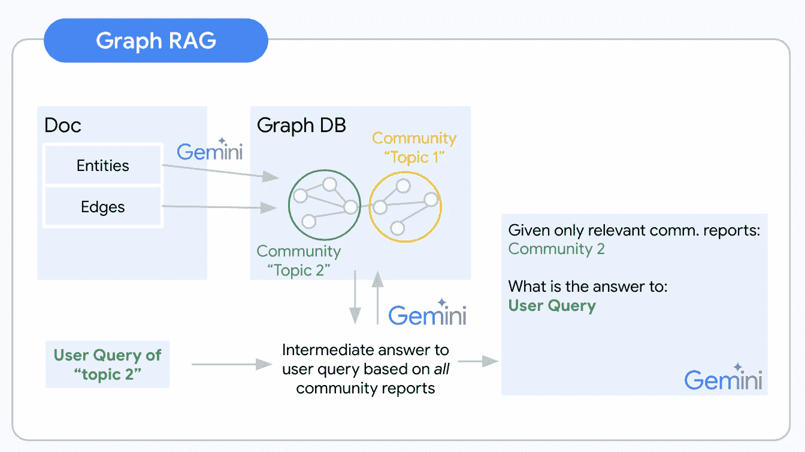
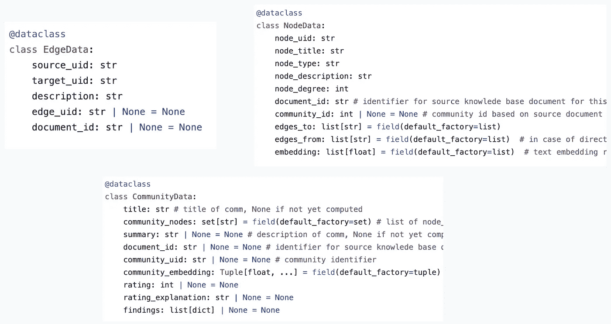

# 图结构 RAG — 概念介绍

> 原文：[`towardsdatascience.com/graph-rag-a-conceptual-introduction-41cd0d431375?source=collection_archive---------0-----------------------#2024-08-22`](https://towardsdatascience.com/graph-rag-a-conceptual-introduction-41cd0d431375?source=collection_archive---------0-----------------------#2024-08-22)

## 图结构 RAG 解答了文本嵌入无法帮助你解决的重大问题。

 [Jakob Pörschmann](https://jakobpoerschmann.medium.com/?source=post_page---byline--41cd0d431375--------------------------------)

·发表于 [Towards Data Science](https://towardsdatascience.com/?source=post_page---byline--41cd0d431375--------------------------------) ·阅读时间 8 分钟 ·2024 年 8 月 22 日

--

检索增强生成（RAG）自从 ChatGPT 的出现引爆了人工智能热潮以来，便主导了关于使生成式 AI 应用变得实用的讨论。这个理念很简单。一旦将大规模语言模型（LLMs）与我们的私人数据相连接，它们便变得尤为有用。一个人人都能访问的基础模型，结合我们的领域特定数据作为“秘密武器”，就会形成一个强大且独特的工具。就像在人类社会中一样，AI 系统似乎发展成了一个专家经济。通用知识是一个有用的基础，但专家知识则能够发挥 AI 系统的独特卖点。

*总结：RAG 本身并没有描述任何特定的架构或方法。它只是展示了如何通过任意检索方法增强给定的生成任务。原始的 RAG 论文（*[*Retrieval-Augmented Generation for Knowledge-Intensive NLP Tasks by Lewis et. al.*](https://arxiv.org/abs/2005.11401)*) 比较了双塔嵌入方法与词袋检索方法。*

# 本地和全局问题

基于文本嵌入的检索已经在许多场合中得到了描述。它已经使我们的 LLM 应用程序能够极为可靠地基于给定知识库的内容回答问题。Text2Vec 检索的核心优势仍然是：从嵌入的知识库中提取一个给定事实，并使用该提取的事实来构造对用户查询的回答。然而，文本嵌入搜索也面临着重大挑战。通常，每个文本嵌入表示来自非结构化数据集的一个特定块。最近邻搜索找到的嵌入代表了与用户查询语义相似的块。这也意味着搜索是语义上的，但仍然非常具体。因此，候选答案的质量在很大程度上依赖于查询的质量。此外，嵌入表示的是知识库中提到的内容。这并不代表你在寻找那些需要跨文档或在文档内跨概念抽象的问题的情况。

例如，假设有一个知识库，其中包含所有过去诺贝尔和平奖得主的简历。向 Text2Vec-RAG 系统提问“谁赢得了 2023 年诺贝尔和平奖？”是一个很容易回答的问题。这个事实在嵌入的文档块中得到了很好的表示。因此，最终的答案可以基于正确的上下文得出。另一方面，RAG 系统可能会在回答“过去十年最著名的诺贝尔和平奖得主是谁？”时遇到困难。如果我们添加更多的上下文信息，比如“谁是过去十年中在中东冲突中作出突出贡献的诺贝尔和平奖得主？”我们可能会成功，但即使如此，仅凭文本嵌入（考虑到当前嵌入模型的质量）仍然难以完全解决这个问题。另一个例子是整个数据集推理。例如，用户可能会对你的 LLM 应用程序提出问题：“最近的诺贝尔和平奖得主支持的前三大议题是什么？”嵌入的文档块不允许跨文档推理。我们的最近邻搜索在知识库中寻找特定提到“最近的诺贝尔和平奖得主支持的前三大议题”的内容。如果知识库中没有包含这一内容，任何完全基于文本嵌入的 LLM 应用程序都将面临困难，并且很可能无法正确甚至全面地回答这个问题。

我们需要一种替代的检索方法，使我们能够回答这些“全局”的汇总性问题，除了“局部”的提取性问题之外。**欢迎使用图形 RAG！**

知识图谱是一种半结构化的、层次化的信息组织方法。一旦信息被组织为图谱，我们不仅可以推断出特定节点的信息，还可以推断出它们的关系和邻居。图谱结构使得对全球数据集层面的推理成为可能，因为节点和它们之间的连接可以跨越不同的文档。有了这个图谱，我们还可以分析邻近的节点和更紧密连接的节点社区，这些节点之间的联系比它们与其他节点的联系更为紧密。一个节点的社区可以大致覆盖一个感兴趣的主题。通过抽象社区节点及其连接，我们可以对该主题中的概念有一个抽象的理解。图谱 RAG 利用对知识图谱中社区的理解，来为特定用户查询提供上下文。

一个图谱 RAG 管道通常会遵循以下步骤：

1.  图谱提取

1.  图谱存储

1.  社区检测

1.  社区报告生成

1.  最终上下文构建的映射归约

图谱 RAG 逻辑可视化 — 来源：作者提供的图片

# 图谱提取

建立我们非结构化知识库的抽象理解的过程始于提取构建知识图谱的节点和边。你可以通过一个大型语言模型（LLM）自动化这个提取过程。此步骤的最大挑战是决定哪些概念和关系是相关的，值得包括在内。为了举一个例子来说明这个高度模糊的任务：假设你正在从一篇关于沃伦·巴菲特的文档中提取知识图谱。你可以提取他的持股、出生地以及许多其他事实作为实体，并附上相应的边。这些信息很可能对你的用户来说是高度相关的。（如果文档内容合适）你也可以提取他在最后一次董事会会议上领带的颜色。这些信息（很可能）对用户来说是无关的。至关重要的是，需要根据应用程序的使用场景和领域来指定提取提示。这是因为提示将决定从非结构化数据中提取哪些信息。例如，如果你有兴趣提取有关人的信息，你需要使用与提取公司信息不同的提示。

指定提取提示的最简单方法是通过[多轮提示](https://cloud.google.com/vertex-ai/generative-ai/docs/learn/prompts/few-shot-examples)。这涉及给 LLM 多个期望的输入和输出示例。例如，你可以给 LLM 一系列关于人物的文档，并要求它提取每个人的姓名、年龄和职业。LLM 随后会学会从新文档中提取这些信息。指定提取提示的更高级方法是通过 LLM 微调。这涉及在包含期望输入和输出示例的数据集上训练 LLM。这可能比多轮提示带来更好的表现，但也更耗时。

[这是微软的 graphrag 提取提示](https://github.com/microsoft/graphrag/blob/main/graphrag/index/graph/extractors/graph/prompts.py)。

# 图存储

你设计了一个可靠的提取提示并调整了你的 LLM。你的提取管道正常工作。接下来，你需要考虑如何存储这些结果。图数据库（DB）如 Neo4j 和 Arango DB 是直接的选择。然而，增加另一种数据库类型并学习一种新的查询语言（例如 Cypher/Gremlin）可能会非常耗时。从我的高层研究来看，目前没有很好的无服务器选项可用。如果处理大多数图数据库的复杂性还不够，这最后一个问题对我这种无服务器爱好者来说简直是致命的。不过，还是有替代方案的。通过一点创意，使用合适的数据模型，图数据可以被格式化为半结构化，甚至是严格结构化的数据。为了激发你的灵感，[我编写了 graph2nosql 作为一个简单的 Python 接口，用于在你最喜欢的 NoSQL 数据库中存储和访问你的图数据集](https://github.com/jakobap/graph2nosql)。

数据模型定义了节点、边和社区的格式。将这三者存储在不同的集合中。每个节点、边和社区最终通过唯一标识符（UID）进行识别。Graph2nosql 然后实现了在处理知识图时所需的几个基本操作，如添加/删除节点/边、可视化图、检测社区等。

graph2nosql 数据模型 — 来源：作者提供的图片

# 社区检测

一旦图被提取并存储，下一步就是识别图中的社区。社区是比其他节点更紧密连接的节点集群。可以使用各种社区检测算法来完成此任务。

一种流行的社区检测算法是 Louvain 算法。Louvain 算法通过迭代地将节点合并为社区，直到满足某个停止准则。停止准则通常基于图的模块度。模块度是衡量图如何被划分为社区的指标。

**其他流行的社区检测算法包括：**

+   Girvan-Newman 算法

+   快速展开算法

+   Infomap 算法

# 社区报告生成

现在，使用结果社区作为生成社区报告的基础。社区报告是每个社区内节点和边缘的总结。这些报告可以用来理解图结构，并识别知识库中的关键主题和概念。在知识图中，每个社区都可以理解为代表一个“主题”。因此，每个社区可能是回答不同类型问题的有用上下文。

除了总结多个节点的信息外，社区报告还是跨概念和文档的第一个抽象层次。一个社区可以跨越由多个文档添加的节点。这样，你就在构建一个关于已索引知识库的“全局”理解。例如，在你的诺贝尔和平奖获奖者数据集中，你可能提取了一个社区，代表所有与节点“诺贝尔和平奖”通过边缘描述“获奖者”连接的“人物”类型的节点。

来自微软图 RAG 实现的一个好点子是“发现”。在一般的社区总结之上，这些发现是关于社区的更详细的见解。例如，对于包含所有历史诺贝尔和平奖获奖者的社区，一个发现可能是连接他们大部分行动主义的某些主题。

就像图提取一样，社区报告生成的质量将高度依赖于领域和用例的适应程度。为了创建更准确的社区报告，可以使用多次提示或 LLM 微调。

[这里是微软图 graphrag 社区报告生成提示](https://github.com/microsoft/graphrag/blob/main/graphrag/index/graph/extractors/community_reports/prompts.py)。

# Map Reduce 用于最终上下文构建

在查询时，你使用 Map-Reduce 模式首先生成中间响应和最终响应。

在映射步骤中，你将每个社区-用户查询对结合起来，并使用给定的社区报告生成用户查询的答案。除了这个中间响应之外，你还会请求 LLM 评估给定社区报告作为用户查询的上下文相关性。

在归约步骤中，你将对生成的中间响应的相关性评分进行排序。排名前 k 的相关性评分代表回答用户查询的感兴趣社区。相应的社区报告，可能结合节点和边缘信息，构成最终 LLM 提示的上下文。

# 结语：这将走向何方？

在知识库问答任务中，Text2vec RAG 存在明显的空白。**图形 RAG 可以弥补这些空白，而且做得非常好！** 通过生成社区报告的额外抽象层为你的知识库提供了重要的见解，并建立了其语义内容的全球理解。这将为团队节省大量筛选文档中特定信息的时间。如果你正在构建一个 LLM 应用程序，它将使你的用户能够提出真正重要的大问题。你的 LLM 应用程序将突然能够“预见”问题的本质，理解用户数据中的情况，而不仅仅是从中引用内容。

另一方面，一个图形 RAG 管道（如本文所述的原始形式）比 text2vec RAG 管道需要更多的 LLM 调用。特别是社区报告和中间答案的生成是潜在的薄弱环节，这将花费大量的资金和延迟。

正如在搜索领域中经常出现的情况一样，你可以预期，围绕先进 RAG 系统的行业将朝着混合方法发展。针对特定查询使用合适的工具将是扩展 RAG 应用程序时至关重要的。例如，可以想象使用一个分类层来区分本地和全球查询。也许生成社区报告和发现就足够了，将这些报告作为抽象的知识加入到你的索引中，作为上下文候选项就足够了。

幸运的是，完美的 RAG 管道尚未解决，你的实验将成为解决方案的一部分。我很想听听你的进展如何！
