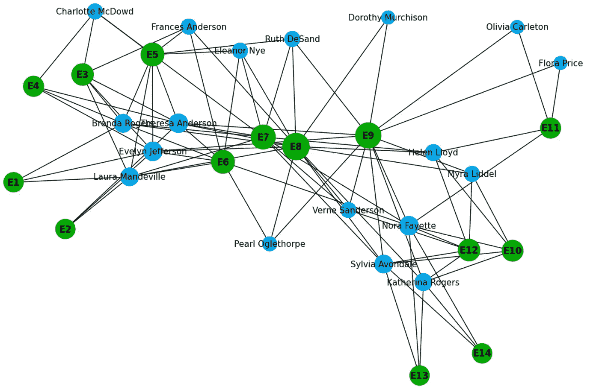

# 图形可视化：从简单到高级的 7 个步骤

> 原文：[`towardsdatascience.com/graph-visualization-7-steps-from-easy-to-advanced-4f5d24e18056?source=collection_archive---------1-----------------------#2024-06-15`](https://towardsdatascience.com/graph-visualization-7-steps-from-easy-to-advanced-4f5d24e18056?source=collection_archive---------1-----------------------#2024-06-15)

## 使用 Python、NetworkX 和 D3.JS 制作可视化

[](https://dmitryelj.medium.com/?source=post_page---byline--4f5d24e18056--------------------------------)[](https://towardsdatascience.com/?source=post_page---byline--4f5d24e18056--------------------------------) [Dmitrii Eliuseev](https://dmitryelj.medium.com/?source=post_page---byline--4f5d24e18056--------------------------------)

·发表于[Towards Data Science](https://towardsdatascience.com/?source=post_page---byline--4f5d24e18056--------------------------------) ·阅读时间 9 分钟 ·2024 年 6 月 15 日

--



Davis 的南方俱乐部图，图像来源于作者

有些数据类型，如社交网络或知识图谱，可以“本地”以图形形式表示。可视化这类数据可能具有挑战性，而且没有通用的解决方案。在本文中，我将展示使用开源[NetworkX](https://github.com/networkx/networkx)库进行图形可视化的几个步骤。

让我们开始吧！

## 基本示例

如果我们想在 Python 中使用图形，[NetworkX](https://github.com/networkx/networkx)可能是最受欢迎的选择。它是一个用于网络分析的开源 Python 包，包含了各种算法和强大的功能。如我们所知，每个图形包含节点（顶点）和边；我们可以轻松地在 NetworkX 中创建一个简单的图形：

```py
import networkx as nx

G = nx.Graph()
G.add_node("A")
G.add_node("B")
G.add_edge("A", "B")
...
```

然而，以这种方式创建一个大型图形可能会很繁琐，本文中，我将使用 NetworkX 库中包含的“Davis 的南方俱乐部妇女”图（3 条款 BSD 许可证）。这些数据由 A. Davis 等人于 1930 年代收集（A. Davis，1941，Deep South，芝加哥：芝加哥大学出版社）。它代表了 18 位南方女性参加 14 个社交活动的观察数据。让我们加载……
