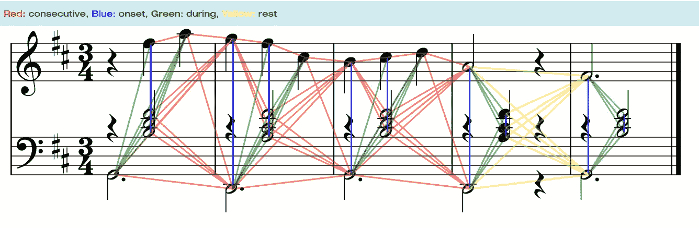

# GraphMuse：一个用于符号音乐图形处理的 Python 库

> 原文：[`towardsdatascience.com/graphmuse-a-python-library-for-symbolic-music-graph-processing-40dbd9baf319?source=collection_archive---------3-----------------------#2024-10-17`](https://towardsdatascience.com/graphmuse-a-python-library-for-symbolic-music-graph-processing-40dbd9baf319?source=collection_archive---------3-----------------------#2024-10-17)

## 是的，音乐和图形确实能结合！

[](https://manoskary.medium.com/?source=post_page---byline--40dbd9baf319--------------------------------)[](https://towardsdatascience.com/?source=post_page---byline--40dbd9baf319--------------------------------) [Emmanouil Karystinaios](https://manoskary.medium.com/?source=post_page---byline--40dbd9baf319--------------------------------)

·发表于[Towards Data Science](https://towardsdatascience.com/?source=post_page---byline--40dbd9baf319--------------------------------) ·11 分钟阅读·2024 年 10 月 17 日

--


图片由 Dall-E 3 生成

在这篇文章中，我们将介绍我最近的一篇论文和开源软件：GraphMuse Python 库。

但在深入讨论之前，让我向你介绍一些符号音乐处理的基础知识。

> **故事继续...**

符号音乐处理主要是指从乐谱中提取信息。符号一词指的是任何形式的乐谱或记谱法中所包含的符号。乐谱可以包含多种元素，除了音符外，还可能包括拍号、调号、演奏标记、力度标记等。乐谱可以存在于多种格式中，如 MIDI、MusicXML、MEI、Kern、ABC 等。

近年来，图神经网络（GNNs）变得越来越流行，并在许多领域取得了成功，从生物网络到推荐系统，再到音乐分析。在音乐分析领域，GNNs 已被用于解决和声分析、乐句分割和声部分离等任务。

这个想法很简单：乐谱中的每个音符是图中的一个顶点，边则由音符之间的时间关系定义，如下图所示。



这些边分为 4 类：

+   同时开始的音符通过“起始”边（蓝色）连接

+   在另一个音符的开始或结束处开始的音符通过“连续”边（红色）连接

+   在另一个音符的开始和结束之间开始的音符通过“期间”边（绿色）连接

+   最后，每当有静音时，所有的最后音符结尾都会通过“静音”边（黄色）连接到接下来的第一个音符。

这种最小化的图建模保证了乐谱从头到尾始终连通，不会出现任何断开的子图。

# 什么是 GraphMuse

GraphMuse 是一个用于训练和应用深度图模型进行音乐分析的 Python 库，专门针对乐谱。

GraphMuse 包含用于符号音乐处理的加载器、模型和工具，基于图神经网络（GNNs）。它建立在 *PyTorch* 和 *PyTorch Geometric* 之上，提供更多的灵活性和互操作性。

PyTorch 是一个开源的机器学习库，可以高效地构建深度学习模型，并支持 GPU 加速。*PyTorch Geometric* 是一个基于 PyTorch 的库，旨在轻松编写和训练图神经网络（GNNs），并应用于广泛的领域。

最后，GraphMuse 提供了将乐谱转化为图形的功能。图形创建通过 C 语言实现，并提供 Python 绑定，以加速图形构建，比之前基于 numpy 的实现速度提高了最多 300 倍。

# 科学基础

图形已经被频繁用于分析和表示音乐。举几个例子，Tonnetz、Schenkerian 分析以及树形结构分析是一些著名的例子。图形的优势在于，它们可以通过边的设计，使用相同的表示法同时捕捉音乐的层次性和顺序性。

基于图形的符号音乐处理使用 GNNs 是在 2021 年随着从乐谱生成表现模型而出现的。从那时起，许多图形模型相继问世，其中一些已经成为音乐分析任务的最先进方法，直到本文发布为止。

那么，既然我已经阐明了图形的必要性，让我们面对设计和训练符号音乐图模型的复杂性。

图形和音乐的主要复杂性在于，音乐作品的长度并不总是相同的，而由它们生成的图形大小也不相同。它们的大小可能会有显著差异：例如，一首巴赫的圣歌可能只有 200 个音符，而一首贝多芬的奏鸣曲可能有超过 5000 个音符。在我们的图形中，音符的数量与每个乐谱图中顶点的数量直接对应。

在乐谱图上高效快速地训练并非易事，它需要一种采样方法，可以最大化计算资源的使用，既包括内存，也包括时间，同时不降低模型的性能，有时甚至能提高性能。

在训练过程中，采样涉及将来自不同得分的图组合成一个新图，计算机科学中通常称之为“批次”。然后将每个批次输入到 GNN 模型中，计算损失。这个损失用于反向传播并更新模型的参数。这一单次迭代称为一个训练步骤。为了优化模型，这个过程会重复多次，直到训练收敛，理想情况下模型达到最佳性能。

这一切听起来很复杂，但不要绝望，因为 GraphMuse 可以为你处理这一部分！！

# GraphMuse 的内部工作原理


GraphMuse 中符号化音乐得分的图处理/训练管道一般包括以下步骤：

1.  预处理得分数据库以生成输入图，GraphMuse 可以为你快速且轻松地完成这一步；

1.  对输入图进行采样以创建内存高效的批次，再次强调，GraphMuse 会为你处理这一切；

1.  将多个采样输入图中的节点和边组合形成一个新图作为一个批次；对于每个图，选择一组节点，我们称之为*目标节点*。目标节点的邻居也可以按需获取，这一过程叫做按节点采样。

1.  通过图卷积更新目标节点的表示，以创建节点嵌入。GraphMuse 提供了一些可以使用的模型，另外 PyTorch Geometric 也可以是你的好帮手；

1.  将这些嵌入用于特定任务的应用。这个部分由你来处理，但我相信你一定能做得很好！

请注意，目标节点可能包括所有或部分批次节点，具体取决于采样策略。

现在，既然这个过程已经图示化解释了，我们来更仔细地看看 GraphMuse 如何处理从每个得分中采样音符。


上图：采样音符及其邻居；中图：得分图和采样过程；下图：节拍和小节的采样过程。

**每个得分的采样过程。**

1.  首先随机选择一个音符（黄色）进行采样。

1.  然后计算目标音符的边界，在这个示例中，预算为 15 个音符（粉色和黄色音符）。

1.  然后为目标节点获取 k-hop 邻居（浅蓝色为 1-hop，深蓝色为 2-hop）。k-hop 邻居是相对于输入图计算的（如上图所示，颜色边连接音符头）。

1.  我们还可以扩展采样过程，以包括节拍和小节元素。请注意，k-hop 邻居不一定与时间窗口严格相关。

为了最大化计算资源（即内存），上述过程会对多个得分同时重复，以创建一个批次。使用这个过程，GraphMuse 确保每个采样段都将具有相同大小的目标音符。每个采样段可以组合成一个新的图，其大小最多为*#_scores* x *#_target_notes*。这个新图构成当前训练步骤的批次。

# 使用 GraphMuse 的实践

在动手操作部分，让我们尝试使用 GraphMuse 并应用一个音高拼写模型。音高拼写任务是指当乐谱中缺少音符名称和变音符时推断出它们的正确拼写。一个应用实例是，当我们拥有量化的 MIDI 文件并希望生成像下图中的乐谱时：


MIDI 文件是输入（顶部），而音乐乐谱是期望的输出（底部）。

在安装 GraphMuse 之前，你需要先安装 PyTorch 和 PyTorch Geometric。请查看适合你系统的版本，链接在[***这里***](https://pytorch.org/get-started/locally/)和[***这里***](https://pytorch-geometric.readthedocs.io/en/latest/install/installation.html)。

完成此步骤后，打开你喜欢的终端并输入以下命令来安装 GraphMuse：

```py
pip install graphmuse
```

安装完成后，让我们从 URL 读取一个 MIDI 文件并使用 GraphMuse 创建乐谱图。

```py
import graphmuse as gm

midi_url_raw = "https://github.com/CPJKU/partitura/raw/refs/heads/main/tests/data/midi/bach_midi_score.mid"
graph = gm.load_midi_to_graph(midi_url_raw)
```

底层过程使用 Partitura 读取文件，然后将其传递给 GraphMuse。

为了训练我们的模型处理音高拼写，我们首先需要一个已标注音高拼写的音乐乐谱数据集。为此，我们将使用 ASAP 数据集（遵循[CC BY-NC-SA 4.0](https://creativecommons.org/licenses/by-nc-sa/4.0/)许可协议），它将作为我们模型学习的基础。要获取 ASAP 数据集，你可以通过 git 下载或[直接从 github 下载](https://github.com/cpjku/asap-dataset)：

```py
git clone https://github.com/cpjku/asap-dataset.git
```

ASAP 数据集包括各种古典钢琴曲目的乐谱和演奏数据。对于我们的用例，我们将仅使用以`.musicxml`结尾的乐谱文件。

在加载此数据集时，我们需要两个必要的工具：一个用于编码音高拼写，另一个用于处理调号信息，这两个工具将被转换为数字标签。幸运的是，这些工具可以在 GraphMuse 中预构建的音高拼写模型中找到。让我们开始导入所有必需的包，并加载第一个乐谱文件以开始。

```py
import graphmuse as gm
import partitura as pt
import os
import torch
import numpy as np

# Directory containing the dataset, change this to the location of your dataset
dataset_dir = "/your/path/to/the/asap-dataset"

# Find all the score files in the dataset (they are all named 'xml_score.musicxml')
score_files = [os.path.join(dp, f) for dp, dn, filenames in os.walk(dataset_dir) for f in filenames if f == 'xml_score.musicxml']

# Use the first 30 scores, change this number to use more or less scores
score_files = score_files[:30]

# probe the first score file
score = pt.load_score(score_files[0])
# Extract features and note array
features, f_names = gm.utils.get_score_features(score)
na = score.note_array(include_pitch_spelling=True, include_key_signature=True)
# Create a graph from the score features
graph = gm.create_score_graph(features, score.note_array())

# Get input feature size and metadata from the first graph
in_feats = graph["note"].x.shape[1]
metadata = graph.metadata()

# Create a model for pitch spelling prediction
model = gm.nn.models.PitchSpellingGNN(
    in_feats=in_feats, n_hidden=128, out_feats_enc=64, n_layers=2, metadata=metadata, add_seq=True
)

# Create encoders for pitch and key signature labels
pe = model.pitch_label_encoder
ke = model.key_label_encoder
```

接下来，我们将从数据集中加载剩余的乐谱文件，以继续为模型训练准备数据。

```py
# Initialize lists to store graphs and encoders
graphs = []

# Process each score file
for score_file in score_files:
    # Load the score
    score = pt.load_score(score_file)

    # Extract features and note array
    features, f_names = gm.utils.get_score_features(score)
    na = score.note_array(include_pitch_spelling=True, include_key_signature=True)

    # Encode pitch and key signature labels
    labels_pitch = pe.encode(na)
    labels_key = ke.encode(na)

    # Create a graph from the score features
    graph = gm.create_score_graph(features, score.note_array())

    # Add encoded labels to the graph
    graph["note"].y_pitch = torch.from_numpy(labels_pitch).long()
    graph["note"].y_key = torch.from_numpy(labels_key).long()

    # Append the graph to the list
    graphs.append(graph) 
```

一旦图结构准备好，我们就可以继续创建数据加载器，GraphMuse 已经方便地提供了这一功能。在此阶段，我们还将定义标准的训练组件，如损失函数和优化器，以引导学习过程。

```py
# Create a DataLoader to sample subgraphs from the graphs
loader = gm.loader.MuseNeighborLoader(graphs, subgraph_size=100, batch_size=16, num_neighbors=[3, 3])

# Define loss functions for pitch and key prediction
loss_pitch = torch.nn.CrossEntropyLoss()
loss_key = torch.nn.CrossEntropyLoss()

# Define the optimizer
optimizer = torch.optim.Adam(model.parameters(), lr=0.001)
```

让我再多说一点关于*gm.loader.MuseNeighborLoader*的内容。它是 GraphMuse 中的核心数据加载器，包含了前一节中提到的采样方法。*subgraph_size*指的是每个输入图的目标节点数量，*batch_size*是每批次采样的图的数量，最后，*num_neighbors*指的是每一层中每个采样节点的邻居数。

一切就绪后，我们终于可以开始训练模型了。让我们深入并开始训练过程吧！

```py
 # Train the model for 5 epochs
for epoch in range(5):
    loss = 0
    i = 0
    for batch in loader:
        # Zero the gradients
        optimizer.zero_grad()

        # Get neighbor masks for nodes and edges for more efficient training
        neighbor_mask_node = {k: batch[k].neighbor_mask for k in batch.node_types}
        neighbor_mask_edge = {k: batch[k].neighbor_mask for k in batch.edge_types}

        # Forward pass through the model
        pred_pitch, pred_key = model(
            batch.x_dict, batch.edge_index_dict, neighbor_mask_node, neighbor_mask_edge,
            batch["note"].batch[batch["note"].neighbor_mask == 0]
        )

        # Compute loss for pitch and key prediction
        loss_pitch_val = loss_pitch(pred_pitch, batch["note"].y_pitch[batch["note"].neighbor_mask == 0])
        loss_key_val = loss_key(pred_key, batch["note"].y_key[batch["note"].neighbor_mask == 0])

        # Total loss
        loss_val = loss_pitch_val + loss_key_val

        # Backward pass and optimization
        loss_val.backward()
        optimizer.step()

        # Accumulate loss
        loss += loss_val.item()
        i += 1

    # Print average loss for the epoch
    print(f"Epoch {epoch} Loss {loss / i}")
```

希望我们很快能看到损失函数下降，这是模型有效学习音高拼写的积极信号。希望一切顺利！


# 为什么选择 GraphMuse？

GraphMuse 是一个框架，旨在简化符号音乐处理中的图形模型训练和部署。

对于那些想要重新训练、部署或微调先前最先进的符号音乐分析模型的人，GraphMuse 包含了一些必要的组件，可以帮助你更快速、更高效地重建和重新训练模型。

GraphMuse 通过其简单性保持灵活性，适合那些希望原型设计、创新和设计新模型的人。它旨在提供一套简单的工具，而不是包含复杂的链式流程，以避免阻碍创新过程。

对于那些想要学习、可视化并获得实践经验的人，GraphMuse 非常适合入门。它提供了一个简洁的介绍，通过几行代码就能掌握基本功能和流程。GraphMuse 还与[MusGViz](https://github.com/fosfrancesco/musgviz/)相连接，可以轻松地将图形和乐谱一起可视化。

# 限制与未来计划

我们无法谈论任何项目的积极方面而不讨论其消极方面。

GraphMuse 是一个新兴的项目，目前仍相当简单。它专注于覆盖图形学习的核心部分，而不是成为一个涵盖所有可能性的完整框架。因此，它仍然在许多上述流程的部分中，更多地关注基于用户的实现。

像所有开发中的开源项目一样，GraphMuse 需要帮助才能成长。因此，如果你发现漏洞或想要更多功能，请随时报告、请求或贡献到 GraphMuse 的 GitHub 项目中。

最后但同样重要的是，GraphMuse 使用了如 torch-sparse 和 torch-scatter 等 C 库，并拥有自己的 C 绑定，以加速图形创建，因此安装并非总是很简单。根据我们的用户测试和交互报告，Windows 的安装相对更具挑战性，但并非不可能（我自己就是在 Windows 上运行的）。

未来计划包括：

+   简化安装过程；

+   为精确任务增加更多对模型和数据加载器的支持；

+   扩大 GraphMuse 的开源社区，让图形编码在音乐领域持续增长。

# 结论

GraphMuse 是一个 Python 库，使得处理音乐图形变得更加容易。它专注于基于图形的音乐模型的训练，但也旨在在研究项目需要时保持灵活性。

如果你想支持 GraphMuse 的开发和未来成长，请在[这里](https://github.com/manoskary/graphmuse)给这个仓库点个星。

祝你愉快地进行图形编码！！

[](https://github.com/manoskary/graphmuse?source=post_page-----40dbd9baf319--------------------------------) [## GitHub - manoskary/graphmuse: A Graph Deep Learning Library for Music.

### 一款用于音乐的图谱深度学习库。通过创建一个账户来为 manoskary/graphmuse 的开发做出贡献…

github.com](https://github.com/manoskary/graphmuse?source=post_page-----40dbd9baf319--------------------------------)

[所有图片均由作者提供]
