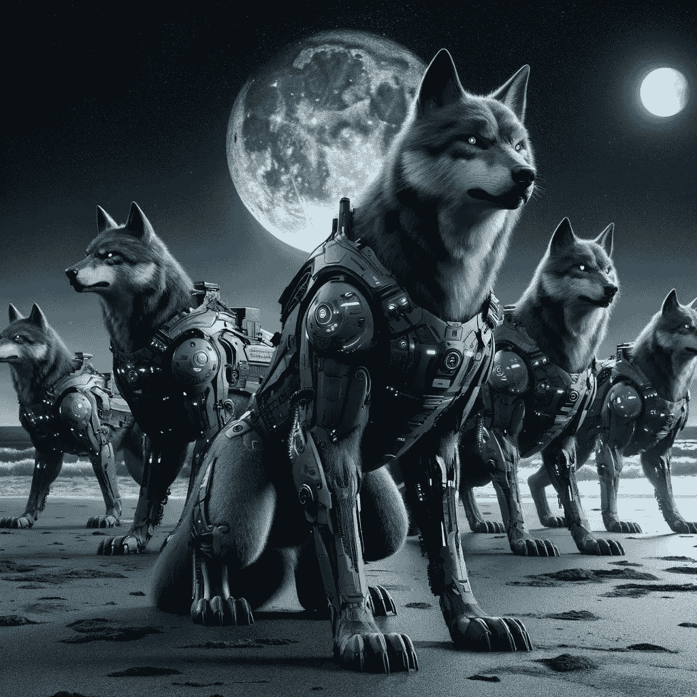

# 灰狼优化器——它如何与计算机视觉结合使用

> 原文：[`towardsdatascience.com/grey-wolf-optimizer-how-it-can-be-used-with-computer-vision-234d051a52ae?source=collection_archive---------1-----------------------#2024-02-23`](https://towardsdatascience.com/grey-wolf-optimizer-how-it-can-be-used-with-computer-vision-234d051a52ae?source=collection_archive---------1-----------------------#2024-02-23)

## 作为额外内容，获取适用于任何地方的特征提取代码

 [James Koh, PhD](https://medium.com/@byjameskoh?source=post_page---byline--234d051a52ae--------------------------------)

·发表于[Towards Data Science](https://towardsdatascience.com/?source=post_page---byline--234d051a52ae--------------------------------) ·10 分钟阅读·2024 年 2 月 23 日

--

图像由 DALL·E 3 根据提示“画一群未来派的灰狼，在夜晚的海滩上”生成。

这是我系列自然启发式文章的最后一部分。之前，我谈到了受遗传学、群体、蜜蜂和[蚂蚁](https://medium.com/towards-data-science/ant-colony-optimization-intuition-code-visualization-9412c369be81?sk=bf102aa2302b881607f393ec0ec0f374)启发的算法。今天，我将谈谈狼。

当一篇期刊论文的引用量达到五位数时，你就知道这项工作背后有着重大的意义。灰狼优化器[1]（GWO）就是这样一个例子。

# 概述与动机

与粒子群优化（PSO）、人工蜂群（ABC）和蚁群优化（ACO）类似，灰狼优化器（GWO）也是一种元启发式算法。尽管对解决方案没有数学上的保证，但它在实践中表现良好，并且不需要对基础问题的任何分析性知识。这使我们能够从“黑箱”中查询数据，只需利用观察到的结果来优化我们的解决方案。

如我在 ACO 文章中提到的，所有这些最终都与探索-开发权衡的基本概念相关。那么，为什么会有这么多不同的元启发式算法呢？

首先，这是因为研究人员必须发表论文。他们工作的很大一部分涉及从不同的角度探索事物，并分享他们的研究方法…
