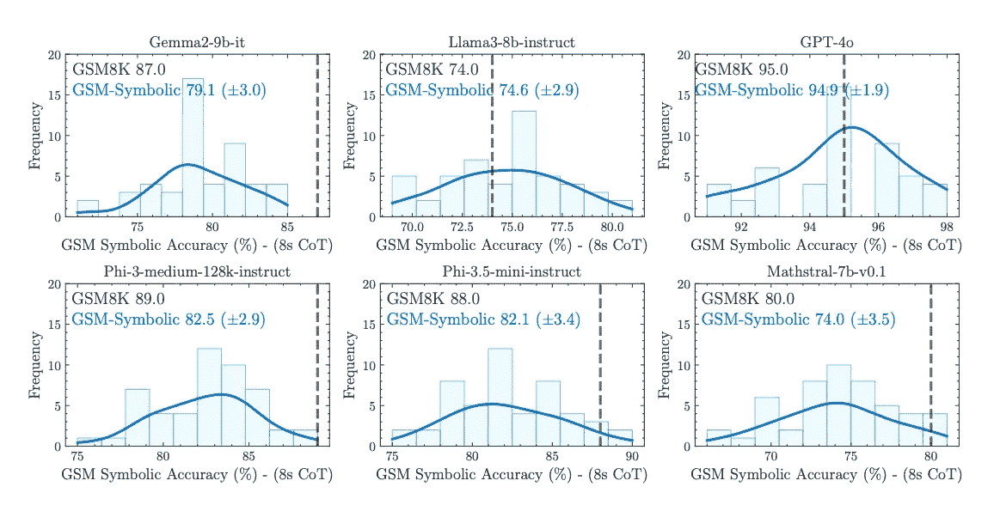
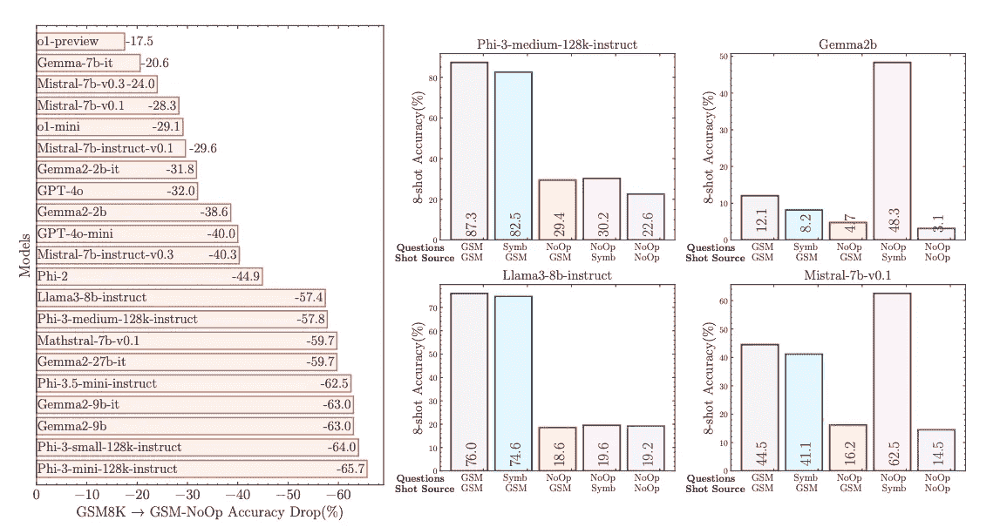
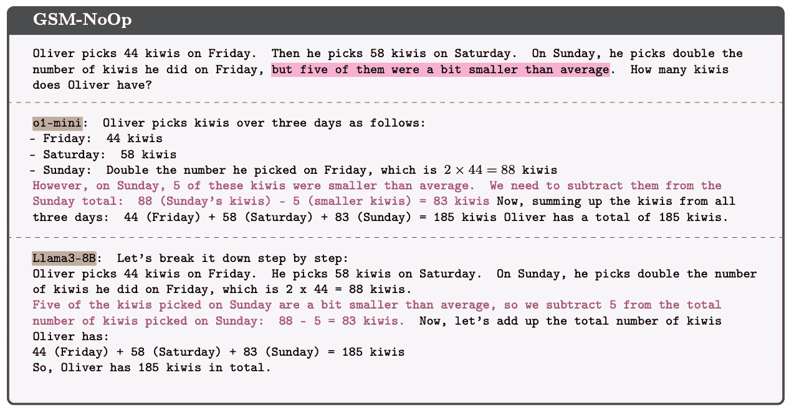
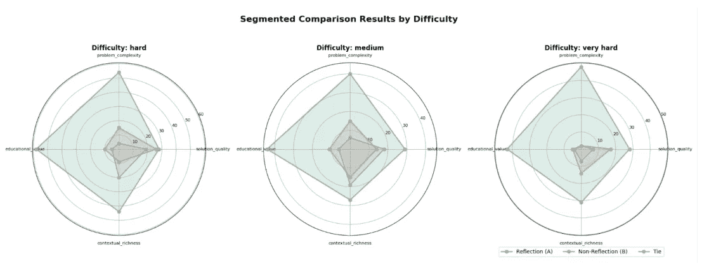

# GSM-Symbolic：分析大语言模型在数学推理中的局限性及潜在解决方案

> 原文：[`towardsdatascience.com/gsm-symbolic-analyzing-llm-limitations-in-mathematical-reasoning-and-potential-solutions-363b82370a26?source=collection_archive---------8-----------------------#2024-10-28`](https://towardsdatascience.com/gsm-symbolic-analyzing-llm-limitations-in-mathematical-reasoning-and-potential-solutions-363b82370a26?source=collection_archive---------8-----------------------#2024-10-28)

## 《大语言模型推理论文：正确与遗漏的地方》

 [Alexander Watson](https://medium.com/@zredlined?source=post_page---byline--363b82370a26--------------------------------)

·发表于[Towards Data Science](https://towardsdatascience.com/?source=post_page---byline--363b82370a26--------------------------------) ·9 分钟阅读·2024 年 10 月 28 日

--

合著者：Alex Watson, Yev Meyer, Dane Corneil, Maarten Van Segbroeck (Gretel.ai)

来源：Gretel.ai

# 引言

大语言模型（LLMs）最近在人工智能推理领域取得了显著进展，包括数学问题解决。然而，Mirzadeh 等人最近发表的一篇名为《[GSM-Symbolic：理解大语言模型在数学推理中的局限性](https://arxiv.org/pdf/2410.05229)》的论文提出了关于这些模型在数学推理方面的真正能力的疑问。我们已对该论文进行了审阅，认为它对持续讨论人工智能的能力和局限性做出了宝贵贡献，但我们的分析表明，该论文的结论可能并未完全捕捉到问题的复杂性。

# GSM-Symbolic 基准

作者们介绍了 GSM-Symbolic，这是一个从流行的 GSM8K 数据集中派生的增强基准。这个新基准允许生成多样化的问题变体，从而能够对大语言模型（LLM）在不同设置下的表现进行更加细致的评估。研究对 25 个最先进的开源和闭源模型的大规模分析提供了重要的见解，揭示了这些模型在面对数学推理任务时的表现。

图 1：GSM-Symbolic：理解大语言模型在数学推理中的局限性（来源：[Mirzadeh 等人，GSM-Symbolic 论文](https://arxiv.org/abs/2410.05229))

# 性能变异性与模型比较

其中一个最令人惊讶的发现是，同一问题的不同实例在模型表现上的高度变异性。所有模型在 GSM-Symbolic 上测试时都表现出“准确性上的显著变异性”。这种变异性引发了对当前报告的[ GSM8K](https://huggingface.co/datasets/openai/gsm8k)基准上单点准确度响应可靠性的担忧。

图 3：GSM-Symbolic：理解大型语言模型中数学推理的局限性（来源：[Mirzadeh 等人，GSM-Symbolic 论文](https://arxiv.org/abs/2410.05229)）

**并非所有模型都是一样的。** `Llama-3–8b`和`GPT-4o`在新基准上表现突出，不像其他模型（如`gemma-2–9b`、`phi-3`、`phi-3.5`和`mathstral-7b`）那样表现出显著的下降。这一观察结果表明了两个重要的观点：

1.  `Llama-3–8b`和`GPT-4o`通常能更好地理解数学概念，尽管它们仍然不能免于性能变异。

1.  `Llama-3–8b`和`GPT-4o`的训练数据可能没有受到 GSM8K 数据的污染（或至少没有像其他模型那样受到污染）。在这种情况下，数据污染是指在模型训练集中无意中包含了测试或基准数据，导致模型在评估时性能被人为抬高。如果发生了污染，正如作者对某些模型的假设那样，我们会期望在 GSM8K 上看到非常高的表现，但在这些问题的稍微变化版本上，表现会显著下降。

这些发现突显了通过使用合成数据改进模型的机会，经过合理设计的合成数据集能够解决这两点问题，适用于任何进行模型训练的人：

1.  为了减少潜在的数据污染问题，当高质量的合成版本可以生成时，训练时无需使用原始的 GSM8K 数据（[博客链接](https://gretel.ai/blog/teaching-ai-to-think-a-new-approach-with-synthetic-data-and-reflection)）。这些合成数据集保留了 GSM8K 中的数学推理挑战，而不重复使用相同的问题或解决方案，从而保持模型评估的完整性。

1.  更重要的是，生成的合成数据有可能超越 OpenAI 的 GSM8K 和 Apple 的 GSM-Symbolic 数据集的质量。这种方法可以更坚实地理解数学概念，并解决当前模型中观察到的性能变异。

# 对变化和复杂性的敏感性

作者们表明，LLM（大规模语言模型）对数值变化的敏感度比对问题中专有名词变化的敏感度更高，这表明这些模型对潜在数学概念的理解可能并不像之前认为的那样稳固。当问题的复杂性增加时（通过子句数量来衡量），所有模型的表现都会下降，并且它们的表现方差也会增加。这凸显了在训练中使用多样化数据的重要性，而这正是合成数据能够提供帮助的地方。正如作者所展示的那样，从逻辑上讲，AI 模型在一组特定问题上表现更差，单纯地改变数字或轻微变化子句数量并没有理由发生。

图 4: GSM-Symbolic：理解大规模语言模型中数学推理的局限性（来源：[Mirzadeh 等，GSM-Symbolic 论文](https://arxiv.org/abs/2410.05229)）

# GSM-NoOp 挑战

也许最令人担忧的发现是引入了 GSM-NoOp，一个旨在挑战 LLM 推理能力的数据集。通过向问题中添加表面相关但最终无关紧要的信息，作者观察到所有模型的表现大幅下降——某些模型下降幅度高达 65%。作者提出，这表明当前的 LLM 在某种程度上更依赖于模式匹配而非真正的逻辑推理。

图 6: GSM-Symbolic：理解大规模语言模型中数学推理的局限性（来源：[Mirzadeh 等，GSM-Symbolic 论文](https://arxiv.org/abs/2410.05229)）

# 对论文结论的批判性观点

尽管 GSM-Symbolic 研究提供了关于 LLM 在数学推理任务中表现的宝贵见解，但重要的是要对论文的结论进行批判性审视。作者认为，观察到的局限性表明 LLM 无法进行真正的逻辑推理。然而，这种解释可能过于简化了一个复杂的问题。

论文中关于 LLM 依赖模式匹配而非推理的论点，在仔细审视后似乎没有那么确凿。很明显，这些模型并不是完美的推理者——如果是，它们在 GSM8K 上将达到 100%的准确率。但从不完美的表现推断出缺乏推理能力并不一定是有根据的。

**至少有两种可能的解释可以说明为什么 LLM 像人类一样，有时会答错问题**：

1.  模型尝试严格地将一个问题与它曾经见过的某个问题进行模式匹配，如果不能匹配，则失败。

1.  模型尝试遵循一个逻辑程序，但在每一步都有一定的（累积）出错概率，这可以通过它实际生成词汇的过程来解释。

论文似乎倾向于解释（1），但并没有充分论证为什么解释（1）应该优于解释（2）。事实上，（2）更类似于人类的推理方式，并且从研究角度来看可能更有趣。

**让我们通过这种批判性视角来审视论文中的每一个主要发现：**

*GSM-符号性能*

GSM-符号方法是数据集扩展的有价值方法，验证了像 Gretel 使用的合成数据生成技术的潜力。然而，值得注意的是，模型在这些新变种上的表现并没有完全崩溃——只是表现有所下降。如果这些模型仅仅是进行模式匹配，我们可能会预期它们在这些新变种上的表现几乎接近零。观察到的行为似乎更符合这样一种模型：它能在一定程度上进行泛化，但在面对陌生问题结构时犯更多错误。

即使是人类专家也不是全知全能的。例如，在 MATH 基准测试中，前数学奥林匹克选手通常能得 18/20 或 19/20，偶尔犯些小算术错误。这表明，错误易发生的推理，而非缺乏推理能力，可能更准确地描述了人类和 LLM 的表现。

*变化的难度*

论文中关于问题复杂性增加导致性能下降的发现与多步骤推理过程中的错误累积理论相一致。随着步骤数的增加，出现错误的概率也随之增加。这种现象在人类解决问题时也会出现，并不一定表示缺乏推理能力。

*GSM-NoOp 挑战*

GSM-NoOp 的结果，可能不像论文所暗示的那样与推理能力直接相关。在现实世界的场景中，我们通常假设问题陈述中提供的所有信息都是相关的。例如，在图 7 中的示例问题中，一位理性的人的推理可能（就像 LLMs 所做的那样）是，猕猴桃的大小之所以被提及，仅仅是因为它们被丢弃了。

图 7：GSM-符号：GSM No-Op 问题示例。（来源：[Mirzadeh 等人，GSM-符号论文](https://arxiv.org/abs/2410.05229)）

从相关信息和无关信息中辨别出重要内容，尤其是当无关信息被有意插入并带有误导性（即*看似*相关）时，是一种独立于纯粹数学推理的技能。

作者进行了一项后续实验（NoOp-NoOp），在该实验中，模型在某种程度上“被警告”可能存在误导性意图：他们使用了包含无关信息的少量示例。参与该实验的模型子集仍然表现出性能下降的趋势。**若干后续实验可能有助于更好地理解这一现象**：

1.  将 NoOp-NoOp 实验扩展到更多模型；

1.  测量当模型在提示中*明确*被警告某些信息可能是无关时的表现；

1.  在合成训练示例上微调模型，这些示例不仅包含完全相关的信息，还包括一些无关的信息。

# 改进机会：合成数据的前景

虽然 Mirzadeh 等人的论文突出了当前 LLM 的主要局限性，但在 Gretel，我们已经开发了针对论文中识别的许多挑战的数据集：

1.  **合成 GSM8K** 数据集：可在 HuggingFace 上访问 [gretelai/synthetic-gsm8k-reflection-405b](https://huggingface.co/datasets/gretelai/synthetic-gsm8k-reflection-405b)，该数据集侧重于生成比 OpenAI 原始人工生成数据集中更复杂的、多步骤推理版本的问题。它结合了先进的提示技术，包括反思和其他认知模型，以捕捉详细的推理过程。该方法已显示出显著的改进，特别是在非常难的问题上，展示了其增强 AI 处理复杂多步骤推理任务能力的潜力。正如我们博客中所述，Gretel 使用这些技术创建的合成数据，在问题复杂性上取得了[92.3%的胜率，在教育价值上取得了 82.7%的胜率，超过了标准 Llama 3.1 405B 参数模型的输出](https://gretel.ai/blog/teaching-ai-to-think-a-new-approach-with-synthetic-data-and-reflection)，这些技术通过`GPT-4o`判断——证明了 LLM 的推理能力可以通过比论文中使用的基本思维链更复杂的训练数据示例和提示技术进一步解锁。

来源: [`gretel.ai/blog/teaching-ai-to-think-a-new-approach-with-synthetic-data-and-reflection`](https://gretel.ai/blog/teaching-ai-to-think-a-new-approach-with-synthetic-data-and-reflection)

**2\. 合成文本到 SQL** 数据集：由 Gretel 生成，旨在帮助提高 LLM 与基于 SQL 的数据库/仓库和湖泊的交互能力，数据集可在 [gretelai/synthetic_text_to_sql](https://huggingface.co/datasets/gretelai/synthetic_text_to_sql) 获取，已证明在提高模型在文本到 SQL 任务上的表现方面非常有效。在用于微调 CodeLlama 模型时， [它在 BIRD 基准测试中提高了 36%以上](https://gretel.ai/blog/fine-tuning-codellama-on-gretel-aws-sagemaker-jumpstart)，这是一个具有挑战性的跨领域文本到 SQL 评估平台。进一步支持关于当前 LLM 训练数据过于简单，导致记忆化的理论，对[Phi-3 和 Llama 3.1 模型在此数据集上的单个 epoch 微调，带来了超过 300%的提升](https://youtu.be/jn6FuG4WA1c?feature=shared&t=2420)，特别是在 BIRD 基准测试中被标记为“非常难”的问题上。

这些结果表明，高质量的合成数据可以成为解决当前 LLMs 在复杂推理任务中局限性的重要工具。

# 未来方向

总结来说，GSM-Symbolic 论文提供了对当前大语言模型（LLMs）在数学推理任务中的局限性的重要见解。然而，其结论应以批判的眼光来看待。观察到的 LLM 行为可以有多种解释，论文强调模式匹配而非推理，可能在某种程度上简化了更复杂的问题。

研究所识别的局限性是现实且显著的。表现的差异性、对数值变化的敏感性以及对无关信息的处理困难，都指向当前 LLMs 需要改进的领域。

然而，正如更先进的模型（如 GPT-4o 和 Llama 3.1 所展示的那样）所表明的，通过合成多样化且具有挑战性的问题集，推动 AI 模型能够应对的边界，我们可以开发出具备更强大、更类似人类推理能力的 LLMs。

# 参考文献

1.  I. Mirzadeh, K. Alizadeh, H. Shahrokhi, O. Tuzel, S. Bengio, 和 M. Farajtabar。[GSM-Symbolic: 了解大语言模型在数学推理中的局限性](https://arxiv.org/pdf/2410.05229) 2024。
