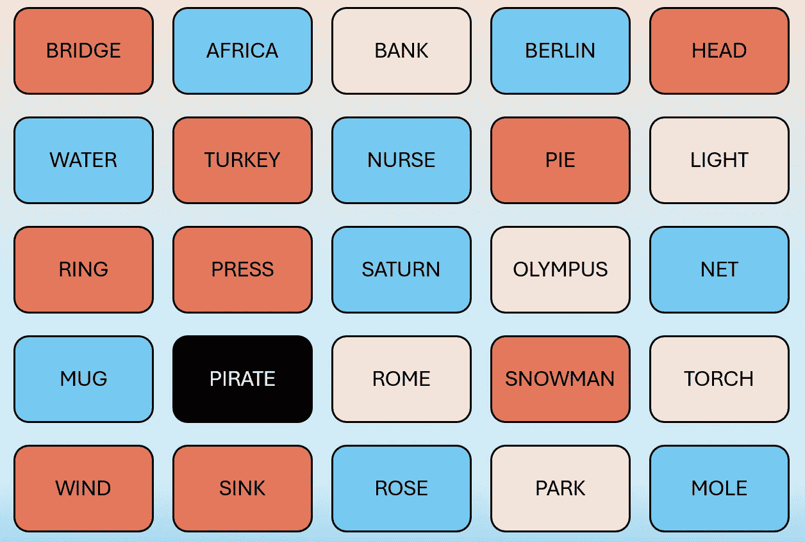
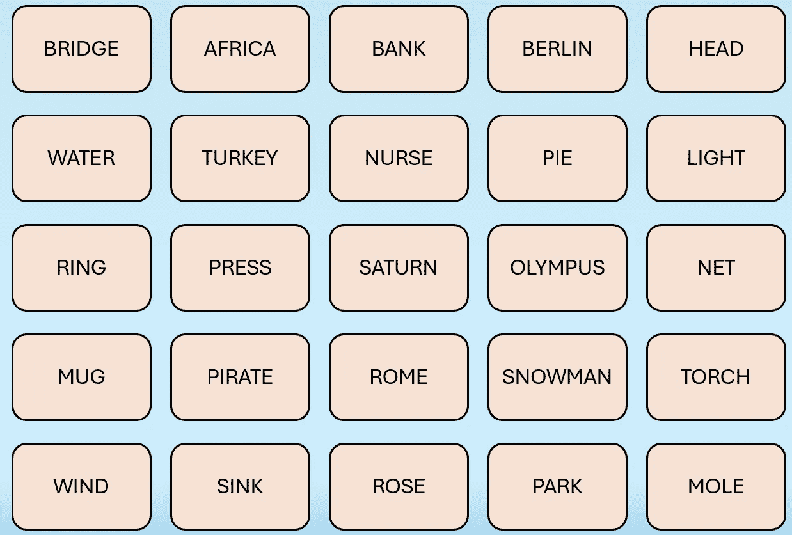
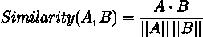
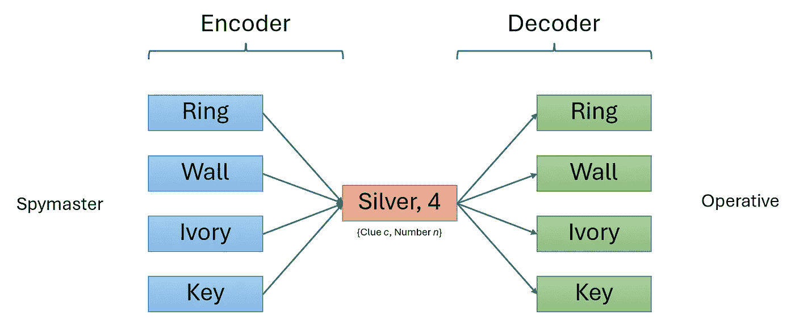
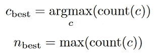
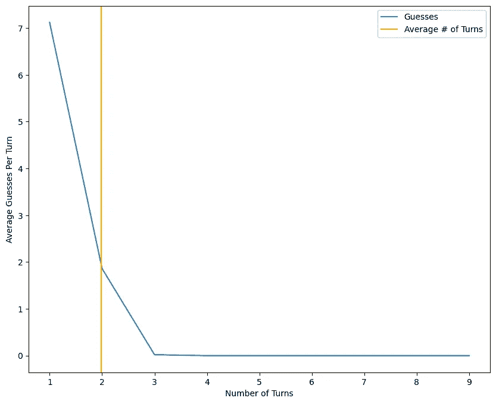
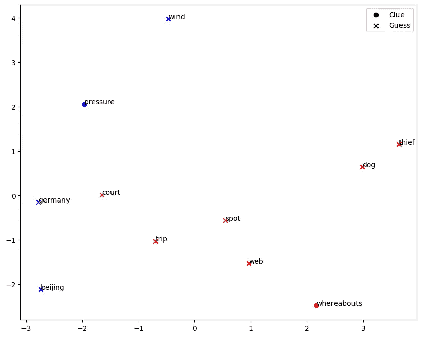

# 使用 GloVe 嵌入破解《代号》

> 原文：[`towardsdatascience.com/hacking-codenames-with-glove-embeddings-0cf928af0858?source=collection_archive---------7-----------------------#2024-07-16`](https://towardsdatascience.com/hacking-codenames-with-glove-embeddings-0cf928af0858?source=collection_archive---------7-----------------------#2024-07-16)

## 使用基于 GloVe 嵌入的算法，在流行派对游戏《代号》中实现 100%的准确性。

[](https://jiangzh.medium.com/?source=post_page---byline--0cf928af0858--------------------------------)[](https://towardsdatascience.com/?source=post_page---byline--0cf928af0858--------------------------------) [Zhiheng Jiang](https://jiangzh.medium.com/?source=post_page---byline--0cf928af0858--------------------------------)

·发表于[数据科学之路](https://towardsdatascience.com/?source=post_page---byline--0cf928af0858--------------------------------)·阅读时间 7 分钟·2024 年 7 月 16 日

--

# 介绍

[代号](https://codenames.game/)是一个流行的派对游戏，适合两队，每队由两名玩家组成，每队包括一个间谍主人和一个操作员。每队在游戏板上会被分配一定数量的词卡。在每轮游戏中，间谍主人给出一个词线索，并说明该线索对应的词卡数量。操作员需要猜测哪些词卡属于他/她的队伍。目标是间谍主人给出好的线索，使得操作员能够用较少的回合猜出所有的词卡，且在对方队伍之前完成。此外，还有一张“刺客”卡，操作员一旦猜中该卡，队伍将立即输掉游戏。

在这个项目中，我们将使用一种简单的词向量算法，利用机器学习中预训练的词向量，尽可能少的尝试次数来最大化我们解游戏的准确性。

以下是游戏板的示例：



间谍主人视图（图片来源：作者）



操作员视图（图片来源：作者）

在间谍主人的卡片安排中，每张卡片的颜色代表红队、蓝队、中立（米色）和刺客卡（黑色）。

# 自动化间谍主人和操作员

我们将创建一个[算法](https://github.com/jzh001/codenames)，它可以扮演间谍主人和操作员的角色，自动进行游戏。在一个包含 25 张卡片的游戏板上，会有 9 张“好”卡和 16 张“坏”卡（其中包括 1 张“刺客”卡）。

## 使用 GloVe 嵌入表示意义

为了使间谍头目能够给操作员提供好的线索，我们的模型需要能够理解每个词的含义。表示词义的一种流行方法是通过词嵌入。在这个任务中，我们将使用预训练的 [GloVe 嵌入](https://nlp.stanford.edu/projects/glove/)，其中每个词由一个 100 维的向量表示。

然后，我们使用余弦相似度来计算两个词之间的相似性，余弦相似度是两个向量的点积除以它们的模长：



图片来源：作者

## 操作员：解码算法

在每轮中，操作员接收到一个线索 *c*，以及一个表示要猜测的词数的整数 *n*。换句话说，操作员必须解码一个 *{c, n}* 对，并一次选择 *n* 个词，直到选择到错误词并结束该轮。

我们的解码器是一个直接贪婪算法：简单地根据与线索词 *c* 的余弦相似度对剩余的所有词进行排序，并根据相似度得分选择前 *n* 个词。

## 间谍头目：编码算法

在每轮中，基于剩余的“好”词和“坏”词，间谍头目必须选择 *n* 个词，并决定一个线索 *c* 给予操作员。我们在这里做出的假设是，间谍头目和操作员一致同意上面提到的解码策略，因此操作员会选择最优的 *{c, n}* 来最大化被选择的正确词的数量。

在这一点上，我们可以观察到线索 *c* 是一个信息瓶颈，因为它必须将 *n* 个词总结为一个单一的词 *c* 供操作员解码。编码后的线索的词向量与每个原始词向量位于同一个向量空间中。



编码器-解码器系统的机制（图片来源：作者）

**生成线索候选词**

词嵌入具有的特性使我们能够通过不同词向量的加法和减法来表示复合意义。给定“好”词集 *G* 和“坏”词集 *B*，我们可以利用这个特性，通过计算[标准化均值](https://github.com/piskvorky/gensim/blob/develop/gensim/models/keyedvectors.py#LC690:%7E:text=def%20most_similar,self%2C)来获得“好”词的“平均”意义，参考“坏”词，其中“好”词向量相加，“坏”词向量相减。这个平均向量使我们能够生成线索候选词：

```py
glove = api.load("glove-wiki-gigaword-100")

good_words = [g_1, g_2, ..., g_n]
bad_words = [b_1, b_2, ..., b_n]

candidates = glove.most_similar(positive=good_words,negative=bad_words,topn=20)
```

**负采样**

由于“坏”词的数量通常超过“好”词的数量，我们进行负采样，通过随机采样与“好”词数量相等的“坏”词来计算我们的平均词向量。这还增加了生成线索时的随机性，从而提高了线索候选词的多样性。

在我们找到平均词向量后，我们使用 Gensim 中的 *most_similar()* 函数，根据余弦相似度从整个 GloVe 词汇表中获得与平均词向量最接近的单词。

**评分函数**

现在，我们有一种方法可以根据给定的 *n* 个单词生成线索候选 *c*。然而，我们仍然需要决定选择哪个候选 *c*，选择哪些 *n* 个单词，以及如何确定 *n*。

接下来，我们从剩余的 *k* 个“*好*”单词中，按照 *k, k*-1, …, 1 的顺序生成所有可能的单词组合，并为每个组合生成相应的线索词候选 *c*，从 *k* 开始向回推。为了选择最佳的 *{c, n}*，我们通过解码算法对剩余的“好”单词的每个可能组合中的所有候选进行评分。然后，我们通过知道操作员将使用的策略，获得给定线索 *c* 时正确猜出的最大单词数量 count(c)。



图片由作者提供

# 结果

在每局游戏中，从 [一份包含 400 个常见 Codenames 单词的列表](https://github.com/Gullesnuffs/Codenames/blob/master/wordlist-eng.txt) 中抽取 25 个单词。总体而言，经过 100 次实验，我们的方法能够 100%正确选择单词，在平均 1.98 回合内完成游戏，或者每回合 4.55 次猜测（对于 9 个正确单词），最多需要 2 回合。



游戏进行时每回合的平均猜测次数（图片由作者提供）

换句话说，除少数例外情况外，这个算法几乎每局游戏都需要两回合，只有在一次回合中猜出所有单词时才会有例外。

让我们查看一下我们所做的线索和猜测的词嵌入分布示例。



1 局游戏的词嵌入散点图，经过 PCA 降维（图片由作者提供）

尽管生成的线索确实在某种程度上提供了操作员最终正确猜出的单词的语义摘要，但这些线索与猜测之间的关系从人类的角度来看可能并不明显。使线索更易于解释的一种方法是限制每回合最大猜测次数，这样可以生成更接近猜测语义的线索。

尽管如此，我们的算法仍然促进了每个单词的良好聚类结果，以便我们的解码器能够通过提供接近目标单词的良好线索，帮助它正确地猜出更多的单词。

# 结论

总结来说，这种基于贪婪的 GloVe 算法在 Codenames 游戏中作为间谍首领和操作员都表现得很好，它提供了一种有效的方式通过线索和数字来编码和解码单词。

在我们的模型中，编码器和解码器共享一个共同的策略，这个策略的工作原理与共享加密密钥类似。一个可能的限制是，编码器和解码器分开使用时效果不佳，因为人类玩家可能无法有效地解读生成的线索。

理解词嵌入和向量操作背后的机制是开始自然语言处理的一个极好方式。看到简单的方法也能在语义聚类和分类任务中表现出色，确实很有趣。为了进一步提升游戏体验，可以考虑加入强化学习元素或训练自编码器以获得更好的结果。

Github 仓库: [`github.com/jzh001/codenames`](https://github.com/jzh001/codenames)

# 参考文献

1.  Koyyalagunta, D., Sun, A., Draelos, R. L., & Rudin, C. (2021). 使用语言图和词嵌入玩 Codenames。*人工智能研究期刊*，*71*，319–346\. [`doi.org/10.1613/jair.1.12665`](https://doi.org/10.1613/jair.1.12665)

1.  Pennington, J., Socher, R., & Manning, C. (2014). Glove：用于词表示的全局向量。*2014 年自然语言处理经验方法会议（EMNLP）论文集*。 [`doi.org/10.3115/v1/d14-1162`](https://doi.org/10.3115/v1/d14-1162)

1.  Li, Y., Yan, X., & Shaw, C. (2022). Codenames AI [`xueweiyan.github.io/codenames-ai-website/`](https://xueweiyan.github.io/codenames-ai-website/)

1.  Friedman, D., & Panigrahi, A. (2021). Codenames 算法 [`www.cs.princeton.edu/~smattw/Teaching/521FA21/FinalProjectReports/FriedmanPanigrahi.pdf`](https://www.cs.princeton.edu/~smattw/Teaching/521FA21/FinalProjectReports/FriedmanPanigrahi.pdf)

1.  Jaramillo, C., Charity, M., Canaan, R., & Togelius, J. (2020). 词自机器人：使用变换器进行 Codenames 游戏中的词关联。*人工智能与互动数字娱乐会议论文集*，*16*(1)，231–237\. [`doi.org/10.1609/aiide.v16i1.7435`](https://doi.org/10.1609/aiide.v16i1.7435)
