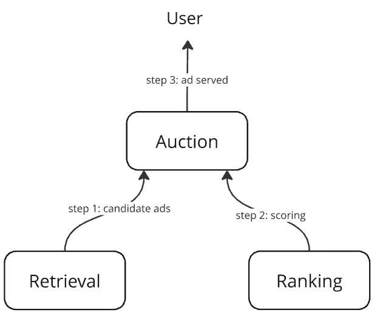
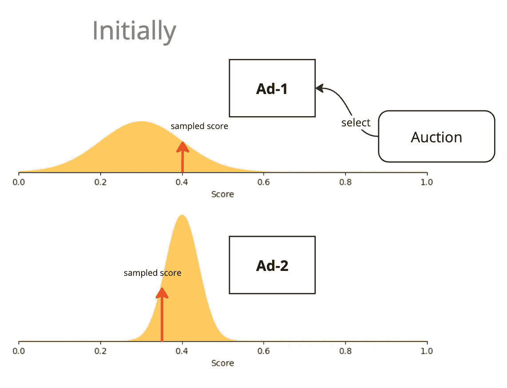
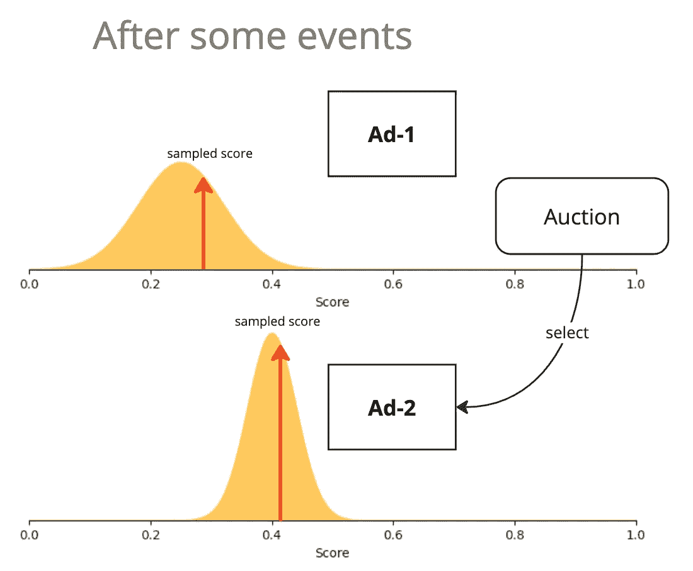
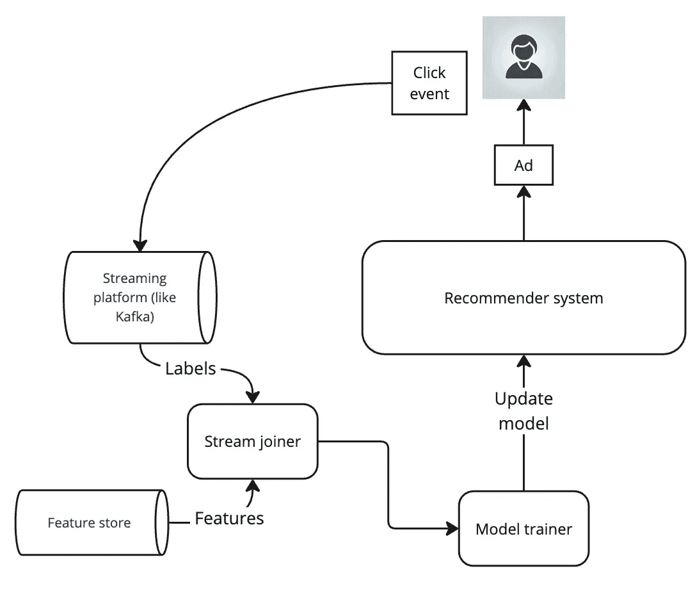
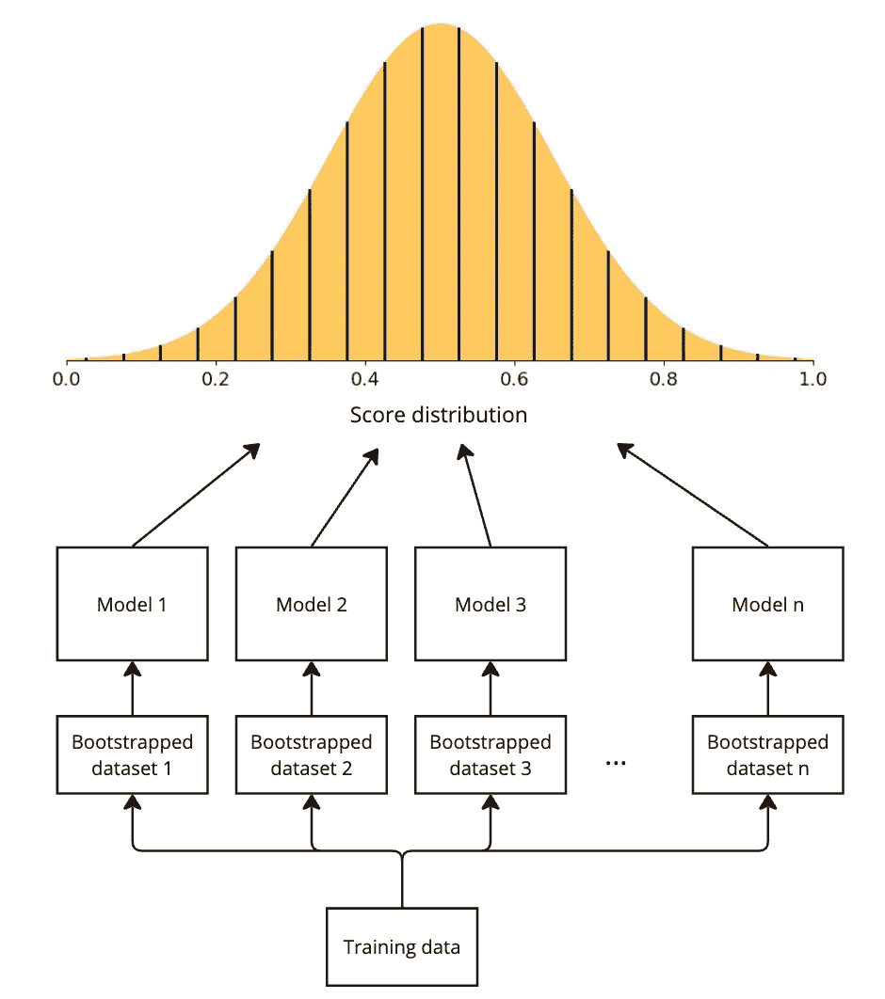

# 处理推荐系统中的反馈循环 — 深度贝叶斯赌博算法

> 原文：[`towardsdatascience.com/handling-feedback-loops-in-recommender-systems-deep-bayesian-bandits-e83f34e2566a?source=collection_archive---------6-----------------------#2024-07-31`](https://towardsdatascience.com/handling-feedback-loops-in-recommender-systems-deep-bayesian-bandits-e83f34e2566a?source=collection_archive---------6-----------------------#2024-07-31)

## 理解探索基本原理和深度贝叶斯赌博算法，解决推荐系统中的反馈循环问题

 [Sachin Hosmani](https://medium.com/@sachinhosmani?source=post_page---byline--e83f34e2566a--------------------------------)

·发表于[数据科学前沿](https://towardsdatascience.com/?source=post_page---byline--e83f34e2566a--------------------------------) ·阅读时长 11 分钟·2024 年 7 月 31 日

--

图像来源：ChatGPT-4o

# 介绍

推荐系统模型通常会被训练来优化用户的参与度，如点击和购买。这样做的出发点是希望优先推荐用户以前参与过的项目。然而，这会形成一个反馈循环，随着时间的推移，可能会导致“冷启动问题”。简而言之，用户历史上受欢迎的项目倾向于继续被模型青睐。相比之下，新颖但高度相关的项目却没有得到足够的曝光。在本文中，我将从基础开始介绍探索技术，并最终解释深度贝叶斯赌博算法——这是一种在[论文](https://arxiv.org/abs/2008.00727)中由郭大林等人描述的高效算法[1]。

# 广告推荐系统

让我们以一个简单的广告推荐系统作为示例，贯穿本文。

一个简单的三组件广告推荐系统。图像来源：作者

这是一个三组件系统

+   **检索**：一个高效地检索候选广告以供排序的组件

+   **排序**：一个深度神经网络，用于预测给定用户的广告点击率（CTR），作为广告的评分

    `score = predict_ctr(user features, ad features)`

+   **拍卖**：一个组件，负责

    - 为用户检索候选广告

    - 使用排序模型对其进行评分

    - 选择得分最高的广告并返回它*

本文的重点将专注于排序模型。

**真实世界的拍卖系统也会考虑广告的竞标金额，但为了简化问题我们忽略这一点。**

## 排名模型架构

排名模型是一个深度神经网络，给定用户和广告特征后，它可以预测广告的点击率（CTR）。为了简化起见，我在下面提出了一个简单的全连接 DNN，但实际上你可以使用诸如宽和深网络（wide-and-deep）、DCN 和 DeepFM 等技术来丰富该模型，而不会影响我在本文中解释的方法的适用性。

一个二分类器深度神经网络，预测 pCTR。图像由作者提供

## 训练数据

排名模型是基于包含点击数据（二进制标签）和用户与广告特征的拼接数据进行训练的。使用的特征集的具体内容对本文并不重要，但我假设其中包含了一些与广告商品牌相关的特征，以帮助模型学习用户对品牌的偏好。

包含样本特征的训练数据。图像由作者提供

# 冷启动问题

想象一下，我们成功地在广告点击数据集上训练了我们的排名模型，模型学会了我们的用户 Jane 喜欢购买“Vogue Voyage”品牌的包包。但市场上有一家新的包包公司“Radiant Clutch”，他们也卖着很棒的包包。然而，尽管“Radiant Clutch”进行了广告活动，旨在吸引像 Jane 这样的用户，Jane 从未看到过他们的广告。这是因为我们的排名模型已经深深地学会了 Jane 喜欢“Vogue Voyage”品牌的包包，只有他们的广告会展示给她。她有时会点击这些广告，而当模型在这些新点击上进一步训练时，只会加深模型的信念。这样就形成了一个恶性循环，导致某些商品一直处于黑暗中。

反馈循环的作用，导致冷启动问题：来自 Radiant Clutch 的包包毫无机会。图像由作者提供，缩略图由 ChatGPT-4o 生成

如果我们深思一下，就会意识到，模型并没有错，它通过学习得出“Jane 喜欢‘Vogue Voyage’品牌的包包”这一结论并没有问题。但问题在于，模型没有机会学习 Jane 对其他公司包包的兴趣。

## 探索与利用

这是一个引入“探索与利用”权衡的好时机。

**利用**：在广告拍卖过程中，一旦我们从排名模型中获得了点击率预测（CTR），我们就简单地选择得分最高的广告。这是一种 100%的利用策略，因为我们完全基于当前最佳的知识来获取最大的即时奖励。

**探索**：我们的方法缺乏的是愿意冒一些风险，即使广告未被赋予最高得分，也去展示该广告。如果我们这样做，用户可能会点击它，当模型根据这些数据更新时，它会学到一些新的信息。但如果我们从不冒这个险，模型将永远无法学到任何新东西。这就是探索的动机所在。

探索与开发是一个平衡的过程。探索过少会导致冷启动问题，而探索过多则可能向用户展示高度不相关的广告，从而失去用户信任和收入。

# 探索技术

现在我们已经为探索设定了舞台，接下来让我们深入探讨一些控制探索的具体技术。

## ε-贪婪策略

这里的想法很简单。在我们的拍卖服务中，当我们拥有所有候选广告的得分时，除了直接选择得分最高的广告外，我们还会做以下操作：

1.  在 0, 1)区间内选择一个随机数 r

1.  如果 r < ε，则从候选广告中随机选择一则广告（探索）

1.  否则，选择得分最高的广告（开发）

其中，ε是一个常量，我们在[0, 1)区间内仔细选择，知道该算法会以ε的概率进行探索，以 1 — ε的概率进行开发。

以 1 — ε的概率进行开发：选择点击率（CTR）最高的广告。图片来自作者

这是一种非常简单但强大的技术。然而，它可能过于天真，因为在进行探索时，它**完全随机**地选择广告。即使某个广告的预测点击率（pCTR）极低，且用户过去多次表示不喜欢，我们仍然可能展示该广告。这可能有些严苛，并可能导致收入和用户信任的严重损失。我们当然可以做得更好。

## 上置信界限（UCB）

我们进行探索的动机是确保所有广告候选项都有机会展示给用户。但随着广告的曝光，如果用户仍然没有与之互动，那么减少未来的曝光将变得明智。因此，我们需要一种机制，依据广告的得分估算以及广告已接收的曝光量来选择广告。

假设我们的排名模型不仅能预测点击率（CTR）得分，还能给出该得分的置信区间*。

**如何实现这一点将在文章后面进行解释**

模型会预测一个置信区间，并给出相应的得分。图片来自作者

这样的置信区间通常与广告接收到的曝光量成反比，因为广告展示给用户的次数越多，我们获得的用户反馈就越多，这减少了不确定性区间。

对广告的增加曝光会导致模型得分预测的置信区间减少。图片来自作者

在拍卖过程中，我们并不是选择具有最大 pCTR 的广告，而是选择具有最高上置信界限的广告。这个方法叫做 UCB。其背后的理念是“在不确定面前保持乐观”。这种方法有效地考虑了广告的分数估计以及它的不确定性。

UCB 实际应用：Ad-1 最初因其较大的置信区间赢得了拍卖，但随着模型对其的学习，其 UCB 降低，导致 Ad-2 赢得了拍卖。图像来自作者

## 汤普森采样

UCB 方法采用了“（完全的）在不确定面前保持乐观”的理念。汤普森采样则在此基础上稍微缓和了这种乐观。与其使用上置信界限作为广告的分数，为什么不在后验分布中抽样一个分数呢？

为了使这成为可能，假设我们的排名模型不仅能生成 CTR 和置信区间，还能生成一个实际的分数分布。

**如何实现这一点将在文章后面解释**

模型可以预测一个广告的分数分布。图像来自作者

然后，我们从这个分布中抽样一个分数，并在拍卖中使用这个分数。

Ad-1 因从其宽分布中抽样得到一个高分而赢得了拍卖。图像来自作者

Ad-1 已经获得曝光，模型对其的不确定性较小。由于 Ad-2 具有更高的分数分布质量，它赢得了拍卖。图像来自作者

随着 Ad-2 获得更多曝光，其分数分布的标准差进一步缩小。图像来自作者

# 更新模型的重要性

为了使 UCB 和汤普森采样技术生效，我们必须尽可能频繁地更新模型。只有这样，它才能根据用户反馈更新其不确定性估计。理想的设置是一个**连续学习**设置，其中用户反馈事件几乎实时地发送给模型，以更新其权重。然而，如果建立连续学习基础设施的成本过高，定期更新模型权重也是一种可行的选择。

一个高层次的连续学习设置，利用流媒体基础设施。图像来自作者，缩略图由 ChatGPT-4o 生成

# 后验近似技术

在 UCB 和汤普森采样方法中，我解释了我们的模型不仅产生一个分数，还会产生一个不确定性度量（可以是置信区间或分数分布）。这怎么可能呢？毕竟我们的 DNN 只能产生一个输出！下面是论文中讨论的几种方法。

## 自助法

统计学中的引导法简单来说就是带替换的抽样。这对我们来说意味着，我们在训练数据集上应用引导法，创建多个彼此密切相关但略有不同的数据集，并使用每个数据集训练一个独立的模型。这样学到的模型将会是彼此的轻微变体。如果你学习过决策树和集成法，你就会熟悉训练多个相关的树，这些树是彼此的轻微变体的这一思想。

引导数据集用于训练独立的模型，从而产生一个分数分布。图像由作者提供

在拍卖中，对于每个广告，我们从每个引导模型中得到一个分数。这为我们提供了一个分数分布，这正是我们所需要的用于汤普森采样。我们还可以从这个分布中提取置信区间，如果我们选择使用上置信边界（UCB）。

这种方法的最大缺点是训练和服务多个模型所带来的计算和维护开销。

## 多头引导法

为了降低多个引导模型的成本，这种方法将多个模型统一成一个多头模型，每个输出对应一个头部。

多头模型。图像由作者提供

关键的成本减少来自于所有层，除了最后一层，都是共享的这一事实。

训练仍然在引导数据子集上按常规进行。虽然每个引导数据子集应该用来更新所有共享层的权重，但必须注意仅使用一部分数据来更新一个输出头部的权重。

每个引导数据子集在反向传播过程中对一个头部的有限影响。图像由作者提供

## 随机梯度下降法（SGD）

我们可以不使用独立的引导数据集来训练不同的模型，而是只使用一个数据集，通过随机初始化权重训练每个模型，从而利用 SGD 提供的固有随机性。这样训练出的每个模型都会成为其他模型的一个变体。

## 多头 SGD

同样地，使用多头架构将使用引导法训练的模型数减少到一个，我们也可以使用多头架构与 SGD。我们只需要在每个头部随机初始化权重，这样在整个数据集上训练时，每个头部将学到是其他头部的轻微变体。

## 前向传播中的丢弃法

Dropout（丢弃法）是一种著名的正则化技术，在模型训练过程中，某一层的部分节点会随机丢弃，以防止过拟合。在这里，我们借用了这一思想，只不过我们是在前向传播过程中使用它来创造受控的随机性。

我们修改了排名模型的最后一层，加入了 dropout。然后，当我们想要为一个广告打分时，我们将它通过模型多次，每次得到的分数都会略有不同，这是由于 dropout 引入的随机性。这为我们提供了我们所需的分布和置信区间。

相同的模型通过随机 dropout 生成分数分布。图片由作者提供

这种方法的一个显著缺点是，它需要多次完整的前向传递，这在推理时可能会非常耗时。

## 混合方法

在混合方法中，我们进行了一项关键优化，既能够利用 dropout 和自助法的优势，又能降低服务和训练成本：

+   通过将 dropout 应用于倒数第二层，我们无需多次完整前向传递即可生成分数分布。我们可以执行一次前向传递，直到 dropout 层，然后并行地执行多个 dropout 层的调用。这为我们提供了与多头模型相同的效果，其中每个 dropout 输出像一个多头输出。

此外，dropout 通过随机停用一个或多个节点，充当其层次中高阶特征的伯努利掩码，从而产生类似自助法的效果，使用数据集的不同子集。

# 哪种方法最有效？

不幸的是，没有简单的答案。最好的方法是在你问题的限制下进行实验，看看什么最有效。但如果参考《Deep Bayesian Bandits》[论文](https://arxiv.org/pdf/2008.00727)的作者的发现，

1.  ε-贪婪方法由于其简单的探索方式，给出了最低的 CTR 提升，然而，它的简单性和低成本特性使得它非常有吸引力。

1.  UCB 通常优于汤普森采样。

1.  自助法 UCB 提供了最高的 CTR 回报，但由于需要处理多个模型，它也是计算成本最高的。

1.  依赖于倒数第二层 dropout 的混合模型需要更多的训练轮次才能表现良好，并且与 SGD UCB 的性能相当，但计算成本较低。

1.  模型的 PrAuc 在离线测量时与 CTR 增益呈反比关系：这是一个重要的观察结果，表明离线表现可以通过提供更容易的训练数据（例如，不包含显著探索的数据）轻松实现，但这并不总能转化为在线 CTR 的提升。这强调了稳健在线测试的重要性。

也就是说，针对不同的数据集和问题，结果可能会有很大不同。因此，现实世界中的实验仍然至关重要。

# 结论

在本文中，我介绍了推荐系统中由反馈循环引发的冷启动问题。根据《深度贝叶斯赌博机》一文，我们将广告推荐系统框架化为 k 臂赌博机，并看到了强化学习技术在缓解冷启动问题方面的许多实际应用。我们还初步探讨了在神经网络中捕捉不确定性的问题，这为贝叶斯网络的讨论提供了良好的过渡。

[1] Guo, Dalin, et al. “深度贝叶斯赌博机：探索在线个性化推荐。” *第 14 届 ACM 推荐系统会议论文集*。2020 年。
