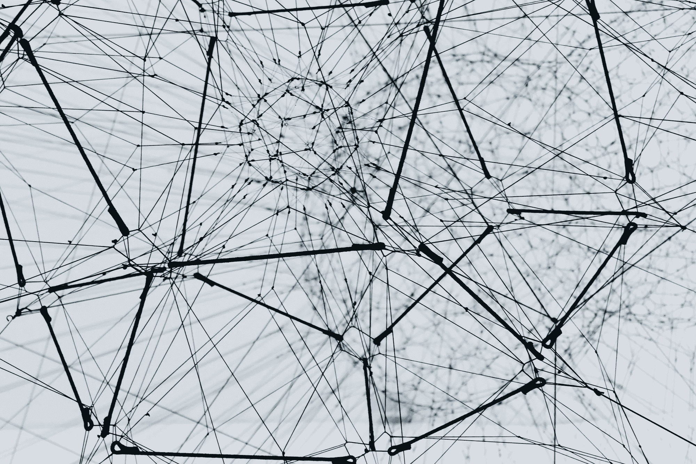

# 《动手实践神经网络与时间序列，使用 Python》

> 原文：[`towardsdatascience.com/hands-on-neural-networks-and-time-series-with-python-a61d7d75f3d9?source=collection_archive---------3-----------------------#2024-08-30`](https://towardsdatascience.com/hands-on-neural-networks-and-time-series-with-python-a61d7d75f3d9?source=collection_archive---------3-----------------------#2024-08-30)

## 从非常简单的前馈神经网络到壮丽的变换器：你需要了解的一切。

 [Piero Paialunga](https://piero-paialunga.medium.com/?source=post_page---byline--a61d7d75f3d9--------------------------------)

·发表于[Towards Data Science](https://towardsdatascience.com/?source=post_page---byline--a61d7d75f3d9--------------------------------) ·阅读时间：12 分钟·2024 年 8 月 30 日

--

图片来自[Alina Grubnyak](https://unsplash.com/@alinnnaaaa?utm_source=medium&utm_medium=referral)在[Unsplash](https://unsplash.com/?utm_source=medium&utm_medium=referral)上的作品

在我攻读本科学位时，我最喜欢的教授曾告诉我：

> 一旦某个事物足够好用，没人再会称它为“人工智能”。

这个概念与[拉里·泰斯勒](https://en.wikipedia.org/wiki/Larry_Tesler)的观点一致，他曾说过：“**AI 就是尚未实现的事物**。”人工智能的第一个例子是计算器，它能够在瞬间完成非常复杂的数学计算，而人类则需要几分钟甚至几小时。然而，当我们今天谈论人工智能时，我们并不会想到计算器。我们不会想到它，因为它的工作方式已经非常出色，大家习以为常。谷歌搜索算法，在许多方面比计算器更复杂，是我们日常生活中使用的人工智能之一，但我们却很少会去思考它。

那么，什么才是真正的“人工智能”？我们什么时候不再定义某个事物为人工智能？

这个问题相当复杂，因为如果我们真正思考，人工智能有多个**层次**和**领域**。
