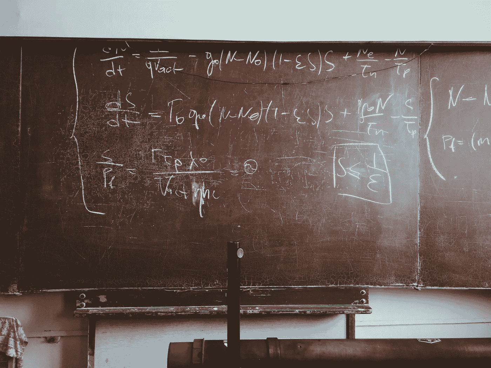

# 使用 Python 进行数值微分实战，从零到英雄

> 原文：[`towardsdatascience.com/hands-on-numerical-derivative-with-python-from-zero-to-hero-79eb5b5ffabf?source=collection_archive---------1-----------------------#2024-09-22`](https://towardsdatascience.com/hands-on-numerical-derivative-with-python-from-zero-to-hero-79eb5b5ffabf?source=collection_archive---------1-----------------------#2024-09-22)

## 这里是你需要知道的所有内容（超越标准定义），让你掌握数值微分的世界。

 [Piero Paialunga](https://piero-paialunga.medium.com/?source=post_page---byline--79eb5b5ffabf--------------------------------)

·发布于 [Towards Data Science](https://towardsdatascience.com/?source=post_page---byline--79eb5b5ffabf--------------------------------) ·9 分钟阅读·2024 年 9 月 22 日

--

由 [Roman Mager](https://unsplash.com/@roman_lazygeek?utm_source=medium&utm_medium=referral) 提供的照片，来源于 [Unsplash](https://unsplash.com/?utm_source=medium&utm_medium=referral)

有一个**传奇性的**说法，你可以在每个大学的至少一个实验室找到，它是这样的：

> 理论是你知道一切，但什么都不起作用。
> 
> 实践是当一切都能奏效，但没有人知道为什么时。
> 
> 在这个实验室，我们将理论与实践结合：什么都不起作用，且没有人知道为什么。

我发现这句话在数据科学领域**非常贴切**。我之所以这么说，是因为数据科学一开始是一个**数学**问题（***理论***）：你需要最小化一个损失函数。然而，当你进入**现实生活（实验/实验室）**时，事情开始变得非常混乱，你完美的理论世界假设可能不再适用（它们从未奏效过），而你也不知道为什么。

比如，拿**导数**这个概念来说。每个接触过数据科学复杂概念的人都知道（或者，更好的是，**必须**知道）导数是什么。但是，**如何**将导数这一优雅且理论化的概念**应用到现实生活中**，应用到一个噪声信号上，在这种情况下你没有分析式…
