# 细金属棒中的热扩散

> 原文：[`towardsdatascience.com/heat-diffusion-in-a-thin-metal-rod-faab655cb02c?source=collection_archive---------9-----------------------#2024-07-10`](https://towardsdatascience.com/heat-diffusion-in-a-thin-metal-rod-faab655cb02c?source=collection_archive---------9-----------------------#2024-07-10)

## 热扩散方程的解满足傅里叶级数

 [Sébastien Gilbert](https://sebastiengilbert.medium.com/?source=post_page---byline--faab655cb02c--------------------------------)

·发表于 [Towards Data Science](https://towardsdatascience.com/?source=post_page---byline--faab655cb02c--------------------------------) ·9 分钟阅读·2024 年 7 月 10 日

--

如果你加热一段绝缘金属棒的某个小部分，并将其静置一段时间，会发生什么？我们对热扩散的日常经验使我们预测，温度会逐渐均匀，直到变得一致。在完美绝缘的情况下，热量将永远停留在金属中。

这是对该现象的正确定性描述，但如何定量描述它呢？

图片由 [Jonny Gios](https://unsplash.com/@supergios?utm_source=medium&utm_medium=referral) 提供，来自 [Unsplash](https://unsplash.com/?utm_source=medium&utm_medium=referral)

我们考虑一个一维问题，即一个包裹在绝缘材料中的细金属棒。绝缘层阻止热量从金属棒的侧面逸出，但热量可以沿着棒的轴向流动。

你可以在 [这里](https://github.com/sebastiengilbert73/heated_metal_bar)找到本文中使用的代码。

# 热扩散方程

[热扩散方程](https://en.wikipedia.org/wiki/Heat_equation)是一个简单的二阶微分方程，涉及两个变量：

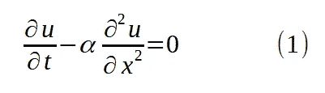

x ∈ [0, L] 是杆件上的位置，t 是时间，u(x, t) 是温度，α 是材料的 [热扩散率](https://en.wikipedia.org/wiki/Thermal_diffusivity)。

> 通过分析热扩散方程，我们能获得哪些关于温度变化的直觉？

方程(1)说明了**温度变化的局部速率与曲率成正比，即温度分布对 x 的二阶导数**。

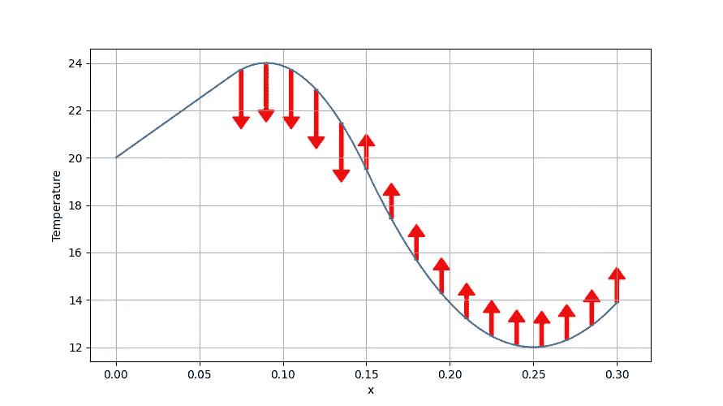

图 1：带有局部变化率的温度分布。图像由作者提供。

图 1 展示了一个包含三个部分的温度分布。第一部分是线性的；第二部分有负的二阶导数，第三部分有正的二阶导数。红色箭头显示了沿杆的温度变化速率。

如果达到了稳态，即∂u/∂t = 0，温度分布将会平滑直到温度分布变为线性。

# 热扩散方程的解

热扩散方程（1）的解¹是：

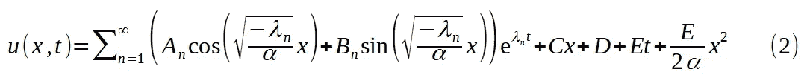

你可以通过对方程（2）求导来验证它确实满足方程（1）。对于那些对推导过程感兴趣的人，请参见附录 I。

系数{Aₙ}、{Bₙ}、{λₙ}、C、D 和 E 是常数，必须根据初始条件和边界条件进行拟合。[我们关于傅里叶级数的研究将发挥作用](https://medium.com/towards-data-science/assorted-flavors-of-fourier-series-on-a-finite-domain-8c93904df6ae)！

# 边界条件

边界条件是施加在 x=0 和 x=L 处的约束条件。在实际情况下，我们会遇到两种类型的约束条件：

+   绝缘，意味着在杆的两端∂u/∂x=0。这个约束防止了热量的流入或流出；

+   杆端固定温度：例如，杆的尖端可以通过[热电冷却器](https://en.wikipedia.org/wiki/Thermoelectric_cooling)进行加热或冷却，保持在所需的温度。

约束类型的组合将决定傅里叶级数的适当形式来表示初始温度分布。

## 两端绝缘

当杆的两端绝缘时，温度分布的梯度在 x=0 和 x=L 处被设为零：

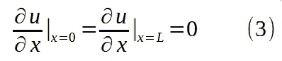

初始条件是 t=0 时杆上的温度分布。假设由于某些难以理解的原因——也许杆被某种邪恶力量附身——温度分布如下：

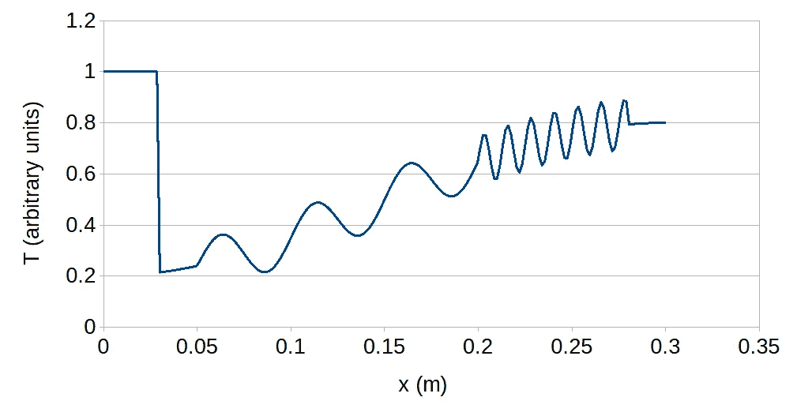

图 2：初始温度分布。图像由作者提供。

为了运行我们的温度演化仿真，我们需要将方程（2）在 t=0 时的值与该函数匹配。我们通过样本点知道初始温度分布，但不知道其解析表达式。这正是傅里叶级数展开的任务。

从[我们关于傅里叶级数的研究](https://medium.com/towards-data-science/assorted-flavors-of-fourier-series-on-a-finite-domain-8c93904df6ae)中，我们观察到*偶数半区扩展*会产生一个在两端导数为零的函数。这正是我们在本例中需要的。

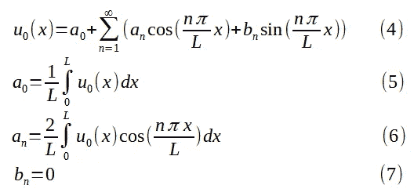

图 3 展示了图 2 中函数的偶数半区扩展：

图 3：图 2 的函数的半范围展开。图片来自作者。

尽管重构中使用的有限项数在不连续点处产生了一些波动，但在极限点处导数为零。

将方程 (4)、(5)、(6) 和 (7) 与在 t=0 时评估的方程 (2) 进行等式比较：

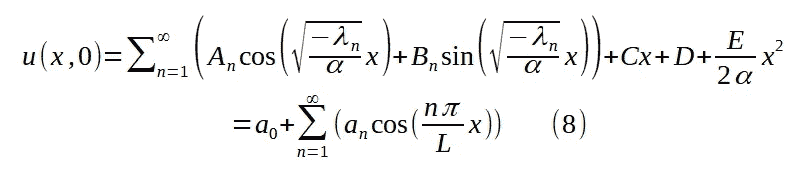

我们可以解出常数：

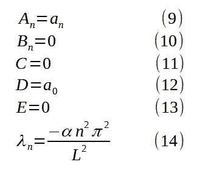

仔细看看 (14)。这个表达式表明 λₙ 与 n 的平方成正比，其中 n 是特定余弦项在区间 [0, L] 内经过的半周期数。换句话说，n 与空间频率成正比。方程 (2) 包含一个指数因子 exp(λₙt)，迫使每个频率分量随时间衰减。由于 λₙ与频率的平方成正比，我们预测初始温度轮廓的高频分量会比低频分量更快地衰减。

图 4 显示了 u(x, t) 在第一秒内的图像。我们观察到，右侧的高频分量在 0.1 秒内消失。中央部分的中等频率分量显著衰减，但在 1 秒后仍然可见。

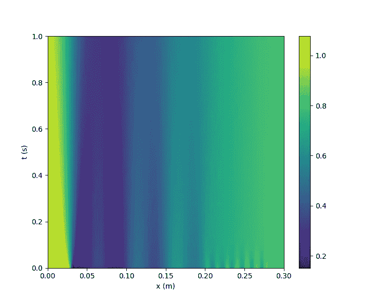

图 4：图 2 温度轮廓的 1 秒模拟。图片来自作者。

当仿真运行 100 秒时，我们得到几乎均匀的温度：

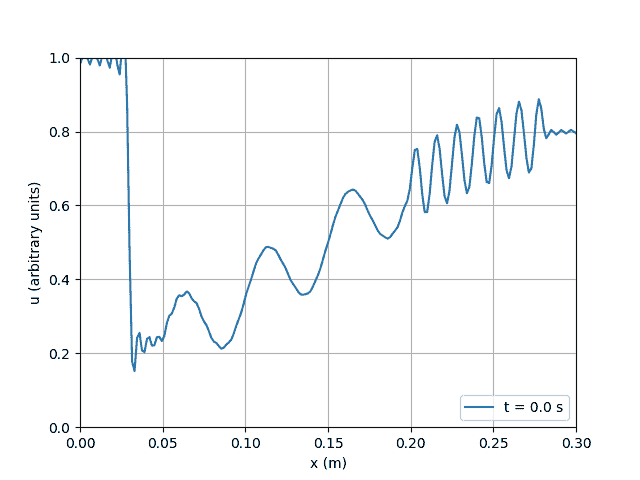

图 5：两端绝热条件下的 100 秒仿真。图片来自作者。

## 两端固定温度

当两端保持在常温时，我们有如下形式的边界条件：

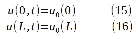

我们在上一篇文章中研究的傅里叶级数集没有包括边界温度固定为非零值的情况。我们需要重新构造初始温度轮廓 u₀(x)，以开发一个在 x=0 和 x=L 处评估为 0 的函数。我们定义一个偏移的初始温度轮廓 û₀(x)：

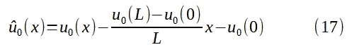

新定义的函数 û₀(x) 线性地将初始温度轮廓 u₀(x) 移动，使得 û₀(0) = û₀(L) = 0。

作为示例，图 6 显示了一个任意的初始温度轮廓 u₀，设置 x=0 时温度为 30，x=0.3 时温度为 70。绿色线（Cx + D）从 (0, 30) 到 (0.3, 70)。橙色曲线表示 û₀(x) = u₀(x) — Cx — D：

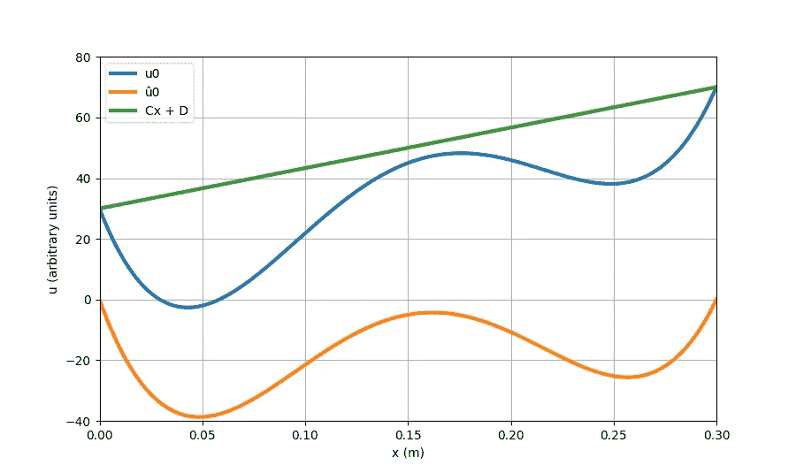

图 6：任意的 u₀(x)、û₀(x) 以及直线 Cx + D。图片来自作者。

将偏移的初始温度轮廓 û₀(x) 代入，并在两端为零，可以通过[奇数半范围展开](https://medium.com/towards-data-science/assorted-flavors-of-fourier-series-on-a-finite-domain-8c93904df6ae)来展开：

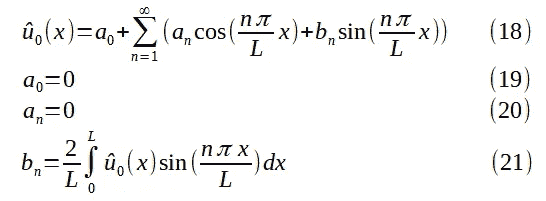

将方程 (2) 与 (17)、(18)、(19)、(20) 和 (21) 进行等式比较：

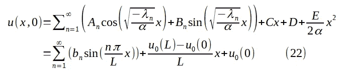

我们可以求解常数：

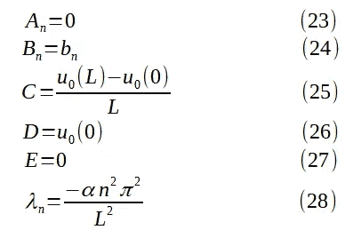

现在可以运行温度曲线随时间变化的模拟 u(x, t)，该方程来自于公式（2）：

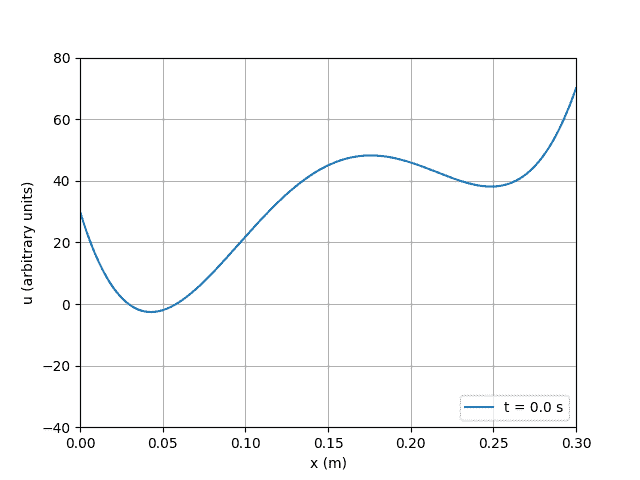

图 7：模拟温度演化，其中两端温度均保持恒定。图片由作者提供。

在稳态下，温度曲线在两端之间是线性的，恒定的热流通过金属杆传递。

## 左端绝热，右端温度固定

我们有以下边界条件：

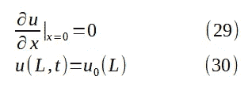

我们基本上按照之前的相同程序进行。这一次，我们使用[偶数区间展开](https://medium.com/towards-data-science/assorted-flavors-of-fourier-series-on-a-finite-domain-8c93904df6ae)来模拟初始温度分布，以便在左端获得零导数，在右端获得固定值：

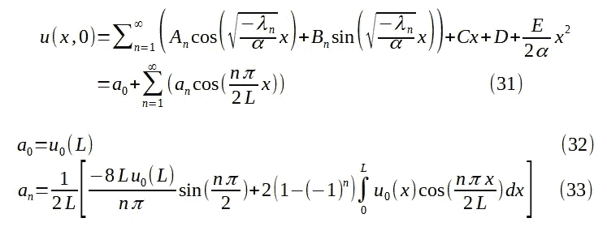

这导致了以下常数：

1000 秒的模拟展示了预期的行为。左端温度梯度为零，右端保持恒定温度。稳态是一个温度均匀的金属杆：

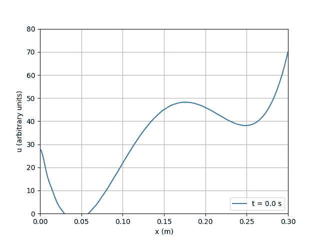

图 8：模拟温度演化，其中左端为绝热，右端温度保持恒定。图片由作者提供。

# 结论

我们回顾了薄金属杆中温度分布动态的问题。从控制方程出发，我们推导出了通解。

我们考虑了各种边界配置。这些边界情况促使我们根据前一篇文章中推导的[傅里叶级数形式](https://medium.com/towards-data-science/assorted-flavors-of-fourier-series-on-a-finite-domain-8c93904df6ae)来表示初始温度分布。初始温度分布的傅里叶级数表达式使我们能够求解积分常数，并运行 u(x, t)的模拟。

感谢您的阅读。您可以在[这个仓库](https://github.com/sebastiengilbert73/heated_metal_bar)中试验代码。告诉我您的想法！

¹ 如果有遗漏的项，请在评论中告诉我。

# 附录 I

我们想要证明热扩散方程的解是：

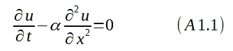

是：

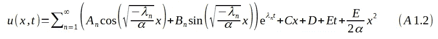

首先我们需要确认，如果一个函数 u*(x, t)满足（A1.1），那么函数 u*(x, t) + Cx + D + Et + E/(2α) x²也满足（A1.1）。

证明：

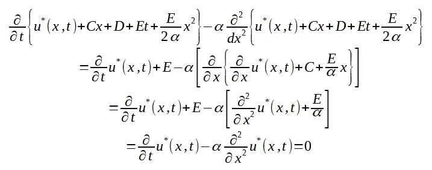

因此，通解必须包含 Cx + D + Et + E/(2α) x²项。

现在，信念的飞跃：*可分离性假设*。

假设一个解 u(x, t)具有以下形式：

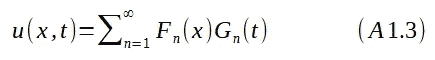

> 为什么要做这样的假设？

因为这将使得解更容易找到。如果我们能够找到一个有效的解，证明将在*事后*出现。在这种情况下，我们不会冒着基于错误假设得出错误结论的风险，因为我们总是可以对找到的解进行微分并检查它是否满足(A1.1)。

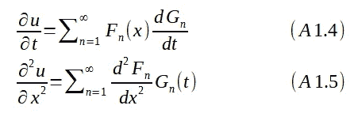

将(A1.4)和(A1.5)代入(A1.1)：

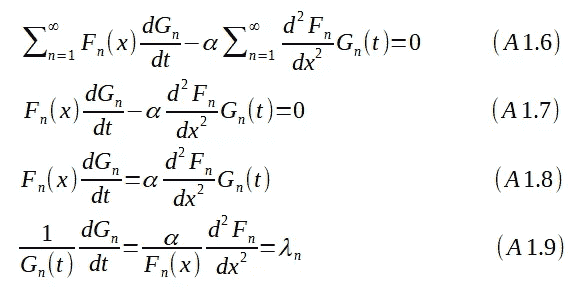

在方程(A1.9)中，我们观察到我们将 t 的函数与 x 的函数相等。满足此方程的唯一方法是让这两个函数都为常数。因此，我们引入了常数λₙ，它必须与这两个表达式匹配。

(a) 从(A1.9)解出 Gₙ(t)：

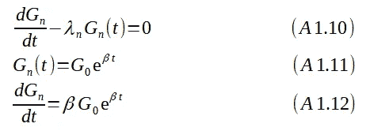

将(A1.11)和(A1.12)代入(A1.10)：

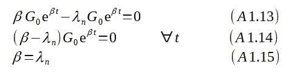

将(A1.15)代入(A1.11)：

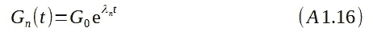

(b) 从(A1.9)解出 Fₙ(x)：

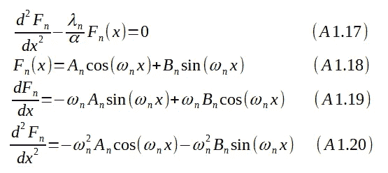

将(A1.18)和(A1.20)代入(A1.17)：

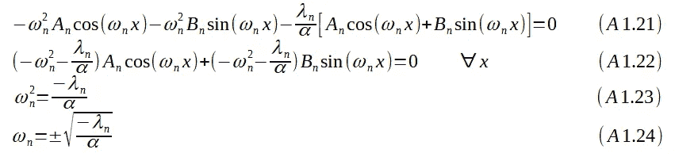

将(A1.24)代入(A1.18)：

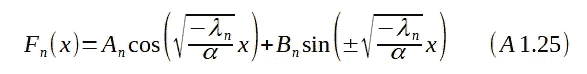

我们假设 Fₙ(x)是唯一的，并且正弦函数中的±符号被常数 Bₙ吸收。

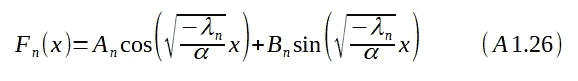

将(A1.16)和(A1.26)代入一般解中：

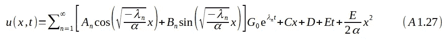

不失一般性，我们可以设置 G₀=1，并让它被常数 Aₙ和 Bₙ吸收：

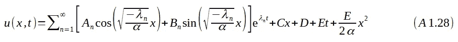

□
