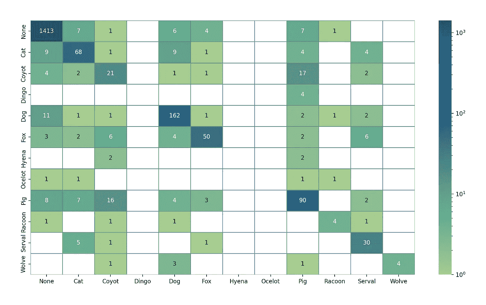
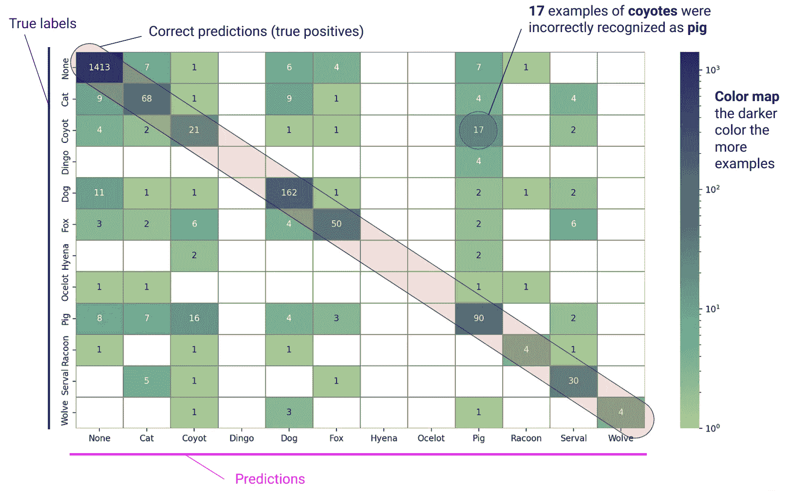

# Python 中的混淆矩阵热力图

> 原文：[`towardsdatascience.com/heatmap-for-confusion-matrix-in-python-20a9fc689665?source=collection_archive---------7-----------------------#2024-09-06`](https://towardsdatascience.com/heatmap-for-confusion-matrix-in-python-20a9fc689665?source=collection_archive---------7-----------------------#2024-09-06)

## 一张图片胜过千言万语。

 [Michał Marcińczuk, Ph.D.](https://czuk.medium.com/?source=post_page---byline--20a9fc689665--------------------------------)

·发表于 [Towards Data Science](https://towardsdatascience.com/?source=post_page---byline--20a9fc689665--------------------------------) ·6 分钟阅读·2024 年 9 月 6 日

--

图片来源：作者

# 介绍

混淆矩阵是展示机器学习模型犯错类型的便捷方式。它是一个 *N* 乘 *N* 的网格，其中 [n, m] 单元格中的值表示被标注为第 n 类但被识别为第 m 类的示例数量。在本教程中，我将重点介绍如何创建混淆矩阵及其热力图。将使用色彩调色板来展示不同组的大小，从而使得观察组间的相似性或显著差异变得更加容易。这种可视化在处理大量类别时非常有用。

这里是混淆矩阵元素的可视化解释。

图片来源：作者

请记住，用于演示混淆矩阵的数据是人工生成的，并不代表任何真实的分类模型。

现在，我将逐步讲解如何使用 Python 模块生成这样的混淆矩阵。

# Python 最基本入门
