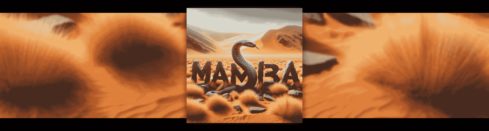

# Mamba 来了：选择性状态空间模型

> 原文：[`towardsdatascience.com/here-comes-mamba-the-selective-state-space-model-435e5d17a451?source=collection_archive---------4-----------------------#2024-09-03`](https://towardsdatascience.com/here-comes-mamba-the-selective-state-space-model-435e5d17a451?source=collection_archive---------4-----------------------#2024-09-03)

## [🐍 向 Mamba 状态空间模型迈进：适用于图像、视频和时间序列](https://towardsdatascience.com/tagged/mamba-image-video-signal)

## 第三部分 — 向 Mamba 状态空间模型迈进：适用于图像、视频和时间序列

 [Sascha Kirch](https://medium.com/@SaschaKirch?source=post_page---byline--435e5d17a451--------------------------------)

·发表于[Towards Data Science](https://towardsdatascience.com/?source=post_page---byline--435e5d17a451--------------------------------) ·阅读时间 17 分钟·2024 年 9 月 3 日

--

图片来源：[Sascha Kirch](https://medium.com/@SaschaKirch).

> 这是我新系列的第三部分：[🐍 向 Mamba 状态空间模型迈进：适用于图像、视频和时间序列](https://medium.com/@SaschaKirch/list/mamba-state-space-models-for-images-videos-and-timeseries-861ae0ad08fb)。

Mamba，这个被认为将取代强大的 Transformer 的模型，从最初在深度学习中使用状态空间模型（SSMs）的构想到现在，已经走过了很长的路。

Mamba 为状态空间模型添加了选择性，从而在保持 SSM 子二次工作复杂度的同时，实现了类似 Transformer 的性能。其高效的选择性扫描比标准实现快 40 倍，并且在吞吐量上可达到 Transformer 的 5 倍。

加入我，一同深入探讨 Mamba，我们将发现选择性如何解决以往状态空间模型（SSMs）的局限性，Mamba 如何克服这些变化带来的新挑战，以及我们如何将 Mamba 融入现代深度学习架构中。
